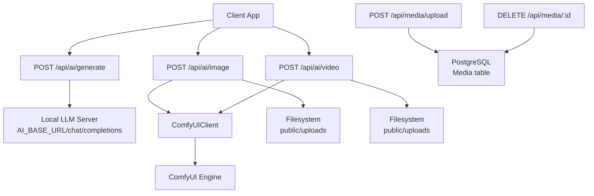
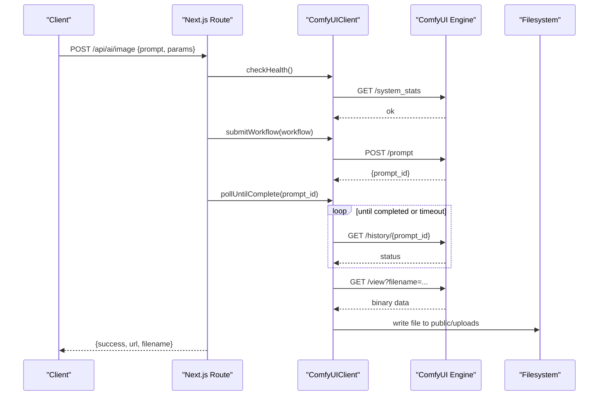
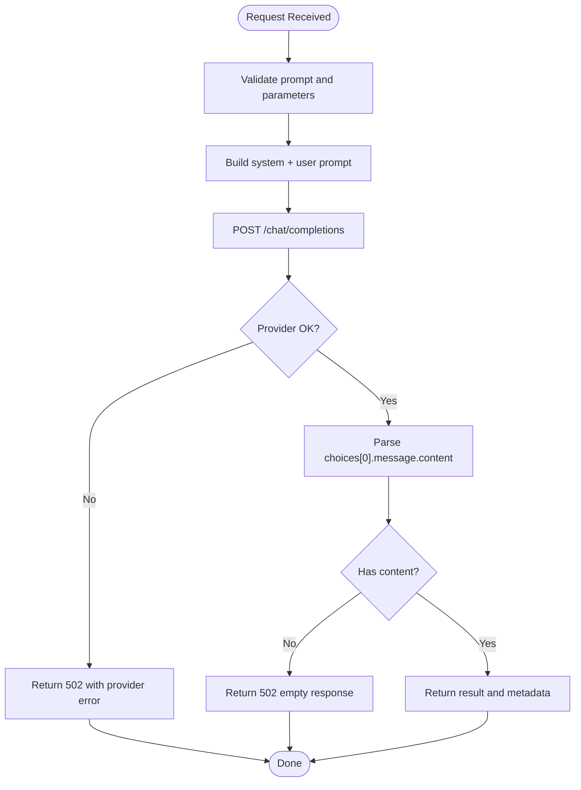
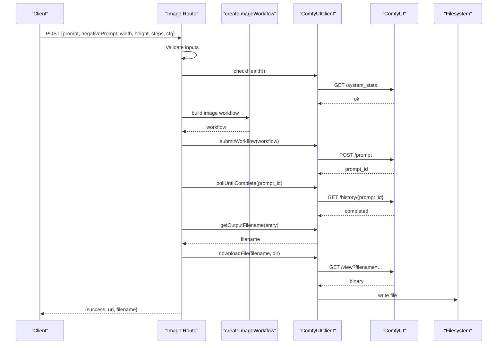
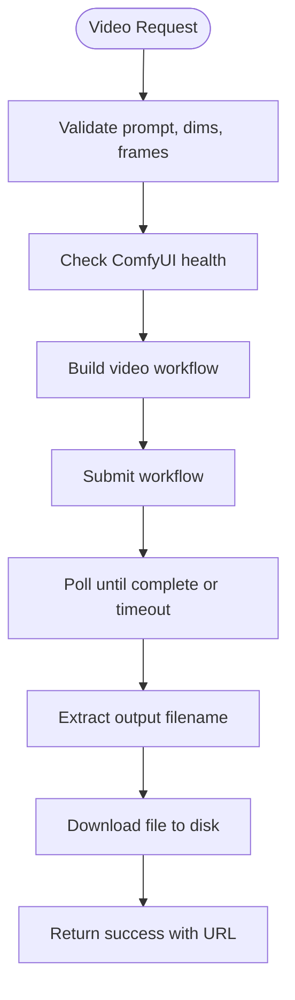
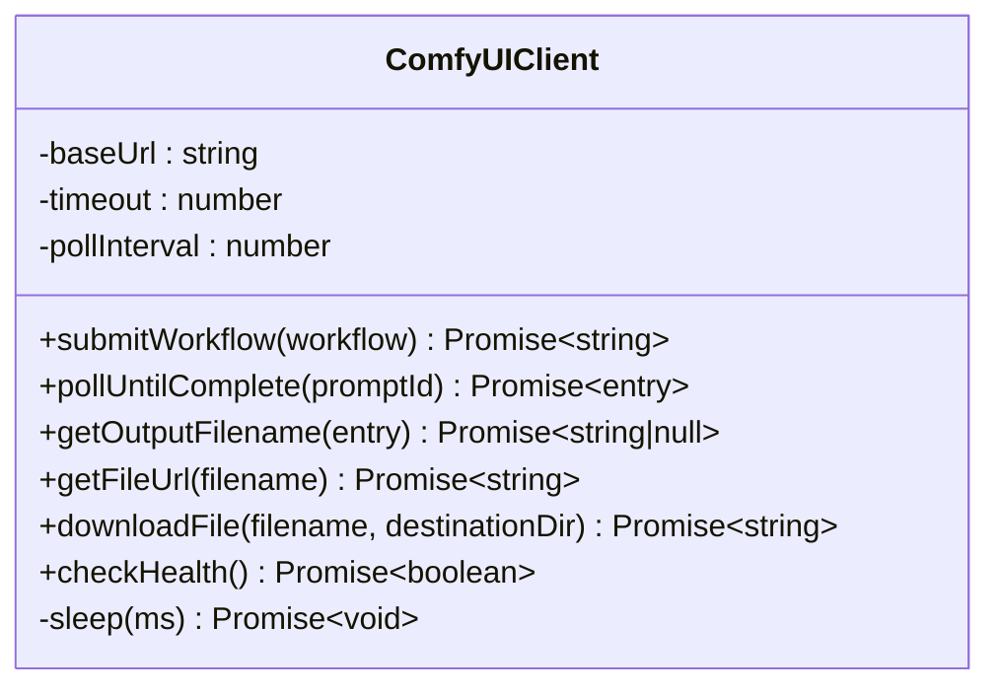
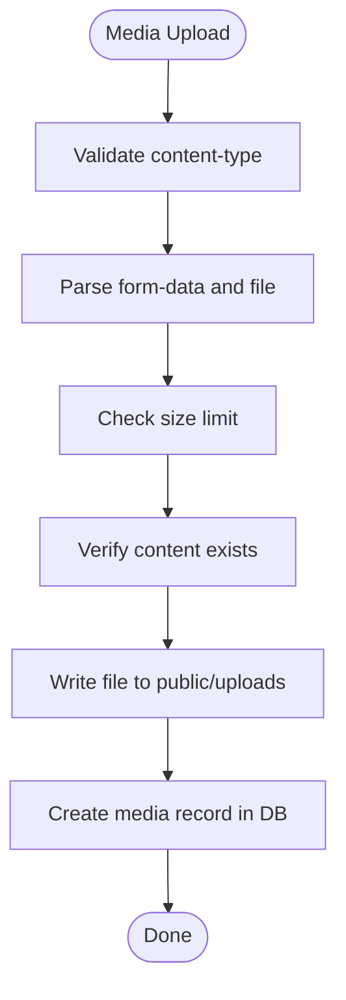
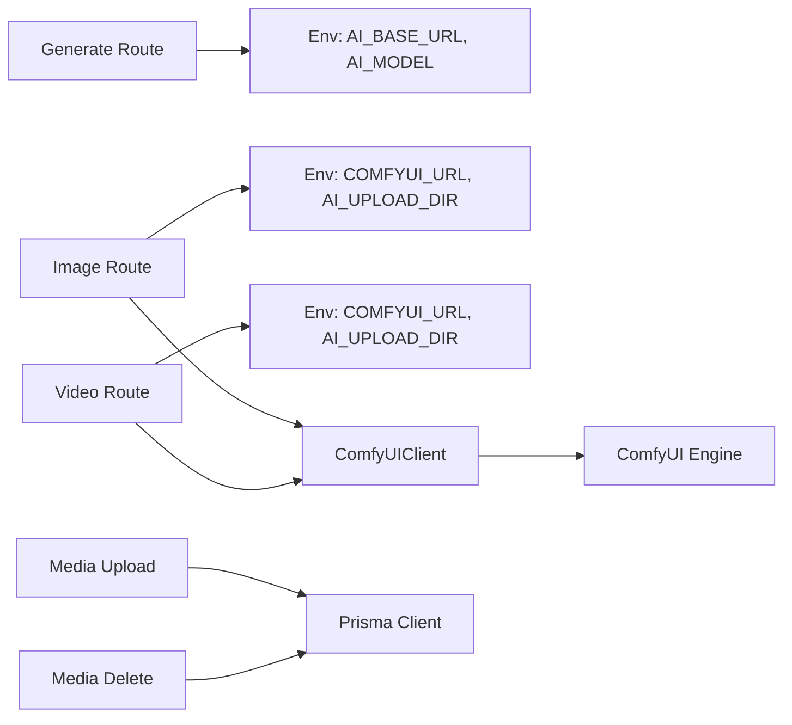

# AI Integration Architecture

<cite>
**Referenced Files in This Document**
- [generate route](file://app/api/ai/generate/route.ts)
- [image route](file://app/api/ai/image/route.ts)
- [video route](file://app/api/ai/video/route.ts)
- [ComfyUI client](file://lib/ai/comfyui.ts)
- [image workflow](file://lib/ai/workflows/image.ts)
- [video workflow](file://lib/ai/workflows/video.ts)
- [media upload route](file://app/api/media/upload/route.ts)
- [media delete route](file://app/api/media/[id]/route.ts)
- [Prisma schema](file://prisma/schema.prisma)
</cite>

## Table of Contents
1. Introduction
2. Project Structure
3. Core Components
4. Architecture Overview
5. Detailed Component Analysis
6. Dependency Analysis
7. Performance Considerations
8. Troubleshooting Guide
9. Conclusion
10. Appendices

## Introduction
This document explains the AI integration architecture in ContentOS. It covers how text generation and local media generation (images and videos) are orchestrated via Next.js API routes, how ComfyUI is used for local model execution, how generated assets are downloaded and stored, and how errors, timeouts, and resource usage are managed. It also provides guidance on extending the system with new providers or models, along with security, rate limiting, monitoring, troubleshooting, and performance optimization recommendations.

## Project Structure
The AI integration spans three layers:
- API Routes: Entry points for clients to request content generation or media creation.
- AI Client and Workflows: A reusable ComfyUI client and workflow builders for image and video generation.
- Storage and Persistence: Local file storage under public/uploads and database records for media metadata.

**Diagram sources**
- [generate route:1-218](file://app/api/ai/generate/route.ts#L1-L218)
- [image route:1-91](file://app/api/ai/image/route.ts#L1-L91)
- [video route:1-102](file://app/api/ai/video/route.ts#L1-L102)
- [ComfyUI client:1-161](file://lib/ai/comfyui.ts#L1-L161)
- [media upload route:1-126](file://app/api/media/upload/route.ts#L1-L126)
- [media delete route:1-74](file://app/api/media/[id]/route.ts#L1-L74)
- [Prisma schema:1-94](file://prisma/schema.prisma#L1-L94)

**Section sources**
- [generate route:1-218](file://app/api/ai/generate/route.ts#L1-L218)
- [image route:1-91](file://app/api/ai/image/route.ts#L1-L91)
- [video route:1-102](file://app/api/ai/video/route.ts#L1-L102)
- [ComfyUI client:1-161](file://lib/ai/comfyui.ts#L1-L161)
- [media upload route:1-126](file://app/api/media/upload/route.ts#L1-L126)
- [media delete route:1-74](file://app/api/media/[id]/route.ts#L1-L74)
- [Prisma schema:1-94](file://prisma/schema.prisma#L1-L94)

## Core Components
- Text Generation Route: Accepts prompts and tool parameters, builds a system prompt, and calls a local LLM endpoint. Returns structured results.
- Image Generation Route: Validates inputs, checks ComfyUI health, builds an image workflow, submits it, polls until completion, downloads the output, and returns a URL.
- Video Generation Route: Similar to image but constructs a video workflow and persists a video asset.
- ComfyUI Client: Encapsulates workflow submission, polling, output extraction, file download, and health checks with timeouts and configurable polling intervals.
- Workflow Builders: Create ComfyUI node graphs for images and videos with configurable parameters.
- Media Upload/Delete: Handles uploading user files to disk and recording metadata; supports deletion with filesystem cleanup.

**Section sources**
- [generate route:87-217](file://app/api/ai/generate/route.ts#L87-L217)
- [image route:11-90](file://app/api/ai/image/route.ts#L11-L90)
- [video route:11-101](file://app/api/ai/video/route.ts#L11-L101)
- [ComfyUI client:33-160](file://lib/ai/comfyui.ts#L33-L160)
- [image workflow:3-84](file://lib/ai/workflows/image.ts#L3-L84)
- [video workflow:3-101](file://lib/ai/workflows/video.ts#L3-L101)
- [media upload route:20-126](file://app/api/media/upload/route.ts#L20-L126)
- [media delete route:13-74](file://app/api/media/[id]/route.ts#L13-L74)

## Architecture Overview
The system exposes three primary API endpoints:
- POST /api/ai/generate: Text generation via a local LLM server.
- POST /api/ai/image: Image generation via ComfyUI workflows.
- POST /api/ai/video: Video generation via ComfyUI workflows.

All routes validate input, enforce timeouts, and return consistent error shapes. For media generation, the ComfyUI client manages long-running jobs by polling until completion and then downloading outputs into a configured directory. Uploaded media are persisted to disk and recorded in the database.

**Diagram sources**
- [image route:11-90](file://app/api/ai/image/route.ts#L11-L90)
- [ComfyUI client:44-143](file://lib/ai/comfyui.ts#L44-L143)

**Section sources**
- [image route:11-90](file://app/api/ai/image/route.ts#L11-L90)
- [video route:11-101](file://app/api/ai/video/route.ts#L11-L101)
- [ComfyUI client:44-143](file://lib/ai/comfyui.ts#L44-L143)

## Detailed Component Analysis

### Text Generation (POST /api/ai/generate)
- Input validation: Ensures prompt presence and normalizes optional fields like tool, platform, contentType, tone, length, context.
- Prompt assembly: Builds a system prompt based on selected workflow and constraints.
- LLM call: Sends a chat completions request to a local LLM server configured via environment variables.
- Response handling: Extracts the generated content and returns a structured JSON response. Errors from the provider are wrapped and returned with appropriate status codes.

**Diagram sources**
- [generate route:87-217](file://app/api/ai/generate/route.ts#L87-L217)

**Section sources**
- [generate route:87-217](file://app/api/ai/generate/route.ts#L87-L217)

### Image Generation (POST /api/ai/image)
- Input validation: Requires prompt and positive dimensions.
- Health check: Verifies ComfyUI availability before proceeding.
- Workflow construction: Uses the image workflow builder to create a node graph with sampler, loader, encoders, decoder, and saver nodes.
- Execution: Submits workflow, polls until complete, extracts output filename, downloads file, and returns a URL.

**Diagram sources**
- [image route:11-90](file://app/api/ai/image/route.ts#L11-L90)
- [image workflow:3-84](file://lib/ai/workflows/image.ts#L3-L84)
- [ComfyUI client:44-143](file://lib/ai/comfyui.ts#L44-L143)

**Section sources**
- [image route:11-90](file://app/api/ai/image/route.ts#L11-L90)
- [image workflow:3-84](file://lib/ai/workflows/image.ts#L3-L84)
- [ComfyUI client:44-143](file://lib/ai/comfyui.ts#L44-L143)

### Video Generation (POST /api/ai/video)
- Input validation: Requires prompt, positive dimensions, and frames within allowed range.
- Health check: Ensures ComfyUI is reachable.
- Workflow construction: Builds a video workflow using loaders, encoders, latent video, sampler, decoder, and video saver nodes.
- Execution: Same pattern as image generation with polling and file download.

**Diagram sources**
- [video route:11-101](file://app/api/ai/video/route.ts#L11-L101)
- [video workflow:3-101](file://lib/ai/workflows/video.ts#L3-L101)
- [ComfyUI client:44-143](file://lib/ai/comfyui.ts#L44-L143)

**Section sources**
- [video route:11-101](file://app/api/ai/video/route.ts#L11-L101)
- [video workflow:3-101](file://lib/ai/workflows/video.ts#L3-L101)
- [ComfyUI client:44-143](file://lib/ai/comfyui.ts#L44-L143)

### ComfyUI Client
- Configuration: Base URL, timeout, and poll interval can be set via options or environment variables.
- Workflow submission: Posts a workflow to /prompt with an AbortController-based timeout.
- Polling: Repeatedly queries /history/{prompt_id} until completed or error, respecting timeout and pollInterval.
- Output handling: Extracts filenames from node outputs and downloads files via /view endpoint.
- Health check: Lightweight probe to /system_stats with short timeout.

**Diagram sources**
- [ComfyUI client:1-161](file://lib/ai/comfyui.ts#L1-L161)

**Section sources**
- [ComfyUI client:1-161](file://lib/ai/comfyui.ts#L1-L161)

### File Handling System
- Uploads: The media upload route validates content type and size, writes files to public/uploads, and creates a database record linking the file to a content item.
- Deletion: The media delete route removes the file from disk and deletes the corresponding database record.
- Generated assets: Image and video routes download outputs from ComfyUI into the configured upload directory and return accessible URLs.

**Diagram sources**
- [media upload route:20-126](file://app/api/media/upload/route.ts#L20-L126)
- [media delete route:13-74](file://app/api/media/[id]/route.ts#L13-L74)
- [Prisma schema:39-55](file://prisma/schema.prisma#L39-L55)

**Section sources**
- [media upload route:20-126](file://app/api/media/upload/route.ts#L20-L126)
- [media delete route:13-74](file://app/api/media/[id]/route.ts#L13-L74)
- [Prisma schema:39-55](file://prisma/schema.prisma#L39-L55)

## Dependency Analysis
- API routes depend on:
  - Environment configuration for AI base URL, model name, ComfyUI URL, and upload directory.
  - ComfyUI client for local media generation.
  - Prisma client for media metadata persistence.
- Workflows encapsulate node definitions and are independent of routing logic.
- The ComfyUI client abstracts network interactions and lifecycle management for long-running tasks.

**Diagram sources**
- [generate route:1-218](file://app/api/ai/generate/route.ts#L1-L218)
- [image route:1-91](file://app/api/ai/image/route.ts#L1-L91)
- [video route:1-102](file://app/api/ai/video/route.ts#L1-L102)
- [ComfyUI client:1-161](file://lib/ai/comfyui.ts#L1-L161)
- [media upload route:1-126](file://app/api/media/upload/route.ts#L1-L126)
- [media delete route:1-74](file://app/api/media/[id]/route.ts#L1-L74)

**Section sources**
- [generate route:1-218](file://app/api/ai/generate/route.ts#L1-L218)
- [image route:1-91](file://app/api/ai/image/route.ts#L1-L91)
- [video route:1-102](file://app/api/ai/video/route.ts#L1-L102)
- [ComfyUI client:1-161](file://lib/ai/comfyui.ts#L1-L161)
- [media upload route:1-126](file://app/api/media/upload/route.ts#L1-L126)
- [media delete route:1-74](file://app/api/media/[id]/route.ts#L1-L74)

## Performance Considerations
- Timeouts:
  - ComfyUI operations use a global timeout to prevent hanging requests. Tune timeout and pollInterval based on expected workload and hardware capacity.
  - Health checks use a short timeout to fail fast when the engine is unavailable.
- Polling strategy:
  - Adjust pollInterval to balance responsiveness and load on the ComfyUI server.
- Resource limits:
  - Enforce maximum file sizes on uploads to avoid memory pressure.
  - Limit frames and steps for video generation to control GPU/CPU usage.
- Concurrency:
  - Each route invocation spawns its own ComfyUI client instance. Consider connection pooling or shared clients if running multiple concurrent requests in production environments.
- I/O:
  - Writing large files synchronously can block event loops. Consider streaming writes or background processing for very large assets.

[No sources needed since this section provides general guidance]

## Troubleshooting Guide
Common issues and resolutions:
- Empty or invalid prompt:
  - Ensure prompt is present and non-empty. Routes return 400 with descriptive errors.
- Invalid dimensions or frames:
  - Validate width, height, and frames ranges. Routes reject out-of-range values.
- ComfyUI offline:
  - Health checks will fail; ensure the ComfyUI service is running and reachable at the configured URL.
- Generation failures:
  - If no output filename is found after completion, the route returns a failure response. Check logs and workflow correctness.
- Provider errors:
  - Text generation wraps provider errors and returns 502 with details. Verify AI_BASE_URL and model availability.
- Upload failures:
  - Check content-type, file size, and existence of associated content. Database and filesystem permissions may also cause failures.
- Deletion issues:
  - Missing files result in ignored ENOENT errors during deletion; verify paths and permissions.

**Section sources**
- [image route:22-42](file://app/api/ai/image/route.ts#L22-L42)
- [video route:24-51](file://app/api/ai/video/route.ts#L24-L51)
- [ComfyUI client:72-103](file://lib/ai/comfyui.ts#L72-L103)
- [generate route:99-104](file://app/api/ai/generate/route.ts#L99-L104)
- [generate route:172-193](file://app/api/ai/generate/route.ts#L172-L193)
- [media upload route:24-65](file://app/api/media/upload/route.ts#L24-L65)
- [media delete route:37-50](file://app/api/media/[id]/route.ts#L37-L50)

## Conclusion
ContentOS integrates AI services through a clear separation of concerns: API routes handle input validation and orchestration, while reusable components manage external interactions and workflows. The ComfyUI client standardizes long-running job handling with robust timeouts and polling. File handling ensures generated assets are persisted and accessible. Extensibility is supported by modular workflow builders and environment-driven configuration. Security, rate limiting, and monitoring should be added at the edge to protect and observe AI integrations in production.

[No sources needed since this section summarizes without analyzing specific files]

## Appendices

### Extending with New AI Providers or Models
- Add a new workflow builder function that returns a ComfyUIWorkflow object with the required nodes and inputs.
- Create a new API route or extend existing routes to accept additional parameters and select the appropriate workflow.
- Configure environment variables for provider URLs and model names.
- Implement health checks and retries if necessary.

[No sources needed since this section provides general guidance]

### Security Considerations
- Validate and sanitize all inputs to prevent injection or malformed requests.
- Restrict allowed file types and sizes to mitigate abuse.
- Use environment variables for secrets and sensitive configuration.
- Consider adding authentication and authorization middleware to protect AI endpoints.

[No sources needed since this section provides general guidance]

### Rate Limiting and Monitoring
- Implement rate limiting at the API layer to protect downstream services.
- Log key metrics: request counts, latency, error rates, and provider health status.
- Monitor disk usage for uploaded and generated assets.
- Set up alerts for repeated failures or high latency.

[No sources needed since this section provides general guidance]

### Retry Mechanisms and Timeout Management
- Retries:
  - Add retry logic for transient network errors when calling ComfyUI or LLM endpoints.
  - Use exponential backoff to reduce load on failing services.
- Timeouts:
  - Keep global timeouts aligned with expected job durations.
  - Use shorter timeouts for health checks and quick validations.

[No sources needed since this section provides general guidance]

### Connection Pooling and Resource Management
- Shared clients:
  - Consider sharing a single ComfyUIClient instance per process to reuse connections where possible.
- Memory management:
  - Stream large file downloads and writes to reduce memory spikes.
- Concurrency controls:
  - Limit concurrent submissions to ComfyUI to avoid overwhelming the engine.

[No sources needed since this section provides general guidance]