# AI Studio

<cite>
**Referenced Files in This Document**
- [page.tsx](file://app/ai-studio/page.tsx)
- [page.tsx](file://app/ai-workflows/page.tsx)
- [ai-assistant-panel.tsx](file://components/calendar/ai-assistant-panel.tsx)
- [post-preview-panel.tsx](file://components/ai-studio/post-preview-panel.tsx)
- [route.ts](file://app/api/ai/generate/route.ts)
- [route.ts](file://app/api/ai/image/route.ts)
- [route.ts](file://app/api/ai/video/route.ts)
- [comfyui.ts](file://lib/ai/comfyui.ts)
- [image.ts](file://lib/ai/workflows/image.ts)
- [video.ts](file://lib/ai/workflows/video.ts)
- [create-content.ts](file://app/content/actions/create-content.ts)
- [route.ts](file://app/api/media/route.ts)
- [route.ts](file://app/api/media/upload/route.ts)
- [schema.prisma](file://prisma/schema.prisma)
</cite>

## Table of Contents
1. Introduction
2. Project Structure
3. Core Components
4. Architecture Overview
5. Detailed Component Analysis
6. Dependency Analysis
7. Performance Considerations
8. Troubleshooting Guide
9. Conclusion
10. Appendices

## Introduction
AI Studio is an integrated content creation workspace that combines AI-powered text generation, image and video generation via ComfyUI, and seamless integration with the main content management workflow. It provides:
- A full-featured AI Studio page for text generation, pipelines, and media previews
- An AI Assistant panel embedded in the calendar interface for quick content and asset generation
- Backend API routes to call local LLMs (via Ollama-compatible endpoints) and ComfyUI workflows
- Storage and metadata management for generated assets through a media system
- Clear pathways from AI-generated drafts into scheduled publishing

## Project Structure
The AI feature spans UI pages, reusable components, backend API routes, and libraries that orchestrate external AI engines.

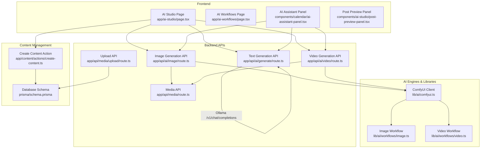

**Diagram sources**
- [page.tsx:113-748](file://app/ai-studio/page.tsx#L113-L748)
- [ai-assistant-panel.tsx:22-409](file://components/calendar/ai-assistant-panel.tsx#L22-L409)
- [route.ts:87-218](file://app/api/ai/generate/route.ts#L87-L218)
- [route.ts:11-91](file://app/api/ai/image/route.ts#L11-L91)
- [route.ts:11-102](file://app/api/ai/video/route.ts#L11-L102)
- [comfyui.ts:33-161](file://lib/ai/comfyui.ts#L33-L161)
- [image.ts:3-84](file://lib/ai/workflows/image.ts#L3-L84)
- [video.ts:3-101](file://lib/ai/workflows/video.ts#L3-L101)
- [create-content.ts:12-25](file://app/content/actions/create-content.ts#L12-L25)
- [route.ts:4-80](file://app/api/media/route.ts#L4-L80)
- [route.ts:20-126](file://app/api/media/upload/route.ts#L20-L126)
- [schema.prisma:21-55](file://prisma/schema.prisma#L21-L55)

**Section sources**
- [page.tsx:113-748](file://app/ai-studio/page.tsx#L113-L748)
- [ai-assistant-panel.tsx:22-409](file://components/calendar/ai-assistant-panel.tsx#L22-L409)
- [route.ts:87-218](file://app/api/ai/generate/route.ts#L87-L218)
- [route.ts:11-91](file://app/api/ai/image/route.ts#L11-L91)
- [route.ts:11-102](file://app/api/ai/video/route.ts#L11-L102)
- [comfyui.ts:33-161](file://lib/ai/comfyui.ts#L33-L161)
- [image.ts:3-84](file://lib/ai/workflows/image.ts#L3-L84)
- [video.ts:3-101](file://lib/ai/workflows/video.ts#L3-L101)
- [create-content.ts:12-25](file://app/content/actions/create-content.ts#L12-L25)
- [route.ts:4-80](file://app/api/media/route.ts#L4-L80)
- [route.ts:20-126](file://app/api/media/upload/route.ts#L20-L126)
- [schema.prisma:21-55](file://prisma/schema.prisma#L21-L55)

## Core Components
- AI Studio Page: Provides tabs for text generation, pipeline chaining, image and video generation, global settings (platform, content type, tone, length), live preview, and creation of content items into the CMS.
- AI Assistant Panel: Embedded in the calendar; supports text, image, and video generation modes and returns results or media back to the calendar context.
- Post Preview Panel: Renders platform-specific previews (Instagram, LinkedIn, X, YouTube, Blog) in phone/tablet frames with live updates during generation.
- Text Generation API: Builds a structured system prompt based on selected tool, platform, content type, tone, and length, then calls a local Ollama-compatible endpoint.
- Image/Video Generation APIs: Validate inputs, check ComfyUI health, build workflows, submit jobs, poll until completion, download outputs, and return URLs.
- Media APIs: List and create media records; upload files to disk under public/uploads and persist metadata to the database.
- Create Content Action: Persists generated text as a draft content item linked to platform metadata.

**Section sources**
- [page.tsx:113-748](file://app/ai-studio/page.tsx#L113-L748)
- [ai-assistant-panel.tsx:22-409](file://components/calendar/ai-assistant-panel.tsx#L22-L409)
- [post-preview-panel.tsx:15-109](file://components/ai-studio/post-preview-panel.tsx#L15-L109)
- [route.ts:87-218](file://app/api/ai/generate/route.ts#L87-L218)
- [route.ts:11-91](file://app/api/ai/image/route.ts#L11-L91)
- [route.ts:11-102](file://app/api/ai/video/route.ts#L11-L102)
- [route.ts:4-80](file://app/api/media/route.ts#L4-L80)
- [route.ts:20-126](file://app/api/media/upload/route.ts#L20-L126)
- [create-content.ts:12-25](file://app/content/actions/create-content.ts#L12-L25)

## Architecture Overview
The system follows a clear separation between UI, server-side APIs, and external AI engines:
- Frontend triggers generation via REST endpoints
- Server validates input, composes prompts/workflows, and communicates with Ollama or ComfyUI
- Outputs are stored locally and referenced by URLs; metadata is persisted in the database
- Generated content can be converted into CMS entries and scheduled for publishing

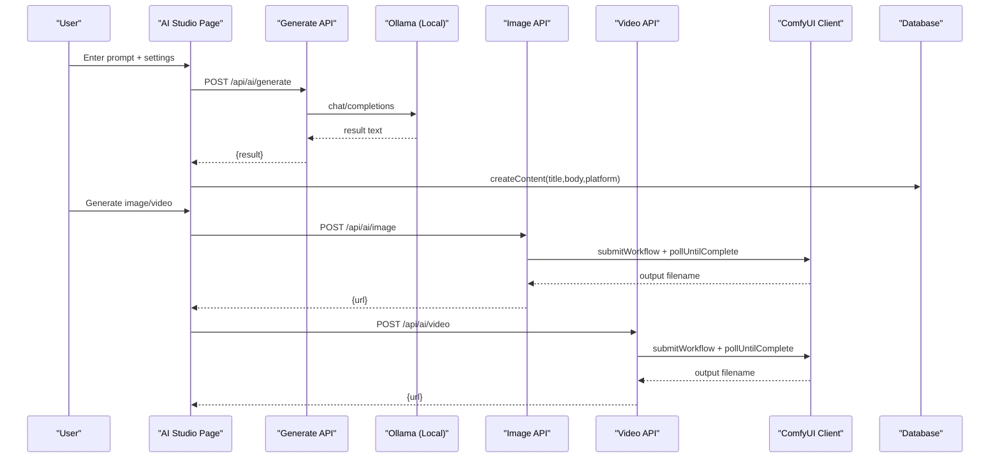

**Diagram sources**
- [page.tsx:173-254](file://app/ai-studio/page.tsx#L173-L254)
- [route.ts:87-218](file://app/api/ai/generate/route.ts#L87-L218)
- [route.ts:11-91](file://app/api/ai/image/route.ts#L11-L91)
- [route.ts:11-102](file://app/api/ai/video/route.ts#L11-L102)
- [comfyui.ts:44-103](file://lib/ai/comfyui.ts#L44-L103)
- [create-content.ts:12-25](file://app/content/actions/create-content.ts#L12-L25)

## Detailed Component Analysis

### AI Studio Page
- Tabs: Write, Image, Video, Pipeline
- Global settings: Platform, Content Type, Tone, Length
- Text generation: Calls /api/ai/generate with tool-specific instructions; simulates streaming for UX; stores history; creates content entry
- Pipeline: Sequential steps where each step’s output becomes context for the next
- Image/Video: Placeholder flows with progress indicators; integrates with corresponding APIs
- Preview: Live preview panel renders platform-specific post mockups

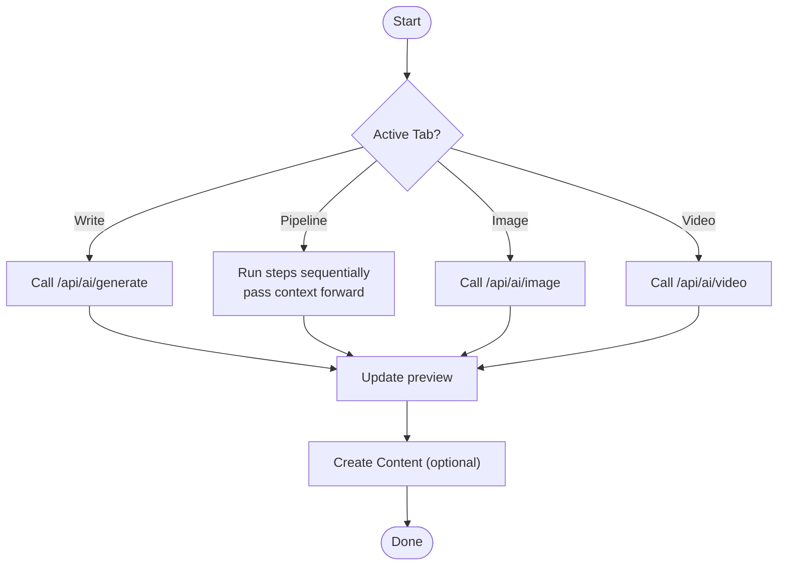

**Diagram sources**
- [page.tsx:173-356](file://app/ai-studio/page.tsx#L173-L356)
- [page.tsx:272-312](file://app/ai-studio/page.tsx#L272-L312)

**Section sources**
- [page.tsx:113-748](file://app/ai-studio/page.tsx#L113-L748)

### AI Assistant Panel (Calendar Integration)
- Modes: Text, Image, Video
- Text: Calls /api/ai/generate with default parameters tailored for calendar context
- Image/Video: Calls respective APIs and returns media objects to the calendar via callbacks
- Error handling: Displays errors inline and disables controls while generating

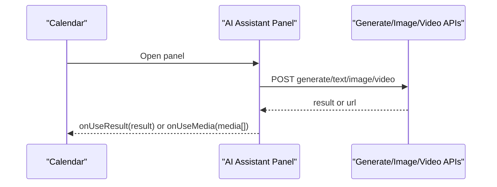

**Diagram sources**
- [ai-assistant-panel.tsx:41-134](file://components/calendar/ai-assistant-panel.tsx#L41-L134)

**Section sources**
- [ai-assistant-panel.tsx:22-409](file://components/calendar/ai-assistant-panel.tsx#L22-L409)

### Post Preview Panel
- Renders platform-specific headers, actions, and captions
- Supports phone/tablet views
- Shows loading states and empty states
- Integrates with AI Studio’s live content stream

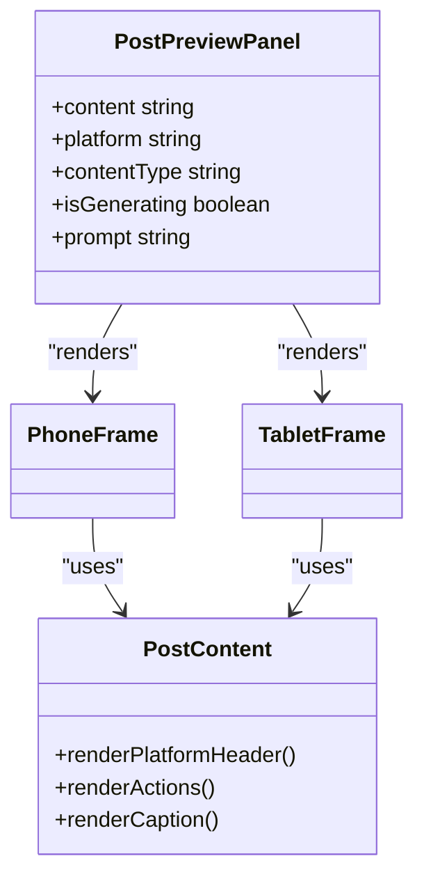

**Diagram sources**
- [post-preview-panel.tsx:15-109](file://components/ai-studio/post-preview-panel.tsx#L15-L109)
- [post-preview-panel.tsx:375-548](file://components/ai-studio/post-preview-panel.tsx#L375-L548)

**Section sources**
- [post-preview-panel.tsx:15-548](file://components/ai-studio/post-preview-panel.tsx#L15-L548)

### Text Generation API (Ollama)
- Validates input and constructs a system prompt using tool-specific instructions
- Calls Ollama-compatible endpoint at /v1/chat/completions
- Returns normalized result or error responses
- Supports context chaining for pipeline usage

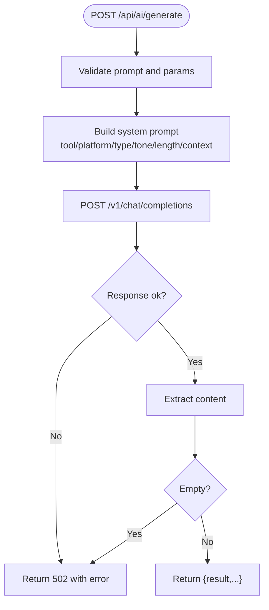

**Diagram sources**
- [route.ts:87-218](file://app/api/ai/generate/route.ts#L87-L218)

**Section sources**
- [route.ts:87-218](file://app/api/ai/generate/route.ts#L87-L218)

### Image and Video Generation APIs (ComfyUI)
- Validate inputs (prompt, dimensions, frames)
- Check ComfyUI health before proceeding
- Build workflow definitions (image/video)
- Submit workflow, poll until complete, extract output filename
- Download file to local storage and return URL

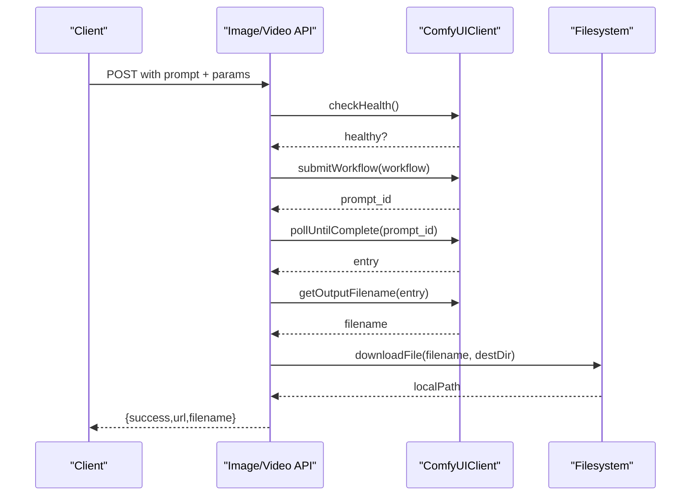

**Diagram sources**
- [route.ts:11-91](file://app/api/ai/image/route.ts#L11-L91)
- [route.ts:11-102](file://app/api/ai/video/route.ts#L11-L102)
- [comfyui.ts:44-143](file://lib/ai/comfyui.ts#L44-L143)

**Section sources**
- [route.ts:11-91](file://app/api/ai/image/route.ts#L11-L91)
- [route.ts:11-102](file://app/api/ai/video/route.ts#L11-L102)
- [comfyui.ts:33-161](file://lib/ai/comfyui.ts#L33-L161)

### ComfyUI Client and Workflows
- Client manages submission, polling, output extraction, file download, and health checks
- Image workflow uses SDXL checkpoint, KSampler, CLIP encoding, VAE decode, SaveImage
- Video workflow uses UNetLoader, DualCLIPLoader, EmptyLatentVideo, KSampler, VAE decode, SaveVideo

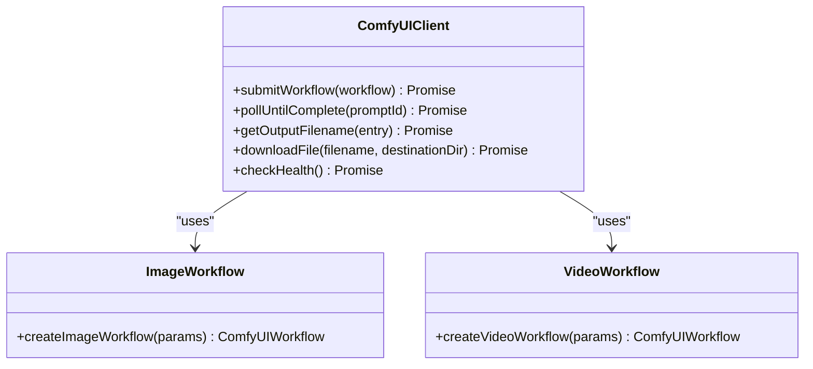

**Diagram sources**
- [comfyui.ts:33-161](file://lib/ai/comfyui.ts#L33-L161)
- [image.ts:3-84](file://lib/ai/workflows/image.ts#L3-L84)
- [video.ts:3-101](file://lib/ai/workflows/video.ts#L3-L101)

**Section sources**
- [comfyui.ts:33-161](file://lib/ai/comfyui.ts#L33-L161)
- [image.ts:3-84](file://lib/ai/workflows/image.ts#L3-L84)
- [video.ts:3-101](file://lib/ai/workflows/video.ts#L3-L101)

### Media Storage and Management
- Upload API accepts multipart/form-data, validates type and size, writes to public/uploads, persists metadata to Media table
- List API retrieves recent media records
- Generated images/videos from ComfyUI are downloaded to the same directory and referenced by URL

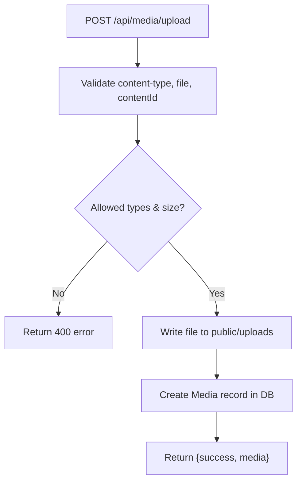

**Diagram sources**
- [route.ts:20-126](file://app/api/media/upload/route.ts#L20-L126)
- [route.ts:4-80](file://app/api/media/route.ts#L4-L80)
- [schema.prisma:39-55](file://prisma/schema.prisma#L39-L55)

**Section sources**
- [route.ts:20-126](file://app/api/media/upload/route.ts#L20-L126)
- [route.ts:4-80](file://app/api/media/route.ts#L4-L80)
- [schema.prisma:39-55](file://prisma/schema.prisma#L39-L55)

### Connection to Main Content Management Workflow
- AI Studio can convert generated text into a new content item via createContent action
- Media assets are associated with content via Media records
- Published content can be scheduled and distributed through existing publishing channels

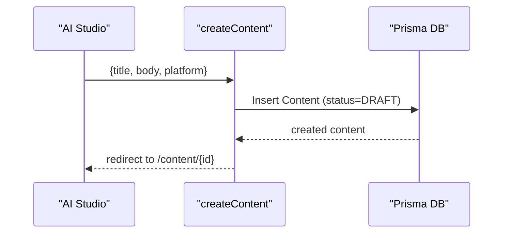

**Diagram sources**
- [create-content.ts:12-25](file://app/content/actions/create-content.ts#L12-L25)
- [schema.prisma:21-37](file://prisma/schema.prisma#L21-L37)

**Section sources**
- [create-content.ts:12-25](file://app/content/actions/create-content.ts#L12-L25)
- [schema.prisma:21-37](file://prisma/schema.prisma#L21-L37)

## Dependency Analysis
- UI depends on API routes for all AI operations
- Text generation depends on environment variables for Ollama base URL and model name
- Image/Video generation depend on ComfyUI client and workflow builders
- Media APIs depend on filesystem and Prisma ORM
- All data models are defined in Prisma schema

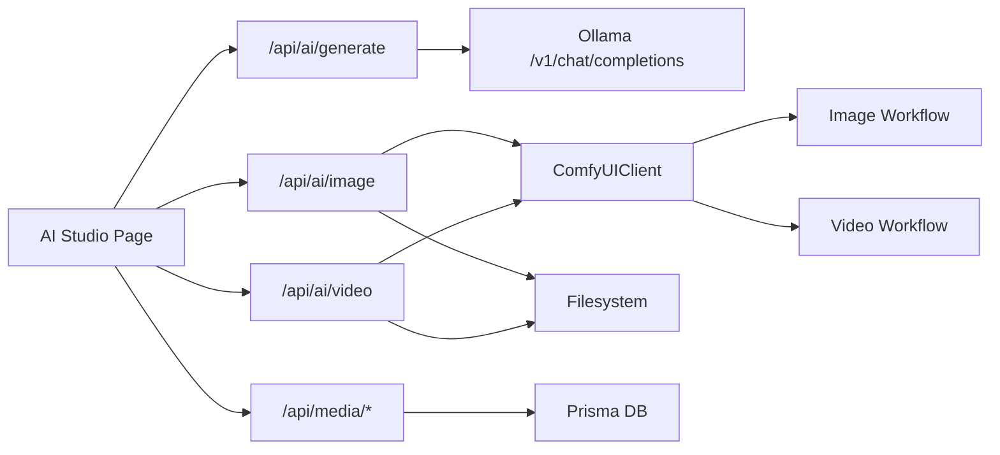

**Diagram sources**
- [page.tsx:173-356](file://app/ai-studio/page.tsx#L173-L356)
- [route.ts:87-218](file://app/api/ai/generate/route.ts#L87-L218)
- [route.ts:11-91](file://app/api/ai/image/route.ts#L11-L91)
- [route.ts:11-102](file://app/api/ai/video/route.ts#L11-L102)
- [comfyui.ts:33-161](file://lib/ai/comfyui.ts#L33-L161)
- [image.ts:3-84](file://lib/ai/workflows/image.ts#L3-L84)
- [video.ts:3-101](file://lib/ai/workflows/video.ts#L3-L101)
- [route.ts:20-126](file://app/api/media/upload/route.ts#L20-L126)

**Section sources**
- [page.tsx:173-356](file://app/ai-studio/page.tsx#L173-L356)
- [route.ts:87-218](file://app/api/ai/generate/route.ts#L87-L218)
- [route.ts:11-91](file://app/api/ai/image/route.ts#L11-L91)
- [route.ts:11-102](file://app/api/ai/video/route.ts#L11-L102)
- [comfyui.ts:33-161](file://lib/ai/comfyui.ts#L33-L161)
- [image.ts:3-84](file://lib/ai/workflows/image.ts#L3-L84)
- [video.ts:3-101](file://lib/ai/workflows/video.ts#L3-L101)
- [route.ts:20-126](file://app/api/media/upload/route.ts#L20-L126)

## Performance Considerations
- Local LLM latency: Configure timeout and consider caching frequent prompts or results if needed
- ComfyUI job duration: Polling interval and timeouts are configurable; ensure adequate server resources
- File I/O: Large media uploads and downloads should be monitored; enforce size limits and allowed types
- Streaming UX: Simulated streaming improves perceived performance; consider real SSE streams when available
- Rate limiting: Implement request throttling at the API layer to protect local AI engines from overload
- Database queries: Use pagination for media listing to avoid large payloads

[No sources needed since this section provides general guidance]

## Troubleshooting Guide
Common issues and resolutions:
- Empty or invalid prompt: Ensure prompt is provided and trimmed; validation returns 400
- Ollama offline or unreachable: Check AI_BASE_URL and AI_MODEL; handle 502 responses gracefully
- ComfyUI offline: Health check failure returns 503; start ComfyUI service before generation
- Invalid dimensions or frames: Input validation enforces constraints; adjust parameters accordingly
- Generation failures: Check logs and retry; verify workflow configuration and model availability
- Upload errors: Verify content-type, file size, and allowed MIME types; ensure write permissions to upload directory

**Section sources**
- [route.ts:87-218](file://app/api/ai/generate/route.ts#L87-L218)
- [route.ts:11-91](file://app/api/ai/image/route.ts#L11-L91)
- [route.ts:11-102](file://app/api/ai/video/route.ts#L11-L102)
- [route.ts:20-126](file://app/api/media/upload/route.ts#L20-L126)

## Conclusion
AI Studio unifies text, image, and video generation within a single workspace, bridging local AI models and ComfyUI workflows with the core content management system. It offers robust error handling, clear integration points, and practical tools for prompt engineering and workflow optimization. By leveraging local engines and well-defined APIs, teams can iterate quickly on content ideas and publish high-quality assets efficiently.

[No sources needed since this section summarizes without analyzing specific files]

## Appendices

### Prompt Engineering Best Practices
- Be explicit about platform, content type, tone, and length to guide the model
- Use tool-specific instructions to constrain output format (e.g., exactly one finished piece)
- Provide context in pipeline steps to maintain continuity across generations
- Avoid inventing facts; instruct the model to stay strictly on topic
- Iterate with negative prompts for image/video to reduce undesired artifacts

[No sources needed since this section provides general guidance]

### Workflow Optimization Techniques
- Chain multiple steps in the pipeline to refine ideas, hooks, titles, and final content
- Reuse successful prompts and templates across campaigns
- Monitor generation times and adjust polling intervals or timeouts
- Cache frequently used outputs where appropriate
- Batch media processing and optimize file sizes for faster uploads

[No sources needed since this section provides general guidance]

### Example Workflows and Templates
- Idea to Draft: Generate ideas → select best idea → write content → create content item
- Hook to Post: Generate hooks → choose hook → expand into full post → preview and publish
- Image/Video Assist: Describe visual → generate asset → attach to content → schedule publication

[No sources needed since this section provides general guidance]