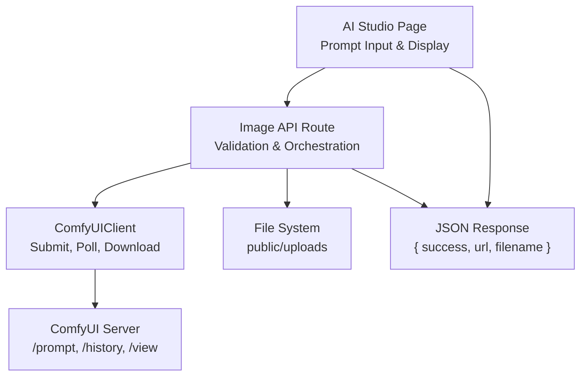
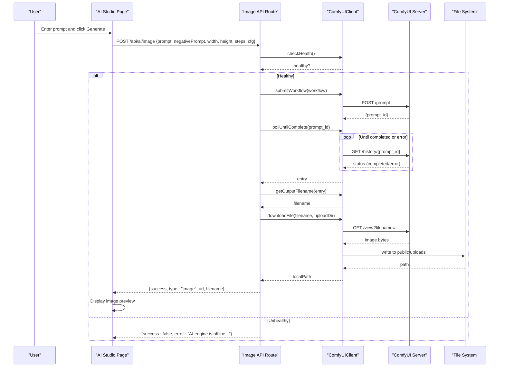
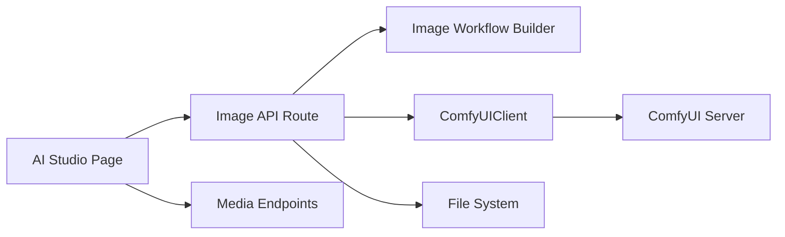

# Image Generation

<cite>
**Referenced Files in This Document**
- [route.ts](file://app/api/ai/image/route.ts)
- [comfyui.ts](file://lib/ai/comfyui.ts)
- [image.ts](file://lib/ai/workflows/image.ts)
- [page.tsx](file://app/ai-studio/page.tsx)
- [post-preview-panel.tsx](file://components/ai-studio/post-preview-panel.tsx)
- [upload route.ts](file://app/api/media/upload/route.ts)
- [media route.ts](file://app/api/media/route.ts)
</cite>

## Table of Contents
1. [Introduction](#introduction)
2. [Project Structure](#project-structure)
3. [Core Components](#core-components)
4. [Architecture Overview](#architecture-overview)
5. [Detailed Component Analysis](#detailed-component-analysis)
6. [Dependency Analysis](#dependency-analysis)
7. [Performance Considerations](#performance-considerations)
8. [Troubleshooting Guide](#troubleshooting-guide)
9. [Conclusion](#conclusion)
10. [Appendices](#appendices)

## Introduction
This document explains the image generation feature in AI Studio, which integrates with ComfyUI to generate images from text prompts. It covers the end-to-end workflow: user input, request handling, ComfyUI integration, file storage, result display, error handling and retries, media library integration, performance considerations, and rate limiting guidance.

## Project Structure
The image generation flow spans UI components, API routes, and a ComfyUI client:
- UI: AI Studio page provides the prompt input and displays generated images.
- API: A Next.js route validates inputs, checks ComfyUI health, builds a workflow, submits it, polls for completion, downloads the output, and returns a URL.
- Client: A reusable ComfyUI client handles submission, polling, output extraction, downloading, and health checks.
- Workflow: A function constructs the ComfyUI graph for image generation (checkpoint loader, latent sampling, decoding, saving).
- Storage: Generated files are saved under a configurable upload directory (default public/uploads), then served via Next.js static/public routing.
- Media Library: Separate endpoints manage media metadata and uploads into the same public directory structure.

**Diagram sources**
- [route.ts:11-76](file://app/api/ai/image/route.ts#L11-L76)
- [comfyui.ts:44-143](file://lib/ai/comfyui.ts#L44-L143)
- [image.ts:3-83](file://lib/ai/workflows/image.ts#L3-L83)

**Section sources**
- [page.tsx:113-146](file://app/ai-studio/page.tsx#L113-L146)
- [route.ts:11-76](file://app/api/ai/image/route.ts#L11-L76)
- [comfyui.ts:33-155](file://lib/ai/comfyui.ts#L33-L155)
- [image.ts:3-83](file://lib/ai/workflows/image.ts#L3-L83)

## Core Components
- Image API route: Validates inputs, checks ComfyUI health, creates a workflow, submits, polls until complete, extracts output filename, downloads the file, computes a public URL, and returns JSON.
- ComfyUI client: Encapsulates HTTP interactions with ComfyUI, including workflow submission, history polling, output filename extraction, file download, and health check.
- Image workflow builder: Builds the ComfyUI node graph for image generation using a checkpoint loader, CLIP text encoders, KSampler, VAE decoder, and SaveImage nodes.
- AI Studio UI: Provides the image tab where users enter prompts, trigger generation, see progress states, and view results.
- Media endpoints: Provide listing and upload capabilities to integrate generated images into the content creation workflow.

**Section sources**
- [route.ts:11-76](file://app/api/ai/image/route.ts#L11-L76)
- [comfyui.ts:44-143](file://lib/ai/comfyui.ts#L44-L143)
- [image.ts:3-83](file://lib/ai/workflows/image.ts#L3-L83)
- [page.tsx:667-711](file://app/ai-studio/page.tsx#L667-L711)
- [media route.ts:4-23](file://app/api/media/route.ts#L4-L23)
- [upload route.ts:20-111](file://app/api/media/upload/route.ts#L20-L111)

## Architecture Overview
The image generation architecture is a server-side orchestration between Next.js and ComfyUI:

**Diagram sources**
- [route.ts:11-76](file://app/api/ai/image/route.ts#L11-L76)
- [comfyui.ts:44-143](file://lib/ai/comfyui.ts#L44-L143)
- [image.ts:3-83](file://lib/ai/workflows/image.ts#L3-L83)

## Detailed Component Analysis

### Image API Route
Responsibilities:
- Parse and validate request body (prompt required; dimensions must be positive).
- Check ComfyUI health before proceeding.
- Build an image workflow with provided parameters.
- Submit workflow, poll until completion, extract output filename.
- Download the generated image to the configured upload directory.
- Compute a public URL and return a structured response.

Error handling:
- Returns 400 for missing prompt or invalid dimensions.
- Returns 503 if ComfyUI is offline.
- Returns 500 when generation fails or no output filename is found.
- Catches exceptions and returns a consistent error payload.

Retry behavior:
- The route itself does not implement retry logic; failures are surfaced to the caller. Implement client-side retries on the UI layer for transient errors.

**Section sources**
- [route.ts:11-76](file://app/api/ai/image/route.ts#L11-L76)
- [route.ts:77-90](file://app/api/ai/image/route.ts#L77-L90)

### ComfyUI Client
Key methods:
- submitWorkflow: Posts the workflow to ComfyUI’s /prompt endpoint with a timeout and abort controller.
- pollUntilComplete: Repeatedly queries /history/{prompt_id} until completion or error, respecting timeout and poll interval.
- getOutputFilename: Extracts the first image filename from the outputs.
- getFileUrl: Builds a view URL for a given filename.
- downloadFile: Downloads the image via /view and writes it to the destination directory, returning the local path.
- checkHealth: Probes /system_stats to verify ComfyUI availability.

Timeouts and intervals:
- Default timeout: 600 seconds.
- Default poll interval: 2 seconds.
These can be overridden via options passed to the client constructor.

**Section sources**
- [comfyui.ts:33-155](file://lib/ai/comfyui.ts#L33-L155)

### Image Workflow Builder
Constructs a ComfyUI graph that includes:
- CheckpointLoaderSimple: Loads the model checkpoint.
- EmptyLatentImage: Initializes latent space with specified width and height.
- CLIPTextEncode (positive): Encodes the user prompt.
- CLIPTextEncode (negative): Encodes negative prompt (with a default set if none provided).
- KSampler: Samples the image using specified steps, CFG, sampler, scheduler, and denoise.
- VAEDecode: Decodes latent to pixel space.
- SaveImage: Saves the image with a prefix.

Parameters:
- prompt, negativePrompt, width, height, steps, cfg, seed, checkpoint.

Complexity:
- Graph construction is O(1) relative to image size; actual compute occurs in ComfyUI.

**Section sources**
- [image.ts:3-83](file://lib/ai/workflows/image.ts#L3-L83)

### AI Studio UI Integration
- Image tab: Users enter a prompt and click “Generate Image.”
- State management: Tracks generating state, clears previous results, shows errors, and renders the final image.
- Preview panel: Displays platform-specific previews and supports device toggles.

Note:
- The current UI implementation simulates image generation locally for demonstration purposes. To use real generation, wire the handler to call /api/ai/image and render the returned URL.

**Section sources**
- [page.tsx:667-711](file://app/ai-studio/page.tsx#L667-L711)
- [post-preview-panel.tsx:15-109](file://components/ai-studio/post-preview-panel.tsx#L15-L109)

### File Handling and Storage
- Download location: Configured via environment variable AI_UPLOAD_DIR, defaulting to public/uploads.
- Filename uniqueness: Combines timestamp, random string, and original filename to avoid collisions.
- Public serving: If the path starts with public/, the route strips the prefix to produce a web-accessible URL.
- Upload endpoint: The media upload route stores files under public/uploads and records metadata in the database.

Storage considerations:
- Ensure the deployment environment persists the public/uploads directory across requests.
- Configure CDN or caching appropriately for generated assets.

**Section sources**
- [route.ts:64-68](file://app/api/ai/image/route.ts#L64-L68)
- [comfyui.ts:123-143](file://lib/ai/comfyui.ts#L123-L143)
- [upload route.ts:82-106](file://app/api/media/upload/route.ts#L82-L106)

### Error Handling and Retry Mechanisms
Server-side:
- Validation errors return 400.
- Health check failure returns 503.
- Generation failures or missing outputs return 500.
- Exceptions are caught and converted to a consistent error object.

Client-side recommendations:
- Implement exponential backoff retries for transient network or service errors.
- Surface user-friendly messages based on status codes and error payloads.
- Allow manual retry after failures.

**Section sources**
- [route.ts:22-42](file://app/api/ai/image/route.ts#L22-L42)
- [route.ts:57-62](file://app/api/ai/image/route.ts#L57-L62)
- [route.ts:77-90](file://app/api/ai/image/route.ts#L77-L90)
- [comfyui.ts:72-103](file://lib/ai/comfyui.ts#L72-L103)

### Media Library and Content Creation Workflow
- Listing: Fetches recent media entries with URLs, filenames, types, and sizes.
- Uploading: Accepts multipart/form-data, validates type and size, verifies content existence, saves files under public/uploads, and persists metadata.
- Integration: After image generation, you can register the generated asset by calling the media upload endpoint or directly linking the returned URL to your content item.

**Section sources**
- [media route.ts:4-23](file://app/api/media/route.ts#L4-L23)
- [upload route.ts:20-111](file://app/api/media/upload/route.ts#L20-L111)

## Dependency Analysis
High-level dependencies:
- AI Studio UI depends on the Image API route for generation.
- Image API route depends on ComfyUIClient and the image workflow builder.
- ComfyUIClient depends on ComfyUI server endpoints (/prompt, /history, /view, /system_stats).
- File system operations persist generated images to public/uploads.
- Media endpoints provide CRUD-like access to media metadata and uploads.

**Diagram sources**
- [route.ts:11-76](file://app/api/ai/image/route.ts#L11-L76)
- [comfyui.ts:44-143](file://lib/ai/comfyui.ts#L44-L143)
- [image.ts:3-83](file://lib/ai/workflows/image.ts#L3-L83)

**Section sources**
- [route.ts:11-76](file://app/api/ai/image/route.ts#L11-L76)
- [comfyui.ts:33-155](file://lib/ai/comfyui.ts#L33-L155)
- [image.ts:3-83](file://lib/ai/workflows/image.ts#L3-L83)

## Performance Considerations
- Timeouts: Default 600 seconds for workflow submission and polling; adjust based on expected generation time.
- Polling interval: Default 2 seconds; tune to balance responsiveness and server load.
- Concurrency: Limit concurrent requests per user or globally to prevent overloading ComfyUI.
- Model loading: Large checkpoints may increase cold-start latency; consider preloading or warm-up strategies.
- Disk I/O: Ensure fast storage for public/uploads to minimize download/write delays.
- Network: Use CDN or caching for generated images to reduce repeated transfers.
- Rate limiting: Implement server-side rate limiting (e.g., per IP or per user) to protect against abuse and ensure fair usage.

[No sources needed since this section provides general guidance]

## Troubleshooting Guide
Common issues and resolutions:
- Prompt missing or empty: Validate on the client and server; return clear error messages.
- Invalid dimensions: Ensure width and height are positive integers; clamp or normalize values if necessary.
- ComfyUI offline: Health check fails; instruct users to start ComfyUI and retry later.
- Generation failed: No output filename detected; check ComfyUI logs and workflow configuration.
- Download failure: Network or permission issues; verify ComfyUI /view endpoint accessibility and filesystem permissions.
- Storage full: Monitor disk usage; implement cleanup policies for old generated files.

Operational tips:
- Log detailed errors at each step (submission, polling, download).
- Expose health endpoints for monitoring.
- Add metrics for request counts, latencies, and error rates.

**Section sources**
- [route.ts:22-42](file://app/api/ai/image/route.ts#L22-L42)
- [route.ts:57-62](file://app/api/ai/image/route.ts#L57-L62)
- [route.ts:77-90](file://app/api/ai/image/route.ts#L77-L90)
- [comfyui.ts:72-103](file://lib/ai/comfyui.ts#L72-L103)

## Conclusion
The image generation feature integrates seamlessly with ComfyUI through a robust Next.js API layer. It validates inputs, orchestrates generation, handles file storage, and exposes results to the UI. With proper error handling, performance tuning, and rate limiting, it provides a reliable foundation for AI-powered image creation within the content workflow.

[No sources needed since this section summarizes without analyzing specific files]

## Appendices

### Effective Prompts and Optimization Techniques
- Be specific about subject, style, lighting, composition, and resolution.
- Use negative prompts to exclude unwanted artifacts (e.g., low quality, extra digits).
- Adjust steps and CFG for quality vs. speed trade-offs.
- Experiment with different checkpoints for varied styles.
- Iterate with variations to refine results quickly.

[No sources needed since this section provides general guidance]

### Media Library Integration Steps
- After successful generation, capture the returned URL and filename.
- Optionally upload via the media upload endpoint to persist metadata.
- Link the media to your content item for publishing workflows.

**Section sources**
- [media route.ts:4-23](file://app/api/media/route.ts#L4-L23)
- [upload route.ts:20-111](file://app/api/media/upload/route.ts#L20-L111)