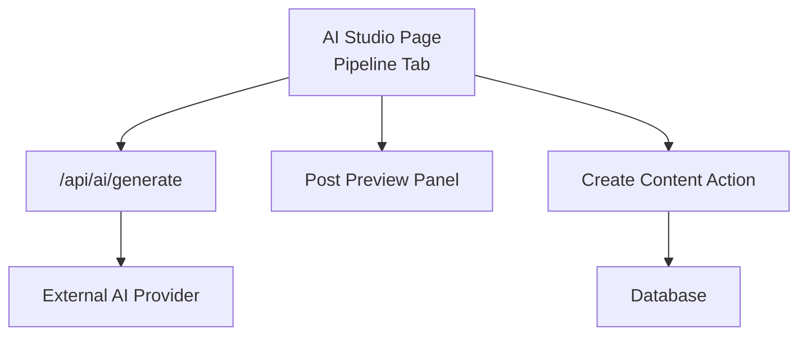
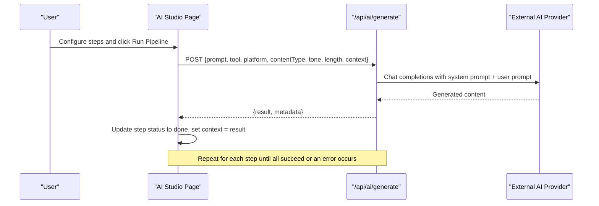
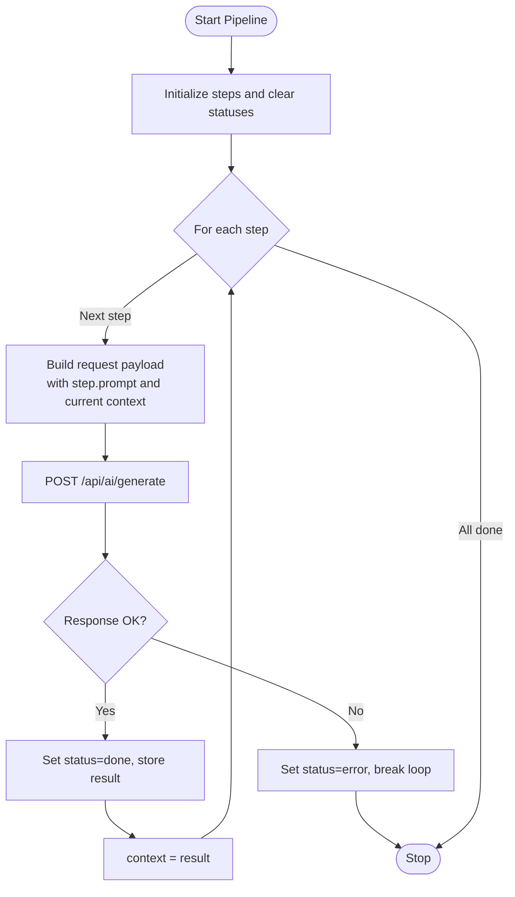
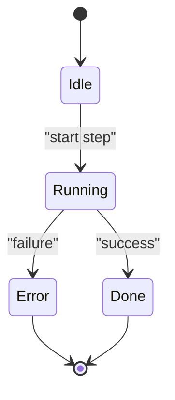
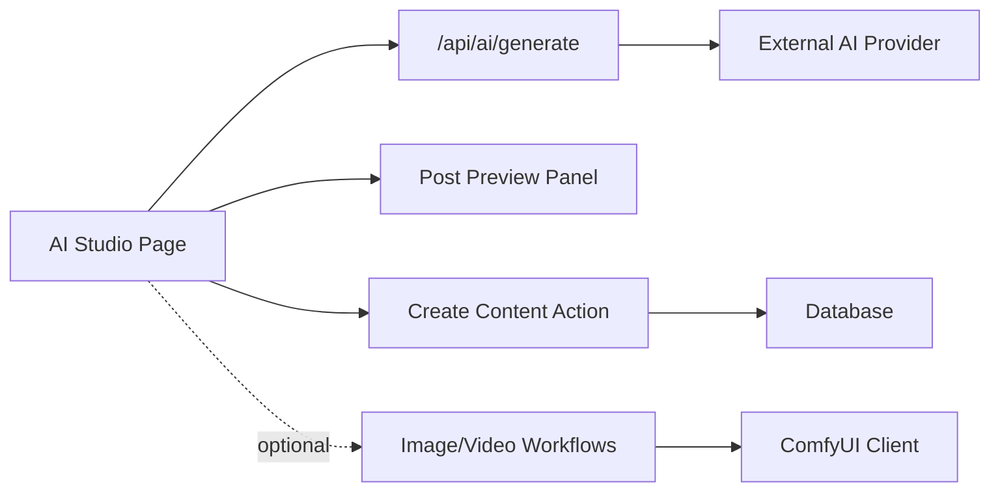

# Pipeline Workflow

<cite>
**Referenced Files in This Document**
- [page.tsx](file://app/ai-studio/page.tsx)
- [route.ts](file://app/api/ai/generate/route.ts)
- [post-preview-panel.tsx](file://components/ai-studio/post-preview-panel.tsx)
- [create-content.ts](file://app/content/actions/create-content.ts)
- [comfyui.ts](file://lib/ai/comfyui.ts)
- [image.ts](file://lib/ai/workflows/image.ts)
- [video.ts](file://lib/ai/workflows/video.ts)
</cite>

## Table of Contents
1. [Introduction](#introduction)
2. [Project Structure](#project-structure)
3. [Core Components](#core-components)
4. [Architecture Overview](#architecture-overview)
5. [Detailed Component Analysis](#detailed-component-analysis)
6. [Dependency Analysis](#dependency-analysis)
7. [Performance Considerations](#performance-considerations)
8. [Troubleshooting Guide](#troubleshooting-guide)
9. [Conclusion](#conclusion)
10. [Appendices](#appendices)

## Introduction
This document explains the sequential pipeline workflow feature in AI Studio, where users can chain multiple AI generation steps so that the output of one step becomes the context for the next. It covers the pipeline creation interface, step configuration, execution flow, status tracking, error handling, and how context is passed between steps. It also provides guidance on optimizing pipelines for complex content creation workflows and includes examples of effective configurations for different content types.

## Project Structure
The pipeline feature spans a client-side UI, a server API endpoint, and optional media generation utilities:
- Client UI: The AI Studio page hosts the pipeline tab, step management, and execution logic.
- Server API: A Next.js route processes prompts with tool-specific instructions and passes context into the system prompt.
- Preview Panel: Renders platform-specific previews for generated content.
- Content Actions: Persist generated content to the database.
- Media Workflows: Optional image/video generation via ComfyUI (not used by text pipelines but part of the broader AI Studio).

**Diagram sources**
- [page.tsx:272-312](file://app/ai-studio/page.tsx#L272-L312)
- [route.ts:87-203](file://app/api/ai/generate/route.ts#L87-L203)
- [post-preview-panel.tsx:15-109](file://components/ai-studio/post-preview-panel.tsx#L15-L109)
- [create-content.ts:12-24](file://app/content/actions/create-content.ts#L12-L24)

**Section sources**
- [page.tsx:104-137](file://app/ai-studio/page.tsx#L104-L137)
- [route.ts:1-218](file://app/api/ai/generate/route.ts#L1-L218)

## Core Components
- Pipeline Step Model: Each step has an id, tool selection, prompt, status, result, and optional error.
- Pipeline State: An array of steps and a running flag control execution.
- Execution Engine: Sequential loop that calls the API per step, updates status, and passes context forward.
- API Endpoint: Builds a system prompt including tool, platform, content type, tone, length, user prompt, and previous context; returns a single result string.
- Preview and Persistence: Live preview panel shows results; content can be saved to the database.

Key responsibilities:
- UI manages adding/removing/updating steps and triggers execution.
- API composes prompts and delegates to the external AI provider.
- Preview renders platform-appropriate layouts.
- Content action persists final outputs.

**Section sources**
- [page.tsx:104-137](file://app/ai-studio/page.tsx#L104-L137)
- [page.tsx:257-312](file://app/ai-studio/page.tsx#L257-L312)
- [route.ts:9-85](file://app/api/ai/generate/route.ts#L9-L85)
- [route.ts:87-203](file://app/api/ai/generate/route.ts#L87-L203)
- [post-preview-panel.tsx:15-109](file://components/ai-studio/post-preview-panel.tsx#L15-L109)
- [create-content.ts:12-24](file://app/content/actions/create-content.ts#L12-L24)

## Architecture Overview
The pipeline executes sequentially: each step sends its prompt plus accumulated context to the API, which constructs a system prompt with tool-specific instructions and returns a result. That result becomes the context for the next step. Errors halt the pipeline at the failing step.

**Diagram sources**
- [page.tsx:272-312](file://app/ai-studio/page.tsx#L272-L312)
- [route.ts:87-203](file://app/api/ai/generate/route.ts#L87-L203)

## Detailed Component Analysis

### Pipeline Creation Interface
- Add Step: Appends a new step with default tool and empty prompt.
- Edit Step: Updates tool selection and prompt inline.
- Remove Step: Removes a step when more than one exists.
- Global Settings: Platform, content type, tone, and length apply to all steps during execution.

These controls are rendered in the pipeline tab and update local state before execution.

**Section sources**
- [page.tsx:257-270](file://app/ai-studio/page.tsx#L257-L270)
- [page.tsx:435-463](file://app/ai-studio/page.tsx#L435-L463)
- [page.tsx:617-665](file://app/ai-studio/page.tsx#L617-L665)

### Step Configuration and Context Passing
- Each step carries a tool and a prompt. If no prompt is provided, a default continuation prompt is used.
- On execution, the API composes a system prompt that includes:
  - Tool and workflow instruction
  - Platform, content type, tone, length
  - User prompt
  - Previous context (if any)
- The API returns a single result string, which becomes the context for the next step.

**Diagram sources**
- [page.tsx:272-312](file://app/ai-studio/page.tsx#L272-L312)
- [route.ts:87-203](file://app/api/ai/generate/route.ts#L87-L203)

**Section sources**
- [page.tsx:272-312](file://app/ai-studio/page.tsx#L272-L312)
- [route.ts:9-85](file://app/api/ai/generate/route.ts#L9-L85)
- [route.ts:108-144](file://app/api/ai/generate/route.ts#L108-L144)

### Execution Flow, Status Tracking, and Error Handling
- Execution Flow: Sequential iteration through steps; each step waits for the API response before proceeding.
- Status Tracking: Each step transitions from idle to running to done or error; UI reflects these states.
- Error Handling: On failure, the step’s status is set to error with a message, and the pipeline stops immediately.

**Diagram sources**
- [page.tsx:104-111](file://app/ai-studio/page.tsx#L104-L111)
- [page.tsx:272-312](file://app/ai-studio/page.tsx#L272-L312)

**Section sources**
- [page.tsx:272-312](file://app/ai-studio/page.tsx#L272-L312)

### Preview and Persistence
- Preview Panel: Displays platform-specific post previews with device toggles and live content rendering.
- Create Content: Saves generated content to the database and navigates to the content detail page.

**Section sources**
- [post-preview-panel.tsx:15-109](file://components/ai-studio/post-preview-panel.tsx#L15-L109)
- [post-preview-panel.tsx:139-230](file://components/ai-studio/post-preview-panel.tsx#L139-L230)
- [create-content.ts:12-24](file://app/content/actions/create-content.ts#L12-L24)

### Example Pipeline Configurations
Below are practical examples of chaining steps for different content types. These illustrate how to structure prompts and leverage context across steps.

- Blog Post Drafting
  - Step 1: Generate Ideas (tool: Generate Ideas) — produce topic ideas based on a brief.
  - Step 2: Generate Hook (tool: Generate Hook) — create opening hooks using prior ideas.
  - Step 3: Write Content (tool: Write Content) — compose full article using hook and context.
  - Step 4: Repurpose (tool: Repurpose) — adapt article for another platform using prior content.

- Social Thread
  - Step 1: Generate Title (tool: Generate Title) — create titles for thread topics.
  - Step 2: Generate Hook (tool: Generate Hook) — craft engaging first lines.
  - Step 3: Write Content (tool: Write Content) — generate concise posts suitable for threads.

- Video Script
  - Step 1: Generate Ideas (tool: Generate Ideas) — outline video concepts.
  - Step 2: Generate Hook (tool: Generate Hook) — write strong openings.
  - Step 3: Write Content (tool: Write Content) — produce script with scene directions.
  - Step 4: Repurpose (tool: Repurpose) — convert script into captions or blog summary.

Note: These examples describe how to configure steps and prompts; actual implementation uses the pipeline UI to add steps, select tools, and enter prompts.

[No sources needed since this section describes conceptual configurations without quoting code]

## Dependency Analysis
- UI depends on:
  - API endpoint for generation
  - Preview component for display
  - Content action for persistence
- API depends on:
  - External AI provider (configured via environment variables)
- Optional media workflows depend on:
  - ComfyUI client and workflow definitions (used by image/video tabs, not text pipelines)

**Diagram sources**
- [page.tsx:272-312](file://app/ai-studio/page.tsx#L272-L312)
- [route.ts:87-203](file://app/api/ai/generate/route.ts#L87-L203)
- [comfyui.ts:33-103](file://lib/ai/comfyui.ts#L33-L103)
- [image.ts:3-83](file://lib/ai/workflows/image.ts#L3-L83)
- [video.ts:3-101](file://lib/ai/workflows/video.ts#L3-L101)

**Section sources**
- [page.tsx:272-312](file://app/ai-studio/page.tsx#L272-L312)
- [route.ts:87-203](file://app/api/ai/generate/route.ts#L87-L203)
- [comfyui.ts:33-103](file://lib/ai/comfyui.ts#L33-L103)

## Performance Considerations
- Sequential Execution: Pipelines run steps one-by-one; long-running steps increase total time. Keep prompts focused and avoid overly verbose outputs to reduce latency.
- Context Size: Each step appends its result as context for the next; very large contexts may impact performance or exceed provider limits. Prefer concise intermediate outputs and selective context inclusion.
- Error Early Exit: Failures stop the pipeline immediately; design robust prompts and validate inputs to minimize retries.
- UI Responsiveness: Avoid blocking operations; the current implementation awaits each step, which is appropriate for sequential dependencies but consider user feedback for longer runs.
- Caching and Reuse: For repeated tasks, reuse successful steps and avoid regenerating identical content.

[No sources needed since this section provides general guidance]

## Troubleshooting Guide
Common issues and resolutions:
- Empty Prompt: The API requires a non-empty prompt; ensure each step has a meaningful prompt or rely on the default continuation prompt.
- Network or Provider Errors: Non-OK responses return structured errors; check network connectivity and provider availability.
- Empty Result: If the provider returns no content, the API responds with an error; adjust prompts or model settings.
- Pipeline Halts on Error: A failed step sets status to error and stops further execution; fix the failing step’s prompt or tool selection and rerun.

Operational tips:
- Inspect step status and error messages in the UI.
- Validate global settings (platform, content type, tone, length) to align with the intended workflow.
- Use smaller, targeted prompts to improve reliability and speed.

**Section sources**
- [route.ts:99-104](file://app/api/ai/generate/route.ts#L99-L104)
- [route.ts:172-193](file://app/api/ai/generate/route.ts#L172-L193)
- [page.tsx:272-312](file://app/ai-studio/page.tsx#L272-L312)

## Conclusion
The AI Studio pipeline enables users to chain AI generation steps sequentially, passing context from one step to the next. The UI supports adding, editing, and removing steps, while the API composes tool-aware prompts and returns results that drive subsequent steps. Robust status tracking and error handling provide clear feedback and safe execution. By designing concise prompts and leveraging context effectively, users can build efficient pipelines for diverse content types.

[No sources needed since this section summarizes without analyzing specific files]

## Appendices

### API Request/Response Summary
- Request fields: prompt, tool, platform, contentType, tone, length, context
- Response fields: result, model, tool, platform, contentType, tone, length
- Errors: Structured error messages with HTTP status codes

**Section sources**
- [route.ts:87-203](file://app/api/ai/generate/route.ts#L87-L203)

### Data Models
- PipelineStep: id, tool, prompt, status, result, error
- Generation: id, prompt, result, tool, platform, contentType, timestamp

**Section sources**
- [page.tsx:94-111](file://app/ai-studio/page.tsx#L94-L111)