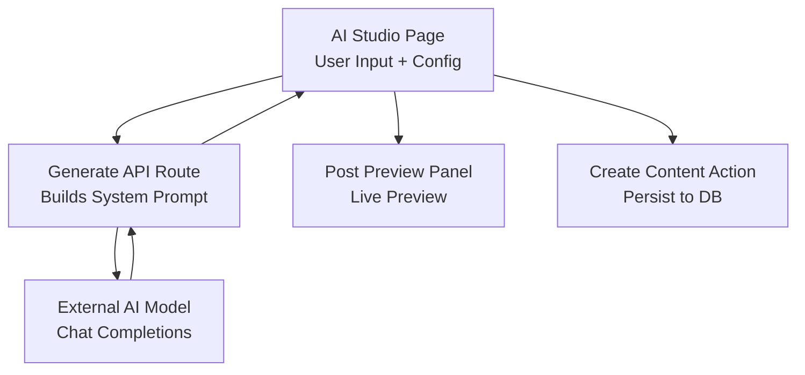
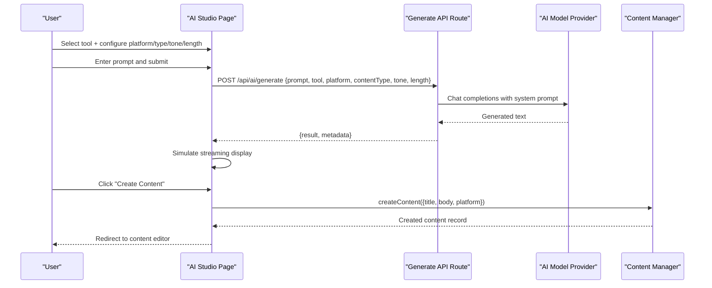
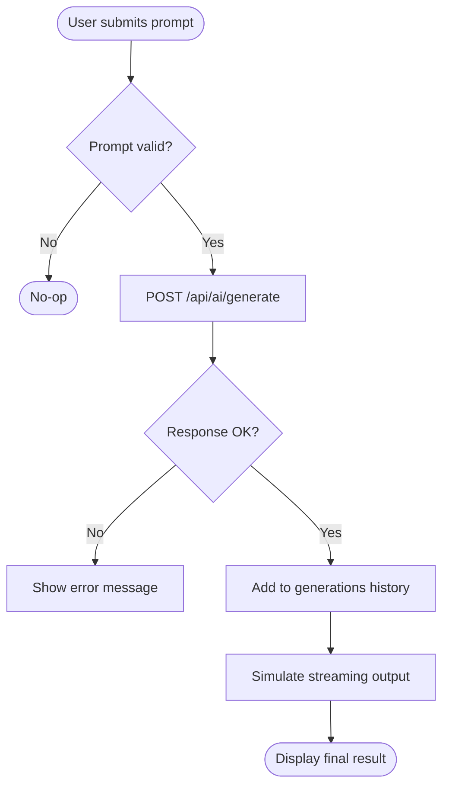
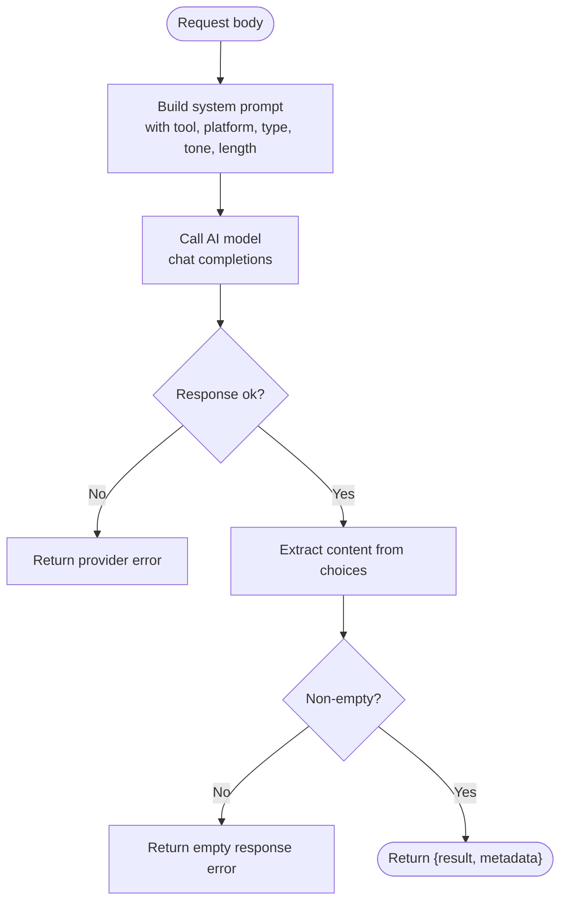
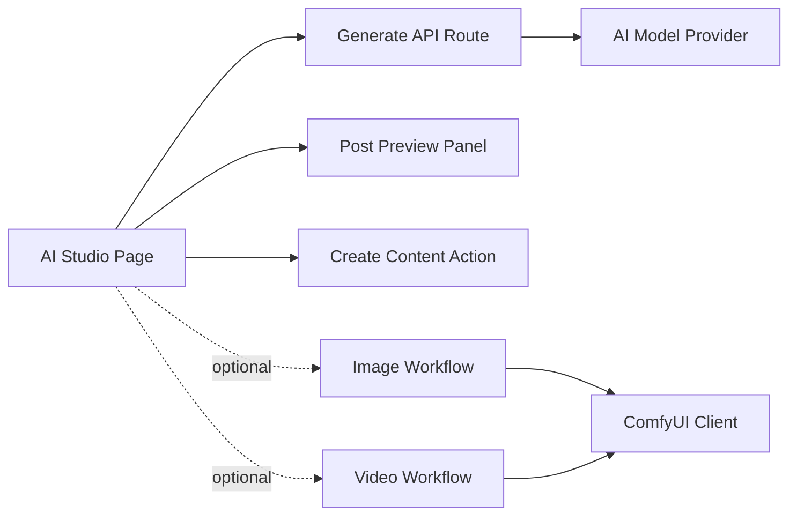

# Text Generation

<cite>
**Referenced Files in This Document**
- [page.tsx](file://app/ai-studio/page.tsx)
- [route.ts](file://app/api/ai/generate/route.ts)
- [post-preview-panel.tsx](file://components/ai-studio/post-preview-panel.tsx)
- [create-content.ts](file://app/content/actions/create-content.ts)
- [image.ts](file://lib/ai/workflows/image.ts)
- [video.ts](file://lib/ai/workflows/video.ts)
- [comfyui.ts](file://lib/ai/comfyui.ts)
</cite>

## Table of Contents
1. [Introduction](#introduction)
2. [Project Structure](#project-structure)
3. [Core Components](#core-components)
4. [Architecture Overview](#architecture-overview)
5. [Detailed Component Analysis](#detailed-component-analysis)
6. [Dependency Analysis](#dependency-analysis)
7. [Performance Considerations](#performance-considerations)
8. [Troubleshooting Guide](#troubleshooting-guide)
9. [Conclusion](#conclusion)
10. [Appendices](#appendices)

## Introduction
This document explains the text generation capabilities in AI Studio, focusing on how users can generate ideas, write content, create hooks and titles, and repurpose existing content. It covers the available tools, configuration options (platform, content type, tone, length), streaming response behavior, real-time preview, and integration with the content management system to create new content from generated text.

## Project Structure
AI Studio’s text generation spans a client page, a server API route, a live preview panel, and actions that persist content into the database. The flow is:
- User selects a tool and configures platform, content type, tone, and length.
- The client sends a request to the generation API.
- The API builds a system prompt based on the selected tool and parameters, calls an external AI model, and returns the result.
- The client simulates a streaming effect and shows a live preview.
- Users can create a new content item from the generated text.

**Diagram sources**
- [page.tsx:173-225](file://app/ai-studio/page.tsx#L173-L225)
- [route.ts:87-203](file://app/api/ai/generate/route.ts#L87-L203)
- [post-preview-panel.tsx:15-109](file://components/ai-studio/post-preview-panel.tsx#L15-L109)
- [create-content.ts:12-24](file://app/content/actions/create-content.ts#L12-L24)

**Section sources**
- [page.tsx:61-131](file://app/ai-studio/page.tsx#L61-L131)
- [route.ts:9-85](file://app/api/ai/generate/route.ts#L9-L85)

## Core Components
- AI Studio Page: Provides tool selection, global settings, chat-like input area, history sidebar, pipeline mode, and live preview.
- Generate API Route: Validates inputs, constructs a structured system prompt per tool, calls the AI provider, and returns results.
- Post Preview Panel: Renders platform-specific previews for Instagram, LinkedIn, X, YouTube, and Blog, with device toggles and status indicators.
- Create Content Action: Persists generated text as a draft in the content management system.

Key responsibilities:
- Tool orchestration and user experience are handled in the AI Studio Page.
- Prompt engineering and provider communication are centralized in the Generate API Route.
- Visual feedback and platform fidelity are provided by the Post Preview Panel.
- Persistence and routing to the content editor are handled by the Create Content Action.

**Section sources**
- [page.tsx:113-254](file://app/ai-studio/page.tsx#L113-L254)
- [route.ts:87-203](file://app/api/ai/generate/route.ts#L87-L203)
- [post-preview-panel.tsx:15-109](file://components/ai-studio/post-preview-panel.tsx#L15-L109)
- [create-content.ts:12-24](file://app/content/actions/create-content.ts#L12-L24)

## Architecture Overview
The system uses a simple client-server architecture:
- Client: Next.js page with React state for prompts, tool selection, and configuration.
- Server: Next.js API route that composes a system prompt and proxies requests to an external AI model endpoint.
- Preview: A reusable component that renders platform-aware post previews.
- Persistence: A server action that creates content records in the database.

**Diagram sources**
- [page.tsx:173-254](file://app/ai-studio/page.tsx#L173-L254)
- [route.ts:87-203](file://app/api/ai/generate/route.ts#L87-L203)
- [create-content.ts:12-24](file://app/content/actions/create-content.ts#L12-L24)

## Detailed Component Analysis

### AI Studio Page
Responsibilities:
- Presents five text tools: Generate Ideas, Write Content, Generate Hook, Generate Title, Repurpose.
- Global configuration: Platform, Content Type, Tone, Length.
- Handles generation requests, error states, and history of generations.
- Implements a simulated streaming effect for immediate visual feedback.
- Supports a sequential pipeline where each step passes context to the next.
- Integrates with the content manager to create new content from generated text.

Important behaviors:
- Tool definitions include descriptions and placeholders to guide prompting.
- Streaming simulation types out the final result character-by-character before settling.
- Pipeline mode chains multiple steps, passing previous outputs as context.
- Live preview updates in real time as text changes.

**Diagram sources**
- [page.tsx:173-225](file://app/ai-studio/page.tsx#L173-L225)

**Section sources**
- [page.tsx:61-131](file://app/ai-studio/page.tsx#L61-L131)
- [page.tsx:173-254](file://app/ai-studio/page.tsx#L173-L254)
- [page.tsx:256-312](file://app/ai-studio/page.tsx#L256-L312)

### Generate API Route
Responsibilities:
- Validates required fields (e.g., prompt).
- Builds a tool-specific workflow instruction via a helper function.
- Composes a system prompt including tool, platform, content type, tone, length, user prompt, and optional context.
- Calls the external AI model using chat completions with fixed temperature and token limits.
- Returns structured JSON with result and metadata or errors.

Tool modes:
- Generate Ideas: Produces a numbered list of ideas without full posts.
- Generate Hook: Produces short, attention-grabbing hooks.
- Generate Title: Produces clickable titles only.
- Write Content: Produces exactly one finished piece tailored to the content type.
- Repurpose: Transforms supplied content into one finished piece for the selected platform while preserving meaning.

**Diagram sources**
- [route.ts:9-85](file://app/api/ai/generate/route.ts#L9-L85)
- [route.ts:87-203](file://app/api/ai/generate/route.ts#L87-L203)

**Section sources**
- [route.ts:9-85](file://app/api/ai/generate/route.ts#L9-L85)
- [route.ts:87-203](file://app/api/ai/generate/route.ts#L87-L203)

### Post Preview Panel
Responsibilities:
- Renders platform-specific headers, media placeholders, and captions.
- Supports phone/tablet device views.
- Shows loading states during generation and “content ready” indicators when content exists.
- Truncates long content for readability in previews.

Platform support:
- Instagram, LinkedIn, X, YouTube, Blog.

**Section sources**
- [post-preview-panel.tsx:15-109](file://components/ai-studio/post-preview-panel.tsx#L15-L109)
- [post-preview-panel.tsx:139-229](file://components/ai-studio/post-preview-panel.tsx#L139-L229)
- [post-preview-panel.tsx:232-372](file://components/ai-studio/post-preview-panel.tsx#L232-L372)

### Create Content Action
Responsibilities:
- Creates a new content record with title, body, and platform.
- Sets initial status to draft.
- Revalidates the content listing path after creation.

Integration point:
- Used by the AI Studio Page to convert generated text into a persistent content item and navigate to the editor.

**Section sources**
- [create-content.ts:12-24](file://app/content/actions/create-content.ts#L12-L24)

## Dependency Analysis
- AI Studio Page depends on:
  - Generate API Route for text generation.
  - Post Preview Panel for live previews.
  - Create Content Action for persistence.
- Generate API Route depends on:
  - External AI model endpoint configured via environment variables.
- Image and Video workflows are separate concerns but share a common ComfyUI client abstraction.

**Diagram sources**
- [page.tsx:173-254](file://app/ai-studio/page.tsx#L173-L254)
- [route.ts:87-203](file://app/api/ai/generate/route.ts#L87-L203)
- [image.ts:3-83](file://lib/ai/workflows/image.ts#L3-L83)
- [video.ts:3-100](file://lib/ai/workflows/video.ts#L3-L100)
- [comfyui.ts:33-160](file://lib/ai/comfyui.ts#L33-L160)

**Section sources**
- [page.tsx:173-254](file://app/ai-studio/page.tsx#L173-L254)
- [route.ts:87-203](file://app/api/ai/generate/route.ts#L87-L203)
- [image.ts:3-83](file://lib/ai/workflows/image.ts#L3-L83)
- [video.ts:3-100](file://lib/ai/workflows/video.ts#L3-L100)
- [comfyui.ts:33-160](file://lib/ai/comfyui.ts#L33-L160)

## Performance Considerations
- Streaming UX: The current implementation simulates streaming on the client side rather than receiving incremental tokens from the server. This improves perceived responsiveness but does not reduce server load.
- Token limits: The API sets a maximum token limit for responses; ensure prompts and expected outputs fit within this bound.
- Temperature: Fixed at a moderate level to balance creativity and consistency; adjust if needed for different use cases.
- Pipeline mode: Sequential steps compound latency; consider caching intermediate results or allowing parallel execution where safe.

[No sources needed since this section provides general guidance]

## Troubleshooting Guide
Common issues and resolutions:
- Empty or missing prompt: The API requires a non-empty prompt. Ensure the user input is validated before sending.
- Provider errors: If the external AI model returns a non-OK response, the API wraps it in a structured error. Check network connectivity and provider health.
- Empty response: If the model returns no content, the API reports an empty response error. Retry or refine the prompt.
- Creation failure: When creating content, handle errors from the content action and surface them to the user.

Operational tips:
- Use the pipeline mode to debug multi-step flows by inspecting each step’s status and output.
- Leverage the history sidebar to reload previous prompts and results for iteration.

**Section sources**
- [route.ts:99-104](file://app/api/ai/generate/route.ts#L99-L104)
- [route.ts:172-193](file://app/api/ai/generate/route.ts#L172-L193)
- [page.tsx:220-224](file://app/ai-studio/page.tsx#L220-L224)

## Conclusion
AI Studio provides a streamlined interface for generating ideas, writing content, crafting hooks and titles, and repurposing existing material. Tools are guided by explicit workflow instructions and configurable parameters. While the current streaming is simulated on the client, the system is structured to integrate real-time token streaming in the future. Generated content can be quickly converted into drafts within the content management system, enabling efficient content creation workflows.

[No sources needed since this section summarizes without analyzing specific files]

## Appendices

### Available Tools and Use Cases
- Generate Ideas: Turn a topic into fresh content ideas.
- Write Content: Create a first draft from a brief, tailored to the selected content type.
- Generate Hook: Produce strong opening hooks to capture attention.
- Generate Title: Convert topics into clickable titles.
- Repurpose: Transform existing content for another platform while preserving meaning.

**Section sources**
- [page.tsx:61-87](file://app/ai-studio/page.tsx#L61-L87)
- [route.ts:13-85](file://app/api/ai/generate/route.ts#L13-L85)

### Configuration Options
- Platform: Instagram, YouTube, LinkedIn, X, Blog.
- Content Type: Post, Reel, Video, Article, Thread, Caption.
- Tone: Professional, Casual, Educational, Engaging, Viral.
- Length: Short, Medium, Long.

These options are passed to the API and embedded into the system prompt to tailor outputs.

**Section sources**
- [page.tsx:89-92](file://app/ai-studio/page.tsx#L89-L92)
- [route.ts:91-97](file://app/api/ai/generate/route.ts#L91-L97)
- [route.ts:108-144](file://app/api/ai/generate/route.ts#L108-L144)

### Streaming Response Implementation
- Current behavior: The client receives the full result and simulates a typing animation to show incremental text.
- Real-time potential: The API currently disables streaming to the provider; switching to streaming would require enabling stream mode and handling incremental updates on the client.

**Section sources**
- [page.tsx:153-171](file://app/ai-studio/page.tsx#L153-L171)
- [page.tsx:215-219](file://app/ai-studio/page.tsx#L215-L219)
- [route.ts:146-169](file://app/api/ai/generate/route.ts#L146-L169)

### Integration with Content Management System
- After generating text, users can click “Create Content” to save a draft with a derived title and the generated body.
- The action persists the content and revalidates the content listing, then navigates to the content editor.

**Section sources**
- [page.tsx:237-254](file://app/ai-studio/page.tsx#L237-L254)
- [create-content.ts:12-24](file://app/content/actions/create-content.ts#L12-L24)

### Example Prompts and Best Practices
Guidance for effective prompts per tool:
- Generate Ideas: Provide a clear topic and specify any constraints (audience, angle).
- Write Content: Include platform, content type, tone, and length; describe the goal and key points.
- Generate Hook: Focus on the core message and desired emotional impact.
- Generate Title: Specify the topic and desired style (curiosity-driven, benefit-focused, etc.).
- Repurpose: Paste original content and indicate target platform and tone.

Best practices:
- Be specific about audience and platform conventions.
- Keep prompts concise but informative.
- Use the pipeline mode to chain steps (e.g., ideas → hook → content).
- Iterate by regenerating with refined prompts.

[No sources needed since this section provides general guidance]

### Media Workflows (Optional)
While focused on text, the codebase includes image and video workflow builders and a ComfyUI client for asynchronous generation and polling. These are separate from text generation but demonstrate the project’s extensibility.

**Section sources**
- [image.ts:3-83](file://lib/ai/workflows/image.ts#L3-L83)
- [video.ts:3-100](file://lib/ai/workflows/video.ts#L3-L100)
- [comfyui.ts:33-160](file://lib/ai/comfyui.ts#L33-L160)