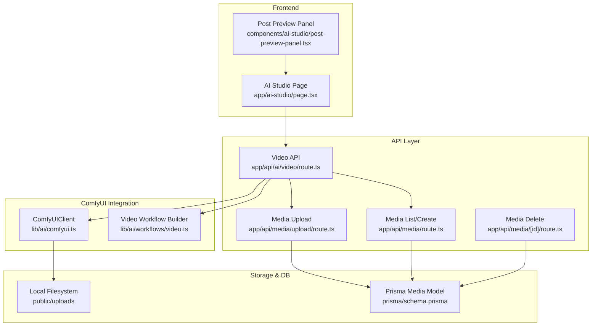
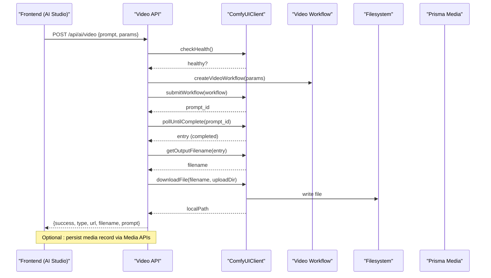
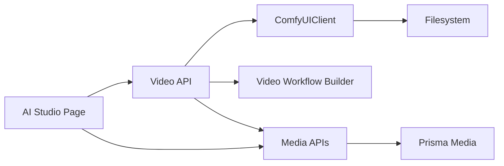

# Video Generation

<cite>
**Referenced Files in This Document**
- [route.ts](file://app/api/ai/video/route.ts)
- [comfyui.ts](file://lib/ai/comfyui.ts)
- [video.ts](file://lib/ai/workflows/video.ts)
- [upload/route.ts](file://app/api/media/upload/route.ts)
- [media route.ts](file://app/api/media/route.ts)
- [media/[id]/route.ts](file://app/api/media/[id]/route.ts)
- [page.tsx](file://app/ai-studio/page.tsx)
- [post-preview-panel.tsx](file://components/ai-studio/post-preview-panel.tsx)
- [schema.prisma](file://prisma/schema.prisma)
</cite>

## Table of Contents
1. [Introduction](#introduction)
2. [Project Structure](#project-structure)
3. [Core Components](#core-components)
4. [Architecture Overview](#architecture-overview)
5. [Detailed Component Analysis](#detailed-component-analysis)
6. [Dependency Analysis](#dependency-analysis)
7. [Performance Considerations](#performance-considerations)
8. [Troubleshooting Guide](#troubleshooting-guide)
9. [Conclusion](#conclusion)
10. [Appendices](#appendices)

## Introduction
This document explains the video generation capabilities in AI Studio, focusing on how prompts are processed, how ComfyUI is integrated to generate videos, how progress is tracked and displayed, and how generated files are downloaded and stored. It also covers error handling, retry strategies for long-running tasks, best practices for video prompts, preview behavior, media library integration, performance considerations, timeouts, and resource management.

## Project Structure
The video generation feature spans several layers:
- Frontend UI for initiating generation and showing progress/preview
- API routes that validate inputs, interact with ComfyUI, and return results or errors
- A ComfyUI client that submits workflows, polls completion, downloads outputs, and checks health
- Workflow definition that builds a ComfyUI graph for video generation
- Media APIs for storing and serving uploaded/generated assets
- Database schema defining media records

**Diagram sources**
- [route.ts:1-102](file://app/api/ai/video/route.ts#L1-L102)
- [comfyui.ts:1-161](file://lib/ai/comfyui.ts#L1-L161)
- [video.ts:1-101](file://lib/ai/workflows/video.ts#L1-L101)
- [upload/route.ts:1-126](file://app/api/media/upload/route.ts#L1-L126)
- [media route.ts:1-80](file://app/api/media/route.ts#L1-L80)
- [media/[id]/route.ts:1-74](file://app/api/media/[id]/route.ts#L1-L74)
- [page.tsx:1-748](file://app/ai-studio/page.tsx#L1-L748)
- [post-preview-panel.tsx:1-548](file://components/ai-studio/post-preview-panel.tsx#L1-L548)
- [schema.prisma:1-94](file://prisma/schema.prisma#L1-L94)

**Section sources**
- [route.ts:1-102](file://app/api/ai/video/route.ts#L1-L102)
- [comfyui.ts:1-161](file://lib/ai/comfyui.ts#L1-L161)
- [video.ts:1-101](file://lib/ai/workflows/video.ts#L1-L101)
- [upload/route.ts:1-126](file://app/api/media/upload/route.ts#L1-L126)
- [media route.ts:1-80](file://app/api/media/route.ts#L1-L80)
- [media/[id]/route.ts:1-74](file://app/api/media/[id]/route.ts#L1-L74)
- [page.tsx:1-748](file://app/ai-studio/page.tsx#L1-L748)
- [post-preview-panel.tsx:1-548](file://components/ai-studio/post-preview-panel.tsx#L1-L548)
- [schema.prisma:1-94](file://prisma/schema.prisma#L1-L94)

## Core Components
- Video API endpoint validates inputs, checks ComfyUI health, builds a workflow, submits it, polls until complete, retrieves output filename, downloads the file, and returns a URL.
- ComfyUIClient provides methods to submit workflows, poll history until completion, get output filenames, download files, and check health.
- Video workflow builder constructs a ComfyUI graph with nodes for model loading, text encoding, latent sampling, decoding, and saving video frames as GIF.
- Media APIs handle uploading, listing, creating, and deleting media records and files.
- Frontend page orchestrates user interactions, shows progress bars, and renders previews.
- Post preview panel displays platform-specific post previews and indicates generation states.

**Section sources**
- [route.ts:11-101](file://app/api/ai/video/route.ts#L11-L101)
- [comfyui.ts:33-161](file://lib/ai/comfyui.ts#L33-L161)
- [video.ts:3-101](file://lib/ai/workflows/video.ts#L3-L101)
- [upload/route.ts:20-126](file://app/api/media/upload/route.ts#L20-L126)
- [media route.ts:4-80](file://app/api/media/route.ts#L4-L80)
- [media/[id]/route.ts:13-74](file://app/api/media/[id]/route.ts#L13-L74)
- [page.tsx:331-356](file://app/ai-studio/page.tsx#L331-L356)
- [post-preview-panel.tsx:157-169](file://components/ai-studio/post-preview-panel.tsx#L157-L169)

## Architecture Overview
The video generation flow integrates frontend actions with backend APIs and an external ComfyUI service. The API layer handles validation, workflow submission, polling, and file management. The ComfyUI client abstracts network calls and timeout/polling logic. Generated files are saved locally and can be served via Next.js static/public paths. Media APIs provide CRUD operations for persistent metadata.

**Diagram sources**
- [route.ts:11-101](file://app/api/ai/video/route.ts#L11-L101)
- [comfyui.ts:44-143](file://lib/ai/comfyui.ts#L44-L143)
- [video.ts:3-101](file://lib/ai/workflows/video.ts#L3-L101)

## Detailed Component Analysis

### Video API Endpoint
- Validates prompt and parameters (dimensions, frames).
- Checks ComfyUI health; returns 503 if offline.
- Builds workflow using the video workflow builder.
- Submits workflow and polls until completion.
- Retrieves output filename and downloads the file to the configured upload directory.
- Returns success payload with URL and metadata; otherwise returns structured errors.

Key behaviors:
- Input validation ensures safe dimensions and frame counts.
- Health check prevents submitting workloads when ComfyUI is unavailable.
- Polling uses configurable interval and timeout to avoid hanging requests.
- File download writes to disk and computes a public URL path.

**Section sources**
- [route.ts:11-101](file://app/api/ai/video/route.ts#L11-L101)

### ComfyUIClient
- submitWorkflow: POSTs the workflow JSON to ComfyUI with timeout control and returns prompt_id.
- pollUntilComplete: Repeatedly fetches history for the prompt_id until completed or error; throws on timeout.
- getOutputFilename: Extracts the first image/video filename from outputs.
- getFileUrl: Builds a view URL for a given filename.
- downloadFile: Fetches binary content and writes to destination directory; returns local path.
- checkHealth: GETs system stats to verify availability.

Error handling:
- Throws descriptive errors for non-ok responses, missing prompt_id, generation failures, and timeouts.
- Uses AbortController and AbortSignal.timeout for request-level timeouts.

**Section sources**
- [comfyui.ts:33-161](file://lib/ai/comfyui.ts#L33-L161)

### Video Workflow Builder
- Constructs a ComfyUI workflow graph with nodes for:
  - UNet loader
  - Dual CLIP loader
  - Positive/negative text encoding
  - Empty latent video setup
  - KSampler with seed, steps, cfg, sampler, scheduler
  - VAEDecode
  - SaveVideo with fps and format
- Defaults include width, height, frames, fps, steps, cfg, random seed, and checkpoint name.

Notes:
- Format set to GIF in the current implementation; ensure downstream consumers support GIF playback or adjust format accordingly.
- Seed is randomized by default for variety.

**Section sources**
- [video.ts:3-101](file://lib/ai/workflows/video.ts#L3-L101)

### Media APIs
- Upload:
  - Accepts multipart/form-data or form-urlencoded with a file and contentId.
  - Validates content type and size (max 50 MB).
  - Writes file to public/uploads and creates a Prisma Media record with URL, filename, mimeType, size, and type.
- List/Create:
  - Lists recent media entries.
  - Creates media records programmatically with required fields.
- Delete:
  - Deletes media record and attempts to remove the underlying file; ignores ENOENT for idempotency.

Integration points:
- After video generation, you can call the media create/list endpoints to register the generated asset in the database for consistent retrieval and lifecycle management.

**Section sources**
- [upload/route.ts:20-126](file://app/api/media/upload/route.ts#L20-L126)
- [media route.ts:4-80](file://app/api/media/route.ts#L4-L80)
- [media/[id]/route.ts:13-74](file://app/api/media/[id]/route.ts#L13-L74)

### Frontend Progress Indication and Preview
- The AI Studio page includes a video tab with a progress bar that updates percentage values during simulated generation.
- The Post Preview Panel shows a “Live Preview” with device frames and indicates generation state with a spinner and status messages.
- For real-time progress from ComfyUI, extend the client to emit incremental updates (e.g., per-node completion) and update the UI accordingly.

Current behavior:
- Progress is currently simulated in the frontend; the backend does not stream intermediate progress.
- Preview placeholders indicate where generated video would render once available.

**Section sources**
- [page.tsx:331-356](file://app/ai-studio/page.tsx#L331-L356)
- [post-preview-panel.tsx:157-169](file://components/ai-studio/post-preview-panel.tsx#L157-L169)

### Data Models
- Media model stores references to content, URLs, filenames, MIME types, sizes, and timestamps.
- Index on contentId supports efficient queries for content-associated media.

**Section sources**
- [schema.prisma:21-55](file://prisma/schema.prisma#L21-L55)

## Dependency Analysis
- Video API depends on ComfyUIClient and the video workflow builder.
- ComfyUIClient depends on environment variables for base URL and configuration.
- Media APIs depend on Prisma client and filesystem access.
- Frontend components depend on API routes and display state based on generation flags.

**Diagram sources**
- [route.ts:1-102](file://app/api/ai/video/route.ts#L1-L102)
- [comfyui.ts:1-161](file://lib/ai/comfyui.ts#L1-L161)
- [video.ts:1-101](file://lib/ai/workflows/video.ts#L1-L101)
- [upload/route.ts:1-126](file://app/api/media/upload/route.ts#L1-L126)
- [media route.ts:1-80](file://app/api/media/route.ts#L1-L80)
- [page.tsx:1-748](file://app/ai-studio/page.tsx#L1-L748)

**Section sources**
- [route.ts:1-102](file://app/api/ai/video/route.ts#L1-L102)
- [comfyui.ts:1-161](file://lib/ai/comfyui.ts#L1-L161)
- [video.ts:1-101](file://lib/ai/workflows/video.ts#L1-L101)
- [upload/route.ts:1-126](file://app/api/media/upload/route.ts#L1-L126)
- [media route.ts:1-80](file://app/api/media/route.ts#L1-L80)
- [page.tsx:1-748](file://app/ai-studio/page.tsx#L1-L748)

## Performance Considerations
- Timeouts:
  - ComfyUIClient uses a configurable timeout for both submission and polling; tune based on expected generation duration.
  - Health check uses a short timeout to fail fast when ComfyUI is unreachable.
- Polling Interval:
  - Adjust pollInterval to balance responsiveness and server load; shorter intervals increase frequency of history checks.
- Resource Usage:
  - Large frame counts and high resolutions increase memory and compute usage; constrain frames and dimensions to reasonable limits.
  - GIF format may produce large files; consider alternative formats (e.g., MP4/WebM) if supported by your ComfyUI setup.
- Storage:
  - Ensure adequate disk space in the upload directory; monitor growth and implement cleanup policies.
- Concurrency:
  - Limit concurrent generations to prevent resource exhaustion; consider queuing or rate-limiting at the API layer.

[No sources needed since this section provides general guidance]

## Troubleshooting Guide
Common issues and remedies:
- Prompt missing or invalid:
  - Ensure prompt is provided and non-empty; validate dimensions and frames within allowed ranges.
- ComfyUI offline:
  - Health check fails; start ComfyUI service and retry.
- Generation failure:
  - ComfyUI returns error in history; inspect logs and workflow configuration.
- Timeout exceeded:
  - Increase timeout or reduce workload complexity (fewer frames/steps); optimize prompt and checkpoint selection.
- Download failure:
  - Network or permissions issue retrieving output; verify ComfyUI view endpoint accessibility and filesystem write permissions.
- Media deletion errors:
  - Non-existent files are ignored; other errors propagate; check filesystem permissions and paths.

Operational tips:
- Log detailed errors from API and client layers for faster diagnosis.
- Use retries with exponential backoff for transient network errors when calling ComfyUI endpoints.
- Validate environment variables (COMFYUI_URL, AI_UPLOAD_DIR) before deployment.

**Section sources**
- [route.ts:24-101](file://app/api/ai/video/route.ts#L24-L101)
- [comfyui.ts:44-161](file://lib/ai/comfyui.ts#L44-L161)
- [media/[id]/route.ts:37-74](file://app/api/media/[id]/route.ts#L37-L74)

## Conclusion
The AI Studio video generation pipeline integrates a robust API layer with ComfyUI to process prompts, build workflows, and deliver generated videos. The ComfyUIClient encapsulates networking, polling, and file management, while Media APIs provide persistent storage and retrieval. The frontend offers progress indication and previews, ready to integrate real-time updates. By tuning timeouts, polling intervals, and workload parameters, and by implementing retries and monitoring, the system can reliably handle long-running video generation tasks.

[No sources needed since this section summarizes without analyzing specific files]

## Appendices

### Best Practices for Video Prompts
- Be specific about subject, style, motion, and composition to guide the model effectively.
- Include negative prompts to exclude unwanted artifacts (e.g., low quality, blurry, extra digits).
- Keep prompts concise but descriptive; overly verbose prompts can dilute focus.
- Test variations of prompts and parameters (steps, cfg, frames) to find optimal quality vs. speed.

[No sources needed since this section provides general guidance]

### Optimization Techniques
- Reduce frames and resolution for faster iterations; increase only when necessary.
- Use appropriate checkpoints optimized for video generation.
- Adjust sampler and scheduler settings for better convergence.
- Cache or reuse seeds for reproducibility during experimentation.

[No sources needed since this section provides general guidance]

### Preview System and Media Library Integration
- The Post Preview Panel renders platform-specific layouts and indicates generation states.
- After generation, store media records via Media APIs to enable listing, linking to content, and lifecycle management.
- Extend the frontend to fetch and display actual generated videos from the media library once persisted.

**Section sources**
- [post-preview-panel.tsx:157-169](file://components/ai-studio/post-preview-panel.tsx#L157-L169)
- [media route.ts:4-80](file://app/api/media/route.ts#L4-L80)

### Error Handling Strategies and Retry Mechanisms
- Implement retry with exponential backoff for transient failures when calling ComfyUI endpoints.
- Surface user-friendly errors and actionable messages in the UI.
- Log server-side errors with context (prompt, parameters, prompt_id) for debugging.

**Section sources**
- [route.ts:88-101](file://app/api/ai/video/route.ts#L88-L101)
- [comfyui.ts:56-103](file://lib/ai/comfyui.ts#L56-L103)