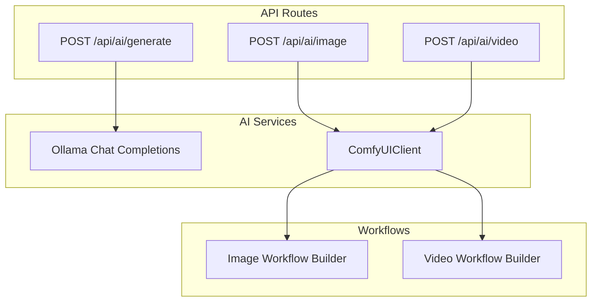
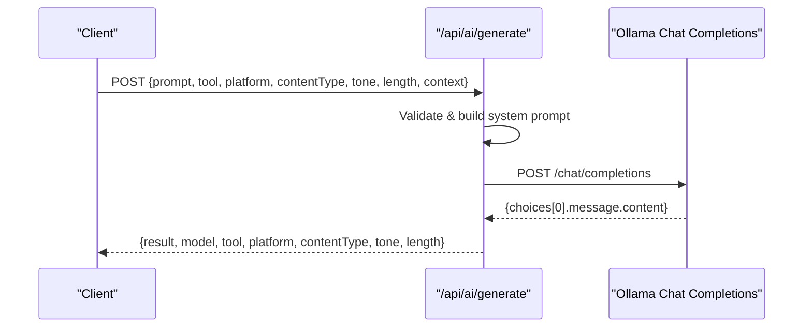
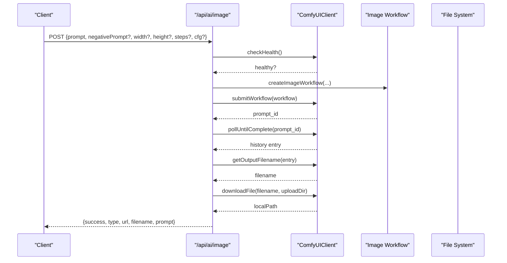
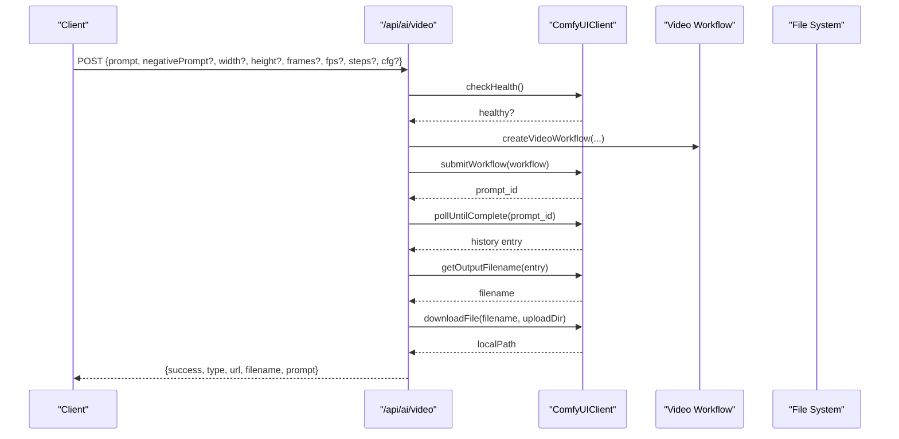
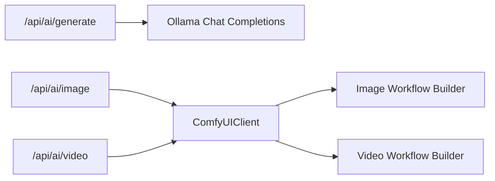

# AI Generation APIs

<cite>
**Referenced Files in This Document**
- [route.ts](file://app/api/ai/generate/route.ts)
- [route.ts](file://app/api/ai/image/route.ts)
- [route.ts](file://app/api/ai/video/route.ts)
- [comfyui.ts](file://lib/ai/comfyui.ts)
- [image.ts](file://lib/ai/workflows/image.ts)
- [video.ts](file://lib/ai/workflows/video.ts)
- [README.md](file://README.md)
</cite>

## Table of Contents
1. [Introduction](#introduction)
2. [Project Structure](#project-structure)
3. [Core Components](#core-components)
4. [Architecture Overview](#architecture-overview)
5. [Detailed Component Analysis](#detailed-component-analysis)
6. [Dependency Analysis](#dependency-analysis)
7. [Performance Considerations](#performance-considerations)
8. [Troubleshooting Guide](#troubleshooting-guide)
9. [Conclusion](#conclusion)

## Introduction
This document provides comprehensive API documentation for the AI generation endpoints in ContentOS, focusing on:
- Text content generation via POST /api/ai/generate
- Image generation with ComfyUI integration via POST /api/ai/image
- Video generation with ComfyUI integration via POST /api/ai/video

It covers request parameters, response schemas, workflow modes, authentication considerations, error handling patterns, and rate limiting guidance based on the codebase.

## Project Structure
The AI generation features are implemented as Next.js App Router routes under app/api/ai, with shared logic in lib/ai for ComfyUI client and workflow builders.

**Diagram sources**
- [route.ts:87-217](file://app/api/ai/generate/route.ts#L87-L217)
- [route.ts:11-90](file://app/api/ai/image/route.ts#L11-L90)
- [route.ts:11-101](file://app/api/ai/video/route.ts#L11-L101)
- [comfyui.ts:33-160](file://lib/ai/comfyui.ts#L33-L160)
- [image.ts:3-83](file://lib/ai/workflows/image.ts#L3-L83)
- [video.ts:3-100](file://lib/ai/workflows/video.ts#L3-L100)

**Section sources**
- [README.md:351-367](file://README.md#L351-L367)

## Core Components
- Text generation route: Validates input, builds a system prompt based on workflow mode, and calls an Ollama-compatible chat completions endpoint.
- Image generation route: Validates inputs, checks ComfyUI health, builds an image workflow, submits it, polls until completion, downloads the output, and returns a URL.
- Video generation route: Similar to image but uses a video workflow builder and outputs a GIF.
- ComfyUI client: Encapsulates submission, polling, output extraction, file download, and health checks.
- Workflow builders: Construct ComfyUI node graphs for image and video generation.

**Section sources**
- [route.ts:87-217](file://app/api/ai/generate/route.ts#L87-L217)
- [route.ts:11-90](file://app/api/ai/image/route.ts#L11-L90)
- [route.ts:11-101](file://app/api/ai/video/route.ts#L11-L101)
- [comfyui.ts:33-160](file://lib/ai/comfyui.ts#L33-L160)
- [image.ts:3-83](file://lib/ai/workflows/image.ts#L3-L83)
- [video.ts:3-100](file://lib/ai/workflows/video.ts#L3-L100)

## Architecture Overview
Text generation flows through an Ollama-compatible provider; image and video generation flow through ComfyUI with local asset storage.

**Diagram sources**
- [route.ts:87-217](file://app/api/ai/generate/route.ts#L87-L217)

**Diagram sources**
- [route.ts:11-90](file://app/api/ai/image/route.ts#L11-L90)
- [comfyui.ts:44-143](file://lib/ai/comfyui.ts#L44-L143)
- [image.ts:3-83](file://lib/ai/workflows/image.ts#L3-L83)

**Diagram sources**
- [route.ts:11-101](file://app/api/ai/video/route.ts#L11-L101)
- [comfyui.ts:44-143](file://lib/ai/comfyui.ts#L44-L143)
- [video.ts:3-100](file://lib/ai/workflows/video.ts#L3-L100)

## Detailed Component Analysis

### Text Generation: POST /api/ai/generate
- Purpose: Generate text content using a configurable workflow mode and parameters.
- Request body parameters:
  - prompt (string, required): The user’s content request.
  - tool (string, optional, default "Write Content"): One of "Generate Ideas", "Generate Hook", "Generate Title", "Write Content", "Repurpose".
  - platform (string, optional, default "General"): Target platform context.
  - contentType (string, optional, default "Post"): Type of content being generated.
  - tone (string, optional, default "Engaging"): Desired tone.
  - length (string, optional, default "Medium"): Desired length.
  - context (string, optional): Additional previous context to include.
- Behavior:
  - Validates presence of prompt.
  - Builds a system prompt that encodes workflow instructions and constraints.
  - Calls Ollama-compatible chat completions endpoint with model and message array.
  - Returns the first choice’s message content or an error if empty/unavailable.
- Response schema:
  - Success:
    - result (string): Generated content.
    - model (string): Model identifier used.
    - tool (string): Selected workflow tool.
    - platform (string): Platform context.
    - contentType (string): Content type.
    - tone (string): Tone setting.
    - length (string): Length setting.
  - Error:
    - error (string): Description of failure.
    - Status codes: 400 for missing prompt; 502 for provider errors or empty response; 500 for server-side failures.

Example request:
- Method: POST
- Path: /api/ai/generate
- Body:
  - prompt: "Create a LinkedIn post about productivity tips."
  - tool: "Write Content"
  - platform: "LinkedIn"
  - contentType: "Post"
  - tone: "Professional"
  - length: "Long"
  - context: "Audience is startup founders."

Example response:
- {
    "result": "...generated content...",
    "model": "qwen2.5-coder:7b",
    "tool": "Write Content",
    "platform": "LinkedIn",
    "contentType": "Post",
    "tone": "Professional",
    "length": "Long"
  }

Authentication:
- No explicit authentication middleware is applied to this endpoint in the current implementation.

Rate limiting:
- No built-in rate limiting is present in the route.

Error handling:
- Missing prompt returns 400.
- Provider errors return 502 with error details.
- Empty responses return 502.
- Unexpected exceptions return 500 with error message.

**Section sources**
- [route.ts:87-217](file://app/api/ai/generate/route.ts#L87-L217)

### Image Generation: POST /api/ai/image
- Purpose: Generate images via ComfyUI workflows and store locally.
- Request body parameters:
  - prompt (string, required): Positive prompt describing the desired image.
  - negativePrompt (string, optional): Negative prompt to avoid undesired elements.
  - width (number, optional, default 1024): Image width.
  - height (number, optional, default 1024): Image height.
  - steps (number, optional, default 30): Sampling steps.
  - cfg (number, optional, default 7): Classifier-free guidance scale.
- Behavior:
  - Validates prompt and dimensions.
  - Checks ComfyUI health; returns 503 if offline.
  - Builds an image workflow using the workflow builder.
  - Submits workflow and polls until completion.
  - Extracts output filename, downloads the file to the configured upload directory, and computes a public URL path.
- Response schema:
  - Success:
    - success (boolean): true
    - type (string): "image"
    - url (string): Public URL path to the generated image.
    - filename (string): Original filename from ComfyUI.
    - prompt (string): Input prompt.
  - Error:
    - success (boolean): false
    - error (string): Description of failure.
    - Status codes: 400 for invalid inputs; 503 for offline engine; 500 for generation or download failures.

Example request:
- Method: POST
- Path: /api/ai/image
- Body:
  - prompt: "A minimalist logo for a tech startup"
  - negativePrompt: "text, watermark, blurry"
  - width: 1024
  - height: 1024
  - steps: 30
  - cfg: 7

Example response:
- {
    "success": true,
    "type": "image",
    "url": "/public/uploads/<unique-filename>",
    "filename": "<original-filename>",
    "prompt": "A minimalist logo for a tech startup"
  }

Authentication:
- No explicit authentication middleware is applied to this endpoint in the current implementation.

Rate limiting:
- No built-in rate limiting is present in the route.

Error handling:
- Missing or invalid inputs return 400.
- Offline ComfyUI returns 503.
- Generation or download failures return 500.

**Section sources**
- [route.ts:11-90](file://app/api/ai/image/route.ts#L11-L90)
- [comfyui.ts:44-143](file://lib/ai/comfyui.ts#L44-L143)
- [image.ts:3-83](file://lib/ai/workflows/image.ts#L3-L83)

### Video Generation: POST /api/ai/video
- Purpose: Generate short videos (GIF) via ComfyUI workflows and store locally.
- Request body parameters:
  - prompt (string, required): Positive prompt describing the desired video.
  - negativePrompt (string, optional): Negative prompt to avoid undesired elements.
  - width (number, optional, default 832): Video width.
  - height (number, optional, default 480): Video height.
  - frames (number, optional, default 49): Number of frames; must be between 1 and 100.
  - fps (number, optional, default 16): Frames per second.
  - steps (number, optional, default 20): Sampling steps.
  - cfg (number, optional, default 6): Classifier-free guidance scale.
- Behavior:
  - Validates prompt, dimensions, and frame range.
  - Checks ComfyUI health; returns 503 if offline.
  - Builds a video workflow using the workflow builder.
  - Submits workflow and polls until completion.
  - Extracts output filename, downloads the file to the configured upload directory, and computes a public URL path.
- Response schema:
  - Success:
    - success (boolean): true
    - type (string): "video"
    - url (string): Public URL path to the generated video (GIF).
    - filename (string): Original filename from ComfyUI.
    - prompt (string): Input prompt.
  - Error:
    - success (boolean): false
    - error (string): Description of failure.
    - Status codes: 400 for invalid inputs; 503 for offline engine; 500 for generation or download failures.

Example request:
- Method: POST
- Path: /api/ai/video
- Body:
  - prompt: "A smooth animation of a rising sun over mountains"
  - negativePrompt: "blurry, low quality"
  - width: 832
  - height: 480
  - frames: 49
  - fps: 16
  - steps: 20
  - cfg: 6

Example response:
- {
    "success": true,
    "type": "video",
    "url": "/public/uploads/<unique-filename>.gif",
    "filename": "<original-filename>.gif",
    "prompt": "A smooth animation of a rising sun over mountains"
  }

Authentication:
- No explicit authentication middleware is applied to this endpoint in the current implementation.

Rate limiting:
- No built-in rate limiting is present in the route.

Error handling:
- Missing or invalid inputs return 400.
- Frames outside allowed range return 400.
- Offline ComfyUI returns 503.
- Generation or download failures return 500.

**Section sources**
- [route.ts:11-101](file://app/api/ai/video/route.ts#L11-L101)
- [comfyui.ts:44-143](file://lib/ai/comfyui.ts#L44-L143)
- [video.ts:3-100](file://lib/ai/workflows/video.ts#L3-L100)

## Dependency Analysis
- Text generation depends on environment variables for the AI provider base URL and model name, and calls a chat completions endpoint compatible with OpenAI-style interfaces.
- Image and video generation depend on a running ComfyUI instance, using a client that handles submission, polling, and file retrieval.
- Workflows define node graphs for image and video generation, including loaders, samplers, decoders, and save nodes.

**Diagram sources**
- [route.ts:87-217](file://app/api/ai/generate/route.ts#L87-L217)
- [route.ts:11-90](file://app/api/ai/image/route.ts#L11-L90)
- [route.ts:11-101](file://app/api/ai/video/route.ts#L11-L101)
- [comfyui.ts:33-160](file://lib/ai/comfyui.ts#L33-L160)
- [image.ts:3-83](file://lib/ai/workflows/image.ts#L3-L83)
- [video.ts:3-100](file://lib/ai/workflows/video.ts#L3-L100)

**Section sources**
- [README.md:351-367](file://README.md#L351-L367)

## Performance Considerations
- Text generation:
  - Uses fixed temperature and max tokens; adjust model settings at the provider level if needed.
  - Avoid excessively large prompts to reduce latency and token usage.
- Image and video generation:
  - Polling interval and timeout are configurable via the ComfyUIClient options; tune based on expected generation time.
  - Large dimensions and high frame counts increase processing time and memory usage.
  - Local file I/O occurs during download; ensure sufficient disk space and consider caching strategies.

[No sources needed since this section provides general guidance]

## Troubleshooting Guide
Common issues and resolutions:
- Missing prompt:
  - Text generation returns 400 with error indicating prompt is required.
  - Ensure the request includes a non-empty prompt string.
- Invalid dimensions:
  - Image and video endpoints return 400 when width or height are not positive.
  - Verify numeric values and ranges.
- Frames out of range:
  - Video endpoint enforces frames between 1 and 100; adjust accordingly.
- ComfyUI offline:
  - Health check fails; returns 503 with message instructing to start ComfyUI.
  - Confirm COMFYUI_URL is set and the service is reachable.
- Generation failures:
  - If no output filename is found or download fails, endpoints return 500.
  - Check ComfyUI logs and workflow configuration.
- Provider errors:
  - Text generation may return 502 if the AI provider responds with an error or empty content.
  - Inspect provider availability and model configuration.

**Section sources**
- [route.ts:87-217](file://app/api/ai/generate/route.ts#L87-L217)
- [route.ts:11-90](file://app/api/ai/image/route.ts#L11-L90)
- [route.ts:11-101](file://app/api/ai/video/route.ts#L11-L101)
- [comfyui.ts:72-103](file://lib/ai/comfyui.ts#L72-L103)

## Conclusion
ContentOS exposes three primary AI generation endpoints:
- Text generation via an Ollama-compatible provider with flexible workflow modes.
- Image generation via ComfyUI with robust polling and local asset management.
- Video generation via ComfyUI producing GIFs with configurable parameters.

These endpoints provide clear validation, consistent error handling, and predictable response schemas. Authentication and rate limiting are not enforced at the route level in the current implementation; integrate external middleware or gateway controls as needed for production environments.

[No sources needed since this section summarizes without analyzing specific files]