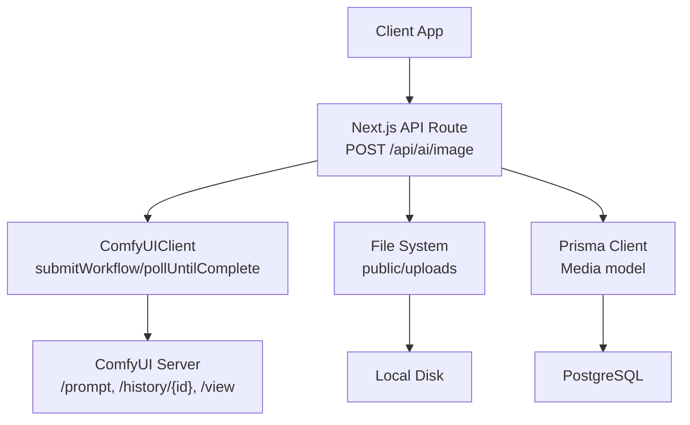
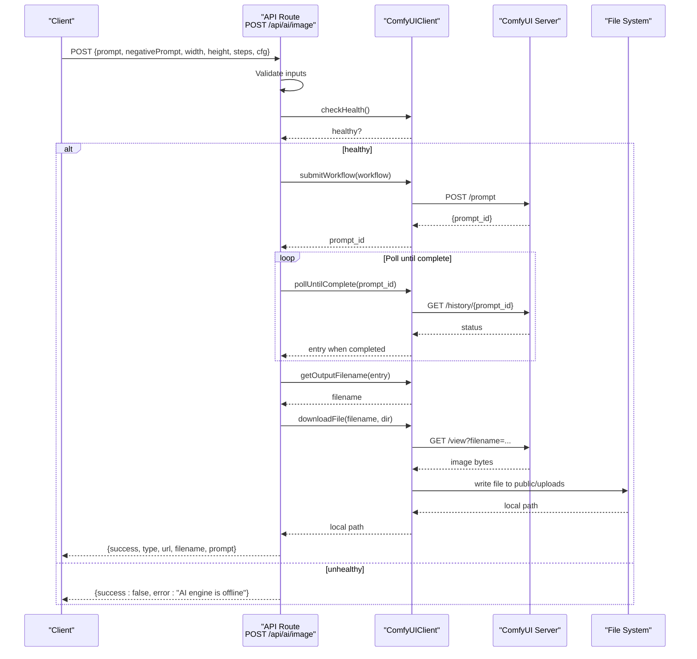
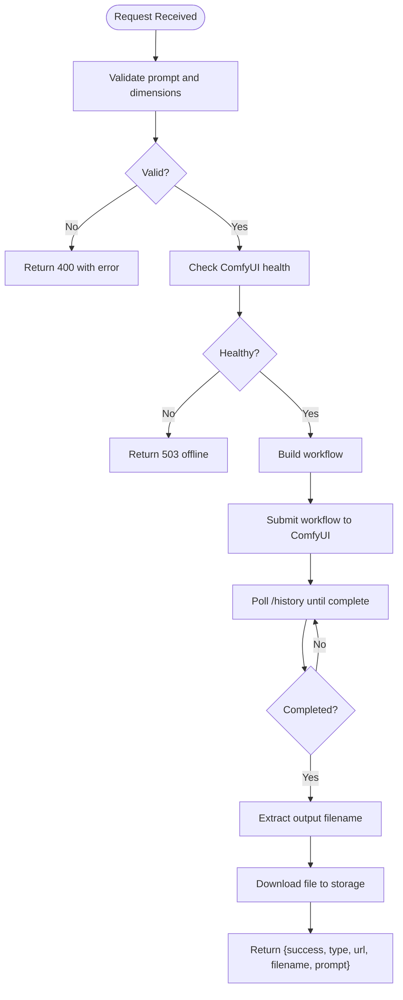
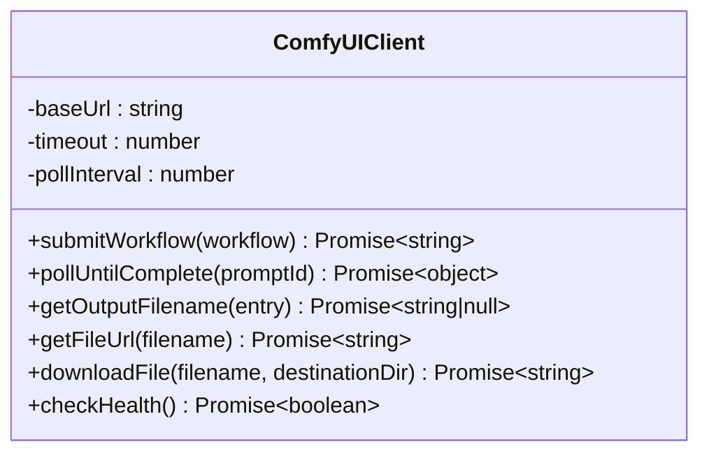
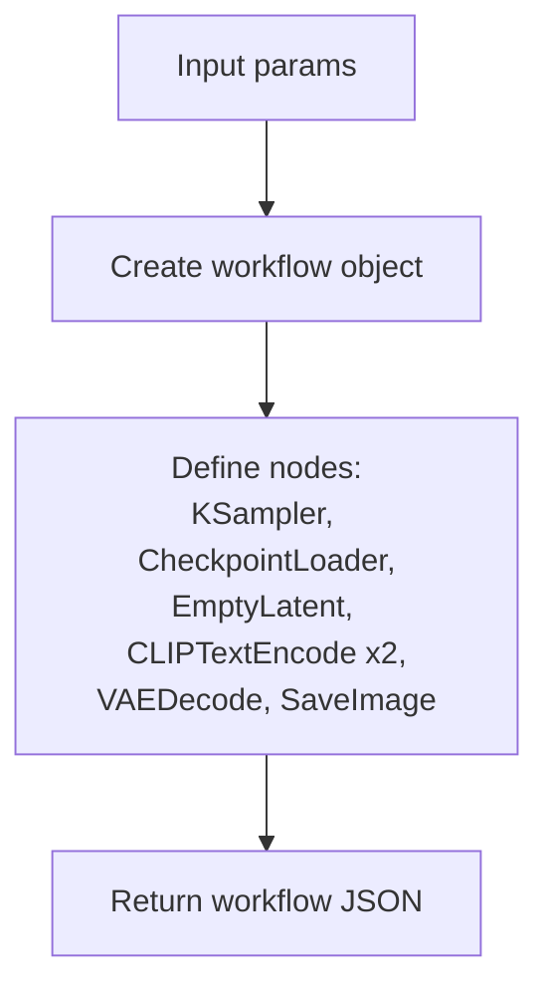
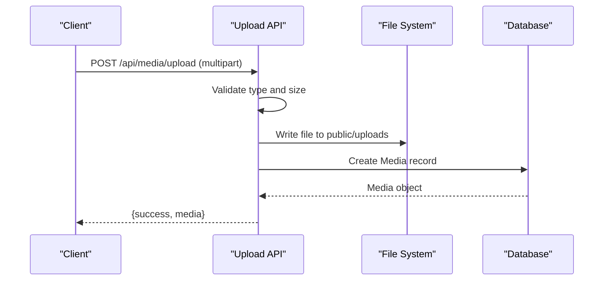
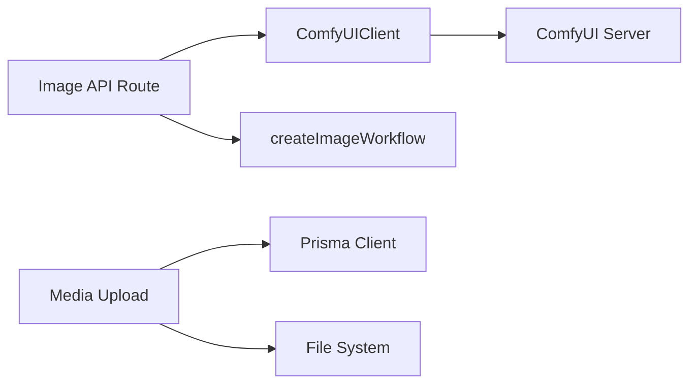

# Image Generation API

<cite>
**Referenced Files in This Document**
- [route.ts](file://app/api/ai/image/route.ts)
- [comfyui.ts](file://lib/ai/comfyui.ts)
- [image.ts](file://lib/ai/workflows/image.ts)
- [video.ts](file://lib/ai/workflows/video.ts)
- [route.ts](file://app/api/media/upload/route.ts)
- [route.ts](file://app/api/media/[id]/route.ts)
- [schema.prisma](file://prisma/schema.prisma)
</cite>

## Table of Contents
1. [Introduction](#introduction)
2. [Project Structure](#project-structure)
3. [Core Components](#core-components)
4. [Architecture Overview](#architecture-overview)
5. [Detailed Component Analysis](#detailed-component-analysis)
6. [Dependency Analysis](#dependency-analysis)
7. [Performance Considerations](#performance-considerations)
8. [Troubleshooting Guide](#troubleshooting-guide)
9. [Conclusion](#conclusion)
10. [Appendices](#appendices)

## Introduction
This document provides comprehensive API documentation for image generation endpoints integrated with ComfyUI. It covers the request schemas, response formats, workflow submission and polling mechanisms, asset retrieval processes, error handling, and best practices for large files. The system uses a Next.js API route to orchestrate ComfyUI workflows, poll for completion, download generated assets, and return accessible URLs.

## Project Structure
The image generation feature is implemented as follows:
- API endpoint for image generation at app/api/ai/image/route.ts
- ComfyUI client abstraction at lib/ai/comfyui.ts
- Workflow builders for images and videos under lib/ai/workflows
- Media upload and management endpoints under app/api/media
- Database schema for media records under prisma/schema.prisma

**Diagram sources**
- [route.ts:11-90](file://app/api/ai/image/route.ts#L11-L90)
- [comfyui.ts:44-143](file://lib/ai/comfyui.ts#L44-L143)
- [image.ts:3-83](file://lib/ai/workflows/image.ts#L3-L83)
- [route.ts:20-126](file://app/api/media/upload/route.ts#L20-L126)
- [schema.prisma:39-55](file://prisma/schema.prisma#L39-L55)

**Section sources**
- [route.ts:11-90](file://app/api/ai/image/route.ts#L11-L90)
- [comfyui.ts:33-161](file://lib/ai/comfyui.ts#L33-L161)
- [image.ts:3-83](file://lib/ai/workflows/image.ts#L3-L83)
- [route.ts:20-126](file://app/api/media/upload/route.ts#L20-L126)
- [schema.prisma:39-55](file://prisma/schema.prisma#L39-L55)

## Core Components
- Image generation endpoint: Validates inputs, checks ComfyUI health, builds workflow, submits job, polls until complete, downloads output, and returns a URL.
- ComfyUI client: Encapsulates HTTP interactions with ComfyUI including workflow submission, history polling, output filename extraction, file download, and health check.
- Workflow builder: Constructs a ComfyUI workflow JSON for image generation with prompt, negative prompt, dimensions, steps, CFG, seed, and checkpoint.
- Media upload: Accepts multipart uploads, validates type and size, persists to disk, and stores metadata in the database.
- Media deletion: Removes file from disk and deletes record from the database.

**Section sources**
- [route.ts:11-90](file://app/api/ai/image/route.ts#L11-L90)
- [comfyui.ts:44-143](file://lib/ai/comfyui.ts#L44-L143)
- [image.ts:3-83](file://lib/ai/workflows/image.ts#L3-L83)
- [route.ts:20-126](file://app/api/media/upload/route.ts#L20-L126)
- [route.ts:13-74](file://app/api/media/[id]/route.ts#L13-L74)

## Architecture Overview
The end-to-end flow for image generation:
1. Client sends POST /api/ai/image with prompt and parameters.
2. Endpoint validates input and checks ComfyUI health.
3. Workflow is built using createImageWorkflow.
4. ComfyUIClient.submitWorkflow posts the workflow to ComfyUI and receives a prompt_id.
5. ComfyUIClient.pollUntilComplete repeatedly queries /history/{prompt_id} until completed or errored.
6. On success, getOutputFilename extracts the generated image filename.
7. downloadFile fetches the image via /view?filename=... and saves it locally (e.g., public/uploads).
8. Endpoint returns a JSON response with a URL path to the saved image.

**Diagram sources**
- [route.ts:11-90](file://app/api/ai/image/route.ts#L11-L90)
- [comfyui.ts:44-143](file://lib/ai/comfyui.ts#L44-L143)
- [image.ts:3-83](file://lib/ai/workflows/image.ts#L3-L83)

## Detailed Component Analysis

### Image Generation Endpoint
- Purpose: Accept image generation requests, validate parameters, integrate with ComfyUI, and return a downloadable URL.
- Request body fields:
  - prompt: string (required)
  - negativePrompt: string (optional)
  - width: number (default 1024)
  - height: number (default 1024)
  - steps: number (default 30)
  - cfg: number (default 7)
- Response on success:
  - success: boolean
  - type: "image"
  - url: string (path to saved image)
  - filename: string (original ComfyUI filename)
  - prompt: string (echoed back)
- Error responses:
  - 400: Missing prompt or invalid dimensions
  - 503: AI engine offline
  - 500: Generation failed or unexpected error

**Diagram sources**
- [route.ts:11-90](file://app/api/ai/image/route.ts#L11-L90)

**Section sources**
- [route.ts:11-90](file://app/api/ai/image/route.ts#L11-L90)

### ComfyUI Client
- Responsibilities:
  - submitWorkflow: POST /prompt with workflow JSON; returns prompt_id
  - pollUntilComplete: Repeatedly GET /history/{prompt_id} until status.completed or error; supports timeout and configurable poll interval
  - getOutputFilename: Scans outputs to find first image filename
  - getFileUrl: Builds /view URL for a given filename
  - downloadFile: Fetches image via /view and writes to local directory
  - checkHealth: GET /system_stats to verify service availability
- Configuration:
  - baseUrl from options or COMFYUI_URL environment variable
  - timeout defaults to 600000 ms
  - pollInterval defaults to 2000 ms

**Diagram sources**
- [comfyui.ts:33-161](file://lib/ai/comfyui.ts#L33-L161)

**Section sources**
- [comfyui.ts:33-161](file://lib/ai/comfyui.ts#L33-L161)

### Image Workflow Builder
- Purpose: Construct a ComfyUI workflow JSON for image generation.
- Parameters:
  - prompt: string
  - negativePrompt: string (optional)
  - width: number (default 1024)
  - height: number (default 1024)
  - steps: number (default 30)
  - cfg: number (default 7)
  - seed: number (random if not provided)
  - checkpoint: string (default sd_xl_base_1.0.safetensors)
- Nodes included:
  - KSampler, CheckpointLoaderSimple, EmptyLatentImage, CLIPTextEncode (positive/negative), VAEDecode, SaveImage

**Diagram sources**
- [image.ts:3-83](file://lib/ai/workflows/image.ts#L3-L83)

**Section sources**
- [image.ts:3-83](file://lib/ai/workflows/image.ts#L3-L83)

### Media Upload and Retrieval
- Upload endpoint:
  - Accepts multipart/form-data with file and contentId
  - Validates MIME types and file size (max 50 MB)
  - Saves file to public/uploads and creates a Media record with URL, filename, mimeType, size, and type
- Delete endpoint:
  - Deletes file from disk and removes Media record by id
- Database model:
  - Media includes url, filename, mimeType, size, type, and relations to Content

**Diagram sources**
- [route.ts:20-126](file://app/api/media/upload/route.ts#L20-L126)
- [schema.prisma:39-55](file://prisma/schema.prisma#L39-L55)

**Section sources**
- [route.ts:20-126](file://app/api/media/upload/route.ts#L20-L126)
- [route.ts:13-74](file://app/api/media/[id]/route.ts#L13-L74)
- [schema.prisma:39-55](file://prisma/schema.prisma#L39-L55)

## Dependency Analysis
- API route depends on:
  - ComfyUIClient for external integration
  - createImageWorkflow for building workflow payloads
- ComfyUIClient depends on:
  - Environment variables (COMFYUI_URL)
  - Node fs/promises for file operations
- Workflow modules depend on ComfyUI node definitions and default models
- Media endpoints depend on Prisma client and filesystem

**Diagram sources**
- [route.ts:11-90](file://app/api/ai/image/route.ts#L11-L90)
- [comfyui.ts:44-143](file://lib/ai/comfyui.ts#L44-L143)
- [image.ts:3-83](file://lib/ai/workflows/image.ts#L3-L83)
- [route.ts:20-126](file://app/api/media/upload/route.ts#L20-L126)

**Section sources**
- [route.ts:11-90](file://app/api/ai/image/route.ts#L11-L90)
- [comfyui.ts:44-143](file://lib/ai/comfyui.ts#L44-L143)
- [image.ts:3-83](file://lib/ai/workflows/image.ts#L3-L83)
- [route.ts:20-126](file://app/api/media/upload/route.ts#L20-L126)

## Performance Considerations
- Polling interval and timeout:
  - pollInterval defaults to 2000 ms; adjust based on expected generation time and server load
  - timeout defaults to 600000 ms; ensure clients handle long-running requests appropriately
- Large image handling:
  - Images are downloaded into memory as blobs then written to disk; consider streaming or chunked writes for very large outputs
  - Use compression or resizing before serving to reduce bandwidth
- Concurrency:
  - Each request blocks while polling; consider queuing or background jobs for high throughput
- Storage:
  - Ensure sufficient disk space in public/uploads; monitor growth and implement cleanup policies
- Network:
  - ComfyUI server should be co-located or low-latency to minimize transfer times

[No sources needed since this section provides general guidance]

## Troubleshooting Guide
Common errors and resolutions:
- Missing prompt:
  - Cause: prompt field omitted or empty
  - Resolution: Provide a non-empty prompt string
- Invalid dimensions:
  - Cause: width or height <= 0
  - Resolution: Set positive integer values for width and height
- AI engine offline:
  - Cause: ComfyUI server unreachable or unhealthy
  - Resolution: Start ComfyUI and verify COMFYUI_URL configuration
- Generation failed:
  - Cause: ComfyUI returned no output or internal error
  - Resolution: Retry request; inspect ComfyUI logs for node errors
- Timed out:
  - Cause: pollUntilComplete exceeded timeout
  - Resolution: Increase timeout or optimize workflow parameters (steps, resolution)
- Upload failures:
  - Cause: Unsupported MIME type or file too large (>50 MB)
  - Resolution: Convert to supported format and compress file size

**Section sources**
- [route.ts:22-42](file://app/api/ai/image/route.ts#L22-L42)
- [route.ts:57-62](file://app/api/ai/image/route.ts#L57-L62)
- [comfyui.ts:72-103](file://lib/ai/comfyui.ts#L72-L103)
- [route.ts:53-65](file://app/api/media/upload/route.ts#L53-L65)

## Conclusion
The Image Generation API integrates seamlessly with ComfyUI to provide robust image creation capabilities. It validates inputs, manages asynchronous workflows through polling, and delivers accessible URLs for generated assets. By following the documented request schemas, error handling patterns, and performance recommendations, clients can reliably generate images and manage associated media assets.

[No sources needed since this section summarizes without analyzing specific files]

## Appendices

### API Reference: POST /api/ai/image
- Method: POST
- Content-Type: application/json
- Request body:
  - prompt: string (required)
  - negativePrompt: string (optional)
  - width: number (default 1024)
  - height: number (default 1024)
  - steps: number (default 30)
  - cfg: number (default 7)
- Success response:
  - success: boolean
  - type: "image"
  - url: string (path to saved image)
  - filename: string (original ComfyUI filename)
  - prompt: string (echoed back)
- Error responses:
  - 400: { success: false, error: "Prompt is required." } or { success: false, error: "Invalid dimensions." }
  - 503: { success: false, error: "AI engine is offline. Start ComfyUI and try again." }
  - 500: { success: false, error: "Generation failed. Please try again." } or generic error message

**Section sources**
- [route.ts:11-90](file://app/api/ai/image/route.ts#L11-L90)

### API Reference: POST /api/media/upload
- Method: POST
- Content-Type: multipart/form-data
- Fields:
  - file: File (supported types: image/jpeg, image/png, image/webp, image/gif, video/mp4, video/webm, video/quicktime)
  - contentId: string (required)
- Constraints:
  - Max file size: 50 MB
- Success response:
  - success: boolean
  - media: Media object (includes url, filename, mimeType, size, type)
- Error responses:
  - 400: Unsupported file type or missing fields
  - 404: Content not found
  - 500: Upload failure

**Section sources**
- [route.ts:20-126](file://app/api/media/upload/route.ts#L20-L126)

### API Reference: DELETE /api/media/:id
- Method: DELETE
- Path parameter: id (string)
- Success response:
  - success: boolean
  - id: string
- Error responses:
  - 404: Media not found
  - 500: Deletion failure

**Section sources**
- [route.ts:13-74](file://app/api/media/[id]/route.ts#L13-L74)

### Data Model: Media
- Fields:
  - id: string (primary key)
  - contentId: string (foreign key to Content)
  - url: string
  - filename: string
  - mimeType: string
  - size: number
  - type: string ("IMAGE" or "VIDEO")
  - createdAt: timestamp
  - updatedAt: timestamp

**Section sources**
- [schema.prisma:39-55](file://prisma/schema.prisma#L39-L55)