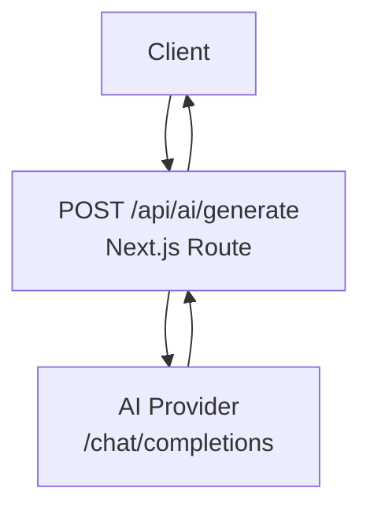
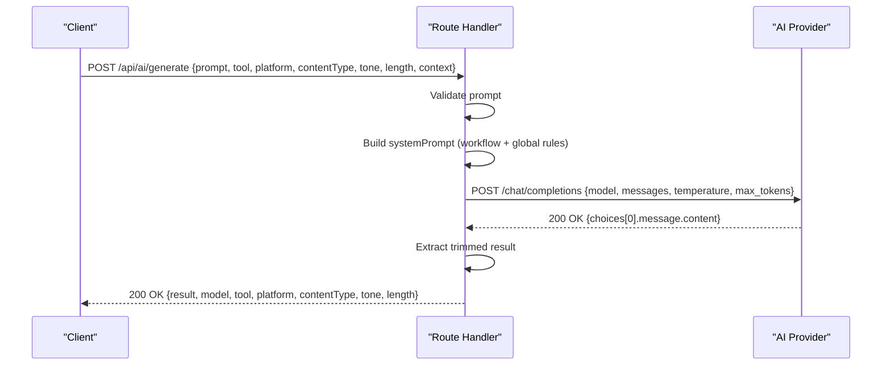
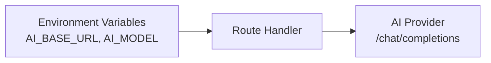

# Text Generation API

<cite>
**Referenced Files in This Document**
- [route.ts](file://app/api/ai/generate/route.ts)
- [README.md](file://README.md)
</cite>

## Table of Contents
1. [Introduction](#introduction)
2. [Project Structure](#project-structure)
3. [Core Components](#core-components)
4. [Architecture Overview](#architecture-overview)
5. [Detailed Component Analysis](#detailed-component-analysis)
6. [Dependency Analysis](#dependency-analysis)
7. [Performance Considerations](#performance-considerations)
8. [Troubleshooting Guide](#troubleshooting-guide)
9. [Conclusion](#conclusion)

## Introduction
This document provides detailed API documentation for the text generation endpoint POST /api/ai/generate. It explains request parameters, workflow modes, output formats per tool type, error handling patterns, AI model configuration, and integration guidelines. The endpoint is implemented as a Next.js server route that forwards requests to a local or configured AI provider (default Ollama) and returns structured JSON responses.

## Project Structure
The endpoint lives under the Next.js App Router at app/api/ai/generate/route.ts. It reads environment variables for the AI base URL and model, builds a system prompt based on selected tool and content settings, calls the AI provider’s chat completions endpoint, and returns either a successful result or an error response.

**Diagram sources**
- [route.ts:87-203](file://app/api/ai/generate/route.ts#L87-L203)

**Section sources**
- [route.ts:1-218](file://app/api/ai/generate/route.ts#L1-L218)
- [README.md:351-367](file://README.md#L351-L367)

## Core Components
- Endpoint handler: Parses request body, validates required fields, constructs system prompt, calls AI provider, and returns JSON.
- Workflow instruction builder: Selects task mode instructions based on the chosen tool.
- AI provider client: Uses fetch to call the configured AI base URL with model, messages, temperature, and token limits.

Key responsibilities:
- Parameter parsing and defaults
- System prompt assembly including platform, content type, tone, length, context, and workflow-specific rules
- Error mapping from provider errors to consistent API errors
- Response normalization to a simple result object

**Section sources**
- [route.ts:87-203](file://app/api/ai/generate/route.ts#L87-L203)

## Architecture Overview
The endpoint implements a straightforward request/response flow:
- Receive POST with JSON body
- Validate prompt presence
- Build system prompt using tool, platform, contentType, tone, length, and optional context
- Call AI provider’s chat completions with fixed temperature and max_tokens
- Normalize provider response into a single string result
- Return success or error JSON

**Diagram sources**
- [route.ts:87-203](file://app/api/ai/generate/route.ts#L87-L203)

## Detailed Component Analysis

### Endpoint: POST /api/ai/generate
- Method: POST
- Path: /api/ai/generate
- Content-Type: application/json
- Authentication: None (internal API)

Request body fields:
- prompt: string, required. The user’s content request.
- tool: string, optional. One of:
  - Generate Ideas
  - Generate Hook
  - Generate Title
  - Write Content
  - Repurpose
  Default: Write Content
- platform: string, optional. Target platform name. Default: General
- contentType: string, optional. Content format or style hint. Default: Post
- tone: string, optional. Writing tone. Default: Engaging
- length: string, optional. Desired length category. Default: Medium
- context: string, optional. Additional background or previous context.

Workflow modes and expected outputs:
- Generate Ideas: Returns exactly 10 numbered ideas; no full posts or scripts.
- Generate Hook: Returns exactly 10 short hooks; no complete content.
- Generate Title: Returns exactly 10 titles; no content beneath titles.
- Write Content: Returns exactly one finished piece tailored to contentType; no lists unless required by contentType.
- Repurpose: Transforms provided content into one finished piece for the selected platform while preserving meaning; no multiple alternatives.

System prompt composition:
- Includes workflow-specific instructions, platform, contentType, tone, length, user prompt, optional context, and global rules to constrain behavior.

Model configuration:
- Model: Read from environment variable AI_MODEL; default qwen2.5-coder:7b
- Base URL: Read from environment variable AI_BASE_URL; default http://localhost:11434/v1
- Temperature: Fixed at 0.5
- Max tokens: Fixed at 1200
- Streaming: Disabled

Response schema (success):
- result: string — the generated content
- model: string — the model used
- tool: string — the selected tool
- platform: string — the target platform
- contentType: string — the content type
- tone: string — the tone
- length: string — the length

Error responses:
- 400 Bad Request: Missing or empty prompt
- 502 Bad Gateway: Provider error or empty response from AI
- 500 Internal Server Error: Unexpected runtime error

Example requests and responses:
- Generate Ideas
  - Request example:
    - {
        "prompt": "Topics about productivity for remote workers",
        "tool": "Generate Ideas",
        "platform": "LinkedIn",
        "contentType": "Post",
        "tone": "Professional",
        "length": "Medium",
        "context": ""
      }
  - Expected response:
    - {
        "result": "1. ...\\n2. ...\\n...\\n10. ...",
        "model": "qwen2.5-coder:7b",
        "tool": "Generate Ideas",
        "platform": "LinkedIn",
        "contentType": "Post",
        "tone": "Professional",
        "length": "Medium"
      }
- Generate Hook
  - Request example:
    - {
        "prompt": "Hooks for a post about time blocking",
        "tool": "Generate Hook",
        "platform": "Twitter",
        "contentType": "Tweet",
        "tone": "Engaging",
        "length": "Short",
        "context": ""
      }
  - Expected response:
    - {
        "result": "1. ...\\n2. ...\\n...\\n10. ...",
        "model": "qwen2.5-coder:7b",
        "tool": "Generate Hook",
        "platform": "Twitter",
        "contentType": "Tweet",
        "tone": "Engaging",
        "length": "Short"
      }
- Generate Title
  - Request example:
    - {
        "prompt": "Titles for an article on deep work",
        "tool": "Generate Title",
        "platform": "Blog",
        "contentType": "Article",
        "tone": "Authoritative",
        "length": "Medium",
        "context": ""
      }
  - Expected response:
    - {
        "result": "1. ...\\n2. ...\\n...\\n10. ...",
        "model": "qwen2.5-coder:7b",
        "tool": "Generate Title",
        "platform": "Blog",
        "contentType": "Article",
        "tone": "Authoritative",
        "length": "Medium"
      }
- Write Content
  - Request example:
    - {
        "prompt": "Write a LinkedIn post about adopting async communication",
        "tool": "Write Content",
        "platform": "LinkedIn",
        "contentType": "Post",
        "tone": "Engaging",
        "length": "Medium",
        "context": "Audience: startup founders"
      }
  - Expected response:
    - {
        "result": "A single finished post...",
        "model": "qwen2.5-coder:7b",
        "tool": "Write Content",
        "platform": "LinkedIn",
        "contentType": "Post",
        "tone": "Engaging",
        "length": "Medium"
      }
- Repurpose
  - Request example:
    - {
        "prompt": "Repurpose this blog intro into a Twitter thread hook",
        "tool": "Repurpose",
        "platform": "Twitter",
        "contentType": "Thread",
        "tone": "Conversational",
        "length": "Short",
        "context": "Original: 'In this post we explore how async reduces meetings...'"
      }
  - Expected response:
    - {
        "result": "A single repurposed piece for Twitter...",
        "model": "qwen2.5-coder:7b",
        "tool": "Repurpose",
        "platform": "Twitter",
        "contentType": "Thread",
        "tone": "Conversational",
        "length": "Short"
      }

Error handling patterns:
- Missing prompt:
  - Status: 400
  - Body: { "error": "Prompt is required." }
- Provider error:
  - Status: 502
  - Body: { "error": "AI provider error: <provider message>" }
- Empty response:
  - Status: 502
  - Body: { "error": "The AI returned an empty response." }
- Unexpected error:
  - Status: 500
  - Body: { "error": "<error message or 'AI generation failed.'>" }

Integration guidelines:
- Always include a non-empty prompt.
- Choose tool based on desired output:
  - Use Generate Ideas/Hook/Title for lists.
  - Use Write Content for a single finished piece.
  - Use Repurpose to adapt existing content for another platform.
- Set platform and contentType to guide tone and formatting.
- Provide context when you need continuity across generations.
- Handle 400/502/500 responses gracefully and surface user-friendly messages.

**Section sources**
- [route.ts:9-85](file://app/api/ai/generate/route.ts#L9-L85)
- [route.ts:87-203](file://app/api/ai/generate/route.ts#L87-L203)

## Dependency Analysis
- Environment-driven configuration:
  - AI_BASE_URL: Base URL for the AI provider (default http://localhost:11434/v1)
  - AI_MODEL: Model identifier (default qwen2.5-coder:7b)
- External dependency:
  - AI provider HTTP endpoint /chat/completions
- No database or session state is used by this endpoint.

**Diagram sources**
- [route.ts:3-7](file://app/api/ai/generate/route.ts#L3-L7)
- [route.ts:146-170](file://app/api/ai/generate/route.ts#L146-L170)

**Section sources**
- [route.ts:3-7](file://app/api/ai/generate/route.ts#L3-L7)
- [route.ts:146-170](file://app/api/ai/generate/route.ts#L146-L170)
- [README.md:131-149](file://README.md#L131-L149)

## Performance Considerations
- Temperature is fixed at 0.5 for stable outputs.
- Max tokens is capped at 1200 to limit response size and cost.
- Streaming is disabled; clients should expect a single response payload.
- For list-based tools (Ideas, Hook, Title), the model is instructed to return exactly 10 items; ensure your UI can handle multi-line results.
- If longer content is needed, consider increasing max_tokens via environment configuration if supported by your provider setup.

[No sources needed since this section provides general guidance]

## Troubleshooting Guide
Common issues and resolutions:
- Empty or missing prompt
  - Symptom: 400 error with message indicating prompt is required.
  - Resolution: Ensure prompt is present and not blank.
- Provider unreachable or misconfigured
  - Symptom: 502 error containing provider error details.
  - Resolution: Verify AI_BASE_URL and AI_MODEL are set correctly; confirm the provider service is running and reachable.
- Empty response from provider
  - Symptom: 502 error stating the AI returned an empty response.
  - Resolution: Check provider logs; adjust prompt or reduce complexity; verify model supports the requested task.
- Unexpected runtime errors
  - Symptom: 500 error with generic failure message.
  - Resolution: Inspect server logs for stack traces; validate request payload and environment variables.

Operational checks:
- Confirm environment variables:
  - AI_BASE_URL points to a valid provider endpoint.
  - AI_MODEL matches a loaded model on the provider.
- Test connectivity to the provider outside the application to isolate network issues.

**Section sources**
- [route.ts:99-104](file://app/api/ai/generate/route.ts#L99-L104)
- [route.ts:172-193](file://app/api/ai/generate/route.ts#L172-L193)
- [route.ts:204-216](file://app/api/ai/generate/route.ts#L204-L216)
- [README.md:131-149](file://README.md#L131-L149)

## Conclusion
The POST /api/ai/generate endpoint offers a flexible, tool-driven text generation interface with clear workflow modes and consistent error handling. By setting tool, platform, contentType, tone, length, and context, callers can tailor outputs precisely. The endpoint uses a fixed temperature and token limit for predictable performance and integrates with a configurable AI provider through environment variables. Follow the troubleshooting steps and integration guidelines to ensure reliable operation.