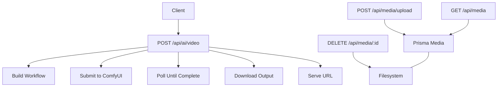
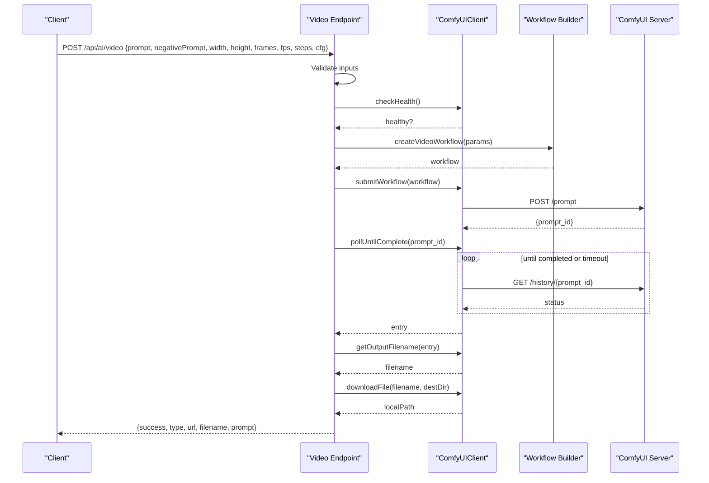
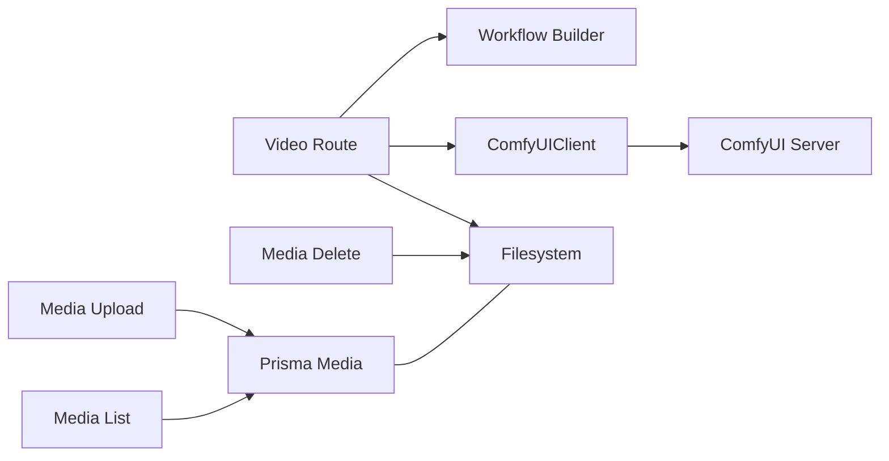

# Video Generation API

<cite>
**Referenced Files in This Document**
- [route.ts](file://app/api/ai/video/route.ts)
- [comfyui.ts](file://lib/ai/comfyui.ts)
- [video.ts](file://lib/ai/workflows/video.ts)
- [route.ts](file://app/api/media/upload/route.ts)
- [route.ts](file://app/api/media/[id]/route.ts)
- [route.ts](file://app/api/media/route.ts)
- [schema.prisma](file://prisma/schema.prisma)
</cite>

## Table of Contents
1. [Introduction](#introduction)
2. [Project Structure](#project-structure)
3. [Core Components](#core-components)
4. [Architecture Overview](#architecture-overview)
5. [Detailed Component Analysis](#detailed-component-analysis)
6. [Dependency Analysis](#dependency-analysis)
7. [Performance Considerations](#performance-considerations)
8. [Troubleshooting Guide](#troubleshooting-guide)
9. [Conclusion](#conclusion)

## Introduction
This document provides detailed API documentation for video generation endpoints and the end-to-end workflow from prompt processing to final asset delivery. It explains how requests are validated, how jobs are submitted to an external AI engine (ComfyUI), how completion is tracked via polling, and how generated videos are downloaded and served. It also documents media upload capabilities and storage integration used by the application.

## Project Structure
The video generation feature spans several modules:
- API route that accepts video generation requests and orchestrates the process
- ComfyUI client that submits workflows, polls for completion, and downloads outputs
- Workflow builder that constructs a ComfyUI graph for video generation
- Media endpoints for uploading, listing, and deleting media assets
- Database schema defining content and media entities

**Diagram sources**
- [route.ts:11-101](file://app/api/ai/video/route.ts#L11-L101)
- [comfyui.ts:44-143](file://lib/ai/comfyui.ts#L44-L143)
- [video.ts:3-100](file://lib/ai/workflows/video.ts#L3-L100)
- [route.ts:20-126](file://app/api/media/upload/route.ts#L20-L126)
- [route.ts:4-23](file://app/api/media/route.ts#L4-L23)
- [route.ts:13-74](file://app/api/media/[id]/route.ts#L13-L74)

**Section sources**
- [route.ts:11-101](file://app/api/ai/video/route.ts#L11-L101)
- [comfyui.ts:33-161](file://lib/ai/comfyui.ts#L33-L161)
- [video.ts:3-100](file://lib/ai/workflows/video.ts#L3-L100)
- [route.ts:20-126](file://app/api/media/upload/route.ts#L20-L126)
- [route.ts:4-23](file://app/api/media/route.ts#L4-L23)
- [route.ts:13-74](file://app/api/media/[id]/route.ts#L13-L74)
- [schema.prisma:21-55](file://prisma/schema.prisma#L21-L55)

## Core Components
- Video generation endpoint: validates inputs, checks engine health, builds a workflow, submits it, waits for completion, downloads the output, and returns a URL.
- ComfyUI client: handles submission, polling until completion, retrieving output filenames, downloading files, and health checks.
- Video workflow builder: creates a ComfyUI node graph with parameters such as prompt, dimensions, frames, fps, steps, cfg, seed, and checkpoint.
- Media endpoints: upload, list, and delete media; store metadata in the database and persist files on disk.

Key responsibilities:
- Input validation and error handling in the video endpoint
- Asynchronous job tracking via polling in the ComfyUI client
- File persistence and URL resolution for generated assets
- Media management with size/type constraints and database records

**Section sources**
- [route.ts:11-101](file://app/api/ai/video/route.ts#L11-L101)
- [comfyui.ts:44-143](file://lib/ai/comfyui.ts#L44-L143)
- [video.ts:3-100](file://lib/ai/workflows/video.ts#L3-L100)
- [route.ts:20-126](file://app/api/media/upload/route.ts#L20-L126)
- [route.ts:4-23](file://app/api/media/route.ts#L4-L23)
- [route.ts:13-74](file://app/api/media/[id]/route.ts#L13-L74)

## Architecture Overview
The video generation flow uses a synchronous request pattern that internally performs asynchronous work against an external ComfyUI service. The endpoint blocks until the generation completes or times out, then returns the final asset URL.

**Diagram sources**
- [route.ts:11-101](file://app/api/ai/video/route.ts#L11-L101)
- [comfyui.ts:44-143](file://lib/ai/comfyui.ts#L44-L143)
- [video.ts:3-100](file://lib/ai/workflows/video.ts#L3-L100)

## Detailed Component Analysis

### Video Generation Endpoint
- Method and path: POST /api/ai/video
- Request body fields:
  - prompt: string (required)
  - negativePrompt: string (optional)
  - width: number (default 832)
  - height: number (default 480)
  - frames: number (default 49; must be between 1 and 100)
  - fps: number (default 16)
  - steps: number (default 20)
  - cfg: number (default 6)
- Validation rules:
  - prompt must be present and non-empty
  - width and height must be positive
  - frames must be within 1–100
- Engine health check: returns 503 if ComfyUI is offline
- Processing:
  - Builds a workflow using the video workflow builder
  - Submits the workflow to ComfyUI
  - Polls until completion or timeout
  - Downloads the generated file to a configured directory
  - Returns a URL accessible to clients
- Response:
  - success: boolean
  - type: "video"
  - url: string path to the generated asset
  - filename: string
  - prompt: string echoed back

Error responses:
- 400: invalid inputs (missing prompt, invalid dimensions, frames out of range)
- 503: AI engine offline
- 500: generation failed or unexpected errors

Notes:
- The endpoint currently performs blocking polling until completion. For long-running tasks, consider implementing async job submission with status polling and webhook callbacks at the application layer.

**Section sources**
- [route.ts:11-101](file://app/api/ai/video/route.ts#L11-L101)

### ComfyUI Client
Responsibilities:
- Submit workflow to ComfyUI and receive a prompt_id
- Poll history endpoint until completion or error
- Extract output filename from completion entry
- Download generated file to a destination directory
- Check health via system stats endpoint

Configuration:
- baseUrl from environment or default
- timeout controls maximum polling duration
- pollInterval controls frequency of history checks

Key methods:
- submitWorkflow(workflow): returns prompt_id
- pollUntilComplete(promptId): returns completion entry or throws on error/timeout
- getOutputFilename(entry): extracts filename from outputs
- downloadFile(filename, destinationDir): persists file and returns path
- checkHealth(): returns boolean indicating engine availability

**Section sources**
- [comfyui.ts:33-161](file://lib/ai/comfyui.ts#L33-L161)

### Video Workflow Builder
Purpose:
- Constructs a ComfyUI workflow graph for video generation
- Parameters:
  - prompt: text input for model
  - negativePrompt: optional text to avoid undesired features
  - width, height: output resolution
  - frames: number of frames in the output
  - fps: frames per second for output format
  - steps: sampling steps for generation quality
  - cfg: classifier-free guidance scale
  - seed: random seed for reproducibility
  - checkpoint: model checkpoint name

Behavior:
- Uses UNetLoader and DualCLIPLoader to load models
- Encodes positive and negative prompts
- Creates empty latent video with specified dimensions and frame count
- Samples latents with KSampler
- Decodes latents with VAEDecode
- Saves output as a GIF with specified fps

**Section sources**
- [video.ts:3-100](file://lib/ai/workflows/video.ts#L3-L100)

### Media Endpoints
Upload:
- POST /api/media/upload
- Accepts multipart form data with file and contentId
- Validates content-type, allowed MIME types, and file size limit (50 MB)
- Persists file to public/uploads and records metadata in Prisma
- Returns success and media object

List:
- GET /api/media
- Returns recent media entries with id, url, filename, mimeType, size, type, createdAt

Delete:
- DELETE /api/media/:id
- Removes file from filesystem and deletes record from database

Database model:
- Media entity includes contentId, url, filename, mimeType, size, type, timestamps
- Indexed by contentId for efficient queries

**Section sources**
- [route.ts:20-126](file://app/api/media/upload/route.ts#L20-L126)
- [route.ts:4-23](file://app/api/media/route.ts#L4-L23)
- [route.ts:13-74](file://app/api/media/[id]/route.ts#L13-L74)
- [schema.prisma:39-55](file://prisma/schema.prisma#L39-L55)

## Dependency Analysis
The video generation pipeline depends on:
- Next.js API routes for HTTP handling
- ComfyUI client for external AI engine communication
- Workflow builder for constructing generation graphs
- Filesystem for storing generated assets
- Prisma for media metadata management

**Diagram sources**
- [route.ts:11-101](file://app/api/ai/video/route.ts#L11-L101)
- [comfyui.ts:44-143](file://lib/ai/comfyui.ts#L44-L143)
- [video.ts:3-100](file://lib/ai/workflows/video.ts#L3-L100)
- [route.ts:20-126](file://app/api/media/upload/route.ts#L20-L126)
- [route.ts:4-23](file://app/api/media/route.ts#L4-L23)
- [route.ts:13-74](file://app/api/media/[id]/route.ts#L13-L74)

**Section sources**
- [route.ts:11-101](file://app/api/ai/video/route.ts#L11-L101)
- [comfyui.ts:33-161](file://lib/ai/comfyui.ts#L33-L161)
- [video.ts:3-100](file://lib/ai/workflows/video.ts#L3-L100)
- [route.ts:20-126](file://app/api/media/upload/route.ts#L20-L126)
- [route.ts:4-23](file://app/api/media/route.ts#L4-L23)
- [route.ts:13-74](file://app/api/media/[id]/route.ts#L13-L74)

## Performance Considerations
- Timeouts: The ComfyUI client enforces a global timeout for polling; ensure this aligns with expected generation durations.
- Polling interval: Adjust pollInterval to balance responsiveness and server load.
- File sizes: Generated videos can be large; configure storage and CDN appropriately.
- Concurrency: Multiple concurrent requests may saturate the AI engine; consider rate limiting or queuing.
- Disk space: Monitor storage usage for generated assets and implement cleanup policies.

[No sources needed since this section provides general guidance]

## Troubleshooting Guide
Common issues and recovery strategies:
- Missing or invalid prompt: Ensure prompt is provided and non-empty.
- Invalid dimensions: Verify width and height are positive numbers.
- Frames out of range: Keep frames between 1 and 100.
- Engine offline: Health check fails; restart ComfyUI and retry.
- Generation failure: No output filename found; retry with adjusted parameters.
- Timeout: If generation exceeds configured timeout, increase timeout or reduce workload complexity.
- Upload failures: Check file size limit (50 MB), allowed MIME types, and contentId validity.

Recovery recommendations:
- Implement retries with exponential backoff for transient network errors.
- Log detailed error messages from the ComfyUI client for diagnostics.
- Use separate queues for long-running tasks to avoid blocking requests.
- Provide user feedback during generation progress when moving to async patterns.

**Section sources**
- [route.ts:11-101](file://app/api/ai/video/route.ts#L11-L101)
- [comfyui.ts:72-103](file://lib/ai/comfyui.ts#L72-L103)
- [route.ts:20-126](file://app/api/media/upload/route.ts#L20-L126)

## Conclusion
The video generation API integrates a Next.js endpoint with a ComfyUI-based AI engine to produce videos from text prompts. It validates inputs, constructs workflows, submits jobs, polls for completion, and delivers downloadable assets. Media endpoints support uploading, listing, and deleting assets with database-backed metadata. For production use, consider transitioning to an asynchronous pattern with job IDs, status polling, and webhook callbacks to improve scalability and user experience.

[No sources needed since this section summarizes without analyzing specific files]