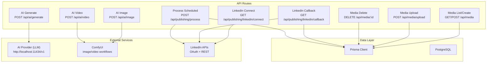
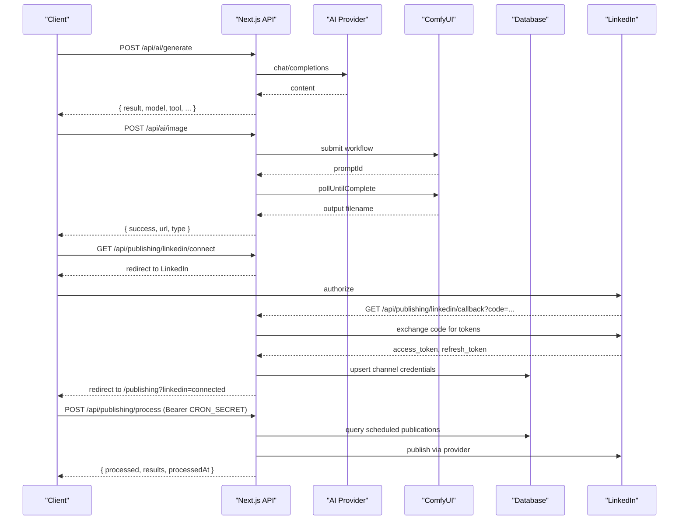
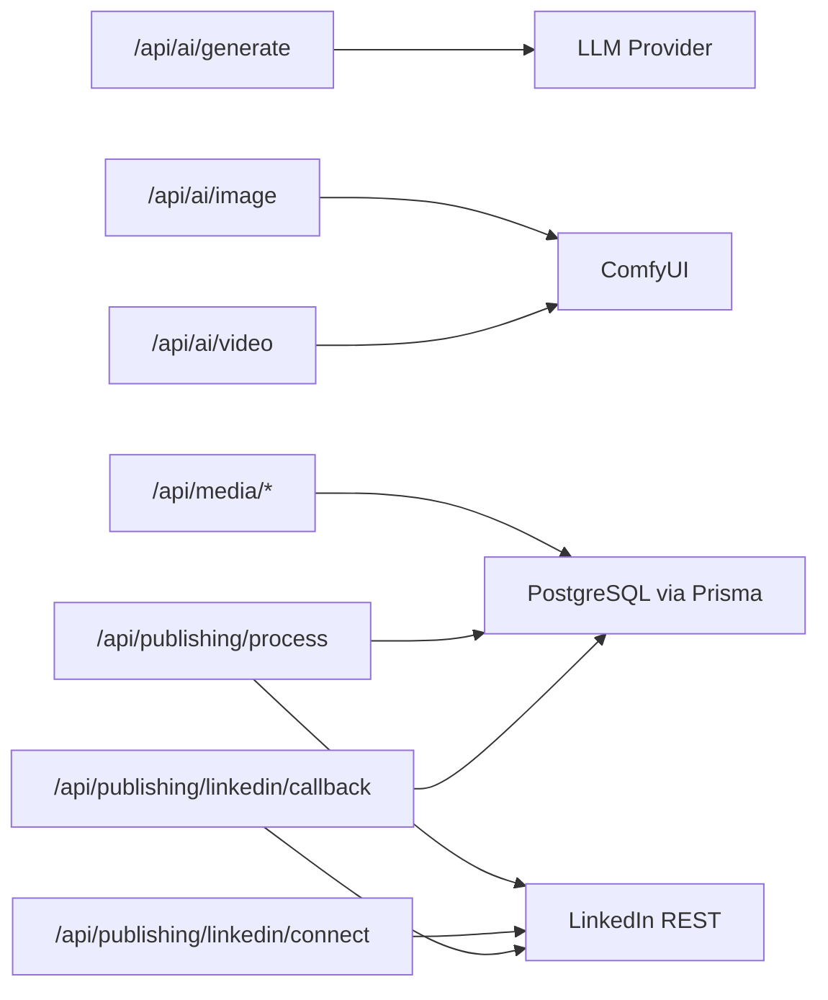

# API Reference

<cite>
**Referenced Files in This Document**
- [route.ts](file://app/api/ai/generate/route.ts)
- [route.ts](file://app/api/ai/image/route.ts)
- [route.ts](file://app/api/ai/video/route.ts)
- [route.ts](file://app/api/media/route.ts)
- [route.ts](file://app/api/media/upload/route.ts)
- [route.ts](file://app/api/media/[id]/route.ts)
- [route.ts](file://app/api/publishing/linkedin/connect/route.ts)
- [route.ts](file://app/api/publishing/linkedin/callback/route.ts)
- [route.ts](file://app/api/publishing/process/route.ts)
- [types.ts](file://app/publishing/engine/types.ts)
- [linkedin.ts](file://app/publishing/engine/providers/linkedin.ts)
- [process-scheduled.ts](file://app/publishing/engine/process-scheduled.ts)
- [schema.prisma](file://prisma/schema.prisma)
</cite>

## Table of Contents
1. [Introduction](#introduction)
2. [Project Structure](#project-structure)
3. [Core Components](#core-components)
4. [Architecture Overview](#architecture-overview)
5. [Detailed Component Analysis](#detailed-component-analysis)
6. [Dependency Analysis](#dependency-analysis)
7. [Performance Considerations](#performance-considerations)
8. [Troubleshooting Guide](#troubleshooting-guide)
9. [Conclusion](#conclusion)
10. [Appendices](#appendices)

## Introduction
This document provides a comprehensive API reference for ContentOS, covering REST endpoints for AI generation, media management, and publishing. It specifies HTTP methods, URL patterns, request/response schemas, authentication, error handling, and examples. It also documents LinkedIn OAuth flows, internal cron security, rate limiting considerations, versioning strategies, deprecation policies, client implementation guidelines, and webhook/callback handling.

## Project Structure
ContentOS exposes Next.js Route Handlers under app/api that implement:
- AI Generation: text, image, and video generation endpoints
- Media Management: list, create, upload, and delete media records
- Publishing: LinkedIn OAuth connect and callback, and a protected cron endpoint to process scheduled publications

**Diagram sources**
- [route.ts:87-217](file://app/api/ai/generate/route.ts#L87-L217)
- [route.ts:11-90](file://app/api/ai/image/route.ts#L11-L90)
- [route.ts:11-101](file://app/api/ai/video/route.ts#L11-L101)
- [route.ts:4-79](file://app/api/media/route.ts#L4-L79)
- [route.ts:20-125](file://app/api/media/upload/route.ts#L20-L125)
- [route.ts:13-73](file://app/api/media/[id]/route.ts#L13-L73)
- [route.ts:3-33](file://app/api/publishing/linkedin/connect/route.ts#L3-L33)
- [route.ts:4-168](file://app/api/publishing/linkedin/callback/route.ts#L4-L168)
- [route.ts:7-55](file://app/api/publishing/process/route.ts#L7-L55)
- [schema.prisma:21-93](file://prisma/schema.prisma#L21-L93)

**Section sources**
- [route.ts:87-217](file://app/api/ai/generate/route.ts#L87-L217)
- [route.ts:11-90](file://app/api/ai/image/route.ts#L11-L90)
- [route.ts:11-101](file://app/api/ai/video/route.ts#L11-L101)
- [route.ts:4-79](file://app/api/media/route.ts#L4-L79)
- [route.ts:20-125](file://app/api/media/upload/route.ts#L20-L125)
- [route.ts:13-73](file://app/api/media/[id]/route.ts#L13-L73)
- [route.ts:3-33](file://app/api/publishing/linkedin/connect/route.ts#L3-L33)
- [route.ts:4-168](file://app/api/publishing/linkedin/callback/route.ts#L4-L168)
- [route.ts:7-55](file://app/api/publishing/process/route.ts#L7-L55)
- [schema.prisma:21-93](file://prisma/schema.prisma#L21-L93)

## Core Components
- AI Text Generation: POST /api/ai/generate forwards prompts to an LLM provider and returns generated content with metadata.
- AI Image/Video Generation: POST /api/ai/image and POST /api/ai/video submit workflows to ComfyUI, poll until complete, download outputs, and return URLs.
- Media Management: GET/POST /api/media lists or creates media records; POST /api/media/upload handles multipart uploads; DELETE /api/media/:id removes media and files.
- Publishing: GET /api/publishing/linkedin/connect initiates OAuth; GET /api/publishing/linkedin/callback exchanges code for tokens and persists credentials; POST /api/publishing/process triggers scheduled publication processing with Bearer token auth.

**Section sources**
- [route.ts:87-217](file://app/api/ai/generate/route.ts#L87-L217)
- [route.ts:11-90](file://app/api/ai/image/route.ts#L11-L90)
- [route.ts:11-101](file://app/api/ai/video/route.ts#L11-L101)
- [route.ts:4-79](file://app/api/media/route.ts#L4-L79)
- [route.ts:20-125](file://app/api/media/upload/route.ts#L20-L125)
- [route.ts:13-73](file://app/api/media/[id]/route.ts#L13-L73)
- [route.ts:3-33](file://app/api/publishing/linkedin/connect/route.ts#L3-L33)
- [route.ts:4-168](file://app/api/publishing/linkedin/callback/route.ts#L4-L168)
- [route.ts:7-55](file://app/api/publishing/process/route.ts#L7-L55)

## Architecture Overview
The API layer orchestrates external services and data persistence:
- AI routes proxy requests to LLM or ComfyUI, validate inputs, handle errors, and return normalized responses.
- Media routes manage file storage and database records via Prisma.
- Publishing routes implement LinkedIn OAuth flow and trigger background processing of queued publications.

**Diagram sources**
- [route.ts:87-217](file://app/api/ai/generate/route.ts#L87-L217)
- [route.ts:11-90](file://app/api/ai/image/route.ts#L11-L90)
- [route.ts:11-101](file://app/api/ai/video/route.ts#L11-L101)
- [route.ts:3-33](file://app/api/publishing/linkedin/connect/route.ts#L3-L33)
- [route.ts:4-168](file://app/api/publishing/linkedin/callback/route.ts#L4-L168)
- [route.ts:7-55](file://app/api/publishing/process/route.ts#L7-L55)
- [process-scheduled.ts:4-71](file://app/publishing/engine/process-scheduled.ts#L4-L71)
- [linkedin.ts:141-283](file://app/publishing/engine/providers/linkedin.ts#L141-L283)

## Detailed Component Analysis

### AI Text Generation
- Endpoint: POST /api/ai/generate
- Authentication: None (internal use)
- Request Headers: Content-Type: application/json
- Request Body:
  - prompt: string (required)
  - tool: string (optional; defaults to "Write Content")
  - platform: string (optional; defaults to "General")
  - contentType: string (optional; defaults to "Post")
  - tone: string (optional; defaults to "Engaging")
  - length: string (optional; defaults to "Medium")
  - context: string (optional)
- Response:
  - result: string
  - model: string
  - tool: string
  - platform: string
  - contentType: string
  - tone: string
  - length: string
- Errors:
  - 400: missing prompt
  - 502: AI provider error or empty response
  - 500: unexpected error

Example request:
- Method: POST
- URL: /api/ai/generate
- Headers: Content-Type: application/json
- Body: { "prompt": "Write a short post about productivity tips", "tool": "Write Content", "contentType": "Post", "tone": "Professional" }

Example response:
- Status: 200
- Body: { "result": "...", "model": "qwen2.5-coder:7b", "tool": "Write Content", "platform": "General", "contentType": "Post", "tone": "Professional", "length": "Medium" }

**Section sources**
- [route.ts:87-217](file://app/api/ai/generate/route.ts#L87-L217)

### AI Image Generation
- Endpoint: POST /api/ai/image
- Authentication: None (internal use)
- Request Headers: Content-Type: application/json
- Request Body:
  - prompt: string (required)
  - negativePrompt: string (optional)
  - width: number (optional; default 1024)
  - height: number (optional; default 1024)
  - steps: number (optional; default 30)
  - cfg: number (optional; default 7)
- Response:
  - success: boolean
  - type: "image"
  - url: string (relative path to uploaded image)
  - filename: string
  - prompt: string
- Errors:
  - 400: missing prompt or invalid dimensions
  - 503: ComfyUI offline
  - 500: generation failed or unexpected error

Example request:
- Method: POST
- URL: /api/ai/image
- Headers: Content-Type: application/json
- Body: { "prompt": "A minimalist workspace illustration", "width": 1024, "height": 1024, "steps": 30, "cfg": 7 }

Example response:
- Status: 200
- Body: { "success": true, "type": "image", "url": "/uploads/<uuid>.png", "filename": "<uuid>.png", "prompt": "A minimalist workspace illustration" }

**Section sources**
- [route.ts:11-90](file://app/api/ai/image/route.ts#L11-L90)

### AI Video Generation
- Endpoint: POST /api/ai/video
- Authentication: None (internal use)
- Request Headers: Content-Type: application/json
- Request Body:
  - prompt: string (required)
  - negativePrompt: string (optional)
  - width: number (optional; default 832)
  - height: number (optional; default 480)
  - frames: number (optional; default 49; must be 1..100)
  - fps: number (optional; default 16)
  - steps: number (optional; default 20)
  - cfg: number (optional; default 6)
- Response:
  - success: boolean
  - type: "video"
  - url: string (relative path to uploaded video)
  - filename: string
  - prompt: string
- Errors:
  - 400: missing prompt, invalid dimensions, or frames out of range
  - 503: ComfyUI offline
  - 500: generation failed or unexpected error

Example request:
- Method: POST
- URL: /api/ai/video
- Headers: Content-Type: application/json
- Body: { "prompt": "Cinematic timelapse of city lights", "frames": 49, "fps": 16, "steps": 20, "cfg": 6 }

Example response:
- Status: 200
- Body: { "success": true, "type": "video", "url": "/uploads/<uuid>.mp4", "filename": "<uuid>.mp4", "prompt": "Cinematic timelapse of city lights" }

**Section sources**
- [route.ts:11-101](file://app/api/ai/video/route.ts#L11-L101)

### Media Management
- List Media
  - Endpoint: GET /api/media
  - Authentication: None (internal use)
  - Response: { media: Array<{ id, url, filename, mimeType, size, type, createdAt }> }
  - Notes: Returns up to 50 most recent items ordered by creation date descending.

- Create Media Record
  - Endpoint: POST /api/media
  - Authentication: None (internal use)
  - Request Headers: Content-Type: application/json
  - Request Body:
    - contentId: string (required)
    - url: string (required)
    - filename: string (optional)
    - mimeType: string (optional; default "image/jpeg")
    - size: number (optional; default 0)
    - type: string (optional; default "IMAGE")
  - Response: { success: true, media: {...} }
  - Errors: 400 if required fields missing; 500 on failure

- Upload File
  - Endpoint: POST /api/media/upload
  - Authentication: None (internal use)
  - Request Headers: Content-Type: multipart/form-data
  - Form Fields:
    - file: File (required; allowed types include images and videos listed in the route)
    - contentId: string (required)
  - Constraints:
    - Max file size: 50 MB
    - Allowed MIME types: image/jpeg, image/png, image/webp, image/gif, video/mp4, video/webm, video/quicktime
  - Response: { success: true, media: {...} }
  - Errors: 400 for invalid content-type, missing file/contentId, unsupported type, or oversized file; 404 if content not found; 500 on failure

- Delete Media
  - Endpoint: DELETE /api/media/:id
  - Authentication: None (internal use)
  - Path Param: id: string
  - Behavior: Deletes associated file from public/uploads and removes record from database
  - Response: { success: true, id }
  - Errors: 404 if media not found; 500 on failure

Examples:
- List: GET /api/media -> { "media": [...] }
- Create: POST /api/media -> { "success": true, "media": { "id": "...", "url": "/uploads/...", "filename": "...", "mimeType": "image/png", "size": 12345, "type": "IMAGE", "createdAt": "..." } }
- Upload: POST /api/media/upload (multipart) -> { "success": true, "media": { ... } }
- Delete: DELETE /api/media/{id} -> { "success": true, "id": "{id}" }

**Section sources**
- [route.ts:4-79](file://app/api/media/route.ts#L4-L79)
- [route.ts:20-125](file://app/api/media/upload/route.ts#L20-L125)
- [route.ts:13-73](file://app/api/media/[id]/route.ts#L13-L73)
- [schema.prisma:21-55](file://prisma/schema.prisma#L21-L55)

### Publishing: LinkedIn OAuth Flow
- Connect
  - Endpoint: GET /api/publishing/linkedin/connect
  - Authentication: None (public)
  - Behavior: Redirects to LinkedIn authorization URL with configured scope and redirect URI
  - Errors: 500 if environment variables are not configured

- Callback
  - Endpoint: GET /api/publishing/linkedin/callback
  - Query Params:
    - code: string (authorization code)
    - error: string (if authorization failed)
  - Behavior:
    - Exchanges code for access_token and optional refresh_token
    - Retrieves user info to compute author URN
    - Persists connection details to database
    - Redirects to /publishing?linkedin=connected
  - Errors:
    - 400: missing code, token exchange failure, userinfo lookup failure, or missing member identifier
    - 500: environment variables not configured

Example flow:
- GET /api/publishing/linkedin/connect -> redirect to LinkedIn
- User authorizes -> LinkedIn redirects to /api/publishing/linkedin/callback?code=...
- Server exchanges code, saves credentials, redirects to /publishing?linkedin=connected

**Section sources**
- [route.ts:3-33](file://app/api/publishing/linkedin/connect/route.ts#L3-L33)
- [route.ts:4-168](file://app/api/publishing/linkedin/callback/route.ts#L4-L168)

### Publishing: Process Scheduled Publications
- Endpoint: POST /api/publishing/process
- Authentication: Bearer token using CRON_SECRET environment variable
- Behavior:
  - Validates Authorization header against CRON_SECRET
  - Queries scheduled publications due now or earlier
  - Publishes each via provider (e.g., LinkedIn), recording results
  - Returns aggregated results with timestamp
- Response:
  - processed: number
  - results: Array<{ publicationId, success, externalId, error }>
  - processedAt: ISO timestamp
- Errors:
  - 401: unauthorized (missing or incorrect Bearer token)
  - 500: server error or misconfiguration

Example request:
- Method: POST
- URL: /api/publishing/process
- Headers: Authorization: Bearer <CRON_SECRET>

Example response:
- Status: 200
- Body: { "processed": 2, "results": [{ "publicationId": "...", "success": true, "externalId": "...", "error": null }, { "publicationId": "...", "success": false, "externalId": null, "error": "..." }], "processedAt": "2026-01-01T00:00:00Z" }

**Section sources**
- [route.ts:7-55](file://app/api/publishing/process/route.ts#L7-L55)
- [process-scheduled.ts:4-71](file://app/publishing/engine/process-scheduled.ts#L4-L71)

### Publishing Provider: LinkedIn
- Purpose: Implements publishing to LinkedIn, including image upload and post creation.
- Key behaviors:
  - Validates access token and author URN
  - Downloads stored image from application URL and uploads to LinkedIn
  - Creates a public post with optional image attachment
  - Captures external ID from headers
- Error handling:
  - Returns structured failures when token missing/expired, image upload fails, or post creation fails

**Section sources**
- [linkedin.ts:141-283](file://app/publishing/engine/providers/linkedin.ts#L141-L283)
- [types.ts:1-37](file://app/publishing/engine/types.ts#L1-L37)

## Dependency Analysis
- AI routes depend on external providers:
  - Text generation depends on LLM at configurable base URL
  - Image/video generation depends on ComfyUI client and workflow builders
- Media routes depend on Prisma and filesystem operations
- Publishing routes depend on LinkedIn APIs and Prisma
- The scheduler depends on the publishing engine and provider registry

**Diagram sources**
- [route.ts:87-217](file://app/api/ai/generate/route.ts#L87-L217)
- [route.ts:11-90](file://app/api/ai/image/route.ts#L11-L90)
- [route.ts:11-101](file://app/api/ai/video/route.ts#L11-L101)
- [route.ts:4-79](file://app/api/media/route.ts#L4-L79)
- [route.ts:20-125](file://app/api/media/upload/route.ts#L20-L125)
- [route.ts:13-73](file://app/api/media/[id]/route.ts#L13-L73)
- [route.ts:3-33](file://app/api/publishing/linkedin/connect/route.ts#L3-L33)
- [route.ts:4-168](file://app/api/publishing/linkedin/callback/route.ts#L4-L168)
- [route.ts:7-55](file://app/api/publishing/process/route.ts#L7-L55)
- [process-scheduled.ts:4-71](file://app/publishing/engine/process-scheduled.ts#L4-L71)
- [linkedin.ts:141-283](file://app/publishing/engine/providers/linkedin.ts#L141-L283)

**Section sources**
- [route.ts:87-217](file://app/api/ai/generate/route.ts#L87-L217)
- [route.ts:11-90](file://app/api/ai/image/route.ts#L11-L90)
- [route.ts:11-101](file://app/api/ai/video/route.ts#L11-L101)
- [route.ts:4-79](file://app/api/media/route.ts#L4-L79)
- [route.ts:20-125](file://app/api/media/upload/route.ts#L20-L125)
- [route.ts:13-73](file://app/api/media/[id]/route.ts#L13-L73)
- [route.ts:3-33](file://app/api/publishing/linkedin/connect/route.ts#L3-L33)
- [route.ts:4-168](file://app/api/publishing/linkedin/callback/route.ts#L4-L168)
- [route.ts:7-55](file://app/api/publishing/process/route.ts#L7-L55)
- [process-scheduled.ts:4-71](file://app/publishing/engine/process-scheduled.ts#L4-L71)
- [linkedin.ts:141-283](file://app/publishing/engine/providers/linkedin.ts#L141-L283)

## Performance Considerations
- AI generation:
  - Text generation streams disabled; consider streaming for long outputs in future versions.
  - Image/video generation uses polling; ensure appropriate timeouts and backoff for large jobs.
- Media uploads:
  - Enforce file size limits and allowlist MIME types to prevent abuse.
  - Use chunked uploads for large files in future iterations.
- Publishing:
  - Batch processing limited to 10 items per run; adjust based on throughput needs.
  - External API calls (LinkedIn) can be slow; implement retries and circuit breakers.

[No sources needed since this section provides general guidance]

## Troubleshooting Guide
Common issues and resolutions:
- AI generation returns 502:
  - Check AI provider connectivity and configuration.
  - Validate prompt and parameters.
- Image/video generation returns 503:
  - Ensure ComfyUI is running and reachable.
  - Verify workflow submission and polling logic.
- Media upload fails with 400:
  - Confirm Content-Type is multipart/form-data.
  - Validate file type and size constraints.
- LinkedIn OAuth fails:
  - Verify CLIENT_ID, CLIENT_SECRET, and APP_URL are set.
  - Check scopes and redirect URI match LinkedIn settings.
- Scheduled publishing returns 401:
  - Ensure Authorization header matches CRON_SECRET.

**Section sources**
- [route.ts:87-217](file://app/api/ai/generate/route.ts#L87-L217)
- [route.ts:11-90](file://app/api/ai/image/route.ts#L11-L90)
- [route.ts:11-101](file://app/api/ai/video/route.ts#L11-L101)
- [route.ts:20-125](file://app/api/media/upload/route.ts#L20-L125)
- [route.ts:3-33](file://app/api/publishing/linkedin/connect/route.ts#L3-L33)
- [route.ts:4-168](file://app/api/publishing/linkedin/callback/route.ts#L4-L168)
- [route.ts:7-55](file://app/api/publishing/process/route.ts#L7-L55)

## Conclusion
ContentOS provides a cohesive set of REST endpoints for AI-assisted content creation, media management, and multi-channel publishing. The API emphasizes clear error handling, secure internal endpoints, and robust integration with external services like LLMs, ComfyUI, and LinkedIn. For production deployments, add authentication, rate limiting, and observability to strengthen security and reliability.

[No sources needed since this section summarizes without analyzing specific files]

## Appendices

### Authentication Methods
- Internal API security:
  - Cron endpoint requires Authorization: Bearer <CRON_SECRET>
- LinkedIn OAuth:
  - Public connect endpoint redirects to LinkedIn
  - Callback exchanges code for tokens and persists credentials

**Section sources**
- [route.ts:7-55](file://app/api/publishing/process/route.ts#L7-L55)
- [route.ts:3-33](file://app/api/publishing/linkedin/connect/route.ts#L3-L33)
- [route.ts:4-168](file://app/api/publishing/linkedin/callback/route.ts#L4-L168)

### Error Handling Patterns
- Consistent JSON error responses with status codes:
  - 400: validation or client errors
  - 401: unauthorized
  - 404: not found
  - 500: server errors
  - 502: upstream provider errors
  - 503: service unavailable (e.g., ComfyUI offline)

**Section sources**
- [route.ts:87-217](file://app/api/ai/generate/route.ts#L87-L217)
- [route.ts:11-90](file://app/api/ai/image/route.ts#L11-L90)
- [route.ts:11-101](file://app/api/ai/video/route.ts#L11-L101)
- [route.ts:20-125](file://app/api/media/upload/route.ts#L20-L125)
- [route.ts:13-73](file://app/api/media/[id]/route.ts#L13-L73)
- [route.ts:3-33](file://app/api/publishing/linkedin/connect/route.ts#L3-L33)
- [route.ts:4-168](file://app/api/publishing/linkedin/callback/route.ts#L4-L168)
- [route.ts:7-55](file://app/api/publishing/process/route.ts#L7-L55)

### Rate Limiting
- Not implemented in current routes.
- Recommendation: Add middleware-based rate limiting per IP or API key for all public endpoints.

[No sources needed since this section provides general guidance]

### Versioning Strategies
- No explicit API versioning in routes.
- Recommendation: Prefix routes with /v1 and maintain backward compatibility through versioned handlers.

[No sources needed since this section provides general guidance]

### Deprecation Policies
- No deprecation notices present.
- Recommendation: Announce deprecations via headers and documentation, provide migration windows, and maintain parallel versions during transitions.

[No sources needed since this section provides general guidance]

### Webhook Endpoints and Callback Handling
- LinkedIn OAuth callback:
  - GET /api/publishing/linkedin/callback handles authorization code exchange and credential persistence.
- Scheduled publishing:
  - POST /api/publishing/process is a protected webhook-like endpoint triggered by a cron job.

**Section sources**
- [route.ts:4-168](file://app/api/publishing/linkedin/callback/route.ts#L4-L168)
- [route.ts:7-55](file://app/api/publishing/process/route.ts#L7-L55)

### Client Implementation Guidelines and SDK Recommendations
- Base URL: Configure per environment (development vs production).
- Headers:
  - Set Content-Type appropriately (application/json for JSON payloads; multipart/form-data for uploads).
  - Include Authorization: Bearer <CRON_SECRET> for cron endpoint.
- Retry logic:
  - Implement exponential backoff for transient errors (5xx).
  - Respect rate limits once implemented.
- Security:
  - Store secrets securely; never expose CRON_SECRET or OAuth secrets in client code.
- Libraries:
  - Use fetch or axios for HTTP calls.
  - For LinkedIn OAuth, follow standard OAuth 2.0 flows and store tokens securely server-side.

[No sources needed since this section provides general guidance]