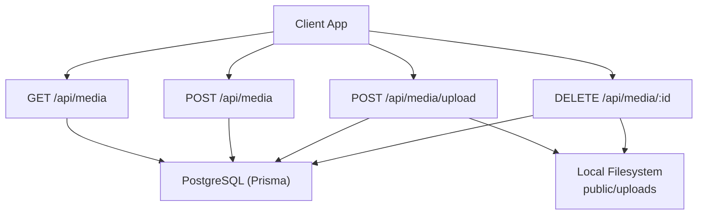
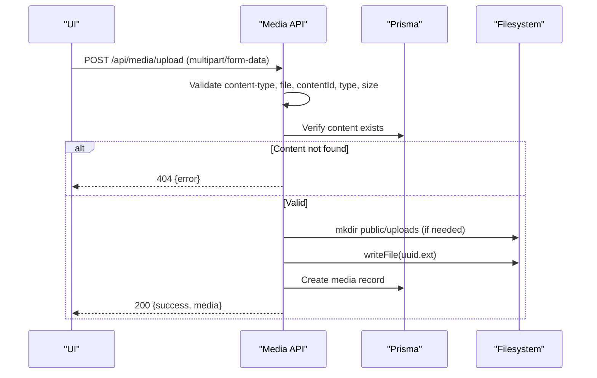
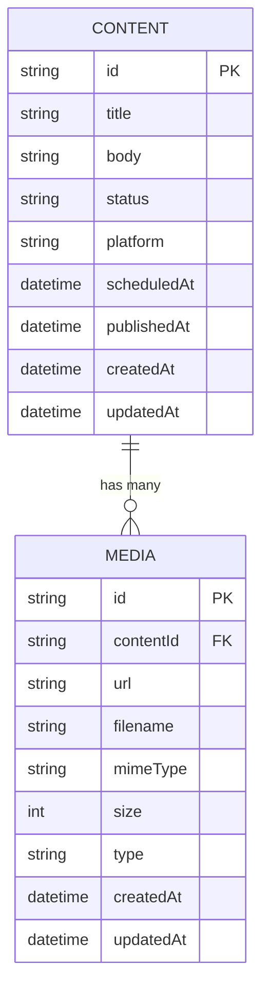
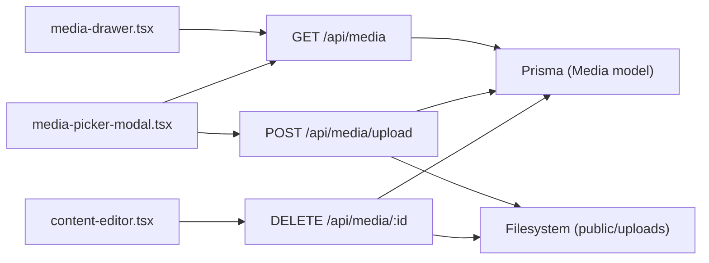

# Media Management APIs

<cite>
**Referenced Files in This Document**
- [route.ts](file://app/api/media/route.ts)
- [upload route.ts](file://app/api/media/upload/route.ts)
- [media by id route.ts](file://app/api/media/[id]/route.ts)
- [schema.prisma](file://prisma/schema.prisma)
- [media-drawer.tsx](file://components/calendar/media-drawer.tsx)
- [media-picker-modal.tsx](file://components/calendar/media-picker-modal.tsx)
</cite>

## Table of Contents
1. Introduction
2. Project Structure
3. Core Components
4. Architecture Overview
5. Detailed Component Analysis
6. Dependency Analysis
7. Performance Considerations
8. Troubleshooting Guide
9. Conclusion
10. Appendices

## Introduction
This document provides detailed API documentation for media management endpoints in ContentOS. It covers file upload with validation and storage handling, listing and retrieval of media metadata, deletion operations, supported file formats, size limitations, security considerations, error handling patterns, and integration examples for building a media library UI. It also addresses file organization, thumbnail generation strategies, and storage optimization recommendations.

## Project Structure
The media functionality is implemented as Next.js Route Handlers under app/api/media with the following structure:
- GET /api/media: List recent media entries
- POST /api/media: Create a media record (for external references or programmatic creation)
- POST /api/media/upload: Upload a file via multipart form data
- DELETE /api/media/:id: Delete a media entry and its stored file

Media records are persisted using Prisma against a PostgreSQL database, and uploaded files are stored on the local filesystem under public/uploads.

**Diagram sources**
- [route.ts:4-23](file://app/api/media/route.ts#L4-L23)
- [route.ts:25-79](file://app/api/media/route.ts#L25-L79)
- [upload route.ts:20-125](file://app/api/media/upload/route.ts#L20-L125)
- [media by id route.ts:13-73](file://app/api/media/[id]/route.ts#L13-L73)
- [schema.prisma:39-55](file://prisma/schema.prisma#L39-L55)

**Section sources**
- [route.ts:4-79](file://app/api/media/route.ts#L4-L79)
- [upload route.ts:20-125](file://app/api/media/upload/route.ts#L20-L125)
- [media by id route.ts:13-73](file://app/api/media/[id]/route.ts#L13-L73)
- [schema.prisma:39-55](file://prisma/schema.prisma#L39-L55)

## Core Components
- Media list endpoint: Returns up to 50 most recent media items ordered by creation time.
- Media create endpoint: Creates a media record from JSON payload; validates required fields.
- Media upload endpoint: Accepts multipart/form-data, validates content type, file type, and size, verifies associated content exists, stores the file locally, and persists metadata.
- Media delete endpoint: Deletes the physical file and removes the database record.

Key behaviors:
- Allowed file types: image/jpeg, image/png, image/webp, image/gif, video/mp4, video/webm, video/quicktime.
- Maximum file size: 50 MB.
- Storage location: public/uploads with UUID-based filenames.
- Type inference: VIDEO if MIME starts with "video/", otherwise IMAGE.
- Error responses: Consistent JSON with an error field and appropriate HTTP status codes.

**Section sources**
- [route.ts:4-23](file://app/api/media/route.ts#L4-L23)
- [route.ts:25-79](file://app/api/media/route.ts#L25-L79)
- [upload route.ts:8-18](file://app/api/media/upload/route.ts#L8-L18)
- [upload route.ts:20-125](file://app/api/media/upload/route.ts#L20-L125)
- [media by id route.ts:13-73](file://app/api/media/[id]/route.ts#L13-L73)
- [schema.prisma:39-55](file://prisma/schema.prisma#L39-L55)

## Architecture Overview
The media subsystem follows a simple request-response pattern with clear separation between API handlers, persistence (Prisma), and storage (filesystem). The UI components integrate with these endpoints to provide a media library experience.

**Diagram sources**
- [upload route.ts:20-125](file://app/api/media/upload/route.ts#L20-L125)
- [schema.prisma:39-55](file://prisma/schema.prisma#L39-L55)

## Detailed Component Analysis

### Endpoint: GET /api/media
- Purpose: Retrieve a paginated-like list of recent media.
- Behavior: Queries all media, orders by createdAt descending, limits to 50 items.
- Response: JSON object containing a media array with id, url, filename, mimeType, size, type, createdAt.

Example response shape:
{
  "media": [
    {
      "id": "...",
      "url": "/uploads/...",
      "filename": "...",
      "mimeType": "image/jpeg",
      "size": 12345,
      "type": "IMAGE",
      "createdAt": "2024-01-01T00:00:00.000Z"
    }
  ]
}

Integration notes:
- Used by media drawer and picker modal to populate the library view.

**Section sources**
- [route.ts:4-23](file://app/api/media/route.ts#L4-L23)
- [media-drawer.tsx:31-38](file://components/calendar/media-drawer.tsx#L31-L38)
- [media-picker-modal.tsx:43-80](file://components/calendar/media-picker-modal.tsx#L43-L80)

### Endpoint: POST /api/media
- Purpose: Create a media record without uploading a file (e.g., linking to external assets).
- Input: JSON body with contentId, url, optional filename, mimeType (defaults to image/jpeg), size (defaults to 0), type (defaults to IMAGE).
- Validation: Requires contentId and url; trims strings; coerces types.
- Response: Success object with created media fields.

Error handling:
- Missing required fields return 400 with descriptive error.
- Server errors return 500 with error message.

**Section sources**
- [route.ts:25-79](file://app/api/media/route.ts#L25-L79)

### Endpoint: POST /api/media/upload
- Purpose: Upload a file and persist its metadata.
- Input: multipart/form-data with fields:
  - file: Required File object
  - contentId: Required string referencing existing content
- Validation:
  - Content-Type must be multipart/form-data or application/x-www-form-urlencoded
  - File presence and type checks
  - Allowed MIME types enforced
  - Size limit enforced (50 MB)
  - Associated content existence verified
- Storage:
  - Ensures public/uploads directory exists
  - Writes file with UUID-based name preserving original extension
  - Determines type based on MIME prefix
- Response: Success object with full media metadata including url path.

Error handling:
- Invalid content type, missing file/contentId, unsupported type, oversized file, missing content, and server errors return appropriate status codes and JSON error messages.

**Section sources**
- [upload route.ts:20-125](file://app/api/media/upload/route.ts#L20-L125)

### Endpoint: DELETE /api/media/:id
- Purpose: Remove a media record and its stored file.
- Behavior:
  - Fetches media by id
  - Attempts to delete the file at public/uploads/<relative-url>
  - Ignores ENOENT when deleting non-existent files
  - Deletes the database record
- Response: Success object with id.

Error handling:
- Not found returns 404
- Other errors return 500 with error message

**Section sources**
- [media by id route.ts:13-73](file://app/api/media/[id]/route.ts#L13-L73)

### Data Model: Media
- Fields: id, contentId, url, filename, mimeType, size, type, createdAt, updatedAt
- Relationships: Belongs to Content with cascade delete
- Indexing: Indexed on contentId for efficient queries

**Diagram sources**
- [schema.prisma:21-37](file://prisma/schema.prisma#L21-L37)
- [schema.prisma:39-55](file://prisma/schema.prisma#L39-L55)

**Section sources**
- [schema.prisma:39-55](file://prisma/schema.prisma#L39-L55)

## Dependency Analysis
- API routes depend on Prisma client for database access.
- Upload route depends on Node fs/promises and crypto for file operations and unique naming.
- UI components consume the media list and upload endpoints to render thumbnails and handle user interactions.

**Diagram sources**
- [media-drawer.tsx:31-38](file://components/calendar/media-drawer.tsx#L31-L38)
- [media-picker-modal.tsx:43-80](file://components/calendar/media-picker-modal.tsx#L43-L80)
- [media-picker-modal.tsx:86-127](file://components/calendar/media-picker-modal.tsx#L86-L127)
- [route.ts:4-23](file://app/api/media/route.ts#L4-L23)
- [upload route.ts:20-125](file://app/api/media/upload/route.ts#L20-L125)
- [media by id route.ts:13-73](file://app/api/media/[id]/route.ts#L13-L73)

**Section sources**
- [media-drawer.tsx:31-38](file://components/calendar/media-drawer.tsx#L31-L38)
- [media-picker-modal.tsx:43-80](file://components/calendar/media-picker-modal.tsx#L43-L80)
- [media-picker-modal.tsx:86-127](file://components/calendar/media-picker-modal.tsx#L86-L127)
- [route.ts:4-23](file://app/api/media/route.ts#L4-L23)
- [upload route.ts:20-125](file://app/api/media/upload/route.ts#L20-L125)
- [media by id route.ts:13-73](file://app/api/media/[id]/route.ts#L13-L73)

## Performance Considerations
- Pagination: Current list endpoint returns up to 50 items. For large libraries, implement cursor-based pagination to reduce payload size and improve load times.
- Thumbnails: Generate and store thumbnails during upload to speed up UI rendering. Serve smaller images for grid views and full-size on demand.
- Storage optimization:
  - Consider moving uploads to object storage (e.g., S3-compatible) for scalability and CDN caching.
  - Implement file deduplication via content hashing to avoid duplicate storage.
  - Compress images and transcode videos to efficient formats.
- Database indexing: Ensure frequent query fields (contentId, type) are indexed; contentId is already indexed.
- Concurrency: Use streaming writes for large files to reduce memory pressure.

[No sources needed since this section provides general guidance]

## Troubleshooting Guide
Common issues and resolutions:
- Unsupported file type: Ensure the file MIME type is in the allowed set. Update ALLOWED_TYPES if new formats are needed.
- File too large: Enforce client-side size checks before upload and server-side limit at 50 MB.
- Missing contentId: Provide a valid contentId that exists in the database.
- Content not found: Verify the contentId corresponds to an existing content record before upload.
- File deletion failures: If the file is missing on disk, deletion still proceeds gracefully; check permissions and paths if errors occur.
- Network errors: Handle non-OK responses in the UI and display user-friendly messages.

Error response pattern:
{
  "error": "Descriptive message"
}

Status codes:
- 400: Bad request (validation failures)
- 404: Not found (missing content or media)
- 500: Internal server error

**Section sources**
- [upload route.ts:20-125](file://app/api/media/upload/route.ts#L20-L125)
- [media by id route.ts:13-73](file://app/api/media/[id]/route.ts#L13-L73)
- [route.ts:25-79](file://app/api/media/route.ts#L25-L79)

## Conclusion
ContentOS provides a straightforward media management API supporting upload, listing, creation, and deletion of media assets. The implementation enforces strict validation, maintains consistent error handling, and integrates seamlessly with the UI components to deliver a functional media library. Future enhancements should focus on pagination, thumbnail generation, scalable storage, and advanced optimization techniques.

[No sources needed since this section summarizes without analyzing specific files]

## Appendices

### Supported File Formats and Limits
- Images: JPEG, PNG, WebP, GIF
- Videos: MP4, WebM, QuickTime
- Maximum size: 50 MB per file
- Type inference: Based on MIME prefix ("video/" -> VIDEO, else IMAGE)

**Section sources**
- [upload route.ts:8-18](file://app/api/media/upload/route.ts#L8-L18)
- [upload route.ts:93-95](file://app/api/media/upload/route.ts#L93-L95)

### Example: Multipart Form Upload
- Method: POST
- URL: /api/media/upload
- Headers: Content-Type: multipart/form-data
- Body fields:
  - file: binary file
  - contentId: string (existing content ID)

Expected success response:
{
  "success": true,
  "media": {
    "id": "...",
    "url": "/uploads/...",
    "filename": "...",
    "mimeType": "...",
    "size": 12345,
    "type": "IMAGE|VIDEO",
    "createdAt": "...",
    "updatedAt": "..."
  }
}

**Section sources**
- [upload route.ts:20-125](file://app/api/media/upload/route.ts#L20-L125)

### Example: Media Listing
- Method: GET
- URL: /api/media

Expected response:
{
  "media": [
    {
      "id": "...",
      "url": "/uploads/...",
      "filename": "...",
      "mimeType": "...",
      "size": 12345,
      "type": "IMAGE|VIDEO",
      "createdAt": "..."
    }
  ]
}

**Section sources**
- [route.ts:4-23](file://app/api/media/route.ts#L4-L23)

### Example: Media Deletion
- Method: DELETE
- URL: /api/media/:id

Expected success response:
{
  "success": true,
  "id": "..."
}

**Section sources**
- [media by id route.ts:13-73](file://app/api/media/[id]/route.ts#L13-L73)

### Integration Patterns for Media Library UI
- Load media list on open of media drawer or picker modal.
- Display thumbnails using item.url; differentiate video vs image by item.type.
- Trigger upload via file input and POST to /api/media/upload; update local state on success.
- Allow deletion via DELETE /api/media/:id; remove item from local list on success.

**Section sources**
- [media-drawer.tsx:31-38](file://components/calendar/media-drawer.tsx#L31-L38)
- [media-picker-modal.tsx:43-80](file://components/calendar/media-picker-modal.tsx#L43-L80)
- [media-picker-modal.tsx:86-127](file://components/calendar/media-picker-modal.tsx#L86-L127)

### Security Considerations
- Whitelist allowed MIME types to prevent execution of malicious files.
- Enforce server-side size limits to mitigate resource exhaustion.
- Validate contentId to ensure uploads are linked to existing content.
- Sanitize and normalize file paths to avoid directory traversal.
- Consider adding authentication/authorization checks to restrict access to media endpoints.

**Section sources**
- [upload route.ts:20-125](file://app/api/media/upload/route.ts#L20-L125)

### Thumbnail Generation and Storage Optimization Strategies
- Generate thumbnails on upload:
  - For images: create multiple sizes (thumbnail, medium, large).
  - For videos: generate poster frames and transcode to web-friendly formats.
- Store optimized assets in a dedicated directory or object storage with CDN support.
- Cache thumbnails in the browser and use versioned URLs to bust caches on updates.
- Implement background jobs for heavy processing to keep API responses fast.

[No sources needed since this section provides general guidance]