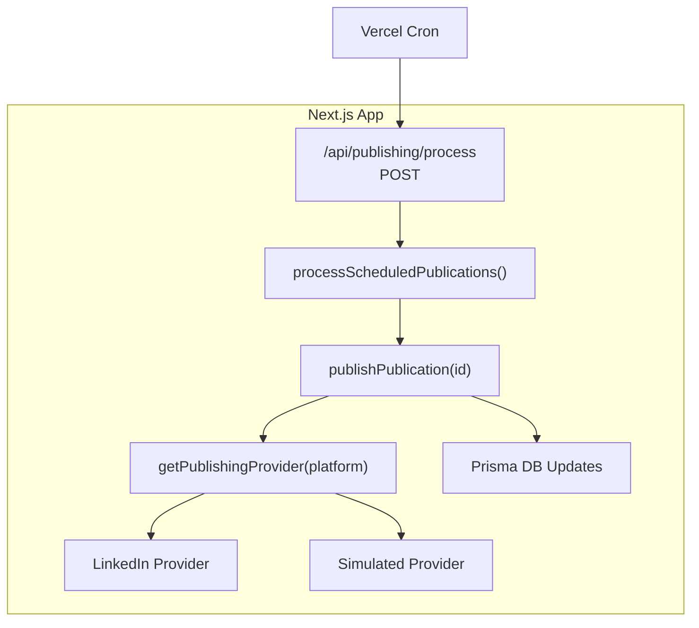
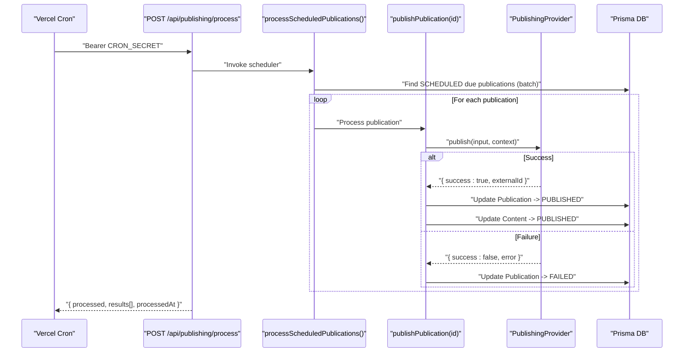
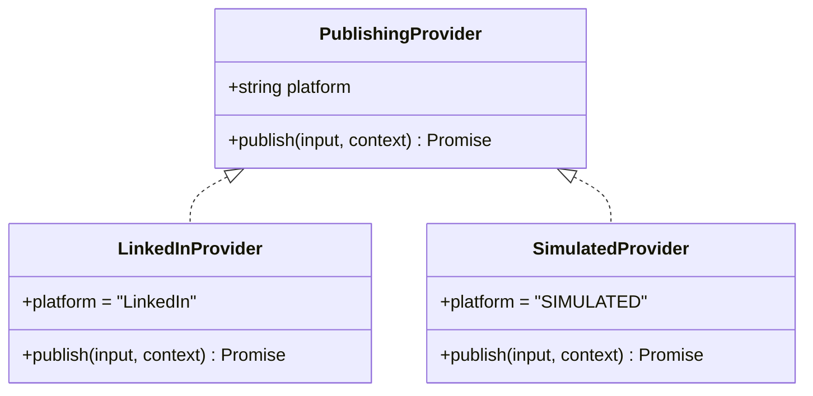
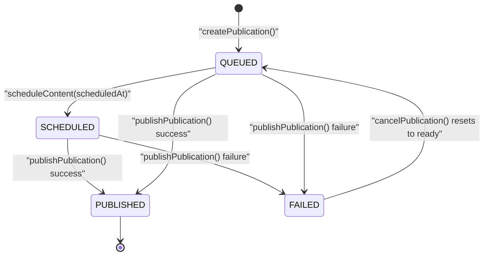
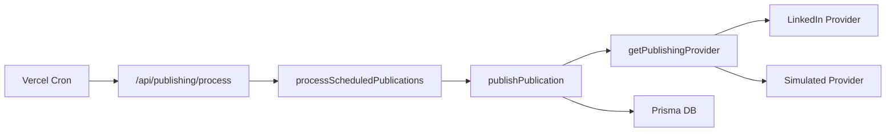

# Content Processing Engine

<cite>
**Referenced Files in This Document**
- [route.ts](file://app/api/publishing/process/route.ts)
- [process-scheduled.ts](file://app/publishing/engine/process-scheduled.ts)
- [publish.ts](file://app/publishing/engine/publish.ts)
- [types.ts](file://app/publishing/engine/types.ts)
- [providers/index.ts](file://app/publishing/engine/providers/index.ts)
- [providers/linkedin.ts](file://app/publishing/engine/providers/linkedin.ts)
- [providers/simulated.ts](file://app/publishing/engine/providers/simulated.ts)
- [schema.prisma](file://prisma/schema.prisma)
- [page.tsx](file://app/publishing/page.tsx)
- [create-publication.ts](file://app/content/actions/create-publication.ts)
- [schedule-content.ts](file://app/content/actions/schedule-content.ts)
- [cancel-publication.ts](file://app/publishing/actions/cancel-publication.ts)
- [vercel.json](file://vercel.json)
</cite>

## Table of Contents
1. [Introduction](#introduction)
2. [Project Structure](#project-structure)
3. [Core Components](#core-components)
4. [Architecture Overview](#architecture-overview)
5. [Detailed Component Analysis](#detailed-component-analysis)
6. [Dependency Analysis](#dependency-analysis)
7. [Performance Considerations](#performance-considerations)
8. [Troubleshooting Guide](#troubleshooting-guide)
9. [Conclusion](#conclusion)
10. [Appendices](#appendices)

## Introduction
This document describes the content processing engine that schedules, queues, and publishes content to external platforms. It covers the scheduled processing workflow, queue management, batch operations, status tracking, concurrency behavior, job state transitions, progress reporting, retry strategies, error recovery, and performance considerations. It also provides endpoint specifications for triggering processing, monitoring job status, and handling failures, along with examples of request/response schemas and webhook configuration guidance.

## Project Structure
The publishing pipeline is implemented as a Next.js API route backed by Prisma-managed database models and pluggable platform providers:
- API entry point triggers scheduled processing via a cron-triggered endpoint.
- The scheduler queries due publications and processes them in batches.
- Each publication is published through a provider (e.g., LinkedIn or simulated).
- Database records are updated to reflect status changes and results.

**Diagram sources**
- [route.ts:7-55](file://app/api/publishing/process/route.ts#L7-L55)
- [process-scheduled.ts:4-71](file://app/publishing/engine/process-scheduled.ts#L4-L71)
- [publish.ts:4-115](file://app/publishing/engine/publish.ts#L4-L115)
- [providers/index.ts:5-20](file://app/publishing/engine/providers/index.ts#L5-L20)
- [providers/linkedin.ts:141-283](file://app/publishing/engine/providers/linkedin.ts#L141-L283)
- [providers/simulated.ts:8-32](file://app/publishing/engine/providers/simulated.ts#L8-L32)
- [vercel.json:1-9](file://vercel.json#L1-L9)

**Section sources**
- [route.ts:1-56](file://app/api/publishing/process/route.ts#L1-L56)
- [vercel.json:1-9](file://vercel.json#L1-L9)

## Core Components
- Scheduled processing trigger: Secured POST endpoint invoked by Vercel Cron.
- Scheduler: Queries due SCHEDULED publications and processes them in batches.
- Publisher: Validates and executes platform-specific publishing, updates statuses atomically.
- Providers: Pluggable implementations for each platform (LinkedIn, Simulated).
- Data model: Prisma schema defines Content, Publication, PublishingChannel, Media.

Key responsibilities:
- Queue management: Publications are queued and scheduled via server actions; the scheduler picks up due items.
- Batch operations: The scheduler retrieves a fixed-size batch per run.
- Status tracking: States include QUEUED, SCHEDULED, PUBLISHED, FAILED; timestamps recorded on publish.
- Progress updates: The process returns aggregated results per batch.

**Section sources**
- [process-scheduled.ts:4-71](file://app/publishing/engine/process-scheduled.ts#L4-L71)
- [publish.ts:4-115](file://app/publishing/engine/publish.ts#L4-L115)
- [schema.prisma:21-93](file://prisma/schema.prisma#L21-L93)

## Architecture Overview
The system follows a clear separation between orchestration (scheduler), execution (publisher), and integration (providers).

**Diagram sources**
- [route.ts:7-55](file://app/api/publishing/process/route.ts#L7-L55)
- [process-scheduled.ts:4-71](file://app/publishing/engine/process-scheduled.ts#L4-L71)
- [publish.ts:4-115](file://app/publishing/engine/publish.ts#L4-L115)
- [providers/index.ts:5-20](file://app/publishing/engine/providers/index.ts#L5-L20)
- [providers/linkedin.ts:141-283](file://app/publishing/engine/providers/linkedin.ts#L141-L283)
- [providers/simulated.ts:8-32](file://app/publishing/engine/providers/simulated.ts#L8-L32)

## Detailed Component Analysis

### Endpoint: Trigger Scheduled Processing
- Method: POST
- Path: /api/publishing/process
- Authentication: Requires Authorization header with value "Bearer <CRON_SECRET>"
- Behavior:
  - Validates CRON_SECRET environment variable presence.
  - Verifies bearer token.
  - Invokes scheduler and returns aggregated results with timestamp.
- Responses:
  - 200: { processed: number, results: Array<{ publicationId, success, externalId|null, error|null }>, processedAt: string }
  - 401: { error: "Unauthorized." }
  - 500: { error: "CRON_SECRET is not configured." } or { error: "<error message>" }

Notes:
- Intended for server-to-server invocation via Vercel Cron.
- Not intended for unauthenticated client requests.

**Section sources**
- [route.ts:7-55](file://app/api/publishing/process/route.ts#L7-L55)
- [vercel.json:1-9](file://vercel.json#L1-L9)

### Scheduler: Batch Processing of Due Publications
- Function: processScheduledPublications()
- Logic:
  - Finds publications with status SCHEDULED and scheduledAt <= now.
  - Orders by scheduledAt ascending.
  - Limits batch size to 10 per run.
  - Iterates sequentially, calling publisher for each.
  - Collects per-item results and returns totals.
- Concurrency: Sequential within a single run; no parallelization.
- Error handling:
  - Individual failures are captured and reported without aborting the batch.
  - Errors are logged and included in results.

**Section sources**
- [process-scheduled.ts:4-71](file://app/publishing/engine/process-scheduled.ts#L4-L71)

### Publisher: Validate, Publish, and Update State
- Function: publishPublication(publicationId)
- Validation:
  - Ensures publication exists.
  - Allows only QUEUED or SCHEDULED states.
  - Requires non-empty content body.
  - Requires channel connected.
- Execution:
  - Resolves provider by platform.
  - Calls provider.publish with input and context.
- State transitions:
  - On failure: sets status to FAILED and stores error.
  - On success: atomically updates Publication to PUBLISHED with timestamps and externalId; updates Content to PUBLISHED and clears scheduling fields.
- Transactional update: Uses Prisma transaction to ensure consistency across related records.

**Section sources**
- [publish.ts:4-115](file://app/publishing/engine/publish.ts#L4-L115)

### Provider Abstraction and Implementations
- Provider registry: getPublishingProvider(platform) returns implementation or throws if unknown.
- LinkedIn provider:
  - Validates access token and author URN.
  - Uploads image (if present) using LinkedIn’s upload flow.
  - Creates post via REST API.
  - Returns externalId from response headers when available.
  - Handles errors gracefully and returns structured result.
- Simulated provider:
  - Logs inputs and returns success with synthetic externalId.

**Diagram sources**
- [types.ts:30-36](file://app/publishing/engine/types.ts#L30-L36)
- [providers/linkedin.ts:141-283](file://app/publishing/engine/providers/linkedin.ts#L141-L283)
- [providers/simulated.ts:8-32](file://app/publishing/engine/providers/simulated.ts#L8-L32)

**Section sources**
- [providers/index.ts:5-20](file://app/publishing/engine/providers/index.ts#L5-L20)
- [providers/linkedin.ts:141-283](file://app/publishing/engine/providers/linkedin.ts#L141-L283)
- [providers/simulated.ts:8-32](file://app/publishing/engine/providers/simulated.ts#L8-L32)
- [types.ts:1-37](file://app/publishing/engine/types.ts#L1-L37)

### Data Model and State Machine
- Models:
  - Content: title, body, status, scheduledAt, publishedAt, media relations.
  - Publication: links content and channel, tracks status, timestamps, externalId, error.
  - PublishingChannel: platform identity, connection flags, tokens, expiration.
  - Media: attachments linked to content.
- Statuses:
  - QUEUED: Ready for immediate or future processing.
  - SCHEDULED: Queued with a future scheduledAt time.
  - PUBLISHED: Successfully published; timestamps recorded.
  - FAILED: Publishing failed; error stored.

**Diagram sources**
- [schema.prisma:21-93](file://prisma/schema.prisma#L21-L93)
- [create-publication.ts:6-68](file://app/content/actions/create-publication.ts#L6-L68)
- [schedule-content.ts:6-65](file://app/content/actions/schedule-content.ts#L6-L65)
- [cancel-publication.ts:6-52](file://app/publishing/actions/cancel-publication.ts#L6-L52)
- [publish.ts:27-115](file://app/publishing/engine/publish.ts#L27-L115)

**Section sources**
- [schema.prisma:21-93](file://prisma/schema.prisma#L21-L93)
- [create-publication.ts:6-68](file://app/content/actions/create-publication.ts#L6-L68)
- [schedule-content.ts:6-65](file://app/content/actions/schedule-content.ts#L6-L65)
- [cancel-publication.ts:6-52](file://app/publishing/actions/cancel-publication.ts#L6-L52)

### Monitoring and UI
- The publishing page displays the distribution queue, including content title, channel, status, schedule, and published time.
- Status badges reflect current state for quick visibility.
- Users can reschedule or cancel scheduled items via controls integrated into the page.

**Section sources**
- [page.tsx:18-186](file://app/publishing/page.tsx#L18-L186)

## Dependency Analysis
- API route depends on scheduler function.
- Scheduler depends on Prisma and publisher.
- Publisher depends on provider registry and Prisma.
- Providers depend on Prisma for channel credentials and external APIs.
- Vercel Cron invokes the API route periodically.

**Diagram sources**
- [vercel.json:1-9](file://vercel.json#L1-L9)
- [route.ts:1-56](file://app/api/publishing/process/route.ts#L1-L56)
- [process-scheduled.ts:1-72](file://app/publishing/engine/process-scheduled.ts#L1-L72)
- [publish.ts:1-116](file://app/publishing/engine/publish.ts#L1-L116)
- [providers/index.ts:1-21](file://app/publishing/engine/providers/index.ts#L1-L21)

**Section sources**
- [vercel.json:1-9](file://vercel.json#L1-L9)
- [route.ts:1-56](file://app/api/publishing/process/route.ts#L1-L56)
- [process-scheduled.ts:1-72](file://app/publishing/engine/process-scheduled.ts#L1-L72)
- [publish.ts:1-116](file://app/publishing/engine/publish.ts#L1-L116)
- [providers/index.ts:1-21](file://app/publishing/engine/providers/index.ts#L1-L21)

## Performance Considerations
- Batch size: The scheduler limits to 10 items per run to avoid long-running requests and reduce load on external APIs.
- Sequential processing: Within a run, publications are processed one-by-one to simplify error handling and maintain order.
- Atomic updates: Successful publish uses a transaction to update both Publication and Content consistently.
- External API constraints: LinkedIn provider performs multi-step uploads; consider rate limits and timeouts at the platform level.
- Cron frequency: Currently set to run every minute; adjust based on expected volume and SLAs.

Recommendations:
- Increase batch size cautiously if throughput needs improve and external APIs support it.
- Add concurrency control per provider if needed (e.g., worker pools) while preserving ordering guarantees.
- Monitor external API latency and implement backoff strategies in providers.

[No sources needed since this section provides general guidance]

## Troubleshooting Guide
Common issues and resolutions:
- Unauthorized: Ensure Authorization header matches "Bearer <CRON_SECRET>". Verify CRON_SECRET is configured.
- Missing CRON_SECRET: Configure environment variable before invoking the endpoint.
- Channel not connected: Ensure PublishingChannel.connected is true and required credentials exist.
- Token expired: LinkedIn provider checks expiresAt; reconnect the channel when expired.
- Empty content body: Ensure content.body is non-empty before publishing.
- Platform not supported: Ensure platform maps to a registered provider.

Error responses:
- 401 Unauthorized: Invalid or missing token.
- 500 Server Error: Missing CRON_SECRET or unexpected exceptions during processing.

Logging and diagnostics:
- Console logs indicate start/end times, found items count, per-item processing, and provider interactions.
- Use the publishing page to inspect statuses and timestamps.

**Section sources**
- [route.ts:7-55](file://app/api/publishing/process/route.ts#L7-L55)
- [publish.ts:27-84](file://app/publishing/engine/publish.ts#L27-L84)
- [providers/linkedin.ts:148-180](file://app/publishing/engine/providers/linkedin.ts#L148-L180)
- [page.tsx:28-167](file://app/publishing/page.tsx#L28-L167)

## Conclusion
The content processing engine provides a secure, batched, and observable pipeline for scheduling and publishing content. It leverages a provider abstraction to integrate with multiple platforms, maintains consistent state via transactions, and exposes a cron-triggered endpoint for automated processing. While retries and webhooks are not currently implemented, the design allows for straightforward extension to support advanced reliability and real-time notifications.

[No sources needed since this section summarizes without analyzing specific files]

## Appendices

### Endpoint Specifications

- POST /api/publishing/process
  - Purpose: Trigger scheduled processing of due publications.
  - Headers:
    - Authorization: Bearer <CRON_SECRET>
  - Request body: None
  - Responses:
    - 200 OK:
      - Schema:
        - processed: number
        - results: array of objects
          - publicationId: string
          - success: boolean
          - externalId: string|null
          - error: string|null
        - processedAt: string (ISO timestamp)
    - 401 Unauthorized:
      - Schema: { error: "Unauthorized." }
    - 500 Internal Server Error:
      - Schema: { error: "CRON_SECRET is not configured." } or { error: "<message>" }

**Section sources**
- [route.ts:7-55](file://app/api/publishing/process/route.ts#L7-L55)

### Job States and Transitions
- QUEUED: Created via createPublication; ready for immediate or scheduled processing.
- SCHEDULED: Set via scheduleContent with a future scheduledAt; picked up by scheduler when due.
- PUBLISHED: Updated atomically on successful publish; includes publishedAt and externalId.
- FAILED: Updated on provider failure; includes error details.

**Section sources**
- [create-publication.ts:6-68](file://app/content/actions/create-publication.ts#L6-L68)
- [schedule-content.ts:6-65](file://app/content/actions/schedule-content.ts#L6-L65)
- [publish.ts:27-115](file://app/publishing/engine/publish.ts#L27-L115)
- [cancel-publication.ts:6-52](file://app/publishing/actions/cancel-publication.ts#L6-L52)

### Retry Mechanisms and Error Recovery
Current behavior:
- No automatic retry; failures are recorded with error messages.
- Failed items remain in FAILED state; operators can reschedule or requeue manually.

Recommended enhancements:
- Implement exponential backoff retries in providers for transient errors.
- Add a retry counter and max attempts in the Publication model.
- Provide a resubmit action to move FAILED items back to QUEUED after remediation.

[No sources needed since this section proposes enhancements beyond current implementation]

### Webhook Configuration for Real-Time Updates
Current behavior:
- No webhook endpoints are implemented in the codebase.

Recommended approach:
- Add a webhook endpoint (e.g., POST /api/webhooks/publishing-status) to receive asynchronous status updates from providers or internal workers.
- Include signature verification and idempotency keys to handle duplicates.
- Emit events for state transitions (QUEUED, SCHEDULED, PUBLISHED, FAILED) with payload containing publicationId, status, timestamps, and error details.

[No sources needed since this section provides conceptual guidance]

### Example Requests and Responses

- Trigger processing:
  - Request:
    - Method: POST
    - URL: /api/publishing/process
    - Header: Authorization: Bearer <CRON_SECRET>
  - Response (200):
    - {
      "processed": 3,
      "results": [
        { "publicationId": "pub_1", "success": true, "externalId": "ext_1", "error": null },
        { "publicationId": "pub_2", "success": false, "externalId": null, "error": "LinkedIn API returned 401: ..." },
        { "publicationId": "pub_3", "success": true, "externalId": "ext_3", "error": null }
      ],
      "processedAt": "2026-01-01T12:00:00.000Z"
    }

**Section sources**
- [route.ts:27-41](file://app/api/publishing/process/route.ts#L27-L41)
- [process-scheduled.ts:33-70](file://app/publishing/engine/process-scheduled.ts#L33-L70)

### Monitoring Job Status
- Use the publishing page to view the distribution queue and statuses.
- Query the Publication table directly for detailed metrics (counts by status, recent failures, scheduled vs published counts).

**Section sources**
- [page.tsx:28-167](file://app/publishing/page.tsx#L28-L167)