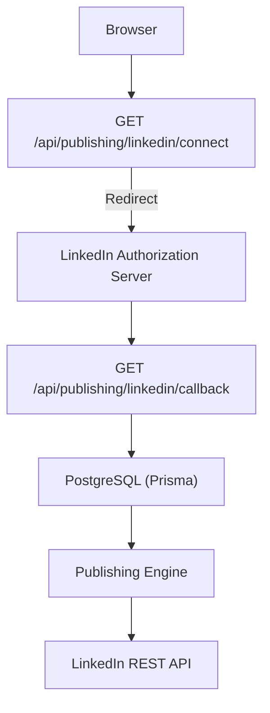
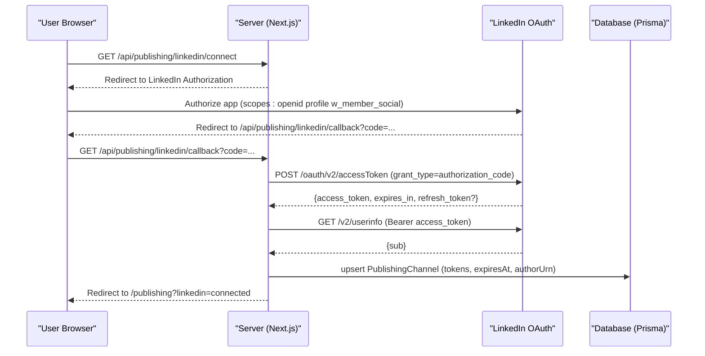
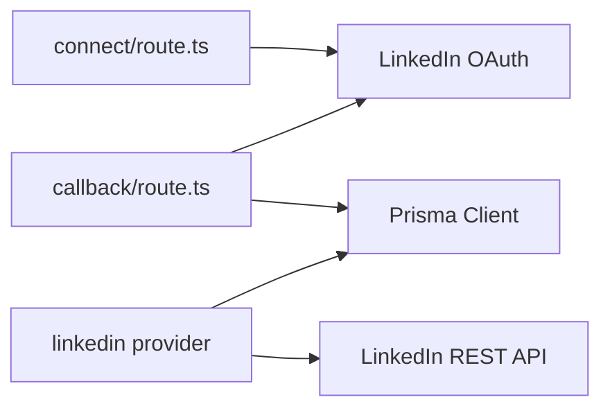

# LinkedIn OAuth Integration

<cite>
**Referenced Files in This Document**
- [connect/route.ts](file://app/api/publishing/linkedin/connect/route.ts)
- [callback/route.ts](file://app/api/publishing/linkedin/callback/route.ts)
- [linkedin provider](file://app/publishing/engine/providers/linkedin.ts)
- [Prisma schema](file://prisma/schema.prisma)
- [README](file://README.md)
</cite>

## Table of Contents
1. [Introduction](#introduction)
2. [Project Structure](#project-structure)
3. [Core Components](#core-components)
4. [Architecture Overview](#architecture-overview)
5. [Detailed Component Analysis](#detailed-component-analysis)
6. [Dependency Analysis](#dependency-analysis)
7. [Performance Considerations](#performance-considerations)
8. [Troubleshooting Guide](#troubleshooting-guide)
9. [Conclusion](#conclusion)
10. [Appendices](#appendices)

## Introduction
This document provides detailed API documentation for the LinkedIn OAuth integration used by the application to authenticate users and publish content on their behalf. It covers:
- Authorization initiation via GET /api/publishing/linkedin/connect
- Callback handling via GET /api/publishing/linkedin/callback
- Token exchange, user identity retrieval, and token storage
- Scope permissions (openid profile w_member_social)
- Security considerations for credential storage
- Troubleshooting guidance for common OAuth issues
- Environment configuration requirements

The implementation uses Next.js App Router server routes and stores connection state in a PostgreSQL database via Prisma.

## Project Structure
LinkedIn OAuth is implemented as two server routes under the publishing module and a provider that consumes stored credentials to publish posts. The database schema includes a PublishingChannel model to persist tokens and identity metadata.

**Diagram sources**
- [connect/route.ts:3-32](file://app/api/publishing/linkedin/connect/route.ts#L3-L32)
- [callback/route.ts:4-167](file://app/api/publishing/linkedin/callback/route.ts#L4-L167)
- [linkedin provider:141-283](file://app/publishing/engine/providers/linkedin.ts#L141-L283)
- [Prisma schema:57-73](file://prisma/schema.prisma#L57-L73)

**Section sources**
- [connect/route.ts:3-32](file://app/api/publishing/linkedin/connect/route.ts#L3-L32)
- [callback/route.ts:4-167](file://app/api/publishing/linkedin/callback/route.ts#L4-L167)
- [linkedin provider:141-283](file://app/publishing/engine/providers/linkedin.ts#L141-L283)
- [Prisma schema:57-73](file://prisma/schema.prisma#L57-L73)

## Core Components
- Authorization initiation endpoint: Builds the LinkedIn authorization URL with required scopes and redirects the user.
- Callback endpoint: Exchanges the authorization code for an access token, retrieves user identity, computes expiration, and persists connection details.
- Publishing provider: Uses stored credentials to upload images and create posts on LinkedIn.

Key responsibilities:
- Validate environment variables before initiating or completing OAuth.
- Handle errors from LinkedIn during token exchange and userinfo lookup.
- Store tokens securely in the database with expiration tracking.
- Enforce scope requirements for publishing capabilities.

**Section sources**
- [connect/route.ts:3-32](file://app/api/publishing/linkedin/connect/route.ts#L3-L32)
- [callback/route.ts:4-167](file://app/api/publishing/linkedin/callback/route.ts#L4-L167)
- [linkedin provider:141-283](file://app/publishing/engine/providers/linkedin.ts#L141-L283)

## Architecture Overview
The OAuth flow follows the standard authorization code pattern:
1. User initiates connection by visiting the connect endpoint.
2. The server redirects to LinkedIn’s authorization page with configured scopes.
3. After consent, LinkedIn redirects back to the callback with an authorization code.
4. The server exchanges the code for an access token and refresh token (if provided).
5. The server fetches user info to derive the author URN.
6. Tokens and metadata are persisted; the user is redirected back to the app.

**Diagram sources**
- [connect/route.ts:3-32](file://app/api/publishing/linkedin/connect/route.ts#L3-L32)
- [callback/route.ts:4-167](file://app/api/publishing/linkedin/callback/route.ts#L4-L167)

## Detailed Component Analysis

### Authorization Initiation: GET /api/publishing/linkedin/connect
- Validates required environment variables (client ID and app URL).
- Constructs redirect URI to the callback endpoint.
- Requests scopes: openid, profile, w_member_social.
- Redirects the user to LinkedIn’s authorization endpoint.

Request
- Method: GET
- Path: /api/publishing/linkedin/connect
- Headers: None required
- Query parameters: None

Response
- HTTP 302 Redirect to LinkedIn Authorization URL with query parameters including response_type=code, client_id, redirect_uri, and scope.

Error Responses
- HTTP 500 JSON error if environment variables are missing.

Example Request
- GET /api/publishing/linkedin/connect

Example Response
- 302 Redirect to https://www.linkedin.com/oauth/v2/authorization?response_type=code&client_id=...&redirect_uri=...&scope=openid%20profile%20w_member_social

Security Notes
- Ensure APP_URL matches the production domain so callbacks are accepted by LinkedIn.
- Do not log sensitive values such as client secrets.

**Section sources**
- [connect/route.ts:3-32](file://app/api/publishing/linkedin/connect/route.ts#L3-L32)

### Callback Handling: GET /api/publishing/linkedin/callback
- Parses query parameters for code and error.
- If error present, returns a 400 JSON error with error and description.
- If code missing, returns a 400 JSON error indicating missing authorization code.
- Validates environment variables (client ID, client secret, app URL).
- Exchanges code for tokens via LinkedIn’s access token endpoint.
- On token exchange failure, returns a 400 JSON error with details.
- Ensures access_token is present; otherwise returns a 400 JSON error.
- Computes expiresAt from expires_in when available.
- Retrieves user info using the access token to obtain sub identifier.
- Derives author URN as urn:li:person:.
- Persists connection via upsert into PublishingChannel (platform, connected flag, accountName, accessToken, refreshToken, expiresAt, authorUrn).
- Redirects to /publishing?linkedin=connected.

Request
- Method: GET
- Path: /api/publishing/linkedin/callback
- Query parameters:
  - code: string (required)
  - error: string (optional, indicates failure)
  - error_description: string (optional)

Success Response
- HTTP 302 Redirect to /publishing?linkedin=connected

Error Responses
- HTTP 400 JSON:
  - Missing code
  - Error from LinkedIn during token exchange or userinfo lookup
  - Missing access token
  - Missing member identifier
- HTTP 500 JSON:
  - Environment variables not configured

Example Request
- GET /api/publishing/linkedin/callback?code=AQD...

Example Success Response
- 302 Redirect to /publishing?linkedin=connected

Example Error Response
- { "error": "LinkedIn did not return an access token." }

Security Notes
- Validate redirect_uri exactly matches the registered value in LinkedIn app settings.
- Store tokens in the database only; avoid logging them.
- Use HTTPS in production to protect tokens in transit.

**Section sources**
- [callback/route.ts:4-167](file://app/api/publishing/linkedin/callback/route.ts#L4-L167)

### Token Storage and Identity
- Tokens and metadata are stored in the PublishingChannel table:
  - platform: unique identifier for the channel
  - connected: boolean indicating active connection
  - accountName: display name for the account
  - accessToken: current access token
  - refreshToken: optional refresh token
  - expiresAt: timestamp for token expiry
  - externalId: optional external reference
  - authorUrn: LinkedIn person URN derived from user info sub

Data Model
- See PublishingChannel fields in the schema.

Implications
- The system can detect expired tokens and prompt reconnection.
- The author URN is required for posting on behalf of the user.

**Section sources**
- [Prisma schema:57-73](file://prisma/schema.prisma#L57-L73)

### Publishing Flow Using Stored Credentials
- The provider reads the stored access token, author URN, and expiration.
- Validates presence and validity of credentials before publishing.
- For image posts:
  - Downloads media from the application’s storage using APP_URL.
  - Initializes upload with LinkedIn’s image endpoint.
  - Uploads binary data to the returned upload URL.
- Creates a post with commentary and optional media content.
- Returns success with external ID from LinkedIn headers when applicable.

Error Handling
- Missing or expired tokens result in explicit errors prompting reconnection.
- Network or API failures return structured errors with status and body.

**Section sources**
- [linkedin provider:141-283](file://app/publishing/engine/providers/linkedin.ts#L141-L283)

## Dependency Analysis
- Routes depend on environment variables for LinkedIn credentials and app URL.
- Callback route depends on Prisma client to persist connection state.
- Publishing provider depends on Prisma client to read channel credentials and calls LinkedIn REST APIs for image upload and post creation.
- Database schema defines the contract for storing channel credentials and publication records.

**Diagram sources**
- [connect/route.ts:3-32](file://app/api/publishing/linkedin/connect/route.ts#L3-L32)
- [callback/route.ts:4-167](file://app/api/publishing/linkedin/callback/route.ts#L4-L167)
- [linkedin provider:141-283](file://app/publishing/engine/providers/linkedin.ts#L141-L283)
- [Prisma schema:57-73](file://prisma/schema.prisma#L57-L73)

**Section sources**
- [connect/route.ts:3-32](file://app/api/publishing/linkedin/connect/route.ts#L3-L32)
- [callback/route.ts:4-167](file://app/api/publishing/linkedin/callback/route.ts#L4-L167)
- [linkedin provider:141-283](file://app/publishing/engine/providers/linkedin.ts#L141-L283)
- [Prisma schema:57-73](file://prisma/schema.prisma#L57-L73)

## Performance Considerations
- Token exchange and userinfo requests are synchronous per request; ensure network timeouts are appropriate for your deployment environment.
- Image uploads involve downloading media from application storage and then uploading to LinkedIn; consider caching or pre-uploading large assets to minimize latency.
- Avoid logging sensitive tokens or payloads to reduce overhead and risk.

[No sources needed since this section provides general guidance]

## Troubleshooting Guide
Common issues and resolutions:
- Missing environment variables:
  - Symptoms: 500 error indicating environment variables are not configured.
  - Resolution: Set LINKEDIN_CLIENT_ID, LINKEDIN_CLIENT_SECRET, and APP_URL.
- Missing authorization code:
  - Symptoms: 400 error indicating missing code.
  - Resolution: Ensure the user completes the LinkedIn authorization flow and the callback receives the code parameter.
- Token exchange failure:
  - Symptoms: 400 error with details from LinkedIn.
  - Resolution: Verify client ID, client secret, and redirect_uri match LinkedIn app settings. Check network connectivity and rate limits.
- Missing access token:
  - Symptoms: 400 error indicating no access token returned.
  - Resolution: Confirm scopes include w_member_social and that the user authorized the requested permissions.
- Unable to retrieve member identity:
  - Symptoms: 400 error with details from userinfo lookup.
  - Resolution: Ensure openid and profile scopes are granted and the access token is valid.
- Expired or missing access token during publishing:
  - Symptoms: Errors indicating token missing or expired.
  - Resolution: Reconnect LinkedIn to refresh tokens and update author URN.

Environment Configuration Requirements
- Required variables:
  - DATABASE_URL and SHADOW_DATABASE_URL for Prisma
  - LINKEDIN_CLIENT_ID and LINKEDIN_CLIENT_SECRET for OAuth
  - APP_URL must match the production domain used in LinkedIn app settings
- Security note: Never commit .env files to version control.

**Section sources**
- [connect/route.ts:3-32](file://app/api/publishing/linkedin/connect/route.ts#L3-L32)
- [callback/route.ts:4-167](file://app/api/publishing/linkedin/callback/route.ts#L4-L167)
- [README:131-149](file://README.md#L131-L149)
- [README:249-258](file://README.md#L249-L258)

## Conclusion
The LinkedIn OAuth integration implements a robust authorization code flow with secure token storage and clear error handling. By configuring the required environment variables and ensuring correct scopes, users can connect their LinkedIn accounts and publish content through the application. Proper monitoring of token expiration and careful handling of errors will help maintain a reliable publishing pipeline.

[No sources needed since this section summarizes without analyzing specific files]

## Appendices

### API Endpoints Summary
- GET /api/publishing/linkedin/connect
  - Purpose: Initiate LinkedIn OAuth authorization
  - Scopes: openid, profile, w_member_social
  - Redirects to LinkedIn Authorization URL
- GET /api/publishing/linkedin/callback
  - Purpose: Exchange authorization code for tokens and store connection
  - Success: Redirects to /publishing?linkedin=connected
  - Errors: 400/500 JSON responses with descriptive messages

**Section sources**
- [connect/route.ts:3-32](file://app/api/publishing/linkedin/connect/route.ts#L3-L32)
- [callback/route.ts:4-167](file://app/api/publishing/linkedin/callback/route.ts#L4-L167)
- [README:351-367](file://README.md#L351-L367)

### Data Model Reference
- PublishingChannel fields relevant to OAuth:
  - platform, connected, accountName, accessToken, refreshToken, expiresAt, externalId, authorUrn

**Section sources**
- [Prisma schema:57-73](file://prisma/schema.prisma#L57-L73)