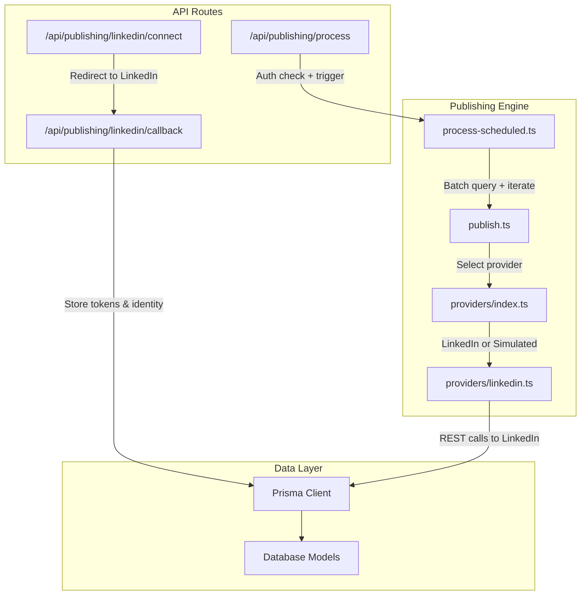
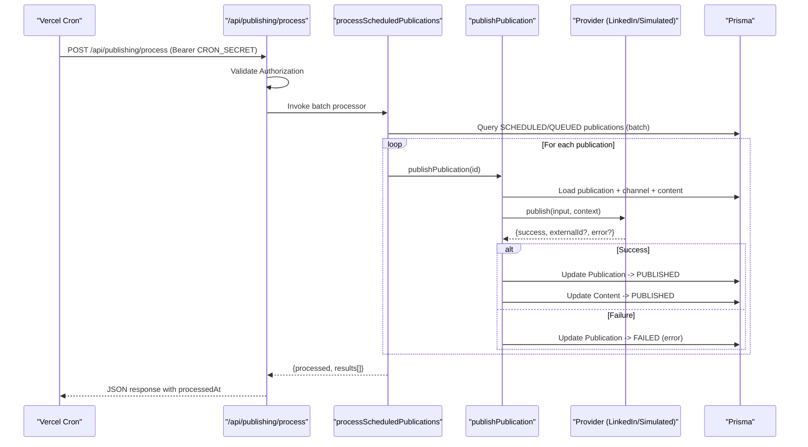
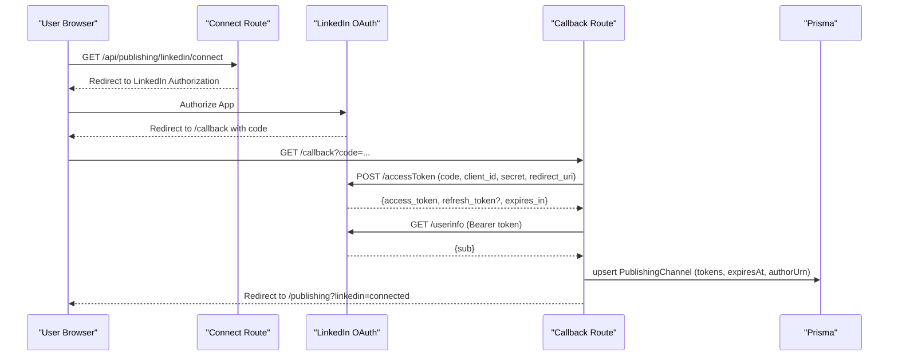
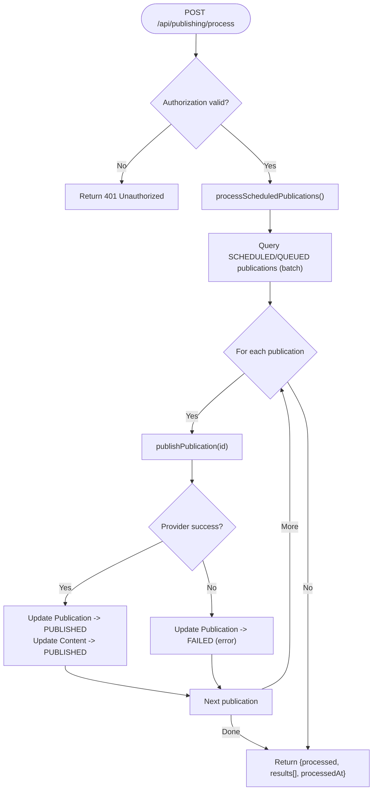
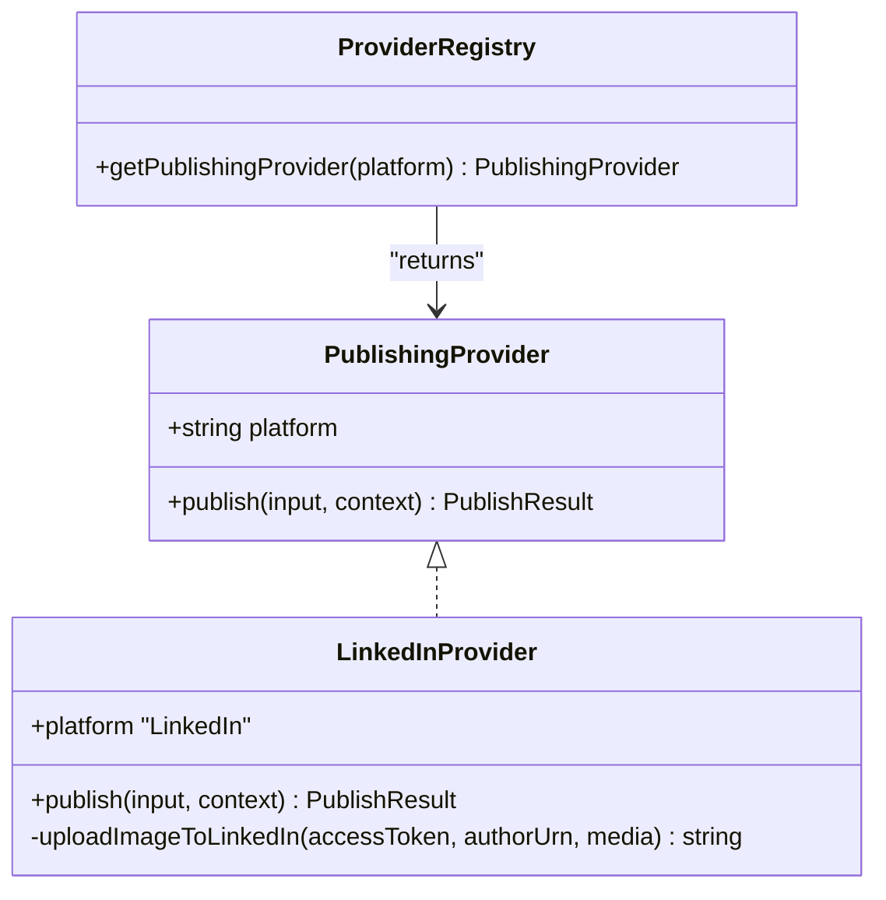
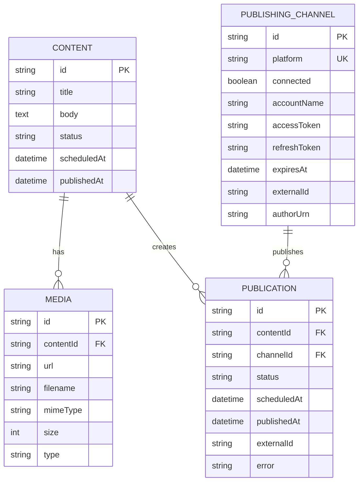
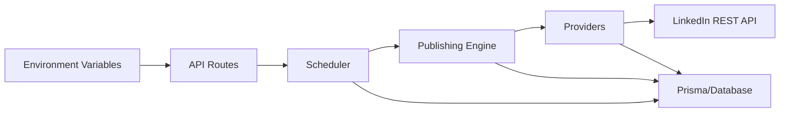

# Publishing APIs

<cite>
**Referenced Files in This Document**
- [route.ts](file://app/api/publishing/linkedin/connect/route.ts)
- [route.ts](file://app/api/publishing/linkedin/callback/route.ts)
- [route.ts](file://app/api/publishing/process/route.ts)
- [linkedin.ts](file://app/publishing/engine/providers/linkedin.ts)
- [process-scheduled.ts](file://app/publishing/engine/process-scheduled.ts)
- [publish.ts](file://app/publishing/engine/publish.ts)
- [types.ts](file://app/publishing/engine/types.ts)
- [index.ts](file://app/publishing/engine/providers/index.ts)
- [schema.prisma](file://prisma/schema.prisma)
- [schedule-publication.ts](file://app/publishing/actions/schedule-publication.ts)
- [create-publication.ts](file://app/content/actions/create-publication.ts)
- [publish-content.ts](file://app/content/actions/publish-content.ts)
- [vercel.json](file://vercel.json)
</cite>

## Table of Contents
1. Introduction
2. Project Structure
3. Core Components
4. Architecture Overview
5. Detailed Component Analysis
6. Dependency Analysis
7. Performance Considerations
8. Troubleshooting Guide
9. Conclusion
10. Appendices

## Introduction
This document provides comprehensive API documentation for publishing endpoints in ContentOS, focusing on:
- LinkedIn OAuth flow (connection initiation and callback handling)
- Scheduled content processing with queue management, status tracking, and batch operations
- Webhook configuration via cron-triggered endpoint
- Error handling for failed publications and retry mechanisms
- Monitoring capabilities through structured logs and response payloads
- Security considerations for credential storage and platform-specific rate limits

The system supports scheduling and publishing content to connected channels, currently including LinkedIn and a simulated provider.

## Project Structure
ContentOS implements Next.js API routes for OAuth and scheduled processing, backed by Prisma-managed database models for content, media, publishing channels, and publications. The publishing engine abstracts platform providers to publish content consistently.

**Diagram sources**
- [route.ts:1-34](file://app/api/publishing/linkedin/connect/route.ts#L1-L34)
- [route.ts:1-169](file://app/api/publishing/linkedin/callback/route.ts#L1-L169)
- [route.ts:1-56](file://app/api/publishing/process/route.ts#L1-L56)
- [process-scheduled.ts:1-72](file://app/publishing/engine/process-scheduled.ts#L1-L72)
- [publish.ts:1-116](file://app/publishing/engine/publish.ts#L1-L116)
- [index.ts:1-21](file://app/publishing/engine/providers/index.ts#L1-L21)
- [linkedin.ts:1-284](file://app/publishing/engine/providers/linkedin.ts#L1-L284)
- [schema.prisma:1-94](file://prisma/schema.prisma#L1-L94)

**Section sources**
- [route.ts:1-34](file://app/api/publishing/linkedin/connect/route.ts#L1-L34)
- [route.ts:1-169](file://app/api/publishing/linkedin/callback/route.ts#L1-L169)
- [route.ts:1-56](file://app/api/publishing/process/route.ts#L1-L56)
- [process-scheduled.ts:1-72](file://app/publishing/engine/process-scheduled.ts#L1-L72)
- [publish.ts:1-116](file://app/publishing/engine/publish.ts#L1-L116)
- [index.ts:1-21](file://app/publishing/engine/providers/index.ts#L1-L21)
- [linkedin.ts:1-284](file://app/publishing/engine/providers/linkedin.ts#L1-L284)
- [schema.prisma:1-94](file://prisma/schema.prisma#L1-L94)

## Core Components
- LinkedIn OAuth Connect: Initiates authorization redirect to LinkedIn with required scopes.
- LinkedIn OAuth Callback: Exchanges authorization code for access token, retrieves user info, persists credentials and identity, and redirects back to the app.
- Scheduled Processing Endpoint: Cron-triggered POST that validates authorization and runs batch publication processing.
- Publishing Engine: Orchestrates fetching queued/scheduled publications, invoking the appropriate provider, updating statuses, and recording results.
- Providers: Platform-specific implementations; currently LinkedIn and a simulated provider.
- Data Models: Content, Media, PublishingChannel, Publication define the state machine and relationships.

Key responsibilities:
- Securely handle OAuth flows and store tokens securely in the database.
- Provide a secure, authenticated endpoint for scheduled processing.
- Enforce validation and state transitions during publishing.
- Abstract platform differences behind a consistent provider interface.

**Section sources**
- [route.ts:1-34](file://app/api/publishing/linkedin/connect/route.ts#L1-L34)
- [route.ts:1-169](file://app/api/publishing/linkedin/callback/route.ts#L1-L169)
- [route.ts:1-56](file://app/api/publishing/process/route.ts#L1-L56)
- [process-scheduled.ts:1-72](file://app/publishing/engine/process-scheduled.ts#L1-L72)
- [publish.ts:1-116](file://app/publishing/engine/publish.ts#L1-L116)
- [index.ts:1-21](file://app/publishing/engine/providers/index.ts#L1-L21)
- [linkedin.ts:1-284](file://app/publishing/engine/providers/linkedin.ts#L1-L284)
- [schema.prisma:1-94](file://prisma/schema.prisma#L1-L94)

## Architecture Overview
The publishing architecture is event-driven via a cron job that triggers batch processing of scheduled publications. Each publication is validated and published using a provider abstraction. Results are persisted with status updates and error details.

**Diagram sources**
- [vercel.json:1-9](file://vercel.json#L1-L9)
- [route.ts:1-56](file://app/api/publishing/process/route.ts#L1-L56)
- [process-scheduled.ts:1-72](file://app/publishing/engine/process-scheduled.ts#L1-L72)
- [publish.ts:1-116](file://app/publishing/engine/publish.ts#L1-L116)
- [index.ts:1-21](file://app/publishing/engine/providers/index.ts#L1-L21)
- [linkedin.ts:1-284](file://app/publishing/engine/providers/linkedin.ts#L1-L284)

## Detailed Component Analysis

### LinkedIn OAuth Flow
- Connection Initiation: GET /api/publishing/linkedin/connect builds an authorization URL with client ID, redirect URI, and scopes, then redirects the user to LinkedIn.
- Callback Handling: GET /api/publishing/linkedin/callback exchanges the authorization code for an access token, retrieves user info, computes expiration, stores credentials and author URN, and redirects to the publishing page with a success flag.

**Diagram sources**
- [route.ts:1-34](file://app/api/publishing/linkedin/connect/route.ts#L1-L34)
- [route.ts:1-169](file://app/api/publishing/linkedin/callback/route.ts#L1-L169)

**Section sources**
- [route.ts:1-34](file://app/api/publishing/linkedin/connect/route.ts#L1-L34)
- [route.ts:1-169](file://app/api/publishing/linkedin/callback/route.ts#L1-L169)

### Scheduled Content Processing Endpoints
- Endpoint: POST /api/publishing/process requires a Bearer token matching CRON_SECRET. It invokes the scheduler which queries and processes up to a fixed batch size of ready publications.
- Batch Processing: Queries SCHEDULED or QUEUED publications with scheduledAt <= now, ordered by scheduledAt ascending, limited to a batch size.
- Status Tracking: Each result includes publicationId, success, externalId, and error. On success, both Publication and Content are updated to PUBLISHED with timestamps and externalId. On failure, Publication is set to FAILED with error details.

**Diagram sources**
- [route.ts:1-56](file://app/api/publishing/process/route.ts#L1-L56)
- [process-scheduled.ts:1-72](file://app/publishing/engine/process-scheduled.ts#L1-L72)
- [publish.ts:1-116](file://app/publishing/engine/publish.ts#L1-L116)

**Section sources**
- [route.ts:1-56](file://app/api/publishing/process/route.ts#L1-L56)
- [process-scheduled.ts:1-72](file://app/publishing/engine/process-scheduled.ts#L1-L72)
- [publish.ts:1-116](file://app/publishing/engine/publish.ts#L1-L116)

### Provider Abstraction and LinkedIn Implementation
- Provider Registry: getPublishingProvider selects the correct implementation based on platform string.
- LinkedIn Provider: Validates channel credentials and author URN, optionally uploads images via LinkedIn’s image upload flow, creates posts with commentary and optional media, and returns external IDs from headers.

**Diagram sources**
- [index.ts:1-21](file://app/publishing/engine/providers/index.ts#L1-L21)
- [linkedin.ts:1-284](file://app/publishing/engine/providers/linkedin.ts#L1-L284)
- [types.ts:1-37](file://app/publishing/engine/types.ts#L1-L37)

**Section sources**
- [index.ts:1-21](file://app/publishing/engine/providers/index.ts#L1-L21)
- [linkedin.ts:1-284](file://app/publishing/engine/providers/linkedin.ts#L1-L284)
- [types.ts:1-37](file://app/publishing/engine/types.ts#L1-L37)

### Data Model Relationships

**Diagram sources**
- [schema.prisma:1-94](file://prisma/schema.prisma#L1-L94)

**Section sources**
- [schema.prisma:1-94](file://prisma/schema.prisma#L1-L94)

### Server Actions for Scheduling and Publishing
- Schedule Publication: Updates a publication’s status to SCHEDULED with a future scheduledAt time.
- Create Publication: Creates or updates a publication to QUEUED for a connected channel.
- Publish Content: Validates content readiness and existence of active publication, then publishes immediately.

These actions enforce business rules such as preventing re-publishing, ensuring channel connectivity, and requiring content fields.

**Section sources**
- [schedule-publication.ts:1-52](file://app/publishing/actions/schedule-publication.ts#L1-L52)
- [create-publication.ts:1-69](file://app/content/actions/create-publication.ts#L1-L69)
- [publish-content.ts:1-70](file://app/content/actions/publish-content.ts#L1-L70)

## Dependency Analysis
- API routes depend on environment variables for LinkedIn OAuth and cron authentication.
- The scheduler depends on Prisma to query and update records.
- The publishing engine depends on provider registry to select platform-specific logic.
- LinkedIn provider depends on LinkedIn REST APIs and uses headers and versioning.

**Diagram sources**
- [route.ts:1-56](file://app/api/publishing/process/route.ts#L1-L56)
- [process-scheduled.ts:1-72](file://app/publishing/engine/process-scheduled.ts#L1-L72)
- [publish.ts:1-116](file://app/publishing/engine/publish.ts#L1-L116)
- [index.ts:1-21](file://app/publishing/engine/providers/index.ts#L1-L21)
- [linkedin.ts:1-284](file://app/publishing/engine/providers/linkedin.ts#L1-L284)

**Section sources**
- [route.ts:1-56](file://app/api/publishing/process/route.ts#L1-L56)
- [process-scheduled.ts:1-72](file://app/publishing/engine/process-scheduled.ts#L1-L72)
- [publish.ts:1-116](file://app/publishing/engine/publish.ts#L1-L116)
- [index.ts:1-21](file://app/publishing/engine/providers/index.ts#L1-L21)
- [linkedin.ts:1-284](file://app/publishing/engine/providers/linkedin.ts#L1-L284)

## Performance Considerations
- Batch Size: The scheduler limits batch size to a fixed number per run to avoid long-running jobs. Adjust batch size based on expected load and platform rate limits.
- Database Queries: Queries use selective fields and ordering to minimize payload size and ensure deterministic order.
- External API Calls: LinkedIn image upload involves two requests (initialize and upload). Ensure timeouts and retries are configured at the runtime level if needed.
- Concurrency: The current implementation processes sequentially within a single invocation. If higher throughput is required, consider parallelization with careful rate limiting.

[No sources needed since this section provides general guidance]

## Troubleshooting Guide
Common issues and resolutions:
- Missing Environment Variables:
  - LinkedIn OAuth connect/callback require LINKEDIN_CLIENT_ID, LINKEDIN_CLIENT_SECRET, APP_URL.
  - Scheduled processing requires CRON_SECRET.
  - Errors return 500 or 401 with descriptive messages.
- Unauthorized Access:
  - Scheduled endpoint returns 401 when Authorization header does not match Bearer CRON_SECRET.
- Token Exchange Failures:
  - Callback returns 400 with details when token exchange fails or access token is missing.
- UserInfo Lookup Failures:
  - Callback returns 400 when member identity cannot be retrieved.
- Invalid State Transitions:
  - Publishing engine throws errors for invalid publication states or missing content/channel.
- Provider Errors:
  - LinkedIn provider returns detailed error messages for network or API failures; these are persisted in Publication.error.

Monitoring and Observability:
- Structured console logs include timestamps, operation names, and key identifiers (e.g., publicationId, externalId).
- Response payloads include processedAt timestamp and per-result details for auditing.

**Section sources**
- [route.ts:1-34](file://app/api/publishing/linkedin/connect/route.ts#L1-L34)
- [route.ts:1-169](file://app/api/publishing/linkedin/callback/route.ts#L1-L169)
- [route.ts:1-56](file://app/api/publishing/process/route.ts#L1-L56)
- [publish.ts:1-116](file://app/publishing/engine/publish.ts#L1-L116)
- [linkedin.ts:1-284](file://app/publishing/engine/providers/linkedin.ts#L1-L284)

## Conclusion
ContentOS provides a robust publishing pipeline with secure LinkedIn OAuth integration, scheduled batch processing, and extensible provider architecture. The system enforces strong validation, tracks status transitions, and captures errors for troubleshooting. With cron-triggered processing and structured logging, it offers reliable automation for content publication across platforms.

[No sources needed since this section summarizes without analyzing specific files]

## Appendices

### API Reference

#### LinkedIn OAuth Connect
- Method: GET
- Path: /api/publishing/linkedin/connect
- Behavior: Builds authorization URL with required scopes and redirects to LinkedIn.
- Required Environment: LINKEDIN_CLIENT_ID, APP_URL
- Responses:
  - 302 Redirect to LinkedIn authorization page
  - 500 if environment variables are missing

**Section sources**
- [route.ts:1-34](file://app/api/publishing/linkedin/connect/route.ts#L1-L34)

#### LinkedIn OAuth Callback
- Method: GET
- Path: /api/publishing/linkedin/callback
- Query Parameters: code, error
- Behavior: Exchanges code for token, retrieves user info, persists credentials and identity, redirects to /publishing?linkedin=connected.
- Required Environment: LINKEDIN_CLIENT_ID, LINKEDIN_CLIENT_SECRET, APP_URL
- Responses:
  - 400 with error details for missing code or token exchange failures
  - 400 when user info lookup fails
  - 302 Redirect to /publishing?linkedin=connected on success

**Section sources**
- [route.ts:1-169](file://app/api/publishing/linkedin/callback/route.ts#L1-L169)

#### Scheduled Processing Endpoint
- Method: POST
- Path: /api/publishing/process
- Headers: Authorization: Bearer <CRON_SECRET>
- Behavior: Validates auth, invokes scheduler to process batch of scheduled/queued publications, updates statuses, returns results.
- Required Environment: CRON_SECRET
- Responses:
  - 401 Unauthorized if token mismatch
  - 500 if CRON_SECRET is not configured or internal error
  - 200 with JSON containing processed count, results array, and processedAt timestamp

**Section sources**
- [route.ts:1-56](file://app/api/publishing/process/route.ts#L1-L56)

### Webhook Configuration
- Vercel Cron: Configured to call /api/publishing/process every minute.
- Authentication: Bearer token must match CRON_SECRET.
- Payload: No request body required; endpoint returns JSON with processing results.

**Section sources**
- [vercel.json:1-9](file://vercel.json#L1-L9)
- [route.ts:1-56](file://app/api/publishing/process/route.ts#L1-L56)

### Examples

#### OAuth Flow Example
- Step 1: Navigate to /api/publishing/linkedin/connect to initiate connection.
- Step 2: Complete LinkedIn authorization.
- Step 3: Callback handles token exchange and redirects to /publishing?linkedin=connected.

**Section sources**
- [route.ts:1-34](file://app/api/publishing/linkedin/connect/route.ts#L1-L34)
- [route.ts:1-169](file://app/api/publishing/linkedin/callback/route.ts#L1-L169)

#### Scheduling Request Example
- Use server action schedulePublication(publicationId, scheduledAt) to set a future scheduledAt and status SCHEDULED.
- Ensure date is valid and in the future.

**Section sources**
- [schedule-publication.ts:1-52](file://app/publishing/actions/schedule-publication.ts#L1-L52)

#### Status Polling Example
- After scheduling, poll UI or analytics endpoints to observe status changes from SCHEDULED to PUBLISHED or FAILED.
- Check Publication.status and error fields for outcomes.

**Section sources**
- [process-scheduled.ts:1-72](file://app/publishing/engine/process-scheduled.ts#L1-L72)
- [publish.ts:1-116](file://app/publishing/engine/publish.ts#L1-L116)

### Security Considerations
- Credential Storage: Tokens and identities are stored in the database via Prisma models. Ensure database encryption at rest and restrict access to secrets in environment variables.
- Rate Limits: Respect LinkedIn API rate limits; implement exponential backoff and throttling if necessary. Current implementation does not include built-in retry/backoff.
- Authentication: Scheduled endpoint requires Bearer token matching CRON_SECRET. Protect cron invocations via IP allowlists or private networks where possible.
- Scopes: LinkedIn OAuth uses minimal scopes required for posting and profile access.

[No sources needed since this section provides general guidance]