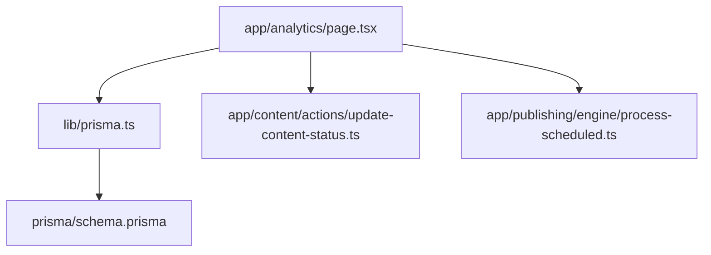
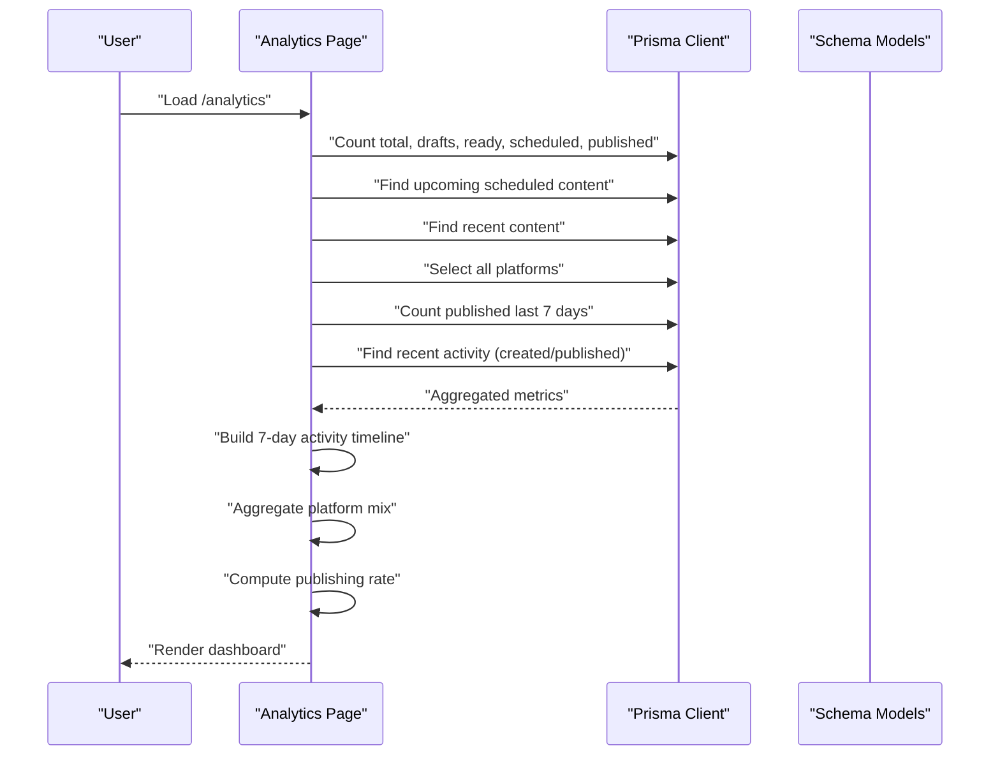
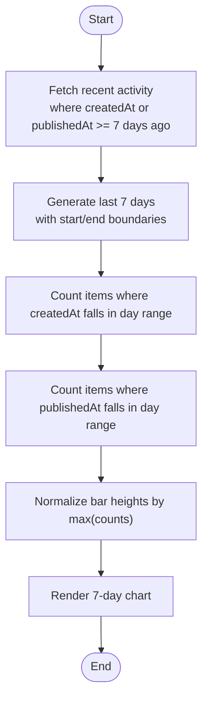
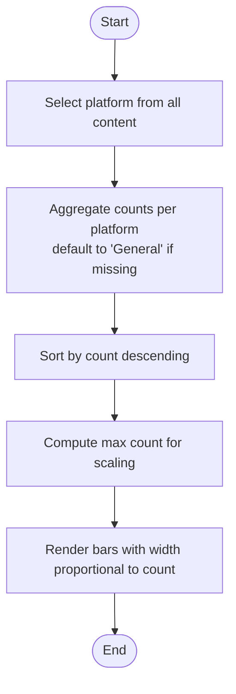
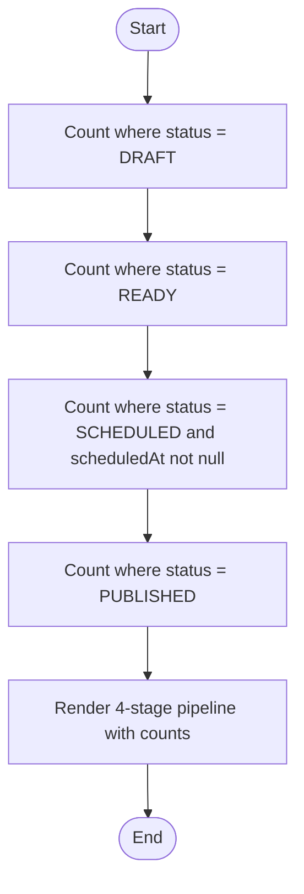
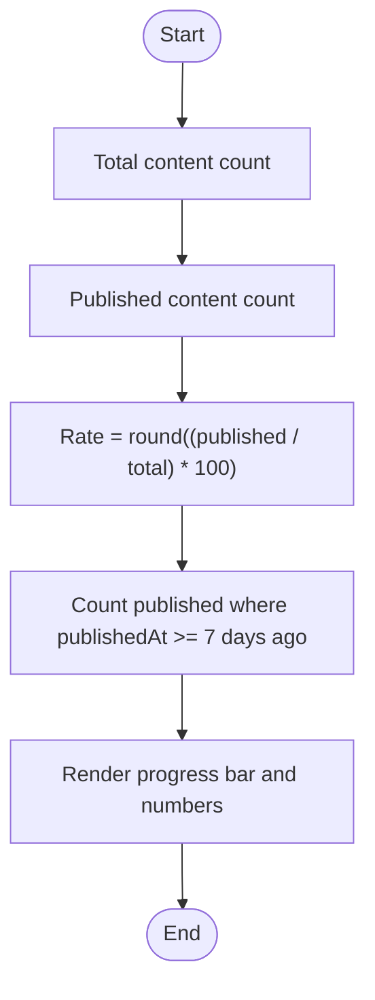
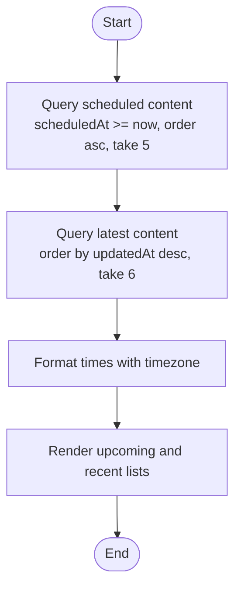
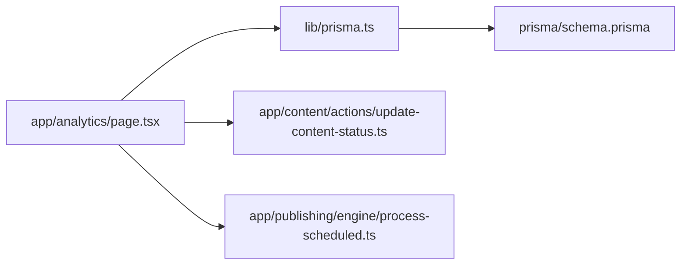

# Analytics Dashboard

<cite>
**Referenced Files in This Document**
- [page.tsx](file://app/analytics/page.tsx)
- [schema.prisma](file://prisma/schema.prisma)
- [prisma.ts](file://lib/prisma.ts)
- [update-content-status.ts](file://app/content/actions/update-content-status.ts)
- [process-scheduled.ts](file://app/publishing/engine/process-scheduled.ts)
</cite>

## Table of Contents
1. [Introduction](#introduction)
2. [Project Structure](#project-structure)
3. [Core Components](#core-components)
4. [Architecture Overview](#architecture-overview)
5. [Detailed Component Analysis](#detailed-component-analysis)
6. [Dependency Analysis](#dependency-analysis)
7. [Performance Considerations](#performance-considerations)
8. [Troubleshooting Guide](#troubleshooting-guide)
9. [Conclusion](#conclusion)

## Introduction
This document explains the Analytics Dashboard feature that provides a unified view of content performance, engagement signals, and cross-platform insights. It covers:
- Content activity charts showing creation and publication trends over the last 7 days
- Platform mix visualization displaying content distribution across platforms
- Publishing pipeline showing status progression from draft to published
- Publishing rate calculations and weekly published counts
- Data aggregation using Prisma queries for counting by status, calculating rates, and generating timelines
- Real-time data fetching, timezone-aware date/time formatting, and responsive rendering
- Performance considerations for large datasets and caching strategies

## Project Structure
The analytics dashboard is implemented as a server-rendered Next.js page that queries the database via Prisma and renders metrics directly into the UI. The data model includes Content, Idea, Media, PublishingChannel, and Publication entities.

**Diagram sources**
- [page.tsx:1-10](file://app/analytics/page.tsx#L1-L10)
- [prisma.ts:1-30](file://lib/prisma.ts#L1-L30)
- [schema.prisma:10-94](file://prisma/schema.prisma#L10-L94)
- [update-content-status.ts:1-58](file://app/content/actions/update-content-status.ts#L1-L58)
- [process-scheduled.ts:1-72](file://app/publishing/engine/process-scheduled.ts#L1-L72)

**Section sources**
- [page.tsx:1-639](file://app/analytics/page.tsx#L1-L639)
- [schema.prisma:10-94](file://prisma/schema.prisma#L10-L94)

## Core Components
- Content Activity Chart: Displays daily created vs published counts for the last 7 days using aggregated timeline data.
- Platform Mix: Shows distribution of content across platforms with percentages and bar visuals.
- Publishing Pipeline: Visualizes counts per status (Draft, Ready, Scheduled, Published).
- Publishing Rate: Percentage of total content that is published; also shows published count in the last 7 days.
- Upcoming Content: Lists scheduled posts sorted by scheduled time.
- Recent Content: Lists recently created or updated items with status badges.
- Ideas and Readiness Metrics: Counts ideas and combined ready + scheduled content.

These components are rendered server-side with Prisma queries and formatted dates/times using Intl.DateTimeFormat with a fixed timezone.

**Section sources**
- [page.tsx:37-127](file://app/analytics/page.tsx#L37-L127)
- [page.tsx:129-194](file://app/analytics/page.tsx#L129-L194)
- [page.tsx:196-241](file://app/analytics/page.tsx#L196-L241)
- [page.tsx:243-639](file://app/analytics/page.tsx#L243-L639)

## Architecture Overview
The dashboard follows a server-first architecture:
- The page component computes metrics by running multiple Prisma queries concurrently.
- It builds an activity timeline by filtering recent activity within day boundaries.
- It aggregates platform counts client-side after fetching minimal fields.
- It calculates publishing rate and weekly published counts.
- It renders responsive sections using Tailwind CSS classes.

**Diagram sources**
- [page.tsx:37-127](file://app/analytics/page.tsx#L37-L127)
- [page.tsx:129-194](file://app/analytics/page.tsx#L129-L194)
- [schema.prisma:21-37](file://prisma/schema.prisma#L21-L37)

## Detailed Component Analysis

### Content Activity Chart (Last 7 Days)
- Data source: Recent activity filtered by createdAt or publishedAt within the last 7 days.
- Aggregation: For each of the last 7 days, counts created and published events by comparing timestamps against day boundaries.
- Rendering: Bar chart with two bars per day (created vs published), heights normalized by the maximum count.

**Diagram sources**
- [page.tsx:106-127](file://app/analytics/page.tsx#L106-L127)
- [page.tsx:129-169](file://app/analytics/page.tsx#L129-L169)
- [page.tsx:324-371](file://app/analytics/page.tsx#L324-L371)

**Section sources**
- [page.tsx:106-169](file://app/analytics/page.tsx#L106-L169)
- [page.tsx:324-371](file://app/analytics/page.tsx#L324-L371)

### Platform Mix Visualization
- Data source: All content records selecting only the platform field.
- Aggregation: Map-based counting of platform values; empty or whitespace platforms default to "General".
- Rendering: Horizontal bars proportional to the maximum platform count; percentages relative to total content.

**Diagram sources**
- [page.tsx:100-104](file://app/analytics/page.tsx#L100-L104)
- [page.tsx:171-189](file://app/analytics/page.tsx#L171-L189)
- [page.tsx:385-424](file://app/analytics/page.tsx#L385-L424)

**Section sources**
- [page.tsx:100-104](file://app/analytics/page.tsx#L100-L104)
- [page.tsx:171-189](file://app/analytics/page.tsx#L171-L189)
- [page.tsx:385-424](file://app/analytics/page.tsx#L385-L424)

### Publishing Pipeline
- Stages: Draft, Ready, Scheduled (only when scheduledAt is set), Published.
- Data source: Separate counts per status via Prisma filters.
- Rendering: Four-stage grid with counts; final stage highlighted.

**Diagram sources**
- [page.tsx:58-75](file://app/analytics/page.tsx#L58-L75)
- [page.tsx:196-213](file://app/analytics/page.tsx#L196-L213)
- [page.tsx:427-456](file://app/analytics/page.tsx#L427-L456)

**Section sources**
- [page.tsx:58-75](file://app/analytics/page.tsx#L58-L75)
- [page.tsx:196-213](file://app/analytics/page.tsx#L196-L213)
- [page.tsx:427-456](file://app/analytics/page.tsx#L427-L456)

### Publishing Rate and Weekly Published
- Publishing rate: Percentage of total content that is published.
- Weekly published: Count of published content with publishedAt within the last 7 days.
- Rendering: Progress bar indicating percentage; numeric summary of published vs total.

**Diagram sources**
- [page.tsx:191-194](file://app/analytics/page.tsx#L191-L194)
- [page.tsx:106-113](file://app/analytics/page.tsx#L106-L113)
- [page.tsx:458-488](file://app/analytics/page.tsx#L458-L488)

**Section sources**
- [page.tsx:191-194](file://app/analytics/page.tsx#L191-L194)
- [page.tsx:106-113](file://app/analytics/page.tsx#L106-L113)
- [page.tsx:458-488](file://app/analytics/page.tsx#L458-L488)

### Upcoming and Recent Content
- Upcoming: Scheduled content with future scheduledAt, limited to top 5, ordered ascending by scheduledAt.
- Recent: Latest 6 content items ordered by updatedAt descending.
- Rendering: List items with title, platform, status badge, and formatted times/dates.

**Diagram sources**
- [page.tsx:79-98](file://app/analytics/page.tsx#L79-L98)
- [page.tsx:508-555](file://app/analytics/page.tsx#L508-L555)
- [page.tsx:558-613](file://app/analytics/page.tsx#L558-L613)

**Section sources**
- [page.tsx:79-98](file://app/analytics/page.tsx#L79-L98)
- [page.tsx:508-555](file://app/analytics/page.tsx#L508-L555)
- [page.tsx:558-613](file://app/analytics/page.tsx#L558-L613)

### Timezone-Aware Formatting
- Date/Time functions use Intl.DateTimeFormat with a fixed timezone to ensure consistent display regardless of server/client locale.
- Functions format full dates, times, and combined date-time strings for user-facing labels.

**Section sources**
- [page.tsx:8-35](file://app/analytics/page.tsx#L8-L35)

## Dependency Analysis
- Page depends on Prisma client configured with PostgreSQL adapter and connection pooling.
- Schema defines Content, Idea, Media, PublishingChannel, and Publication models used by the dashboard.
- Status updates and scheduling affect dashboard metrics through revalidation paths including /analytics.
- Publishing engine processes scheduled publications, indirectly influencing published counts and timeline.

**Diagram sources**
- [page.tsx:1-10](file://app/analytics/page.tsx#L1-L10)
- [prisma.ts:1-30](file://lib/prisma.ts#L1-L30)
- [schema.prisma:10-94](file://prisma/schema.prisma#L10-L94)
- [update-content-status.ts:1-58](file://app/content/actions/update-content-status.ts#L1-L58)
- [process-scheduled.ts:1-72](file://app/publishing/engine/process-scheduled.ts#L1-L72)

**Section sources**
- [prisma.ts:1-30](file://lib/prisma.ts#L1-L30)
- [schema.prisma:10-94](file://prisma/schema.prisma#L10-L94)
- [update-content-status.ts:1-58](file://app/content/actions/update-content-status.ts#L1-L58)
- [process-scheduled.ts:1-72](file://app/publishing/engine/process-scheduled.ts#L1-L72)

## Performance Considerations
- Concurrent Queries: The page uses Promise.all to run multiple Prisma queries in parallel, reducing latency for independent metrics.
- Minimal Field Selection: Platform mix selects only the platform field to minimize payload size.
- Pagination Limits: Upcoming and recent lists limit results (e.g., take 5 or 6) to avoid heavy DOM rendering.
- Indexing Opportunities: Ensure indexes exist on frequently filtered fields such as status, scheduledAt, publishedAt, and updatedAt to speed up counts and queries.
- Database Connection Pooling: Prisma adapter configures pool size and timeouts to handle concurrent requests efficiently.
- Server-Side Rendering: Metrics are computed at request time; consider caching strategies for high-traffic scenarios.

[No sources needed since this section provides general guidance]

## Troubleshooting Guide
- Missing DATABASE_URL: Prisma initialization throws an error if the environment variable is not set.
- Invalid Status Updates: Attempting to update published content or schedule without a date/time raises errors; ensure validations are respected.
- Revalidation Paths: After status changes, the page is revalidated along with related routes to reflect updated metrics.
- Scheduler Behavior: The scheduler processes queued publications due at or before current time; failures are logged and recorded.

**Section sources**
- [prisma.ts:8-12](file://lib/prisma.ts#L8-L12)
- [update-content-status.ts:6-38](file://app/content/actions/update-content-status.ts#L6-L38)
- [update-content-status.ts:40-55](file://app/content/actions/update-content-status.ts#L40-L55)
- [process-scheduled.ts:4-27](file://app/publishing/engine/process-scheduled.ts#L4-L27)
- [process-scheduled.ts:35-65](file://app/publishing/engine/process-scheduled.ts#L35-L65)

## Conclusion
The Analytics Dashboard provides a comprehensive, server-rendered view of content performance and workflow health. It leverages Prisma for efficient data aggregation, supports timezone-aware formatting, and presents responsive visualizations for activity, platform mix, pipeline, and publishing rate. For large datasets, consider indexing key fields and introducing caching layers to reduce query load while maintaining real-time accuracy.

[No sources needed since this section summarizes without analyzing specific files]