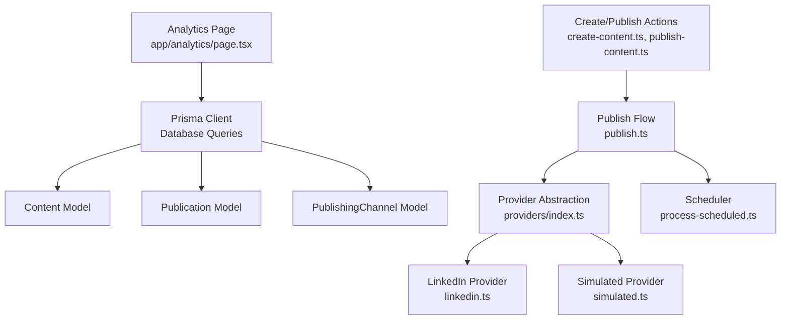
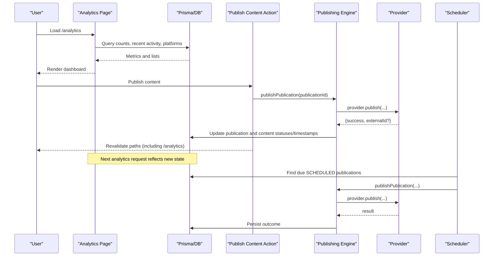
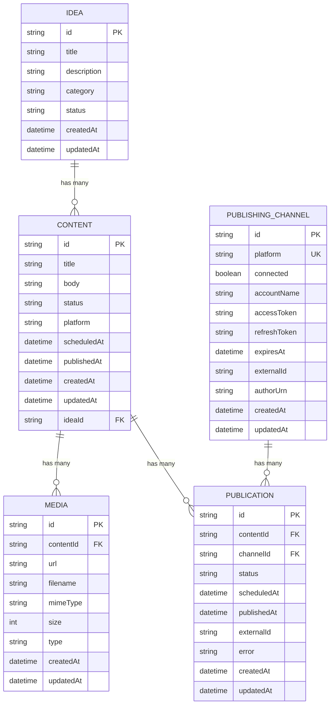
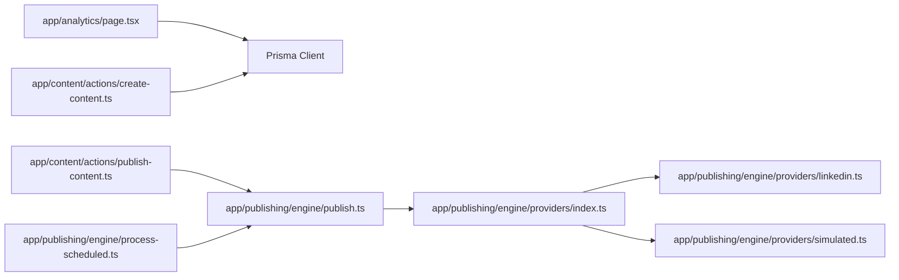

# Analytics and Reporting

<cite>
**Referenced Files in This Document**
- [app/analytics/page.tsx](file://app/analytics/page.tsx)
- [app/custom-analytics/page.tsx](file://app/custom-analytics/page.tsx)
- [prisma/schema.prisma](file://prisma/schema.prisma)
- [app/content/actions/create-content.ts](file://app/content/actions/create-content.ts)
- [app/content/actions/publish-content.ts](file://app/content/actions/publish-content.ts)
- [app/publishing/engine/process-scheduled.ts](file://app/publishing/engine/process-scheduled.ts)
- [app/publishing/engine/publish.ts](file://app/publishing/engine/publish.ts)
- [app/publishing/engine/types.ts](file://app/publishing/engine/types.ts)
- [app/publishing/engine/providers/index.ts](file://app/publishing/engine/providers/index.ts)
- [app/publishing/engine/providers/linkedin.ts](file://app/publishing/engine/providers/linkedin.ts)
- [app/publishing/engine/providers/simulated.ts](file://app/publishing/engine/providers/simulated.ts)
</cite>

## Table of Contents
1. [Introduction](#introduction)
2. [Project Structure](#project-structure)
3. [Core Components](#core-components)
4. [Architecture Overview](#architecture-overview)
5. [Detailed Component Analysis](#detailed-component-analysis)
6. [Dependency Analysis](#dependency-analysis)
7. [Performance Considerations](#performance-considerations)
8. [Troubleshooting Guide](#troubleshooting-guide)
9. [Conclusion](#conclusion)
10. [Appendices](#appendices)

## Introduction
This document explains the Analytics and Reporting features of the application. It covers:
- The analytics dashboard that shows performance metrics, engagement tracking signals, and cross-platform insights derived from content and publishing data.
- Custom analytics capabilities (currently under construction).
- Data collection methods, metric calculations, and reporting formats used by the analytics page.
- Integration with platform APIs for publishing and how publication outcomes feed back into analytics.
- Examples of analytics queries, report generation, and data export approaches.
- Data privacy considerations, caching strategies, and performance optimization for large datasets.
- The relationship between analytics data and published content entities.

## Project Structure
The analytics feature is implemented as a server-rendered Next.js page that queries the database via Prisma to compute metrics and render charts and summaries. Publishing flows update content and publication records, which are then reflected in analytics.

**Diagram sources**
- [app/analytics/page.tsx:37-127](file://app/analytics/page.tsx#L37-L127)
- [prisma/schema.prisma:21-93](file://prisma/schema.prisma#L21-L93)
- [app/publishing/engine/publish.ts:4-115](file://app/publishing/engine/publish.ts#L4-L115)
- [app/publishing/engine/providers/index.ts:5-20](file://app/publishing/engine/providers/index.ts#L5-L20)
- [app/publishing/engine/providers/linkedin.ts:141-283](file://app/publishing/engine/providers/linkedin.ts#L141-L283)
- [app/publishing/engine/providers/simulated.ts:8-32](file://app/publishing/engine/providers/simulated.ts#L8-L32)
- [app/publishing/engine/process-scheduled.ts:4-71](file://app/publishing/engine/process-scheduled.ts#L4-L71)
- [app/content/actions/create-content.ts:12-25](file://app/content/actions/create-content.ts#L12-L25)
- [app/content/actions/publish-content.ts:7-69](file://app/content/actions/publish-content.ts#L7-L69)

**Section sources**
- [app/analytics/page.tsx:37-127](file://app/analytics/page.tsx#L37-L127)
- [prisma/schema.prisma:21-93](file://prisma/schema.prisma#L21-L93)

## Core Components
- Analytics Dashboard Page: Computes and renders workspace intelligence including total counts by status, recent activity over 7 days, platform mix, publishing pipeline, publishing rate, upcoming and recent content, and ideas captured.
- Publishing Engine: Orchestrates publishing through providers (LinkedIn or simulated), updates statuses and timestamps, and revalidates relevant pages so analytics reflect changes immediately.
- Scheduler: Processes scheduled publications at their scheduled time and invokes the publishing engine.
- Data Models: Content, Publication, PublishingChannel, Media, Idea define the schema used by analytics and publishing.

Key responsibilities:
- Analytics Page: Aggregates counts, computes percentages, builds weekly activity series, and calculates platform distribution.
- Publishing Engine: Validates state, calls provider, handles success/failure, and persists results.
- Scheduler: Finds due publications and publishes them in batches.

**Section sources**
- [app/analytics/page.tsx:37-194](file://app/analytics/page.tsx#L37-L194)
- [app/publishing/engine/publish.ts:4-115](file://app/publishing/engine/publish.ts#L4-L115)
- [app/publishing/engine/process-scheduled.ts:4-71](file://app/publishing/engine/process-scheduled.ts#L4-L71)
- [prisma/schema.prisma:21-93](file://prisma/schema.prisma#L21-L93)

## Architecture Overview
The analytics system reads directly from the application database to compute metrics. Publishing events update content and publication records, which the analytics page reflects on next load. Platform integrations are abstracted behind a provider interface.

**Diagram sources**
- [app/analytics/page.tsx:37-127](file://app/analytics/page.tsx#L37-L127)
- [app/content/actions/publish-content.ts:7-69](file://app/content/actions/publish-content.ts#L7-L69)
- [app/publishing/engine/publish.ts:4-115](file://app/publishing/engine/publish.ts#L4-L115)
- [app/publishing/engine/providers/index.ts:5-20](file://app/publishing/engine/providers/index.ts#L5-L20)
- [app/publishing/engine/process-scheduled.ts:4-71](file://app/publishing/engine/process-scheduled.ts#L4-L71)

## Detailed Component Analysis

### Analytics Dashboard
- Performance metrics:
  - Total content, drafts, ready, scheduled, published counts.
  - Publishing rate percentage computed from published vs total.
  - Published last 7 days count.
- Engagement tracking signals:
  - Weekly activity chart showing created vs published per day for the last 7 days.
  - Platform mix showing where content is being created across platforms.
- Cross-platform insights:
  - Platform distribution aggregated from all content items.
  - Upcoming content list with scheduled times.
  - Recent content list with last updated timestamps and status badges.
- Ideas captured:
  - Count of ideas available for future content.

Data collection and calculation details:
- Counts use Prisma filters on Content.status and timestamps.
- Weekly activity uses createdAt and publishedAt within rolling 7-day windows.
- Platform mix aggregates Content.platform values, normalizing empty values to a default label.
- Publishing rate is rounded percentage; edge case handled when total is zero.

Reporting formats:
- UI components render bar charts and progress bars based on computed values.
- Lists show upcoming/recent content with formatted dates and times.

Example analytics queries (described):
- Count by status: filter Content by status values such as DRAFT, READY, SCHEDULED, PUBLISHED.
- Recent activity: select createdAt and publishedAt for items created or published in the last 7 days.
- Platform mix: select platform field across all content and aggregate counts client-side.
- Upcoming content: find scheduled items with future scheduledAt ordered ascending.

**Section sources**
- [app/analytics/page.tsx:37-194](file://app/analytics/page.tsx#L37-L194)
- [app/analytics/page.tsx:129-184](file://app/analytics/page.tsx#L129-L184)
- [app/analytics/page.tsx:191-194](file://app/analytics/page.tsx#L191-L194)

### Custom Analytics
- Placeholder page indicating the feature is under construction.
- Future scope may include user-defined reports, custom visualizations, and advanced filtering.

**Section sources**
- [app/custom-analytics/page.tsx:3-14](file://app/custom-analytics/page.tsx#L3-L14)

### Publishing Engine and Providers
- Publishing flow validates content and channel state, invokes the appropriate provider, and updates statuses and timestamps atomically.
- Providers:
  - LinkedIn: authenticates using stored access token, uploads images if present, creates posts, captures external IDs from headers.
  - Simulated: logs inputs and returns success with synthetic external ID.
- Scheduler:
  - Finds due SCHEDULED publications and processes them in batches.

Integration points:
- Provider selection by platform name.
- External API calls to LinkedIn endpoints for image upload and post creation.
- Error handling propagates failures back to publication records.

**Section sources**
- [app/publishing/engine/publish.ts:4-115](file://app/publishing/engine/publish.ts#L4-L115)
- [app/publishing/engine/providers/index.ts:5-20](file://app/publishing/engine/providers/index.ts#L5-L20)
- [app/publishing/engine/providers/linkedin.ts:141-283](file://app/publishing/engine/providers/linkedin.ts#L141-L283)
- [app/publishing/engine/providers/simulated.ts:8-32](file://app/publishing/engine/providers/simulated.ts#L8-L32)
- [app/publishing/engine/process-scheduled.ts:4-71](file://app/publishing/engine/process-scheduled.ts#L4-L71)
- [app/publishing/engine/types.ts:1-36](file://app/publishing/engine/types.ts#L1-L36)

### Data Collection Methods and Metric Calculations
- Data sources:
  - Content model fields: title, body, status, platform, scheduledAt, publishedAt, timestamps.
  - Publication model fields: status, scheduledAt, publishedAt, externalId, error.
  - PublishingChannel model fields: platform, connected, accountName, tokens, URN.
- Metric calculations:
  - Publishing rate = (publishedCount / totalContent) * 100, with zero-division guard.
  - Weekly activity: bin counts by day using createdAt and publishedAt ranges.
  - Platform mix: group by platform string, normalize empty values, sort descending by count.
- Reporting formats:
  - Numeric KPIs, bar charts, progress bars, and tabular lists rendered server-side.

**Section sources**
- [prisma/schema.prisma:21-93](file://prisma/schema.prisma#L21-L93)
- [app/analytics/page.tsx:129-194](file://app/analytics/page.tsx#L129-L194)

### Relationship Between Analytics Data and Published Content Entities
- Content status transitions (e.g., READY to PUBLISHED) and timestamps drive analytics metrics.
- Publication records track per-channel publishing outcomes and external IDs, enabling cross-platform insights.
- Media associations allow linking assets to content for richer reporting.

**Diagram sources**
- [prisma/schema.prisma:10-93](file://prisma/schema.prisma#L10-L93)

## Dependency Analysis
- Analytics Page depends on Prisma to query Content and related models.
- Publishing actions depend on the publishing engine and providers.
- Providers depend on environment configuration and external APIs (LinkedIn).
- Scheduler depends on Prisma and the publishing engine.

**Diagram sources**
- [app/analytics/page.tsx:37-127](file://app/analytics/page.tsx#L37-L127)
- [app/content/actions/create-content.ts:12-25](file://app/content/actions/create-content.ts#L12-L25)
- [app/content/actions/publish-content.ts:7-69](file://app/content/actions/publish-content.ts#L7-L69)
- [app/publishing/engine/publish.ts:4-115](file://app/publishing/engine/publish.ts#L4-L115)
- [app/publishing/engine/providers/index.ts:5-20](file://app/publishing/engine/providers/index.ts#L5-L20)
- [app/publishing/engine/providers/linkedin.ts:141-283](file://app/publishing/engine/providers/linkedin.ts#L141-L283)
- [app/publishing/engine/providers/simulated.ts:8-32](file://app/publishing/engine/providers/simulated.ts#L8-L32)
- [app/publishing/engine/process-scheduled.ts:4-71](file://app/publishing/engine/process-scheduled.ts#L4-L71)

**Section sources**
- [app/analytics/page.tsx:37-127](file://app/analytics/page.tsx#L37-L127)
- [app/publishing/engine/publish.ts:4-115](file://app/publishing/engine/publish.ts#L4-L115)
- [app/publishing/engine/providers/index.ts:5-20](file://app/publishing/engine/providers/index.ts#L5-L20)

## Performance Considerations
- Server-side rendering: The analytics page fetches data on the server, reducing client-side processing overhead.
- Batched queries: Uses Promise.all to parallelize multiple Prisma queries for counts and lists.
- Time-bounded activity window: Limits recent activity to the last 7 days to control dataset size.
- In-memory aggregation: Platform mix aggregation occurs in memory; consider database-level grouping for very large datasets.
- Revalidation strategy: Publishing actions revalidate specific paths to ensure analytics reflect latest state without full cache invalidation.
- Provider efficiency: LinkedIn provider minimizes network calls by batching media upload and post creation steps; errors are logged and persisted.

Recommendations for large datasets:
- Add database indexes on frequently filtered fields (status, createdAt, publishedAt, platform).
- Implement server-side pagination for lists and charts.
- Introduce materialized views or summary tables for high-frequency metrics (e.g., daily counts).
- Cache computed dashboards with short TTLs if needed, ensuring consistency after publishing actions.

[No sources needed since this section provides general guidance]

## Troubleshooting Guide
Common issues and resolutions:
- Publishing fails due to missing or expired credentials:
  - Ensure the publishing channel has a valid access token and not expired.
  - Reconnect the platform if token expiration is detected.
- No queued publication available:
  - Verify that at least one publication exists in QUEUED or SCHEDULED state before publishing.
- Content validation errors:
  - Ensure content has a title and body before publishing.
  - Only READY content can be published.
- Scheduler not processing:
  - Confirm scheduler runs periodically and finds due SCHEDULED publications.
  - Check logs for errors during provider calls.

Operational notes:
- Errors are recorded in Publication.error and propagated to callers.
- Successful publishes update both Publication and Content statuses and timestamps atomically.

**Section sources**
- [app/publishing/engine/providers/linkedin.ts:149-180](file://app/publishing/engine/providers/linkedin.ts#L149-L180)
- [app/content/actions/publish-content.ts:19-55](file://app/content/actions/publish-content.ts#L19-L55)
- [app/publishing/engine/publish.ts:23-44](file://app/publishing/engine/publish.ts#L23-L44)
- [app/publishing/engine/process-scheduled.ts:11-27](file://app/publishing/engine/process-scheduled.ts#L11-L27)

## Conclusion
The analytics feature provides a comprehensive view of content workflow performance, engagement signals, and cross-platform insights by querying content and publication data. Publishing flows integrate with platform APIs through a provider abstraction, updating analytics-relevant states consistently. While custom analytics is currently under construction, the existing dashboard offers actionable metrics and clear pathways for extending reporting capabilities. For scale, consider indexing, pagination, and precomputed summaries to optimize performance.

[No sources needed since this section summarizes without analyzing specific files]

## Appendices

### Example Analytics Queries (Descriptive)
- Total counts by status: Filter Content by status values to compute totals for Draft, Ready, Scheduled, Published.
- Recent activity: Select items with createdAt or publishedAt within the last 7 days to build daily bins.
- Platform mix: Aggregate Content.platform across all items to compute distribution percentages.
- Upcoming content: Retrieve scheduled items with future scheduledAt, ordered by earliest first.

**Section sources**
- [app/analytics/page.tsx:55-127](file://app/analytics/page.tsx#L55-L127)

### Report Generation and Data Export
- Current implementation focuses on UI-based reporting; no explicit CSV/JSON export endpoints are present.
- To add exports:
  - Create server routes that query the same datasets used by the analytics page.
  - Serialize results to CSV or JSON and stream responses with appropriate headers.
  - Apply the same filters and aggregations to ensure consistency with the dashboard.

[No sources needed since this section proposes extensions not present in code]

### Data Privacy Considerations
- Credentials and tokens are stored in PublishingChannel; ensure secure storage and limited access.
- Avoid logging sensitive data (tokens, URNs); only log identifiers and non-sensitive metadata.
- Restrict analytics endpoints to authenticated users and enforce authorization checks.

**Section sources**
- [prisma/schema.prisma:57-73](file://prisma/schema.prisma#L57-L73)
- [app/publishing/engine/providers/linkedin.ts:149-180](file://app/publishing/engine/providers/linkedin.ts#L149-L180)

### Caching Strategies
- Next.js revalidation: Publishing actions revalidate specific paths to refresh analytics without full cache busting.
- Potential enhancements:
  - Use server-side caching with short TTLs for expensive aggregations.
  - Invalidate caches on content mutations to keep analytics fresh.

**Section sources**
- [app/content/actions/publish-content.ts:61-66](file://app/content/actions/publish-content.ts#L61-L66)