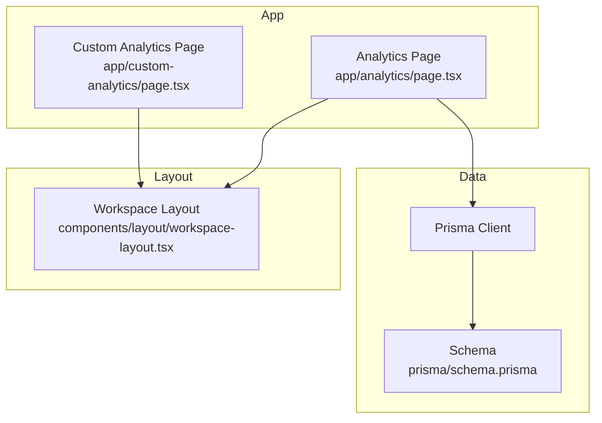
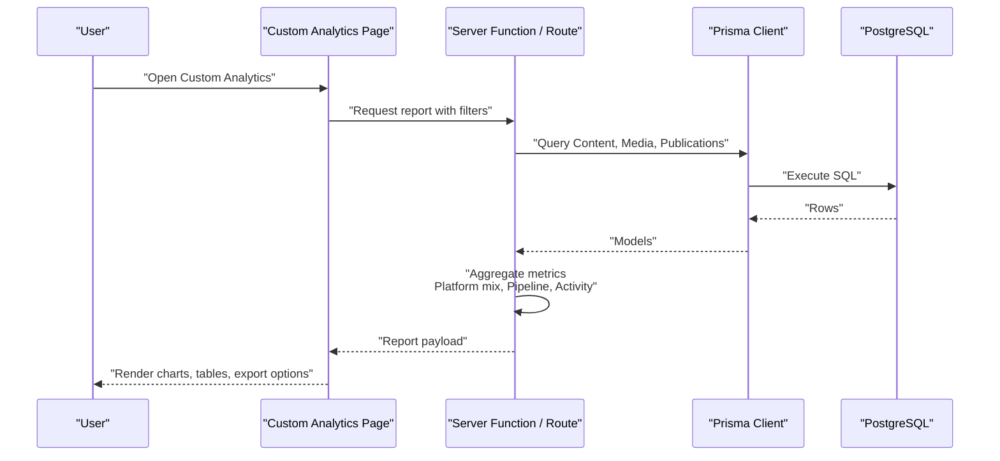
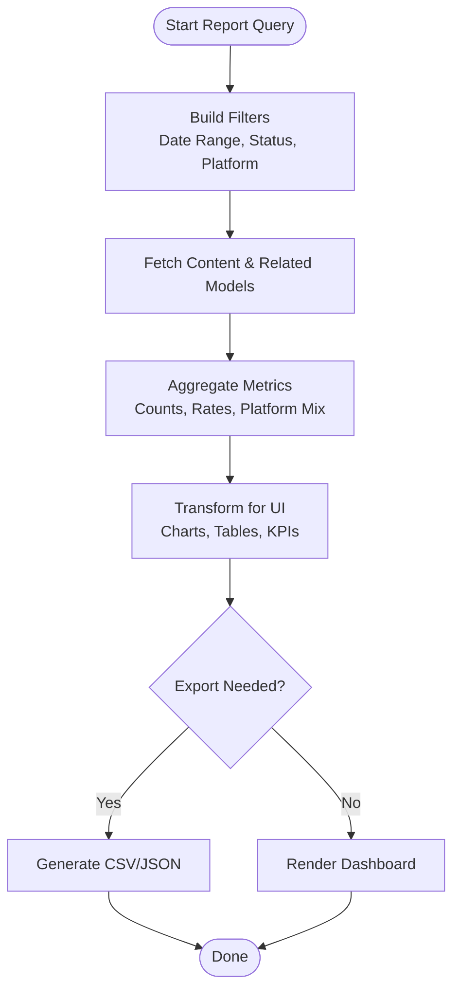
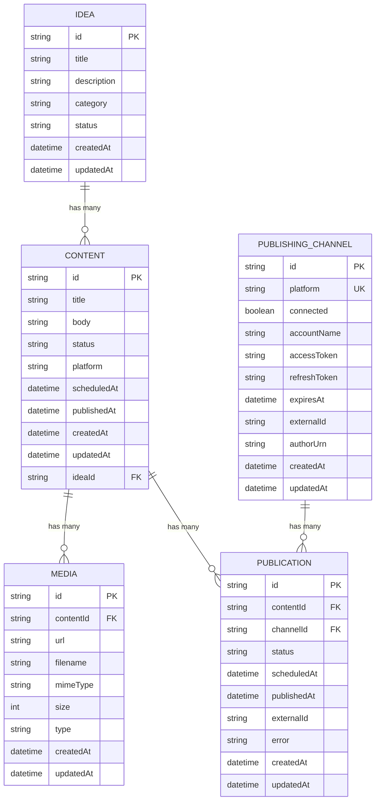
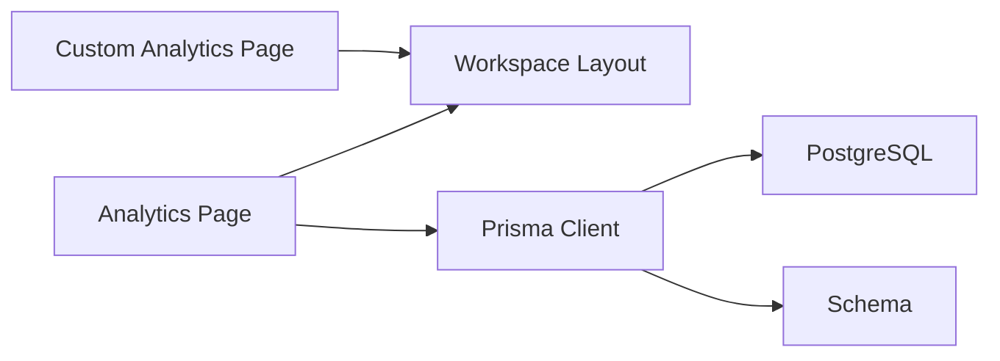

# Custom Analytics

<cite>
**Referenced Files in This Document**
- [page.tsx](file://app/custom-analytics/page.tsx)
- [page.tsx](file://app/analytics/page.tsx)
- [workspace-layout.tsx](file://components/layout/workspace-layout.tsx)
- [schema.prisma](file://prisma/schema.prisma)
- [README.md](file://README.md)
</cite>

## Table of Contents
1. [Introduction](#introduction)
2. [Project Structure](#project-structure)
3. [Core Components](#core-components)
4. [Architecture Overview](#architecture-overview)
5. [Detailed Component Analysis](#detailed-component-analysis)
6. [Dependency Analysis](#dependency-analysis)
7. [Performance Considerations](#performance-considerations)
8. [Troubleshooting Guide](#troubleshooting-guide)
9. [Conclusion](#conclusion)
10. [Appendices](#appendices)

## Introduction
This document explains the Custom Analytics feature and how it extends the existing analytics capabilities to support customizable reporting, metric selection, date range filtering, platform-specific analysis, content type segmentation, query construction, data transformation, and export. It also provides common use cases, privacy considerations, and performance guidance for building robust custom queries.

The current codebase includes:
- A placeholder page for Custom Analytics that reserves the route and navigation state.
- A fully implemented Analytics page that demonstrates data retrieval, aggregation, and visualization patterns you can reuse when implementing the full Custom Analytics experience.

## Project Structure
Custom Analytics is integrated into the workspace layout and will share the same navigation context as other features. The Analytics page shows a working example of server-side data fetching and client-side rendering for charts and metrics.

**Diagram sources**
- [page.tsx:1-15](file://app/custom-analytics/page.tsx#L1-L15)
- [page.tsx:1-639](file://app/analytics/page.tsx#L1-L639)
- [workspace-layout.tsx:1-41](file://components/layout/workspace-layout.tsx#L1-L41)
- [schema.prisma:1-94](file://prisma/schema.prisma#L1-L94)

**Section sources**
- [page.tsx:1-15](file://app/custom-analytics/page.tsx#L1-L15)
- [workspace-layout.tsx:1-41](file://components/layout/workspace-layout.tsx#L1-L41)

## Core Components
- Custom Analytics page: Reserves the route and integrates with the workspace layout. It currently displays a placeholder indicating the feature is under construction.
- Analytics page: Demonstrates server-side data fetching using Prisma, time-based aggregations, platform distribution, publishing pipeline counts, and recent/upcoming content lists. These patterns are foundational for building the Custom Analytics report builder.

Key responsibilities:
- Data retrieval: Uses Prisma to count and fetch content by status, scheduled/published timestamps, and platform.
- Aggregation: Computes weekly activity, platform mix, publishing rate, and pipeline stage counts.
- Rendering: Displays KPIs, bar charts, progress bars, and lists for upcoming/recent content.

**Section sources**
- [page.tsx:37-127](file://app/analytics/page.tsx#L37-L127)
- [page.tsx:129-194](file://app/analytics/page.tsx#L129-L194)
- [page.tsx:196-241](file://app/analytics/page.tsx#L196-L241)
- [page.tsx:243-639](file://app/analytics/page.tsx#L243-L639)

## Architecture Overview
The Custom Analytics feature will build on top of the existing Analytics implementation. The architecture combines:
- Server-side data access via Prisma (PostgreSQL).
- Time-windowed queries for date range filtering.
- In-memory aggregation for platform segmentation and pipeline metrics.
- UI components for interactive filters, charting, and export.

**Diagram sources**
- [page.tsx:37-127](file://app/analytics/page.tsx#L37-L127)
- [schema.prisma:21-37](file://prisma/schema.prisma#L21-L37)

## Detailed Component Analysis

### Custom Analytics Page
- Purpose: Placeholder route for the future report builder.
- Integration: Uses WorkspaceLayout with activeItem set to custom-analytics.
- Next steps: Replace placeholder with a report builder UI that composes filters, metrics, visualizations, and exports.

**Section sources**
- [page.tsx:1-15](file://app/custom-analytics/page.tsx#L1-L15)
- [workspace-layout.tsx:1-41](file://components/layout/workspace-layout.tsx#L1-L41)

### Analytics Page Patterns (Foundation for Custom Analytics)
- Date range filtering: Uses computed dates and Prisma where clauses to filter by createdAt and publishedAt within a 7-day window.
- Platform-specific analysis: Aggregates content by platform field, normalizes empty values, and sorts by frequency.
- Publishing pipeline: Counts content by status (Draft, Ready, Scheduled, Published).
- Recent/Upcoming content: Lists items ordered by updatedAt or scheduledAt with limits.

These patterns directly inform the Custom Analytics report builder’s core capabilities:
- Metric selection: Count by status, group by platform, compute publishing rate.
- Date range filtering: Reuse time-window logic for custom ranges.
- Platform segmentation: Group by platform with normalization.
- Content type segmentation: Extend grouping by additional fields if added later (e.g., category from Idea).

**Diagram sources**
- [page.tsx:37-127](file://app/analytics/page.tsx#L37-L127)
- [page.tsx:129-194](file://app/analytics/page.tsx#L129-L194)
- [page.tsx:196-241](file://app/analytics/page.tsx#L196-L241)

**Section sources**
- [page.tsx:37-127](file://app/analytics/page.tsx#L37-L127)
- [page.tsx:129-194](file://app/analytics/page.tsx#L129-L194)
- [page.tsx:196-241](file://app/analytics/page.tsx#L196-L241)

### Data Model and Relationships
The schema defines the entities used for analytics:
- Content: Central entity with status, platform, scheduledAt, publishedAt, timestamps.
- Idea: Optional source linked to Content; could enable content type segmentation by category.
- Media: Attached to Content; useful for media-type analysis.
- PublishingChannel and Publication: Track per-channel publication lifecycle and outcomes.

**Diagram sources**
- [schema.prisma:10-94](file://prisma/schema.prisma#L10-L94)

**Section sources**
- [schema.prisma:10-94](file://prisma/schema.prisma#L10-L94)

## Dependency Analysis
- Custom Analytics depends on WorkspaceLayout for consistent navigation and layout.
- Analytics relies on Prisma client configured to PostgreSQL.
- Schema-driven relationships ensure accurate joins and constraints for analytics queries.

**Diagram sources**
- [page.tsx:1-15](file://app/custom-analytics/page.tsx#L1-L15)
- [page.tsx:1-639](file://app/analytics/page.tsx#L1-L639)
- [workspace-layout.tsx:1-41](file://components/layout/workspace-layout.tsx#L1-L41)
- [schema.prisma:1-94](file://prisma/schema.prisma#L1-L94)

**Section sources**
- [workspace-layout.tsx:1-41](file://components/layout/workspace-layout.tsx#L1-L41)
- [schema.prisma:1-94](file://prisma/schema.prisma#L1-L94)

## Performance Considerations
- Use targeted selects and filters: Only request needed fields and apply where clauses at the database level to reduce payload size.
- Limit result sets: Apply take/skip for lists and avoid loading entire datasets into memory.
- Precompute aggregates: For heavy dashboards, consider materialized views or scheduled jobs to pre-aggregate metrics like daily activity and platform mix.
- Indexing: Ensure indexes on frequently filtered columns such as status, scheduledAt, publishedAt, and platform to speed up queries.
- Caching: Cache stable aggregates (e.g., total counts) for short periods to reduce repeated queries during dashboard renders.
- Avoid N+1 queries: Use Prisma relations and include/select to minimize round-trips.

[No sources needed since this section provides general guidance]

## Troubleshooting Guide
Common issues and resolutions:
- Empty platform data: Normalize empty or whitespace-only platform values to a default label before aggregation to avoid misleading distributions.
- Incorrect date ranges: Ensure timezone handling is consistent when computing windows and formatting labels.
- Large datasets causing slow renders: Add pagination or virtualization for long lists and limit initial loads.
- Missing related data: Verify relations between Content, Media, and Publication are correctly queried and included.

**Section sources**
- [page.tsx:171-184](file://app/analytics/page.tsx#L171-L184)
- [page.tsx:129-161](file://app/analytics/page.tsx#L129-L161)

## Conclusion
The Custom Analytics feature will extend the existing Analytics page’s proven patterns into a flexible report builder. By leveraging Prisma for efficient querying, applying robust aggregation logic, and designing UI components for filters and exports, users will be able to create personalized reports and visualizations tailored to their needs. The foundation is already in place; the next step is to implement the interactive report builder and export capabilities while maintaining performance and privacy standards.

[No sources needed since this section summarizes without analyzing specific files]

## Appendices

### Common Custom Analytics Use Cases
- Track content performance by platform:
  - Filter by platform, select metrics (counts, publishing rate), visualize platform mix and trends over time.
- Analyze publishing frequency patterns:
  - Use date range filters to compute daily/weekly counts, identify peaks and gaps, and compare against targets.
- Measure content lifecycle efficiency:
  - Segment by status and time-in-stage metrics (e.g., draft-to-publish duration), highlight bottlenecks.

[No sources needed since this section provides conceptual examples]

### Privacy and Security Considerations
- Minimize sensitive data exposure: Only expose necessary fields in reports and exports.
- Access controls: Restrict analytics to authorized users and enforce row-level security if multi-tenant.
- Audit logs: Record who accessed or exported sensitive analytics data.
- Secure configuration: Keep database credentials and secrets out of version control; use environment variables.

[No sources needed since this section provides general guidance]

### Export Capabilities
- Supported formats: CSV, JSON, PDF (for static snapshots).
- Data scope: Allow users to choose metrics, date ranges, platforms, and content types to include.
- File naming: Include timestamp and filter summary for traceability.
- Rate limiting: Protect backend from abuse by limiting export frequency and size.

[No sources needed since this section provides general guidance]