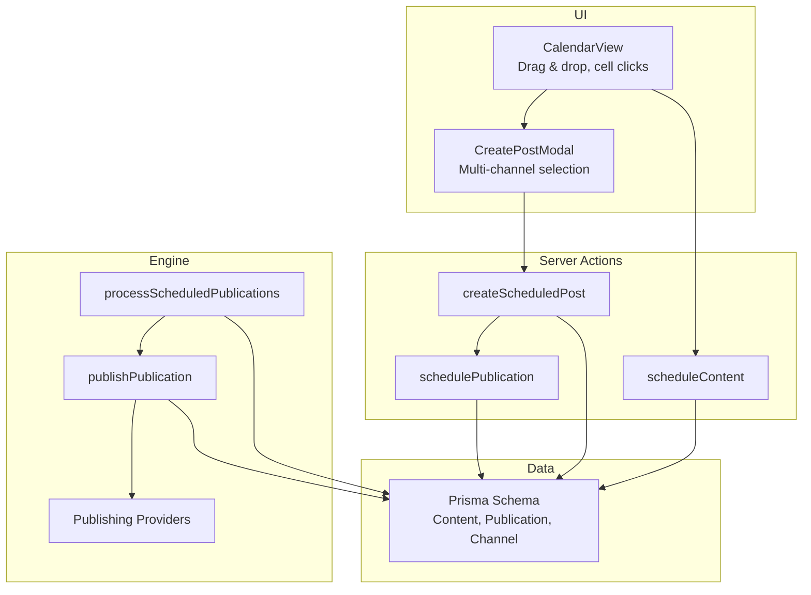
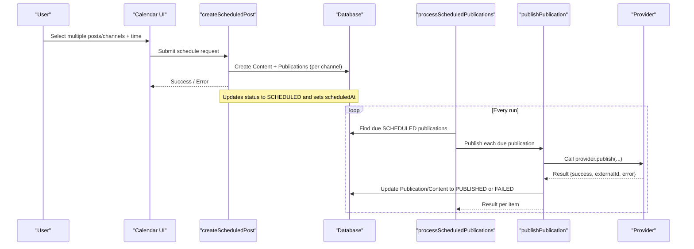
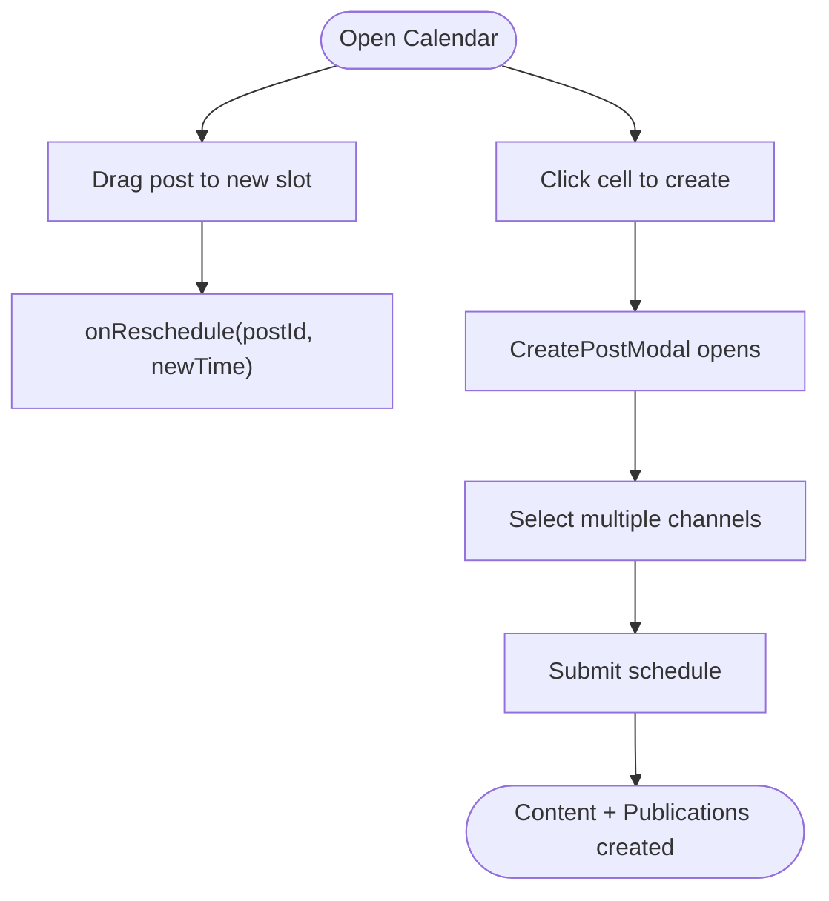
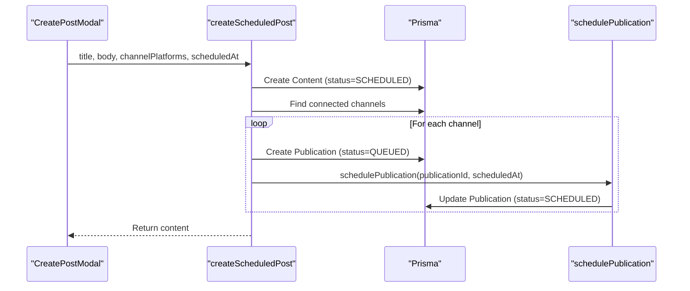
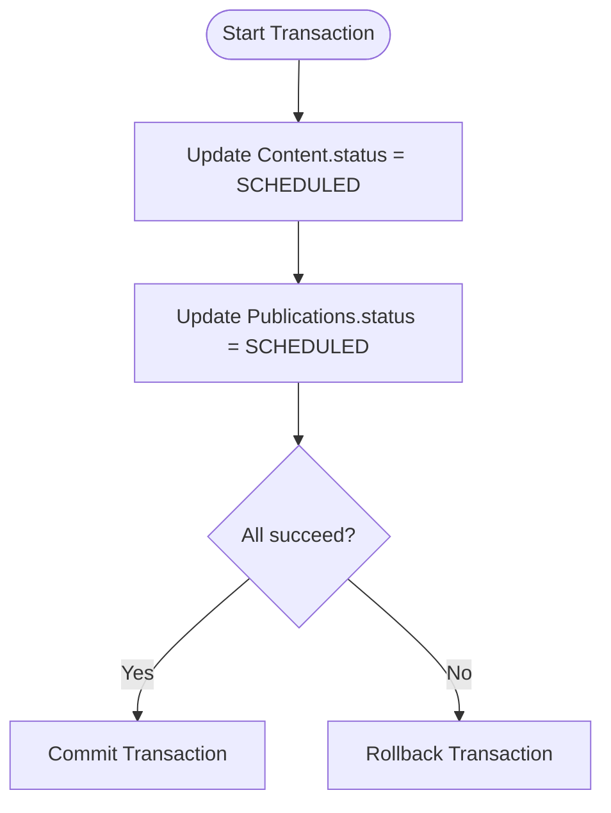
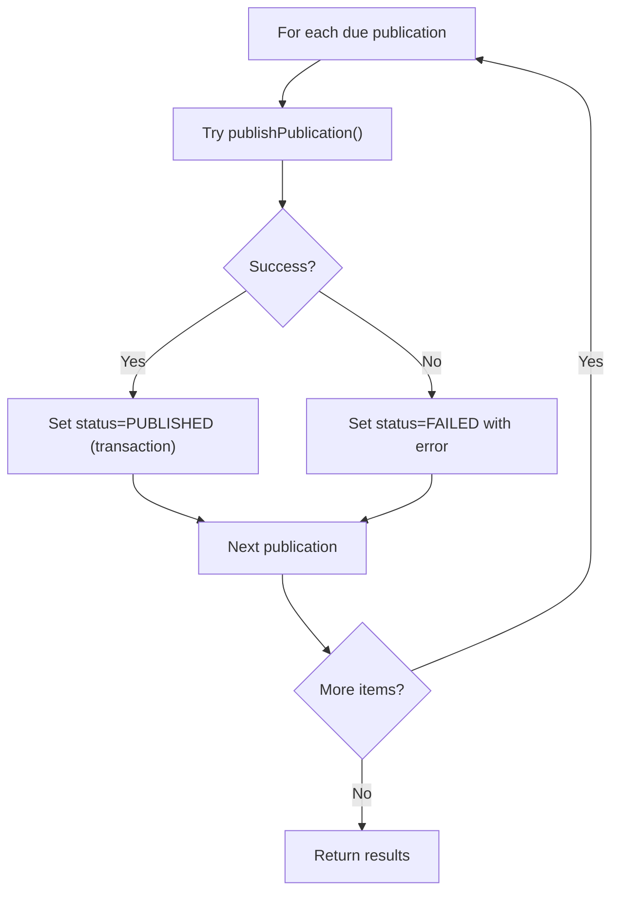
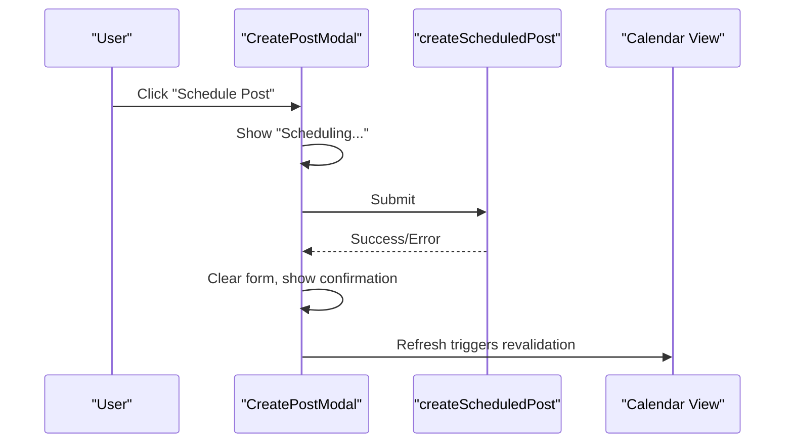
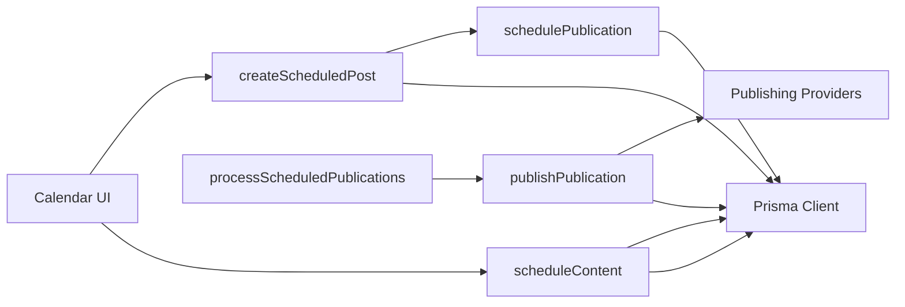
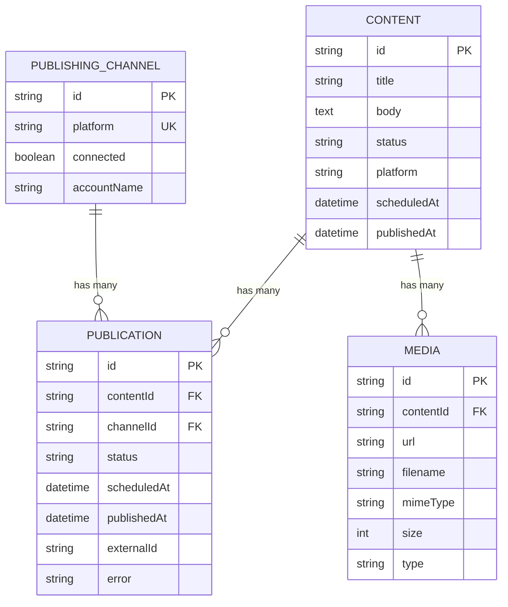

# Batch Scheduling Operations

<cite>
**Referenced Files in This Document**
- [create-scheduled-post.ts](file://app/calendar/actions/create-scheduled-post.ts)
- [schedule-content.ts](file://app/content/actions/schedule-content.ts)
- [schedule-publication.ts](file://app/publishing/actions/schedule-publication.ts)
- [process-scheduled.ts](file://app/publishing/engine/process-scheduled.ts)
- [publish.ts](file://app/publishing/engine/publish.ts)
- [types.ts](file://app/publishing/engine/types.ts)
- [index.ts](file://app/publishing/engine/providers/index.ts)
- [calendar-view.tsx](file://components/calendar/calendar-view.tsx)
- [create-post-modal.tsx](file://components/calendar/create-post-modal.tsx)
- [schema.prisma](file://prisma/schema.prisma)
</cite>

## Table of Contents
1. [Introduction](#introduction)
2. [Project Structure](#project-structure)
3. [Core Components](#core-components)
4. [Architecture Overview](#architecture-overview)
5. [Detailed Component Analysis](#detailed-component-analysis)
6. [Dependency Analysis](#dependency-analysis)
7. [Performance Considerations](#performance-considerations)
8. [Troubleshooting Guide](#troubleshooting-guide)
9. [Conclusion](#conclusion)
10. [Appendices](#appendices)

## Introduction
This document explains how batch scheduling operations work in the application, focusing on:
- Selecting multiple posts for scheduling
- The bulk scheduling interface and user interactions
- Progress tracking and feedback during large batches
- Backend processing with transactional updates, error handling for partial failures, and rollback behavior
- Common workflows such as weekly planning, holiday scheduling, and campaign launches
- Performance considerations for large batches

The system supports scheduling content to one or more publishing channels, queuing publications, and later processing them at scheduled times.

## Project Structure
Batch scheduling spans UI components, server actions, and a background-style scheduler that processes due publications. Key areas include:
- Calendar UI for creating and rescheduling posts
- Server actions to create and schedule content/publications
- Publishing engine to process queued/scheduled items
- Data model defining Content, Publication, and PublishingChannel

**Diagram sources**
- [calendar-view.tsx:153-178](file://components/calendar/calendar-view.tsx#L153-L178)
- [create-post-modal.tsx:201-242](file://components/calendar/create-post-modal.tsx#L201-L242)
- [create-scheduled-post.ts:15-66](file://app/calendar/actions/create-scheduled-post.ts#L15-L66)
- [schedule-content.ts:6-65](file://app/content/actions/schedule-content.ts#L6-L65)
- [schedule-publication.ts:6-51](file://app/publishing/actions/schedule-publication.ts#L6-L51)
- [process-scheduled.ts:4-71](file://app/publishing/engine/process-scheduled.ts#L4-L71)
- [publish.ts:4-115](file://app/publishing/engine/publish.ts#L4-L115)
- [schema.prisma:21-93](file://prisma/schema.prisma#L21-L93)

**Section sources**
- [calendar-view.tsx:1-308](file://components/calendar/calendar-view.tsx#L1-L308)
- [create-post-modal.tsx:1-559](file://components/calendar/create-post-modal.tsx#L1-L559)
- [create-scheduled-post.ts:1-67](file://app/calendar/actions/create-scheduled-post.ts#L1-L67)
- [schedule-content.ts:1-66](file://app/content/actions/schedule-content.ts#L1-L66)
- [schedule-publication.ts:1-52](file://app/publishing/actions/schedule-publication.ts#L1-L52)
- [process-scheduled.ts:1-72](file://app/publishing/engine/process-scheduled.ts#L1-L72)
- [publish.ts:1-116](file://app/publishing/engine/publish.ts#L1-L116)
- [schema.prisma:1-94](file://prisma/schema.prisma#L1-L94)

## Core Components
- Multi-channel scheduling entry point: creates a Content record and corresponding Publications for each connected channel, then schedules each publication.
- Single-content rescheduling: updates Content and related Publications atomically using a database transaction.
- Scheduler loop: finds due SCHEDULED publications and publishes them individually with per-item error handling.
- Provider abstraction: dispatches to platform-specific providers (e.g., LinkedIn, simulated).

Key responsibilities:
- Input validation and state checks before scheduling
- Transactional consistency when updating Content and Publication records
- Isolation of per-publication errors so one failure does not block others
- Revalidation of relevant routes after updates

**Section sources**
- [create-scheduled-post.ts:15-66](file://app/calendar/actions/create-scheduled-post.ts#L15-L66)
- [schedule-content.ts:6-65](file://app/content/actions/schedule-content.ts#L6-L65)
- [schedule-publication.ts:6-51](file://app/publishing/actions/schedule-publication.ts#L6-L51)
- [process-scheduled.ts:4-71](file://app/publishing/engine/process-scheduled.ts#L4-L71)
- [publish.ts:4-115](file://app/publishing/engine/publish.ts#L4-L115)
- [index.ts:1-21](file://app/publishing/engine/providers/index.ts#L1-L21)

## Architecture Overview
The batch scheduling flow consists of:
- User selects multiple posts/channels in the calendar UI
- Server action(s) persist scheduling metadata and queue publications
- A periodic process picks due items and publishes them via provider implementations
- Errors are captured per item; successful items transition to published state

**Diagram sources**
- [create-scheduled-post.ts:15-66](file://app/calendar/actions/create-scheduled-post.ts#L15-L66)
- [schedule-publication.ts:6-51](file://app/publishing/actions/schedule-publication.ts#L6-L51)
- [process-scheduled.ts:4-71](file://app/publishing/engine/process-scheduled.ts#L4-L71)
- [publish.ts:4-115](file://app/publishing/engine/publish.ts#L4-L115)
- [index.ts:1-21](file://app/publishing/engine/providers/index.ts#L1-L21)

## Detailed Component Analysis

### Selection Mechanism for Multiple Posts
- Calendar view supports drag-and-drop rescheduling and click-to-create flows. It groups posts by day/hour and allows users to interact with individual items.
- The modal enables selecting multiple channels for a single post, enabling multi-platform scheduling from one creation step.

**Diagram sources**
- [calendar-view.tsx:153-178](file://components/calendar/calendar-view.tsx#L153-L178)
- [create-post-modal.tsx:201-242](file://components/calendar/create-post-modal.tsx#L201-L242)

**Section sources**
- [calendar-view.tsx:153-178](file://components/calendar/calendar-view.tsx#L153-L178)
- [create-post-modal.tsx:201-242](file://components/calendar/create-post-modal.tsx#L201-L242)

### Bulk Scheduling Interface
- The landing page includes a visual representation of bulk operations (selecting multiple posts and performing “Reschedule All” or “Bulk Publish”). While this is a demo visualization, it illustrates the intended UX pattern for batch actions.
- In practice, users can:
  - Create a single post and select multiple channels (multi-platform scheduling)
  - Use the calendar to drag-and-drop multiple posts to reschedule them across days/hours
  - Trigger per-item scheduling via server actions

**Section sources**
- [landing-client.tsx:40-796](file://components/landing-client.tsx#L40-L796)
- [calendar-view.tsx:153-178](file://components/calendar/calendar-view.tsx#L153-L178)

### Backend Processing of Batch Operations
- Creating a scheduled post:
  - Creates a Content record with status SCHEDULED and scheduledAt
  - Finds all connected channels for selected platforms
  - Creates a Publication per channel with status QUEUED and scheduledAt
  - Calls schedulePublication for each to set status to SCHEDULED
- Rescheduling existing content:
  - Validates date and current status
  - Uses a database transaction to update Content and all related Publications atomically
- Scheduling a publication directly:
  - Validates date and status
  - Updates Publication to SCHEDULED and clears prior errors

**Diagram sources**
- [create-scheduled-post.ts:15-66](file://app/calendar/actions/create-scheduled-post.ts#L15-L66)
- [schedule-publication.ts:6-51](file://app/publishing/actions/schedule-publication.ts#L6-L51)

**Section sources**
- [create-scheduled-post.ts:15-66](file://app/calendar/actions/create-scheduled-post.ts#L15-L66)
- [schedule-content.ts:6-65](file://app/content/actions/schedule-content.ts#L6-L65)
- [schedule-publication.ts:6-51](file://app/publishing/actions/schedule-publication.ts#L6-L51)

### Transaction Management and Rollback Behavior
- Atomic updates:
  - Rescheduling content uses a Prisma transaction to update both Content and its Publications together, ensuring consistent state.
  - Successful publishing uses a transaction to mark Publication and Content as PUBLISHED and clear scheduling fields.
- Rollbacks:
  - If any operation within a transaction fails, Prisma rolls back all changes in that transaction, preventing partial updates.
- Per-item isolation:
  - The scheduler processes due publications in a loop with try/catch around each publish call, so one failure does not stop others.

**Diagram sources**
- [schedule-content.ts:35-57](file://app/content/actions/schedule-content.ts#L35-L57)
- [publish.ts:88-112](file://app/publishing/engine/publish.ts#L88-L112)

**Section sources**
- [schedule-content.ts:35-57](file://app/content/actions/schedule-content.ts#L35-L57)
- [publish.ts:88-112](file://app/publishing/engine/publish.ts#L88-L112)

### Error Handling for Partial Failures
- Scheduler:
  - Iterates due publications and wraps each publish attempt in try/catch
  - Records success/failure per item and continues processing remaining items
- Publisher:
  - On provider failure, marks Publication as FAILED with an error message
  - On success, transitions to PUBLISHED within a transaction

**Diagram sources**
- [process-scheduled.ts:33-71](file://app/publishing/engine/process-scheduled.ts#L33-L71)
- [publish.ts:72-115](file://app/publishing/engine/publish.ts#L72-L115)

**Section sources**
- [process-scheduled.ts:33-71](file://app/publishing/engine/process-scheduled.ts#L33-L71)
- [publish.ts:72-115](file://app/publishing/engine/publish.ts#L72-L115)

### Progress Tracking and User Feedback
- UI states:
  - Modal shows loading states while saving or scheduling
  - Calendar supports drag-and-drop with visual feedback for target cells
- Backend progress:
  - The scheduler returns aggregated results per batch run including counts and per-item outcomes
- Real-time updates:
  - Server actions revalidate paths to refresh UI state after changes

**Diagram sources**
- [create-post-modal.tsx:201-242](file://components/calendar/create-post-modal.tsx#L201-L242)
- [create-scheduled-post.ts:59-66](file://app/calendar/actions/create-scheduled-post.ts#L59-L66)

**Section sources**
- [create-post-modal.tsx:201-242](file://components/calendar/create-post-modal.tsx#L201-L242)
- [process-scheduled.ts:67-71](file://app/publishing/engine/process-scheduled.ts#L67-L71)

### Common Batch Workflows
- Weekly content planning:
  - Create multiple posts in the calendar and assign different days/times
  - Optionally select multiple channels per post for cross-platform distribution
- Holiday scheduling:
  - Pre-plan posts for upcoming holidays by setting future scheduledAt values
  - Ensure channels are connected; scheduler will pick them up when due
- Campaign launches:
  - Prepare a set of posts and schedule them to go live simultaneously or staggered
  - Monitor scheduler logs/results to confirm successful publishing

[No sources needed since this section provides conceptual guidance]

## Dependency Analysis
- UI depends on server actions for persistence and scheduling
- Server actions depend on Prisma client and publishing actions
- Engine depends on providers for actual publishing
- Data model defines relationships between Content, Publication, and PublishingChannel

**Diagram sources**
- [create-scheduled-post.ts:15-66](file://app/calendar/actions/create-scheduled-post.ts#L15-L66)
- [schedule-content.ts:6-65](file://app/content/actions/schedule-content.ts#L6-L65)
- [schedule-publication.ts:6-51](file://app/publishing/actions/schedule-publication.ts#L6-L51)
- [process-scheduled.ts:4-71](file://app/publishing/engine/process-scheduled.ts#L4-L71)
- [publish.ts:4-115](file://app/publishing/engine/publish.ts#L4-L115)
- [index.ts:1-21](file://app/publishing/engine/providers/index.ts#L1-L21)

**Section sources**
- [create-scheduled-post.ts:15-66](file://app/calendar/actions/create-scheduled-post.ts#L15-L66)
- [schedule-content.ts:6-65](file://app/content/actions/schedule-content.ts#L6-L65)
- [schedule-publication.ts:6-51](file://app/publishing/actions/schedule-publication.ts#L6-L51)
- [process-scheduled.ts:4-71](file://app/publishing/engine/process-scheduled.ts#L4-L71)
- [publish.ts:4-115](file://app/publishing/engine/publish.ts#L4-L115)
- [index.ts:1-21](file://app/publishing/engine/providers/index.ts#L1-L21)

## Performance Considerations
- Batch size limits:
  - The scheduler fetches a limited number of due publications per run (e.g., take 10), which helps avoid overwhelming the system and external APIs
- Concurrency:
  - Each publication is processed sequentially within a run; consider parallelization if throughput needs increase, with rate limiting per provider
- Database transactions:
  - Keep transactions small and focused to reduce lock contention
- External API constraints:
  - Respect provider rate limits and implement retries/backoff where appropriate
- UI responsiveness:
  - Debounce heavy operations and provide immediate feedback to users

[No sources needed since this section provides general guidance]

## Troubleshooting Guide
Common issues and resolutions:
- No platform selected:
  - Ensure at least one channel is selected before scheduling
- No connected channels found:
  - Connect required channels in the publishing settings before scheduling
- Invalid scheduled date:
  - Dates must be valid and in the future
- Content already published:
  - Published content cannot be rescheduled; create a new draft instead
- Publication not found or already published:
  - Verify the publication exists and is not already published
- Provider not configured:
  - Ensure a provider is registered for the platform

**Section sources**
- [create-scheduled-post.ts:21-44](file://app/calendar/actions/create-scheduled-post.ts#L21-L44)
- [schedule-content.ts:10-33](file://app/content/actions/schedule-content.ts#L10-L33)
- [schedule-publication.ts:10-32](file://app/publishing/actions/schedule-publication.ts#L10-L32)
- [publish.ts:23-44](file://app/publishing/engine/publish.ts#L23-L44)
- [index.ts:10-20](file://app/publishing/engine/providers/index.ts#L10-L20)

## Conclusion
The system supports flexible scheduling for single or multiple channels, with robust backend processing that ensures data consistency through transactions and isolates failures per publication. The UI provides intuitive controls for creating and rescheduling content, while the scheduler handles due items efficiently. For large batches, consider tuning batch sizes, concurrency, and provider rate limits to maintain performance and reliability.

[No sources needed since this section summarizes without analyzing specific files]

## Appendices

### Data Model Overview

**Diagram sources**
- [schema.prisma:21-93](file://prisma/schema.prisma#L21-L93)