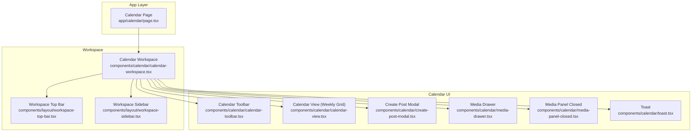
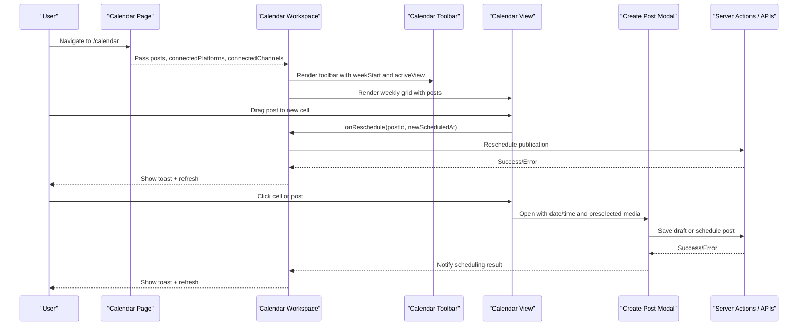
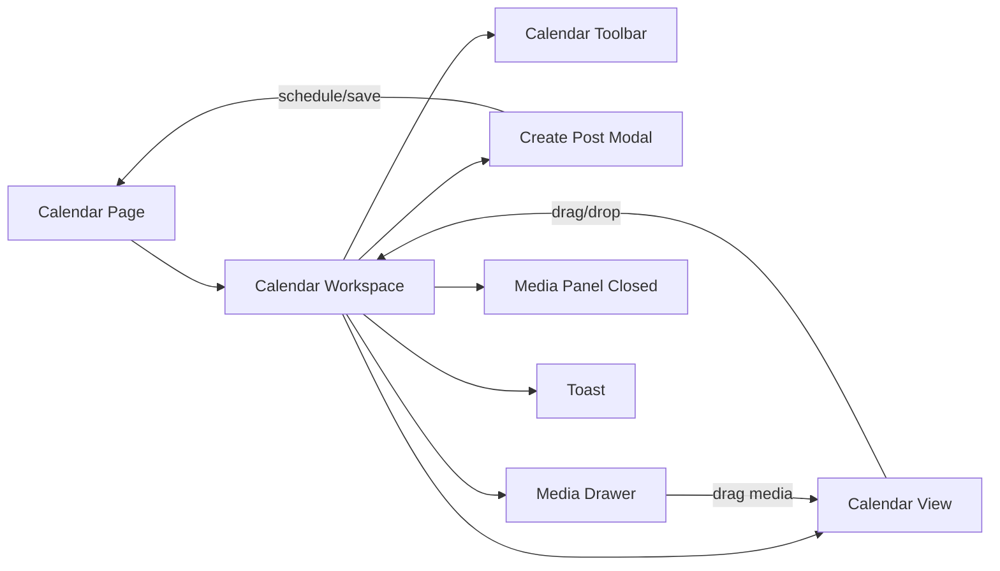

# Calendar Interface and Views

<cite>
**Referenced Files in This Document**
- [page.tsx](file://app/calendar/page.tsx)
- [calendar-workspace.tsx](file://components/calendar/calendar-workspace.tsx)
- [calendar-view.tsx](file://components/calendar/calendar-view.tsx)
- [calendar-toolbar.tsx](file://components/calendar/calendar-toolbar.tsx)
- [create-post-modal.tsx](file://components/calendar/create-post-modal.tsx)
- [media-drawer.tsx](file://components/calendar/media-drawer.tsx)
- [media-panel-closed.tsx](file://components/calendar/media-panel-closed.tsx)
- [toast.tsx](file://components/calendar/toast.tsx)
- [workspace-layout.tsx](file://components/layout/workspace-layout.tsx)
- [workspace-sidebar.tsx](file://components/layout/workspace-sidebar.tsx)
- [workspace-top-bar.tsx](file://components/layout/workspace-top-bar.tsx)
</cite>

## Table of Contents
1. [Introduction](#introduction)
2. [Project Structure](#project-structure)
3. [Core Components](#core-components)
4. [Architecture Overview](#architecture-overview)
5. [Detailed Component Analysis](#detailed-component-analysis)
6. [Dependency Analysis](#dependency-analysis)
7. [Performance Considerations](#performance-considerations)
8. [Troubleshooting Guide](#troubleshooting-guide)
9. [Conclusion](#conclusion)

## Introduction
This document explains the calendar interface components that power a weekly scheduling view for social content. It covers how the workspace layout hosts the calendar, how the toolbar provides navigation and controls, how events are rendered with platform indicators and media attachments, and how users interact with the calendar to create, schedule, and reschedule posts. It also includes guidance on configuration options, styling customization, accessibility considerations, and performance optimization for large datasets and smooth scrolling.

## Project Structure
The calendar feature is implemented as a Next.js page that loads server-side data and renders a client-side workspace containing:
- A sidebar and top bar for global navigation and actions
- A toolbar for week navigation and view selection
- A weekly calendar grid that renders scheduled posts
- Modals and drawers for creating posts and managing media
- Toast notifications for user feedback

**Diagram sources**
- [page.tsx:1-80](file://app/calendar/page.tsx#L1-L80)
- [calendar-workspace.tsx:1-329](file://components/calendar/calendar-workspace.tsx#L1-L329)
- [calendar-toolbar.tsx:1-116](file://components/calendar/calendar-toolbar.tsx#L1-L116)
- [calendar-view.tsx:1-308](file://components/calendar/calendar-view.tsx#L1-L308)
- [create-post-modal.tsx:1-559](file://components/calendar/create-post-modal.tsx#L1-L559)
- [media-drawer.tsx:1-167](file://components/calendar/media-drawer.tsx#L1-L167)
- [media-panel-closed.tsx:1-88](file://components/calendar/media-panel-closed.tsx#L1-L88)
- [toast.tsx:1-59](file://components/calendar/toast.tsx#L1-L59)
- [workspace-top-bar.tsx:1-92](file://components/layout/workspace-top-bar.tsx#L1-L92)
- [workspace-sidebar.tsx:1-166](file://components/layout/workspace-sidebar.tsx#L1-L166)

**Section sources**
- [page.tsx:1-80](file://app/calendar/page.tsx#L1-L80)
- [calendar-workspace.tsx:1-329](file://components/calendar/calendar-workspace.tsx#L1-L329)

## Core Components
- Calendar Page: Loads scheduled publications and connected channels from the database and passes them to the workspace.
- Calendar Workspace: Orchestrates state for navigation, media panel visibility, post creation, and interactions; composes all UI pieces.
- Calendar Toolbar: Provides week navigation (previous/next/today), date range display, timezone hint, and view toggles (week/month/list).
- Calendar View: Renders a weekly grid with hour rows, day columns, current time indicator, drag-and-drop rescheduling, and event cards with platform indicators and times.
- Create Post Modal: Allows composing content, selecting platforms/channels, attaching media, scheduling date/time, and saving or scheduling posts.
- Media Drawer: Displays uploaded media thumbnails, supports dragging items into calendar cells, and links to media management.
- Media Panel Closed: Compact left panel for quick uploads and AI ideas when the drawer is closed.
- Toast: Non-blocking notifications for success, error, and info messages.
- Workspace Layout/Sidebar/Top Bar: Global shell providing navigation, profile/channel indicators, and upload actions.

**Section sources**
- [page.tsx:1-80](file://app/calendar/page.tsx#L1-L80)
- [calendar-workspace.tsx:1-329](file://components/calendar/calendar-workspace.tsx#L1-L329)
- [calendar-toolbar.tsx:1-116](file://components/calendar/calendar-toolbar.tsx#L1-L116)
- [calendar-view.tsx:1-308](file://components/calendar/calendar-view.tsx#L1-L308)
- [create-post-modal.tsx:1-559](file://components/calendar/create-post-modal.tsx#L1-L559)
- [media-drawer.tsx:1-167](file://components/calendar/media-drawer.tsx#L1-L167)
- [media-panel-closed.tsx:1-88](file://components/calendar/media-panel-closed.tsx#L1-L88)
- [toast.tsx:1-59](file://components/calendar/toast.tsx#L1-L59)
- [workspace-top-bar.tsx:1-92](file://components/layout/workspace-top-bar.tsx#L1-L92)
- [workspace-sidebar.tsx:1-166](file://components/layout/workspace-sidebar.tsx#L1-L166)

## Architecture Overview
The calendar follows a parent-child component model with clear separation of concerns:
- Data loading occurs on the server page and is passed down to the client workspace.
- The workspace manages local UI state and delegates rendering to focused components.
- Interactions like drag-and-drop and modal flows are handled locally within their components and propagate via callbacks.

**Diagram sources**
- [page.tsx:1-80](file://app/calendar/page.tsx#L1-L80)
- [calendar-workspace.tsx:1-329](file://components/calendar/calendar-workspace.tsx#L1-L329)
- [calendar-toolbar.tsx:1-116](file://components/calendar/calendar-toolbar.tsx#L1-L116)
- [calendar-view.tsx:1-308](file://components/calendar/calendar-view.tsx#L1-L308)
- [create-post-modal.tsx:1-559](file://components/calendar/create-post-modal.tsx#L1-L559)

## Detailed Component Analysis

### Calendar Page
- Loads scheduled publications and connected channels in parallel.
- Maps database records into a simplified posts structure including title, body, platform, account name, scheduled time, and media.
- Passes data to the workspace component.

Key responsibilities:
- Server-side data fetching and transformation
- Passing typed props to client components

**Section sources**
- [page.tsx:1-80](file://app/calendar/page.tsx#L1-L80)

### Calendar Workspace
- Manages week navigation (previous/next/today), active view state, media drawer visibility, and post creation modal state.
- Handles cell clicks to open the create modal with pre-filled date/time.
- Handles post clicks to edit/reschedule with existing media.
- Coordinates drag-and-drop of media from the drawer into calendar cells.
- Integrates file uploads via hidden input and media panel drop zone.
- Shows toast notifications and triggers router refresh after mutations.

Responsibilities:
- Central state holder for calendar UX
- Orchestration of child components and side effects

**Section sources**
- [calendar-workspace.tsx:1-329](file://components/calendar/calendar-workspace.tsx#L1-L329)

### Calendar Toolbar
- Displays the current week’s date range and timezone.
- Provides previous/next week buttons and a “Today” button.
- Offers view toggles (week/month/list) even though only the week view is currently implemented.

Responsibilities:
- Navigation controls
- Displaying contextual information (date range, timezone)

**Section sources**
- [calendar-toolbar.tsx:1-116](file://components/calendar/calendar-toolbar.tsx#L1-L116)

### Calendar View (Weekly Grid)
- Renders a 7-day column grid with 24 hour rows.
- Groups posts by day and hour using a Map keyed by date-hour for efficient lookup.
- Highlights today’s column and shows a moving current-time indicator line.
- Supports:
  - Clicking a cell to create a new post at that time
  - Clicking a post card to edit/reschedule it
  - Dragging a post to another cell to reschedule
  - Dropping external media (from the media drawer) onto a cell to attach it to a new post
- Event cards show:
  - Platform indicator dot and label
  - Title preview
  - Scheduled time

Accessibility and responsiveness:
- Uses native HTML draggable attributes for posts and media items.
- Keyboard support for Escape to close overlays is provided in modals/drawers.
- The grid uses a minimum width to ensure readability; responsive behavior can be enhanced with breakpoints if needed.

Performance considerations:
- Memoization of derived data (week days, today, postsByCell, timeIndicator) reduces re-renders.
- Efficient grouping via Map avoids repeated scans during render.

**Section sources**
- [calendar-view.tsx:1-308](file://components/calendar/calendar-view.tsx#L1-L308)

### Create Post Modal
- Allows composing content with a simple editor and formatting toolbar placeholders.
- Supports selecting one or more connected platforms/channels.
- Integrates media insertion via a media picker modal and direct file uploads.
- Schedules posts with date/time inputs and displays the detected timezone.
- Saves drafts or schedules posts, then notifies the workspace to refresh and show a toast.

Responsibilities:
- Content composition and validation
- Media attachment and preview
- Scheduling workflow and error handling

**Section sources**
- [create-post-modal.tsx:1-559](file://components/calendar/create-post-modal.tsx#L1-L559)

### Media Drawer
- Fetches and displays media thumbnails.
- Supports dragging media items into calendar cells to associate them with a new post.
- Provides a link to manage media in the content area.

Responsibilities:
- Media browsing and selection
- Drag source for media association

**Section sources**
- [media-drawer.tsx:1-167](file://components/calendar/media-drawer.tsx#L1-L167)

### Media Panel Closed
- Compact panel shown when the drawer is closed.
- Provides quick access to AI ideas and drag-and-drop upload area.

Responsibilities:
- Quick actions and upload entry point

**Section sources**
- [media-panel-closed.tsx:1-88](file://components/calendar/media-panel-closed.tsx#L1-L88)

### Toast
- Auto-dismissing notification component with success/error/info variants.
- Positioned fixed at bottom-right with accessible dismiss action.

Responsibilities:
- User feedback for asynchronous operations

**Section sources**
- [toast.tsx:1-59](file://components/calendar/toast.tsx#L1-L59)

### Workspace Shell (Sidebar and Top Bar)
- Sidebar: Collapsible navigation with icons and labels for different sections.
- Top Bar: Upload media button, Dropbox integration placeholder, channel avatars, and trial CTA.

Responsibilities:
- Global navigation and context display
- Cross-feature actions (upload, connect profiles)

**Section sources**
- [workspace-sidebar.tsx:1-166](file://components/layout/workspace-sidebar.tsx#L1-L166)
- [workspace-top-bar.tsx:1-92](file://components/layout/workspace-top-bar.tsx#L1-L92)
- [workspace-layout.tsx:1-41](file://components/layout/workspace-layout.tsx#L1-L41)

## Dependency Analysis
- Data flow: Server page fetches data -> Calendar Workspace receives props -> Calendar View renders events -> User interactions trigger server actions or API calls -> Workspace updates UI and refreshes.
- Coupling: Calendar View depends on workspace callbacks for interactions; workspace coordinates modal and drawer states.
- External integrations: Media upload endpoints and publishing channel connections are referenced through API routes and server actions.

**Diagram sources**
- [page.tsx:1-80](file://app/calendar/page.tsx#L1-L80)
- [calendar-workspace.tsx:1-329](file://components/calendar/calendar-workspace.tsx#L1-L329)
- [calendar-view.tsx:1-308](file://components/calendar/calendar-view.tsx#L1-L308)
- [create-post-modal.tsx:1-559](file://components/calendar/create-post-modal.tsx#L1-L559)
- [media-drawer.tsx:1-167](file://components/calendar/media-drawer.tsx#L1-L167)

**Section sources**
- [calendar-workspace.tsx:1-329](file://components/calendar/calendar-workspace.tsx#L1-L329)
- [calendar-view.tsx:1-308](file://components/calendar/calendar-view.tsx#L1-L308)

## Performance Considerations
- Memoization: Use memoized computations for derived data such as week days, today detection, posts grouped by cell, and current time indicator to minimize recalculations on every render.
- Efficient lookups: Group posts by date-hour keys using a Map to achieve O(1) retrieval per cell.
- Scroll behavior: Automatically scroll to the current hour on week change to improve usability; consider debouncing frequent updates to avoid jank.
- Rendering optimization: Keep event cards lightweight; avoid heavy image decoding in tight loops by lazy-loading images where possible.
- Large datasets: For many posts per hour, consider virtualization or pagination within the calendar grid to maintain smooth scrolling.
- Network requests: Batch or debounce media list fetches; cache results where appropriate to reduce redundant API calls.

[No sources needed since this section provides general guidance]

## Troubleshooting Guide
Common issues and resolutions:
- Posts not appearing in the correct hour: Ensure scheduledAt timestamps are correctly parsed and grouped by hour; verify timezone consistency between client and server.
- Drag-and-drop not working: Confirm that draggable attributes are set on posts and media items; check that dragover/drop handlers prevent default behavior and set proper data transfer types.
- Media not attaching to posts: Verify that the media drawer sets application/json data on drag start and that the calendar view parses JSON from the dataTransfer object before calling the media drop handler.
- Reschedule failures: Check server action responses and handle errors gracefully; ensure the workspace refreshes the calendar view after successful mutations.
- Timezone mismatch: The toolbar and modal display the browser timezone; ensure scheduled times are stored consistently and formatted appropriately.

**Section sources**
- [calendar-view.tsx:133-178](file://components/calendar/calendar-view.tsx#L133-L178)
- [media-drawer.tsx:82-99](file://components/calendar/media-drawer.tsx#L82-L99)
- [calendar-workspace.tsx:138-155](file://components/calendar/calendar-workspace.tsx#L138-L155)
- [create-post-modal.tsx:201-242](file://components/calendar/create-post-modal.tsx#L201-L242)

## Conclusion
The calendar interface provides a robust weekly scheduling experience with clear separation of concerns, intuitive interactions, and strong integration points for media and publishing channels. The architecture leverages memoization and efficient data structures to keep the UI responsive. Extending to month and list views, adding virtualization for large datasets, and enhancing keyboard navigation will further improve usability and performance.

[No sources needed since this section summarizes without analyzing specific files]