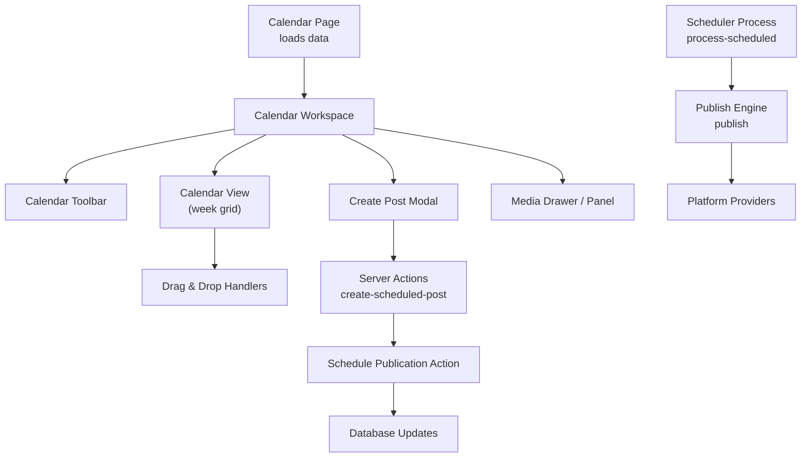
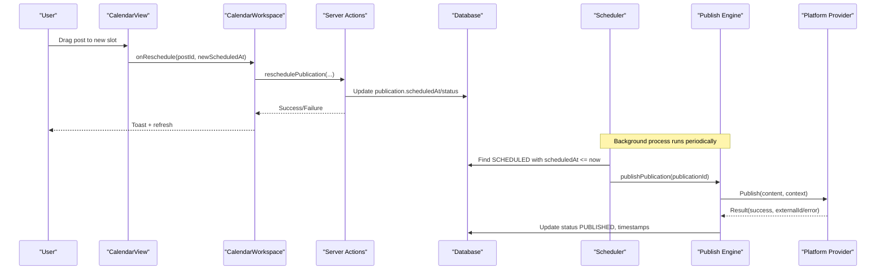
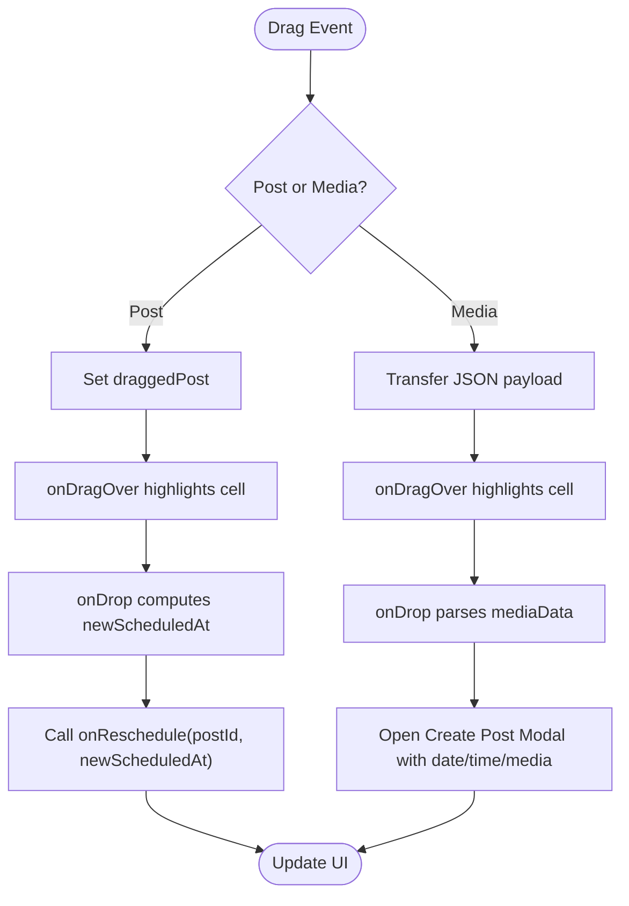
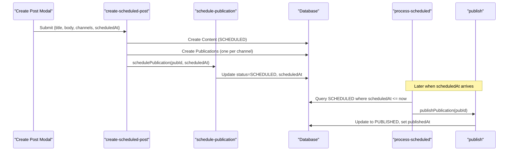
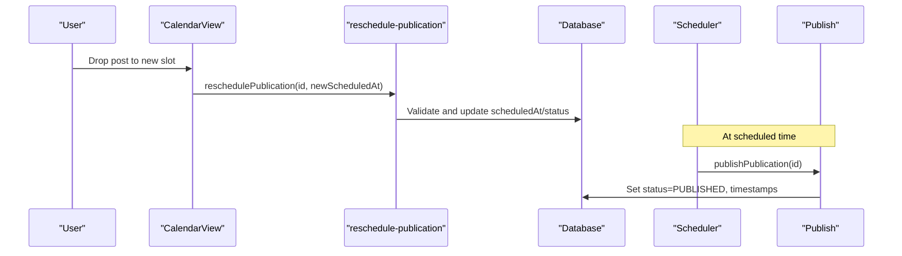
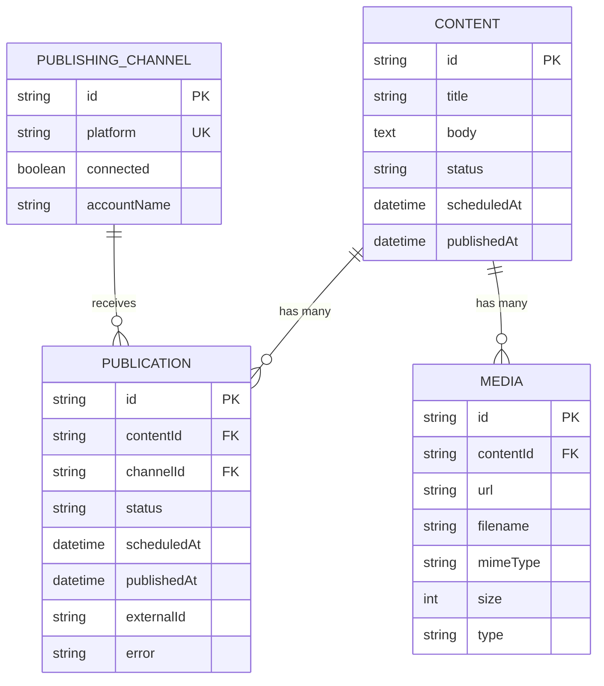
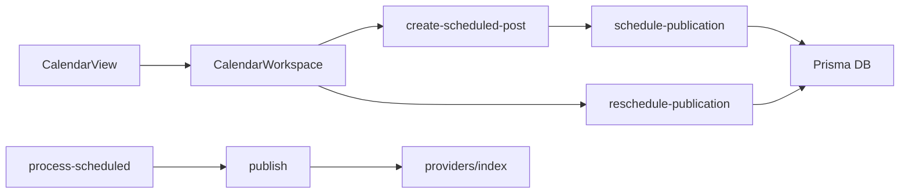

# Calendar and Scheduling

<cite>
**Referenced Files in This Document**
- [page.tsx](file://app/calendar/page.tsx)
- [calendar-workspace.tsx](file://components/calendar/calendar-workspace.tsx)
- [calendar-view.tsx](file://components/calendar/calendar-view.tsx)
- [calendar-toolbar.tsx](file://components/calendar/calendar-toolbar.tsx)
- [create-post-modal.tsx](file://components/calendar/create-post-modal.tsx)
- [create-scheduled-post.ts](file://app/calendar/actions/create-scheduled-post.ts)
- [schedule-publication.ts](file://app/publishing/actions/schedule-publication.ts)
- [reschedule-publication.ts](file://app/publishing/actions/reschedule-publication.ts)
- [process-scheduled.ts](file://app/publishing/engine/process-scheduled.ts)
- [publish.ts](file://app/publishing/engine/publish.ts)
- [types.ts](file://app/publishing/engine/types.ts)
- [index.ts](file://app/publishing/engine/providers/index.ts)
- [schema.prisma](file://prisma/schema.prisma)
</cite>

## Table of Contents
1. [Introduction](#introduction)
2. [Project Structure](#project-structure)
3. [Core Components](#core-components)
4. [Architecture Overview](#architecture-overview)
5. [Detailed Component Analysis](#detailed-component-analysis)
6. [Dependency Analysis](#dependency-analysis)
7. [Performance Considerations](#performance-considerations)
8. [Troubleshooting Guide](#troubleshooting-guide)
9. [Conclusion](#conclusion)

## Introduction
This document explains the Calendar and Scheduling system, focusing on the visual calendar interface with drag-and-drop scheduling, timezone handling, conflict detection strategies, batch scheduling operations, and integration with the publishing engine. It also covers workspace components (toolbar, view modes, interactions), backend processes (queue management, time zone handling, conflict resolution), rescheduling flows, and performance considerations for large calendars and real-time updates.

## Project Structure
The calendar feature is implemented as a Next.js client-side UI backed by server actions and a publishing engine:
- Calendar page loads scheduled publications and connected channels from the database and passes them to the workspace component.
- The workspace composes the toolbar, calendar grid, media panel, create/post modal, and toast notifications.
- The calendar grid supports drag-and-drop of posts and media items into time slots.
- Server actions handle creating scheduled posts, scheduling, and rescheduling, which update the database and invalidate caches.
- The publishing engine periodically processes scheduled publications and publishes them via platform providers.

**Diagram sources**
- [page.tsx:6-77](file://app/calendar/page.tsx#L6-L77)
- [calendar-workspace.tsx:55-329](file://components/calendar/calendar-workspace.tsx#L55-L329)
- [calendar-view.tsx:52-308](file://components/calendar/calendar-view.tsx#L52-L308)
- [create-scheduled-post.ts:15-66](file://app/calendar/actions/create-scheduled-post.ts#L15-L66)
- [schedule-publication.ts:6-51](file://app/publishing/actions/schedule-publication.ts#L6-L51)
- [process-scheduled.ts:4-72](file://app/publishing/engine/process-scheduled.ts#L4-L72)
- [publish.ts:4-116](file://app/publishing/engine/publish.ts#L4-L116)
- [index.ts:1-21](file://app/publishing/engine/providers/index.ts#L1-L21)

**Section sources**
- [page.tsx:6-77](file://app/calendar/page.tsx#L6-L77)
- [calendar-workspace.tsx:55-329](file://components/calendar/calendar-workspace.tsx#L55-L329)
- [calendar-view.tsx:52-308](file://components/calendar/calendar-view.tsx#L52-L308)
- [create-post-modal.tsx:79-559](file://components/calendar/create-post-modal.tsx#L79-L559)
- [create-scheduled-post.ts:15-66](file://app/calendar/actions/create-scheduled-post.ts#L15-L66)
- [schedule-publication.ts:6-51](file://app/publishing/actions/schedule-publication.ts#L6-L51)
- [reschedule-publication.ts:6-58](file://app/publishing/actions/reschedule-publication.ts#L6-L58)
- [process-scheduled.ts:4-72](file://app/publishing/engine/process-scheduled.ts#L4-L72)
- [publish.ts:4-116](file://app/publishing/engine/publish.ts#L4-L116)
- [types.ts:1-37](file://app/publishing/engine/types.ts#L1-L37)
- [index.ts:1-21](file://app/publishing/engine/providers/index.ts#L1-L21)
- [schema.prisma:21-94](file://prisma/schema.prisma#L21-L94)

## Core Components
- Calendar Page: Fetches scheduled publications and connected channels, transforms them into calendar-friendly posts, and renders the workspace.
- Calendar Workspace: Orchestrates state for navigation, views, media drawer, post creation/editing, rescheduling, and user feedback via toasts.
- Calendar Toolbar: Displays date range, navigation controls, current timezone, and view mode toggles.
- Calendar View: Renders a weekly hour-by-hour grid, groups posts by day/hour, supports drag-and-drop of posts and media, and shows a live time indicator.
- Create Post Modal: Handles content authoring, media selection/upload, channel selection, scheduling date/time, and submission to server actions.
- Publishing Engine: Processes queued/scheduled publications at or before their scheduled time and publishes via platform-specific providers.

**Section sources**
- [page.tsx:6-77](file://app/calendar/page.tsx#L6-L77)
- [calendar-workspace.tsx:55-329](file://components/calendar/calendar-workspace.tsx#L55-L329)
- [calendar-toolbar.tsx:14-116](file://components/calendar/calendar-toolbar.tsx#L14-L116)
- [calendar-view.tsx:52-308](file://components/calendar/calendar-view.tsx#L52-L308)
- [create-post-modal.tsx:79-559](file://components/calendar/create-post-modal.tsx#L79-L559)
- [process-scheduled.ts:4-72](file://app/publishing/engine/process-scheduled.ts#L4-L72)
- [publish.ts:4-116](file://app/publishing/engine/publish.ts#L4-L116)

## Architecture Overview
The system follows a clear separation between UI and backend:
- UI layer (Next.js client components) manages interactive calendar features and user workflows.
- Server actions persist content and scheduling metadata and trigger revalidation across relevant routes.
- The scheduler periodically queries due publications and invokes the publish engine.
- The publish engine validates state, selects the correct provider, and performs the actual publish, updating statuses atomically.

**Diagram sources**
- [calendar-view.tsx:133-178](file://components/calendar/calendar-view.tsx#L133-L178)
- [calendar-workspace.tsx:138-155](file://components/calendar/calendar-workspace.tsx#L138-L155)
- [reschedule-publication.ts:6-58](file://app/publishing/actions/reschedule-publication.ts#L6-L58)
- [process-scheduled.ts:4-72](file://app/publishing/engine/process-scheduled.ts#L4-L72)
- [publish.ts:4-116](file://app/publishing/engine/publish.ts#L4-L116)

## Detailed Component Analysis

### Visual Calendar Interface and Drag-and-Drop
- Weekly grid rendering: The calendar displays 24 hours per day for a week, grouping posts by day and hour keys.
- Drag-and-drop:
  - Internal post dragging: Users can drag a post card to another cell; dropping triggers rescheduling to the target date/time.
  - External media dragging: Media items from the media drawer can be dragged onto calendar cells to pre-fill the create post modal with selected date/time and media.
- Time indicator: A live horizontal line indicates the current time within the current week view.
- Click-to-create: Clicking an empty cell opens the create post modal with that date/time pre-filled.

**Diagram sources**
- [calendar-view.tsx:133-178](file://components/calendar/calendar-view.tsx#L133-L178)
- [calendar-workspace.tsx:157-171](file://components/calendar/calendar-workspace.tsx#L157-L171)

**Section sources**
- [calendar-view.tsx:52-308](file://components/calendar/calendar-view.tsx#L52-L308)
- [calendar-workspace.tsx:114-171](file://components/calendar/calendar-workspace.tsx#L114-L171)

### Toolbar, View Modes, and Interaction Patterns
- Toolbar:
  - Navigation: Previous/Next week buttons and Today button.
  - Date range display: Dynamically formatted based on start/end dates.
  - Timezone display: Shows the browser’s detected timezone.
  - View modes: Week, Month, List toggles (current implementation focuses on week view).
- Interactions:
  - Cell click opens create post modal with pre-filled date/time.
  - Post click opens edit modal with existing content and media.
  - Media drawer toggle and upload support.

**Section sources**
- [calendar-toolbar.tsx:14-116](file://components/calendar/calendar-toolbar.tsx#L14-L116)
- [calendar-workspace.tsx:63-119](file://components/calendar/calendar-workspace.tsx#L63-L119)

### Scheduling Backend Processes
- Creating scheduled posts:
  - Creates content with status SCHEDULED and sets scheduledAt.
  - Finds connected channels for selected platforms and creates one publication per channel.
  - Schedules each publication via the schedule action.
- Scheduling and rescheduling:
  - Validates that the scheduled time is in the future and publication is not already published.
  - Updates status to SCHEDULED and clears any prior error.
  - Revalidates relevant paths to reflect changes immediately in UI.
- Scheduler processing:
  - Periodically finds SCHEDULED publications with scheduledAt <= now.
  - Processes up to a batch size per run and calls the publish engine for each.
- Publishing:
  - Validates publication state and channel connectivity.
  - Invokes the appropriate platform provider.
  - On success, updates publication and content to PUBLISHED with timestamps and clears scheduledAt.
  - On failure, marks publication as FAILED with error details.

**Diagram sources**
- [create-scheduled-post.ts:15-66](file://app/calendar/actions/create-scheduled-post.ts#L15-L66)
- [schedule-publication.ts:6-51](file://app/publishing/actions/schedule-publication.ts#L6-L51)
- [process-scheduled.ts:4-72](file://app/publishing/engine/process-scheduled.ts#L4-L72)
- [publish.ts:4-116](file://app/publishing/engine/publish.ts#L4-L116)

**Section sources**
- [create-scheduled-post.ts:15-66](file://app/calendar/actions/create-scheduled-post.ts#L15-L66)
- [schedule-publication.ts:6-51](file://app/publishing/actions/schedule-publication.ts#L6-L51)
- [reschedule-publication.ts:6-58](file://app/publishing/actions/reschedule-publication.ts#L6-L58)
- [process-scheduled.ts:4-72](file://app/publishing/engine/process-scheduled.ts#L4-L72)
- [publish.ts:4-116](file://app/publishing/engine/publish.ts#L4-L116)

### Time Zone Handling
- Browser timezone detection: The toolbar displays the current timezone using Intl.DateTimeFormat.
- User-facing scheduling: The create post modal shows the detected timezone next to date/time inputs.
- Storage: Dates are stored as DateTime values in the database; no explicit timezone conversion is performed in the codebase.
- Implication: Ensure all users operate in consistent time zones or implement server-side normalization if cross-timezone scheduling is required.

**Section sources**
- [calendar-toolbar.tsx:43-47](file://components/calendar/calendar-toolbar.tsx#L43-L47)
- [create-post-modal.tsx:122-123](file://components/calendar/create-post-modal.tsx#L122-L123)
- [schema.prisma:21-37](file://prisma/schema.prisma#L21-L37)

### Conflict Detection and Resolution
- Current behavior: No explicit conflict detection is implemented in the calendar UI or server actions. Multiple posts can be placed in the same time slot.
- Recommendations:
  - Add server-side validation to prevent overlapping posts per channel or globally.
  - Provide UI warnings when a drop targets a slot containing existing posts.
  - Implement conflict resolution options (e.g., auto-shift, merge, or reject).

[No sources needed since this section provides general guidance]

### Batch Scheduling Operations
- Multi-channel scheduling: When creating a post, selecting multiple connected platforms results in one publication per channel, each scheduled independently.
- Scheduler batching: The scheduler retrieves up to a fixed number of due publications per run and processes them sequentially.

**Section sources**
- [create-scheduled-post.ts:15-66](file://app/calendar/actions/create-scheduled-post.ts#L15-L66)
- [process-scheduled.ts:11-27](file://app/publishing/engine/process-scheduled.ts#L11-L27)

### Rescheduling Functionality and Publishing Integration
- Rescheduling flow:
  - Drag-and-drop or edit triggers reschedulePublication with the new date/time.
  - Validation ensures the new time is in the future and the publication is not already published.
  - Status is reset to SCHEDULED and errors cleared.
- Publishing integration:
  - Once scheduledAt arrives, the scheduler picks up the publication and publishes it via the appropriate provider.
  - Successful publish updates both publication and content records atomically.

**Diagram sources**
- [calendar-view.tsx:153-166](file://components/calendar/calendar-view.tsx#L153-L166)
- [reschedule-publication.ts:6-58](file://app/publishing/actions/reschedule-publication.ts#L6-L58)
- [process-scheduled.ts:4-72](file://app/publishing/engine/process-scheduled.ts#L4-L72)
- [publish.ts:4-116](file://app/publishing/engine/publish.ts#L4-L116)

**Section sources**
- [calendar-view.tsx:153-166](file://components/calendar/calendar-view.tsx#L153-L166)
- [reschedule-publication.ts:6-58](file://app/publishing/actions/reschedule-publication.ts#L6-L58)
- [publish.ts:4-116](file://app/publishing/engine/publish.ts#L4-L116)

### Data Models and Relationships
Key entities involved in scheduling:
- Content: Stores title, body, status, and scheduling fields.
- Media: Attached to content with URL, filename, MIME type, size, and type.
- PublishingChannel: Represents a connected social platform account.
- Publication: Links content to a channel with status, scheduledAt, publishedAt, and optional externalId.

**Diagram sources**
- [schema.prisma:21-94](file://prisma/schema.prisma#L21-L94)

## Dependency Analysis
- Calendar UI depends on:
  - Workspace layout components and media panels.
  - Server actions for scheduling and rescheduling.
  - Publishing engine for eventual publication.
- Server actions depend on Prisma client and revalidatePath for cache invalidation.
- Publishing engine depends on provider registry to route to platform-specific implementations.

**Diagram sources**
- [calendar-view.tsx:52-308](file://components/calendar/calendar-view.tsx#L52-L308)
- [calendar-workspace.tsx:55-329](file://components/calendar/calendar-workspace.tsx#L55-L329)
- [create-scheduled-post.ts:15-66](file://app/calendar/actions/create-scheduled-post.ts#L15-L66)
- [schedule-publication.ts:6-51](file://app/publishing/actions/schedule-publication.ts#L6-L51)
- [reschedule-publication.ts:6-58](file://app/publishing/actions/reschedule-publication.ts#L6-L58)
- [process-scheduled.ts:4-72](file://app/publishing/engine/process-scheduled.ts#L4-L72)
- [publish.ts:4-116](file://app/publishing/engine/publish.ts#L4-L116)
- [index.ts:1-21](file://app/publishing/engine/providers/index.ts#L1-L21)

**Section sources**
- [create-scheduled-post.ts:15-66](file://app/calendar/actions/create-scheduled-post.ts#L15-L66)
- [schedule-publication.ts:6-51](file://app/publishing/actions/schedule-publication.ts#L6-L51)
- [reschedule-publication.ts:6-58](file://app/publishing/actions/reschedule-publication.ts#L6-L58)
- [process-scheduled.ts:4-72](file://app/publishing/engine/process-scheduled.ts#L4-L72)
- [publish.ts:4-116](file://app/publishing/engine/publish.ts#L4-L116)
- [index.ts:1-21](file://app/publishing/engine/providers/index.ts#L1-L21)

## Performance Considerations
- Large calendars:
  - Grouping posts by day/hour uses a Map keyed by date and hour, reducing repeated computations during render.
  - Only posts within the current week window are considered for grouping, limiting dataset size.
- Real-time updates:
  - Live time indicator updates every minute to keep the current time line accurate.
  - Server actions call revalidatePath to refresh cached pages after mutations.
- Scheduler throughput:
  - The scheduler fetches a limited batch size per run to avoid overwhelming the system.
  - Each publication is processed sequentially; consider parallelization with rate-limiting for high-volume scenarios.
- Media handling:
  - Uploading media is done via FormData to the media API; ensure proper chunking and progress feedback for large files.

[No sources needed since this section provides general guidance]

## Troubleshooting Guide
Common issues and resolutions:
- Invalid schedule date:
  - Ensure the scheduled date is valid and in the future; server actions will throw errors otherwise.
- Already published:
  - Published publications cannot be rescheduled; verify status before attempting updates.
- Not connected channel:
  - Publishing requires a connected channel; ensure the channel is marked as connected.
- Missing content body:
  - Publishing requires non-empty content body; validate before scheduling.
- Provider not configured:
  - If a platform lacks a provider, publishing will fail; configure or use a supported platform.

**Section sources**
- [schedule-publication.ts:10-18](file://app/publishing/actions/schedule-publication.ts#L10-L18)
- [reschedule-publication.ts:10-18](file://app/publishing/actions/reschedule-publication.ts#L10-L18)
- [publish.ts:23-44](file://app/publishing/engine/publish.ts#L23-L44)
- [index.ts:10-20](file://app/publishing/engine/providers/index.ts#L10-L20)

## Conclusion
The Calendar and Scheduling system provides a robust, interactive weekly calendar with drag-and-drop scheduling, multi-channel batch scheduling, and a reliable publishing pipeline. While timezone handling is currently client-detected without server normalization, the architecture supports future enhancements such as conflict detection, advanced scheduling rules, and improved real-time updates. The modular design separates UI concerns from backend logic, enabling scalable growth and easier maintenance.