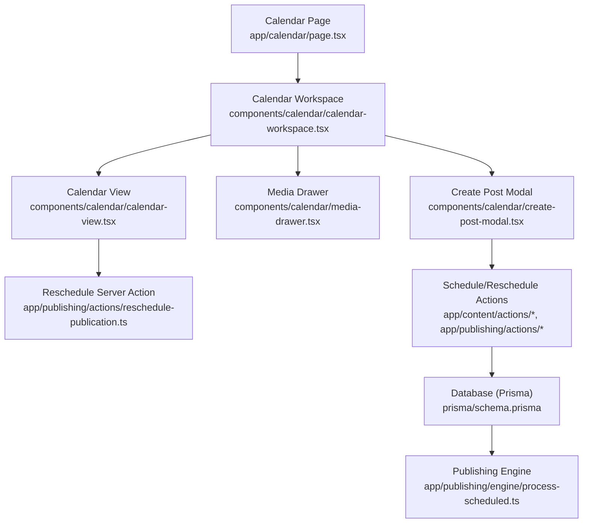
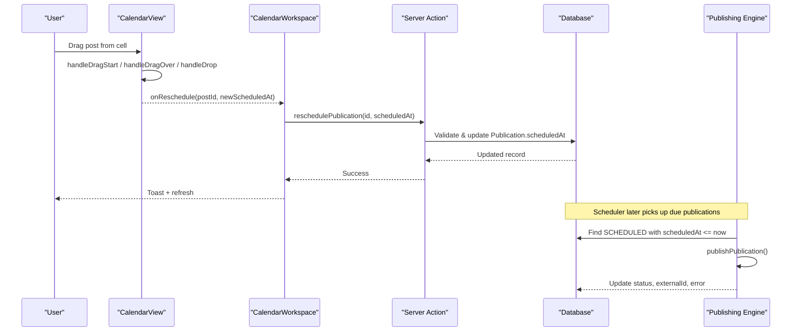
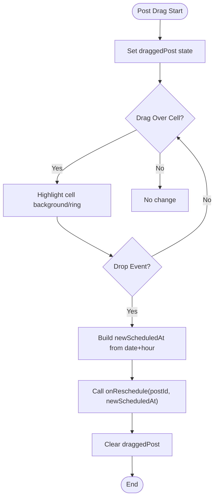
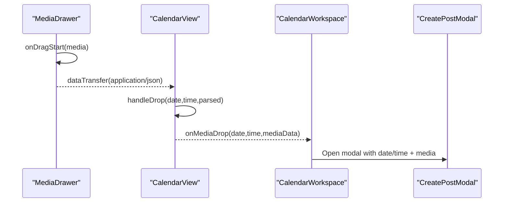
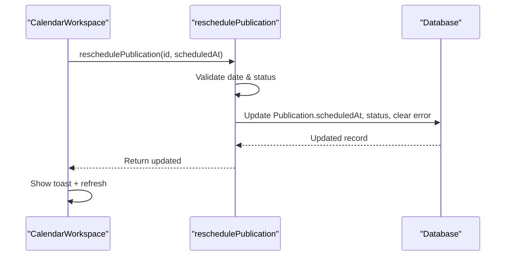
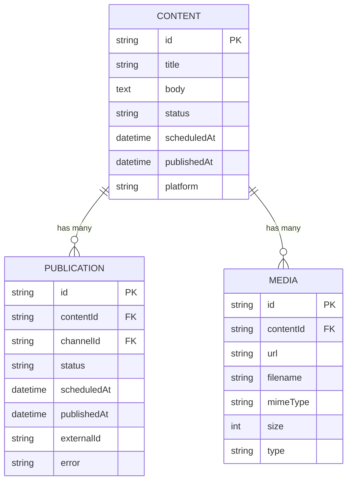
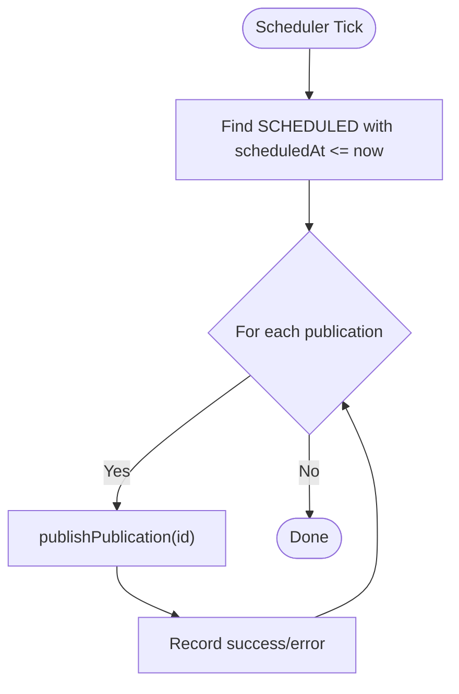
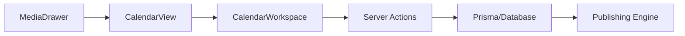

# Drag and Drop Scheduling

<cite>
**Referenced Files in This Document**
- [calendar/page.tsx](file://app/calendar/page.tsx)
- [calendar-view.tsx](file://components/calendar/calendar-view.tsx)
- [calendar-workspace.tsx](file://components/calendar/calendar-workspace.tsx)
- [media-drawer.tsx](file://components/calendar/media-drawer.tsx)
- [reschedule-content.ts](file://app/content/actions/reschedule-content.ts)
- [schedule-content.ts](file://app/content/actions/schedule-content.ts)
- [reschedule-publication.ts](file://app/publishing/actions/reschedule-publication.ts)
- [schedule-publication.ts](file://app/publishing/actions/schedule-publication.ts)
- [process-scheduled.ts](file://app/publishing/engine/process-scheduled.ts)
- [schema.prisma](file://prisma/schema.prisma)
</cite>

## Table of Contents
1. [Introduction](#introduction)
2. [Project Structure](#project-structure)
3. [Core Components](#core-components)
4. [Architecture Overview](#architecture-overview)
5. [Detailed Component Analysis](#detailed-component-analysis)
6. [Dependency Analysis](#dependency-analysis)
7. [Performance Considerations](#performance-considerations)
8. [Troubleshooting Guide](#troubleshooting-guide)
9. [Conclusion](#conclusion)

## Introduction
This document explains the drag-and-drop scheduling functionality that lets users move scheduled posts between time slots on a weekly calendar, drop media into time slots to create new scheduled content, and update schedules via server-side actions. It covers:
- Drag operations for moving posts across hours and days
- Drop zone handling for both internal post moves and external media drops
- Visual feedback during drag interactions
- Backend validation, conflict detection, and database updates
- Rescheduling workflow for existing scheduled posts
- Integration with the publishing engine
- Touch support considerations and keyboard accessibility notes

## Project Structure
The scheduling UI is built as a Next.js application with client components for interactivity and server actions for persistence. The calendar page loads scheduled publications and connected channels, then renders a workspace containing the calendar grid, media drawer, and modals.

**Diagram sources**
- [calendar/page.tsx:6-78](file://app/calendar/page.tsx#L6-L78)
- [calendar-workspace.tsx:55-329](file://components/calendar/calendar-workspace.tsx#L55-L329)
- [calendar-view.tsx:52-308](file://components/calendar/calendar-view.tsx#L52-L308)
- [media-drawer.tsx:22-167](file://components/calendar/media-drawer.tsx#L22-L167)
- [reschedule-publication.ts:6-59](file://app/publishing/actions/reschedule-publication.ts#L6-L59)
- [schedule-content.ts:6-66](file://app/content/actions/schedule-content.ts#L6-L66)
- [reschedule-content.ts:6-60](file://app/content/actions/reschedule-content.ts#L6-L60)
- [process-scheduled.ts:4-72](file://app/publishing/engine/process-scheduled.ts#L4-L72)
- [schema.prisma:21-94](file://prisma/schema.prisma#L21-L94)

**Section sources**
- [calendar/page.tsx:6-78](file://app/calendar/page.tsx#L6-L78)
- [calendar-workspace.tsx:55-329](file://components/calendar/calendar-workspace.tsx#L55-L329)

## Core Components
- Calendar Page: Loads scheduled publications and connected channels, maps them to a simplified post model, and passes data to the workspace.
- Calendar Workspace: Orchestrates state for navigation, media drawer, create/edit modal, and rescheduling; wires drag-and-drop events to server actions.
- Calendar View: Renders the weekly grid, handles drag start/move/drop for posts and media, and provides visual feedback for drop zones.
- Media Drawer: Displays media items and enables dragging media into calendar cells to pre-fill a new scheduled post.
- Server Actions: Validate inputs, enforce business rules (future dates, status constraints), and update Content/Publication records atomically.
- Publishing Engine: Periodically processes scheduled publications due now or earlier.

**Section sources**
- [calendar/page.tsx:6-78](file://app/calendar/page.tsx#L6-L78)
- [calendar-workspace.tsx:55-329](file://components/calendar/calendar-workspace.tsx#L55-L329)
- [calendar-view.tsx:52-308](file://components/calendar/calendar-view.tsx#L52-L308)
- [media-drawer.tsx:22-167](file://components/calendar/media-drawer.tsx#L22-L167)
- [reschedule-publication.ts:6-59](file://app/publishing/actions/reschedule-publication.ts#L6-L59)
- [schedule-content.ts:6-66](file://app/content/actions/schedule-content.ts#L6-L66)
- [reschedule-content.ts:6-60](file://app/content/actions/reschedule-content.ts#L6-L60)
- [process-scheduled.ts:4-72](file://app/publishing/engine/process-scheduled.ts#L4-L72)

## Architecture Overview
The drag-and-drop flow spans UI events, state transitions, and server-side persistence:

**Diagram sources**
- [calendar-view.tsx:133-178](file://components/calendar/calendar-view.tsx#L133-L178)
- [calendar-workspace.tsx:138-155](file://components/calendar/calendar-workspace.tsx#L138-L155)
- [reschedule-publication.ts:6-59](file://app/publishing/actions/reschedule-publication.ts#L6-L59)
- [process-scheduled.ts:4-72](file://app/publishing/engine/process-scheduled.ts#L4-L72)

## Detailed Component Analysis

### Dragging Posts Between Time Slots
- Drag Start: When a user starts dragging a post card, the component stores the dragged post and sets drag metadata for cross-browser compatibility.
- Drop Zone Handling: Each hour slot accepts drops. On drop, if a post is being moved, it constructs a new ISO datetime string and calls the reschedule callback.
- Visual Feedback: Cells highlight when hovered during drag using a distinct background and ring to indicate a valid drop target.

**Diagram sources**
- [calendar-view.tsx:133-178](file://components/calendar/calendar-view.tsx#L133-L178)
- [calendar-view.tsx:235-248](file://components/calendar/calendar-view.tsx#L235-L248)

**Section sources**
- [calendar-view.tsx:133-178](file://components/calendar/calendar-view.tsx#L133-L178)
- [calendar-view.tsx:235-248](file://components/calendar/calendar-view.tsx#L235-L248)

### Dropping Media Into Time Slots
- Media Drag Source: The media drawer makes each thumbnail draggable and serializes media metadata as JSON in the drag payload.
- Drop Handling: The calendar view parses the JSON payload and forwards it to the workspace handler, which opens the create/post edit modal with the selected date/time and media pre-filled.

**Diagram sources**
- [media-drawer.tsx:82-90](file://components/calendar/media-drawer.tsx#L82-L90)
- [calendar-view.tsx:168-178](file://components/calendar/calendar-view.tsx#L168-L178)
- [calendar-workspace.tsx:157-171](file://components/calendar/calendar-workspace.tsx#L157-L171)

**Section sources**
- [media-drawer.tsx:82-90](file://components/calendar/media-drawer.tsx#L82-L90)
- [calendar-view.tsx:168-178](file://components/calendar/calendar-view.tsx#L168-L178)
- [calendar-workspace.tsx:157-171](file://components/calendar/calendar-workspace.tsx#L157-L171)

### Rescheduling Workflow and Validation
When a post is dropped onto a new time slot:
- Client constructs a new scheduled timestamp and invokes the server action.
- Server validates:
  - Date parsing and future-time requirement
  - Existence of publication
  - Status constraints (only queued/scheduled can be rescheduled; published cannot)
- Database updates are performed within a transaction to ensure consistency:
  - For content-based reschedules, both Content and related Publications are updated
  - For publication-based reschedules, the specific Publication record is updated
- Path revalidation ensures UI reflects changes immediately.

**Diagram sources**
- [calendar-workspace.tsx:138-155](file://components/calendar/calendar-workspace.tsx#L138-L155)
- [reschedule-publication.ts:6-59](file://app/publishing/actions/reschedule-publication.ts#L6-L59)

**Section sources**
- [reschedule-publication.ts:6-59](file://app/publishing/actions/reschedule-publication.ts#L6-L59)
- [reschedule-content.ts:6-60](file://app/content/actions/reschedule-content.ts#L6-L60)
- [schedule-content.ts:6-66](file://app/content/actions/schedule-content.ts#L6-L66)

### Data Model and Relationships
The scheduling system revolves around Content and Publication entities:
- Content holds title, body, status, scheduledAt, and platform info.
- Publication links a Content to a PublishingChannel, tracks per-channel status, scheduledAt, and errors.
- Media is associated with Content.

**Diagram sources**
- [schema.prisma:21-94](file://prisma/schema.prisma#L21-L94)

**Section sources**
- [schema.prisma:21-94](file://prisma/schema.prisma#L21-L94)

### Publishing Engine Integration
After rescheduling, the publishing engine periodically scans for publications ready to publish:
- Finds all publications with status SCHEDULED and scheduledAt less than or equal to current time
- Publishes them via the provider pipeline and records results/errors

**Diagram sources**
- [process-scheduled.ts:4-72](file://app/publishing/engine/process-scheduled.ts#L4-L72)

**Section sources**
- [process-scheduled.ts:4-72](file://app/publishing/engine/process-scheduled.ts#L4-L72)

### Examples of Drag-and-Drop Interactions
- Move an existing post from Monday 10 AM to Wednesday 2 PM:
  - Drag the post card to the desired cell
  - The cell highlights while hovering
  - On drop, the post’s scheduled time updates and a success toast appears
- Attach media to a new post by dropping from the media drawer:
  - Drag a media thumbnail into a calendar cell
  - The create/edit modal opens with the date/time and media pre-filled
  - Submitting creates a new scheduled post

[No sources needed since this section describes usage patterns without analyzing specific files]

### Error Handling for Invalid Drops
- Invalid date format or past date:
  - Server action throws an error indicating invalid or non-future schedule
- Published content/publication:
  - Server rejects rescheduling attempts on already published items
- Unknown publication or content:
  - Server returns not found errors
- UI displays a toast on failure and keeps the previous schedule intact

**Section sources**
- [reschedule-publication.ts:10-39](file://app/publishing/actions/reschedule-publication.ts#L10-L39)
- [reschedule-content.ts:10-30](file://app/content/actions/reschedule-content.ts#L10-L30)
- [schedule-content.ts:10-33](file://app/content/actions/schedule-content.ts#L10-L33)
- [calendar-workspace.tsx:138-155](file://components/calendar/calendar-workspace.tsx#L138-L155)

### Accessibility and Keyboard Navigation
- Keyboard support:
  - Escape key closes the media drawer
- Focus management:
  - Ensure interactive elements like post cards and buttons are focusable and operable via keyboard
- Screen reader considerations:
  - Provide descriptive labels for controls and status messages

**Section sources**
- [media-drawer.tsx:40-48](file://components/calendar/media-drawer.tsx#L40-L48)

### Touch Support for Mobile Devices
- Current implementation relies on HTML5 drag-and-drop APIs, which may have limited touch support on some mobile browsers.
- Recommended enhancements:
  - Add touch event handlers (touchstart, touchmove, touchend) to emulate drag behavior
  - Use a library or polyfill for consistent cross-device drag-and-drop
  - Provide alternative tap-to-move workflows for small screens

[No sources needed since this section provides general guidance]

## Dependency Analysis
- Calendar View depends on:
  - Props for posts, week navigation, callbacks for clicks, rescheduling, and media drops
  - Local state for drag interactions and time indicator
- Calendar Workspace depends on:
  - Server actions for rescheduling and scheduling
  - Media drawer for drag source
  - Create post modal for finalizing scheduled posts
- Server actions depend on:
  - Prisma client for database access
  - Revalidation hooks for UI updates
- Publishing engine depends on:
  - Database queries to find due publications
  - Provider-specific publish logic

**Diagram sources**
- [calendar-view.tsx:52-308](file://components/calendar/calendar-view.tsx#L52-L308)
- [calendar-workspace.tsx:55-329](file://components/calendar/calendar-workspace.tsx#L55-L329)
- [reschedule-publication.ts:6-59](file://app/publishing/actions/reschedule-publication.ts#L6-L59)
- [process-scheduled.ts:4-72](file://app/publishing/engine/process-scheduled.ts#L4-L72)

**Section sources**
- [calendar-view.tsx:52-308](file://components/calendar/calendar-view.tsx#L52-L308)
- [calendar-workspace.tsx:55-329](file://components/calendar/calendar-workspace.tsx#L55-L329)
- [reschedule-publication.ts:6-59](file://app/publishing/actions/reschedule-publication.ts#L6-L59)
- [process-scheduled.ts:4-72](file://app/publishing/engine/process-scheduled.ts#L4-L72)

## Performance Considerations
- Efficient grouping:
  - Posts are grouped by day-hour keys to minimize rendering overhead
- Debounced updates:
  - Time indicator updates at intervals to avoid excessive re-renders
- Transactional writes:
  - Server actions use transactions to ensure atomic updates across related tables
- Revalidation strategy:
  - Targeted path revalidations reduce full-page reloads

[No sources needed since this section provides general guidance]

## Troubleshooting Guide
Common issues and resolutions:
- Reschedule fails with “Invalid schedule date”:
  - Ensure the selected date/time is valid and in the future
- Reschedule fails with “Content/Publication not found”:
  - Verify the ID exists and has not been deleted
- Reschedule blocked because item is published:
  - Only draft/queued/scheduled items can be rescheduled
- Drag does not work on mobile:
  - Implement touch event handling or provide alternative interactions
- No visual feedback on drop:
  - Confirm dragover handlers prevent default and set highlight state

**Section sources**
- [reschedule-publication.ts:10-39](file://app/publishing/actions/reschedule-publication.ts#L10-L39)
- [reschedule-content.ts:10-30](file://app/content/actions/reschedule-content.ts#L10-L30)
- [schedule-content.ts:10-33](file://app/content/actions/schedule-content.ts#L10-L33)
- [calendar-view.tsx:141-151](file://components/calendar/calendar-view.tsx#L141-L151)

## Conclusion
The drag-and-drop scheduling feature provides an intuitive way to manage content timing through direct manipulation on a weekly calendar. It combines responsive UI interactions with robust server-side validation and transactional updates, ensuring reliable scheduling and seamless integration with the publishing engine. Future improvements should focus on enhanced touch support and expanded keyboard accessibility to ensure consistent experiences across devices and assistive technologies.