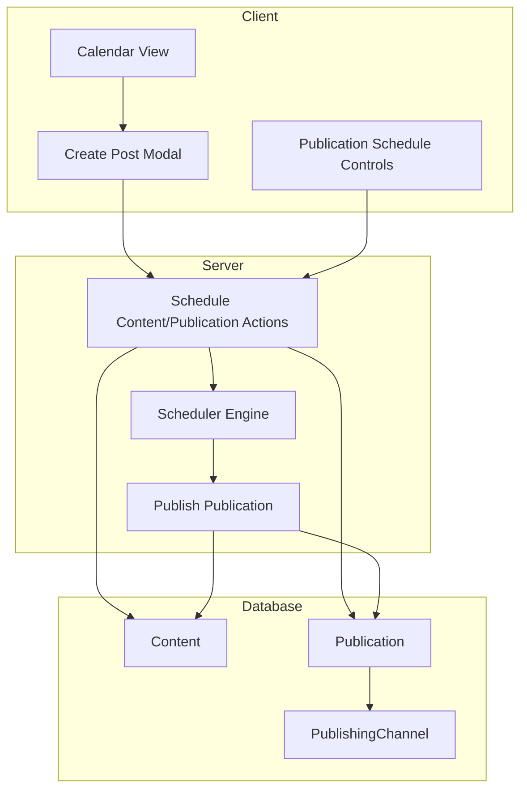
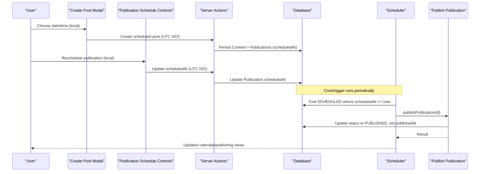
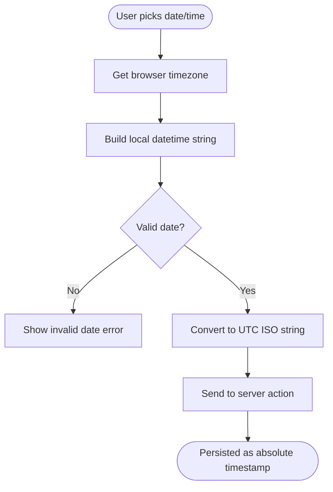
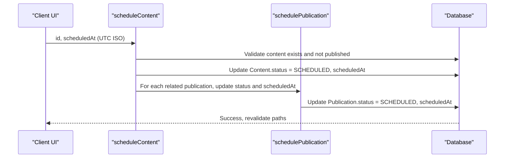
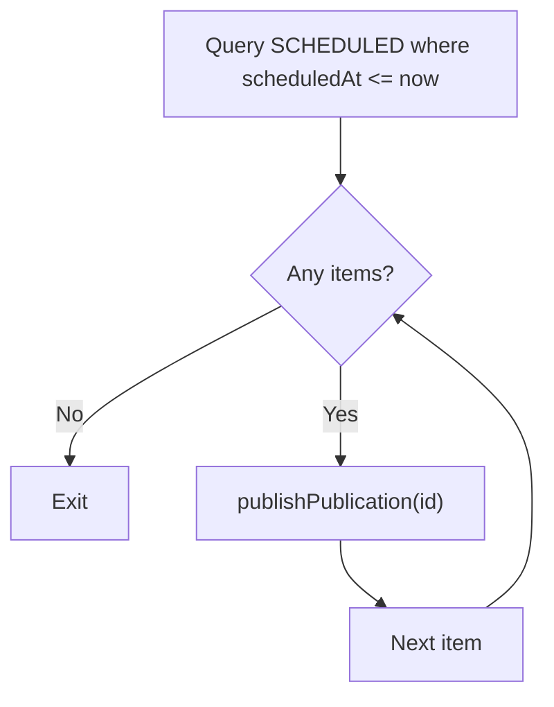
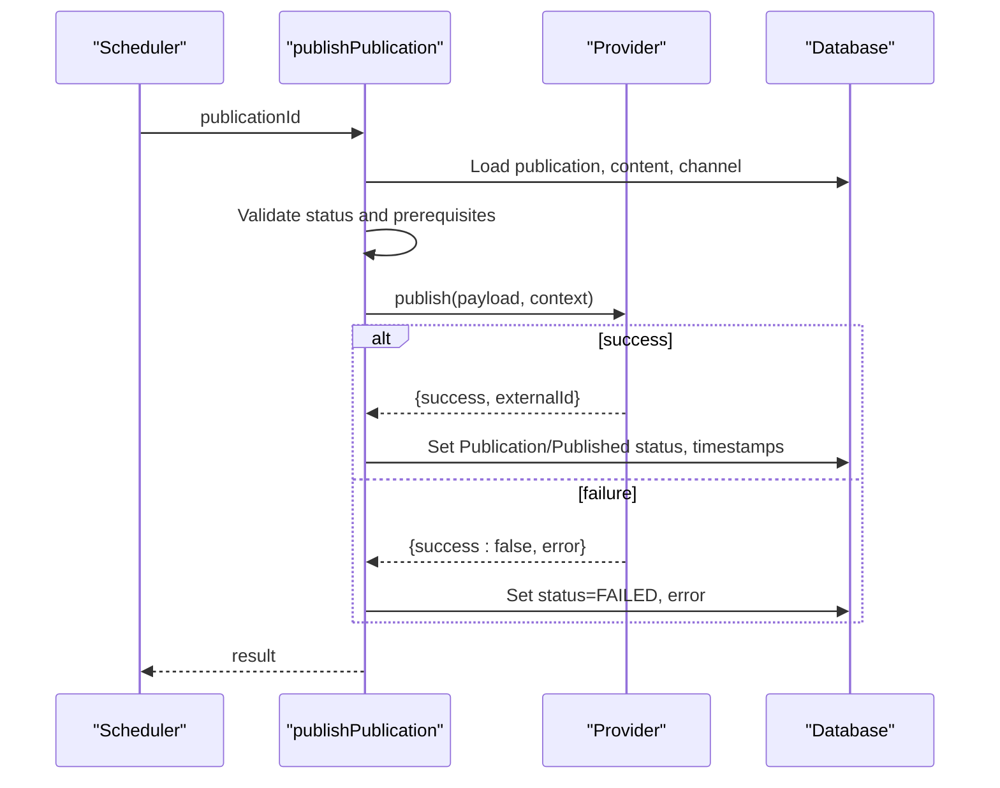
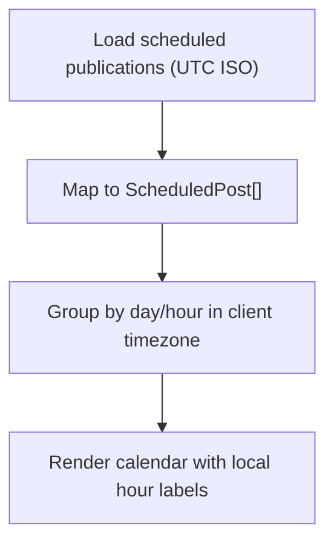
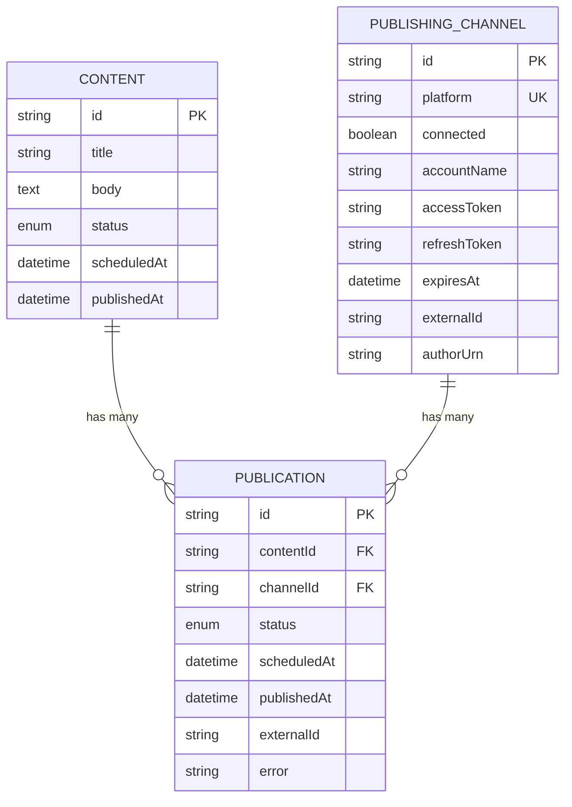
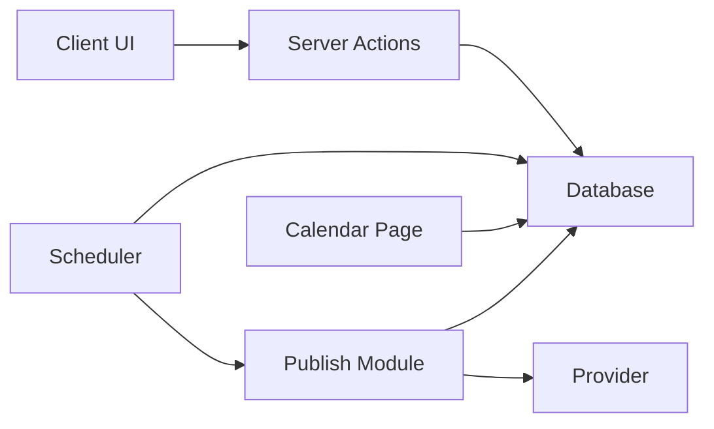

# Timezone Support and Conflict Detection

<cite>
**Referenced Files in This Document**
- [process-scheduled.ts](file://app/publishing/engine/process-scheduled.ts)
- [publish.ts](file://app/publishing/engine/publish.ts)
- [schedule-publication.ts](file://app/publishing/actions/schedule-publication.ts)
- [schedule-content.ts](file://app/content/actions/schedule-content.ts)
- [create-scheduled-post.ts](file://app/calendar/actions/create-scheduled-post.ts)
- [publication-schedule-controls.tsx](file://components/publishing/publication-schedule-controls.tsx)
- [create-post-modal.tsx](file://components/calendar/create-post-modal.tsx)
- [calendar-page.tsx](file://app/calendar/page.tsx)
- [calendar-view.tsx](file://components/calendar/calendar-view.tsx)
- [schema.prisma](file://prisma/schema.prisma)
</cite>

## Table of Contents
1. [Introduction](#introduction)
2. [Project Structure](#project-structure)
3. [Core Components](#core-components)
4. [Architecture Overview](#architecture-overview)
5. [Detailed Component Analysis](#detailed-component-analysis)
6. [Dependency Analysis](#dependency-analysis)
7. [Performance Considerations](#performance-considerations)
8. [Troubleshooting Guide](#troubleshooting-guide)
9. [Conclusion](#conclusion)

## Introduction
This document explains how the scheduling system handles timezones, converts timestamps between UTC and local timezones, displays accurate scheduling information, and detects conflicts to prevent overlapping publications on the same platform or account. It covers timezone-aware date calculations, daylight saving time (DST) handling via browser APIs, internationalization support for localized display, and conflict resolution strategies with user notifications.

## Project Structure
The scheduling system spans server actions, a background scheduler, UI components, and database models:
- Server actions validate and persist scheduled times as absolute timestamps.
- The scheduler queries due items and publishes them.
- UI components collect local datetime inputs, convert them to UTC, and show localized times.
- Database schema stores scheduled and published timestamps and links content to publishing channels.

**Diagram sources**
- [schedule-content.ts:1-66](file://app/content/actions/schedule-content.ts#L1-L66)
- [schedule-publication.ts:1-52](file://app/publishing/actions/schedule-publication.ts#L1-L52)
- [process-scheduled.ts:1-72](file://app/publishing/engine/process-scheduled.ts#L1-L72)
- [publish.ts:1-116](file://app/publishing/engine/publish.ts#L1-L116)
- [create-post-modal.tsx:103-123](file://components/calendar/create-post-modal.tsx#L103-L123)
- [publication-schedule-controls.tsx:22-63](file://components/publishing/publication-schedule-controls.tsx#L22-L63)
- [schema.prisma:21-93](file://prisma/schema.prisma#L21-L93)

**Section sources**
- [schedule-content.ts:1-66](file://app/content/actions/schedule-content.ts#L1-L66)
- [schedule-publication.ts:1-52](file://app/publishing/actions/schedule-publication.ts#L1-L52)
- [process-scheduled.ts:1-72](file://app/publishing/engine/process-scheduled.ts#L1-L72)
- [publish.ts:1-116](file://app/publishing/engine/publish.ts#L1-L116)
- [create-post-modal.tsx:103-123](file://components/calendar/create-post-modal.tsx#L103-L123)
- [publication-schedule-controls.tsx:22-63](file://components/publishing/publication-schedule-controls.tsx#L22-L63)
- [schema.prisma:21-93](file://prisma/schema.prisma#L21-L93)

## Core Components
- Timezone capture and conversion:
  - Client captures the user’s timezone and uses it to format and interpret local datetimes.
  - Local datetime values are converted to UTC ISO strings before being sent to the server.
- Scheduling persistence:
  - Server actions accept ISO strings, validate them, and store absolute timestamps in the database.
- Scheduler execution:
  - The scheduler finds due “SCHEDULED” publications and triggers publishing.
- Publishing workflow:
  - Publish function validates state, calls provider, and updates records atomically.

Key responsibilities:
- Client-side: localize input, compute UTC, show user-friendly times.
- Server-side: validate, persist, schedule, and publish using absolute time.
- Database: store absolute timestamps and link content to channels.

**Section sources**
- [create-post-modal.tsx:103-123](file://components/calendar/create-post-modal.tsx#L103-L123)
- [publication-schedule-controls.tsx:22-63](file://components/publishing/publication-schedule-controls.tsx#L22-L63)
- [schedule-content.ts:1-66](file://app/content/actions/schedule-content.ts#L1-L66)
- [schedule-publication.ts:1-52](file://app/publishing/actions/schedule-publication.ts#L1-L52)
- [process-scheduled.ts:1-72](file://app/publishing/engine/process-scheduled.ts#L1-L72)
- [publish.ts:1-116](file://app/publishing/engine/publish.ts#L1-L116)
- [schema.prisma:21-93](file://prisma/schema.prisma#L21-L93)

## Architecture Overview
End-to-end flow from scheduling to publication with timezone handling:

**Diagram sources**
- [create-post-modal.tsx:103-123](file://components/calendar/create-post-modal.tsx#L103-L123)
- [create-scheduled-post.ts:15-66](file://app/calendar/actions/create-scheduled-post.ts#L15-L66)
- [schedule-publication.ts:6-50](file://app/publishing/actions/schedule-publication.ts#L6-L50)
- [schedule-content.ts:6-65](file://app/content/actions/schedule-content.ts#L6-L65)
- [process-scheduled.ts:4-70](file://app/publishing/engine/process-scheduled.ts#L4-L70)
- [publish.ts:4-115](file://app/publishing/engine/publish.ts#L4-L115)

## Detailed Component Analysis

### Timezone Capture and Conversion (Client)
- Captures the browser’s timezone and shows it to users for clarity.
- Uses HTML datetime-local inputs that represent local time.
- Converts local datetime to UTC by constructing a Date and calling toISOString() before sending to the server.
- Formats stored UTC timestamps back to local time when displaying in the UI.

**Diagram sources**
- [create-post-modal.tsx:103-123](file://components/calendar/create-post-modal.tsx#L103-L123)
- [publication-schedule-controls.tsx:22-63](file://components/publishing/publication-schedule-controls.tsx#L22-L63)

**Section sources**
- [create-post-modal.tsx:103-123](file://components/calendar/create-post-modal.tsx#L103-L123)
- [publication-schedule-controls.tsx:22-63](file://components/publishing/publication-schedule-controls.tsx#L22-L63)

### Scheduling Server Actions
- Accepts an ISO string representing UTC.
- Validates that the date is valid and in the future.
- Updates content and/or publication records with absolute timestamps.
- Revalidates relevant pages to refresh UI.

**Diagram sources**
- [schedule-content.ts:6-65](file://app/content/actions/schedule-content.ts#L6-L65)
- [schedule-publication.ts:6-50](file://app/publishing/actions/schedule-publication.ts#L6-L50)

**Section sources**
- [schedule-content.ts:6-65](file://app/content/actions/schedule-content.ts#L6-L65)
- [schedule-publication.ts:6-50](file://app/publishing/actions/schedule-publication.ts#L6-L50)

### Scheduler Execution
- Periodically queries for “SCHEDULED” publications with scheduledAt less than or equal to current time.
- Processes up to a batch size to avoid overload.
- Calls publish function per publication and aggregates results.

**Diagram sources**
- [process-scheduled.ts:4-70](file://app/publishing/engine/process-scheduled.ts#L4-L70)

**Section sources**
- [process-scheduled.ts:4-70](file://app/publishing/engine/process-scheduled.ts#L4-L70)

### Publishing Workflow
- Loads publication with associated content and channel.
- Validates state transitions and prerequisites (content body, connected channel).
- Delegates to provider and updates records atomically on success or failure.

**Diagram sources**
- [publish.ts:4-115](file://app/publishing/engine/publish.ts#L4-L115)

**Section sources**
- [publish.ts:4-115](file://app/publishing/engine/publish.ts#L4-L115)

### Calendar Display and Timezone-Aware Rendering
- Server page loads scheduled publications and maps them to client-friendly structures, preserving UTC ISO strings.
- Calendar view groups posts by day and hour using local Date parsing of the provided ISO strings.
- Displays hours and indicators based on the client’s timezone.

**Diagram sources**
- [calendar-page.tsx:6-79](file://app/calendar/page.tsx#L6-L79)
- [calendar-view.tsx:94-112](file://components/calendar/calendar-view.tsx#L94-L112)

**Section sources**
- [calendar-page.tsx:6-79](file://app/calendar/page.tsx#L6-L79)
- [calendar-view.tsx:94-112](file://components/calendar/calendar-view.tsx#L94-L112)

### Data Model and Time Fields
- Content and Publication entities store scheduledAt and publishedAt as DateTime fields.
- Unique constraint on (contentId, channelId) ensures one publication per content per channel.
- PublishingChannel tracks platform and connection metadata.

**Diagram sources**
- [schema.prisma:21-93](file://prisma/schema.prisma#L21-L93)

**Section sources**
- [schema.prisma:21-93](file://prisma/schema.prisma#L21-L93)

## Dependency Analysis
- Client components depend on server actions to persist schedules and trigger revalidation.
- Scheduler depends on database queries and the publish module.
- Publish module depends on providers and database transactions.
- Calendar page depends on Prisma to fetch scheduled data and formats it for the client.

**Diagram sources**
- [schedule-content.ts:1-66](file://app/content/actions/schedule-content.ts#L1-L66)
- [schedule-publication.ts:1-52](file://app/publishing/actions/schedule-publication.ts#L1-L52)
- [process-scheduled.ts:1-72](file://app/publishing/engine/process-scheduled.ts#L1-L72)
- [publish.ts:1-116](file://app/publishing/engine/publish.ts#L1-L116)
- [calendar-page.tsx:1-80](file://app/calendar/page.tsx#L1-L80)

**Section sources**
- [schedule-content.ts:1-66](file://app/content/actions/schedule-content.ts#L1-L66)
- [schedule-publication.ts:1-52](file://app/publishing/actions/schedule-publication.ts#L1-L52)
- [process-scheduled.ts:1-72](file://app/publishing/engine/process-scheduled.ts#L1-L72)
- [publish.ts:1-116](file://app/publishing/engine/publish.ts#L1-L116)
- [calendar-page.tsx:1-80](file://app/calendar/page.tsx#L1-L80)

## Performance Considerations
- Batch processing: The scheduler limits the number of publications processed per run to reduce load spikes.
- Transactional updates: Publishing updates both publication and content within a transaction to ensure consistency.
- Efficient queries: Calendar page selects only needed fields and orders by scheduledAt to optimize rendering.
- Client grouping: Calendar view groups posts by day/hour locally to minimize reflows.

[No sources needed since this section provides general guidance]

## Troubleshooting Guide
Common issues and resolutions:
- Invalid scheduled date: Ensure the ISO string is valid and represents a future time.
- Past scheduling attempts: Enforce future-only scheduling at both client and server layers.
- Already published: Prevent rescheduling or publishing already published items.
- Missing content body: Publishing requires non-empty content body.
- Channel not connected: Ensure the publishing channel is connected before scheduling or publishing.
- Timezone mismatches: Confirm that client sends UTC ISO strings and that UI displays times in the user’s timezone.

Validation and error handling locations:
- Server actions validate dates and statuses and throw descriptive errors.
- Publish function checks state transitions, content presence, and channel connectivity.
- Scheduler logs errors and continues processing remaining items.

**Section sources**
- [schedule-content.ts:6-33](file://app/content/actions/schedule-content.ts#L6-L33)
- [schedule-publication.ts:6-32](file://app/publishing/actions/schedule-publication.ts#L6-L32)
- [publish.ts:23-44](file://app/publishing/engine/publish.ts#L23-L44)
- [process-scheduled.ts:49-64](file://app/publishing/engine/process-scheduled.ts#L49-L64)

## Conclusion
The system reliably manages multiple timezones by capturing the user’s timezone on the client, converting local datetimes to UTC before storage, and displaying times in the user’s locale. The scheduler processes due items deterministically using absolute timestamps, while the publish workflow enforces state and prerequisite checks. Although explicit conflict detection logic for overlapping publications on the same platform/account is not implemented in the analyzed files, the unique constraint on (contentId, channelId) prevents duplicate publications per content per channel. Future enhancements can add pre-schedule conflict checks and richer user notifications for overlaps.

[No sources needed since this section summarizes without analyzing specific files]