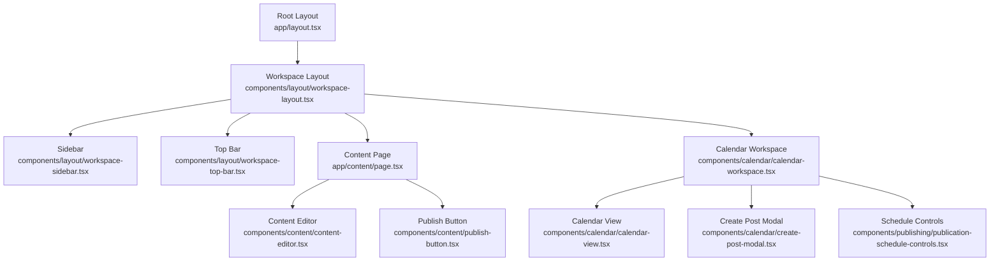
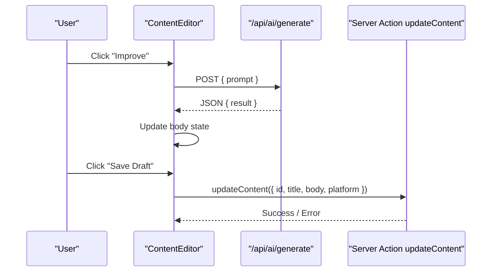
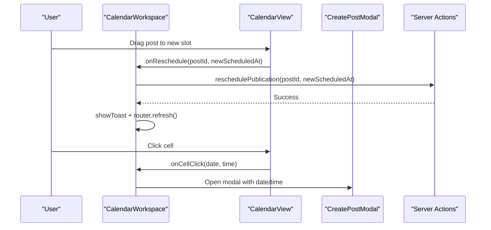
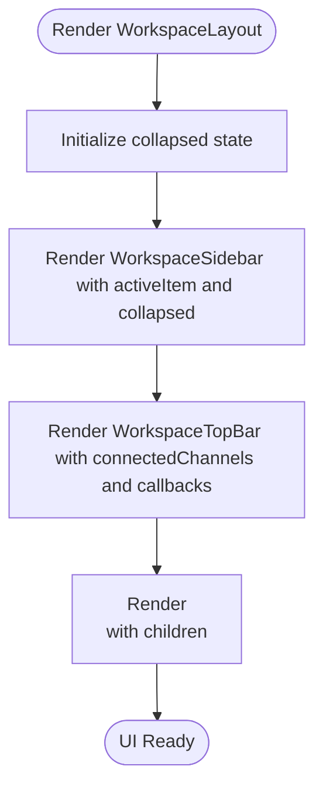
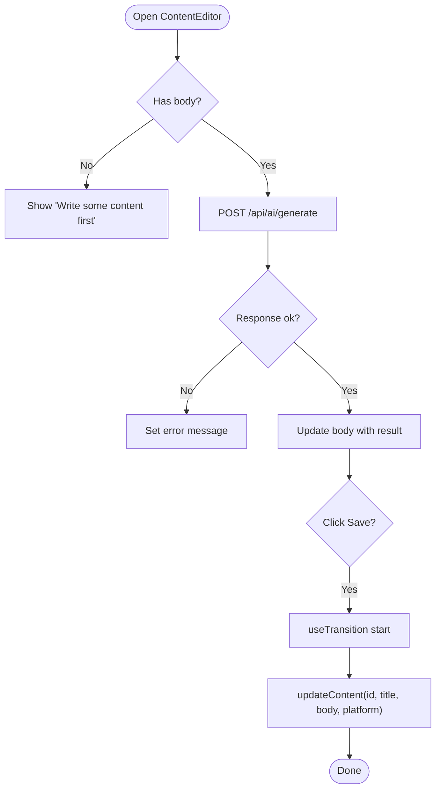
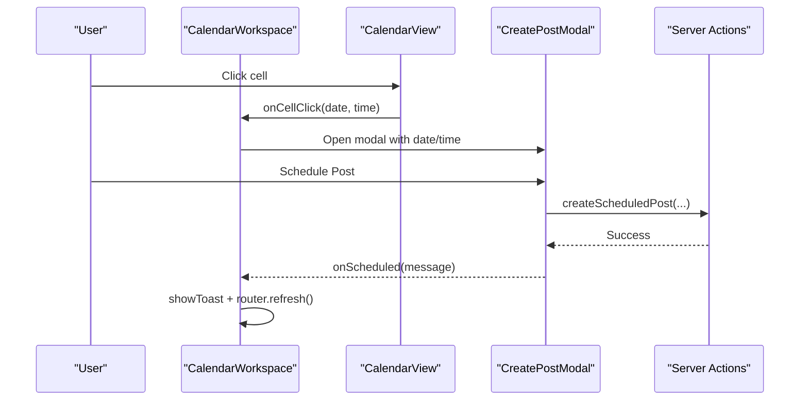
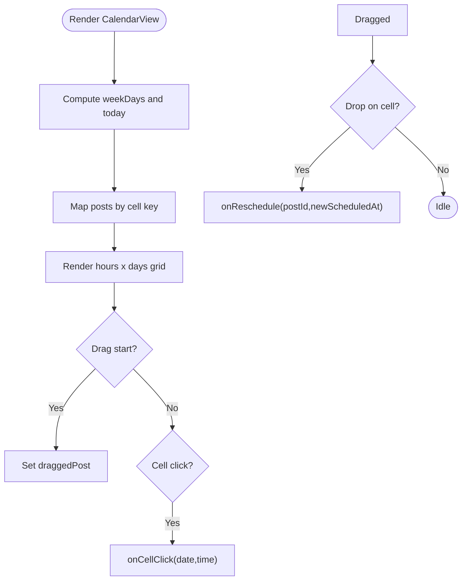
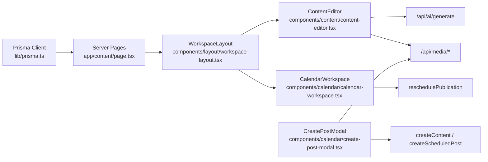

# Component Architecture

<cite>
**Referenced Files in This Document**
- [layout.tsx](file://app/layout.tsx)
- [workspace-layout.tsx](file://components/layout/workspace-layout.tsx)
- [workspace-sidebar.tsx](file://components/layout/workspace-sidebar.tsx)
- [workspace-top-bar.tsx](file://components/layout/workspace-top-bar.tsx)
- [content-editor.tsx](file://components/content/content-editor.tsx)
- [publish-button.tsx](file://components/content/publish-button.tsx)
- [calendar-workspace.tsx](file://components/calendar/calendar-workspace.tsx)
- [calendar-view.tsx](file://components/calendar/calendar-view.tsx)
- [create-post-modal.tsx](file://components/calendar/create-post-modal.tsx)
- [publication-schedule-controls.tsx](file://components/publishing/publication-schedule-controls.tsx)
- [page.tsx](file://app/content/page.tsx)
- [landing-client.tsx](file://components/landing-client.tsx)
- [prisma.ts](file://lib/prisma.ts)
</cite>

## Table of Contents
1. Introduction
2. Project Structure
3. Core Components
4. Architecture Overview
5. Detailed Component Analysis
6. Dependency Analysis
7. Performance Considerations
8. Troubleshooting Guide
9. Conclusion
10. Appendices

## Introduction
This document explains the React component architecture for a Next.js application that provides a unified content workspace. It focuses on:
- Workspace layout components that provide consistent UI structure
- Reusable patterns, props interfaces, and state management approaches
- Component composition strategies and interactions with server actions and API routes
- Styling with Tailwind CSS and responsive design patterns
- Accessibility considerations, performance optimizations, and testing strategies
- Lifecycle management and data fetching patterns in server components

## Project Structure
The application follows a feature-based organization under app/ and components/. The root layout sets global fonts and base styles. Feature pages wrap their content in shared workspace layouts to ensure consistent navigation and chrome.

**Diagram sources**
- [layout.tsx:27-38](file://app/layout.tsx#L27-L38)
- [workspace-layout.tsx:13-39](file://components/layout/workspace-layout.tsx#L13-L39)
- [workspace-sidebar.tsx:12-165](file://components/layout/workspace-sidebar.tsx#L12-L165)
- [workspace-top-bar.tsx:15-91](file://components/layout/workspace-top-bar.tsx#L15-L91)
- [page.tsx:6-99](file://app/content/page.tsx#L6-L99)
- [content-editor.tsx:75-595](file://components/content/content-editor.tsx#L75-L595)
- [publish-button.tsx:11-64](file://components/content/publish-button.tsx#L11-L64)
- [calendar-workspace.tsx:55-328](file://components/calendar/calendar-workspace.tsx#L55-L328)
- [calendar-view.tsx:52-307](file://components/calendar/calendar-view.tsx#L52-L307)
- [create-post-modal.tsx:79-558](file://components/calendar/create-post-modal.tsx#L79-L558)
- [publication-schedule-controls.tsx:13-180](file://components/publishing/publication-schedule-controls.tsx#L13-L180)

**Section sources**
- [layout.tsx:27-38](file://app/layout.tsx#L27-L38)
- [workspace-layout.tsx:13-39](file://components/layout/workspace-layout.tsx#L13-L39)
- [page.tsx:6-99](file://app/content/page.tsx#L6-L99)

## Core Components
- WorkspaceLayout: Provides a fixed sidebar and top bar with a scrollable main area. Manages collapsed state and passes active section to the sidebar.
- WorkspaceSidebar: Renders navigation links with active states and supports collapse/expand behavior.
- WorkspaceTopBar: Displays platform channel avatars, upload media trigger, and optional sidebar toggle.
- ContentEditor: Client-side editor with title/body/platform fields, media upload/delete, AI-assisted editing via API, and save via server action.
- PublishButton: Triggers publishing via server action with pending/error states.
- CalendarWorkspace: Orchestrates calendar view, media drawer, create post modal, toast notifications, and rescheduling via server actions.
- CalendarView: Week grid with drag-and-drop rescheduling, time indicator, and cell click handlers.
- CreatePostModal: Composes editor, media picker, AI assistant panel, scheduling controls, and uploads media via API routes.
- PublicationScheduleControls: Schedules or cancels publications using server actions with local datetime-to-UTC conversion.

Props Interfaces (selected):
- WorkspaceLayoutProps: children, activeItem enum, connectedChannels array
- WorkspaceSidebarProps: activeItem enum, onToggle, collapsed boolean
- WorkspaceTopBarProps: connectedChannels array, onUploadMedia, onToggleSidebar
- ContentEditorProps: id, initialTitle, initialBody, initialPlatform, initialMedia[], disabled
- CalendarViewProps: posts, weekStart, onCellClick, onPostClick, onReschedule, onMediaDrop
- CreatePostModalProps: open, onClose, date, time, connectedPlatforms, connectedChannels, onScheduled, initialMedia
- PublicationScheduleControlsProps: publicationId, status, scheduledAt

State Management Approaches:
- Local state with useState for UI state (collapsed sidebar, modals, form fields, selection)
- useTransition for optimistic UI during mutations (save, publish, schedule)
- Router refresh after successful mutations where appropriate
- Server components fetch data once and pass as props to client components

Styling:
- Tailwind utility classes throughout for layout, spacing, colors, and responsive breakpoints
- Consistent dark theme with zinc palette and accent colors
- Responsive grids and flexible containers for mobile-first design

Accessibility:
- Semantic HTML elements (aside, nav, main, header)
- Descriptive labels and aria attributes where applicable (e.g., close buttons with aria-label)
- Keyboard support for modals (Escape key handling)

**Section sources**
- [workspace-layout.tsx:7-39](file://components/layout/workspace-layout.tsx#L7-L39)
- [workspace-sidebar.tsx:6-165](file://components/layout/workspace-sidebar.tsx#L6-L165)
- [workspace-top-bar.tsx:5-91](file://components/layout/workspace-top-bar.tsx#L5-L91)
- [content-editor.tsx:6-22](file://components/content/content-editor.tsx#L6-L22)
- [publish-button.tsx:6-16](file://components/content/publish-button.tsx#L6-L16)
- [calendar-workspace.tsx:17-45](file://components/calendar/calendar-workspace.tsx#L17-L45)
- [calendar-view.tsx:5-23](file://components/calendar/calendar-view.tsx#L5-L23)
- [create-post-modal.tsx:10-25](file://components/calendar/create-post-modal.tsx#L10-L25)
- [publication-schedule-controls.tsx:7-11](file://components/publishing/publication-schedule-controls.tsx#L7-L11)

## Architecture Overview
The application uses a layered approach:
- Root layout defines global fonts and base body structure
- Feature pages compose WorkspaceLayout to provide consistent chrome
- Client components manage interactivity; server components handle data fetching
- Mutations are performed via server actions (for persistence) and API routes (for file uploads and AI generation)

**Diagram sources**
- [content-editor.tsx:99-157](file://components/content/content-editor.tsx#L99-L157)

**Diagram sources**
- [calendar-view.tsx:133-183](file://components/calendar/calendar-view.tsx#L133-L183)
- [calendar-workspace.tsx:138-155](file://components/calendar/calendar-workspace.tsx#L138-L155)
- [create-post-modal.tsx:201-242](file://components/calendar/create-post-modal.tsx#L201-L242)

## Detailed Component Analysis

### WorkspaceLayout
- Purpose: Provide consistent workspace shell with collapsible sidebar and top bar
- State: collapsed boolean controlling sidebar width
- Composition: renders WorkspaceSidebar and WorkspaceTopBar, passes activeItem and connectedChannels
- Styling: flex layout, full viewport height, overflow hidden, dynamic marginLeft based on collapsed state

**Diagram sources**
- [workspace-layout.tsx:13-39](file://components/layout/workspace-layout.tsx#L13-L39)

**Section sources**
- [workspace-layout.tsx:13-39](file://components/layout/workspace-layout.tsx#L13-L39)

### WorkspaceSidebar
- Purpose: Navigation with active item highlighting and collapse toggle
- Props: activeItem enum, onToggle callback, collapsed boolean
- Behavior: Links to overview, ideas, content, ai-studio, calendar, publishing, analytics, custom-analytics
- Styling: Fixed aside with transition, icon-only mode when collapsed

**Section sources**
- [workspace-sidebar.tsx:6-165](file://components/layout/workspace-sidebar.tsx#L6-L165)

### WorkspaceTopBar
- Purpose: Global actions including media upload and profile selection
- Props: connectedChannels array, onUploadMedia callback, onToggleSidebar callback
- Behavior: Displays platform avatars with brand colors, upload button, and optional sidebar toggle

**Section sources**
- [workspace-top-bar.tsx:5-91](file://components/layout/workspace-top-bar.tsx#L5-L91)

### ContentEditor
- Purpose: Edit content title/body/platform, manage media, integrate AI improvements, and save via server action
- State: title, body, platform, media list, upload/deleting flags, AI action/error
- Interactions:
  - AI: POST to /api/ai/generate with instruction and current platform/content
  - Media: Upload via /api/media/upload, delete via /api/media/[id]
  - Save: Call server action updateContent within useTransition
- Validation: Allowed media types, max file size, required fields before AI actions
- Styling: Form inputs, drag-and-drop zone, responsive grid for media thumbnails

**Diagram sources**
- [content-editor.tsx:99-157](file://components/content/content-editor.tsx#L99-L157)

**Section sources**
- [content-editor.tsx:6-22](file://components/content/content-editor.tsx#L6-L22)
- [content-editor.tsx:99-157](file://components/content/content-editor.tsx#L99-L157)
- [content-editor.tsx:165-230](file://components/content/content-editor.tsx#L165-L230)
- [content-editor.tsx:273-314](file://components/content/content-editor.tsx#L273-L314)

### PublishButton
- Purpose: Trigger publishing with pending state and error display
- Interaction: Calls server action publishContent within useTransition
- Conditional rendering: Shows published status or hides if not READY

**Section sources**
- [publish-button.tsx:6-64](file://components/content/publish-button.tsx#L6-L64)

### CalendarWorkspace
- Purpose: Orchestrate calendar features, media drawer, create post modal, and toast notifications
- State: weekStart, activeView, mediaDrawerOpen, createPostOpen, selectedPost, toastVisible/message/type
- Interactions:
  - Reschedule: calls server action reschedulePublication and refreshes router
  - Upload media: POST to /api/media/upload
  - Media drag-and-drop: passes media data to create post modal
- Composition: WorkspaceSidebar, WorkspaceTopBar, CalendarToolbar, CalendarView, MediaDrawer, CreatePostModal, Toast

**Diagram sources**
- [calendar-workspace.tsx:114-155](file://components/calendar/calendar-workspace.tsx#L114-L155)
- [create-post-modal.tsx:201-242](file://components/calendar/create-post-modal.tsx#L201-L242)

**Section sources**
- [calendar-workspace.tsx:55-328](file://components/calendar/calendar-workspace.tsx#L55-L328)

### CalendarView
- Purpose: Weekly grid with hour rows, day columns, post items, drag-and-drop rescheduling, and current time indicator
- State: currentTime, draggedPost, dragOverCell
- Interactions:
  - Drag start: set draggedPost and transfer data
  - Drop: compute newScheduledAt and call onReschedule
  - Cell click: call onCellClick with date/time
- Performance: useMemo for weekDays, postsByCell mapping, timeIndicator; interval timer for current time

**Diagram sources**
- [calendar-view.tsx:79-112](file://components/calendar/calendar-view.tsx#L79-L112)
- [calendar-view.tsx:133-183](file://components/calendar/calendar-view.tsx#L133-L183)

**Section sources**
- [calendar-view.tsx:52-307](file://components/calendar/calendar-view.tsx#L52-L307)

### CreatePostModal
- Purpose: Compose editor, media picker, AI assistant panel, scheduling controls, and media uploads
- State: selectedChannels, body, media, isSaving/isScheduling, error, showMediaPicker/showAiPanel, scheduleDate/scheduleTime
- Interactions:
  - Save draft: createContent via server action, then upload pending media via /api/media/upload
  - Schedule: createScheduledPost via server action, then upload pending media
  - Media: open media picker, add/remove items, preview images/videos
- Accessibility: Escape key closes overlays; modal backdrop handles dismiss

**Section sources**
- [create-post-modal.tsx:79-558](file://components/calendar/create-post-modal.tsx#L79-L558)

### PublicationScheduleControls
- Purpose: Schedule or cancel publications with local datetime input converted to UTC
- State: open dropdown, value (datetime-local), isPending, error
- Interactions:
  - schedule: validate input, convert to UTC ISO, call schedulePublication server action
  - cancel: call cancelPublication server action
- Styling: Dropdown popover with validation messages

**Section sources**
- [publication-schedule-controls.tsx:13-180](file://components/publishing/publication-schedule-controls.tsx#L13-L180)

## Dependency Analysis
- Server components fetch data from Prisma and pass to client components
- Client components call server actions for mutations and API routes for media/AI
- Shared layout components are reused across feature pages

**Diagram sources**
- [prisma.ts:1-29](file://lib/prisma.ts#L1-L29)
- [page.tsx:6-99](file://app/content/page.tsx#L6-L99)
- [content-editor.tsx:99-157](file://components/content/content-editor.tsx#L99-L157)
- [calendar-workspace.tsx:138-155](file://components/calendar/calendar-workspace.tsx#L138-L155)
- [create-post-modal.tsx:171-242](file://components/calendar/create-post-modal.tsx#L171-L242)

**Section sources**
- [prisma.ts:1-29](file://lib/prisma.ts#L1-L29)
- [page.tsx:6-99](file://app/content/page.tsx#L6-L99)

## Performance Considerations
- Use useMemo for expensive computations (weekDays, postsByCell, timeIndicator)
- Debounce or throttle frequent updates (e.g., current time indicator)
- Avoid unnecessary re-renders by lifting minimal state and passing stable callbacks
- Prefer server components for data fetching to reduce client bundle size
- Use useTransition for non-blocking UI updates during mutations
- Optimize media previews with lazy loading and appropriate sizes

[No sources needed since this section provides general guidance]

## Troubleshooting Guide
Common issues and resolutions:
- AI generation errors: Check response.ok and handle empty results; display user-friendly messages
- Media upload failures: Validate file type and size; surface error messages; reset file input
- Delete media errors: Confirm deletion; handle network errors; maintain optimistic UI rollback
- Scheduling validation: Ensure future datetime; convert local time to UTC; show validation errors
- Server action errors: Wrap mutations in try/catch; display errors; avoid blocking UI with transitions

**Section sources**
- [content-editor.tsx:128-145](file://components/content/content-editor.tsx#L128-L145)
- [content-editor.tsx:172-229](file://components/content/content-editor.tsx#L172-L229)
- [content-editor.tsx:291-314](file://components/content/content-editor.tsx#L291-L314)
- [publication-schedule-controls.tsx:30-73](file://components/publishing/publication-schedule-controls.tsx#L30-L73)

## Conclusion
The component architecture emphasizes a consistent workspace layout, reusable UI primitives, and clear separation between server-side data fetching and client-side interactivity. Mutations are handled through server actions and API routes, ensuring secure and scalable operations. Tailwind CSS enables rapid, responsive styling, while careful state management and performance techniques keep the interface smooth. Accessibility and robust error handling further improve the user experience.

[No sources needed since this section summarizes without analyzing specific files]

## Appendices

### Data Fetching Patterns in Server Components
- Server pages query Prisma directly and pass data as props to client components
- Example: Content page fetches content list and wraps it in WorkspaceLayout

**Section sources**
- [page.tsx:6-99](file://app/content/page.tsx#L6-L99)
- [prisma.ts:1-29](file://lib/prisma.ts#L1-L29)

### Testing Strategies
- Unit tests for pure functions (e.g., formatHour, dateKey)
- Component tests for interactive pieces (modals, editors) using React Testing Library
- Integration tests for workflows (create post -> schedule -> reschedule)
- Mock server actions and API routes to isolate component behavior
- Snapshot tests for static UI sections (landing page visuals)

[No sources needed since this section provides general guidance]