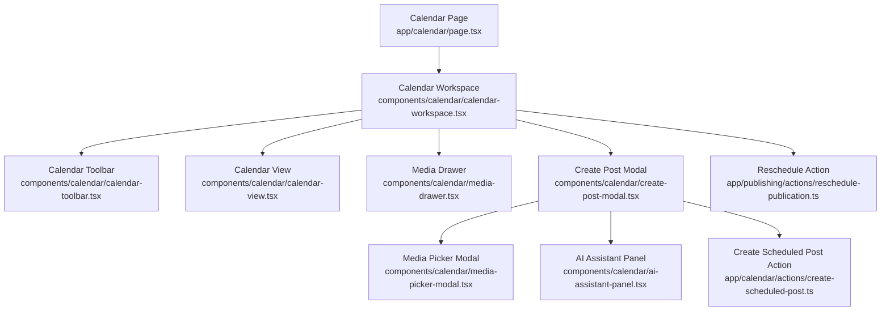
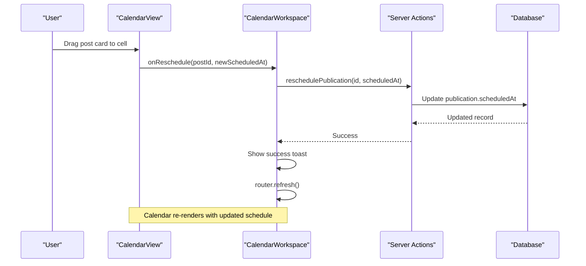
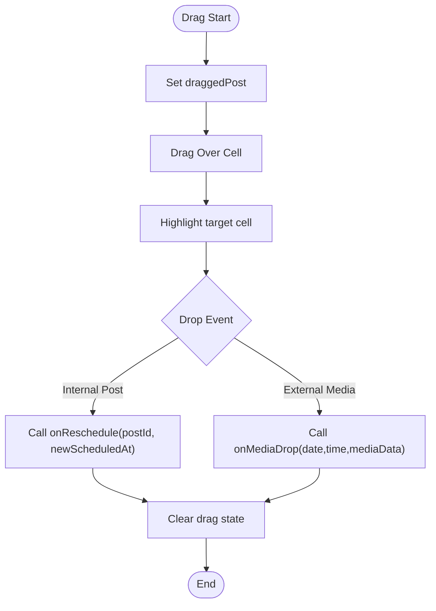
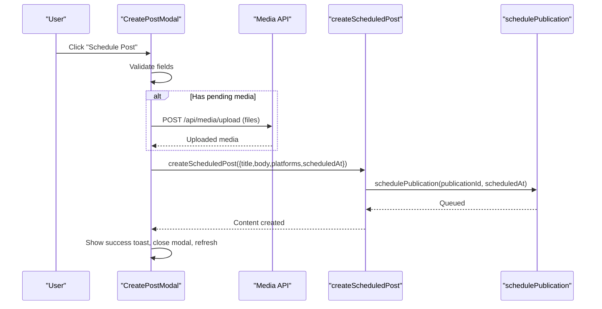
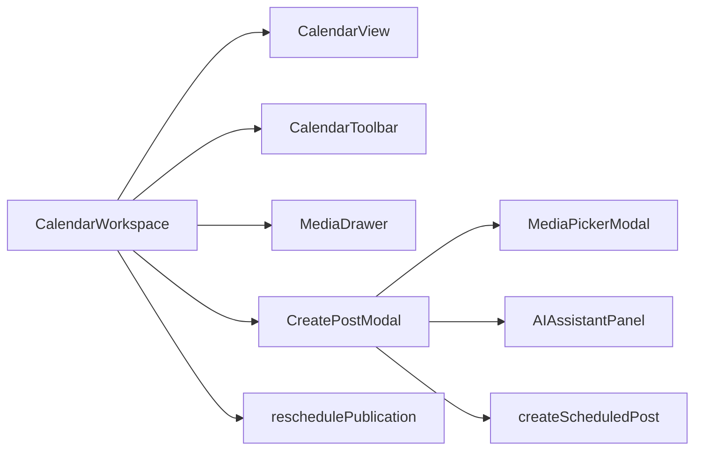

# Calendar Components

<cite>
**Referenced Files in This Document**
- [calendar-workspace.tsx](file://components/calendar/calendar-workspace.tsx)
- [calendar-view.tsx](file://components/calendar/calendar-view.tsx)
- [calendar-toolbar.tsx](file://components/calendar/calendar-toolbar.tsx)
- [create-post-modal.tsx](file://components/calendar/create-post-modal.tsx)
- [media-drawer.tsx](file://components/calendar/media-drawer.tsx)
- [media-picker-modal.tsx](file://components/calendar/media-picker-modal.tsx)
- [ai-assistant-panel.tsx](file://components/calendar/ai-assistant-panel.tsx)
- [page.tsx](file://app/calendar/page.tsx)
- [create-scheduled-post.ts](file://app/calendar/actions/create-scheduled-post.ts)
- [reschedule-publication.ts](file://app/publishing/actions/reschedule-publication.ts)
</cite>

## Table of Contents
1. [Introduction](#introduction)
2. [Project Structure](#project-structure)
3. [Core Components](#core-components)
4. [Architecture Overview](#architecture-overview)
5. [Detailed Component Analysis](#detailed-component-analysis)
6. [Dependency Analysis](#dependency-analysis)
7. [Performance Considerations](#performance-considerations)
8. [Accessibility and Responsive Design](#accessibility-and-responsive-design)
9. [Testing Strategies](#testing-strategies)
10. [Troubleshooting Guide](#troubleshooting-guide)
11. [Conclusion](#conclusion)

## Introduction
This document provides comprehensive documentation for the calendar-related React components that power scheduling, media management, and content creation workflows. It focuses on:
- CalendarView’s drag-and-drop scheduling interface (post rescheduling, media dropping, real-time updates)
- CalendarToolbar’s navigation controls, view switching, and filtering options
- CreatePostModal’s form handling, validation patterns, and integration with content creation workflows
- MediaDrawer’s file management, preview capabilities, and drag-and-drop functionality
- State management approaches, event handling patterns, and performance optimizations for large datasets
- Accessibility features, responsive design considerations, and testing strategies for complex interactive calendar interfaces

## Project Structure
The calendar feature is implemented as a client-side workspace composed of several focused components and server actions:
- app/calendar/page.tsx loads scheduled publications and connected channels from the database and passes them to the workspace component.
- components/calendar/calendar-workspace.tsx orchestrates state, UI panels, and interactions between toolbar, calendar grid, media drawer, and post modal.
- components/calendar/calendar-view.tsx renders the weekly grid, handles drag-and-drop for posts and media, and shows a live time indicator.
- components/calendar/calendar-toolbar.tsx provides week navigation, “Today” button, date range display, timezone info, and view toggles.
- components/calendar/create-post-modal.tsx manages creating or editing posts, selecting platforms/channels, attaching media, and scheduling via server actions.
- components/calendar/media-drawer.tsx opens a side panel to browse, select, and drag media into the calendar.
- components/calendar/media-picker-modal.tsx offers an upload-and-select flow for existing media assets.
- components/calendar/ai-assistant-panel.tsx integrates AI text/image/video generation to assist content creation.
- Server actions create and reschedule publications and persist data to the database.

**Diagram sources**
- [page.tsx:1-80](file://app/calendar/page.tsx#L1-L80)
- [calendar-workspace.tsx:1-329](file://components/calendar/calendar-workspace.tsx#L1-L329)
- [calendar-toolbar.tsx:1-116](file://components/calendar/calendar-toolbar.tsx#L1-L116)
- [calendar-view.tsx:1-308](file://components/calendar/calendar-view.tsx#L1-L308)
- [media-drawer.tsx:1-167](file://components/calendar/media-drawer.tsx#L1-L167)
- [create-post-modal.tsx:1-559](file://components/calendar/create-post-modal.tsx#L1-L559)
- [media-picker-modal.tsx:1-329](file://components/calendar/media-picker-modal.tsx#L1-L329)
- [ai-assistant-panel.tsx:1-409](file://components/calendar/ai-assistant-panel.tsx#L1-L409)
- [create-scheduled-post.ts:1-67](file://app/calendar/actions/create-scheduled-post.ts#L1-L67)
- [reschedule-publication.ts:1-59](file://app/publishing/actions/reschedule-publication.ts#L1-L59)

**Section sources**
- [page.tsx:1-80](file://app/calendar/page.tsx#L1-L80)
- [calendar-workspace.tsx:1-329](file://components/calendar/calendar-workspace.tsx#L1-L329)

## Core Components
- CalendarWorkspace: Central state holder for week navigation, active view, media drawer visibility, post creation/editing, toast notifications, and event coordination.
- CalendarView: Weekly grid rendering with per-hour rows, day columns, post cards, drag-and-drop for rescheduling, media drop support, and current-time indicator.
- CalendarToolbar: Navigation controls (previous/next week, today), date range label, timezone display, and view switcher (week/month/list).
- CreatePostModal: Form for composing posts, selecting platforms/channels, attaching media, scheduling with date/time inputs, and invoking server actions to save or schedule.
- MediaDrawer: Side panel listing media items fetched from API, enabling selection and drag-to-calendar; includes links to manage media.
- MediaPickerModal: Modal for browsing existing media, uploading new files, and selecting one to attach to a post.
- AIAssistantPanel: Panel to generate text, images, or videos via AI APIs and use results in the post editor.

**Section sources**
- [calendar-workspace.tsx:1-329](file://components/calendar/calendar-workspace.tsx#L1-L329)
- [calendar-view.tsx:1-308](file://components/calendar/calendar-view.tsx#L1-L308)
- [calendar-toolbar.tsx:1-116](file://components/calendar/calendar-toolbar.tsx#L1-L116)
- [create-post-modal.tsx:1-559](file://components/calendar/create-post-modal.tsx#L1-L559)
- [media-drawer.tsx:1-167](file://components/calendar/media-drawer.tsx#L1-L167)
- [media-picker-modal.tsx:1-329](file://components/calendar/media-picker-modal.tsx#L1-L329)
- [ai-assistant-panel.tsx:1-409](file://components/calendar/ai-assistant-panel.tsx#L1-L409)

## Architecture Overview
The calendar page fetches scheduled publications and connected channels, then composes a list of posts with media and channel metadata. The workspace coordinates user interactions across the toolbar, grid, media drawer, and modal, delegating persistence to server actions. Drag-and-drop flows are handled at the component level with data transfer payloads bridging UI events to business logic.

**Diagram sources**
- [calendar-view.tsx:133-178](file://components/calendar/calendar-view.tsx#L133-L178)
- [calendar-workspace.tsx:138-155](file://components/calendar/calendar-workspace.tsx#L138-L155)
- [reschedule-publication.ts:1-59](file://app/publishing/actions/reschedule-publication.ts#L1-L59)

**Section sources**
- [page.tsx:1-80](file://app/calendar/page.tsx#L1-L80)
- [calendar-workspace.tsx:1-329](file://components/calendar/calendar-workspace.tsx#L1-L329)

## Detailed Component Analysis

### CalendarView: Drag-and-Drop Scheduling Interface
Responsibilities:
- Render a weekly grid with hours and days, grouping posts by cell key for efficient lookup.
- Support dragging posts to reschedule them to a new date/time slot.
- Accept external media drops from the media drawer and delegate to the workspace.
- Display a live current-time indicator within the current week.
- Provide click handlers to open the create/edit post modal.

Key implementation highlights:
- Uses useMemo to compute weekDays, postsByCell mapping, and timeIndicator for performance.
- Maintains local drag state (draggedPost, dragOverCell) to highlight target cells and handle internal vs external drops.
- Formats hour labels and computes cell keys using date helpers.
- Integrates platform-specific colors for visual distinction.

**Diagram sources**
- [calendar-view.tsx:133-178](file://components/calendar/calendar-view.tsx#L133-L178)

**Section sources**
- [calendar-view.tsx:1-308](file://components/calendar/calendar-view.tsx#L1-L308)

### CalendarToolbar: Navigation Controls, View Switching, Filtering
Responsibilities:
- Navigate weeks (previous/next), jump to today.
- Display formatted date range for the current week.
- Show user’s timezone string.
- Toggle active view among week/month/list.

Implementation notes:
- Computes end-of-week date and formats month/day/year ranges based on whether months/years differ.
- Reads timezone via Intl.DateTimeFormat().resolvedOptions().timeZone.
- Provides simple buttons for navigation and view selection.

**Section sources**
- [calendar-toolbar.tsx:1-116](file://components/calendar/calendar-toolbar.tsx#L1-L116)

### CreatePostModal: Form Handling, Validation, Workflow Integration
Responsibilities:
- Compose post content with rich text-like toolbar placeholders.
- Select connected platforms/channels for publishing.
- Attach media via picker or AI assistant.
- Schedule or save draft with validation and error handling.
- Integrate with server actions to create content and schedule publications.

Validation and workflow:
- Validates presence of body, selected channels, and scheduled date/time before scheduling.
- Uploads pending media to /api/media/upload and associates existing media via /api/media.
- Calls createScheduledPost server action to persist content and schedule publications across connected channels.
- Shows toast feedback and refreshes the page after successful scheduling.

**Diagram sources**
- [create-post-modal.tsx:171-242](file://components/calendar/create-post-modal.tsx#L171-L242)
- [create-scheduled-post.ts:15-66](file://app/calendar/actions/create-scheduled-post.ts#L15-L66)

**Section sources**
- [create-post-modal.tsx:1-559](file://components/calendar/create-post-modal.tsx#L1-L559)
- [create-scheduled-post.ts:1-67](file://app/calendar/actions/create-scheduled-post.ts#L1-L67)

### MediaDrawer: File Management, Preview, Drag-and-Drop
Responsibilities:
- Fetch and display media library items.
- Allow selecting a media item or dragging it to the calendar.
- Provide link to manage media and sections for UGC collection and contributors.

Implementation notes:
- Loads media when opened via GET /api/media.
- Sets dataTransfer payload to application/json with media object for drag operations.
- Closes on Escape key and uses backdrop to dismiss.

**Section sources**
- [media-drawer.tsx:1-167](file://components/calendar/media-drawer.tsx#L1-L167)

### MediaPickerModal: Upload and Selection Flow
Responsibilities:
- Browse existing media, upload new files, and select one to attach to a post.
- Supports photos tab with grid layout and video/image previews.
- Displays loading states and errors during load/upload.

**Section sources**
- [media-picker-modal.tsx:1-329](file://components/calendar/media-picker-modal.tsx#L1-L329)

### AIAssistantPanel: Content Generation Integration
Responsibilities:
- Generate text, images, or videos via AI endpoints.
- Present generated results with discard/use actions.
- Feed results back into the post modal as content or media.

**Section sources**
- [ai-assistant-panel.tsx:1-409](file://components/calendar/ai-assistant-panel.tsx#L1-L409)

## Dependency Analysis
High-level dependencies:
- CalendarWorkspace depends on CalendarView, CalendarToolbar, MediaDrawer, CreatePostModal, and server actions for rescheduling and creation.
- CalendarView depends on props for posts, weekStart, and callbacks for interactions.
- CreatePostModal depends on server actions and media APIs.
- MediaDrawer and MediaPickerModal depend on /api/media endpoints.

**Diagram sources**
- [calendar-workspace.tsx:1-329](file://components/calendar/calendar-workspace.tsx#L1-L329)
- [calendar-view.tsx:1-308](file://components/calendar/calendar-view.tsx#L1-L308)
- [calendar-toolbar.tsx:1-116](file://components/calendar/calendar-toolbar.tsx#L1-L116)
- [create-post-modal.tsx:1-559](file://components/calendar/create-post-modal.tsx#L1-L559)
- [media-drawer.tsx:1-167](file://components/calendar/media-drawer.tsx#L1-L167)
- [media-picker-modal.tsx:1-329](file://components/calendar/media-picker-modal.tsx#L1-L329)
- [ai-assistant-panel.tsx:1-409](file://components/calendar/ai-assistant-panel.tsx#L1-L409)
- [reschedule-publication.ts:1-59](file://app/publishing/actions/reschedule-publication.ts#L1-L59)
- [create-scheduled-post.ts:1-67](file://app/calendar/actions/create-scheduled-post.ts#L1-L67)

**Section sources**
- [calendar-workspace.tsx:1-329](file://components/calendar/calendar-workspace.tsx#L1-L329)

## Performance Considerations
- Memoization: CalendarView uses useMemo for weekDays, postsByCell mapping, and timeIndicator to avoid recomputation on every render.
- Efficient lookups: postsByCell builds a Map keyed by date-hour for O(1) retrieval of posts per cell.
- Real-time updates: A setInterval updates currentTime every minute to move the time indicator; consider debouncing or throttling if frequent updates cause jank.
- Scroll positioning: Auto-scroll to current hour on week change improves usability without heavy computation.
- Data fetching: MediaDrawer and MediaPickerModal fetch media only when needed; ensure pagination or virtualization for large libraries.
- Transitions: Workspace uses React transitions for non-blocking UI updates during rescheduling and uploads.

[No sources needed since this section provides general guidance]

## Accessibility and Responsive Design
- Keyboard support:
  - Escape key closes modals and drawers where implemented.
  - Focus management could be enhanced by trapping focus inside modals and returning focus to trigger elements.
- ARIA attributes:
  - Add aria-labels to icon-only buttons (e.g., navigation arrows, settings gear).
  - Use role="dialog" and aria-modal for modals/drawers to improve screen reader experience.
- Color contrast and focus indicators:
  - Ensure sufficient contrast for text and interactive elements.
  - Visible focus rings for keyboard navigation.
- Responsive behavior:
  - Calendar grid uses min-width and flexible columns; test on smaller screens and consider collapsing time labels or switching to a different view.
  - Media drawer overlays adapt to viewport width; ensure touch targets are appropriately sized.

[No sources needed since this section provides general guidance]

## Testing Strategies
- Unit tests:
  - CalendarView: Test postsByCell mapping correctness, timeIndicator calculation, and drag handlers’ state changes.
  - CalendarToolbar: Test date range formatting logic for same month/year scenarios.
  - CreatePostModal: Test validation paths (missing body, channels, date/time) and mock server actions for scheduling and media uploads.
  - MediaDrawer/MediaPickerModal: Test media fetching, upload flow, and selection callbacks.
- Integration tests:
  - Simulate drag-and-drop from MediaDrawer to CalendarView and verify onMediaDrop invocation and subsequent modal opening.
  - Simulate post rescheduling via drag-and-drop and assert server action calls and toast messages.
- Visual regression:
  - Capture screenshots of calendar views across breakpoints to detect layout shifts.
- Accessibility tests:
  - Use axe-core or similar tools to validate keyboard navigation and ARIA usage in modals and drawers.

[No sources needed since this section provides general guidance]

## Troubleshooting Guide
Common issues and resolutions:
- Rescheduling fails:
  - Ensure scheduledAt is in the future and publication status allows rescheduling. Check server action validations and error messages.
- Media not appearing:
  - Verify /api/media returns expected structure and that media types are supported. Confirm uploads succeed and media IDs are passed correctly.
- Drag-and-drop not working in Firefox:
  - Ensure dataTransfer.setData("text/plain", id) is set alongside JSON payload for compatibility.
- Time indicator not visible:
  - Confirm the current week contains today; otherwise, the indicator is intentionally hidden.
- Modal does not close on Escape:
  - Ensure onKeyDown handlers are attached to modal containers and stop propagation where necessary.

**Section sources**
- [reschedule-publication.ts:1-59](file://app/publishing/actions/reschedule-publication.ts#L1-L59)
- [calendar-view.tsx:133-178](file://components/calendar/calendar-view.tsx#L133-L178)
- [create-post-modal.tsx:171-242](file://components/calendar/create-post-modal.tsx#L171-L242)

## Conclusion
The calendar components provide a cohesive scheduling interface with robust drag-and-drop, media integration, and AI-assisted content creation. The architecture separates concerns across focused components while coordinating through a central workspace. Performance optimizations like memoization and efficient data structures support smooth interactions even with larger datasets. Accessibility and responsive design considerations should be further refined to enhance usability across devices and assistive technologies. Comprehensive testing strategies will ensure reliability and maintainability as the system evolves.