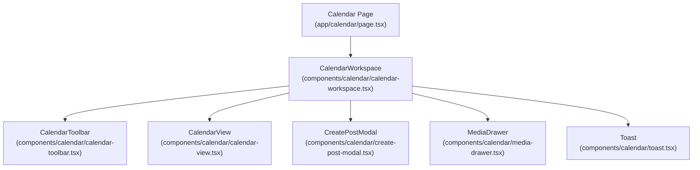
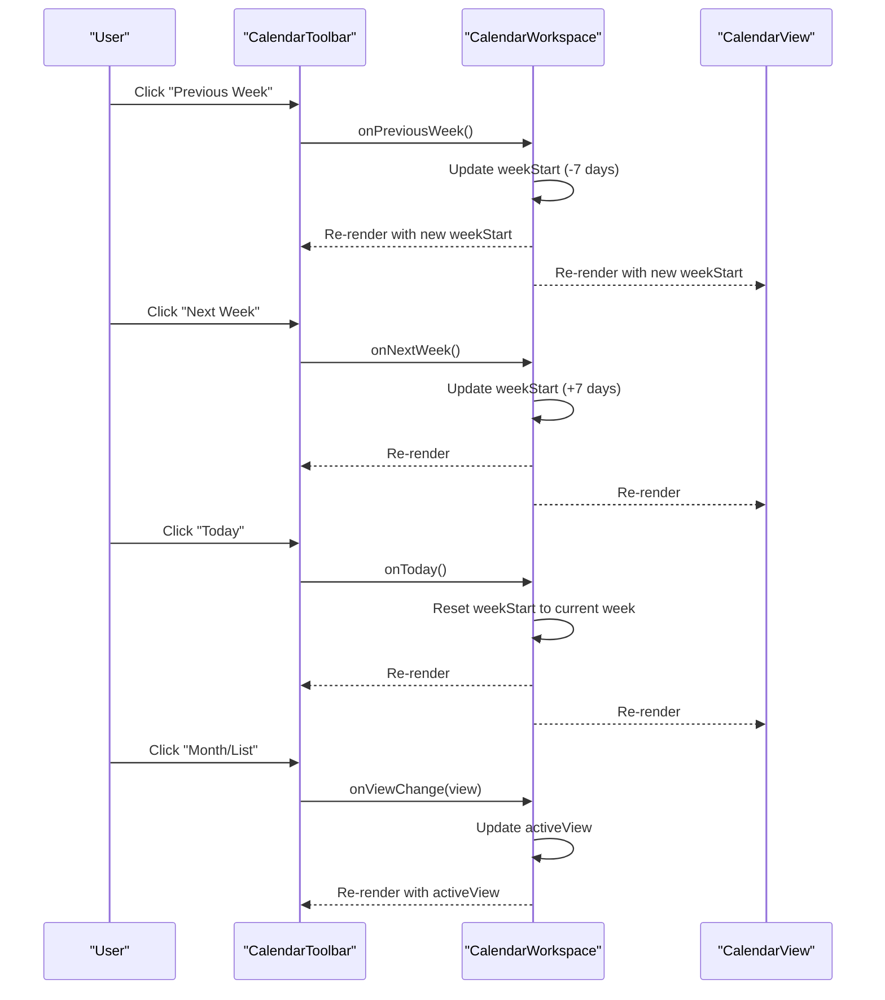
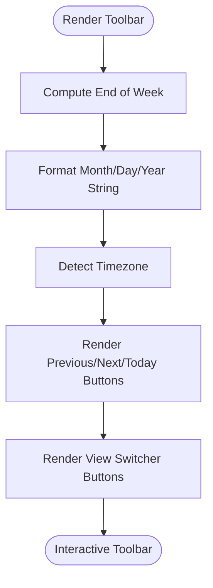
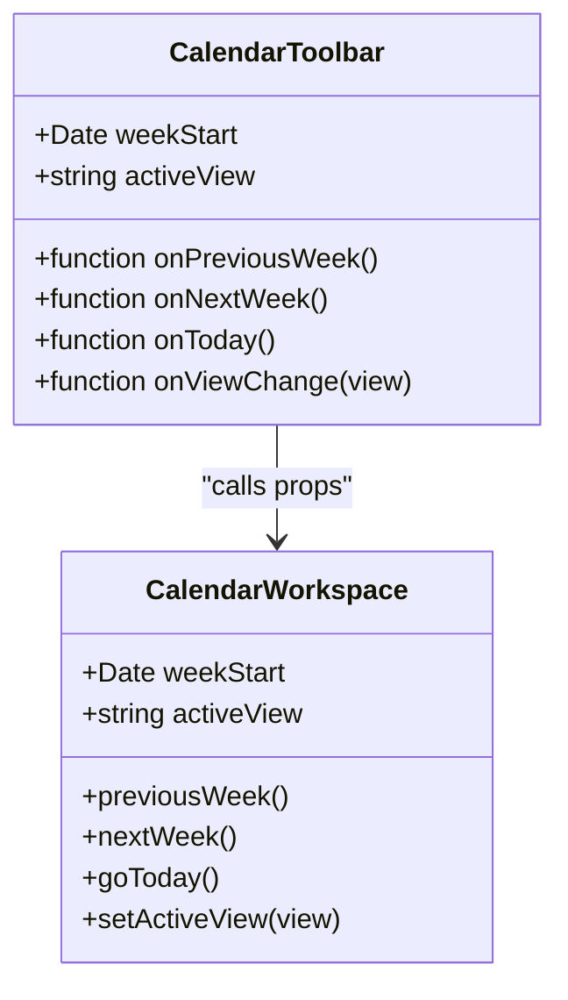
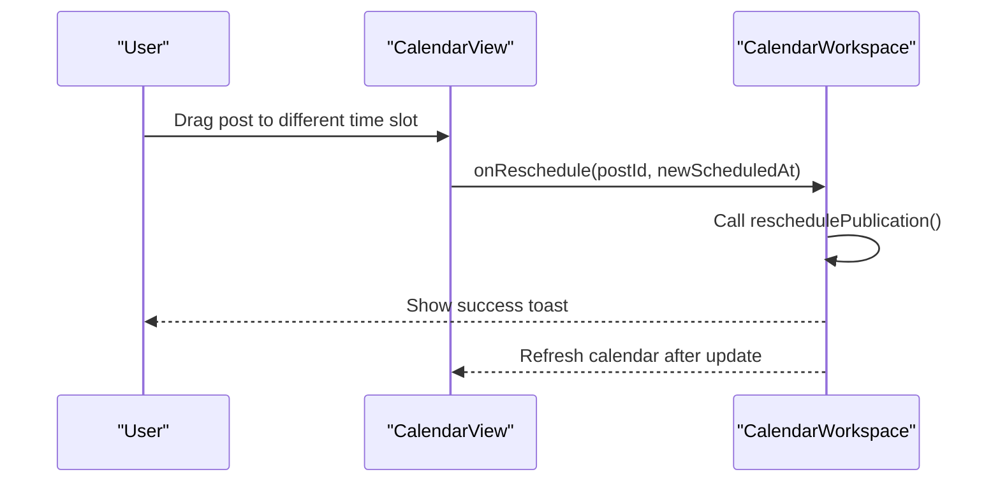
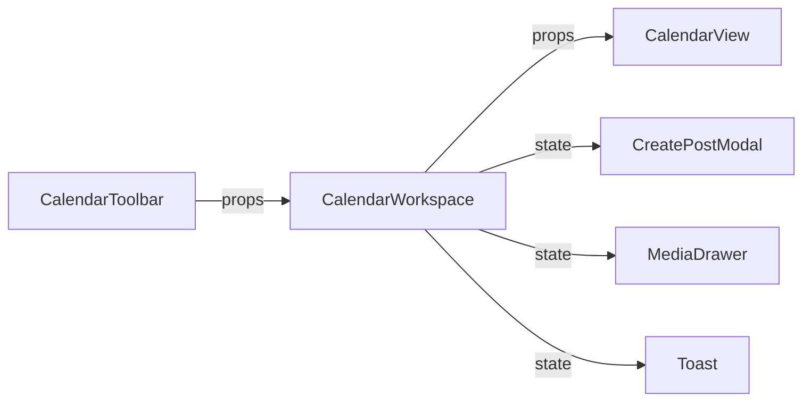

# Calendar Toolbar Component

<cite>
**Referenced Files in This Document**
- [calendar-toolbar.tsx](file://components/calendar/calendar-toolbar.tsx)
- [calendar-workspace.tsx](file://components/calendar/calendar-workspace.tsx)
- [calendar-view.tsx](file://components/calendar/calendar-view.tsx)
- [page.tsx](file://app/calendar/page.tsx)
- [create-post-modal.tsx](file://components/calendar/create-post-modal.tsx)
- [media-drawer.tsx](file://components/calendar/media-drawer.tsx)
- [toast.tsx](file://components/calendar/toast.tsx)
</cite>

## Table of Contents
1. [Introduction](#introduction)
2. [Project Structure](#project-structure)
3. [Core Components](#core-components)
4. [Architecture Overview](#architecture-overview)
5. [Detailed Component Analysis](#detailed-component-analysis)
6. [Dependency Analysis](#dependency-analysis)
7. [Performance Considerations](#performance-considerations)
8. [Troubleshooting Guide](#troubleshooting-guide)
9. [Conclusion](#conclusion)
10. [Appendices](#appendices)

## Introduction
This document provides comprehensive documentation for the CalendarToolbar component, which supplies navigation controls and view switching for the calendar interface. It explains how the toolbar navigates weeks, formats the displayed date range, switches between views, and integrates with parent state management. It also covers user interaction patterns, styling using Tailwind CSS, and the current capabilities and limitations regarding filtering and responsive behavior within the calendar workspace.

## Project Structure
The calendar feature is implemented as a set of client-side React components under components/calendar, orchestrated by a workspace component and rendered on a Next.js page. The key files involved are:
- CalendarToolbar: Navigation and view switcher UI
- CalendarWorkspace: Parent state holder for week navigation, active view, and event handlers
- CalendarView: Weekly grid rendering and interactions (drag-and-drop, click-to-create)
- CreatePostModal: Scheduling and editing posts
- MediaDrawer and Toast: Supporting UI elements

**Diagram sources**
- [page.tsx:1-80](file://app/calendar/page.tsx#L1-L80)
- [calendar-workspace.tsx:1-329](file://components/calendar/calendar-workspace.tsx#L1-L329)
- [calendar-toolbar.tsx:1-116](file://components/calendar/calendar-toolbar.tsx#L1-L116)
- [calendar-view.tsx:1-308](file://components/calendar/calendar-view.tsx#L1-L308)
- [create-post-modal.tsx:1-559](file://components/calendar/create-post-modal.tsx#L1-L559)
- [media-drawer.tsx:1-167](file://components/calendar/media-drawer.tsx#L1-L167)
- [toast.tsx:1-59](file://components/calendar/toast.tsx#L1-L59)

**Section sources**
- [page.tsx:1-80](file://app/calendar/page.tsx#L1-L80)
- [calendar-workspace.tsx:1-329](file://components/calendar/calendar-workspace.tsx#L1-L329)

## Core Components
- CalendarToolbar: Provides Today button, previous/next week navigation, formatted date range display, timezone indicator, and view switcher buttons (week/month/list). It receives callbacks to navigate and change views from its parent.
- CalendarWorkspace: Holds the current week start date and active view, implements navigation logic, and wires up events like cell clicks, post clicks, rescheduling, and media drops.
- CalendarView: Renders the weekly grid, handles drag-and-drop of posts and media, and exposes callbacks for creating or editing posts at specific times.
- CreatePostModal: Handles scheduling posts, selecting platforms/channels, attaching media, and integrating with AI assistant features.
- MediaDrawer and Toast: Provide media library access and feedback notifications.

**Section sources**
- [calendar-toolbar.tsx:1-116](file://components/calendar/calendar-toolbar.tsx#L1-L116)
- [calendar-workspace.tsx:1-329](file://components/calendar/calendar-workspace.tsx#L1-L329)
- [calendar-view.tsx:1-308](file://components/calendar/calendar-view.tsx#L1-L308)
- [create-post-modal.tsx:1-559](file://components/calendar/create-post-modal.tsx#L1-L559)
- [media-drawer.tsx:1-167](file://components/calendar/media-drawer.tsx#L1-L167)
- [toast.tsx:1-59](file://components/calendar/toast.tsx#L1-L59)

## Architecture Overview
The CalendarToolbar is a presentational component that delegates state changes to CalendarWorkspace via props. CalendarWorkspace manages the weekStart date and activeView, and passes them down to both CalendarToolbar and CalendarView. Interactions in the toolbar update the parent state, causing re-renders and updates across the calendar.

**Diagram sources**
- [calendar-toolbar.tsx:14-116](file://components/calendar/calendar-toolbar.tsx#L14-L116)
- [calendar-workspace.tsx:63-98](file://components/calendar/calendar-workspace.tsx#L63-L98)
- [calendar-view.tsx:52-86](file://components/calendar/calendar-view.tsx#L52-L86)

## Detailed Component Analysis

### CalendarToolbar: Navigation Features
- Week Navigation Buttons:
  - Previous Week: Calls onPreviousWeek to move back one week.
  - Next Week: Calls onNextWeek to move forward one week.
  - Today: Resets the view to the current week via onToday.
- Date Display Formatting:
  - Generates a localized date range string based on weekStart and end-of-week calculation.
  - Displays timezone information derived from the browser’s Intl API.
- View Switching:
  - Provides buttons for week, month, and list views.
  - Highlights the active view and calls onViewChange when clicked.

**Diagram sources**
- [calendar-toolbar.tsx:22-47](file://components/calendar/calendar-toolbar.tsx#L22-L47)
- [calendar-toolbar.tsx:49-113](file://components/calendar/calendar-toolbar.tsx#L49-L113)

**Section sources**
- [calendar-toolbar.tsx:22-47](file://components/calendar/calendar-toolbar.tsx#L22-L47)
- [calendar-toolbar.tsx:49-113](file://components/calendar/calendar-toolbar.tsx#L49-L113)

### CalendarToolbar: Integration with Parent State Management
- Props contract:
  - weekStart: Current week start date used to compute the displayed range.
  - onPreviousWeek, onNextWeek, onToday: Callbacks to adjust the week.
  - activeView, onViewChange: Control and update the active view mode.
- Event propagation:
  - Button onClick handlers call parent-provided functions directly; no custom event objects are created.
  - Changes propagate to CalendarView through shared weekStart prop.

**Diagram sources**
- [calendar-toolbar.tsx:5-21](file://components/calendar/calendar-toolbar.tsx#L5-L21)
- [calendar-workspace.tsx:63-98](file://components/calendar/calendar-workspace.tsx#L63-L98)

**Section sources**
- [calendar-toolbar.tsx:5-21](file://components/calendar/calendar-toolbar.tsx#L5-L21)
- [calendar-workspace.tsx:63-98](file://components/calendar/calendar-workspace.tsx#L63-L98)

### Filtering System: Content Types, Platforms, Status Filters
- Current implementation:
  - The CalendarToolbar does not include filters for content types, platforms, or status.
  - No search input or dropdowns for filtering are present in the toolbar.
- Related platform/channel selection exists in CreatePostModal for scheduling posts, but this is separate from toolbar filtering.
- Data fetching in the calendar page retrieves scheduled publications and connected channels, but filtering is not applied in the toolbar layer.

Recommendation: If filtering is required, add controlled inputs (e.g., dropdowns, toggles) to the toolbar and lift filter state to CalendarWorkspace, then pass filtered data to CalendarView.

**Section sources**
- [calendar-toolbar.tsx:1-116](file://components/calendar/calendar-toolbar.tsx#L1-L116)
- [create-post-modal.tsx:68-78](file://components/calendar/create-post-modal.tsx#L68-L78)
- [page.tsx:6-77](file://app/calendar/page.tsx#L6-L77)

### Responsive Design Implementation
- Toolbar layout:
  - Uses flexbox with horizontal spacing and alignment for consistent appearance across sizes.
  - No explicit breakpoints or mobile-specific adjustments are defined within the toolbar itself.
- CalendarView grid:
  - Uses a fixed minimum width for the grid container to ensure readability on smaller screens.
  - Scrollable vertical area with sticky headers and time column.
- Media panel and drawer:
  - MediaPanelClosed has a fixed width; MediaDrawer uses fixed positioning and width.
  - These may require additional responsive handling for narrow screens.

Guidance: Consider adding responsive classes (e.g., conditional padding, font sizes, or hiding less critical elements) to improve usability on mobile devices.

**Section sources**
- [calendar-toolbar.tsx:49-113](file://components/calendar/calendar-toolbar.tsx#L49-L113)
- [calendar-view.tsx:186-195](file://components/calendar/calendar-view.tsx#L186-L195)
- [media-panel-closed.tsx:27-28](file://components/calendar/media-panel-closed.tsx#L27-L28)
- [media-drawer.tsx:52-64](file://components/calendar/media-drawer.tsx#L52-L64)

### User Interaction Patterns
- Button clicks:
  - Today, Previous Week, Next Week trigger navigation callbacks.
  - View switcher buttons update the active view.
- Dropdown selections:
  - Not present in the toolbar currently.
- Search functionality:
  - Not present in the toolbar currently.
- Drag-and-drop:
  - Handled in CalendarView for rescheduling posts and dropping media into time slots.
- Keyboard support:
  - Escape key closes overlays in MediaDrawer and CreatePostModal; not part of the toolbar.

**Diagram sources**
- [calendar-view.tsx:133-178](file://components/calendar/calendar-view.tsx#L133-L178)
- [calendar-workspace.tsx:138-155](file://components/calendar/calendar-workspace.tsx#L138-L155)
- [toast.tsx:12-20](file://components/calendar/toast.tsx#L12-L20)

**Section sources**
- [calendar-view.tsx:133-178](file://components/calendar/calendar-view.tsx#L133-L178)
- [calendar-workspace.tsx:138-155](file://components/calendar/calendar-workspace.tsx#L138-L155)
- [media-drawer.tsx:40-48](file://components/calendar/media-drawer.tsx#L40-L48)
- [create-post-modal.tsx:271-281](file://components/calendar/create-post-modal.tsx#L271-L281)

### Styling Approaches and Theme Consistency
- Tailwind CSS usage:
  - Dark theme colors (e.g., background #0a0a0c, zinc tones) are consistently applied across components.
  - Accent color (#7C3AED) is used for primary actions and highlights.
- Component-level styles:
  - Toolbar uses flex layout, border-bottom, and hover transitions for interactive states.
  - View switcher buttons use active/inactive styles to indicate selected view.
- Consistency:
  - Shared color palette and typography scale maintain visual coherence with the application design system.

Best practices:
- Keep hover and focus states accessible and visually distinct.
- Maintain consistent spacing and sizing for buttons and labels.
- Use semantic HTML and ARIA attributes where appropriate for accessibility.

**Section sources**
- [calendar-toolbar.tsx:49-113](file://components/calendar/calendar-toolbar.tsx#L49-L113)
- [calendar-view.tsx:186-301](file://components/calendar/calendar-view.tsx#L186-L301)
- [create-post-modal.tsx:271-514](file://components/calendar/create-post-modal.tsx#L271-L514)

## Dependency Analysis
- CalendarToolbar depends on:
  - React hooks (useState, useEffect) for local state (timezone).
  - Parent-provided props for navigation and view control.
- CalendarWorkspace depends on:
  - Next.js router for navigation and refresh.
  - Server actions for rescheduling posts.
  - Child components: CalendarToolbar, CalendarView, CreatePostModal, MediaDrawer, Toast.
- CalendarView depends on:
  - Local state for current time, drag-and-drop state.
  - Props for posts, weekStart, and callbacks.

**Diagram sources**
- [calendar-toolbar.tsx:1-116](file://components/calendar/calendar-toolbar.tsx#L1-L116)
- [calendar-workspace.tsx:1-329](file://components/calendar/calendar-workspace.tsx#L1-L329)
- [calendar-view.tsx:1-308](file://components/calendar/calendar-view.tsx#L1-L308)
- [create-post-modal.tsx:1-559](file://components/calendar/create-post-modal.tsx#L1-L559)
- [media-drawer.tsx:1-167](file://components/calendar/media-drawer.tsx#L1-L167)
- [toast.tsx:1-59](file://components/calendar/toast.tsx#L1-L59)

**Section sources**
- [calendar-workspace.tsx:1-329](file://components/calendar/calendar-workspace.tsx#L1-L329)

## Performance Considerations
- Avoid unnecessary re-renders:
  - Memoize expensive computations in CalendarView (e.g., postsByCell, timeIndicator) using useMemo.
- Efficient state updates:
  - Batch related state changes in CalendarWorkspace to minimize renders.
- Network operations:
  - Use server actions or efficient API calls for rescheduling and media uploads.
- Accessibility:
  - Ensure keyboard navigation and screen reader compatibility for all interactive elements.

[No sources needed since this section provides general guidance]

## Troubleshooting Guide
Common issues and resolutions:
- Week navigation not updating:
  - Verify that onPreviousWeek, onNextWeek, and onToday are correctly wired in CalendarWorkspace and called by CalendarToolbar.
- View switcher not highlighting active view:
  - Ensure activeView state is updated via onViewChange and passed back to CalendarToolbar.
- Rescheduling failures:
  - Check error handling in handleReschedule and toast feedback; verify server action responses.
- Media drop not working:
  - Confirm drag-and-drop handlers in CalendarView and proper data transfer format.

**Section sources**
- [calendar-workspace.tsx:80-98](file://components/calendar/calendar-workspace.tsx#L80-L98)
- [calendar-workspace.tsx:138-155](file://components/calendar/calendar-workspace.tsx#L138-L155)
- [calendar-view.tsx:133-178](file://components/calendar/calendar-view.tsx#L133-L178)
- [toast.tsx:12-20](file://components/calendar/toast.tsx#L12-L20)

## Conclusion
The CalendarToolbar provides essential navigation and view switching for the calendar interface, delegating state changes to CalendarWorkspace. While it currently lacks filtering and search capabilities, its clean integration with parent state and consistent styling supports future enhancements. Adding responsive improvements and filtering options would further enhance usability across devices and workflows.

[No sources needed since this section summarizes without analyzing specific files]

## Appendices
- Additional notes:
  - If implementing filters, consider adding controlled inputs to the toolbar and lifting filter state to CalendarWorkspace.
  - For responsive design, introduce breakpoint-aware classes and test across device orientations.
  - Ensure accessibility standards are met for all interactive elements.

[No sources needed since this section provides general guidance]