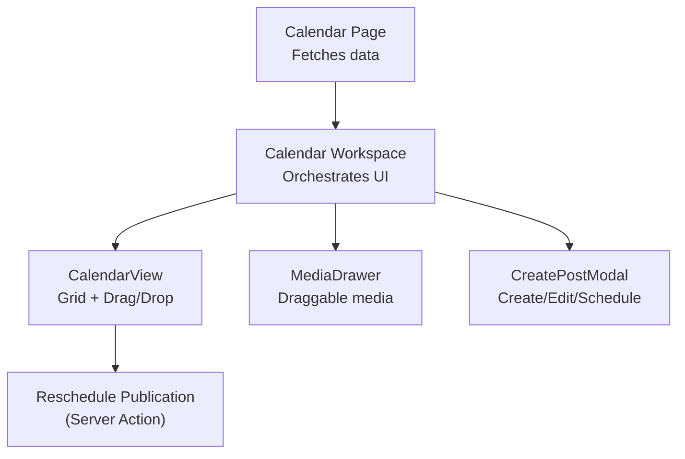
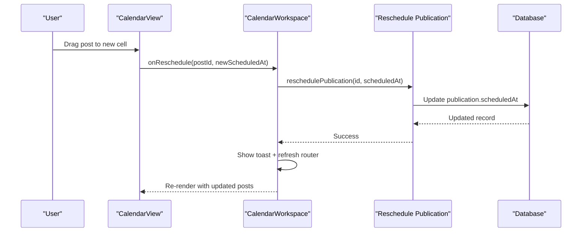
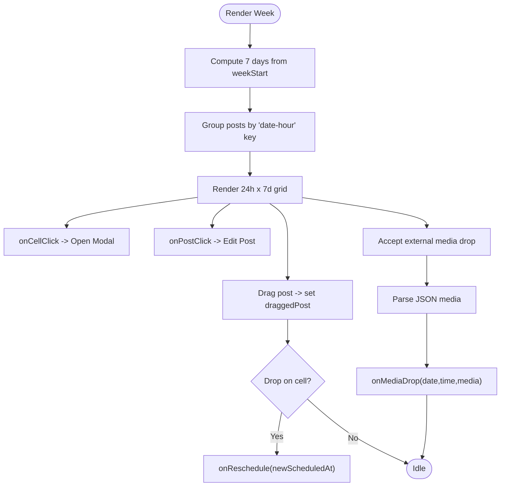
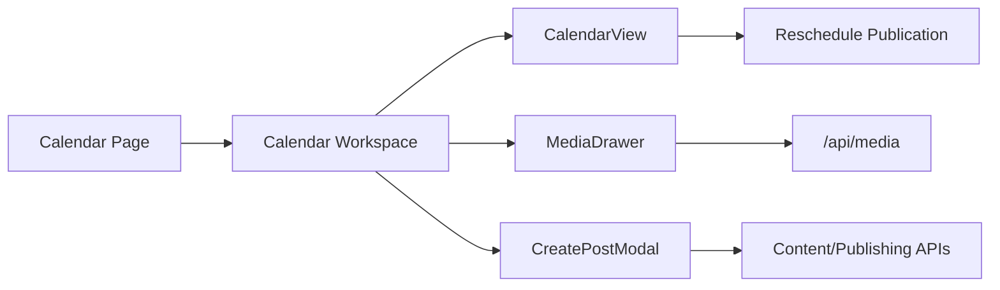
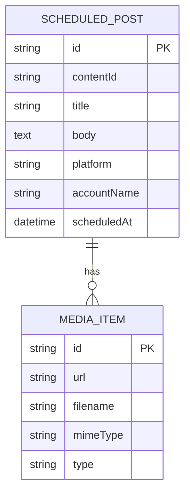

# Calendar View Component

<cite>
**Referenced Files in This Document**
- [calendar-view.tsx](file://components/calendar/calendar-view.tsx)
- [calendar-workspace.tsx](file://components/calendar/calendar-workspace.tsx)
- [page.tsx](file://app/calendar/page.tsx)
- [media-drawer.tsx](file://components/calendar/media-drawer.tsx)
- [create-post-modal.tsx](file://components/calendar/create-post-modal.tsx)
- [reschedule-publication.ts](file://app/publishing/actions/reschedule-publication.ts)
</cite>

## Table of Contents
1. [Introduction](#introduction)
2. [Project Structure](#project-structure)
3. [Core Components](#core-components)
4. [Architecture Overview](#architecture-overview)
5. [Detailed Component Analysis](#detailed-component-analysis)
6. [Dependency Analysis](#dependency-analysis)
7. [Performance Considerations](#performance-considerations)
8. [Troubleshooting Guide](#troubleshooting-guide)
9. [Conclusion](#conclusion)
10. [Appendices](#appendices)

## Introduction
This document provides comprehensive documentation for the CalendarView component that renders a weekly calendar with drag-and-drop scheduling. It covers post rendering, time grid layout, real-time current time indicator, internal and external drag-and-drop flows, state management using React hooks, responsive sticky headers and time columns, event handling patterns, performance optimizations, and accessibility considerations.

## Project Structure
The calendar feature is composed of:
- A page that fetches scheduled posts and connected channels from the database and passes them to the workspace.
- A workspace that orchestrates navigation, media panel, create/edit modal, and the calendar view.
- The calendar view that renders the 7-day, 24-hour grid, handles cell clicks, drag-and-drop, and shows a live time indicator.
- Supporting components for media drawer (with draggable items), create/post modal, and server actions for rescheduling.

**Diagram sources**
- [page.tsx:6-78](file://app/calendar/page.tsx#L6-L78)
- [calendar-workspace.tsx:55-292](file://components/calendar/calendar-workspace.tsx#L55-L292)
- [calendar-view.tsx:52-307](file://components/calendar/calendar-view.tsx#L52-L307)
- [media-drawer.tsx:22-166](file://components/calendar/media-drawer.tsx#L22-L166)
- [create-post-modal.tsx:79-559](file://components/calendar/create-post-modal.tsx#L79-L559)
- [reschedule-publication.ts:6-58](file://app/publishing/actions/reschedule-publication.ts#L6-L58)

**Section sources**
- [page.tsx:6-78](file://app/calendar/page.tsx#L6-L78)
- [calendar-workspace.tsx:55-292](file://components/calendar/calendar-workspace.tsx#L55-L292)

## Core Components
- CalendarView: Renders the weekly grid, manages local drag state, computes posts by cell, and updates a live time indicator.
- CalendarWorkspace: Manages week navigation, media panel visibility, post creation/editing, and calls server actions for rescheduling.
- MediaDrawer: Displays media library items and supports dragging media into calendar cells.
- CreatePostModal: Creates or edits posts and schedules them; also receives initial media from drag-and-drop.
- Reschedule Publication Action: Validates and updates publication schedule on the server.

Key responsibilities:
- Data mapping: Posts are grouped by date and hour for efficient lookup during render.
- Drag-and-drop: Internal post moves and external media drops are handled via HTML5 drag events.
- Real-time indicator: A horizontal line marks the current time within the visible week.
- Sticky layout: Headers and time column remain visible while scrolling.

**Section sources**
- [calendar-view.tsx:52-307](file://components/calendar/calendar-view.tsx#L52-L307)
- [calendar-workspace.tsx:55-292](file://components/calendar/calendar-workspace.tsx#L55-L292)
- [media-drawer.tsx:22-166](file://components/calendar/media-drawer.tsx#L22-L166)
- [create-post-modal.tsx:79-559](file://components/calendar/create-post-modal.tsx#L79-L559)
- [reschedule-publication.ts:6-58](file://app/publishing/actions/reschedule-publication.ts#L6-L58)

## Architecture Overview
The calendar follows a unidirectional data flow:
- Page loads scheduled publications and connected channels.
- Workspace holds UI state (week start, modals, media panel) and delegates rendering to CalendarView.
- CalendarView computes derived data (postsByCell, timeIndicator) and exposes callbacks for interactions.
- User interactions trigger server actions (e.g., reschedule) and UI updates via React state.

**Diagram sources**
- [calendar-view.tsx:133-178](file://components/calendar/calendar-view.tsx#L133-L178)
- [calendar-workspace.tsx:138-155](file://components/calendar/calendar-workspace.tsx#L138-L155)
- [reschedule-publication.ts:6-58](file://app/publishing/actions/reschedule-publication.ts#L6-L58)

## Detailed Component Analysis

### CalendarView: Weekly Grid, Post Rendering, Time Indicator, and Drag-and-Drop
- Props:
  - posts: Array of scheduled posts with platform, title, scheduledAt, and optional media.
  - weekStart: Start of the displayed week.
  - onCellClick: Callback to open create/edit modal for a specific date/time.
  - onPostClick: Callback to edit an existing post.
  - onReschedule: Callback to move a post to a new slot.
  - onMediaDrop: Callback to handle external media dropped onto a cell.

- State:
  - currentTime: Updated every minute to drive the live time indicator.
  - draggedPost: Holds the post currently being dragged internally.
  - dragOverCell: Tracks which cell is currently hovered during drag for visual feedback.

- Derived data:
  - weekDays: Computed array of 7 dates starting from weekStart.
  - today: Current day normalized to midnight for highlighting.
  - postsByCell: Map keyed by "YYYY-MM-DD-HH" to group posts per hour slot.
  - timeIndicator: Vertical position of the current time line if the current week contains today.

- Layout:
  - CSS Grid with a fixed 50px time column and 7 equal day columns.
  - Sticky header row and sticky time column for scrollable content.
  - Each hour row is 52px high; time labels use a helper to format AM/PM.

- Drag-and-drop:
  - Internal: Posts are draggable; dragStart sets draggedPost and writes post id to dataTransfer. Drop calculates new scheduledAt and invokes onReschedule.
  - External: Cells accept drop of JSON media payload from MediaDrawer; parsed and passed to onMediaDrop.

- Event handling:
  - Cell click opens create/edit modal via onCellClick.
  - Post click opens edit modal via onPostClick.
  - Drag over/out update highlight state.

- Accessibility notes:
  - Posts are draggable but not keyboard-navigable by default; consider adding keyboard shortcuts for move operations.
  - Time labels and day headers are semantic text; ensure focus order aligns with visual order when adding interactive elements.

**Diagram sources**
- [calendar-view.tsx:79-131](file://components/calendar/calendar-view.tsx#L79-L131)
- [calendar-view.tsx:133-178](file://components/calendar/calendar-view.tsx#L133-L178)
- [calendar-view.tsx:180-307](file://components/calendar/calendar-view.tsx#L180-L307)

**Section sources**
- [calendar-view.tsx:52-307](file://components/calendar/calendar-view.tsx#L52-L307)

### CalendarWorkspace: Orchestration, Navigation, Modals, and Server Actions
- State:
  - weekStart, activeView: Control navigation and view mode.
  - mediaDrawerOpen, activeItem: Manage media panel visibility.
  - createPostOpen, createPostDate, createPostTime, pendingMedia: Control create/edit modal and prefill data.
  - selectedPost: For editing an existing post.
  - Toast state: Feedback messages.

- Interactions:
  - Previous/Next/Today navigation updates weekStart.
  - Cell click opens modal with date/time prefilled.
  - Post click opens modal with existing post details and media.
  - Reschedule calls server action and refreshes the route after success.
  - Media drag starts sets JSON payload for drop targets.
  - Upload triggers file input or panel upload and refreshes.

- Integration points:
  - Passes props to CalendarView including onCellClick, onPostClick, onReschedule, onMediaDrop.
  - Opens MediaDrawer and CreatePostModal based on user actions.

**Section sources**
- [calendar-workspace.tsx:55-292](file://components/calendar/calendar-workspace.tsx#L55-L292)

### MediaDrawer: Draggable Media Library
- Loads media list when opened.
- Each media item is draggable and serializes itself as JSON to dataTransfer.
- Supports Escape key to close.
- Provides link to manage media and sections for UGC and submitted media.

**Section sources**
- [media-drawer.tsx:22-166](file://components/calendar/media-drawer.tsx#L22-L166)

### CreatePostModal: Create/Edit/Schedule Posts
- Handles channel selection, body editing, media attachments, and scheduling controls.
- Integrates with AI assistant panel and media picker.
- Schedules posts by calling server action and uploading media as needed.
- Supports pre-filled date/time and media from calendar interactions.

**Section sources**
- [create-post-modal.tsx:79-559](file://components/calendar/create-post-modal.tsx#L79-L559)

### Reschedule Publication Server Action
- Validates scheduledAt is a valid future date.
- Ensures publication exists and is in allowed states.
- Updates scheduledAt and clears error, then revalidates relevant paths.

**Section sources**
- [reschedule-publication.ts:6-58](file://app/publishing/actions/reschedule-publication.ts#L6-L58)

## Dependency Analysis
- CalendarPage depends on Prisma to fetch scheduled publications and connected channels, then maps to ScheduledPost shape for CalendarView.
- CalendarWorkspace composes CalendarView, MediaDrawer, CreatePostModal, and uses Next.js router and transitions for UX.
- CalendarView depends on utility functions for date formatting and grouping; it does not directly access data sources.
- MediaDrawer fetches media via API when opened.
- CreatePostModal integrates with content and publishing actions and media APIs.

**Diagram sources**
- [page.tsx:6-78](file://app/calendar/page.tsx#L6-L78)
- [calendar-workspace.tsx:55-292](file://components/calendar/calendar-workspace.tsx#L55-L292)
- [media-drawer.tsx:31-38](file://components/calendar/media-drawer.tsx#L31-L38)
- [create-post-modal.tsx:132-242](file://components/calendar/create-post-modal.tsx#L132-L242)
- [reschedule-publication.ts:6-58](file://app/publishing/actions/reschedule-publication.ts#L6-L58)

**Section sources**
- [page.tsx:6-78](file://app/calendar/page.tsx#L6-L78)
- [calendar-workspace.tsx:55-292](file://components/calendar/calendar-workspace.tsx#L55-L292)
- [media-drawer.tsx:31-38](file://components/calendar/media-drawer.tsx#L31-L38)
- [create-post-modal.tsx:132-242](file://components/calendar/create-post-modal.tsx#L132-L242)
- [reschedule-publication.ts:6-58](file://app/publishing/actions/reschedule-publication.ts#L6-L58)

## Performance Considerations
- Memoization:
  - postsByCell computed via useMemo to avoid recomputation on each render; groups posts by date-hour for O(1) lookup per cell.
  - weekDays and today computed via useMemo to minimize recalculations.
  - timeIndicator computed via useMemo based on currentTime and weekStart.
- Efficient rendering:
  - Grid rows use display contents to keep DOM structure shallow while enabling CSS Grid alignment.
  - Sticky headers and time column reduce layout shifts during scroll.
- State updates:
  - currentTime interval updates once per minute to limit re-renders.
  - Drag state minimized to only necessary fields (draggedPost, dragOverCell).
- Server-side caching:
  - Server action revalidates specific paths to invalidate caches efficiently without full reloads.
- Recommendations:
  - Consider virtualizing long lists if posts per hour grow large.
  - Debounce or throttle dragOver handlers if many cells cause heavy updates.
  - Use React.memo for post items to prevent unnecessary re-renders when props are stable.

[No sources needed since this section provides general guidance]

## Troubleshooting Guide
- Invalid schedule date:
  - If reschedule fails due to invalid or past date, the server action throws an error. Ensure scheduledAt is a future datetime string.
- Published posts cannot be rescheduled:
  - Only queued or scheduled publications can be moved; published ones are locked.
- Drag-and-drop not working:
  - Verify that onDragOver prevents default behavior and that dataTransfer types match between source and target.
  - For Firefox compatibility, ensure setData is called with a plain text type during drag start.
- Media drop ignored:
  - Check that the dropped payload is valid JSON and matches expected fields. Errors are caught and ignored gracefully.
- Time indicator missing:
  - The indicator only appears if the current week includes today; verify weekStart and currentTime logic.

**Section sources**
- [reschedule-publication.ts:10-39](file://app/publishing/actions/reschedule-publication.ts#L10-L39)
- [calendar-view.tsx:133-178](file://components/calendar/calendar-view.tsx#L133-L178)
- [calendar-view.tsx:114-131](file://components/calendar/calendar-view.tsx#L114-L131)

## Conclusion
CalendarView delivers a performant, accessible weekly calendar with robust drag-and-drop scheduling. It leverages memoization for efficient rendering, maintains a live time indicator, and integrates seamlessly with server actions for reliable state synchronization. The modular design separates concerns across workspace, view, and supporting components, making it maintainable and extensible.

[No sources needed since this section summarizes without analyzing specific files]

## Appendices

### Data Model: ScheduledPost

**Diagram sources**
- [calendar-view.tsx:5-14](file://components/calendar/calendar-view.tsx#L5-L14)

### Event Handling Summary
- Cell click: Opens create/edit modal with date/time.
- Post click: Opens edit modal with existing post data.
- Internal drag: Moves posts between slots; triggers reschedule server action.
- External drag: Drops media into cells; opens modal with media preselected.
- Keyboard: Escape closes drawers/modals where implemented.

**Section sources**
- [calendar-view.tsx:133-184](file://components/calendar/calendar-view.tsx#L133-L184)
- [media-drawer.tsx:40-48](file://components/calendar/media-drawer.tsx#L40-L48)
- [create-post-modal.tsx:275-281](file://components/calendar/create-post-modal.tsx#L275-L281)