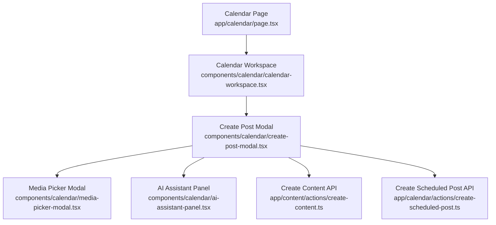
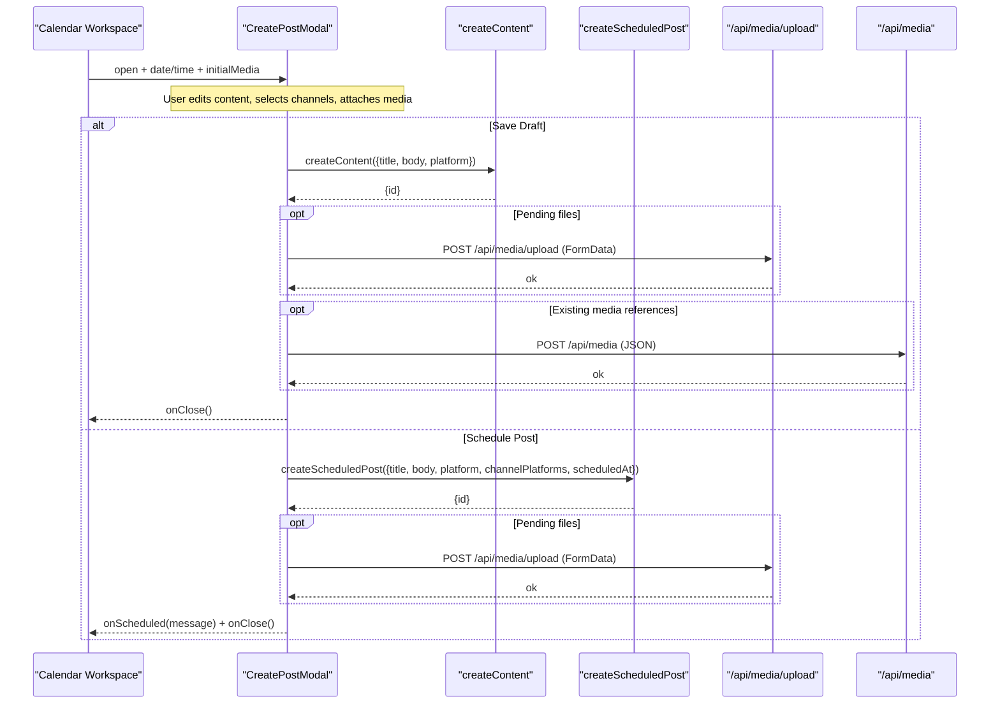
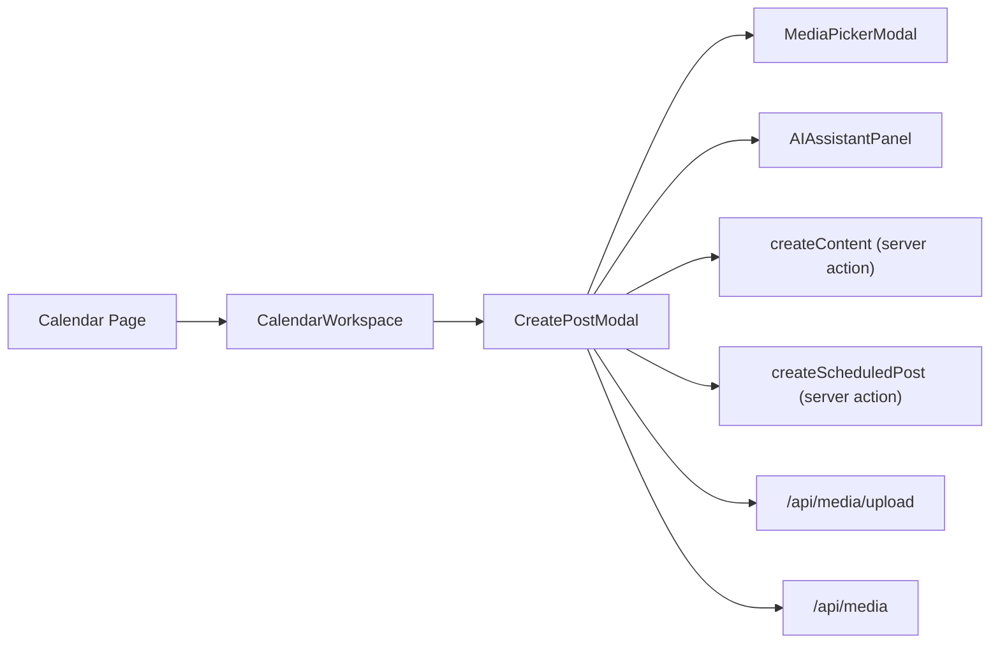
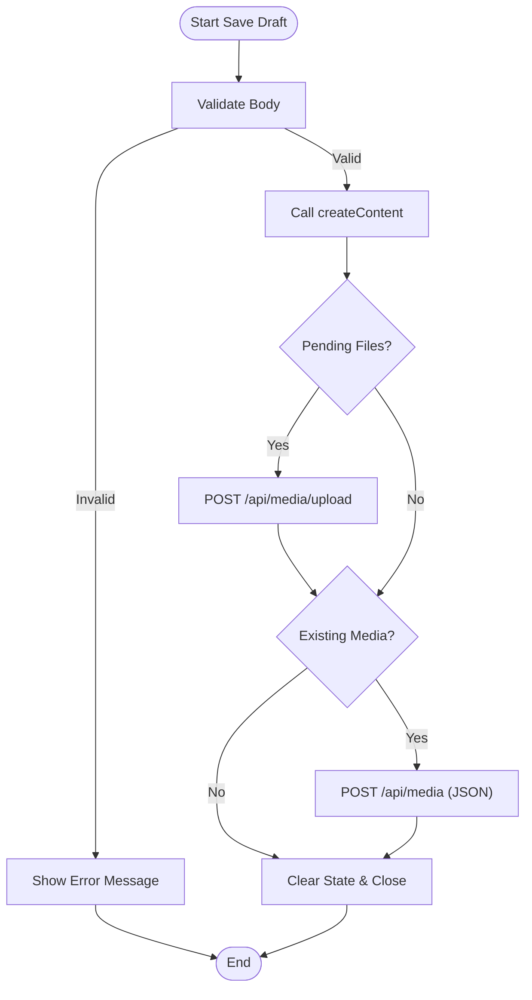
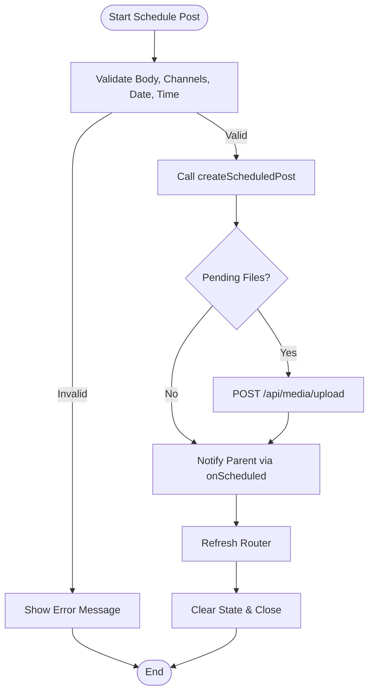

# Create Post Modal Component

<cite>
**Referenced Files in This Document**
- [create-post-modal.tsx](file://components/calendar/create-post-modal.tsx)
- [calendar-workspace.tsx](file://components/calendar/calendar-workspace.tsx)
- [page.tsx](file://app/calendar/page.tsx)
- [create-scheduled-post.ts](file://app/calendar/actions/create-scheduled-post.ts)
- [create-content.ts](file://app/content/actions/create-content.ts)
- [media-picker-modal.tsx](file://components/calendar/media-picker-modal.tsx)
- [ai-assistant-panel.tsx](file://components/calendar/ai-assistant-panel.tsx)
</cite>

## Table of Contents
1. [Introduction](#introduction)
2. [Project Structure](#project-structure)
3. [Core Components](#core-components)
4. [Architecture Overview](#architecture-overview)
5. [Detailed Component Analysis](#detailed-component-analysis)
6. [Dependency Analysis](#dependency-analysis)
7. [Performance Considerations](#performance-considerations)
8. [Troubleshooting Guide](#troubleshooting-guide)
9. [Conclusion](#conclusion)
10. [Appendices](#appendices)

## Introduction
This document provides comprehensive documentation for the CreatePostModal component used to create and schedule new posts within the calendar context. It covers the modal’s form structure (title, content editor, platform selection, scheduling), validation and error handling, data submission workflows, integration with APIs and state management, lifecycle and keyboard behavior, responsive design considerations, accessibility features, and communication patterns with parent components via props and callbacks.

## Project Structure
The CreatePostModal is embedded in the Calendar workspace and integrates with media and AI assistant panels. The calendar page loads scheduled publications and connected channels, which are passed down to the workspace and then to the modal.

**Diagram sources**
- [page.tsx:6-78](file://app/calendar/page.tsx#L6-L78)
- [calendar-workspace.tsx:55-328](file://components/calendar/calendar-workspace.tsx#L55-L328)
- [create-post-modal.tsx:79-559](file://components/calendar/create-post-modal.tsx#L79-L559)
- [media-picker-modal.tsx:30-329](file://components/calendar/media-picker-modal.tsx#L30-L329)
- [ai-assistant-panel.tsx:22-409](file://components/calendar/ai-assistant-panel.tsx#L22-L409)
- [create-content.ts:12-25](file://app/content/actions/create-content.ts#L12-L25)
- [create-scheduled-post.ts:15-66](file://app/calendar/actions/create-scheduled-post.ts#L15-L66)

**Section sources**
- [page.tsx:6-78](file://app/calendar/page.tsx#L6-L78)
- [calendar-workspace.tsx:55-328](file://components/calendar/calendar-workspace.tsx#L55-L328)

## Core Components
- CreatePostModal: Main modal for composing posts, selecting platforms, attaching media, and scheduling or saving drafts.
- MediaPickerModal: Secondary modal for browsing and uploading media assets.
- AIAssistantPanel: Side panel for generating text, images, or videos via AI APIs.
- Server Actions: createContent and createScheduledPost handle persistence and scheduling.

Key responsibilities:
- Form state: body content, selected channels, schedule date/time, media attachments.
- Validation: ensure required fields before submission.
- Submission: save draft or schedule post; upload media when needed.
- UI: overlays for media picker and AI assistant; keyboard handling for Escape key.

**Section sources**
- [create-post-modal.tsx:79-559](file://components/calendar/create-post-modal.tsx#L79-L559)
- [media-picker-modal.tsx:30-329](file://components/calendar/media-picker-modal.tsx#L30-L329)
- [ai-assistant-panel.tsx:22-409](file://components/calendar/ai-assistant-panel.tsx#L22-L409)
- [create-content.ts:12-25](file://app/content/actions/create-content.ts#L12-L25)
- [create-scheduled-post.ts:15-66](file://app/calendar/actions/create-scheduled-post.ts#L15-L66)

## Architecture Overview
The modal is controlled by the Calendar Workspace through props. On open, it receives initial date/time and optional preselected media. On submit, it calls server actions to persist content and optionally schedule a publication. Media uploads occur after content creation if there are pending files.

**Diagram sources**
- [create-post-modal.tsx:171-242](file://components/calendar/create-post-modal.tsx#L171-L242)
- [create-content.ts:12-25](file://app/content/actions/create-content.ts#L12-L25)
- [create-scheduled-post.ts:15-66](file://app/calendar/actions/create-scheduled-post.ts#L15-L66)
- [media-picker-modal.tsx:86-127](file://components/calendar/media-picker-modal.tsx#L86-L127)

## Detailed Component Analysis

### Modal Form Structure
- Title input: Derived from trimmed body content, truncated to a maximum length for storage.
- Content editor: Textarea with character counter and placeholder guidance.
- Platform selection: Multi-select chips for connected platforms; unconnected platforms shown as disabled with an indicator.
- Scheduling options: Date and time inputs; timezone displayed using Intl.DateTimeFormat.
- Media attachments: Thumbnails preview; remove button per item; count indicator.

Validation and Error Handling
- Draft save requires non-empty body; sets error message and prevents submission.
- Schedule requires body, at least one channel, and both date and time; sets appropriate error messages.
- Network errors during media upload or API calls are caught and surfaced as user-facing errors.

Data Submission Workflows
- Save Draft:
  - Calls createContent with title derived from body, body, and primary platform.
  - If media present:
    - Uploads any pending files via FormData to /api/media/upload.
    - Registers existing media references via POST /api/media with JSON payload.
  - Clears form and closes modal.
- Schedule Post:
  - Calls createScheduledPost with title, body, primary platform, list of channel platforms, and scheduledAt timestamp.
  - If media present: same upload flow as draft.
  - Displays success message via onScheduled callback, closes modal, and refreshes router.

State Management and Persistence
- Local state tracks body, selectedChannels, media, scheduleDate/scheduleTime, loading states, and errors.
- Props-driven initialization: date/time from parent; initialMedia from parent; connectedPlatforms/channels determine available selections.
- Parent state in Calendar Workspace controls open/close and passes relevant context.

Lifecycle Management
- Open/Close: Controlled by parent’s open prop; renders null when closed.
- Keyboard shortcuts: Escape key closes nested overlays first (AI panel, media picker), then the modal.
- Focus trapping: Not implemented; overlay click-to-close and Escape handling provide basic interaction control.

Responsive Design Considerations
- Modal uses full-width container with max width and vertical scroll for content.
- Media thumbnails wrap across rows; toolbar buttons wrap flexibly.
- Overlays (media picker, AI panel) use fixed positioning with backdrop blur and responsive widths.

Accessibility Features
- Uses semantic headings for modal header and section labels.
- Buttons have descriptive labels and titles where applicable.
- Keyboard support includes Escape key handling for closing overlays and modal.
- ARIA attributes are not explicitly set; consider adding role="dialog", aria-modal="true", and aria-labelledby for improved screen reader support.

Communication Patterns with Parent
- Props: open, onClose, date, time, connectedPlatforms, connectedChannels, onScheduled, initialMedia.
- Callbacks: onScheduled invoked with formatted scheduling confirmation message.
- Parent manages modal visibility and displays toast notifications based on modal feedback.

**Section sources**
- [create-post-modal.tsx:79-559](file://components/calendar/create-post-modal.tsx#L79-L559)
- [calendar-workspace.tsx:69-317](file://components/calendar/calendar-workspace.tsx#L69-L317)

### Media Picker Modal
- Tabs for Photos, Text, Elements, Background, AI Image (only Photos fully implemented).
- Loads media library via GET /api/media; supports uploading new files via POST /api/media/upload.
- Selection workflow: select item, confirm usage returns items to parent modal.

Error Handling
- Displays loading states and error messages for network failures.
- Upload errors surfaced to user with clear messaging.

Keyboard Support
- Escape key closes the media picker modal.

**Section sources**
- [media-picker-modal.tsx:30-329](file://components/calendar/media-picker-modal.tsx#L30-L329)

### AI Assistant Panel
- Modes: Text, Image, Video generation.
- Integrates with AI endpoints:
  - Text: POST /api/ai/generate
  - Image: POST /api/ai/image
  - Video: POST /api/ai/video
- Results can be inserted into the main modal’s content or attached as media.

Error Handling
- Shows error messages for failed generations.
- Disables generate buttons while processing.

Keyboard Support
- Escape key closes the AI panel.

**Section sources**
- [ai-assistant-panel.tsx:22-409](file://components/calendar/ai-assistant-panel.tsx#L22-L409)

### Server Actions Integration
- createContent: Persists draft content with status DRAFT and revalidates content path.
- createScheduledPost: Creates content with status SCHEDULED, creates publications per connected channel, schedules them, and revalidates multiple paths.

Error Handling
- Throws errors for missing platforms or no connected channels; callers catch and display user-friendly messages.

**Section sources**
- [create-content.ts:12-25](file://app/content/actions/create-content.ts#L12-L25)
- [create-scheduled-post.ts:15-66](file://app/calendar/actions/create-scheduled-post.ts#L15-L66)

## Dependency Analysis
The modal depends on several internal components and server actions:

**Diagram sources**
- [create-post-modal.tsx:79-559](file://components/calendar/create-post-modal.tsx#L79-L559)
- [media-picker-modal.tsx:30-329](file://components/calendar/media-picker-modal.tsx#L30-L329)
- [ai-assistant-panel.tsx:22-409](file://components/calendar/ai-assistant-panel.tsx#L22-L409)
- [create-content.ts:12-25](file://app/content/actions/create-content.ts#L12-L25)
- [create-scheduled-post.ts:15-66](file://app/calendar/actions/create-scheduled-post.ts#L15-L66)
- [calendar-workspace.tsx:55-328](file://components/calendar/calendar-workspace.tsx#L55-L328)
- [page.tsx:6-78](file://app/calendar/page.tsx#L6-L78)

**Section sources**
- [create-post-modal.tsx:79-559](file://components/calendar/create-post-modal.tsx#L79-L559)
- [calendar-workspace.tsx:55-328](file://components/calendar/calendar-workspace.tsx#L55-L328)
- [page.tsx:6-78](file://app/calendar/page.tsx#L6-L78)

## Performance Considerations
- Avoid unnecessary re-renders by keeping local state minimal and scoped to modal.
- Defer heavy operations (e.g., media uploads) until after content creation to reduce blocking.
- Use efficient image/video previews; limit concurrent uploads if many files are selected.
- Revalidation strategy: server actions revalidate only necessary paths to minimize refetch overhead.

[No sources needed since this section provides general guidance]

## Troubleshooting Guide
Common issues and resolutions:
- Missing content: Ensure body is non-empty before saving draft or scheduling.
- No channels selected: At least one connected platform must be selected to schedule.
- Date/time missing: Both date and time are required for scheduling; validate before submission.
- Media upload failures: Check network connectivity and file format; review error messages returned by /api/media/upload.
- No connected channels: Server action will throw if no connected channels exist for selected platforms; connect channels in Publishing settings.

**Section sources**
- [create-post-modal.tsx:171-242](file://components/calendar/create-post-modal.tsx#L171-L242)
- [create-scheduled-post.ts:15-66](file://app/calendar/actions/create-scheduled-post.ts#L15-L66)

## Conclusion
The CreatePostModal provides a robust interface for creating and scheduling posts within the calendar context. It integrates seamlessly with media and AI tools, enforces validation rules, and communicates effectively with parent components and server actions. While functional, enhancements such as explicit ARIA attributes and focus trapping would improve accessibility. Responsive design ensures usability across devices, and clear error handling aids troubleshooting.

[No sources needed since this section summarizes without analyzing specific files]

## Appendices

### Data Flow Diagrams

#### Save Draft Flow

**Diagram sources**
- [create-post-modal.tsx:171-199](file://components/calendar/create-post-modal.tsx#L171-L199)
- [create-content.ts:12-25](file://app/content/actions/create-content.ts#L12-L25)

#### Schedule Post Flow

**Diagram sources**
- [create-post-modal.tsx:201-242](file://components/calendar/create-post-modal.tsx#L201-L242)
- [create-scheduled-post.ts:15-66](file://app/calendar/actions/create-scheduled-post.ts#L15-L66)