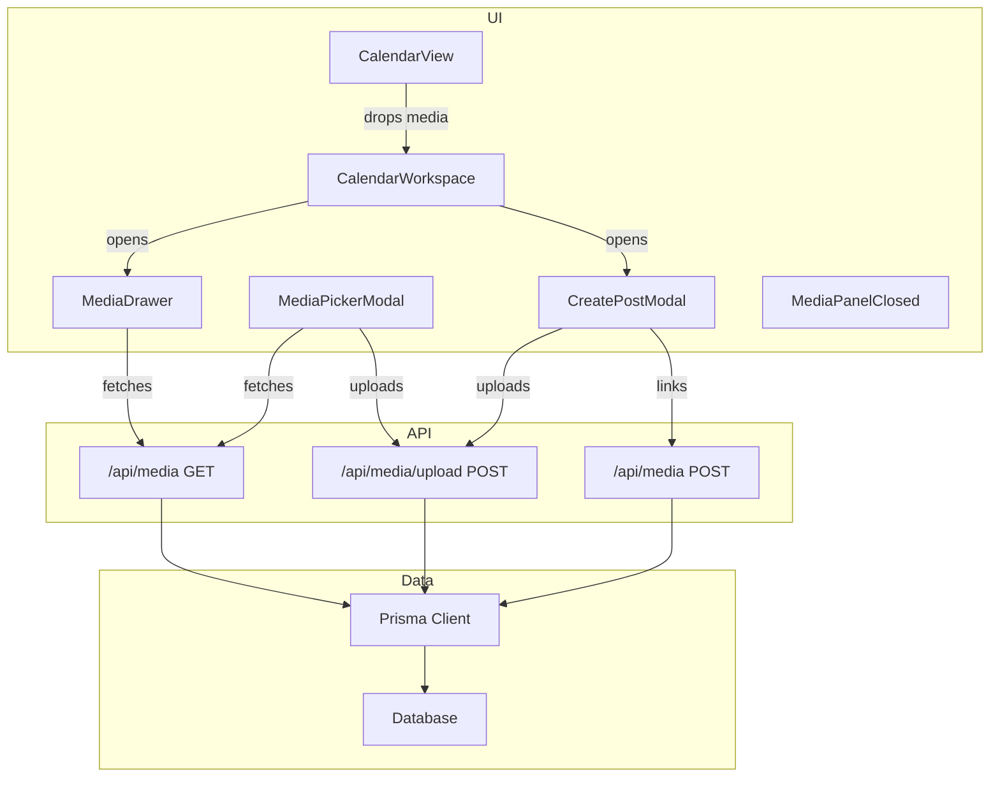
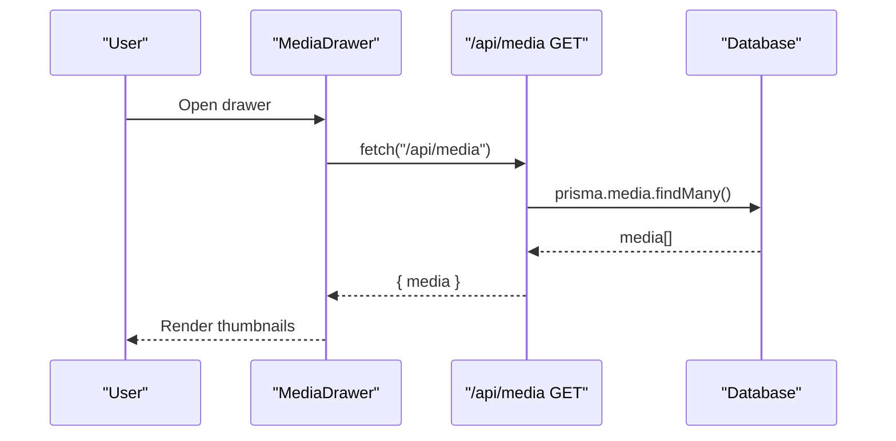
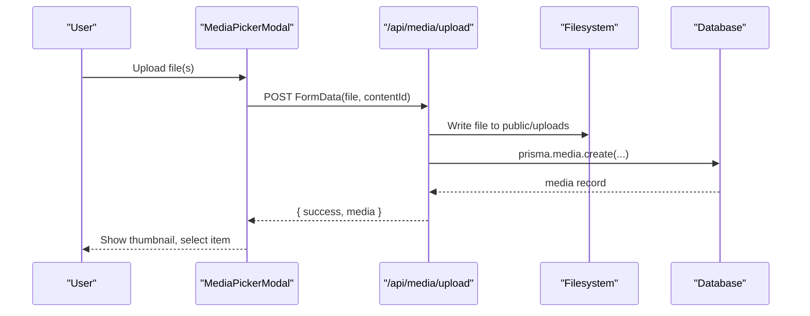
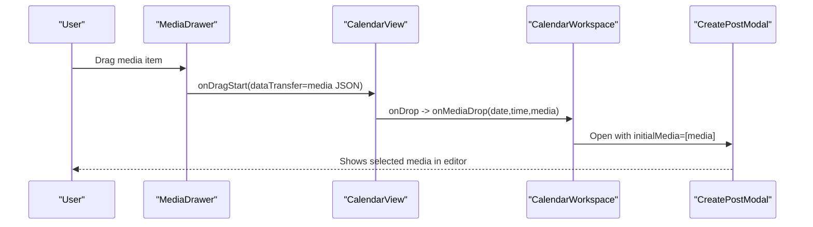
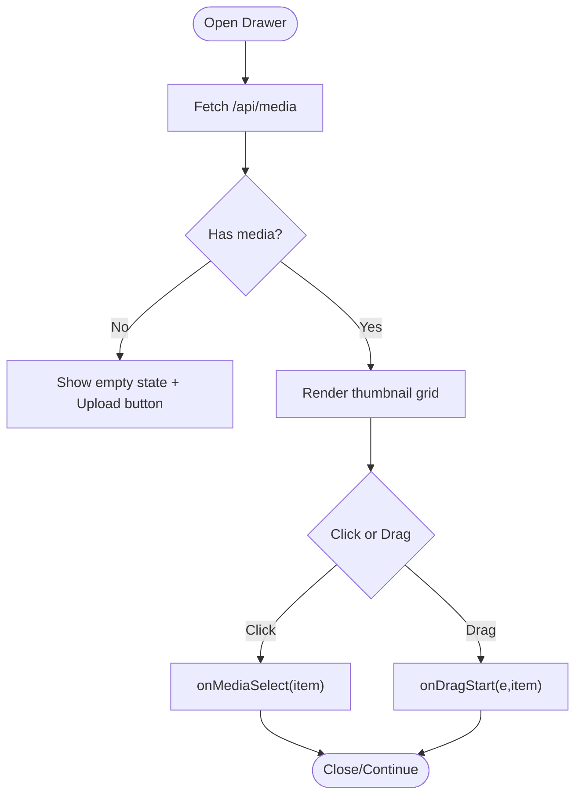
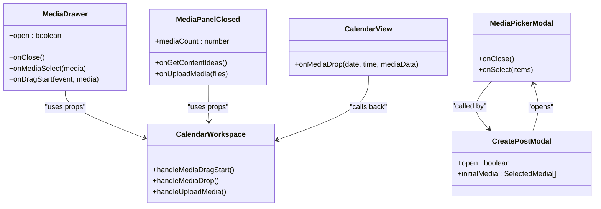
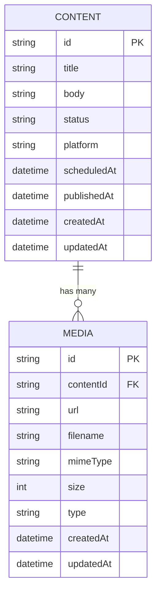

# Media Drawer Component

<cite>
**Referenced Files in This Document**
- [media-drawer.tsx](file://components/calendar/media-drawer.tsx)
- [calendar-workspace.tsx](file://components/calendar/calendar-workspace.tsx)
- [calendar-view.tsx](file://components/calendar/calendar-view.tsx)
- [media-panel-closed.tsx](file://components/calendar/media-panel-closed.tsx)
- [media-picker-modal.tsx](file://components/calendar/media-picker-modal.tsx)
- [create-post-modal.tsx](file://components/calendar/create-post-modal.tsx)
- [route.ts (GET/POST)](file://app/api/media/route.ts)
- [route.ts (upload)](file://app/api/media/upload/route.ts)
- [schema.prisma](file://prisma/schema.prisma)
- [page.tsx (Calendar page)](file://app/calendar/page.tsx)
</cite>

## Table of Contents
1. [Introduction](#introduction)
2. [Project Structure](#project-structure)
3. [Core Components](#core-components)
4. [Architecture Overview](#architecture-overview)
5. [Detailed Component Analysis](#detailed-component-analysis)
6. [Dependency Analysis](#dependency-analysis)
7. [Performance Considerations](#performance-considerations)
8. [Troubleshooting Guide](#troubleshooting-guide)
9. [Conclusion](#conclusion)
10. [Appendices](#appendices)

## Introduction
This document provides comprehensive documentation for the MediaDrawer component and its surrounding media system within the calendar interface. It explains the slide-out panel behavior, media library organization, file browsing capabilities, drag-and-drop attachment to calendar posts, validation and preview generation, filtering/search integration points, upload flows, local storage considerations, responsive design patterns, performance optimizations for large libraries, and accessibility considerations including keyboard navigation and screen reader compatibility.

## Project Structure
The media system spans UI components, server routes, and data models:
- UI: MediaDrawer, MediaPanelClosed, MediaPickerModal, CreatePostModal, CalendarView, CalendarWorkspace
- API: GET/POST /api/media and POST /api/media/upload
- Data: Prisma schema with Media model linked to Content

**Diagram sources**
- [media-drawer.tsx:31-38](file://components/calendar/media-drawer.tsx#L31-L38)
- [media-picker-modal.tsx:43-80](file://components/calendar/media-picker-modal.tsx#L43-L80)
- [media-picker-modal.tsx:86-127](file://components/calendar/media-picker-modal.tsx#L86-L127)
- [create-post-modal.tsx:132-169](file://components/calendar/create-post-modal.tsx#L132-L169)
- [calendar-workspace.tsx:157-183](file://components/calendar/calendar-workspace.tsx#L157-L183)
- [calendar-view.tsx:153-178](file://components/calendar/calendar-view.tsx#L153-L178)
- [route.ts (GET/POST):4-23](file://app/api/media/route.ts#L4-L23)
- [route.ts (upload):20-111](file://app/api/media/upload/route.ts#L20-L111)
- [schema.prisma:39-55](file://prisma/schema.prisma#L39-L55)

**Section sources**
- [media-drawer.tsx:1-167](file://components/calendar/media-drawer.tsx#L1-L167)
- [calendar-workspace.tsx:1-329](file://components/calendar/calendar-workspace.tsx#L1-L329)
- [calendar-view.tsx:1-308](file://components/calendar/calendar-view.tsx#L1-L308)
- [media-panel-closed.tsx:1-88](file://components/calendar/media-panel-closed.tsx#L1-L88)
- [media-picker-modal.tsx:1-329](file://components/calendar/media-picker-modal.tsx#L1-L329)
- [create-post-modal.tsx:1-559](file://components/calendar/create-post-modal.tsx#L1-L559)
- [route.ts (GET/POST):1-80](file://app/api/media/route.ts#L1-L80)
- [route.ts (upload):1-126](file://app/api/media/upload/route.ts#L1-L126)
- [schema.prisma:1-94](file://prisma/schema.prisma#L1-L94)

## Core Components
- MediaDrawer: Slide-out panel that lists media items fetched from /api/media, supports click-to-select and drag-to-attach to calendar cells.
- MediaPanelClosed: Compact panel when drawer is closed; supports drag-and-drop upload and quick actions.
- MediaPickerModal: Full-screen modal for browsing existing media, uploading new files, and selecting media to attach to a post.
- CreatePostModal: Post creation/scheduling flow; integrates media selection and uploads pending files before saving or scheduling.
- CalendarView: Weekly grid where posts are displayed and where media can be dropped into time slots.
- CalendarWorkspace: Orchestrates state for drawer visibility, media drag start, drop handling, and opening modals.

Key responsibilities:
- Fetching media from server on open/tab change
- Rendering thumbnails and enabling drag operations
- Validating uploads via server route
- Linking uploaded or existing media to content records
- Managing UI state transitions between panels and modals

**Section sources**
- [media-drawer.tsx:6-20](file://components/calendar/media-drawer.tsx#L6-L20)
- [media-drawer.tsx:31-38](file://components/calendar/media-drawer.tsx#L31-L38)
- [media-drawer.tsx:82-102](file://components/calendar/media-drawer.tsx#L82-L102)
- [media-panel-closed.tsx:16-25](file://components/calendar/media-panel-closed.tsx#L16-L25)
- [media-picker-modal.tsx:43-80](file://components/calendar/media-picker-modal.tsx#L43-L80)
- [media-picker-modal.tsx:86-127](file://components/calendar/media-picker-modal.tsx#L86-L127)
- [create-post-modal.tsx:132-169](file://components/calendar/create-post-modal.tsx#L132-L169)
- [calendar-view.tsx:153-178](file://components/calendar/calendar-view.tsx#L153-L178)
- [calendar-workspace.tsx:157-183](file://components/calendar/calendar-workspace.tsx#L157-L183)

## Architecture Overview
The media system follows a client-server architecture with clear separation:
- Client components manage UI state, user interactions, and data fetching
- Server routes handle persistence and file storage
- Prisma ORM abstracts database access

**Diagram sources**
- [media-drawer.tsx:31-38](file://components/calendar/media-drawer.tsx#L31-L38)
- [route.ts (GET/POST):4-23](file://app/api/media/route.ts#L4-L23)

**Diagram sources**
- [media-picker-modal.tsx:86-127](file://components/calendar/media-picker-modal.tsx#L86-L127)
- [route.ts (upload):20-111](file://app/api/media/upload/route.ts#L20-L111)

**Diagram sources**
- [media-drawer.tsx:82-102](file://components/calendar/media-drawer.tsx#L82-L102)
- [calendar-view.tsx:153-178](file://components/calendar/calendar-view.tsx#L153-L178)
- [calendar-workspace.tsx:157-183](file://components/calendar/calendar-workspace.tsx#L157-L183)
- [create-post-modal.tsx:517-536](file://components/calendar/create-post-modal.tsx#L517-L536)

## Detailed Component Analysis

### MediaDrawer
Behavior:
- Renders a slide-out panel positioned next to the sidebar, using a backdrop and fixed positioning.
- Loads media from /api/media when opened; displays a grid of thumbnails.
- Supports click-to-select and drag-to-attach by setting dataTransfer with JSON payload and invoking parent handler.
- Provides a link to manage media and sections for UGC collection and contributors.

Accessibility:
- Escape key closes the drawer via window keydown listener when open.
- Images include alt text based on filename.

Responsive:
- Fixed width panel with overflow-y-auto; positioned relative to sidebar width prop.

Performance:
- Fetches only when open; consider pagination for large libraries.

Integration:
- Uses onDragStart to pass media to CalendarView drop targets.

**Diagram sources**
- [media-drawer.tsx:31-38](file://components/calendar/media-drawer.tsx#L31-L38)
- [media-drawer.tsx:82-102](file://components/calendar/media-drawer.tsx#L82-L102)
- [media-drawer.tsx:40-48](file://components/calendar/media-drawer.tsx#L40-L48)

**Section sources**
- [media-drawer.tsx:1-167](file://components/calendar/media-drawer.tsx#L1-L167)

### MediaPanelClosed
Behavior:
- Compact panel shown when drawer is closed.
- Accepts drag-and-drop uploads and forwards files to onUploadMedia.
- Displays placeholder area and instructions.

Integration:
- Used by CalendarWorkspace to trigger uploads without opening the full drawer.

**Section sources**
- [media-panel-closed.tsx:1-88](file://components/calendar/media-panel-closed.tsx#L1-L88)
- [calendar-workspace.tsx:276-282](file://components/calendar/calendar-workspace.tsx#L276-L282)

### MediaPickerModal
Behavior:
- Tabbed interface; currently Photos tab fully implemented.
- Loads media from /api/media when Photos tab is active.
- Allows uploading new files via hidden input and POST to /api/media/upload.
- Displays thumbnails; supports video playback metadata preload.
- Selected media returned to caller via onSelect callback.

Validation and errors:
- Handles loading states, error messages, and upload progress feedback.

**Section sources**
- [media-picker-modal.tsx:1-329](file://components/calendar/media-picker-modal.tsx#L1-L329)

### CreatePostModal
Behavior:
- Manages post body, platform/channel selection, scheduling date/time.
- Integrates MediaPickerModal to insert media.
- On save or schedule, uploads any pending files then links existing media to content.

Media handling:
- Converts selected media to internal format and attaches to post.
- Uploads pending files to /api/media/upload with contentId.
- Links existing media to content via /api/media POST.

**Section sources**
- [create-post-modal.tsx:1-559](file://components/calendar/create-post-modal.tsx#L1-L559)

### CalendarView
Behavior:
- Renders weekly grid with hours and days.
- Supports dragging posts to reschedule and dropping external media from MediaDrawer into time slots.
- Highlights drop targets and computes current time indicator.

Integration:
- Calls onMediaDrop with date/time and parsed media data when receiving dragged media.

**Section sources**
- [calendar-view.tsx:1-308](file://components/calendar/calendar-view.tsx#L1-L308)

### CalendarWorkspace
Behavior:
- Controls MediaDrawer visibility and passes sidebar width for positioning.
- Handles media drag start and drop events to open CreatePostModal with initial media.
- Provides upload handlers for both direct and panel-based uploads.

**Section sources**
- [calendar-workspace.tsx:1-329](file://components/calendar/calendar-workspace.tsx#L1-L329)

## Dependency Analysis
Component relationships and data flow:

**Diagram sources**
- [media-drawer.tsx:14-20](file://components/calendar/media-drawer.tsx#L14-L20)
- [media-panel-closed.tsx:5-9](file://components/calendar/media-panel-closed.tsx#L5-L9)
- [media-picker-modal.tsx:15-18](file://components/calendar/media-picker-modal.tsx#L15-L18)
- [create-post-modal.tsx:16-25](file://components/calendar/create-post-modal.tsx#L16-L25)
- [calendar-view.tsx:16-23](file://components/calendar/calendar-view.tsx#L16-L23)
- [calendar-workspace.tsx:157-183](file://components/calendar/calendar-workspace.tsx#L157-L183)

Server-side dependencies:
- GET /api/media returns recent media limited to 50 items ordered by createdAt desc.
- POST /api/media creates media records linked to content.
- POST /api/media/upload validates file type and size, writes to filesystem, and persists metadata.

**Section sources**
- [route.ts (GET/POST):4-23](file://app/api/media/route.ts#L4-L23)
- [route.ts (upload):20-111](file://app/api/media/upload/route.ts#L20-L111)
- [schema.prisma:39-55](file://prisma/schema.prisma#L39-L55)

## Performance Considerations
- Pagination: The GET endpoint limits results to 50 items. For large libraries, implement cursor or offset-based pagination to reduce payload size and improve rendering performance.
- Lazy loading previews: Thumbnails render images directly; consider lazy-loading below-the-fold images and using smaller preview sizes for grids.
- Debounced search/filter: Add client-side debouncing for search inputs to avoid excessive re-renders.
- Memoization: Use useMemo for derived lists and expensive computations in CalendarView and MediaPickerModal.
- Efficient updates: Avoid full-page refreshes after uploads; update local state incrementally where possible.
- File size limits: Enforce client-side checks before upload to prevent unnecessary network requests.

[No sources needed since this section provides general guidance]

## Troubleshooting Guide
Common issues and resolutions:
- Upload fails due to unsupported file type: Ensure file type is in allowed set; check MIME types and extensions.
- Upload fails due to file size exceeding limit: Validate file size before upload; inform users of maximum size.
- Missing contentId during upload: Ensure contentId is provided when uploading; verify form data includes required fields.
- Media not appearing in drawer: Verify GET endpoint returns data; check network responses and database entries.
- Drag-and-drop not working: Confirm dataTransfer contains application/json and CalendarView handles drop correctly.

Error handling paths:
- Server routes return structured error objects with status codes.
- Client components display error messages and loading states appropriately.

**Section sources**
- [route.ts (upload):20-65](file://app/api/media/upload/route.ts#L20-L65)
- [route.ts (upload):112-124](file://app/api/media/upload/route.ts#L112-L124)
- [media-picker-modal.tsx:43-80](file://components/calendar/media-picker-modal.tsx#L43-L80)
- [media-picker-modal.tsx:86-127](file://components/calendar/media-picker-modal.tsx#L86-L127)

## Conclusion
The MediaDrawer integrates seamlessly with the calendar interface to provide efficient media management and attachment workflows. It leverages server-side validation and storage while maintaining a responsive, accessible UI. With current limitations like fixed result limits and minimal search/filter features, future enhancements should focus on pagination, advanced filtering, lazy loading, and richer search capabilities to support large media libraries and improve usability.

[No sources needed since this section summarizes without analyzing specific files]

## Appendices

### Data Model

**Diagram sources**
- [schema.prisma:21-37](file://prisma/schema.prisma#L21-L37)
- [schema.prisma:39-55](file://prisma/schema.prisma#L39-L55)

### Keyboard Navigation and Accessibility
- Escape key closes the MediaDrawer when open.
- Modal overlays handle Escape to close nested panels.
- Images include alt attributes for screen readers.
- Focus management: Ensure focus moves appropriately when opening/closing drawers and modals.

**Section sources**
- [media-drawer.tsx:40-48](file://components/calendar/media-drawer.tsx#L40-L48)
- [media-picker-modal.tsx:135-143](file://components/calendar/media-picker-modal.tsx#L135-L143)
- [create-post-modal.tsx:272-281](file://components/calendar/create-post-modal.tsx#L272-L281)

### Responsive Design Patterns
- MediaDrawer uses fixed width and positions relative to sidebar width; ensure layout adapts to collapsed/expanded sidebar states.
- MediaPickerModal uses max-width and flexible layouts to accommodate various screen sizes.
- CalendarView uses grid with minmax columns to scale across devices.

**Section sources**
- [media-drawer.tsx:52-64](file://components/calendar/media-drawer.tsx#L52-L64)
- [media-picker-modal.tsx:135-147](file://components/calendar/media-picker-modal.tsx#L135-L147)
- [calendar-view.tsx:186-195](file://components/calendar/calendar-view.tsx#L186-L195)