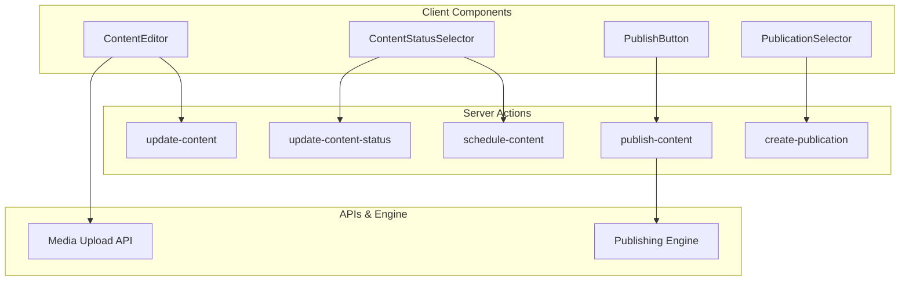
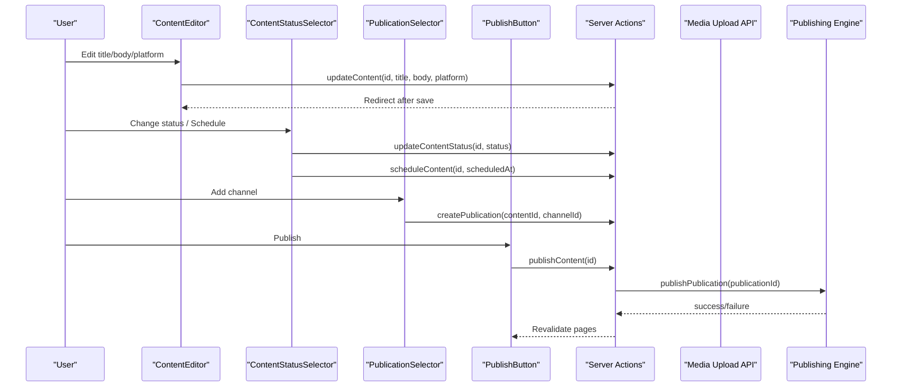
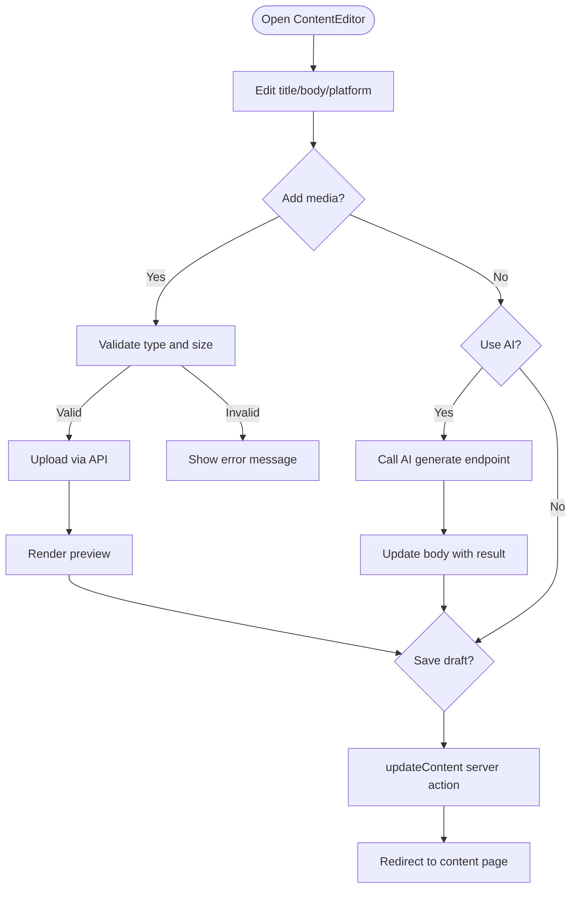
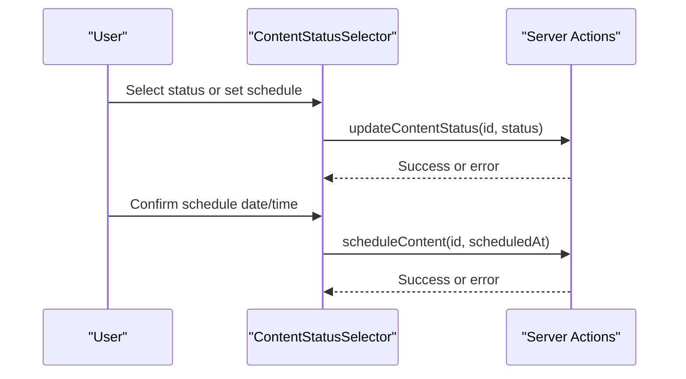
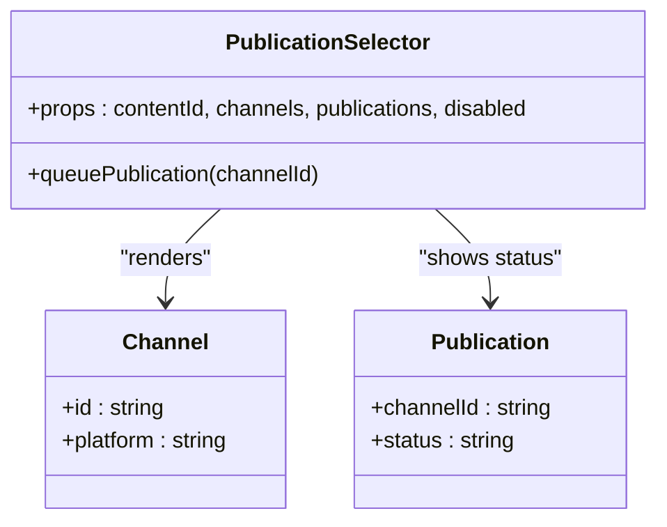
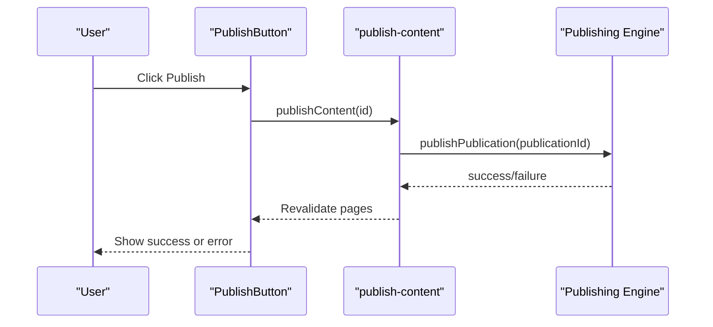
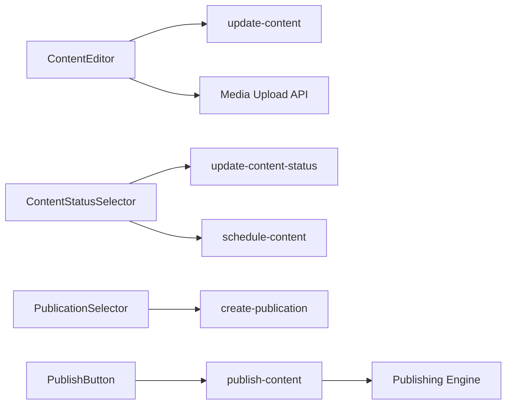

# Content Components

<cite>
**Referenced Files in This Document**
- [content-editor.tsx](file://components/content/content-editor.tsx)
- [content-status-selector.tsx](file://components/content/content-status-selector.tsx)
- [publication-selector.tsx](file://components/content/publication-selector.tsx)
- [publish-button.tsx](file://components/content/publish-button.tsx)
- [update-content.ts](file://app/content/actions/update-content.ts)
- [update-content-status.ts](file://app/content/actions/update-content-status.ts)
- [schedule-content.ts](file://app/content/actions/schedule-content.ts)
- [publish-content.ts](file://app/content/actions/publish-content.ts)
- [create-publication.ts](file://app/content/actions/create-publication.ts)
- [upload route](file://app/api/media/upload/route.ts)
- [publish engine](file://app/publishing/engine/publish.ts)
</cite>

## Table of Contents
1. Introduction
2. Project Structure
3. Core Components
4. Architecture Overview
5. Detailed Component Analysis
6. Dependency Analysis
7. Performance Considerations
8. Troubleshooting Guide
9. Conclusion
10. Appendices

## Introduction
This document provides comprehensive documentation for the content management React components that power editing, status transitions, platform selection, and publishing workflows. It covers:
- ContentEditor: rich text editing (textarea-based), media insertion with validation, AI-assisted editing, and draft saving.
- ContentStatusSelector: status transitions (Draft/Ready/Scheduled), scheduling UI, and visual feedback.
- PublicationSelector: channel selection, account context, and queuing publications.
- PublishButton: async publish flow, error handling, progress states, and user feedback.

It also explains component composition patterns, prop interfaces, event handling, server action integration, testing approaches, and performance considerations for large content items.

## Project Structure
The content features are implemented as client components under components/content, integrated with Next.js Server Actions and API routes for persistence and publishing.

**Diagram sources**
- [content-editor.tsx:148-157](file://components/content/content-editor.tsx#L148-L157)
- [content-editor.tsx:165-230](file://components/content/content-editor.tsx#L165-L230)
- [content-status-selector.tsx:44-92](file://components/content/content-status-selector.tsx#L44-L92)
- [publication-selector.tsx:47-61](file://components/content/publication-selector.tsx#L47-L61)
- [publish-button.tsx:30-44](file://components/content/publish-button.tsx#L30-L44)
- [update-content.ts:13-46](file://app/content/actions/update-content.ts#L13-L46)
- [update-content-status.ts:14-57](file://app/content/actions/update-content-status.ts#L14-L57)
- [schedule-content.ts:6-65](file://app/content/actions/schedule-content.ts#L6-L65)
- [publish-content.ts:7-69](file://app/content/actions/publish-content.ts#L7-L69)
- [create-publication.ts:6-68](file://app/content/actions/create-publication.ts#L6-L68)
- [upload route:20-126](file://app/api/media/upload/route.ts#L20-L126)
- [publish engine:4-116](file://app/publishing/engine/publish.ts#L4-L116)

**Section sources**
- [content-editor.tsx:1-596](file://components/content/content-editor.tsx#L1-L596)
- [content-status-selector.tsx:1-184](file://components/content/content-status-selector.tsx#L1-L184)
- [publication-selector.tsx:1-138](file://components/content/publication-selector.tsx#L1-L138)
- [publish-button.tsx:1-65](file://components/content/publish-button.tsx#L1-L65)

## Core Components
- ContentEditor: Manages title, body, platform, and media attachments; integrates AI assistance; saves drafts via server actions; handles file uploads and deletions.
- ContentStatusSelector: Allows switching between Draft and Ready; supports scheduling with date/time inputs; validates future dates and enforces server-side constraints.
- PublicationSelector: Lists connected channels; queues a publication per channel; shows current status; prevents duplicate or invalid operations.
- PublishButton: Queues immediate publish for READY content with queued publications; displays progress and errors; disables when not applicable.

Key behaviors:
- All asynchronous operations use React transitions to keep UI responsive and show pending states.
- Validation is enforced both on the client and server sides to prevent invalid state changes.
- Media assets are uploaded through a dedicated API route with type and size checks.

**Section sources**
- [content-editor.tsx:75-157](file://components/content/content-editor.tsx#L75-L157)
- [content-status-selector.tsx:17-92](file://components/content/content-status-selector.tsx#L17-L92)
- [publication-selector.tsx:38-61](file://components/content/publication-selector.tsx#L38-L61)
- [publish-button.tsx:11-44](file://components/content/publish-button.tsx#L11-L44)

## Architecture Overview
The components interact with server actions and APIs to persist content, manage status, schedule, and publish across platforms.

**Diagram sources**
- [content-editor.tsx:148-157](file://components/content/content-editor.tsx#L148-L157)
- [update-content.ts:13-46](file://app/content/actions/update-content.ts#L13-L46)
- [content-status-selector.tsx:44-92](file://components/content/content-status-selector.tsx#L44-L92)
- [update-content-status.ts:14-57](file://app/content/actions/update-content-status.ts#L14-L57)
- [schedule-content.ts:6-65](file://app/content/actions/schedule-content.ts#L6-L65)
- [publication-selector.tsx:47-61](file://components/content/publication-selector.tsx#L47-L61)
- [create-publication.ts:6-68](file://app/content/actions/create-publication.ts#L6-L68)
- [publish-button.tsx:30-44](file://components/content/publish-button.tsx#L30-L44)
- [publish-content.ts:7-69](file://app/content/actions/publish-content.ts#L7-L69)
- [publish engine:4-116](file://app/publishing/engine/publish.ts#L4-L116)

## Detailed Component Analysis

### ContentEditor
Responsibilities:
- Title and body editing with character count display.
- Platform selection for content targeting.
- Media upload with drag-and-drop, file picker, type and size validation, preview, and deletion.
- AI-assisted editing actions that call an AI generation endpoint and update the body.
- Saving drafts using a server action with optimistic UI via transitions.

Prop interface:
- id: string
- initialTitle: string
- initialBody: string
- initialPlatform: string
- initialMedia?: MediaItem[]
- disabled?: boolean

State synchronization:
- Title, body, platform, and media are local state updated on change.
- Save triggers updateContent server action which persists and redirects.
- Media list updates immediately after successful upload responses.

Validation and error handling:
- Client-side validation for allowed MIME types and max file size before upload.
- Error messages displayed for upload failures and AI operation errors.
- Disabled states during upload and AI processing to prevent concurrent operations.

Real-time preview:
- Character count reflects current body length.
- Media previews render images or videos inline.

AI editor:
- Provides multiple prompts (Improve, Rewrite, Shorten, Expand, Fix Grammar, Make Engaging).
- Sends prompt with platform and current body to AI endpoint and replaces body with result.

**Diagram sources**
- [content-editor.tsx:165-230](file://components/content/content-editor.tsx#L165-L230)
- [content-editor.tsx:99-146](file://components/content/content-editor.tsx#L99-L146)
- [content-editor.tsx:148-157](file://components/content/content-editor.tsx#L148-L157)
- [upload route:20-126](file://app/api/media/upload/route.ts#L20-L126)
- [update-content.ts:13-46](file://app/content/actions/update-content.ts#L13-L46)

**Section sources**
- [content-editor.tsx:1-596](file://components/content/content-editor.tsx#L1-L596)
- [upload route:20-126](file://app/api/media/upload/route.ts#L20-L126)
- [update-content.ts:13-46](file://app/content/actions/update-content.ts#L13-L46)

### ContentStatusSelector
Responsibilities:
- Status dropdown allowing transitions from DRAFT to READY.
- Scheduling UI with date and time inputs; constructs a timezone-aware datetime string.
- Visual feedback: pending state during transitions, error messages for invalid inputs or server errors.

Workflow integration:
- updateContentStatus enforces valid statuses and prevents changes for PUBLISHED content.
- scheduleContent sets content status to SCHEDULED and updates associated publications atomically.

Visual feedback mechanisms:
- Disabled select and inputs while transitioning.
- Inline error messages for missing or invalid schedule values.
- Read-only view when status is PUBLISHED.

**Diagram sources**
- [content-status-selector.tsx:44-92](file://components/content/content-status-selector.tsx#L44-L92)
- [update-content-status.ts:14-57](file://app/content/actions/update-content-status.ts#L14-L57)
- [schedule-content.ts:6-65](file://app/content/actions/schedule-content.ts#L6-L65)

**Section sources**
- [content-status-selector.tsx:1-184](file://components/content/content-status-selector.tsx#L1-L184)
- [update-content-status.ts:14-57](file://app/content/actions/update-content-status.ts#L14-L57)
- [schedule-content.ts:6-65](file://app/content/actions/schedule-content.ts#L6-L65)

### PublicationSelector
Responsibilities:
- Displays available publishing channels and their connection status.
- Queues a publication per channel; shows current status label.
- Prevents duplicate or invalid queueing for already published or unconnected channels.

Account management:
- Channel data includes platform and account context used by the publishing engine.

Publishing configuration:
- Each queued publication can be later published or scheduled; status labels reflect QUEUED, PUBLISHING, PUBLISHED, FAILED.

**Diagram sources**
- [publication-selector.tsx:6-21](file://components/content/publication-selector.tsx#L6-L21)
- [publication-selector.tsx:47-61](file://components/content/publication-selector.tsx#L47-L61)
- [create-publication.ts:6-68](file://app/content/actions/create-publication.ts#L6-L68)

**Section sources**
- [publication-selector.tsx:1-138](file://components/content/publication-selector.tsx#L1-L138)
- [create-publication.ts:6-68](file://app/content/actions/create-publication.ts#L6-L68)

### PublishButton
Responsibilities:
- Triggers publish for READY content that has at least one queued publication.
- Shows progress state and error messages.
- Renders read-only “Published” when content is already published; hides button otherwise.

Async operations and error handling:
- Uses a server action to validate prerequisites and initiate publishing via the engine.
- Errors are caught and displayed inline.

Progress tracking and user feedback:
- Button text switches to “Queueing...” during transition.
- Disables itself while pending to prevent duplicate submissions.

**Diagram sources**
- [publish-button.tsx:30-44](file://components/content/publish-button.tsx#L30-L44)
- [publish-content.ts:7-69](file://app/content/actions/publish-content.ts#L7-L69)
- [publish engine:4-116](file://app/publishing/engine/publish.ts#L4-L116)

**Section sources**
- [publish-button.tsx:1-65](file://components/content/publish-button.tsx#L1-L65)
- [publish-content.ts:7-69](file://app/content/actions/publish-content.ts#L7-L69)
- [publish engine:4-116](file://app/publishing/engine/publish.ts#L4-L116)

## Dependency Analysis
Component-to-action dependencies:
- ContentEditor depends on updateContent and media upload API.
- ContentStatusSelector depends on updateContentStatus and scheduleContent.
- PublicationSelector depends on createPublication.
- PublishButton depends on publishContent which delegates to the publishing engine.

Server-side validations:
- updateContent ensures title presence and prevents edits to published content.
- updateContentStatus restricts statuses and requires scheduledAt for SCHEDULED.
- scheduleContent enforces future dates and updates related publications atomically.
- publishContent validates content readiness, required fields, and existence of queued publications.
- createPublication ensures channel connectivity and avoids duplicates.

External integrations:
- Publishing engine selects provider based on channel platform and executes publish with content and media payloads.

**Diagram sources**
- [content-editor.tsx:148-157](file://components/content/content-editor.tsx#L148-L157)
- [content-editor.tsx:165-230](file://components/content/content-editor.tsx#L165-L230)
- [content-status-selector.tsx:44-92](file://components/content/content-status-selector.tsx#L44-L92)
- [publication-selector.tsx:47-61](file://components/content/publication-selector.tsx#L47-L61)
- [publish-button.tsx:30-44](file://components/content/publish-button.tsx#L30-L44)
- [update-content.ts:13-46](file://app/content/actions/update-content.ts#L13-L46)
- [update-content-status.ts:14-57](file://app/content/actions/update-content-status.ts#L14-L57)
- [schedule-content.ts:6-65](file://app/content/actions/schedule-content.ts#L6-L65)
- [create-publication.ts:6-68](file://app/content/actions/create-publication.ts#L6-L68)
- [publish-content.ts:7-69](file://app/content/actions/publish-content.ts#L7-L69)
- [publish engine:4-116](file://app/publishing/engine/publish.ts#L4-L116)

**Section sources**
- [update-content.ts:13-46](file://app/content/actions/update-content.ts#L13-L46)
- [update-content-status.ts:14-57](file://app/content/actions/update-content-status.ts#L14-L57)
- [schedule-content.ts:6-65](file://app/content/actions/schedule-content.ts#L6-L65)
- [publish-content.ts:7-69](file://app/content/actions/publish-content.ts#L7-L69)
- [create-publication.ts:6-68](file://app/content/actions/create-publication.ts#L6-L68)
- [publish engine:4-116](file://app/publishing/engine/publish.ts#L4-L116)

## Performance Considerations
- Use React transitions for all async operations to keep UI responsive and avoid blocking interactions.
- Debounce or throttle heavy operations if needed (e.g., AI calls) to reduce network load.
- For large content bodies:
  - Avoid unnecessary re-renders by keeping body in local state and only updating on explicit save.
  - Consider pagination or lazy loading for media lists if many assets are attached.
- Optimize media uploads:
  - Validate types and sizes client-side to prevent unnecessary requests.
  - Limit concurrent uploads to reduce memory pressure; process sequentially as implemented.
- Revalidation strategy:
  - Server actions revalidate relevant paths to refresh UI efficiently without full reloads.

[No sources needed since this section provides general guidance]

## Troubleshooting Guide
Common issues and resolutions:
- Invalid content status: Ensure status transitions comply with server rules; PUBLISHED content cannot be edited or rescheduled.
- Missing scheduled date/time: When scheduling, provide a future date and time; server will reject invalid or past dates.
- No queued publication: Publishing requires at least one queued publication; add a channel first.
- Media upload failures: Check file type and size limits; ensure content exists and is accessible.
- AI generation errors: Verify response contains non-empty content; handle error messages gracefully.

Where to inspect:
- Client-side error states in each component’s error variables.
- Server action error messages thrown on validation failures.
- Publishing engine logs for provider-specific failures.

**Section sources**
- [content-editor.tsx:99-146](file://components/content/content-editor.tsx#L99-L146)
- [content-editor.tsx:165-230](file://components/content/content-editor.tsx#L165-L230)
- [content-status-selector.tsx:44-92](file://components/content/content-status-selector.tsx#L44-L92)
- [update-content.ts:13-46](file://app/content/actions/update-content.ts#L13-L46)
- [update-content-status.ts:14-57](file://app/content/actions/update-content-status.ts#L14-L57)
- [schedule-content.ts:6-65](file://app/content/actions/schedule-content.ts#L6-L65)
- [publish-content.ts:7-69](file://app/content/actions/publish-content.ts#L7-L69)
- [publish engine:4-116](file://app/publishing/engine/publish.ts#L4-L116)

## Conclusion
The content management components form a cohesive workflow: edit content, manage status and scheduling, select publishing channels, and publish across platforms. They integrate tightly with server actions and APIs to enforce validation, maintain consistent state, and provide clear user feedback. The design emphasizes responsiveness via transitions, robust error handling, and modular composition for extensibility.

[No sources needed since this section summarizes without analyzing specific files]

## Appendices

### Prop Interfaces Summary
- ContentEditorProps: id, initialTitle, initialBody, initialPlatform, initialMedia?, disabled?
- ContentStatusSelectorProps: id, status, scheduledAt?
- PublicationSelectorProps: contentId, channels[], publications[], disabled?
- PublishButtonProps: id, status

**Section sources**
- [content-editor.tsx:15-22](file://components/content/content-editor.tsx#L15-L22)
- [content-status-selector.tsx:11-15](file://components/content/content-status-selector.tsx#L11-L15)
- [publication-selector.tsx:16-21](file://components/content/publication-selector.tsx#L16-L21)
- [publish-button.tsx:6-9](file://components/content/publish-button.tsx#L6-L9)

### Testing Approaches
- Unit tests for components:
  - Render and assert props behavior (disabled states, visibility conditions).
  - Simulate user interactions (change status, schedule date/time, add channel, click publish).
  - Mock server actions and API endpoints to verify calls and error handling.
- Integration tests for workflows:
  - End-to-end flows: create content, attach media, schedule, queue channels, publish.
  - Validate server-side constraints (valid statuses, future scheduling, required fields).
- Media upload tests:
  - Test type and size validation; simulate successful and failed uploads.
- Publishing engine tests:
  - Mock providers to test success and failure paths; verify state updates.

[No sources needed since this section provides general guidance]