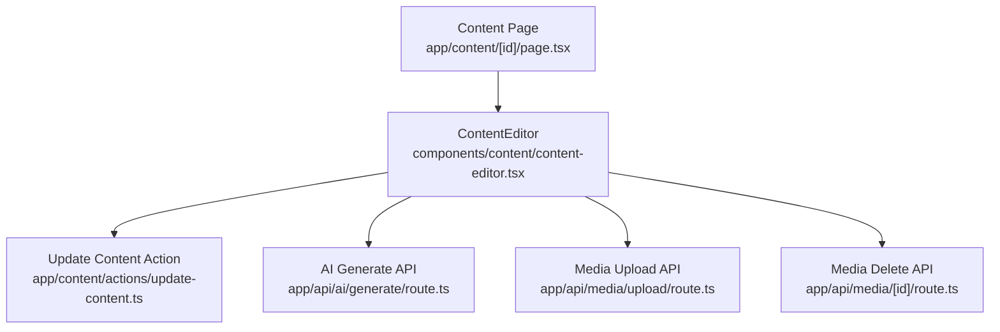
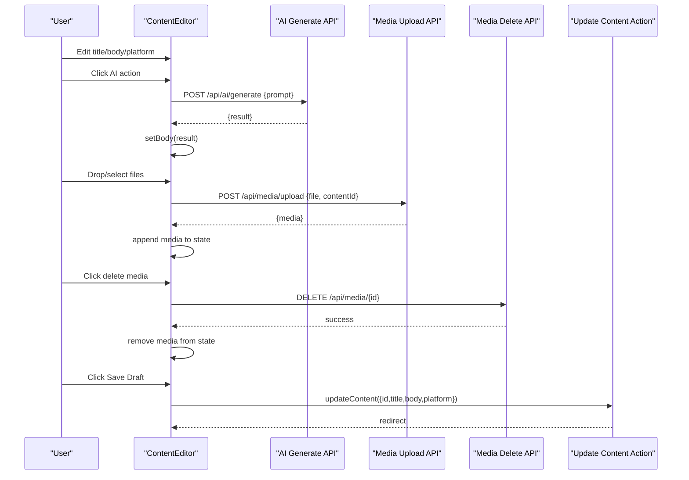
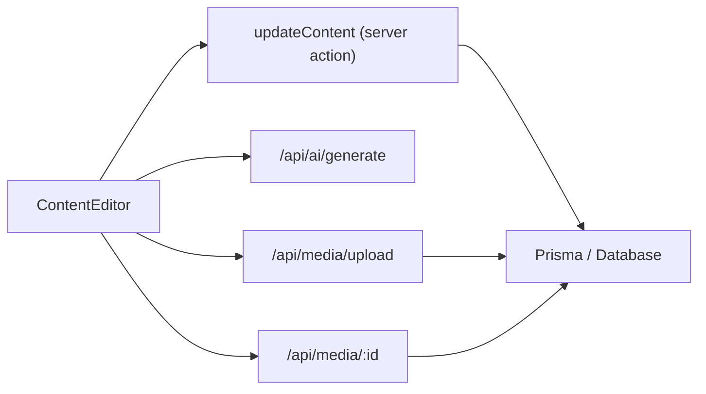

# Content Editor Component

<cite>
**Referenced Files in This Document**
- [content-editor.tsx](file://components/content/content-editor.tsx)
- [update-content.ts](file://app/content/actions/update-content.ts)
- [upload route.ts](file://app/api/media/upload/route.ts)
- [media delete route.ts](file://app/api/media/[id]/route.ts)
- [ai generate route.ts](file://app/api/ai/generate/route.ts)
- [content page.tsx](file://app/content/[id]/page.tsx)
</cite>

## Table of Contents
1. Introduction
2. Project Structure
3. Core Components
4. Architecture Overview
5. Detailed Component Analysis
6. Dependency Analysis
7. Performance Considerations
8. Troubleshooting Guide
9. Conclusion

## Introduction
This document explains the ContentEditor component, a rich content creation interface for drafting and editing platform-specific content. It covers title and body editing with real-time character counting, AI-powered enhancements (Improve, Rewrite, Shorten, Expand, Fix Grammar, Make Engaging), media upload and management with drag-and-drop support, file validation, platform selection, state management using React hooks, async save operations with useTransition, error handling patterns, and integration with server actions and API routes for persistence. It also details media handling workflows, preview generation, responsive layout, accessibility considerations, keyboard navigation, mobile responsiveness, usage examples, prop interfaces, event handling patterns, and performance optimizations for large media files.

## Project Structure
The ContentEditor is embedded within the content workspace pages and integrates with server actions and API routes:
- The editor UI lives in components/content/content-editor.tsx.
- Saving content uses app/content/actions/update-content.ts.
- Media uploads are handled by app/api/media/upload/route.ts.
- Media deletion is handled by app/api/media/[id]/route.ts.
- AI enhancements call app/api/ai/generate/route.ts.
- The editor is rendered from app/content/[id]/page.tsx with initial data and media.

**Diagram sources**
- [content-editor.tsx:75-157](file://components/content/content-editor.tsx#L75-L157)
- [update-content.ts:13-46](file://app/content/actions/update-content.ts#L13-L46)
- [ai generate route.ts:87-203](file://app/api/ai/generate/route.ts#L87-L203)
- [upload route.ts:20-125](file://app/api/media/upload/route.ts#L20-L125)
- [media delete route.ts:1-200](file://app/api/media/[id]/route.ts#L1-L200)
- [content page.tsx:72-85](file://app/content/[id]/page.tsx#L72-L85)

**Section sources**
- [content-editor.tsx:1-596](file://components/content/content-editor.tsx#L1-L596)
- [content page.tsx:17-85](file://app/content/[id]/page.tsx#L17-L85)

## Core Components
- Title input: Binds to local state and updates on change; accessible via htmlFor/id pairing.
- Body textarea: Real-time character count displayed next to label; clears AI errors on edit.
- Platform selector: Dropdown to choose target platform; used by AI prompts and saved with content.
- Media section: Drag-and-drop zone, file picker, grid previews for images/videos, per-item delete button, upload progress and error messages.
- AI Editor: Buttons for Improve, Rewrite, Shorten, Expand, Fix Grammar, Make Engaging; shows active action and errors.
- Save controls: Uses useTransition to mark saving state; disabled during pending or concurrent operations.

Key props:
- id: string
- initialTitle: string
- initialBody: string
- initialPlatform: string
- initialMedia?: MediaItem[]
- disabled?: boolean

Media item shape:
- id: string
- url: string
- filename: string
- mimeType: string
- size: number
- type: string

State management:
- Local state for title, body, platform, media, uploading, uploadError, deletingId, isDragging, aiAction, aiError, isPending.
- useTransition wraps save operation to keep UI responsive.

Validation and constraints:
- File size limit: 50 MB.
- Allowed MIME types: image/jpeg, image/png, image/webp, image/gif, video/mp4, video/webm, video/quicktime.

Accessibility:
- Labels associated with inputs via htmlFor/id.
- Descriptive placeholders and status text.
- Keyboard-friendly buttons and inputs.

Responsive behavior:
- Grid switches from single column to two columns on small screens and up.

**Section sources**
- [content-editor.tsx:6-22](file://components/content/content-editor.tsx#L6-L22)
- [content-editor.tsx:24-34](file://components/content/content-editor.tsx#L24-L34)
- [content-editor.tsx:75-96](file://components/content/content-editor.tsx#L75-L96)
- [content-editor.tsx:316-593](file://components/content/content-editor.tsx#L316-L593)

## Architecture Overview
The editor orchestrates user interactions with three primary backends:
- Server action for saving content updates.
- API route for AI content enhancement.
- API routes for media upload and deletion.

**Diagram sources**
- [content-editor.tsx:99-157](file://components/content/content-editor.tsx#L99-L157)
- [content-editor.tsx:165-230](file://components/content/content-editor.tsx#L165-L230)
- [content-editor.tsx:273-314](file://components/content/content-editor.tsx#L273-L314)
- [ai generate route.ts:87-203](file://app/api/ai/generate/route.ts#L87-L203)
- [upload route.ts:20-125](file://app/api/media/upload/route.ts#L20-L125)
- [update-content.ts:13-46](file://app/content/actions/update-content.ts#L13-L46)

## Detailed Component Analysis

### State Management and Hooks
- useState manages all local UI state including form fields, media list, flags for uploading/deleting/dragging, and AI action/error states.
- useTransition wraps asynchronous save to avoid blocking UI and to show “Saving...” state.
- useRef holds the hidden file input element to programmatically open the file picker.

Complexity:
- Media array operations are O(n) for insert/delete; acceptable given typical media counts.

Optimization opportunities:
- Debounce heavy operations if needed (e.g., AI calls).
- Consider virtualization for very large media lists.

**Section sources**
- [content-editor.tsx:75-96](file://components/content/content-editor.tsx#L75-L96)
- [content-editor.tsx:148-157](file://components/content/content-editor.tsx#L148-L157)

### Title and Body Editing with Character Counting
- Title input updates local state immediately.
- Body textarea updates local state and clears AI errors on change.
- Character count displays current length in real time.

Accessibility:
- Label-to-input association ensures screen readers announce purpose.

**Section sources**
- [content-editor.tsx:316-361](file://components/content/content-editor.tsx#L316-L361)

### AI-Powered Enhancements
Actions:
- Improve, Rewrite, Shorten, Expand, Fix Grammar, Make Engaging.

Flow:
- Validates non-empty body.
- Sets active action and clears prior errors.
- Sends prompt including selected platform and current body to AI endpoint.
- On success, replaces body with result; on error, sets error message.
- Clears active action when done.

Error handling:
- Network or provider errors surfaced to user.
- Empty results treated as errors.

**Section sources**
- [content-editor.tsx:36-67](file://components/content/content-editor.tsx#L36-L67)
- [content-editor.tsx:99-146](file://components/content/content-editor.tsx#L99-L146)
- [ai generate route.ts:87-203](file://app/api/ai/generate/route.ts#L87-L203)

### Media Upload and Management
Capabilities:
- Drag-and-drop zone with visual feedback.
- Hidden file input triggered by button click.
- Validation: allowed MIME types and 50 MB size limit enforced client-side and server-side.
- Sequential upload loop with error accumulation and user-facing messages.
- Preview generation:
  - Images render directly.
  - Videos render with controls and metadata preloading.
- Deletion workflow:
  - Confirmation dialog.
  - DELETE request to server.
  - Removes item from local state on success.

Progress and errors:
- Uploading flag disables further uploads.
- Error messages shown under the media section.

Responsive layout:
- Grid adapts from one column to two columns on larger screens.

**Section sources**
- [content-editor.tsx:159-271](file://components/content/content-editor.tsx#L159-L271)
- [content-editor.tsx:363-498](file://components/content/content-editor.tsx#L363-L498)
- [upload route.ts:20-125](file://app/api/media/upload/route.ts#L20-L125)
- [media delete route.ts:1-200](file://app/api/media/[id]/route.ts#L1-L200)

### Platform Selection
- Dropdown allows selecting target platform.
- Platform value included in AI prompts and persisted with content.

**Section sources**
- [content-editor.tsx:540-563](file://components/content/content-editor.tsx#L540-L563)

### Save Operations with useTransition
- Save triggers server action updateContent with id, title, body, platform.
- useTransition keeps UI responsive and shows “Saving...” state.
- Server action validates title, checks content existence and status, persists changes, and redirects.

Error handling:
- Errors thrown by server action propagate to caller context; UI reflects pending state until completion.

**Section sources**
- [content-editor.tsx:148-157](file://components/content/content-editor.tsx#L148-L157)
- [update-content.ts:13-46](file://app/content/actions/update-content.ts#L13-L46)

### Integration with Pages
- The content page loads existing content and media, then passes them as props to ContentEditor.
- Media is mapped to the expected shape before passing down.

**Section sources**
- [content page.tsx:17-85](file://app/content/[id]/page.tsx#L17-L85)

### Accessibility and Keyboard Navigation
- All interactive elements are native inputs/buttons, ensuring keyboard focusability.
- Labels are explicitly associated with inputs.
- Status messages provide clear feedback for users relying on assistive technologies.

**Section sources**
- [content-editor.tsx:316-361](file://components/content/content-editor.tsx#L316-L361)
- [content-editor.tsx:500-538](file://components/content/content-editor.tsx#L500-L538)
- [content-editor.tsx:540-593](file://components/content/content-editor.tsx#L540-L593)

### Mobile Responsiveness
- Grid layout switches to single column on smaller screens.
- Touch-friendly button sizes and spacing.

**Section sources**
- [content-editor.tsx:420-481](file://components/content/content-editor.tsx#L420-L481)

## Dependency Analysis

**Diagram sources**
- [content-editor.tsx:99-157](file://components/content/content-editor.tsx#L99-L157)
- [update-content.ts:13-46](file://app/content/actions/update-content.ts#L13-L46)
- [ai generate route.ts:87-203](file://app/api/ai/generate/route.ts#L87-L203)
- [upload route.ts:20-125](file://app/api/media/upload/route.ts#L20-L125)
- [media delete route.ts:1-200](file://app/api/media/[id]/route.ts#L1-L200)

**Section sources**
- [content-editor.tsx:99-157](file://components/content/content-editor.tsx#L99-L157)
- [update-content.ts:13-46](file://app/content/actions/update-content.ts#L13-L46)
- [ai generate route.ts:87-203](file://app/api/ai/generate/route.ts#L87-L203)
- [upload route.ts:20-125](file://app/api/media/upload/route.ts#L20-L125)
- [media delete route.ts:1-200](file://app/api/media/[id]/route.ts#L1-L200)

## Performance Considerations
- useTransition prevents UI jank during save operations.
- Client-side validation reduces unnecessary network requests.
- Video elements preload metadata to avoid heavy loading until playback.
- For large media libraries:
  - Consider pagination or virtualization for previews.
  - Lazy-load images/videos when entering viewport.
- Avoid re-uploading identical files by checking existing media IDs before upload.
- Batch AI requests if multiple actions are triggered rapidly (debounce/throttle).

[No sources needed since this section provides general guidance]

## Troubleshooting Guide
Common issues and resolutions:
- AI empty response: Ensure body is not empty before triggering AI; check server logs for provider errors.
- Unsupported file type: Verify MIME type against allowed set; adjust client/server allowlists together.
- File too large: Enforce 50 MB limit both client and server; inform users clearly.
- Upload failures: Check network connectivity and server availability; review error messages returned by API.
- Delete failures: Confirm media exists and permissions are correct; handle non-ok responses gracefully.
- Save blocked: Disabled state occurs when AI is running, uploading, or already pending; wait for completion.

Server-side validations:
- Update content requires a non-empty title and non-published status.
- Media upload enforces content existence and file constraints.

**Section sources**
- [content-editor.tsx:99-146](file://components/content/content-editor.tsx#L99-L146)
- [content-editor.tsx:165-230](file://components/content/content-editor.tsx#L165-L230)
- [content-editor.tsx:273-314](file://components/content/content-editor.tsx#L273-L314)
- [update-content.ts:13-46](file://app/content/actions/update-content.ts#L13-L46)
- [upload route.ts:20-125](file://app/api/media/upload/route.ts#L20-L125)

## Conclusion
The ContentEditor component provides a robust, accessible, and responsive interface for creating and refining content. It integrates seamlessly with server actions and API routes to persist content, enhance it with AI, and manage media assets. Its state management leverages React hooks effectively, while error handling and validation ensure a reliable user experience. With thoughtful performance optimizations and accessibility features, it scales well for typical content creation workflows.

[No sources needed since this section summarizes without analyzing specific files]