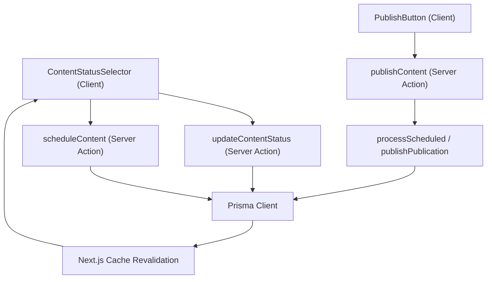
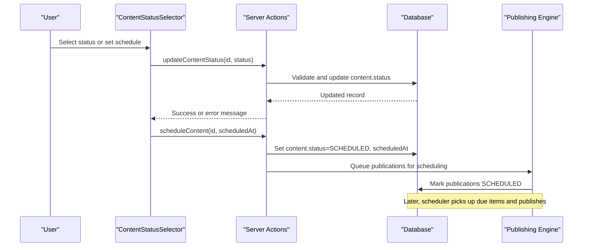
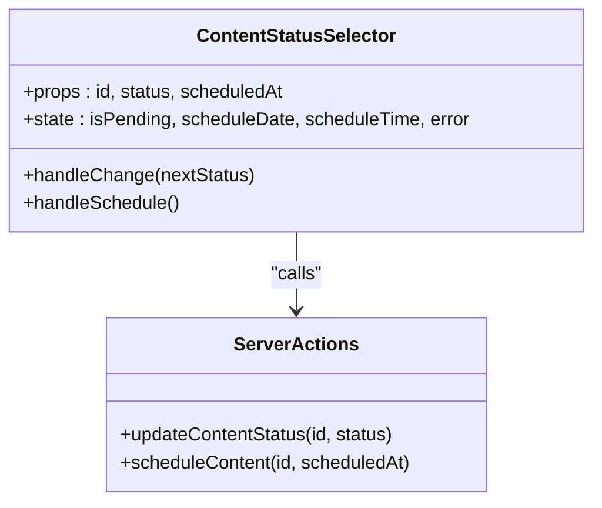
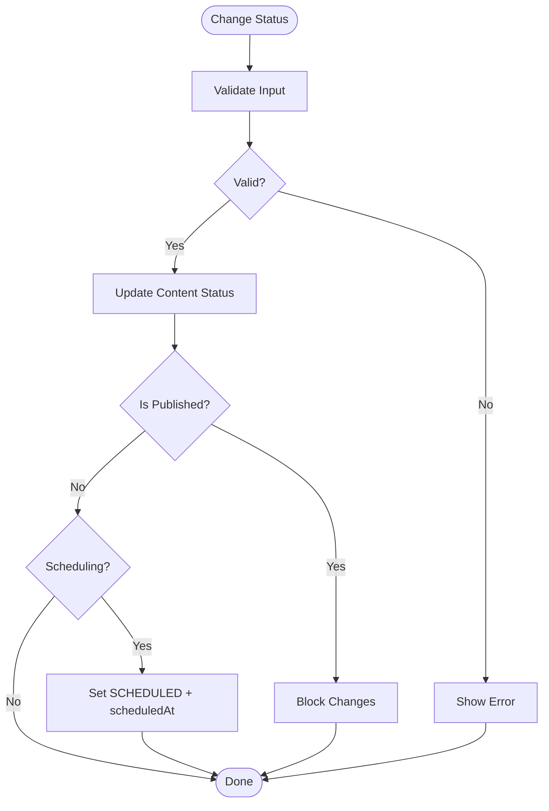
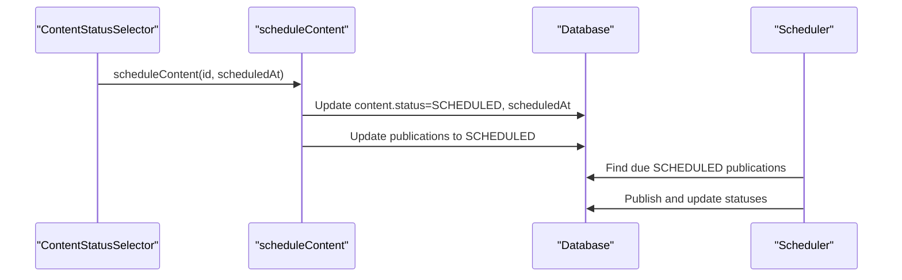
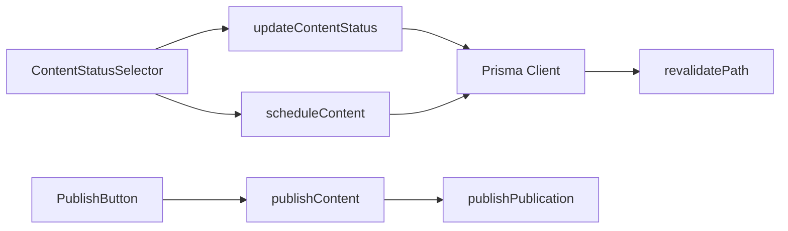
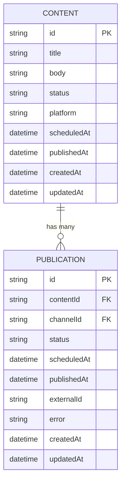

# Content Status Selector

<cite>
**Referenced Files in This Document**
- [content-status-selector.tsx](file://components/content/content-status-selector.tsx)
- [update-content-status.ts](file://app/content/actions/update-content-status.ts)
- [schedule-content.ts](file://app/content/actions/schedule-content.ts)
- [publish-content.ts](file://app/content/actions/publish-content.ts)
- [schema.prisma](file://prisma/schema.prisma)
- [process-scheduled.ts](file://app/publishing/engine/process-scheduled.ts)
- [publish-button.tsx](file://components/content/publish-button.tsx)
</cite>

## Table of Contents
1. [Introduction](#introduction)
2. [Project Structure](#project-structure)
3. [Core Components](#core-components)
4. [Architecture Overview](#architecture-overview)
5. [Detailed Component Analysis](#detailed-component-analysis)
6. [Dependency Analysis](#dependency-analysis)
7. [Performance Considerations](#performance-considerations)
8. [Troubleshooting Guide](#troubleshooting-guide)
9. [Conclusion](#conclusion)
10. [Appendices](#appendices)

## Introduction
This document provides comprehensive documentation for the ContentStatusSelector component, which manages content lifecycle states within a Next.js application. It explains available status options, transition rules, integration with publishing pipelines, props interface, event handling, server synchronization, accessibility considerations, and customization strategies.

## Project Structure
The ContentStatusSelector is part of a content management system that includes:
- A client-side selector UI for changing content status and scheduling
- Server actions to validate and persist state changes
- A publishing engine that processes scheduled items
- Data models defining content and publication lifecycles

**Diagram sources**
- [content-status-selector.tsx:17-92](file://components/content/content-status-selector.tsx#L17-L92)
- [update-content-status.ts:14-56](file://app/content/actions/update-content-status.ts#L14-L56)
- [schedule-content.ts:6-65](file://app/content/actions/schedule-content.ts#L6-L65)
- [publish-content.ts:7-68](file://app/content/actions/publish-content.ts#L7-L68)
- [process-scheduled.ts:4-70](file://app/publishing/engine/process-scheduled.ts#L4-L70)

**Section sources**
- [content-status-selector.tsx:1-184](file://components/content/content-status-selector.tsx#L1-L184)
- [schema.prisma:21-37](file://prisma/schema.prisma#L21-L37)

## Core Components
- ContentStatusSelector: A client component that lets users change content status and schedule publication time. It integrates with server actions to update the database and revalidate relevant pages.
- Publishing pipeline components:
  - PublishButton: Triggers immediate publishing when content is READY.
  - Server actions: updateContentStatus, scheduleContent, publishContent enforce validation and orchestrate updates.
  - Scheduler: processScheduled runs periodically to publish queued or scheduled items at their scheduled times.

Key responsibilities:
- Validate user input and transitions on both client and server
- Persist state changes via Prisma
- Revalidate caches to keep UI consistent
- Coordinate with publishing channels and engines

**Section sources**
- [content-status-selector.tsx:17-184](file://components/content/content-status-selector.tsx#L17-L184)
- [publish-button.tsx:11-65](file://components/content/publish-button.tsx#L11-L65)
- [update-content-status.ts:14-56](file://app/content/actions/update-content-status.ts#L14-L56)
- [schedule-content.ts:6-65](file://app/content/actions/schedule-content.ts#L6-L65)
- [publish-content.ts:7-68](file://app/content/actions/publish-content.ts#L7-L68)
- [process-scheduled.ts:4-70](file://app/publishing/engine/process-scheduled.ts#L4-L70)

## Architecture Overview
The content lifecycle spans client interactions, server validations, database persistence, and background processing:

**Diagram sources**
- [content-status-selector.tsx:44-92](file://components/content/content-status-selector.tsx#L44-L92)
- [update-content-status.ts:14-56](file://app/content/actions/update-content-status.ts#L14-L56)
- [schedule-content.ts:6-65](file://app/content/actions/schedule-content.ts#L6-L65)
- [process-scheduled.ts:4-70](file://app/publishing/engine/process-scheduled.ts#L4-L70)

## Detailed Component Analysis

### ContentStatusSelector Component
- Purpose: Allow users to change content status and schedule publication time.
- Props:
  - id: string — content identifier
  - status: string — current content status
  - scheduledAt?: string | Date | null — optional existing schedule
- Behavior:
  - Renders a select dropdown for statuses defined locally
  - Provides date/time inputs to schedule content
  - Uses React transitions to show pending state during async operations
  - Displays errors returned from server actions
  - When status is PUBLISHED, renders a read-only view

Validation and transitions:
- Client-side:
  - Requires both date and time to schedule
  - Ensures scheduled time is in the future
- Server-side:
  - Validates allowed statuses
  - Prevents changes to already published content
  - Enforces that scheduling requires a valid scheduledAt

Integration points:
- Calls updateContentStatus to change status
- Calls scheduleContent to set scheduledAt and status to SCHEDULED
- Revalidates multiple routes to reflect changes across the app

Accessibility:
- Uses labeled inputs with htmlFor/id pairs
- Disables controls during transitions to prevent duplicate submissions
- Shows inline error messages for invalid inputs

Customization hooks:
- The component currently uses a local list of statuses; extending it requires updating the local constant and any related UI logic

**Section sources**
- [content-status-selector.tsx:11-184](file://components/content/content-status-selector.tsx#L11-L184)

#### Class-like structure overview

**Diagram sources**
- [content-status-selector.tsx:17-92](file://components/content/content-status-selector.tsx#L17-L92)
- [update-content-status.ts:14-56](file://app/content/actions/update-content-status.ts#L14-L56)
- [schedule-content.ts:6-65](file://app/content/actions/schedule-content.ts#L6-L65)

### Status Options and Visual Representation
Current implementation:
- Available statuses in the selector are limited to DRAFT and READY
- Published content shows a read-only display without editing controls
- No built-in icons or color coding are present in the component

Notes:
- To add Draft, Scheduled, Published, Archived visual representations with icons and colors, extend the status list and render appropriate badges/icons based on status values
- Ensure any new statuses align with server-side validation and data model constraints

**Section sources**
- [content-status-selector.tsx:7-42](file://components/content/content-status-selector.tsx#L7-L42)

### Status Transition Workflow and Validation Rules
Allowed server-side statuses:
- DRAFT, READY, SCHEDULED

Transition rules enforced by server actions:
- Published content cannot be changed
- SCHEDULED requires a valid scheduledAt timestamp
- Only READY content can be published immediately via PublishButton

Workflow highlights:
- Changing status triggers updateContentStatus and revalidates relevant paths
- Scheduling sets content.status to SCHEDULED and schedules associated publications
- Publishing validates prerequisites (title/body presence, at least one channel queued)

**Diagram sources**
- [update-content-status.ts:14-56](file://app/content/actions/update-content-status.ts#L14-L56)
- [schedule-content.ts:6-65](file://app/content/actions/schedule-content.ts#L6-L65)
- [publish-content.ts:7-68](file://app/content/actions/publish-content.ts#L7-L68)

**Section sources**
- [update-content-status.ts:6-56](file://app/content/actions/update-content-status.ts#L6-L56)
- [schedule-content.ts:6-65](file://app/content/actions/schedule-content.ts#L6-L65)
- [publish-content.ts:7-68](file://app/content/actions/publish-content.ts#L7-L68)

### Integration with Publishing Pipeline
- Scheduling:
  - Sets content.status to SCHEDULED and updates scheduledAt
  - Updates related publications to SCHEDULED with matching timestamps
- Immediate publishing:
  - PublishButton triggers publishContent when content is READY
  - Validates title/body and presence of at least one queued publication
  - Delegates to publishPublication and revalidates routes
- Background processing:
  - processScheduled finds due SCHEDULED publications and publishes them

**Diagram sources**
- [schedule-content.ts:6-65](file://app/content/actions/schedule-content.ts#L6-L65)
- [process-scheduled.ts:4-70](file://app/publishing/engine/process-scheduled.ts#L4-L70)

**Section sources**
- [schedule-content.ts:6-65](file://app/content/actions/schedule-content.ts#L6-L65)
- [process-scheduled.ts:4-70](file://app/publishing/engine/process-scheduled.ts#L4-L70)

### Props Interface and Event Handling
Props:
- id: string — unique content identifier
- status: string — current status used to control UI behavior
- scheduledAt?: string | Date | null — prefill schedule fields if present

Events:
- onChange on status select triggers handleChange, which calls updateContentStatus
- Inputs for schedule date/time trigger handleSchedule, which validates and calls scheduleContent
- Errors are captured and displayed inline

State management:
- useTransition for pending states
- Local state for schedule date/time and error messages

**Section sources**
- [content-status-selector.tsx:11-92](file://components/content/content-status-selector.tsx#L11-L92)

### Synchronization with Server-Side Updates
- After successful updates, server actions call revalidatePath for multiple routes to ensure UI consistency
- This keeps lists, detail views, calendar, analytics, and publishing pages up-to-date without full page reloads

**Section sources**
- [update-content-status.ts:50-56](file://app/content/actions/update-content-status.ts#L50-L56)
- [schedule-content.ts:59-65](file://app/content/actions/schedule-content.ts#L59-L65)
- [publish-content.ts:61-68](file://app/content/actions/publish-content.ts#L61-L68)

### Accessibility Considerations
- Labels: Inputs have explicit labels linked via htmlFor/id
- Disabled states: Controls are disabled during transitions to prevent duplicate submissions
- Error messaging: Inline errors provide clear feedback for invalid inputs
- Keyboard navigation: Standard HTML elements support keyboard interaction out of the box

Recommendations for enhancement:
- Add aria-live regions for dynamic error/status updates
- Provide descriptive aria-labels for custom interactive elements if added later

**Section sources**
- [content-status-selector.tsx:96-180](file://components/content/content-status-selector.tsx#L96-L180)

### Customization Options for Roles and Permissions
Current implementation does not include role-based visibility or permissions. To customize:
- Wrap the selector with permission checks before rendering
- Conditionally enable/disable status options based on user roles
- Restrict scheduling or publishing actions according to permissions

[No sources needed since this section proposes enhancements beyond current code]

## Dependency Analysis
The component depends on:
- React hooks for state and transitions
- Server actions for validation and persistence
- Prisma for database access
- Next.js cache revalidation for UI consistency
- Publishing engine for scheduled and immediate publishing

**Diagram sources**
- [content-status-selector.tsx:17-92](file://components/content/content-status-selector.tsx#L17-L92)
- [update-content-status.ts:14-56](file://app/content/actions/update-content-status.ts#L14-L56)
- [schedule-content.ts:6-65](file://app/content/actions/schedule-content.ts#L6-L65)
- [publish-content.ts:7-68](file://app/content/actions/publish-content.ts#L7-L68)

**Section sources**
- [content-status-selector.tsx:17-92](file://components/content/content-status-selector.tsx#L17-L92)
- [update-content-status.ts:14-56](file://app/content/actions/update-content-status.ts#L14-L56)
- [schedule-content.ts:6-65](file://app/content/actions/schedule-content.ts#L6-L65)
- [publish-content.ts:7-68](file://app/content/actions/publish-content.ts#L7-L68)

## Performance Considerations
- Use of React transitions prevents blocking UI during async operations
- Server actions minimize client-server round trips by encapsulating validation and persistence
- Route revalidation ensures efficient cache updates without full page reloads
- Batch updates in transactions reduce database contention when scheduling

[No sources needed since this section provides general guidance]

## Troubleshooting Guide
Common issues and resolutions:
- Invalid status: Ensure status is one of the allowed values; server will reject others
- Published content changes blocked: Published items cannot be edited; create new content instead
- Scheduling errors:
  - Missing date/time: Both fields must be provided
  - Past date/time: Must be in the future
  - Invalid format: Ensure ISO-compatible datetime string
- Publishing failures:
  - Content not READY: Only READY content can be published immediately
  - Missing title/body: Ensure required fields are present
  - No queued publication: At least one channel must be queued or scheduled

Where to look:
- Client-side validation in ContentStatusSelector
- Server-side validation in updateContentStatus, scheduleContent, publishContent
- Scheduler logs in processScheduled for background publishing outcomes

**Section sources**
- [content-status-selector.tsx:60-92](file://components/content/content-status-selector.tsx#L60-L92)
- [update-content-status.ts:14-56](file://app/content/actions/update-content-status.ts#L14-L56)
- [schedule-content.ts:6-65](file://app/content/actions/schedule-content.ts#L6-L65)
- [publish-content.ts:7-68](file://app/content/actions/publish-content.ts#L7-L68)
- [process-scheduled.ts:4-70](file://app/publishing/engine/process-scheduled.ts#L4-L70)

## Conclusion
The ContentStatusSelector provides a focused interface for managing content status and scheduling within a robust publishing workflow. While the current implementation supports DRAFT, READY, and SCHEDULED states with strict validation, it can be extended to include additional statuses like Published and Archived with appropriate UI indicators and role-based controls. Its tight integration with server actions and the publishing engine ensures reliable state transitions and synchronized UI updates.

[No sources needed since this section summarizes without analyzing specific files]

## Appendices

### Data Model Reference
The Content model defines core fields including status and scheduling timestamps, while Publication tracks per-channel publishing state.

**Diagram sources**
- [schema.prisma:21-37](file://prisma/schema.prisma#L21-L37)
- [schema.prisma:75-93](file://prisma/schema.prisma#L75-L93)