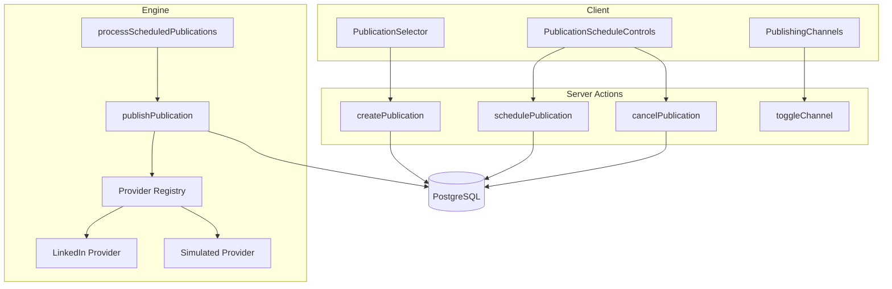
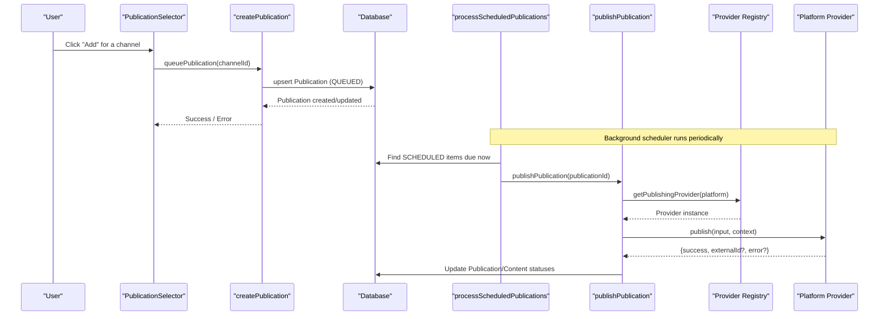
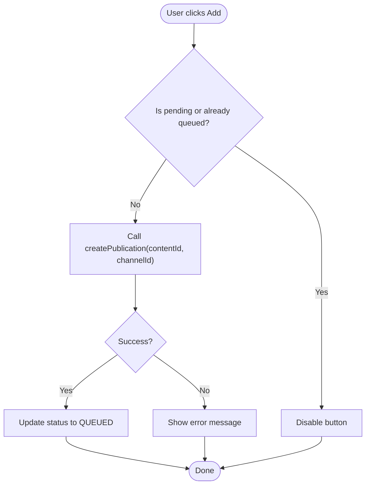
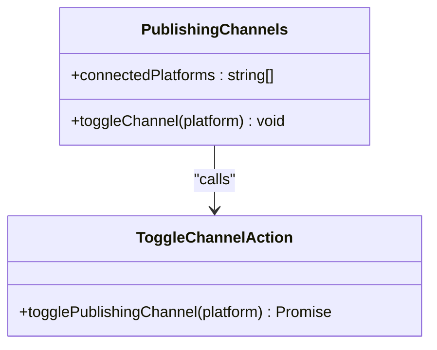
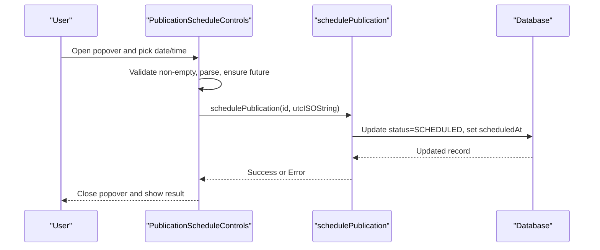
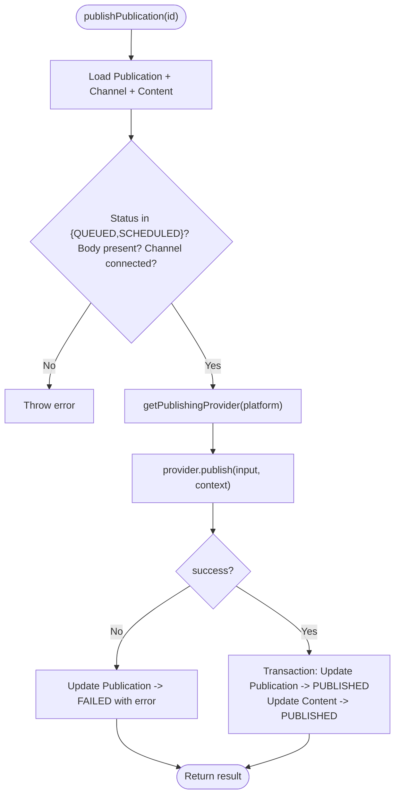
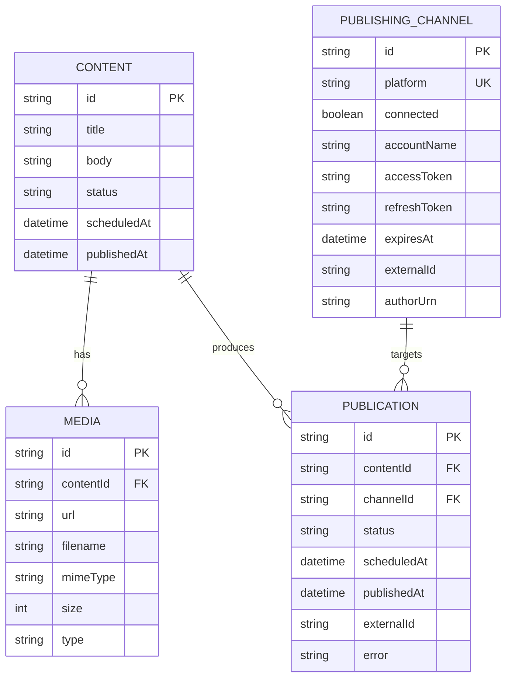
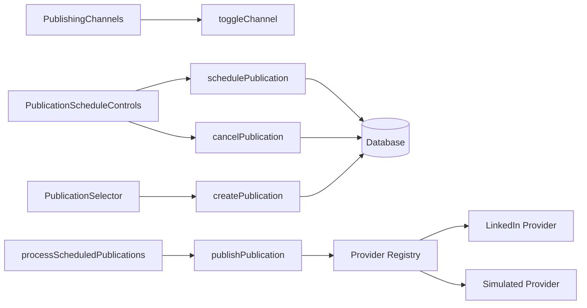

# Publication Selector

<cite>
**Referenced Files in This Document**
- [publication-selector.tsx](file://components/content/publication-selector.tsx)
- [publishing-channels.tsx](file://components/publishing/publishing-channels.tsx)
- [publication-schedule-controls.tsx](file://components/publishing/publication-schedule-controls.tsx)
- [page.tsx](file://app/publishing/page.tsx)
- [create-publication.ts](file://app/content/actions/create-publication.ts)
- [schedule-publication.ts](file://app/publishing/actions/schedule-publication.ts)
- [cancel-publication.ts](file://app/publishing/actions/cancel-publication.ts)
- [toggle-channel.ts](file://app/publishing/actions/toggle-channel.ts)
- [publish.ts](file://app/publishing/engine/publish.ts)
- [process-scheduled.ts](file://app/publishing/engine/process-scheduled.ts)
- [types.ts](file://app/publishing/engine/types.ts)
- [providers/index.ts](file://app/publishing/engine/providers/index.ts)
- [linkedin.ts](file://app/publishing/engine/providers/linkedin.ts)
- [simulated.ts](file://app/publishing/engine/providers/simulated.ts)
- [schema.prisma](file://prisma/schema.prisma)
</cite>

## Table of Contents
1. Introduction
2. Project Structure
3. Core Components
4. Architecture Overview
5. Detailed Component Analysis
6. Dependency Analysis
7. Performance Considerations
8. Troubleshooting Guide
9. Conclusion
10. Appendices

## Introduction
This document provides comprehensive documentation for the PublicationSelector component and its surrounding publishing workflow. It explains how users select platforms, connect accounts, configure publishing schedules, and interact with the publishing engine. It also covers platform-specific settings and limitations, validation rules, UI patterns for connected accounts and authentication status, scheduling interface details (including timezone handling), batch publishing setup, error recovery, accessibility and responsive design considerations, integration points across the application, and security considerations for credentials and tokens.

## Project Structure
The publication flow spans client components, server actions, a publishing engine with provider abstractions, and database models:
- Client components:
  - PublicationSelector: per-content channel selection and queueing
  - PublishingChannels: global channel connection management
  - PublicationScheduleControls: per-publication scheduling and cancellation
- Server actions:
  - createPublication, schedulePublication, cancelPublication, toggleChannel
- Publishing engine:
  - publishPublication orchestrates provider dispatch and state updates
  - processScheduledPublications runs scheduled items
  - Provider registry and implementations (LinkedIn, simulated)
- Data model:
  - Prisma schema defines Content, Media, PublishingChannel, and Publication entities

**Diagram sources**
- [publication-selector.tsx:38-61](file://components/content/publication-selector.tsx#L38-L61)
- [publishing-channels.tsx:33-42](file://components/publishing/publishing-channels.tsx#L33-L42)
- [publication-schedule-controls.tsx:30-90](file://components/publishing/publication-schedule-controls.tsx#L30-L90)
- [create-publication.ts:6-68](file://app/content/actions/create-publication.ts#L6-L68)
- [schedule-publication.ts:6-51](file://app/publishing/actions/schedule-publication.ts#L6-L51)
- [cancel-publication.ts:6-52](file://app/publishing/actions/cancel-publication.ts#L6-L52)
- [toggle-channel.ts:6-39](file://app/publishing/actions/toggle-channel.ts#L6-L39)
- [publish.ts:4-115](file://app/publishing/engine/publish.ts#L4-L115)
- [process-scheduled.ts:4-71](file://app/publishing/engine/process-scheduled.ts#L4-L71)
- [providers/index.ts:5-20](file://app/publishing/engine/providers/index.ts#L5-L20)
- [linkedin.ts:141-283](file://app/publishing/engine/providers/linkedin.ts#L141-L283)
- [simulated.ts:8-32](file://app/publishing/engine/providers/simulated.ts#L8-L32)

**Section sources**
- [publication-selector.tsx:1-138](file://components/content/publication-selector.tsx#L1-L138)
- [publishing-channels.tsx:1-147](file://components/publishing/publishing-channels.tsx#L1-L147)
- [publication-schedule-controls.tsx:1-181](file://components/publishing/publication-schedule-controls.tsx#L1-L181)
- [page.tsx:1-186](file://app/publishing/page.tsx#L1-L186)
- [create-publication.ts:1-69](file://app/content/actions/create-publication.ts#L1-L69)
- [schedule-publication.ts:1-52](file://app/publishing/actions/schedule-publication.ts#L1-L52)
- [cancel-publication.ts:1-53](file://app/publishing/actions/cancel-publication.ts#L1-L53)
- [toggle-channel.ts:1-40](file://app/publishing/actions/toggle-channel.ts#L1-L40)
- [publish.ts:1-116](file://app/publishing/engine/publish.ts#L1-L116)
- [process-scheduled.ts:1-72](file://app/publishing/engine/process-scheduled.ts#L1-L72)
- [types.ts:1-37](file://app/publishing/engine/types.ts#L1-L37)
- [providers/index.ts:1-21](file://app/publishing/engine/providers/index.ts#L1-L21)
- [linkedin.ts:1-284](file://app/publishing/engine/providers/linkedin.ts#L1-L284)
- [simulated.ts:1-33](file://app/publishing/engine/providers/simulated.ts#L1-L33)
- [schema.prisma:1-94](file://prisma/schema.prisma#L1-L94)

## Core Components
- PublicationSelector
  - Purpose: Let users add content to a publishing queue for each connected channel.
  - Behavior: Queues a publication via createPublication; shows current status per channel; displays errors.
  - Props: contentId, channels, publications, disabled.
  - Status mapping: QUEUED, PUBLISHING, PUBLISHED, FAILED.
- PublishingChannels
  - Purpose: Manage connections to platforms from the publishing center.
  - Behavior: Toggle channel connectivity; special LinkedIn Connect link; shows connected count.
- PublicationScheduleControls
  - Purpose: Schedule or reschedule a publication and cancel scheduled ones.
  - Behavior: Local datetime input validated to future time; converts local time to UTC; persists SCHEDULED; supports Cancel back to QUEUED.

**Section sources**
- [publication-selector.tsx:16-61](file://components/content/publication-selector.tsx#L16-L61)
- [publishing-channels.tsx:29-42](file://components/publishing/publishing-channels.tsx#L29-L42)
- [publication-schedule-controls.tsx:7-90](file://components/publishing/publication-schedule-controls.tsx#L7-L90)

## Architecture Overview
The system uses a provider abstraction to decouple platform integrations from the core publishing logic. The client triggers server actions that update the database. A background scheduler processes due items, which calls the engine’s publish function. The engine validates state, selects the appropriate provider, executes the publish call, and updates statuses atomically.

**Diagram sources**
- [publication-selector.tsx:47-61](file://components/content/publication-selector.tsx#L47-L61)
- [create-publication.ts:6-68](file://app/content/actions/create-publication.ts#L6-L68)
- [process-scheduled.ts:4-71](file://app/publishing/engine/process-scheduled.ts#L4-L71)
- [publish.ts:4-115](file://app/publishing/engine/publish.ts#L4-L115)
- [providers/index.ts:5-20](file://app/publishing/engine/providers/index.ts#L5-L20)
- [linkedin.ts:141-283](file://app/publishing/engine/providers/linkedin.ts#L141-L283)
- [simulated.ts:8-32](file://app/publishing/engine/providers/simulated.ts#L8-L32)

## Detailed Component Analysis

### PublicationSelector
- Responsibilities:
  - Display available channels and their publication status.
  - Queue a publication for a selected channel.
  - Show transient errors during queuing.
- Interaction model:
  - Uses React transitions to avoid blocking UI during async operations.
  - Disables controls while pending or when already queued.
- Validation and constraints:
  - Enforced by server action: content must exist, not already published; channel must be connected; prevents duplicate published entries.
- UI patterns:
  - Empty state when no channels are connected.
  - Per-row status label mapped from backend status values.
  - Inline error message below the list.

**Diagram sources**
- [publication-selector.tsx:47-61](file://components/content/publication-selector.tsx#L47-L61)
- [create-publication.ts:6-68](file://app/content/actions/create-publication.ts#L6-L68)

**Section sources**
- [publication-selector.tsx:16-138](file://components/content/publication-selector.tsx#L16-L138)
- [create-publication.ts:1-69](file://app/content/actions/create-publication.ts#L1-L69)

### PublishingChannels
- Responsibilities:
  - Show all supported platforms and their connection state.
  - Allow toggling connection status or redirect to OAuth for LinkedIn.
- Behavior:
  - Toggles channel connectivity via server action.
  - Clears sensitive fields on disconnect (token, refresh token, expiry, external identifiers).
- UI patterns:
  - Connected indicator dot and text.
  - Platform-specific Connect link for LinkedIn; generic Connect/Disconnect buttons for others.

**Diagram sources**
- [publishing-channels.tsx:33-42](file://components/publishing/publishing-channels.tsx#L33-L42)
- [toggle-channel.ts:6-39](file://app/publishing/actions/toggle-channel.ts#L6-L39)

**Section sources**
- [publishing-channels.tsx:1-147](file://components/publishing/publishing-channels.tsx#L1-L147)
- [toggle-channel.ts:1-40](file://app/publishing/actions/toggle-channel.ts#L1-L40)

### PublicationScheduleControls
- Responsibilities:
  - Schedule or reschedule a publication to a future date/time.
  - Cancel a scheduled publication to revert to queued state.
- Timezone handling:
  - Uses browser’s datetime-local value (local time).
  - Converts to an absolute UTC ISO string before persisting.
  - Validates that the chosen time is in the future.
- UI patterns:
  - Popover with title, description, datetime input, error display, and Save/Close actions.
  - Conditional rendering based on publication status (Published, Scheduled, other).

**Diagram sources**
- [publication-schedule-controls.tsx:22-73](file://components/publishing/publication-schedule-controls.tsx#L22-L73)
- [schedule-publication.ts:6-51](file://app/publishing/actions/schedule-publication.ts#L6-L51)

**Section sources**
- [publication-schedule-controls.tsx:1-181](file://components/publishing/publication-schedule-controls.tsx#L1-L181)
- [schedule-publication.ts:1-52](file://app/publishing/actions/schedule-publication.ts#L1-L52)

### Publishing Engine and Providers
- Engine responsibilities:
  - Load publication and validate preconditions (status, content body, channel connected).
  - Resolve provider by platform and invoke publish.
  - On success, atomically update Publication and Content to PUBLISHED and clear scheduling fields.
  - On failure, mark Publication as FAILED with error.
- Provider registry:
  - Maps platform names to provider instances.
  - Throws if no provider configured for a platform.
- LinkedIn provider specifics:
  - Requires access token and author URN; checks expiration.
  - Uploads first image media via LinkedIn’s upload flow, then creates post with optional image.
  - Returns externalId from response headers when successful.
- Simulated provider:
  - Logs inputs and returns success with a synthetic externalId for development/testing.

**Diagram sources**
- [publish.ts:4-115](file://app/publishing/engine/publish.ts#L4-L115)
- [providers/index.ts:5-20](file://app/publishing/engine/providers/index.ts#L5-L20)
- [linkedin.ts:141-283](file://app/publishing/engine/providers/linkedin.ts#L141-L283)
- [simulated.ts:8-32](file://app/publishing/engine/providers/simulated.ts#L8-L32)

**Section sources**
- [publish.ts:1-116](file://app/publishing/engine/publish.ts#L1-L116)
- [providers/index.ts:1-21](file://app/publishing/engine/providers/index.ts#L1-L21)
- [linkedin.ts:1-284](file://app/publishing/engine/providers/linkedin.ts#L1-L284)
- [simulated.ts:1-33](file://app/publishing/engine/providers/simulated.ts#L1-L33)

### Data Model and Relationships
- Entities:
  - Content: title, body, status, timestamps, optional platform and scheduling fields.
  - Media: linked to Content with URL, filename, MIME type, size, type.
  - PublishingChannel: platform identifier, connection flags, account metadata, tokens, expiry, external identifiers.
  - Publication: links Content and Channel; tracks status, scheduling, publishing results, and errors.
- Constraints:
  - Unique constraint on (contentId, channelId) ensures one publication per content per channel.
  - Cascade deletes maintain referential integrity.

**Diagram sources**
- [schema.prisma:21-93](file://prisma/schema.prisma#L21-L93)

**Section sources**
- [schema.prisma:1-94](file://prisma/schema.prisma#L1-L94)

## Dependency Analysis
- Client-to-server coupling:
  - PublicationSelector depends on createPublication server action.
  - PublishingChannels depends on toggleChannel server action.
  - PublicationScheduleControls depends on schedulePublication and cancelPublication server actions.
- Server-to-engine coupling:
  - publishPublication depends on provider registry and individual providers.
  - processScheduledPublications drives publishPublication for due items.
- External dependencies:
  - LinkedIn API for authenticated posting and media uploads.
  - Database (PostgreSQL) via Prisma for persistence.

**Diagram sources**
- [publication-selector.tsx:47-61](file://components/content/publication-selector.tsx#L47-L61)
- [publishing-channels.tsx:33-42](file://components/publishing/publishing-channels.tsx#L33-L42)
- [publication-schedule-controls.tsx:30-90](file://components/publishing/publication-schedule-controls.tsx#L30-L90)
- [create-publication.ts:6-68](file://app/content/actions/create-publication.ts#L6-L68)
- [schedule-publication.ts:6-51](file://app/publishing/actions/schedule-publication.ts#L6-L51)
- [cancel-publication.ts:6-52](file://app/publishing/actions/cancel-publication.ts#L6-L52)
- [process-scheduled.ts:4-71](file://app/publishing/engine/process-scheduled.ts#L4-L71)
- [publish.ts:4-115](file://app/publishing/engine/publish.ts#L4-L115)
- [providers/index.ts:5-20](file://app/publishing/engine/providers/index.ts#L5-L20)
- [linkedin.ts:141-283](file://app/publishing/engine/providers/linkedin.ts#L141-L283)
- [simulated.ts:8-32](file://app/publishing/engine/providers/simulated.ts#L8-L32)

**Section sources**
- [publish.ts:1-116](file://app/publishing/engine/publish.ts#L1-L116)
- [process-scheduled.ts:1-72](file://app/publishing/engine/process-scheduled.ts#L1-L72)
- [providers/index.ts:1-21](file://app/publishing/engine/providers/index.ts#L1-L21)

## Performance Considerations
- Use React transitions to keep UI responsive during server calls.
- Batch operations:
  - The scheduler processes up to a fixed number of due items per run to limit load.
  - Publishing uses a database transaction to minimize inconsistent states.
- Avoid redundant re-renders:
  - Revalidate only necessary paths after mutations.
- Provider efficiency:
  - LinkedIn provider uploads images once and reuses URNs within a single post creation.

[No sources needed since this section provides general guidance]

## Troubleshooting Guide
Common issues and recovery steps:
- No connected channels
  - Symptom: “No connected channels” message in PublicationSelector.
  - Action: Connect a channel via PublishingChannels or LinkedIn Connect link.
- Invalid or past schedule
  - Symptom: Error indicating invalid or non-future date.
  - Action: Choose a future date/time; ensure correct timezone interpretation.
- Already published or duplicate
  - Symptom: Errors preventing re-queuing or rescheduling.
  - Action: Verify content and publication statuses; do not re-add published content.
- Missing or expired credentials (LinkedIn)
  - Symptom: Failure with missing or expired token messages.
  - Action: Reconnect LinkedIn to obtain fresh tokens and required permissions.
- Network or API failures
  - Symptom: Failed status with error details.
  - Action: Retry after resolving network issues; check logs for provider responses.

**Section sources**
- [publication-selector.tsx:75-85](file://components/content/publication-selector.tsx#L75-L85)
- [publication-schedule-controls.tsx:30-73](file://components/publishing/publication-schedule-controls.tsx#L30-L73)
- [create-publication.ts:10-41](file://app/content/actions/create-publication.ts#L10-L41)
- [schedule-publication.ts:10-32](file://app/publishing/actions/schedule-publication.ts#L10-L32)
- [linkedin.ts:148-180](file://app/publishing/engine/providers/linkedin.ts#L148-L180)
- [publish.ts:23-44](file://app/publishing/engine/publish.ts#L23-L44)

## Conclusion
The PublicationSelector integrates seamlessly with a robust publishing pipeline that supports multi-platform distribution through a provider abstraction. Users can select channels, manage connections, and schedule content with clear feedback and error handling. The engine enforces validation, handles scheduling, and updates state consistently. Security-sensitive data is managed via server actions and provider checks, while the UI remains accessible and responsive. Future enhancements can expand platform support and refine scheduling conflict detection and retry strategies.

[No sources needed since this section summarizes without analyzing specific files]

## Appendices

### Platform-Specific Settings and Limitations
- LinkedIn
  - Requires access token and author URN; token expiration is enforced.
  - Supports image posts; currently uses the first image found in media.
  - External post ID captured from response headers.
- Simulated
  - Always succeeds for development; useful for end-to-end testing without real APIs.

**Section sources**
- [linkedin.ts:148-180](file://app/publishing/engine/providers/linkedin.ts#L148-L180)
- [linkedin.ts:238-270](file://app/publishing/engine/providers/linkedin.ts#L238-L270)
- [simulated.ts:8-32](file://app/publishing/engine/providers/simulated.ts#L8-L32)

### Batch Publishing Setup
- Create multiple publications for the same content across different channels using PublicationSelector.
- Schedule each independently via PublicationScheduleControls.
- The scheduler processes due items in batches to reduce overhead.

**Section sources**
- [publication-selector.tsx:87-127](file://components/content/publication-selector.tsx#L87-L127)
- [process-scheduled.ts:11-27](file://app/publishing/engine/process-scheduled.ts#L11-L27)

### Accessibility and Responsive Design
- Keyboard navigation:
  - Buttons and inputs are focusable; use standard HTML semantics.
- Visual indicators:
  - Status badges and inline errors provide clear feedback.
- Responsive layout:
  - Grids and spacing adapt across screen sizes; tables scroll horizontally on small devices.

**Section sources**
- [publishing-channels.tsx:62-143](file://components/publishing/publishing-channels.tsx#L62-L143)
- [page.tsx:103-166](file://app/publishing/page.tsx#L103-L166)

### Security Considerations
- Credentials storage:
  - Tokens and secrets stored in the database; cleared on disconnect.
- Token lifecycle:
  - Expiration checked before publishing; prompts reconnection when expired.
- Input validation:
  - Server-side validation prevents invalid schedules and unauthorized actions.
- Least privilege:
  - Providers request only necessary scopes and identifiers.

**Section sources**
- [toggle-channel.ts:14-27](file://app/publishing/actions/toggle-channel.ts#L14-L27)
- [linkedin.ts:148-180](file://app/publishing/engine/providers/linkedin.ts#L148-L180)
- [schedule-publication.ts:10-18](file://app/publishing/actions/schedule-publication.ts#L10-L18)