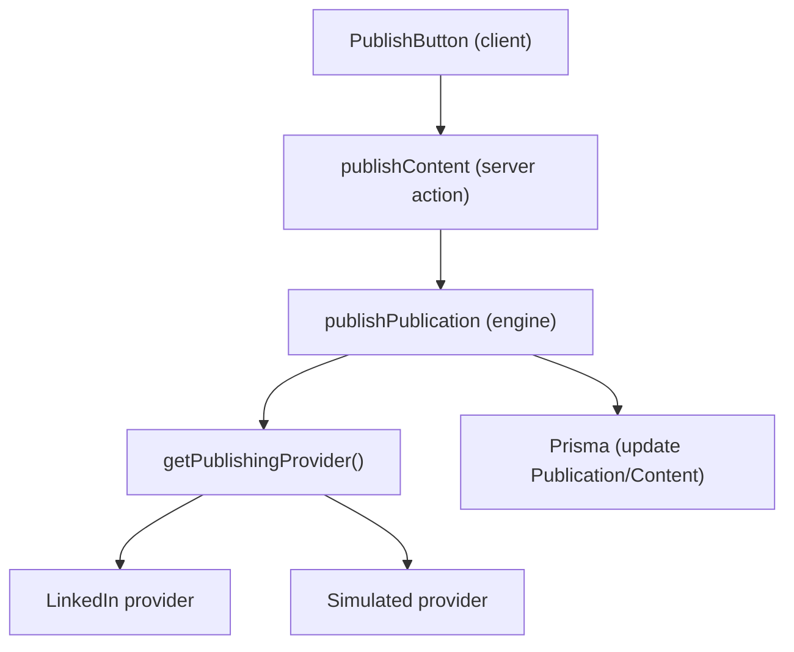
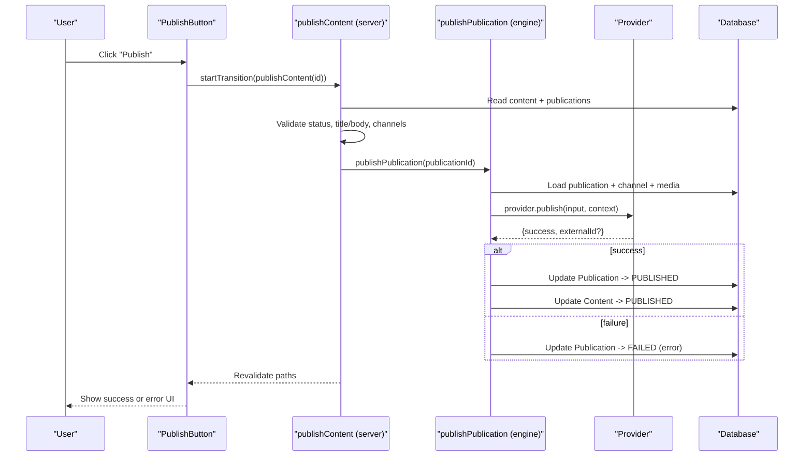
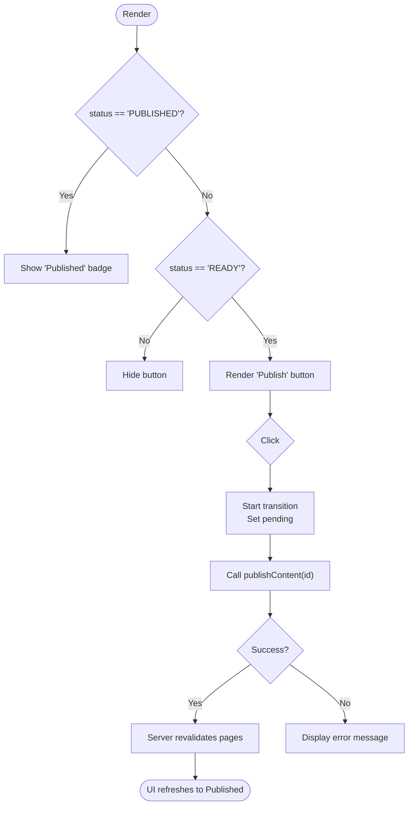
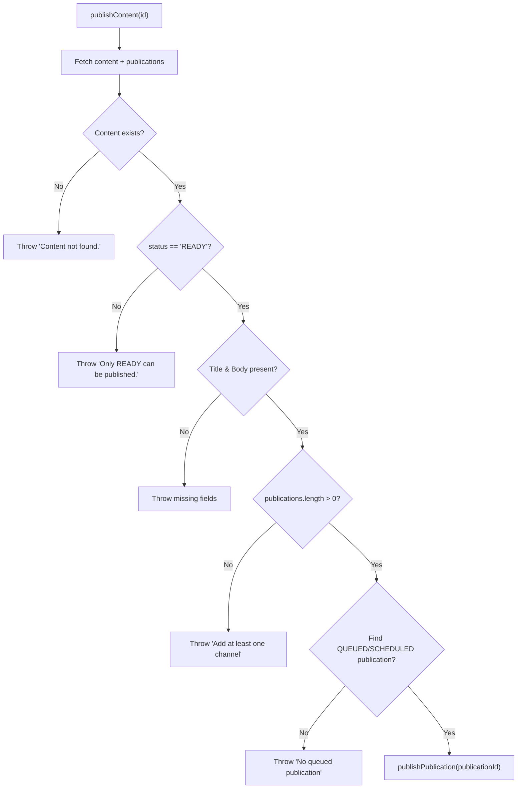
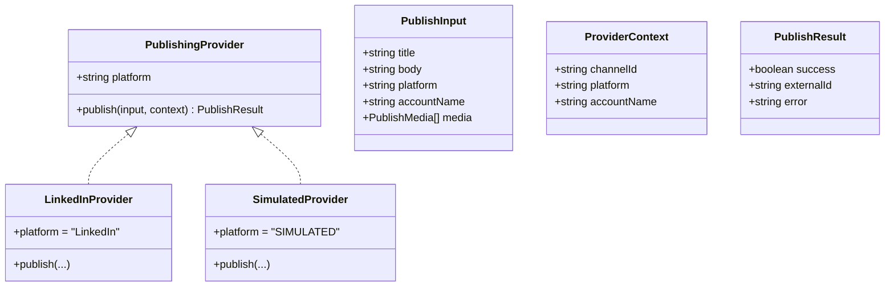
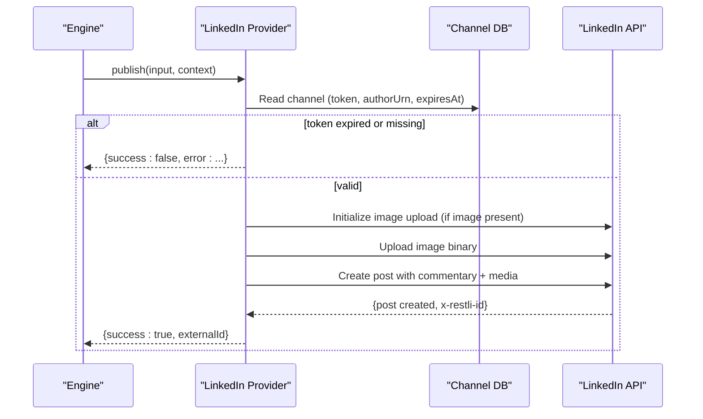
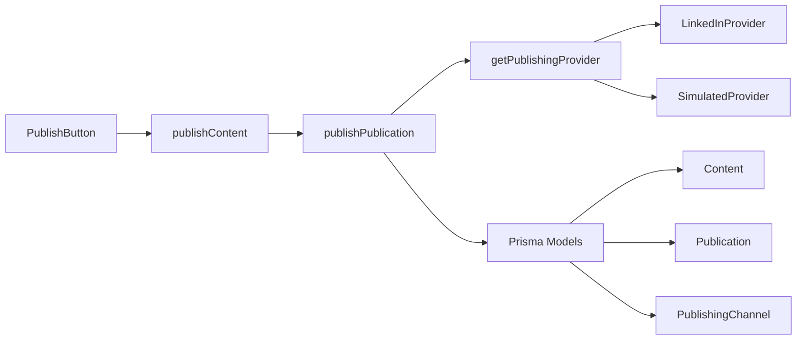

# Publish Button

<cite>
**Referenced Files in This Document**
- [publish-button.tsx](file://components/content/publish-button.tsx)
- [publish-content.ts](file://app/content/actions/publish-content.ts)
- [publish.ts](file://app/publishing/engine/publish.ts)
- [types.ts](file://app/publishing/engine/types.ts)
- [index.ts](file://app/publishing/engine/providers/index.ts)
- [linkedin.ts](file://app/publishing/engine/providers/linkedin.ts)
- [simulated.ts](file://app/publishing/engine/providers/simulated.ts)
- [publication-selector.tsx](file://components/content/publication-selector.tsx)
- [content-editor.tsx](file://components/content/content-editor.tsx)
- [page.tsx](file://app/content/[id]/page.tsx)
- [schema.prisma](file://prisma/schema.prisma)
</cite>

## Table of Contents
1. [Introduction](#introduction)
2. [Project Structure](#project-structure)
3. [Core Components](#core-components)
4. [Architecture Overview](#architecture-overview)
5. [Detailed Component Analysis](#detailed-component-analysis)
6. [Dependency Analysis](#dependency-analysis)
7. [Performance Considerations](#performance-considerations)
8. [Troubleshooting Guide](#troubleshooting-guide)
9. [Conclusion](#conclusion)
10. [Appendices](#appendices)

## Introduction
This document explains the PublishButton component and its end-to-end publishing workflow. It covers button states, validation, platform-specific publishing logic, progress feedback, error handling, queue management, retry strategies, user experience details (loading indicators, success confirmations, actionable errors), accessibility, mobile responsiveness, and performance considerations for large content and concurrent operations.

## Project Structure
The publishing flow spans a client-side button, server actions, an engine that orchestrates providers, and database state transitions.

**Diagram sources**
- [publish-button.tsx:11-63](file://components/content/publish-button.tsx#L11-L63)
- [publish-content.ts:7-69](file://app/content/actions/publish-content.ts#L7-L69)
- [publish.ts:4-115](file://app/publishing/engine/publish.ts#L4-L115)
- [index.ts:5-20](file://app/publishing/engine/providers/index.ts#L5-L20)
- [linkedin.ts:141-283](file://app/publishing/engine/providers/linkedin.ts#L141-L283)
- [simulated.ts:8-32](file://app/publishing/engine/providers/simulated.ts#L8-L32)

**Section sources**
- [publish-button.tsx:1-65](file://components/content/publish-button.tsx#L1-L65)
- [publish-content.ts:1-70](file://app/content/actions/publish-content.ts#L1-L70)
- [publish.ts:1-116](file://app/publishing/engine/publish.ts#L1-L116)
- [index.ts:1-21](file://app/publishing/engine/providers/index.ts#L1-L21)
- [linkedin.ts:1-284](file://app/publishing/engine/providers/linkedin.ts#L1-L284)
- [simulated.ts:1-33](file://app/publishing/engine/providers/simulated.ts#L1-L33)

## Core Components
- PublishButton: Client component that triggers publishing via a Next.js server action and shows loading/error states.
- publishContent: Server action that validates content and delegates to the publishing engine.
- publishPublication: Engine function that selects the correct provider, publishes, and updates database records atomically.
- Providers: Platform implementations (LinkedIn, simulated) with specific API calls and error handling.
- Supporting UI: PublicationSelector queues channels; ContentEditor manages content and media.

**Section sources**
- [publish-button.tsx:11-63](file://components/content/publish-button.tsx#L11-L63)
- [publish-content.ts:7-69](file://app/content/actions/publish-content.ts#L7-L69)
- [publish.ts:4-115](file://app/publishing/engine/publish.ts#L4-L115)
- [publication-selector.tsx:38-135](file://components/content/publication-selector.tsx#L38-L135)
- [content-editor.tsx:75-596](file://components/content/content-editor.tsx#L75-L596)

## Architecture Overview
The PublishButton initiates a transition-based async operation that calls a server action. The server action performs validation checks on the content and ensures at least one queued publication exists. It then invokes the publishing engine, which resolves the appropriate provider based on the channel’s platform, executes the platform-specific publish call, and updates both the Publication and Content records within a transaction.

**Diagram sources**
- [publish-button.tsx:30-44](file://components/content/publish-button.tsx#L30-L44)
- [publish-content.ts:7-69](file://app/content/actions/publish-content.ts#L7-L69)
- [publish.ts:4-115](file://app/publishing/engine/publish.ts#L4-L115)
- [index.ts:10-20](file://app/publishing/engine/providers/index.ts#L10-L20)
- [linkedin.ts:141-283](file://app/publishing/engine/providers/linkedin.ts#L141-L283)

## Detailed Component Analysis

### PublishButton: States and UX
- States and visual feedback:
  - Idle: Shows “Publish” button when content status is READY.
  - Publishing: Button disabled with text “Queueing...” during server transition.
  - Success: After successful publish, the page revalidates and renders a “Published” read-only view.
  - Error: Displays a red error message below the button if the server action throws.
- Behavior:
  - Uses React useTransition to manage pending state without blocking UI.
  - Clears previous errors before starting a new publish attempt.
  - Calls publishContent server action with the content id.

**Diagram sources**
- [publish-button.tsx:11-63](file://components/content/publish-button.tsx#L11-L63)

**Section sources**
- [publish-button.tsx:11-63](file://components/content/publish-button.tsx#L11-L63)

### Server Validation and Queue Management
- Validation performed by publishContent:
  - Content must exist.
  - Content status must be READY.
  - Title and body must be non-empty.
  - At least one publication channel must be selected.
  - There must be an active publication in QUEUED or SCHEDULED state.
- Queue selection:
  - Finds the first publication with status QUEUED or SCHEDULED and passes it to the engine.
- Post-publish:
  - Revalidates multiple routes to reflect updated state across the app.

**Diagram sources**
- [publish-content.ts:7-55](file://app/content/actions/publish-content.ts#L7-L55)

**Section sources**
- [publish-content.ts:7-69](file://app/content/actions/publish-content.ts#L7-L69)

### Publishing Engine and Provider Integration
- Engine responsibilities:
  - Load publication with related content, media, and channel.
  - Validate publication status and channel connectivity.
  - Resolve provider via getPublishingProvider(platform).
  - Call provider.publish with input and context.
  - On success: update Publication to PUBLISHED and Content to PUBLISHED in a transaction.
  - On failure: mark Publication as FAILED with error.
- Provider contract:
  - Each provider implements platform, publish(input, context) returning { success, externalId?, error? }.

**Diagram sources**
- [types.ts:1-37](file://app/publishing/engine/types.ts#L1-L37)
- [index.ts:5-20](file://app/publishing/engine/providers/index.ts#L5-L20)
- [linkedin.ts:141-283](file://app/publishing/engine/providers/linkedin.ts#L141-L283)
- [simulated.ts:8-32](file://app/publishing/engine/providers/simulated.ts#L8-L32)

**Section sources**
- [publish.ts:4-115](file://app/publishing/engine/publish.ts#L4-L115)
- [types.ts:1-37](file://app/publishing/engine/types.ts#L1-L37)
- [index.ts:1-21](file://app/publishing/engine/providers/index.ts#L1-L21)
- [linkedin.ts:141-283](file://app/publishing/engine/providers/linkedin.ts#L141-L283)
- [simulated.ts:8-32](file://app/publishing/engine/providers/simulated.ts#L8-L32)

### Platform-Specific Logic: LinkedIn
- Authentication: Reads access token and author URN from the channel record; validates expiration.
- Media handling: Downloads image from application storage and uploads to LinkedIn using their two-step process; only the first image is used in this implementation.
- Post creation: Builds post payload with commentary, visibility, distribution, lifecycle state, and optional media; posts to LinkedIn REST API.
- External ID: Captures LinkedIn post ID from response headers.

**Diagram sources**
- [linkedin.ts:141-283](file://app/publishing/engine/providers/linkedin.ts#L141-L283)

**Section sources**
- [linkedin.ts:141-283](file://app/publishing/engine/providers/linkedin.ts#L141-L283)

### User Experience Details
- Loading indicators:
  - Button shows “Queueing...” while transitioning.
  - Disabled state prevents double submissions.
- Success confirmation:
  - After successful publish, the page revalidates and displays a “Published” badge with timestamp.
- Error messages:
  - Errors thrown by server actions are caught and displayed under the button.
  - Provider-level failures set Publication status to FAILED with an error string.
- Undo capabilities:
  - No built-in undo; once published, content remains in PUBLISHED state. To revert, users would need to change content status manually via other flows.

**Section sources**
- [publish-button.tsx:30-63](file://components/content/publish-button.tsx#L30-L63)
- [publish.ts:72-112](file://app/publishing/engine/publish.ts#L72-L112)
- [page.tsx:87-131](file://app/content/[id]/page.tsx#L87-L131)

### Accessibility and Keyboard Shortcuts
- Accessibility:
  - Buttons are native <button> elements with clear labels (“Publish”, “Queueing...”).
  - Disabled states communicate unavailability via standard browser semantics.
  - Error messages are placed near the control for context.
- Keyboard shortcuts:
  - No global keyboard shortcuts are implemented for publishing.
  - Users can Tab to the button and press Enter to trigger publishing.

[No sources needed since this section provides general guidance]

### Mobile Responsiveness
- The layout uses responsive classes to adapt to different screen sizes.
- Media grid switches from single column to multi-column on larger screens.
- Buttons and controls remain usable on small screens with adequate touch targets.

**Section sources**
- [content-editor.tsx:420-481](file://components/content/content-editor.tsx#L420-L481)
- [publish-button.tsx:46-63](file://components/content/publish-button.tsx#L46-L63)

## Dependency Analysis
- Client-to-server coupling:
  - PublishButton depends on publishContent server action.
- Server dependencies:
  - publishContent depends on Prisma models and publishPublication engine.
- Engine dependencies:
  - publishPublication depends on Prisma and provider registry.
- Provider registry:
  - getPublishingProvider maps platform strings to concrete providers.
- Data model relationships:
  - Content has many Publications and Media.
  - PublishingChannel has many Publications.
  - Publication links Content and PublishingChannel.

**Diagram sources**
- [publish-button.tsx:11-63](file://components/content/publish-button.tsx#L11-L63)
- [publish-content.ts:7-69](file://app/content/actions/publish-content.ts#L7-L69)
- [publish.ts:4-115](file://app/publishing/engine/publish.ts#L4-L115)
- [index.ts:5-20](file://app/publishing/engine/providers/index.ts#L5-L20)
- [schema.prisma:21-93](file://prisma/schema.prisma#L21-L93)

**Section sources**
- [schema.prisma:21-93](file://prisma/schema.prisma#L21-L93)

## Performance Considerations
- Large content items:
  - Media uploads are handled separately; ensure images/videos are reasonably sized. The editor enforces a per-file size limit.
  - LinkedIn provider downloads images from application storage before uploading; consider caching or CDN usage for large assets.
- Concurrent publishing:
  - Each publish call operates on a specific publication record; ensure unique constraints prevent duplicate queues.
  - Database transactions protect consistency when updating Publication and Content together.
- UI responsiveness:
  - useTransition defers non-urgent updates, keeping the UI interactive during long-running server actions.
- Network resilience:
  - Provider calls should handle timeouts and retries at the provider level for robustness.

[No sources needed since this section provides general guidance]

## Troubleshooting Guide
Common issues and where they originate:
- Content not found:
  - Thrown by server action when content id does not exist.
- Already published:
  - Prevents re-publishing content already in PUBLISHED state.
- Not READY:
  - Only content marked READY can be published.
- Missing title/body:
  - Enforced before attempting to publish.
- No channels selected:
  - Requires at least one publication channel.
- No queued publication:
  - Ensures there is a QUEUED or SCHEDULED publication to process.
- Channel not connected:
  - Engine rejects publishing if the channel is not connected.
- Provider errors:
  - LinkedIn provider returns structured errors for missing tokens, expired tokens, missing author URN, network failures, and invalid responses.
- Failed publications:
  - Engine marks Publication as FAILED with an error message; users can review and retry by queuing again.

**Section sources**
- [publish-content.ts:15-55](file://app/content/actions/publish-content.ts#L15-L55)
- [publish.ts:23-44](file://app/publishing/engine/publish.ts#L23-L44)
- [linkedin.ts:160-180](file://app/publishing/engine/providers/linkedin.ts#L160-L180)
- [publish.ts:72-83](file://app/publishing/engine/publish.ts#L72-L83)

## Conclusion
The PublishButton integrates a clean client-side interface with robust server-side validation and a pluggable publishing engine. It supports multiple platforms through a provider pattern, maintains consistent database state via transactions, and provides clear user feedback for loading, success, and error scenarios. For production readiness, consider adding retry mechanisms for transient failures, analytics tracking hooks, and enhanced undo workflows.

[No sources needed since this section summarizes without analyzing specific files]

## Appendices

### Example Scenarios
- Single platform publish:
  - Select one channel, queue a publication, then click Publish.
- Multi-platform publish:
  - Queue multiple channels; each will be processed independently by the engine.
- Custom validation rules:
  - Extend server action validations to enforce domain-specific requirements before calling the engine.
- Analytics integration:
  - Add analytics events around button clicks, transitions, and outcomes in the client and server layers.

[No sources needed since this section provides general guidance]