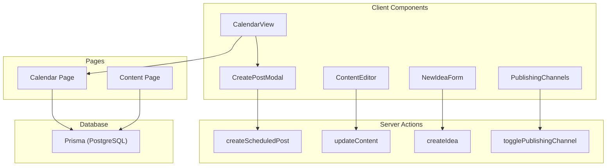
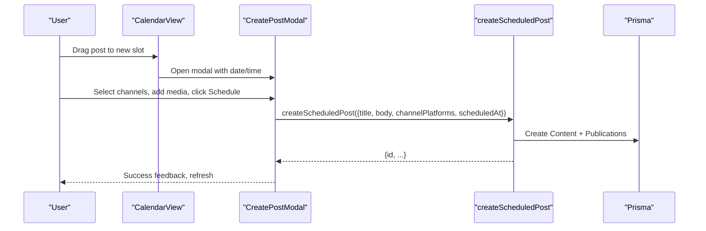
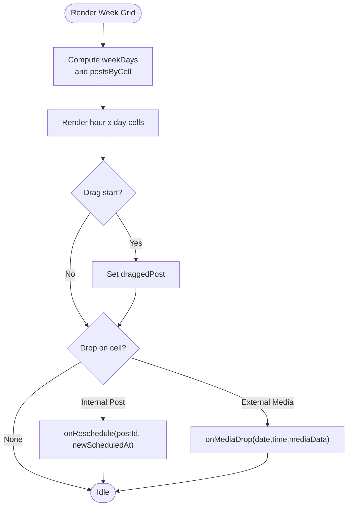
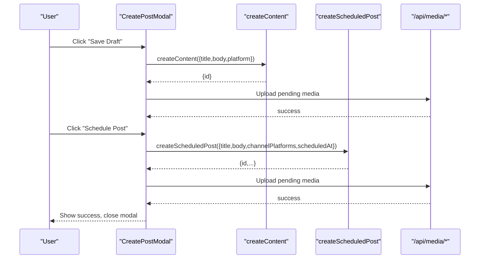
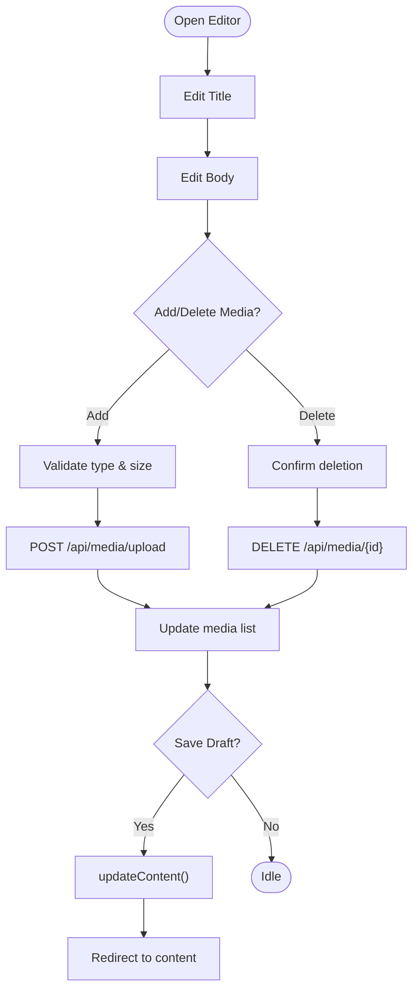
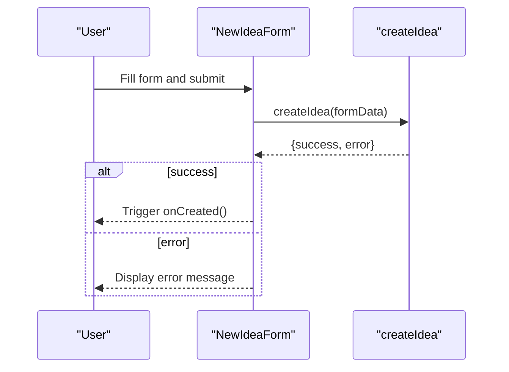
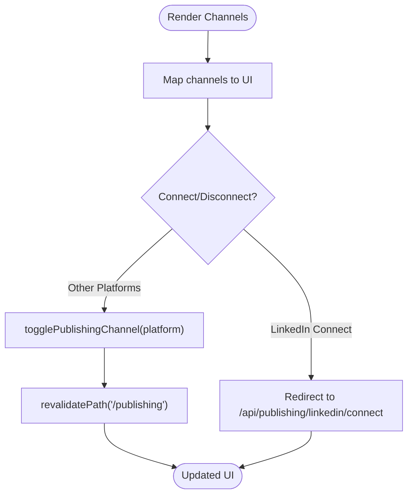
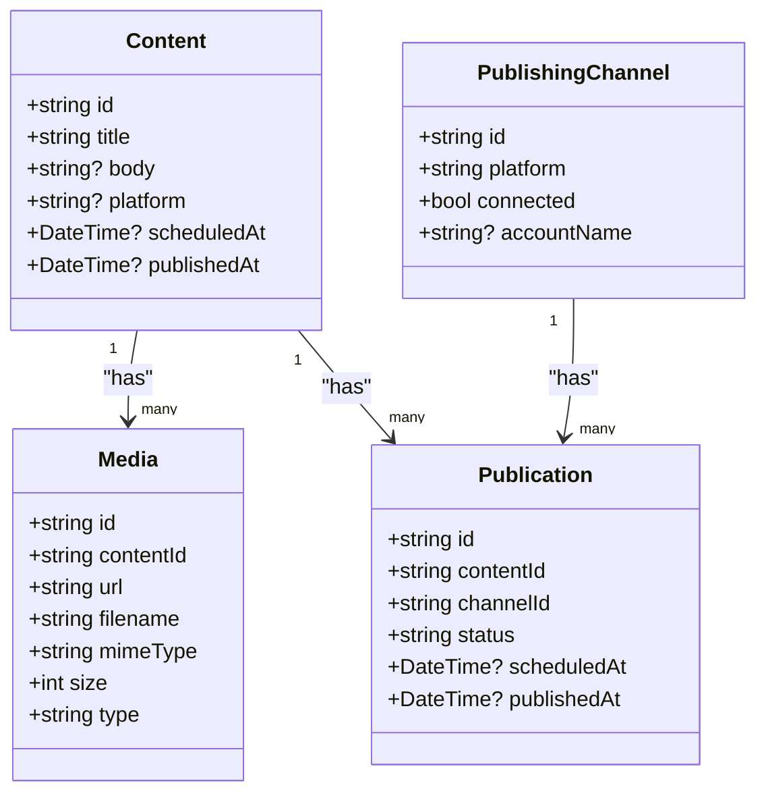

# Feature Components

<cite>
**Referenced Files in This Document**
- [calendar-view.tsx](file://components/calendar/calendar-view.tsx)
- [create-post-modal.tsx](file://components/calendar/create-post-modal.tsx)
- [content-editor.tsx](file://components/content/content-editor.tsx)
- [new-idea-form.tsx](file://components/ideas/new-idea-form.tsx)
- [publishing-channels.tsx](file://components/publishing/publishing-channels.tsx)
- [create-scheduled-post.ts](file://app/calendar/actions/create-scheduled-post.ts)
- [update-content.ts](file://app/content/actions/update-content.ts)
- [create-idea.ts](file://app/ideas/actions/create-idea.ts)
- [toggle-channel.ts](file://app/publishing/actions/toggle-channel.ts)
- [calendar/page.tsx](file://app/calendar/page.tsx)
- [content/page.tsx](file://app/content/page.tsx)
- [schema.prisma](file://prisma/schema.prisma)
</cite>

## Table of Contents
1. [Introduction](#introduction)
2. [Project Structure](#project-structure)
3. [Core Components](#core-components)
4. [Architecture Overview](#architecture-overview)
5. [Detailed Component Analysis](#detailed-component-analysis)
6. [Dependency Analysis](#dependency-analysis)
7. [Performance Considerations](#performance-considerations)
8. [Troubleshooting Guide](#troubleshooting-guide)
9. [Conclusion](#conclusion)
10. [Appendices](#appendices)

## Introduction
This document provides detailed, feature-focused documentation for four key React components:
- CalendarView: drag-and-drop scheduling interface with state management and server action integration.
- ContentEditor: rich text editing capabilities, media insertion, and AI-assisted improvements.
- NewIdeaForm: validation patterns, error handling, and data submission workflows via server actions.
- PublishingChannels: platform connection management and status tracking.

It also covers component composition patterns, prop interfaces, event handling, state management approaches, testing strategies, and performance optimizations for complex interactive components.

## Project Structure
The feature components are organized under a Next.js app directory with client components in components/, server actions in app/*/actions/, and pages that fetch data from the database using Prisma. The schema defines models for Idea, Content, Media, PublishingChannel, and Publication.

**Diagram sources**
- [calendar-view.tsx:52-184](file://components/calendar/calendar-view.tsx#L52-L184)
- [create-post-modal.tsx:79-242](file://components/calendar/create-post-modal.tsx#L79-L242)
- [content-editor.tsx:75-157](file://components/content/content-editor.tsx#L75-L157)
- [new-idea-form.tsx:10-32](file://components/ideas/new-idea-form.tsx#L10-L32)
- [publishing-channels.tsx:33-42](file://components/publishing/publishing-channels.tsx#L33-L42)
- [create-scheduled-post.ts:15-66](file://app/calendar/actions/create-scheduled-post.ts#L15-L66)
- [update-content.ts:13-46](file://app/content/actions/update-content.ts#L13-L46)
- [create-idea.ts:6-39](file://app/ideas/actions/create-idea.ts#L6-L39)
- [toggle-channel.ts:6-39](file://app/publishing/actions/toggle-channel.ts#L6-L39)
- [calendar/page.tsx:6-78](file://app/calendar/page.tsx#L6-L78)
- [content/page.tsx:6-99](file://app/content/page.tsx#L6-L99)

**Section sources**
- [calendar-view.tsx:52-184](file://components/calendar/calendar-view.tsx#L52-L184)
- [create-post-modal.tsx:79-242](file://components/calendar/create-post-modal.tsx#L79-L242)
- [content-editor.tsx:75-157](file://components/content/content-editor.tsx#L75-L157)
- [new-idea-form.tsx:10-32](file://components/ideas/new-idea-form.tsx#L10-L32)
- [publishing-channels.tsx:33-42](file://components/publishing/publishing-channels.tsx#L33-L42)
- [create-scheduled-post.ts:15-66](file://app/calendar/actions/create-scheduled-post.ts#L15-L66)
- [update-content.ts:13-46](file://app/content/actions/update-content.ts#L13-L46)
- [create-idea.ts:6-39](file://app/ideas/actions/create-idea.ts#L6-L39)
- [toggle-channel.ts:6-39](file://app/publishing/actions/toggle-channel.ts#L6-L39)
- [calendar/page.tsx:6-78](file://app/calendar/page.tsx#L6-L78)
- [content/page.tsx:6-99](file://app/content/page.tsx#L6-L99)
- [schema.prisma:10-94](file://prisma/schema.prisma#L10-L94)

## Core Components
- CalendarView: A weekly calendar grid supporting drag-and-drop rescheduling of posts and external media drops. It computes posts by cell, renders time slots, highlights today, and shows a current-time indicator.
- CreatePostModal: Orchestrates creating or scheduling posts, managing selected channels, media, and AI assistance. Integrates with server actions to persist content and schedule publications.
- ContentEditor: Provides title/body editing, platform selection, media upload/delete, and AI-assisted improvements. Uses transitions for save operations and direct API calls for AI and media.
- NewIdeaForm: A simple form that submits via a server action, handles pending states and errors, and triggers parent callbacks on success.
- PublishingChannels: Displays connected platforms, toggles connections via server actions, and supports special flows like LinkedIn OAuth connect.

**Section sources**
- [calendar-view.tsx:52-184](file://components/calendar/calendar-view.tsx#L52-L184)
- [create-post-modal.tsx:79-242](file://components/calendar/create-post-modal.tsx#L79-L242)
- [content-editor.tsx:75-157](file://components/content/content-editor.tsx#L75-L157)
- [new-idea-form.tsx:10-32](file://components/ideas/new-idea-form.tsx#L10-L32)
- [publishing-channels.tsx:33-42](file://components/publishing/publishing-channels.tsx#L33-L42)

## Architecture Overview
The system follows a client-server boundary:
- Client components manage UI state and user interactions.
- Server actions handle persistence and orchestration (e.g., creating content, scheduling publications).
- Pages fetch data from the database and pass it down as props.

**Diagram sources**
- [calendar-view.tsx:133-178](file://components/calendar/calendar-view.tsx#L133-L178)
- [create-post-modal.tsx:201-242](file://components/calendar/create-post-modal.tsx#L201-L242)
- [create-scheduled-post.ts:15-66](file://app/calendar/actions/create-scheduled-post.ts#L15-L66)

## Detailed Component Analysis

### CalendarView
Responsibilities:
- Render a weekly grid with hour rows and day columns.
- Group posts into cells based on scheduledAt and weekStart.
- Support internal drag-and-drop to reschedule posts.
- Accept external media drops and forward them via callback.
- Show a current-time indicator and highlight today’s column.

Key state and logic:
- Local state tracks dragged post and drag-over cell.
- useMemo computes weekDays, postsByCell, and timeIndicator efficiently.
- Event handlers implement drag start/over/leave/drop and cell clicks.

Integration points:
- Props include onReschedule, onMediaDrop, onCellClick, onPostClick.
- Parent page supplies posts and connected platforms; server actions perform persistence.

**Diagram sources**
- [calendar-view.tsx:79-112](file://components/calendar/calendar-view.tsx#L79-L112)
- [calendar-view.tsx:133-178](file://components/calendar/calendar-view.tsx#L133-L178)

Prop interface summary:
- posts: array of scheduled posts with id, contentId, title, platform, scheduledAt, optional media.
- weekStart: Date for the first day of the week.
- onCellClick: callback when a cell is clicked.
- onPostClick: callback to open post details.
- onReschedule: callback to move a post to a new time.
- onMediaDrop: callback to handle external media dropped onto a cell.

Event handling:
- Drag-and-drop uses native HTML5 events; Firefox compatibility handled via setData.
- Cell click constructs date/time strings and invokes onCellClick.

State management:
- useState for transient UI state (draggedPost, dragOverCell).
- useEffect for current time updates and initial scroll positioning.
- useMemo for expensive computations (weekDays, postsByCell, timeIndicator).

**Section sources**
- [calendar-view.tsx:52-184](file://components/calendar/calendar-view.tsx#L52-L184)
- [calendar-view.tsx:186-308](file://components/calendar/calendar-view.tsx#L186-L308)

### CreatePostModal
Responsibilities:
- Manage multi-platform selection, content body, media attachments, and scheduling controls.
- Provide draft saving and scheduling flows.
- Integrate AI assistant panel and media picker overlays.

Key flows:
- Draft save: creates content via server action and uploads any pending media.
- Schedule: validates inputs, creates scheduled content and publications via server action, then uploads media and notifies success.

Integration points:
- Calls createContent and createScheduledPost server actions.
- Uploads media via /api/media/upload and associates existing media via /api/media.

**Diagram sources**
- [create-post-modal.tsx:171-242](file://components/calendar/create-post-modal.tsx#L171-L242)
- [create-scheduled-post.ts:15-66](file://app/calendar/actions/create-scheduled-post.ts#L15-L66)

Validation and error handling:
- Validates required fields (body, channels, date/time).
- Sets error messages and disables buttons during operations.
- Handles network errors and displays user-friendly messages.

Composition patterns:
- Composes MediaPickerModal and AIAssistantPanel as overlays.
- Uses local state to control visibility and data flow between panels.

**Section sources**
- [create-post-modal.tsx:79-242](file://components/calendar/create-post-modal.tsx#L79-L242)
- [create-post-modal.tsx:271-559](file://components/calendar/create-post-modal.tsx#L271-L559)

### ContentEditor
Responsibilities:
- Edit title, body, and platform selection.
- Upload and delete media with validation and size/type checks.
- Provide AI-assisted improvements via an API endpoint.
- Save changes using a server action with optimistic transitions.

Key features:
- File input and drag-and-drop for media.
- Allowed media types and max file size enforcement.
- Real-time character count and disabled states during operations.

AI integration:
- Sends prompt including instruction, platform, and current body to /api/ai/generate.
- Updates body with improved result or shows error.

**Diagram sources**
- [content-editor.tsx:99-157](file://components/content/content-editor.tsx#L99-L157)
- [content-editor.tsx:165-230](file://components/content/content-editor.tsx#L165-L230)
- [content-editor.tsx:273-314](file://components/content/content-editor.tsx#L273-L314)

Prop interface summary:
- id: content identifier.
- initialTitle, initialBody, initialPlatform: starting values.
- initialMedia: optional array of media items.
- disabled: read-only mode flag.

Error handling:
- Validates title in server action; prevents editing published content.
- Displays upload and AI errors inline.

**Section sources**
- [content-editor.tsx:75-157](file://components/content/content-editor.tsx#L75-L157)
- [content-editor.tsx:165-230](file://components/content/content-editor.tsx#L165-L230)
- [content-editor.tsx:273-314](file://components/content/content-editor.tsx#L273-L314)
- [update-content.ts:13-46](file://app/content/actions/update-content.ts#L13-L46)

### NewIdeaForm
Responsibilities:
- Collect idea title, description, and category.
- Submit via server action and handle success/failure.
- Provide pending state and error display.

Validation and workflow:
- Uses HTML required attribute for title.
- Server action trims inputs and returns structured result with success/error.
- On success, triggers onCreated callback to refresh or navigate.

**Diagram sources**
- [new-idea-form.tsx:14-32](file://components/ideas/new-idea-form.tsx#L14-L32)
- [create-idea.ts:6-39](file://app/ideas/actions/create-idea.ts#L6-L39)

**Section sources**
- [new-idea-form.tsx:10-32](file://components/ideas/new-idea-form.tsx#L10-L32)
- [create-idea.ts:6-39](file://app/ideas/actions/create-idea.ts#L6-L39)

### PublishingChannels
Responsibilities:
- Display available publishing channels and their connection status.
- Toggle connections via server action; special handling for LinkedIn connect flow.
- Show counts and status indicators.

State and interaction:
- Uses useTransition to mark pending state during toggle.
- ConnectedPlatforms prop drives UI state and button labels.

**Diagram sources**
- [publishing-channels.tsx:33-42](file://components/publishing/publishing-channels.tsx#L33-L42)
- [toggle-channel.ts:6-39](file://app/publishing/actions/toggle-channel.ts#L6-L39)

**Section sources**
- [publishing-channels.tsx:33-42](file://components/publishing/publishing-channels.tsx#L33-L42)
- [toggle-channel.ts:6-39](file://app/publishing/actions/toggle-channel.ts#L6-L39)

## Dependency Analysis
Component-to-action relationships:
- CalendarView depends on parent-provided callbacks; CreatePostModal depends on createScheduledPost and createContent.
- ContentEditor depends on updateContent and media/AI APIs.
- NewIdeaForm depends on createIdea.
- PublishingChannels depends on togglePublishingChannel.

Data model relationships:
- Content has many Media and many Publications.
- PublishingChannel has many Publications.
- Publication links Content and PublishingChannel.

**Diagram sources**
- [schema.prisma:21-94](file://prisma/schema.prisma#L21-L94)

**Section sources**
- [schema.prisma:21-94](file://prisma/schema.prisma#L21-L94)

## Performance Considerations
- CalendarView:
  - Use useMemo for weekDays, postsByCell, and timeIndicator to avoid recomputation on each render.
  - Limit re-renders by keeping drag state minimal and using stable keys.
  - Avoid heavy DOM operations inside loops; leverage CSS grid and sticky headers.
- CreatePostModal:
  - Batch media uploads and associate existing media after content creation to reduce round trips.
  - Debounce or throttle AI requests if needed; currently sequential per action.
- ContentEditor:
  - Enforce allowed types and sizes before uploading to prevent unnecessary network calls.
  - Use transitions for save operations to keep UI responsive.
- NewIdeaForm:
  - Keep form state minimal; rely on server-side validation and redirection.
- PublishingChannels:
  - Use transitions to indicate pending state without blocking UI.

[No sources needed since this section provides general guidance]

## Troubleshooting Guide
Common issues and resolutions:
- CalendarView:
  - Drag-and-drop not working in Firefox: ensure setData is called with a MIME type or plain text; the implementation sets text/plain which should work across browsers.
  - Posts not appearing in correct cells: verify scheduledAt parsing and week boundaries; postsByCell filters within the current week.
- CreatePostModal:
  - Scheduling fails due to no connected channels: ensure at least one selected channel is connected; server action throws if none found.
  - Media upload errors: check file type and size constraints; review API responses for error messages.
- ContentEditor:
  - Cannot edit published content: server action blocks updates for PUBLISHED status; change status or create new content.
  - AI generation empty result: validate response and show error; ensure body is non-empty before invoking AI.
- NewIdeaForm:
  - Submission fails silently: inspect server action return value and display error; ensure title is provided.
- PublishingChannels:
  - LinkedIn connect not triggering: confirm href route exists; otherwise use toggle action for other platforms.

**Section sources**
- [calendar-view.tsx:133-178](file://components/calendar/calendar-view.tsx#L133-L178)
- [create-post-modal.tsx:201-242](file://components/calendar/create-post-modal.tsx#L201-L242)
- [content-editor.tsx:99-157](file://components/content/content-editor.tsx#L99-L157)
- [update-content.ts:13-46](file://app/content/actions/update-content.ts#L13-L46)
- [new-idea-form.tsx:14-32](file://components/ideas/new-idea-form.tsx#L14-L32)
- [publishing-channels.tsx:33-42](file://components/publishing/publishing-channels.tsx#L33-L42)

## Conclusion
The feature components provide a cohesive content scheduling and editing experience:
- CalendarView enables intuitive drag-and-drop scheduling with robust state management.
- CreatePostModal orchestrates multi-platform posting and media handling.
- ContentEditor offers rich editing, media management, and AI assistance.
- NewIdeaForm streamlines idea capture with server-driven validation.
- PublishingChannels manages platform connections and status.

Together, they integrate with server actions and database models to deliver a scalable, maintainable architecture suitable for complex interactive workflows.

[No sources needed since this section summarizes without analyzing specific files]

## Appendices

### Prop Interfaces Summary
- CalendarViewProps:
  - posts: ScheduledPost[]
  - weekStart: Date
  - onCellClick(date: string, time: string): void
  - onPostClick(post: ScheduledPost): void
  - onReschedule(postId: string, newScheduledAt: string): void
  - onMediaDrop(date: string, time: string, mediaData: any): void
- ContentEditorProps:
  - id: string
  - initialTitle: string
  - initialBody: string
  - initialPlatform: string
  - initialMedia?: MediaItem[]
  - disabled?: boolean
- NewIdeaFormProps:
  - onCreated(): void
- PublishingChannelsProps:
  - connectedPlatforms: string[]

**Section sources**
- [calendar-view.tsx:5-23](file://components/calendar/calendar-view.tsx#L5-L23)
- [content-editor.tsx:6-22](file://components/content/content-editor.tsx#L6-L22)
- [new-idea-form.tsx:6-8](file://components/ideas/new-idea-form.tsx#L6-L8)
- [publishing-channels.tsx:29-31](file://components/publishing/publishing-channels.tsx#L29-L31)

### Testing Strategies
- Unit tests:
  - CalendarView: test drag-and-drop handlers, postsByCell computation, and time indicator logic.
  - ContentEditor: test media validation, upload flow mocks, and AI request/response handling.
  - NewIdeaForm: test form submission and error display paths.
  - PublishingChannels: test toggle behavior and UI state updates.
- Integration tests:
  - Simulate full scheduling flow: create post, select channels, schedule, and verify server action outcomes.
  - Mock API endpoints for media upload and AI generation to validate client behavior.
- E2E tests:
  - Use browser automation to interact with calendar grid, drag posts, and verify scheduling results.
  - Test content editor media upload and deletion flows end-to-end.

[No sources needed since this section provides general guidance]