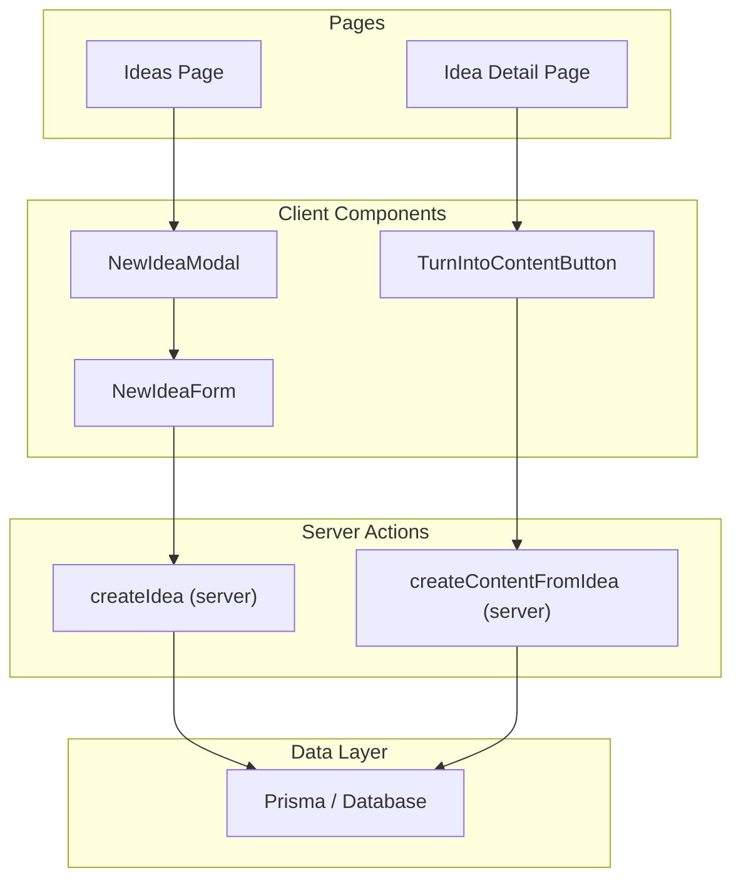
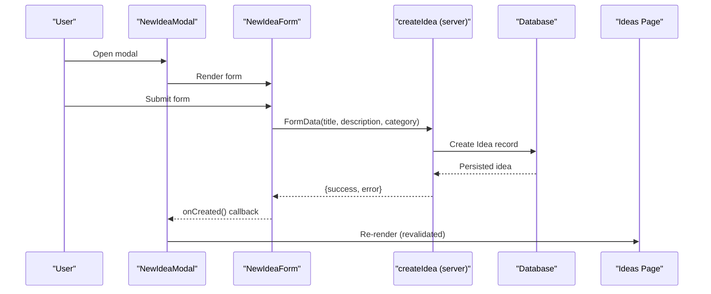
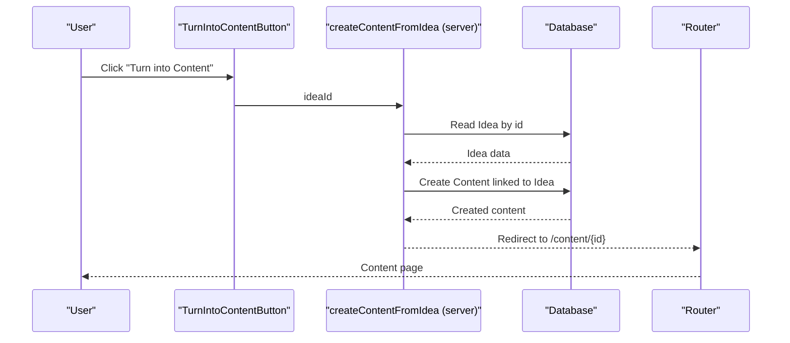
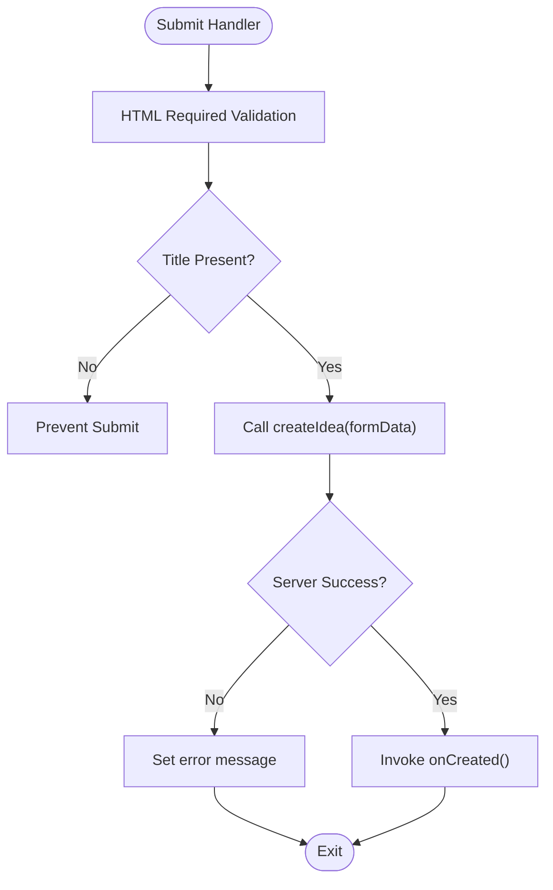
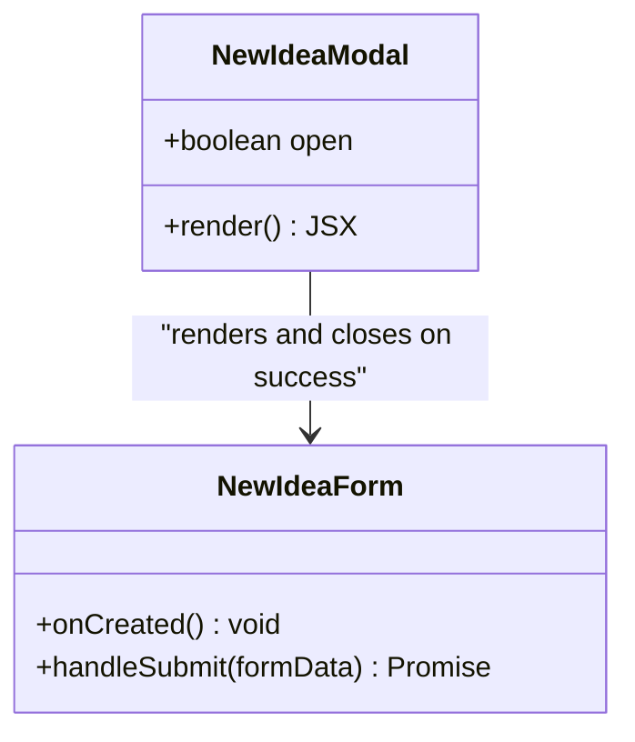
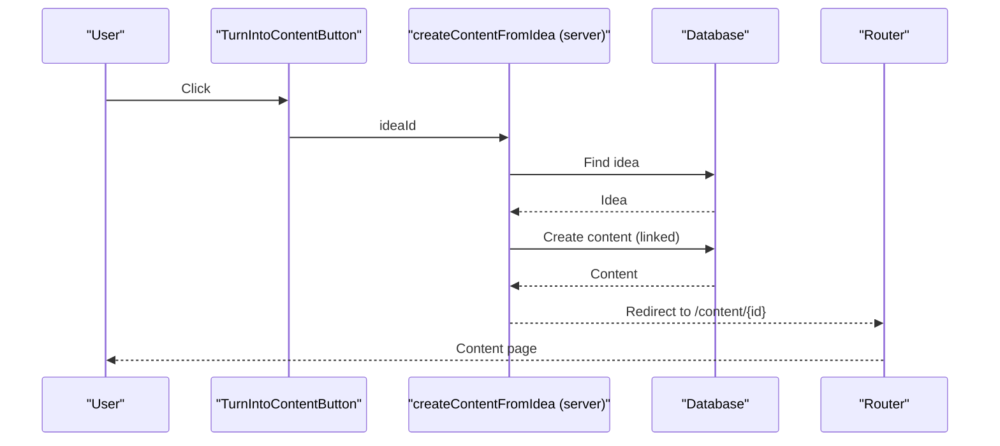
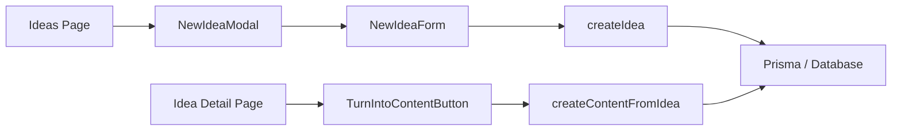

# Idea Components

<cite>
**Referenced Files in This Document**
- [new-idea-form.tsx](file://components/ideas/new-idea-form.tsx)
- [new-idea-modal.tsx](file://components/ideas/new-idea-modal.tsx)
- [turn-into-content-button.tsx](file://components/ideas/turn-into-content-button.tsx)
- [create-idea.ts](file://app/ideas/actions/create-idea.ts)
- [create-content-from-idea.ts](file://app/content/actions/create-content-from-idea.ts)
- [ideas/page.tsx](file://app/ideas/page.tsx)
- [ideas/[id]/page.tsx](file://app/ideas/[id]/page.tsx)
- [schema.prisma](file://prisma/schema.prisma)
</cite>

## Table of Contents
1. [Introduction](#introduction)
2. [Project Structure](#project-structure)
3. [Core Components](#core-components)
4. [Architecture Overview](#architecture-overview)
5. [Detailed Component Analysis](#detailed-component-analysis)
6. [Dependency Analysis](#dependency-analysis)
7. [Performance Considerations](#performance-considerations)
8. [Troubleshooting Guide](#troubleshooting-guide)
9. [Conclusion](#conclusion)
10. [Appendices](#appendices)

## Introduction
This document provides comprehensive documentation for the idea management React components that power capturing ideas and converting them into content. It focuses on:
- NewIdeaForm: form validation, data submission, and integration with server actions for idea creation.
- NewIdeaModal: modal behavior, encapsulation of the form, and state management patterns.
- TurnIntoContentButton: conversion logic, triggers, and user feedback during idea-to-content workflows.
It also covers best practices for form handling, error management, accessibility, component composition, prop interfaces, server action integration, and testing strategies for validation and conversion flows.

## Project Structure
The idea management feature spans client components and server actions:
- Client components handle UI, user interactions, and local state.
- Server actions perform validation, persistence, and navigation or revalidation.
- Pages compose these components to present the idea list and detail views.

**Diagram sources**
- [new-idea-modal.tsx:1-50](file://components/ideas/new-idea-modal.tsx#L1-L50)
- [new-idea-form.tsx:1-102](file://components/ideas/new-idea-form.tsx#L1-L102)
- [turn-into-content-button.tsx:1-32](file://components/ideas/turn-into-content-button.tsx#L1-L32)
- [create-idea.ts:1-40](file://app/ideas/actions/create-idea.ts#L1-L40)
- [create-content-from-idea.ts:1-28](file://app/content/actions/create-content-from-idea.ts#L1-L28)
- [ideas/page.tsx:1-90](file://app/ideas/page.tsx#L1-L90)
- [ideas/[id]/page.tsx:1-90](file://app/ideas/[id]/page.tsx#L1-L90)

**Section sources**
- [ideas/page.tsx:1-90](file://app/ideas/page.tsx#L1-L90)
- [ideas/[id]/page.tsx:1-90](file://app/ideas/[id]/page.tsx#L1-L90)

## Core Components
- NewIdeaForm: A client-side form that collects title, description, and category, validates via browser constraints and server-side checks, submits using a server action, and reports errors and pending states.
- NewIdeaModal: A lightweight modal wrapper that toggles visibility and encapsulates the NewIdeaForm, closing on successful creation.
- TurnIntoContentButton: A button that triggers conversion from an idea to content using a server action, providing pending feedback via transitions.

Key responsibilities:
- Form input handling and validation (client and server).
- Submission to server actions for persistence and workflow progression.
- User feedback through disabled states, loading text, and error messages.
- Accessibility basics like labels and aria attributes.

**Section sources**
- [new-idea-form.tsx:1-102](file://components/ideas/new-idea-form.tsx#L1-L102)
- [new-idea-modal.tsx:1-50](file://components/ideas/new-idea-modal.tsx#L1-L50)
- [turn-into-content-button.tsx:1-32](file://components/ideas/turn-into-content-button.tsx#L1-L32)

## Architecture Overview
The idea-to-content flow integrates client components with server actions and database operations:

**Diagram sources**
- [new-idea-modal.tsx:1-50](file://components/ideas/new-idea-modal.tsx#L1-L50)
- [new-idea-form.tsx:1-102](file://components/ideas/new-idea-form.tsx#L1-L102)
- [create-idea.ts:1-40](file://app/ideas/actions/create-idea.ts#L1-L40)
- [ideas/page.tsx:1-90](file://app/ideas/page.tsx#L1-L90)

**Diagram sources**
- [turn-into-content-button.tsx:1-32](file://components/ideas/turn-into-content-button.tsx#L1-L32)
- [create-content-from-idea.ts:1-28](file://app/content/actions/create-content-from-idea.ts#L1-L28)

## Detailed Component Analysis

### NewIdeaForm
- Purpose: Capture new ideas with title, description, and optional category; submit to server; manage pending/error states.
- Validation:
  - Client-side: HTML required attribute on title ensures empty submissions are blocked before network call.
  - Server-side: createIdea trims inputs and enforces title presence; returns structured result with success flag and error message.
- Data submission: Uses a form action bound to a handler that calls the server action with FormData.
- State management:
  - isPending: disables submit button and updates button text during submission.
  - error: displays user-friendly error messages when server returns failure or exception occurs.
- Integration: Calls createIdea and invokes onCreated callback to close modal and refresh the ideas list.

**Diagram sources**
- [new-idea-form.tsx:14-32](file://components/ideas/new-idea-form.tsx#L14-L32)
- [create-idea.ts:6-39](file://app/ideas/actions/create-idea.ts#L6-L39)

Accessibility considerations:
- Each input has a corresponding label with htmlFor/id pairing for screen readers.
- Error messages are rendered as visible paragraphs near the form.
- Button is disabled during submission to prevent duplicate submissions.

Best practices observed:
- Minimal client-side validation paired with robust server-side validation.
- Clear pending and error states improve UX.
- Using server actions keeps data mutations secure and simple.

**Section sources**
- [new-idea-form.tsx:1-102](file://components/ideas/new-idea-form.tsx#L1-L102)
- [create-idea.ts:1-40](file://app/ideas/actions/create-idea.ts#L1-L40)

### NewIdeaModal
- Purpose: Provide a modal interface to capture ideas without leaving the current page.
- Modal behavior:
  - Toggles open state to show/hide overlay and form container.
  - Renders a close button with aria-label for accessibility.
- Form encapsulation:
  - Embeds NewIdeaForm and passes onCreated to close the modal upon successful creation.
- State management:
  - Local boolean open state controls visibility.
  - No complex async state; relies on child form for submission feedback.

**Diagram sources**
- [new-idea-modal.tsx:1-50](file://components/ideas/new-idea-modal.tsx#L1-L50)
- [new-idea-form.tsx:1-102](file://components/ideas/new-idea-form.tsx#L1-L102)

Accessibility considerations:
- Close button includes aria-label for clarity.
- Modal uses a focusable trigger and dismissible overlay pattern.

**Section sources**
- [new-idea-modal.tsx:1-50](file://components/ideas/new-idea-modal.tsx#L1-L50)

### TurnIntoContentButton
- Purpose: Convert an existing idea into a content item and navigate to the new content page.
- Conversion logic:
  - On click, initiates a transition and calls createContentFromIdea with the ideaId.
  - Server action reads the idea, creates a content record linked to the idea, and redirects to the content page.
- User feedback:
  - useTransition provides isPending to disable the button and update text during processing.
  - Server-side redirect handles navigation after successful creation.

**Diagram sources**
- [turn-into-content-button.tsx:1-32](file://components/ideas/turn-into-content-button.tsx#L1-L32)
- [create-content-from-idea.ts:1-28](file://app/content/actions/create-content-from-idea.ts#L1-L28)

Integration points:
- Consumed by Idea Detail Page to offer next-step conversion.
- Relies on Prisma models for Idea and Content relationships.

**Section sources**
- [turn-into-content-button.tsx:1-32](file://components/ideas/turn-into-content-button.tsx#L1-L32)
- [create-content-from-idea.ts:1-28](file://app/content/actions/create-content-from-idea.ts#L1-L28)
- [ideas/[id]/page.tsx:1-90](file://app/ideas/[id]/page.tsx#L1-L90)

## Dependency Analysis
- Component composition:
  - Ideas Page composes NewIdeaModal to provide quick idea capture.
  - NewIdeaModal composes NewIdeaForm for form logic.
  - Idea Detail Page composes TurnIntoContentButton to drive conversion.
- Server action dependencies:
  - createIdea depends on Prisma client and Next.js cache revalidation.
  - createContentFromIdea depends on Prisma client and Next.js navigation redirect.
- Data model relationships:
  - Idea and Content are related via ideaId; creating content links back to the originating idea.

**Diagram sources**
- [new-idea-form.tsx:1-102](file://components/ideas/new-idea-form.tsx#L1-L102)
- [new-idea-modal.tsx:1-50](file://components/ideas/new-idea-modal.tsx#L1-L50)
- [turn-into-content-button.tsx:1-32](file://components/ideas/turn-into-content-button.tsx#L1-L32)
- [create-idea.ts:1-40](file://app/ideas/actions/create-idea.ts#L1-L40)
- [create-content-from-idea.ts:1-28](file://app/content/actions/create-content-from-idea.ts#L1-L28)
- [ideas/page.tsx:1-90](file://app/ideas/page.tsx#L1-L90)
- [ideas/[id]/page.tsx:1-90](file://app/ideas/[id]/page.tsx#L1-L90)

**Section sources**
- [schema.prisma:10-37](file://prisma/schema.prisma#L10-L37)

## Performance Considerations
- Client-side validation reduces unnecessary server calls by enforcing required fields early.
- Server-side validation ensures data integrity even if client validation is bypassed.
- Pending states prevent duplicate submissions and improve perceived performance.
- Server action revalidation updates the ideas list efficiently without full-page reloads.
- Transitions in TurnIntoContentButton keep UI responsive during asynchronous work.

[No sources needed since this section provides general guidance]

## Troubleshooting Guide
Common issues and resolutions:
- Empty title submission:
  - Symptom: Server returns failure with a specific error message.
  - Resolution: Ensure title field is filled; client-side required attribute helps prevent empty submissions.
- Network or database errors:
  - Symptom: Generic error displayed in the form.
  - Resolution: Check server logs; ensure database connectivity and Prisma configuration.
- Modal not closing after creation:
  - Symptom: Modal remains open after successful creation.
  - Resolution: Verify onCreated callback is invoked and modal open state is updated.
- Conversion does not redirect:
  - Symptom: Clicking "Turn into Content" does not navigate.
  - Resolution: Confirm server action completes successfully and redirect is executed; check for missing ideaId.

**Section sources**
- [new-idea-form.tsx:14-32](file://components/ideas/new-idea-form.tsx#L14-L32)
- [create-idea.ts:6-39](file://app/ideas/actions/create-idea.ts#L6-L39)
- [create-content-from-idea.ts:6-27](file://app/content/actions/create-content-from-idea.ts#L6-L27)

## Conclusion
The idea management components implement a clean separation between UI and server logic:
- NewIdeaForm provides accessible, validated forms with clear feedback.
- NewIdeaModal encapsulates user experience for quick idea capture.
- TurnIntoContentButton drives the idea-to-content workflow with minimal friction.
Together, they integrate seamlessly with server actions and Prisma to persist data and guide users through the content pipeline.

[No sources needed since this section summarizes without analyzing specific files]

## Appendices

### Prop Interfaces
- NewIdeaFormProps:
  - onCreated: Function called on successful idea creation to close modal and refresh list.
- TurnIntoContentButtonProps:
  - ideaId: Identifier of the idea to convert into content.

**Section sources**
- [new-idea-form.tsx:6-8](file://components/ideas/new-idea-form.tsx#L6-L8)
- [turn-into-content-button.tsx:6-8](file://components/ideas/turn-into-content-button.tsx#L6-L8)

### Testing Strategies
- Form validation:
  - Test client-side required validation by attempting to submit empty title and verifying prevention.
  - Mock server action responses to test error handling paths and pending states.
  - Assert that error messages render correctly for server failures.
- Conversion process:
  - Simulate clicking "Turn into Content" and verify pending state toggling.
  - Mock server action to return success and assert navigation to the content page.
  - Test scenarios where idea is not found to ensure appropriate error handling or redirection behavior.
- Accessibility:
  - Verify labels are associated with inputs via htmlFor/id.
  - Ensure close button has descriptive aria-label.
  - Confirm keyboard navigation works within the modal and form.

[No sources needed since this section provides general guidance]