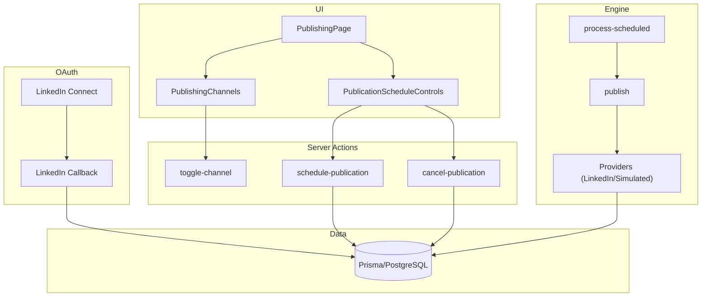
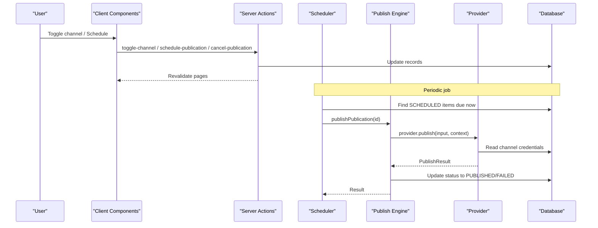
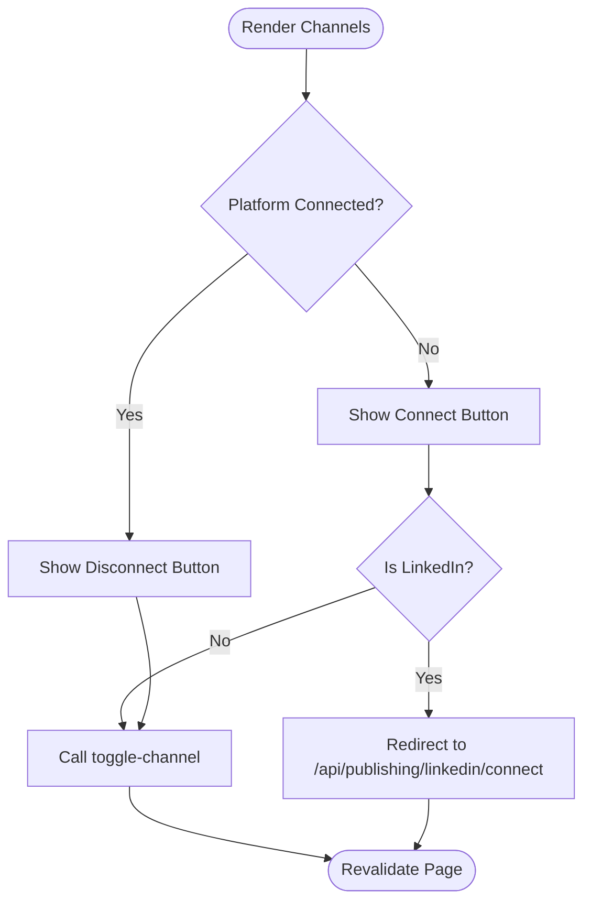
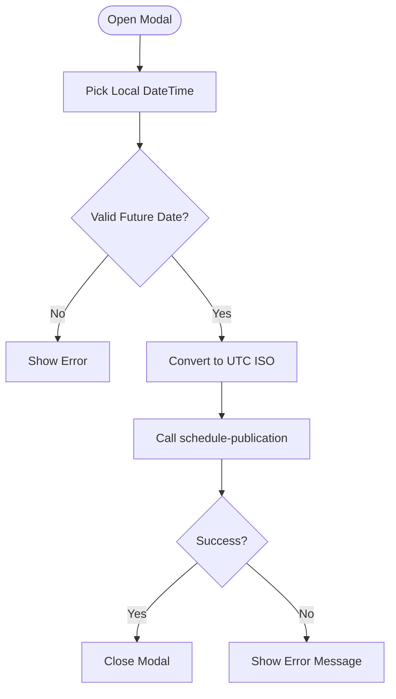
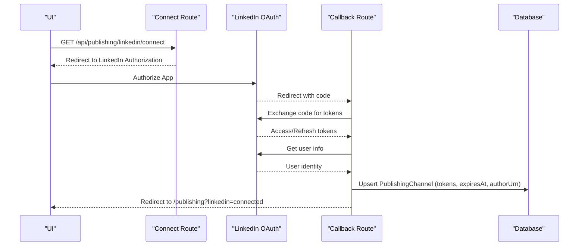
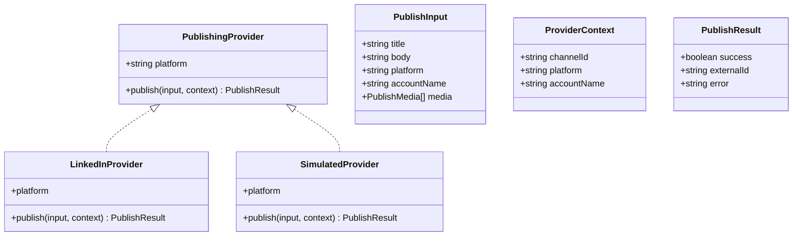
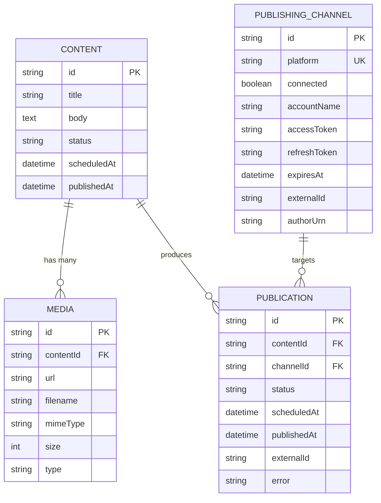
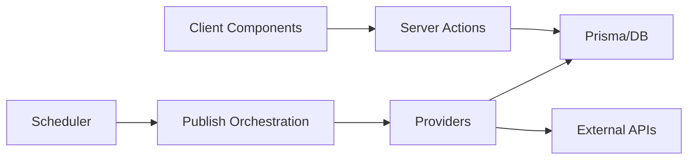

# Publishing Components

<cite>
**Referenced Files in This Document**
- [publishing-channels.tsx](file://components/publishing/publishing-channels.tsx)
- [publication-schedule-controls.tsx](file://components/publishing/publication-schedule-controls.tsx)
- [page.tsx](file://app/publishing/page.tsx)
- [connect/route.ts](file://app/api/publishing/linkedin/connect/route.ts)
- [callback/route.ts](file://app/api/publishing/linkedin/callback/route.ts)
- [toggle-channel.ts](file://app/publishing/actions/toggle-channel.ts)
- [schedule-publication.ts](file://app/publishing/actions/schedule-publication.ts)
- [cancel-publication.ts](file://app/publishing/actions/cancel-publication.ts)
- [types.ts](file://app/publishing/engine/types.ts)
- [providers/index.ts](file://app/publishing/engine/providers/index.ts)
- [providers/linkedin.ts](file://app/publishing/engine/providers/linkedin.ts)
- [providers/simulated.ts](file://app/publishing/engine/providers/simulated.ts)
- [process-scheduled.ts](file://app/publishing/engine/process-scheduled.ts)
- [publish.ts](file://app/publishing/engine/publish.ts)
- [schema.prisma](file://prisma/schema.prisma)
</cite>

## Table of Contents
1. Introduction
2. Project Structure
3. Core Components
4. Architecture Overview
5. Detailed Component Analysis
6. Dependency Analysis
7. Performance Considerations
8. Troubleshooting Guide
9. Conclusion
10. Appendices

## Introduction
This document explains the publishing-related React components and their integration with the publishing engine, OAuth flows, scheduling, error handling, and security considerations. It focuses on:
- PublishingChannels for platform connection management and status tracking
- PublicationScheduleControls for scheduling, time zone handling, and batch operations
- The server-side actions and engine that process scheduled publications and publish to platforms like LinkedIn
- Testing strategies for OAuth and asynchronous publishing
- Security guidance for credentials and API keys

## Project Structure
The publishing feature spans UI components, server actions, API routes for OAuth, and an engine that orchestrates publishing across providers.

**Diagram sources**
- [publishing-channels.tsx:33-146](file://components/publishing/publishing-channels.tsx#L33-L146)
- [publication-schedule-controls.tsx:13-180](file://components/publishing/publication-schedule-controls.tsx#L13-L180)
- [page.tsx:18-186](file://app/publishing/page.tsx#L18-L186)
- [toggle-channel.ts:6-39](file://app/publishing/actions/toggle-channel.ts#L6-L39)
- [schedule-publication.ts:6-51](file://app/publishing/actions/schedule-publication.ts#L6-L51)
- [cancel-publication.ts:6-52](file://app/publishing/actions/cancel-publication.ts#L6-L52)
- [connect/route.ts:3-33](file://app/api/publishing/linkedin/connect/route.ts#L3-L33)
- [callback/route.ts:4-168](file://app/api/publishing/linkedin/callback/route.ts#L4-L168)
- [process-scheduled.ts:4-71](file://app/publishing/engine/process-scheduled.ts#L4-L71)
- [publish.ts:4-115](file://app/publishing/engine/publish.ts#L4-L115)
- [providers/index.ts:5-20](file://app/publishing/engine/providers/index.ts#L5-L20)
- [providers/linkedin.ts:141-283](file://app/publishing/engine/providers/linkedin.ts#L141-L283)
- [providers/simulated.ts:8-32](file://app/publishing/engine/providers/simulated.ts#L8-L32)
- [schema.prisma:57-93](file://prisma/schema.prisma#L57-L93)

**Section sources**
- [publishing-channels.tsx:1-147](file://components/publishing/publishing-channels.tsx#L1-L147)
- [publication-schedule-controls.tsx:1-181](file://components/publishing/publication-schedule-controls.tsx#L1-L181)
- [page.tsx:1-186](file://app/publishing/page.tsx#L1-L186)
- [schema.prisma:1-94](file://prisma/schema.prisma#L1-L94)

## Core Components
- PublishingChannels: Displays available channels, shows connection status, and triggers connect/disconnect actions. For LinkedIn, it uses a dedicated OAuth connect link; other platforms use a server action toggle.
- PublicationScheduleControls: Provides scheduling UI, validates dates, converts local datetime to UTC, schedules or cancels publications, and surfaces errors inline.

Key responsibilities:
- Maintain optimistic UI transitions during async operations
- Validate user inputs before calling server actions
- Render state-specific controls (schedule vs reschedule vs cancel)
- Integrate with the publishing engine via server actions

**Section sources**
- [publishing-channels.tsx:29-146](file://components/publishing/publishing-channels.tsx#L29-L146)
- [publication-schedule-controls.tsx:7-180](file://components/publishing/publication-schedule-controls.tsx#L7-L180)

## Architecture Overview
The system separates UI concerns from server logic:
- Client components call server actions to update channel connections and publication schedules
- Server actions persist changes and revalidate relevant pages
- A background scheduler processes due publications and delegates to platform providers
- Providers implement platform-specific publishing (LinkedIn or simulated)

**Diagram sources**
- [toggle-channel.ts:6-39](file://app/publishing/actions/toggle-channel.ts#L6-L39)
- [schedule-publication.ts:6-51](file://app/publishing/actions/schedule-publication.ts#L6-L51)
- [cancel-publication.ts:6-52](file://app/publishing/actions/cancel-publication.ts#L6-L52)
- [process-scheduled.ts:4-71](file://app/publishing/engine/process-scheduled.ts#L4-L71)
- [publish.ts:4-115](file://app/publishing/engine/publish.ts#L4-L115)
- [providers/linkedin.ts:141-283](file://app/publishing/engine/providers/linkedin.ts#L141-L283)
- [providers/simulated.ts:8-32](file://app/publishing/engine/providers/simulated.ts#L8-L32)

## Detailed Component Analysis

### PublishingChannels
- Platform list and status: Renders each channel with a connected/not connected indicator and count summary
- Connection flow:
  - LinkedIn: Uses a direct link to the OAuth connect endpoint
  - Other platforms: Calls a server action to toggle connection state
- Optimistic UX: Uses React transitions to disable buttons and show pending states

**Diagram sources**
- [publishing-channels.tsx:63-141](file://components/publishing/publishing-channels.tsx#L63-L141)
- [toggle-channel.ts:6-39](file://app/publishing/actions/toggle-channel.ts#L6-L39)
- [connect/route.ts:3-33](file://app/api/publishing/linkedin/connect/route.ts#L3-L33)

**Section sources**
- [publishing-channels.tsx:1-147](file://components/publishing/publishing-channels.tsx#L1-L147)
- [toggle-channel.ts:1-40](file://app/publishing/actions/toggle-channel.ts#L1-L40)
- [connect/route.ts:1-34](file://app/api/publishing/linkedin/connect/route.ts#L1-L34)

### PublicationScheduleControls
- Scheduling interface: Opens a modal to pick date/time using a native datetime-local input
- Time zone handling: Converts the user’s local datetime to an absolute UTC ISO string before sending to the server
- Validation: Ensures a future date and valid format; displays inline errors
- Operations:
  - Schedule: Sets status to SCHEDULED and clears previous errors
  - Cancel: Moves to QUEUED and resets content scheduling fields
- UI states: Shows different buttons based on current status (schedule vs reschedule vs cancel)

**Diagram sources**
- [publication-schedule-controls.tsx:22-73](file://components/publishing/publication-schedule-controls.tsx#L22-L73)
- [schedule-publication.ts:6-51](file://app/publishing/actions/schedule-publication.ts#L6-L51)

**Section sources**
- [publication-schedule-controls.tsx:1-181](file://components/publishing/publication-schedule-controls.tsx#L1-L181)
- [schedule-publication.ts:1-52](file://app/publishing/actions/schedule-publication.ts#L1-L52)
- [cancel-publication.ts:1-53](file://app/publishing/actions/cancel-publication.ts#L1-L53)

### OAuth Integration (LinkedIn)
- Connect flow: Redirects to LinkedIn authorization with required scopes
- Callback flow: Exchanges code for access token, retrieves user info, persists credentials and identity, then redirects back with success query param
- Error handling: Returns structured errors for missing config, invalid codes, token exchange failures, and user info retrieval issues

**Diagram sources**
- [connect/route.ts:3-33](file://app/api/publishing/linkedin/connect/route.ts#L3-L33)
- [callback/route.ts:4-168](file://app/api/publishing/linkedin/callback/route.ts#L4-L168)
- [schema.prisma:57-73](file://prisma/schema.prisma#L57-L73)

**Section sources**
- [connect/route.ts:1-34](file://app/api/publishing/linkedin/connect/route.ts#L1-L34)
- [callback/route.ts:1-169](file://app/api/publishing/linkedin/callback/route.ts#L1-L169)
- [schema.prisma:57-73](file://prisma/schema.prisma#L57-L73)

### Publishing Engine and Providers
- Types define input, context, result, and provider contract
- Provider registry maps platform names to implementations
- Publish orchestration:
  - Validates publication state and channel connectivity
  - Builds input from content and media
  - Delegates to provider and updates database accordingly
- LinkedIn provider:
  - Reads channel credentials and checks expiration
  - Uploads images via LinkedIn’s upload flow
  - Creates posts with optional media
  - Captures external IDs and handles API errors
- Simulated provider:
  - Logs publish attempts and returns a synthetic external ID

**Diagram sources**
- [types.ts:1-37](file://app/publishing/engine/types.ts#L1-L37)
- [providers/index.ts:5-20](file://app/publishing/engine/providers/index.ts#L5-L20)
- [providers/linkedin.ts:141-283](file://app/publishing/engine/providers/linkedin.ts#L141-L283)
- [providers/simulated.ts:8-32](file://app/publishing/engine/providers/simulated.ts#L8-L32)

**Section sources**
- [types.ts:1-37](file://app/publishing/engine/types.ts#L1-L37)
- [providers/index.ts:1-21](file://app/publishing/engine/providers/index.ts#L1-L21)
- [publish.ts:1-116](file://app/publishing/engine/publish.ts#L1-L116)
- [providers/linkedin.ts:1-284](file://app/publishing/engine/providers/linkedin.ts#L1-L284)
- [providers/simulated.ts:1-33](file://app/publishing/engine/providers/simulated.ts#L1-L33)

### Data Model and Relationships
- PublishingChannel stores per-platform connection details including tokens and expiry
- Publication links Content to a PublishingChannel and tracks lifecycle status and scheduling metadata
- Media is associated with Content and included when publishing

**Diagram sources**
- [schema.prisma:21-93](file://prisma/schema.prisma#L21-L93)

**Section sources**
- [schema.prisma:1-94](file://prisma/schema.prisma#L1-L94)

## Dependency Analysis
- Client components depend on server actions for side effects
- Server actions depend on Prisma to persist state and trigger cache revalidation
- Scheduler depends on publish orchestration and providers
- Providers depend on environment variables and platform APIs
- Database schema defines relationships and constraints

**Diagram sources**
- [publishing-channels.tsx:33-146](file://components/publishing/publishing-channels.tsx#L33-L146)
- [publication-schedule-controls.tsx:13-180](file://components/publishing/publication-schedule-controls.tsx#L13-L180)
- [toggle-channel.ts:6-39](file://app/publishing/actions/toggle-channel.ts#L6-L39)
- [schedule-publication.ts:6-51](file://app/publishing/actions/schedule-publication.ts#L6-L51)
- [cancel-publication.ts:6-52](file://app/publishing/actions/cancel-publication.ts#L6-L52)
- [process-scheduled.ts:4-71](file://app/publishing/engine/process-scheduled.ts#L4-L71)
- [publish.ts:4-115](file://app/publishing/engine/publish.ts#L4-L115)
- [providers/linkedin.ts:141-283](file://app/publishing/engine/providers/linkedin.ts#L141-L283)

**Section sources**
- [process-scheduled.ts:1-72](file://app/publishing/engine/process-scheduled.ts#L1-L72)
- [publish.ts:1-116](file://app/publishing/engine/publish.ts#L1-L116)
- [providers/index.ts:1-21](file://app/publishing/engine/providers/index.ts#L1-L21)

## Performance Considerations
- Use React transitions to avoid blocking UI during server calls
- Batch scheduling: The scheduler fetches up to a fixed number of due publications per run to limit load
- Avoid unnecessary revalidations: Server actions revalidate only necessary paths
- Provider efficiency: LinkedIn image upload uses a two-step flow; ensure efficient buffering and minimal retries
- Time conversion: Perform client-side validation and conversion to reduce server round-trips

[No sources needed since this section provides general guidance]

## Troubleshooting Guide
Common issues and where they are handled:
- Missing OAuth configuration: Connect route returns a 500 error if environment variables are not set
- Invalid or missing authorization code: Callback returns a 400 error with details
- Token exchange failure: Callback returns structured error with provider response
- Expired or missing access token: Provider returns a failure result indicating reconnection is required
- Invalid schedule date: Server action throws an error; UI displays message
- Already published or not scheduled: Server actions enforce state transitions and throw errors

Operational tips:
- Inspect logs around OAuth callback and provider publish calls
- Verify environment variables for OAuth endpoints and credentials
- Ensure APP_URL is configured so image downloads resolve correctly for LinkedIn uploads

**Section sources**
- [connect/route.ts:3-33](file://app/api/publishing/linkedin/connect/route.ts#L3-L33)
- [callback/route.ts:4-168](file://app/api/publishing/linkedin/callback/route.ts#L4-L168)
- [schedule-publication.ts:6-51](file://app/publishing/actions/schedule-publication.ts#L6-L51)
- [cancel-publication.ts:6-52](file://app/publishing/actions/cancel-publication.ts#L6-L52)
- [publish.ts:27-44](file://app/publishing/engine/publish.ts#L27-L44)
- [providers/linkedin.ts:148-180](file://app/publishing/engine/providers/linkedin.ts#L148-L180)

## Conclusion
The publishing components provide a cohesive experience for connecting platforms, scheduling content, and managing publication lifecycles. The architecture cleanly separates UI, server actions, and engine logic, enabling extensibility for additional platforms. Robust validation, clear error handling, and secure credential storage support reliable multi-platform publishing workflows.

[No sources needed since this section summarizes without analyzing specific files]

## Appendices

### Authentication Flow Handling
- LinkedIn OAuth requires CLIENT_ID, CLIENT_SECRET, and APP_URL
- Scopes include profile and social posting permissions
- Tokens and identity are persisted per channel with expiration tracking
- Reconnection is enforced when tokens expire

**Section sources**
- [connect/route.ts:3-33](file://app/api/publishing/linkedin/connect/route.ts#L3-L33)
- [callback/route.ts:27-168](file://app/api/publishing/linkedin/callback/route.ts#L27-L168)
- [providers/linkedin.ts:148-180](file://app/publishing/engine/providers/linkedin.ts#L148-L180)
- [schema.prisma:57-73](file://prisma/schema.prisma#L57-L73)

### Platform-Specific Configurations
- LinkedIn provider expects a connected channel with a valid author URN and non-expired token
- Simulated provider can be used for development and testing without external dependencies

**Section sources**
- [providers/linkedin.ts:141-283](file://app/publishing/engine/providers/linkedin.ts#L141-L283)
- [providers/simulated.ts:8-32](file://app/publishing/engine/providers/simulated.ts#L8-L32)

### User Experience Patterns for Multi-Platform Publishing
- Clear status indicators per channel
- Inline error messages for scheduling and cancellation
- Disabled states during pending operations
- Contextual buttons based on publication status

**Section sources**
- [publishing-channels.tsx:63-141](file://components/publishing/publishing-channels.tsx#L63-L141)
- [publication-schedule-controls.tsx:92-180](file://components/publishing/publication-schedule-controls.tsx#L92-L180)

### Testing Strategies
- OAuth flows:
  - Mock environment variables and intercept network calls to LinkedIn endpoints
  - Assert redirect URLs, scopes, and callback handling for success and error cases
- Asynchronous publishing:
  - Use test doubles for providers to simulate success and failure scenarios
  - Validate database state transitions (QUEUED -> SCHEDULED -> PUBLISHED/FAILED)
  - Test scheduler behavior by mocking time and asserting batch processing limits

[No sources needed since this section provides general guidance]

### Security Considerations
- Store OAuth secrets in environment variables; never hardcode
- Persist only necessary credentials with least privilege
- Enforce token expiration checks before publishing
- Sanitize and validate all user inputs (dates, statuses)
- Log sensitive data minimally; avoid logging tokens or secrets

**Section sources**
- [connect/route.ts:3-33](file://app/api/publishing/linkedin/connect/route.ts#L3-L33)
- [callback/route.ts:27-168](file://app/api/publishing/linkedin/callback/route.ts#L27-L168)
- [providers/linkedin.ts:148-180](file://app/publishing/engine/providers/linkedin.ts#L148-L180)
- [schedule-publication.ts:6-51](file://app/publishing/actions/schedule-publication.ts#L6-L51)