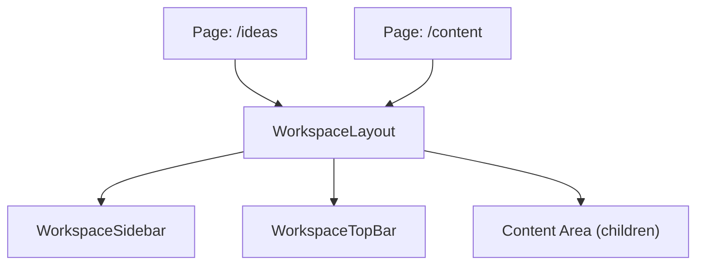
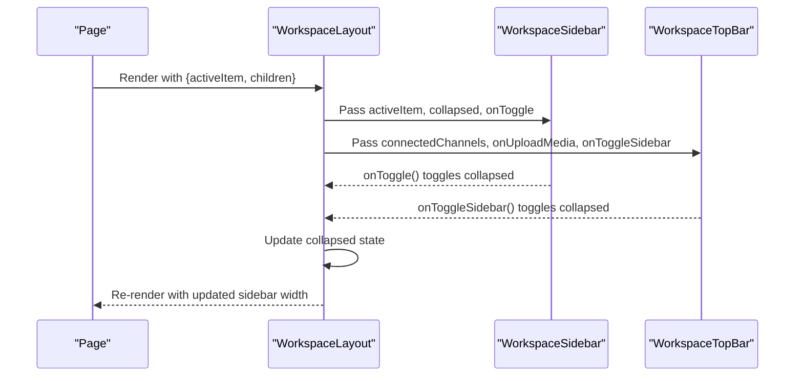
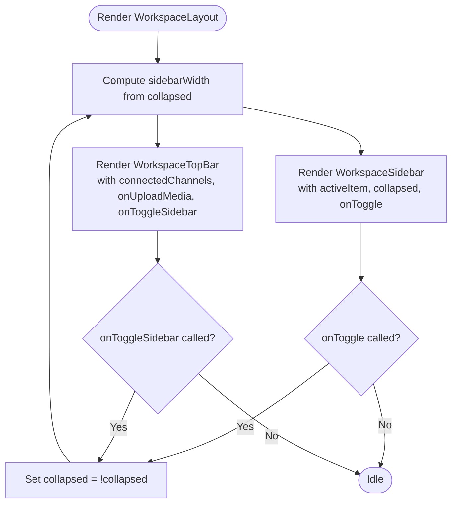
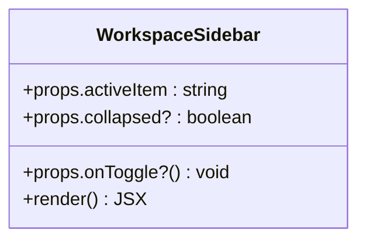
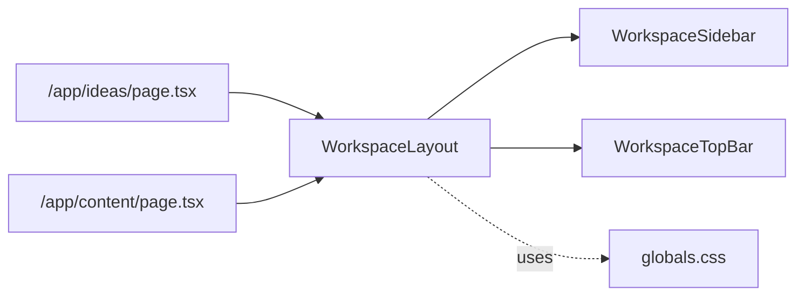

# Layout System

<cite>
**Referenced Files in This Document**
- [workspace-layout.tsx](file://components/layout/workspace-layout.tsx)
- [workspace-sidebar.tsx](file://components/layout/workspace-sidebar.tsx)
- [workspace-top-bar.tsx](file://components/layout/workspace-top-bar.tsx)
- [layout.tsx](file://app/layout.tsx)
- [ideas/page.tsx](file://app/ideas/page.tsx)
- [content/page.tsx](file://app/content/page.tsx)
- [globals.css](file://app/globals.css)
</cite>

## Table of Contents
1. [Introduction](#introduction)
2. [Project Structure](#project-structure)
3. [Core Components](#core-components)
4. [Architecture Overview](#architecture-overview)
5. [Detailed Component Analysis](#detailed-component-analysis)
6. [Dependency Analysis](#dependency-analysis)
7. [Performance Considerations](#performance-considerations)
8. [Troubleshooting Guide](#troubleshooting-guide)
9. [Conclusion](#conclusion)
10. [Appendices](#appendices)

## Introduction
This document explains the workspace layout system that provides a consistent shell for application pages. The system centers around a main container that orchestrates a collapsible sidebar, a top bar with global actions, and a scrollable content area. It uses Tailwind CSS classes to implement a responsive, mobile-first design and exposes clear prop interfaces and event patterns so new pages can be added quickly while maintaining consistency.

## Project Structure
The layout system is implemented as three focused components under a shared layout directory:
- WorkspaceLayout: Main container managing collapsed state and composing Sidebar + TopBar + Content
- WorkspaceSidebar: Navigation panel with links and collapse toggle
- WorkspaceTopBar: Global actions (upload media, profiles, trial CTA) and optional sidebar toggle

Pages wrap their content in WorkspaceLayout and pass an activeItem to highlight the current section.



**Diagram sources**
- [workspace-layout.tsx:13-39](file://components/layout/workspace-layout.tsx#L13-L39)
- [ideas/page.tsx:12-88](file://app/ideas/page.tsx#L12-L88)
- [content/page.tsx:16-98](file://app/content/page.tsx#L16-L98)

**Section sources**
- [workspace-layout.tsx:1-41](file://components/layout/workspace-layout.tsx#L1-L41)
- [workspace-sidebar.tsx:1-166](file://components/layout/workspace-sidebar.tsx#L1-L166)
- [workspace-top-bar.tsx:1-92](file://components/layout/workspace-top-bar.tsx#L1-L92)
- [ideas/page.tsx:1-90](file://app/ideas/page.tsx#L1-L90)
- [content/page.tsx:1-100](file://app/content/page.tsx#L1-L100)

## Core Components
- WorkspaceLayout
  - Manages collapsed state for the sidebar and computes width accordingly
  - Composes WorkspaceSidebar, WorkspaceTopBar, and a scrollable main area
  - Exposes props for active navigation item and connected channels
- WorkspaceSidebar
  - Renders navigation links with active state styling
  - Supports collapsed mode showing only icons
  - Provides onToggle callback to change collapsed state
- WorkspaceTopBar
  - Provides global actions: upload media, profile selection, trial CTA
  - Optionally exposes onToggleSidebar to control sidebar from the top bar
  - Displays connected channel avatars based on provided data

**Section sources**
- [workspace-layout.tsx:7-39](file://components/layout/workspace-layout.tsx#L7-L39)
- [workspace-sidebar.tsx:6-163](file://components/layout/workspace-sidebar.tsx#L6-L163)
- [workspace-top-bar.tsx:5-90](file://components/layout/workspace-top-bar.tsx#L5-L90)

## Architecture Overview
The layout follows a parent-child composition pattern:
- Pages render WorkspaceLayout and provide activeItem and children
- WorkspaceLayout manages local collapsed state and passes it down
- WorkspaceSidebar and WorkspaceTopBar respond to props and emit events via callbacks
- The content area scrolls independently while the sidebar remains fixed



**Diagram sources**
- [workspace-layout.tsx:13-39](file://components/layout/workspace-layout.tsx#L13-L39)
- [workspace-sidebar.tsx:12-36](file://components/layout/workspace-sidebar.tsx#L12-L36)
- [workspace-top-bar.tsx:15-33](file://components/layout/workspace-top-bar.tsx#L15-L33)

## Detailed Component Analysis

### WorkspaceLayout
- Responsibilities
  - Holds collapsed state and calculates sidebar width
  - Applies full-viewport height and dark theme styles
  - Wraps child content in a scrollable main area
- Props
  - children: ReactNode
  - activeItem: union type identifying current section
  - connectedChannels?: array of platform account info
- Event handling
  - onToggle from Sidebar flips collapsed
  - onToggleSidebar from TopBar also flips collapsed
- Responsive behavior
  - Uses fixed-width sidebar with transition; content marginLeft adjusts dynamically
  - No explicit breakpoints here; relies on page-level responsive classes



**Diagram sources**
- [workspace-layout.tsx:13-39](file://components/layout/workspace-layout.tsx#L13-L39)

**Section sources**
- [workspace-layout.tsx:7-39](file://components/layout/workspace-layout.tsx#L7-L39)

### WorkspaceSidebar
- Responsibilities
  - Renders navigation items with active highlighting
  - Switches between expanded (icon + label) and collapsed (icon-only) modes
  - Provides a close button when expanded
- Props
  - activeItem: identifies current section
  - onToggle?: callback to collapse/expand
  - collapsed?: boolean controlling display mode
- Accessibility considerations
  - Links are native <a> elements, ensuring keyboard focusability
  - Icons are decorative; labels are present in expanded mode
  - Close button has visible hover states and semantic button element



**Diagram sources**
- [workspace-sidebar.tsx:6-163](file://components/layout/workspace-sidebar.tsx#L6-L163)

**Section sources**
- [workspace-sidebar.tsx:6-163](file://components/layout/workspace-sidebar.tsx#L6-L163)

### WorkspaceTopBar
- Responsibilities
  - Provides global actions: upload media, Dropbox integration placeholder, profile selector, trial CTA
  - Shows connected channel avatars with platform-specific colors
  - Optional sidebar toggle button
- Props
  - connectedChannels: array of platform account objects
  - onUploadMedia: callback to open media uploader
  - onToggleSidebar?: callback to collapse/expand sidebar
- Accessibility considerations
  - Buttons are semantic <button> elements with hover states
  - Channel avatars use title attributes for screen readers
  - Action buttons have descriptive text or accessible labels where applicable

```mermaid
classDiagram
class WorkspaceTopBar {
+props.connectedChannels : Array<{platform : string, accountName : string|null, externalId : string|null}>
+props.onUploadMedia() void
+props.onToggleSidebar?() void
+render() JSX
}
```

**Diagram sources**
- [workspace-top-bar.tsx:5-90](file://components/layout/workspace-top-bar.tsx#L5-L90)

**Section sources**
- [workspace-top-bar.tsx:5-90](file://components/layout/workspace-top-bar.tsx#L5-L90)

### Page Integration Examples
- Ideas page
  - Wraps content in WorkspaceLayout with activeItem="ideas"
  - Provides page header and content grid
- Content page
  - Wraps content in WorkspaceLayout with activeItem="content"
  - Provides page header and list of content items

These examples demonstrate how to add new pages by:
- Importing WorkspaceLayout
- Passing activeItem matching one of the allowed values
- Rendering page-specific header and content inside children

**Section sources**
- [ideas/page.tsx:1-90](file://app/ideas/page.tsx#L1-L90)
- [content/page.tsx:1-100](file://app/content/page.tsx#L1-L100)

## Dependency Analysis
- WorkspaceLayout depends on WorkspaceSidebar and WorkspaceTopBar
- Pages depend on WorkspaceLayout to provide consistent layout
- Root layout defines fonts and base styles but does not enforce layout structure
- Global CSS sets theme variables and animations used across the app



**Diagram sources**
- [ideas/page.tsx:1-90](file://app/ideas/page.tsx#L1-L90)
- [content/page.tsx:1-100](file://app/content/page.tsx#L1-L100)
- [workspace-layout.tsx:1-41](file://components/layout/workspace-layout.tsx#L1-L41)
- [globals.css:1-181](file://app/globals.css#L1-L181)

**Section sources**
- [workspace-layout.tsx:1-41](file://components/layout/workspace-layout.tsx#L1-L41)
- [workspace-sidebar.tsx:1-166](file://components/layout/workspace-sidebar.tsx#L1-L166)
- [workspace-top-bar.tsx:1-92](file://components/layout/workspace-top-bar.tsx#L1-L92)
- [ideas/page.tsx:1-90](file://app/ideas/page.tsx#L1-L90)
- [content/page.tsx:1-100](file://app/content/page.tsx#L1-L100)
- [globals.css:1-181](file://app/globals.css#L1-L181)

## Performance Considerations
- Collapsed state is local to WorkspaceLayout; toggling updates only the layout tree
- Sidebar width is computed inline; no heavy reflows beyond standard DOM updates
- Content area scrolls independently, improving perceived performance during long lists
- Avoid passing large connectedChannels arrays without memoization if frequently changing

[No sources needed since this section provides general guidance]

## Troubleshooting Guide
- Sidebar not collapsing
  - Ensure onToggle is passed to WorkspaceSidebar and onToggleSidebar to WorkspaceTopBar
  - Verify WorkspaceLayout maintains collapsed state and passes it down
- Active item not highlighted
  - Confirm activeItem matches one of the allowed values and is passed correctly
- Connected channels not rendering
  - Ensure connectedChannels is provided and contains platform names recognized by WorkspaceTopBar
- Keyboard navigation issues
  - Check that all interactive elements are native buttons/links
  - Verify focus order and visible focus indicators in your environment

**Section sources**
- [workspace-layout.tsx:13-39](file://components/layout/workspace-layout.tsx#L13-L39)
- [workspace-sidebar.tsx:12-36](file://components/layout/workspace-sidebar.tsx#L12-L36)
- [workspace-top-bar.tsx:15-33](file://components/layout/workspace-top-bar.tsx#L15-L33)

## Conclusion
The layout system provides a robust, composable foundation for application pages. WorkspaceLayout centralizes state and composition, while WorkspaceSidebar and WorkspaceTopBar encapsulate navigation and global actions. Pages integrate easily by wrapping content in WorkspaceLayout and setting activeItem. The system leverages Tailwind CSS for responsive styling and offers clear extension points for adding new features and pages.

[No sources needed since this section summarizes without analyzing specific files]

## Appendices

### Prop Interfaces Summary
- WorkspaceLayoutProps
  - children: ReactNode
  - activeItem: union of allowed sections
  - connectedChannels?: array of platform account info
- WorkspaceSidebarProps
  - activeItem: same union
  - onToggle?: () => void
  - collapsed?: boolean
- WorkspaceTopBarProps
  - connectedChannels: array of platform account info
  - onUploadMedia: () => void
  - onToggleSidebar?: () => void

**Section sources**
- [workspace-layout.tsx:7-11](file://components/layout/workspace-layout.tsx#L7-L11)
- [workspace-sidebar.tsx:6-10](file://components/layout/workspace-sidebar.tsx#L6-L10)
- [workspace-top-bar.tsx:5-13](file://components/layout/workspace-top-bar.tsx#L5-L13)

### Adding a New Page
Steps:
- Create a new Next.js page file under app/
- Import WorkspaceLayout
- Wrap your page content in WorkspaceLayout with activeItem set to the appropriate value
- Add any page-specific header and content inside children

Example references:
- See how /ideas and /content integrate with WorkspaceLayout

**Section sources**
- [ideas/page.tsx:1-90](file://app/ideas/page.tsx#L1-L90)
- [content/page.tsx:1-100](file://app/content/page.tsx#L1-L100)

### Responsive Design Patterns
- Mobile-first approach using Tailwind utility classes
- Fixed sidebar with smooth transitions and dynamic marginLeft adjustment
- Content area adapts to available width; pages can add responsive padding and typography
- Global theme variables and font variables defined in root layout and globals.css

**Section sources**
- [workspace-layout.tsx:21-37](file://components/layout/workspace-layout.tsx#L21-L37)
- [workspace-sidebar.tsx:13-163](file://components/layout/workspace-sidebar.tsx#L13-L163)
- [workspace-top-bar.tsx:16-90](file://components/layout/workspace-top-bar.tsx#L16-L90)
- [layout.tsx:27-38](file://app/layout.tsx#L27-L38)
- [globals.css:1-181](file://app/globals.css#L1-L181)

### Accessibility Notes
- Use semantic HTML elements for navigation and actions
- Provide visible labels or titles for icons and avatars
- Ensure keyboard operability for all interactive controls
- Maintain sufficient color contrast and focus indicators

**Section sources**
- [workspace-sidebar.tsx:12-163](file://components/layout/workspace-sidebar.tsx#L12-L163)
- [workspace-top-bar.tsx:15-90](file://components/layout/workspace-top-bar.tsx#L15-L90)