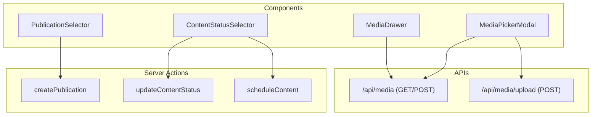
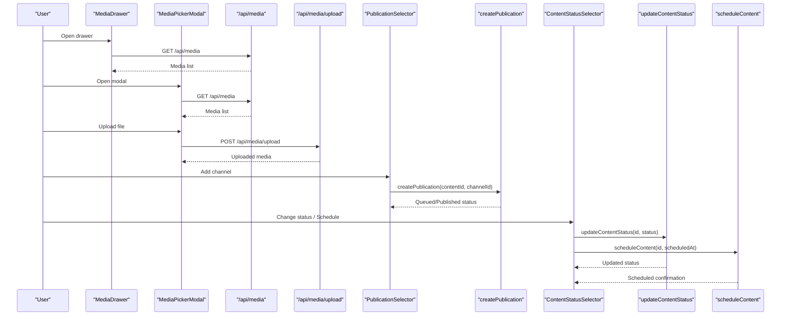
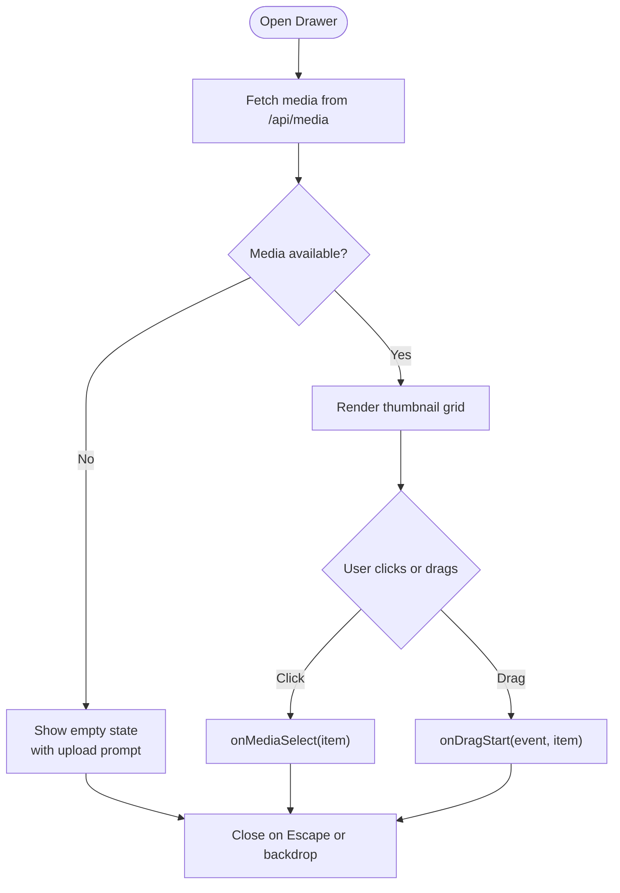
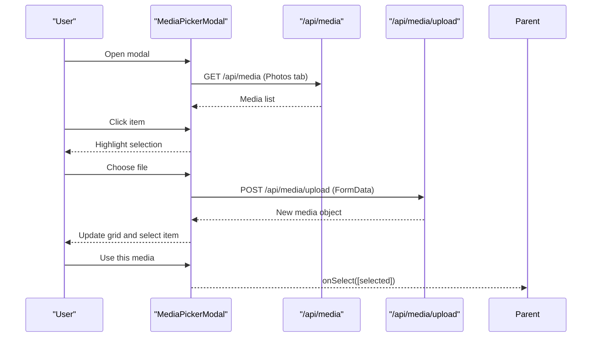
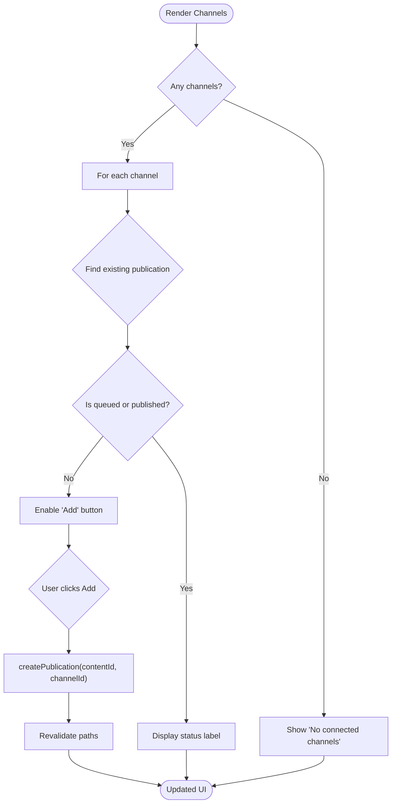
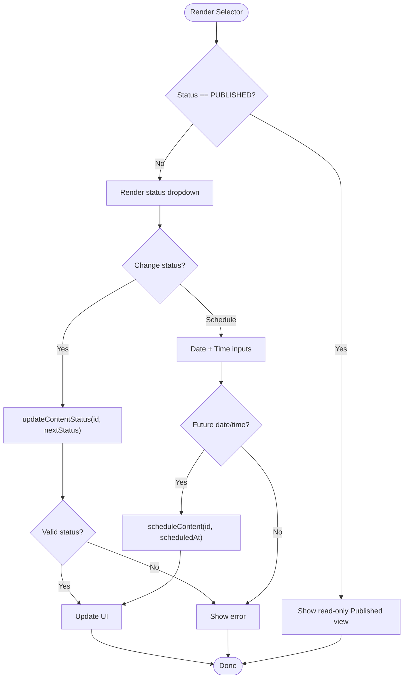
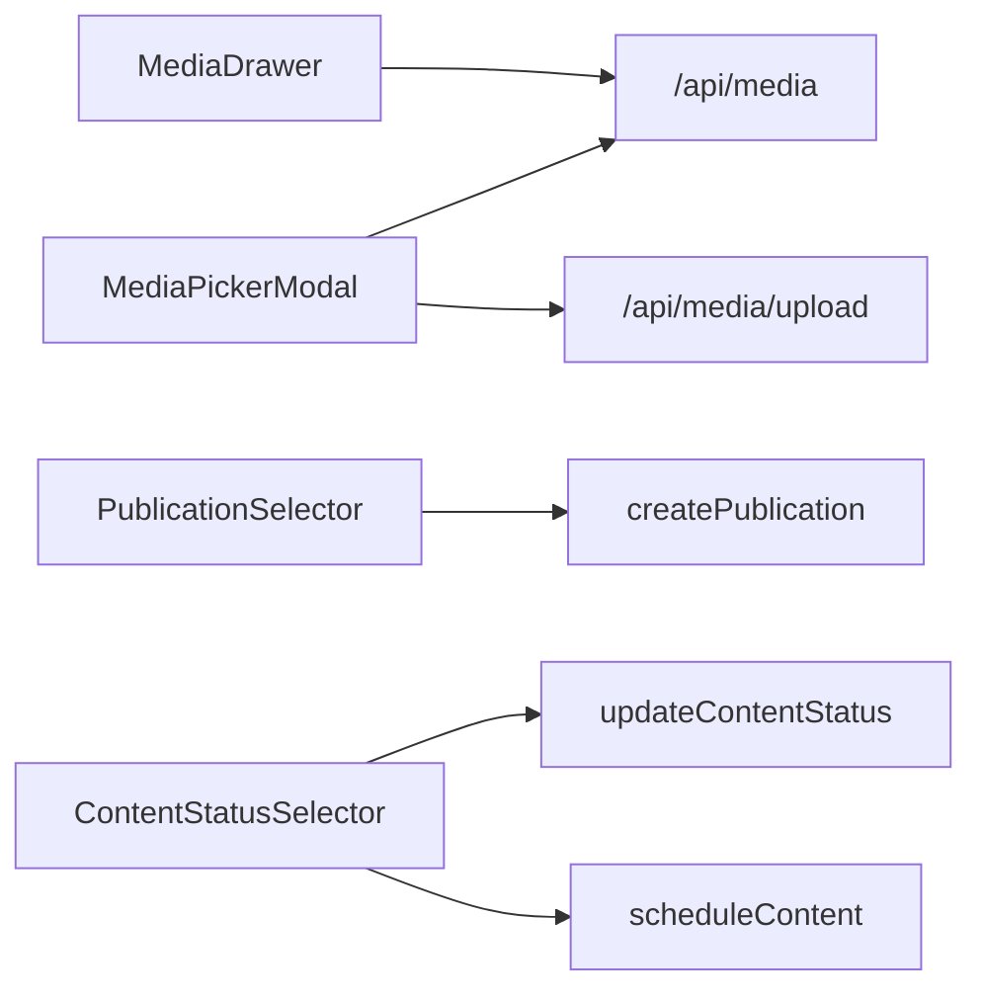

# Shared Components

<cite>
**Referenced Files in This Document**
- [media-drawer.tsx](file://components/calendar/media-drawer.tsx)
- [media-picker-modal.tsx](file://components/calendar/media-picker-modal.tsx)
- [publication-selector.tsx](file://components/content/publication-selector.tsx)
- [content-status-selector.tsx](file://components/content/content-status-selector.tsx)
- [media route](file://app/api/media/route.ts)
- [media upload route](file://app/api/media/upload/route.ts)
- [create publication action](file://app/content/actions/create-publication.ts)
- [update content status action](file://app/content/actions/update-content-status.ts)
- [schedule content action](file://app/content/actions/schedule-content.ts)
</cite>

## Table of Contents
1. Introduction
2. Project Structure
3. Core Components
4. Architecture Overview
5. Detailed Component Analysis
6. Dependency Analysis
7. Performance Considerations
8. Troubleshooting Guide
9. Conclusion

## Introduction
This document provides detailed documentation for reusable shared components used across multiple features: MediaDrawer, MediaPickerModal, PublicationSelector, and ContentStatusSelector. It covers their APIs, customization options, styling approaches, integration patterns with backend APIs, accessibility considerations, responsive behavior, and performance characteristics. The goal is to help developers integrate these components consistently while maintaining a high-quality user experience.

## Project Structure
The shared components are organized by feature area under the components directory:
- Calendar-related media tools: MediaDrawer and MediaPickerModal
- Content management UI: PublicationSelector and ContentStatusSelector
- Backend integrations: Next.js API routes for media listing and uploads; server actions for publishing and scheduling

**Diagram sources**
- [media-drawer.tsx:31-38](file://components/calendar/media-drawer.tsx#L31-L38)
- [media-picker-modal.tsx:43-80](file://components/calendar/media-picker-modal.tsx#L43-L80)
- [media-picker-modal.tsx:86-127](file://components/calendar/media-picker-modal.tsx#L86-L127)
- [publication-selector.tsx:47-61](file://components/content/publication-selector.tsx#L47-L61)
- [content-status-selector.tsx:44-92](file://components/content/content-status-selector.tsx#L44-L92)
- [media route:4-23](file://app/api/media/route.ts#L4-L23)
- [media upload route:20-125](file://app/api/media/upload/route.ts#L20-L125)
- [create publication action:6-67](file://app/content/actions/create-publication.ts#L6-L67)
- [update content status action:14-57](file://app/content/actions/update-content-status.ts#L14-L57)
- [schedule content action:6-65](file://app/content/actions/schedule-content.ts#L6-L65)

**Section sources**
- [media-drawer.tsx:1-167](file://components/calendar/media-drawer.tsx#L1-L167)
- [media-picker-modal.tsx:1-329](file://components/calendar/media-picker-modal.tsx#L1-L329)
- [publication-selector.tsx:1-138](file://components/content/publication-selector.tsx#L1-L138)
- [content-status-selector.tsx:1-184](file://components/content/content-status-selector.tsx#L1-L184)
- [media route:1-80](file://app/api/media/route.ts#L1-L80)
- [media upload route:1-126](file://app/api/media/upload/route.ts#L1-L126)
- [create publication action:1-69](file://app/content/actions/create-publication.ts#L1-L69)
- [update content status action:1-58](file://app/content/actions/update-content-status.ts#L1-L58)
- [schedule content action:1-66](file://app/content/actions/schedule-content.ts#L1-L66)

## Core Components
- MediaDrawer: A slide-in drawer that lists media items from the library, supports drag-and-drop selection, and integrates with the media library.
- MediaPickerModal: A modal dialog for browsing, uploading, previewing, and selecting media assets with tabbed navigation and grid layout.
- PublicationSelector: A multi-platform selector that queues or shows the status of publications per channel.
- ContentStatusSelector: A workflow control for changing content status and scheduling content with validation and feedback.

Key responsibilities:
- Data fetching and caching via Next.js revalidation
- Client-side state management for selections and UI states
- Accessible interactions (keyboard support, labels, focus management)
- Responsive layouts using utility classes

**Section sources**
- [media-drawer.tsx:14-28](file://components/calendar/media-drawer.tsx#L14-L28)
- [media-picker-modal.tsx:15-33](file://components/calendar/media-picker-modal.tsx#L15-L33)
- [publication-selector.tsx:16-21](file://components/content/publication-selector.tsx#L16-L21)
- [content-status-selector.tsx:11-15](file://components/content/content-status-selector.tsx#L11-L15)

## Architecture Overview
The components interact with backend endpoints and server actions to manage media and content lifecycle:

**Diagram sources**
- [media-drawer.tsx:31-38](file://components/calendar/media-drawer.tsx#L31-L38)
- [media-picker-modal.tsx:43-80](file://components/calendar/media-picker-modal.tsx#L43-L80)
- [media-picker-modal.tsx:86-127](file://components/calendar/media-picker-modal.tsx#L86-L127)
- [publication-selector.tsx:47-61](file://components/content/publication-selector.tsx#L47-L61)
- [content-status-selector.tsx:44-92](file://components/content/content-status-selector.tsx#L44-L92)
- [media route:4-23](file://app/api/media/route.ts#L4-L23)
- [media upload route:20-125](file://app/api/media/upload/route.ts#L20-L125)
- [create publication action:6-67](file://app/content/actions/create-publication.ts#L6-L67)
- [update content status action:14-57](file://app/content/actions/update-content-status.ts#L14-L57)
- [schedule content action:6-65](file://app/content/actions/schedule-content.ts#L6-L65)

## Detailed Component Analysis

### MediaDrawer
Purpose:
- Displays a sidebar drawer with the current media library.
- Supports drag-and-drop and click-to-select interactions.
- Integrates with the media library via API.

API:
- Props:
  - open: boolean — controls visibility
  - onClose: function — closes the drawer
  - onMediaSelect: function — receives selected MediaItem
  - onDragStart: function — handles drag start event with MediaItem
  - sidebarWidth: number — positions drawer relative to sidebar width

Behavior:
- Fetches media when opened via GET /api/media.
- Renders thumbnails in a compact grid.
- Provides keyboard support (Escape to close).
- Links to manage media page.

Styling:
- Fixed-position drawer with backdrop overlay.
- Uses utility classes for spacing, borders, and hover states.
- Grid layout for thumbnails with aspect-square images.

Accessibility:
- Keyboard shortcut to close (Escape).
- Images include alt text from filename.

Integration:
- Reads media list from /api/media.
- Emits events for selection and drag operations to parent.

Performance:
- Fetches only when open to avoid unnecessary requests.
- Limits results at API level to recent items.

Customization:
- Provide custom sidebarWidth for layout alignment.
- Replace link destination if needed.

**Section sources**
- [media-drawer.tsx:6-20](file://components/calendar/media-drawer.tsx#L6-L20)
- [media-drawer.tsx:31-48](file://components/calendar/media-drawer.tsx#L31-L48)
- [media-drawer.tsx:52-116](file://components/calendar/media-drawer.tsx#L52-L116)
- [media route:4-23](file://app/api/media/route.ts#L4-L23)

#### MediaDrawer Flowchart

**Diagram sources**
- [media-drawer.tsx:31-38](file://components/calendar/media-drawer.tsx#L31-L38)
- [media-drawer.tsx:72-102](file://components/calendar/media-drawer.tsx#L72-L102)
- [media-drawer.tsx:40-48](file://components/calendar/media-drawer.tsx#L40-L48)

### MediaPickerModal
Purpose:
- Modal interface for browsing, uploading, previewing, and selecting media assets.
- Tabbed navigation for different asset categories (Photos, Text, Elements, Background, AI Image).
- Grid layout for media previews with selection highlighting.

API:
- Props:
  - onClose: function — closes the modal
  - onSelect: function — returns array of selected MediaItem(s)

Behavior:
- Loads media list on Photos tab via GET /api/media.
- Uploads files via POST /api/media/upload with FormData.
- Maintains local state for active tab, selected item, loading, uploading, and errors.
- Renders video or image previews based on type.
- Disables “Use this media” until an item is selected.

Styling:
- Full-screen overlay with centered modal.
- Left navigation tabs with active state styling.
- Grid layout for media items with consistent aspect ratios.
- Footer with status text and action buttons.

Accessibility:
- Escape key closes modal.
- Focusable elements with clear visual states.
- Descriptive labels for inputs and buttons.

Integration:
- GET /api/media to populate photos.
- POST /api/media/upload to add new media.
- Returns selected media to parent via onSelect callback.

Performance:
- Loading and error states prevent redundant work.
- Only fetches when Photos tab is active.
- Uses metadata preload for videos to reduce initial load.

Customization:
- Extend TABS to add new categories.
- Adjust accept attributes for supported file types.

**Section sources**
- [media-picker-modal.tsx:5-18](file://components/calendar/media-picker-modal.tsx#L5-L18)
- [media-picker-modal.tsx:22-28](file://components/calendar/media-picker-modal.tsx#L22-L28)
- [media-picker-modal.tsx:43-80](file://components/calendar/media-picker-modal.tsx#L43-L80)
- [media-picker-modal.tsx:86-127](file://components/calendar/media-picker-modal.tsx#L86-L127)
- [media-picker-modal.tsx:134-325](file://components/calendar/media-picker-modal.tsx#L134-L325)
- [media route:4-23](file://app/api/media/route.ts#L4-L23)
- [media upload route:20-125](file://app/api/media/upload/route.ts#L20-L125)

#### MediaPickerModal Sequence Diagram

**Diagram sources**
- [media-picker-modal.tsx:43-80](file://components/calendar/media-picker-modal.tsx#L43-L80)
- [media-picker-modal.tsx:86-127](file://components/calendar/media-picker-modal.tsx#L86-L127)
- [media-picker-modal.tsx:134-325](file://components/calendar/media-picker-modal.tsx#L134-L325)
- [media route:4-23](file://app/api/media/route.ts#L4-L23)
- [media upload route:20-125](file://app/api/media/upload/route.ts#L20-L125)

### PublicationSelector
Purpose:
- Multi-platform selection interface to queue or show status of publications per channel.
- Validates channel connectivity and existing publication states before queuing.

API:
- Props:
  - contentId: string — identifies the content being published
  - channels: Channel[] — list of available publishing channels
  - publications: Publication[] — current publication statuses per channel
  - disabled?: boolean — disables all actions

Behavior:
- Shows “No connected channels” message when channels list is empty.
- For each channel, displays platform name and current status if queued/published.
- Queues publication via createPublication server action.
- Updates button label based on status and pending state.

Validation logic:
- Prevents queuing if content is already published.
- Ensures channel is connected.
- Avoids duplicate published entries.

Styling:
- Clean card-like rows with border and padding.
- Disabled states for unavailable actions.
- Error messages displayed below the section.

Accessibility:
- Buttons are clearly labeled with status or action.
- Disabled states communicate unavailability.

Integration:
- Calls createPublication server action to queue or update publication status.
- Relies on revalidation to refresh UI after changes.

Customization:
- Provide custom channel data and publication mappings.
- Extend statusLabel mapping for additional statuses.

**Section sources**
- [publication-selector.tsx:6-21](file://components/content/publication-selector.tsx#L6-L21)
- [publication-selector.tsx:23-36](file://components/content/publication-selector.tsx#L23-L36)
- [publication-selector.tsx:47-61](file://components/content/publication-selector.tsx#L47-L61)
- [publication-selector.tsx:63-135](file://components/content/publication-selector.tsx#L63-L135)
- [create publication action:6-67](file://app/content/actions/create-publication.ts#L6-L67)

#### PublicationSelector Flowchart

**Diagram sources**
- [publication-selector.tsx:75-127](file://components/content/publication-selector.tsx#L75-L127)
- [create publication action:6-67](file://app/content/actions/create-publication.ts#L6-L67)

### ContentStatusSelector
Purpose:
- Workflow management for changing content status and scheduling content.
- Provides immediate visual feedback and validation during transitions.

API:
- Props:
  - id: string — content identifier
  - status: string — current content status
  - scheduledAt?: string | Date | null — optional scheduled date/time

Behavior:
- If status is PUBLISHED, renders a read-only view.
- Allows switching between DRAFT and READY via dropdown.
- Scheduling flow validates date/time and ensures future time.
- Calls updateContentStatus and scheduleContent server actions.

Validation logic:
- Rejects invalid statuses.
- Prevents modifying published content.
- Requires scheduled date/time when setting SCHEDULED.
- Ensures scheduled time is in the future.

Styling:
- Card-like container with bordered sections.
- Inputs styled with focus states and disabled opacity.
- Error messages displayed inline.

Accessibility:
- Labels associated with inputs via htmlFor.
- Clear disabled states for pending operations.

Integration:
- updateContentStatus updates status and clears scheduledAt when not scheduled.
- scheduleContent sets status to SCHEDULED and updates related publications.
- Revalidates relevant paths to reflect changes.

Customization:
- Extend STATUSES array to support additional workflow states.
- Adjust timezone handling for scheduledAt formatting.

**Section sources**
- [content-status-selector.tsx:7-15](file://components/content/content-status-selector.tsx#L7-L15)
- [content-status-selector.tsx:17-42](file://components/content/content-status-selector.tsx#L17-L42)
- [content-status-selector.tsx:44-92](file://components/content/content-status-selector.tsx#L44-L92)
- [content-status-selector.tsx:94-180](file://components/content/content-status-selector.tsx#L94-L180)
- [update content status action:14-57](file://app/content/actions/update-content-status.ts#L14-L57)
- [schedule content action:6-65](file://app/content/actions/schedule-content.ts#L6-L65)

#### ContentStatusSelector Flowchart

**Diagram sources**
- [content-status-selector.tsx:33-42](file://components/content/content-status-selector.tsx#L33-L42)
- [content-status-selector.tsx:44-92](file://components/content/content-status-selector.tsx#L44-L92)
- [content-status-selector.tsx:94-180](file://components/content/content-status-selector.tsx#L94-L180)
- [update content status action:14-57](file://app/content/actions/update-content-status.ts#L14-L57)
- [schedule content action:6-65](file://app/content/actions/schedule-content.ts#L6-L65)

## Dependency Analysis
Component dependencies and relationships:
- MediaDrawer depends on /api/media for listing and emits selection/drag events to parent.
- MediaPickerModal depends on /api/media and /api/media/upload for browsing and uploading assets.
- PublicationSelector depends on createPublication server action to queue or update publication status.
- ContentStatusSelector depends on updateContentStatus and scheduleContent server actions to manage content lifecycle.

**Diagram sources**
- [media-drawer.tsx:31-38](file://components/calendar/media-drawer.tsx#L31-L38)
- [media-picker-modal.tsx:43-80](file://components/calendar/media-picker-modal.tsx#L43-L80)
- [media-picker-modal.tsx:86-127](file://components/calendar/media-picker-modal.tsx#L86-L127)
- [publication-selector.tsx:47-61](file://components/content/publication-selector.tsx#L47-L61)
- [content-status-selector.tsx:44-92](file://components/content/content-status-selector.tsx#L44-L92)
- [media route:4-23](file://app/api/media/route.ts#L4-L23)
- [media upload route:20-125](file://app/api/media/upload/route.ts#L20-L125)
- [create publication action:6-67](file://app/content/actions/create-publication.ts#L6-L67)
- [update content status action:14-57](file://app/content/actions/update-content-status.ts#L14-L57)
- [schedule content action:6-65](file://app/content/actions/schedule-content.ts#L6-L65)

**Section sources**
- [media-drawer.tsx:31-38](file://components/calendar/media-drawer.tsx#L31-L38)
- [media-picker-modal.tsx:43-80](file://components/calendar/media-picker-modal.tsx#L43-L80)
- [media-picker-modal.tsx:86-127](file://components/calendar/media-picker-modal.tsx#L86-L127)
- [publication-selector.tsx:47-61](file://components/content/publication-selector.tsx#L47-L61)
- [content-status-selector.tsx:44-92](file://components/content/content-status-selector.tsx#L44-L92)
- [media route:4-23](file://app/api/media/route.ts#L4-L23)
- [media upload route:20-125](file://app/api/media/upload/route.ts#L20-L125)
- [create publication action:6-67](file://app/content/actions/create-publication.ts#L6-L67)
- [update content status action:14-57](file://app/content/actions/update-content-status.ts#L14-L57)
- [schedule content action:6-65](file://app/content/actions/schedule-content.ts#L6-L65)

## Performance Considerations
- MediaDrawer:
  - Fetches media only when open to minimize network usage.
  - Uses compact grid layout for efficient rendering.
- MediaPickerModal:
  - Loads media on tab activation to avoid unnecessary requests.
  - Preloads video metadata to improve perceived performance.
  - Handles loading and error states to prevent redundant operations.
- PublicationSelector:
  - Uses server actions with revalidation to ensure UI consistency without full page reloads.
  - Disables buttons during pending operations to prevent race conditions.
- ContentStatusSelector:
  - Validates inputs client-side before sending requests.
  - Uses transitions to indicate pending state and improve UX.

General recommendations:
- Implement pagination or infinite scroll for large media libraries.
- Cache media lists where appropriate to reduce repeated fetches.
- Optimize image/video sizes and use lazy loading for offscreen items.

[No sources needed since this section provides general guidance]

## Troubleshooting Guide
Common issues and resolutions:
- Media not loading:
  - Ensure /api/media responds with a valid JSON structure containing media array.
  - Check network requests and error logs for failures.
- Upload fails:
  - Verify content-type is multipart/form-data and file field is present.
  - Confirm allowed file types and size limits.
  - Ensure contentId exists and is valid.
- Publication cannot be queued:
  - Check that content is not already published.
  - Ensure publishing channel is connected.
  - Avoid duplicate publications for the same content-channel pair.
- Status change errors:
  - Validate status values against allowed set.
  - Ensure scheduled content has a valid future date/time.
  - Prevent modifications to published content.

Error handling patterns:
- Components display inline error messages for user feedback.
- Server actions throw descriptive errors which are caught and surfaced in UI.
- Revalidation ensures UI reflects latest state after successful mutations.

**Section sources**
- [media upload route:20-125](file://app/api/media/upload/route.ts#L20-L125)
- [create publication action:6-67](file://app/content/actions/create-publication.ts#L6-L67)
- [update content status action:14-57](file://app/content/actions/update-content-status.ts#L14-L57)
- [schedule content action:6-65](file://app/content/actions/schedule-content.ts#L6-L65)
- [media-picker-modal.tsx:86-127](file://components/calendar/media-picker-modal.tsx#L86-L127)
- [publication-selector.tsx:47-61](file://components/content/publication-selector.tsx#L47-L61)
- [content-status-selector.tsx:44-92](file://components/content/content-status-selector.tsx#L44-L92)

## Conclusion
These shared components provide robust, accessible, and performant interfaces for media management and content workflow. They integrate seamlessly with backend APIs and server actions, offering clear user feedback and validation. By following the documented APIs, customization options, and best practices, teams can consistently implement media selection, publication scheduling, and content status management across features.

[No sources needed since this section summarizes without analyzing specific files]