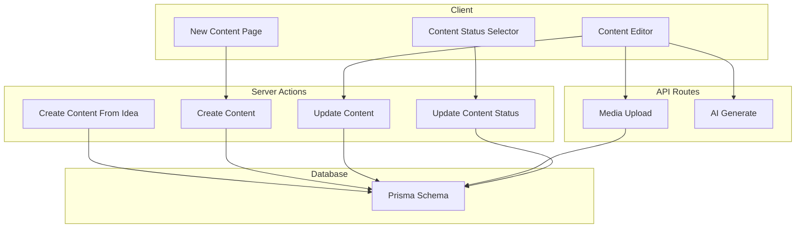
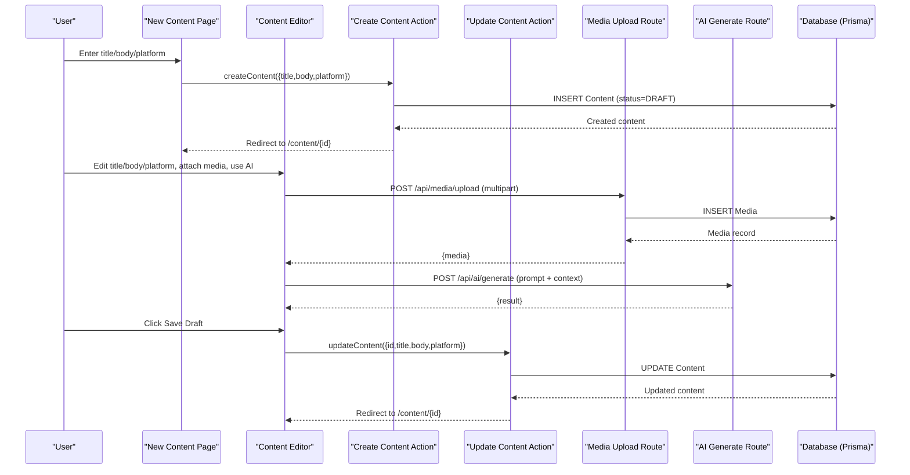
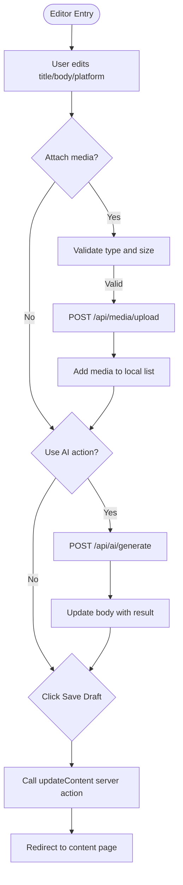
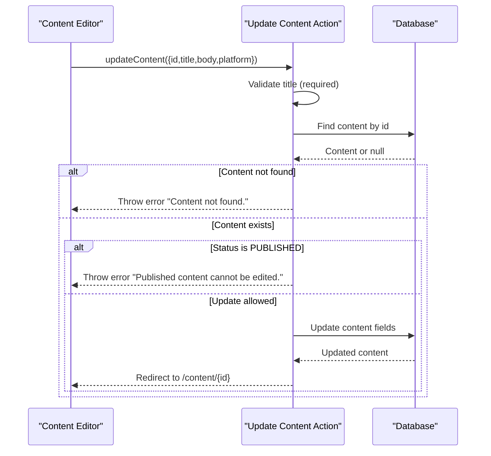
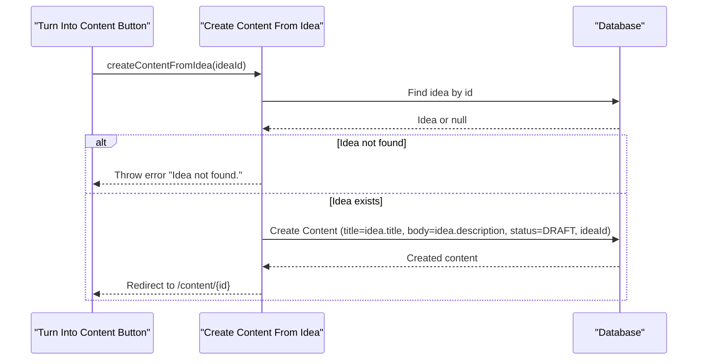
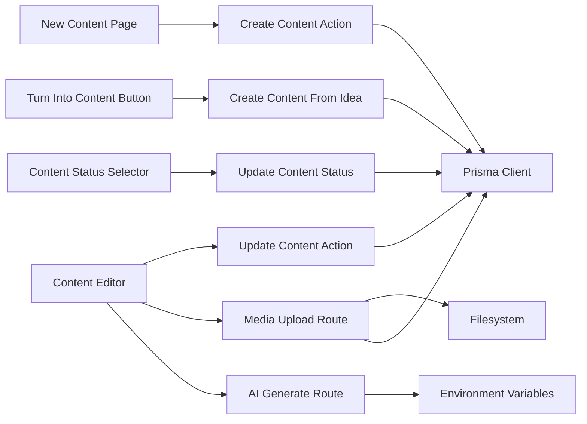

# Content Creation and Editing

<cite>
**Referenced Files in This Document**
- [create-content.ts](file://app/content/actions/create-content.ts)
- [update-content.ts](file://app/content/actions/update-content.ts)
- [content-editor.tsx](file://components/content/content-editor.tsx)
- [new/page.tsx](file://app/content/new/page.tsx)
- [content page](file://app/content/[id]/page.tsx)
- [schema.prisma](file://prisma/schema.prisma)
- [media upload route](file://app/api/media/upload/route.ts)
- [ai generate route](file://app/api/ai/generate/route.ts)
- [turn into content button](file://components/ideas/turn-into-content-button.tsx)
- [create content from idea action](file://app/content/actions/create-content-from-idea.ts)
- [content status selector](file://components/content/content-status-selector.tsx)
- [update content status action](file://app/content/actions/update-content-status.ts)
</cite>

## Table of Contents
1. [Introduction](#introduction)
2. [Project Structure](#project-structure)
3. [Core Components](#core-components)
4. [Architecture Overview](#architecture-overview)
5. [Detailed Component Analysis](#detailed-component-analysis)
6. [Dependency Analysis](#dependency-analysis)
7. [Performance Considerations](#performance-considerations)
8. [Troubleshooting Guide](#troubleshooting-guide)
9. [Conclusion](#conclusion)
10. [Appendices](#appendices)

## Introduction
This document explains the content creation and editing functionality, focusing on:
- The content editor interface with title, body, platform selection, media attachments, and AI-assisted editing.
- Server actions for creating new content and updating existing content, including validation rules, data structures, and error handling.
- Form components, state management, and saving mechanisms.
- Integration with the idea-to-content workflow.
- Current capabilities around versioning, auto-save, and collaborative editing considerations based on the codebase.

## Project Structure
The content feature spans server actions, client components, API routes, and database schema:
- Server actions handle persistence and redirects.
- Client components manage UI state and user interactions.
- API routes provide media upload and AI generation endpoints.
- Prisma schema defines models for Content, Media, Idea, PublishingChannel, and Publication.

**Diagram sources**
- [new/page.tsx:19-35](file://app/content/new/page.tsx#L19-L35)
- [content-editor.tsx:148-157](file://components/content/content-editor.tsx#L148-L157)
- [content-editor.tsx:165-230](file://components/content/content-editor.tsx#L165-L230)
- [content-editor.tsx:99-146](file://components/content/content-editor.tsx#L99-L146)
- [content status selector:44-92](file://components/content/content-status-selector.tsx#L44-L92)
- [create-content.ts:12-24](file://app/content/actions/create-content.ts#L12-L24)
- [update-content.ts:13-46](file://app/content/actions/update-content.ts#L13-L46)
- [create content from idea action:6-27](file://app/content/actions/create-content-from-idea.ts#L6-L27)
- [update content status action:14-57](file://app/content/actions/update-content-status.ts#L14-L57)
- [media upload route:20-126](file://app/api/media/upload/route.ts#L20-L126)
- [ai generate route:87-218](file://app/api/ai/generate/route.ts#L87-L218)
- [schema.prisma:21-55](file://prisma/schema.prisma#L21-L55)

**Section sources**
- [new/page.tsx:1-126](file://app/content/new/page.tsx#L1-L126)
- [content-editor.tsx:1-596](file://components/content/content-editor.tsx#L1-L596)
- [create-content.ts:1-26](file://app/content/actions/create-content.ts#L1-L26)
- [update-content.ts:1-47](file://app/content/actions/update-content.ts#L1-L47)
- [schema.prisma:1-94](file://prisma/schema.prisma#L1-L94)

## Core Components
- Content Editor (client component): Provides title input, body textarea, platform selector, media upload/delete, AI-assisted editing, and save draft.
- New Content Page (client component): Minimal form to create a draft and navigate to the editor.
- Content Page (server component): Loads content with related media and publications, renders editor and publishing controls.
- Server Actions:
  - Create Content: Creates a draft content record and revalidates paths.
  - Update Content: Validates title, checks existence and publish status, updates fields, and redirects.
  - Create Content From Idea: Converts an idea into a draft content linked to the original idea.
  - Update Content Status: Validates allowed statuses and scheduling constraints.

Key responsibilities:
- Validation: Title required on update; file type and size restrictions on upload; scheduled date/time validation.
- Data persistence: Prisma operations for Content and Media.
- User feedback: Pending states, error messages, and read-only mode for published content.

**Section sources**
- [content-editor.tsx:15-22](file://components/content/content-editor.tsx#L15-L22)
- [content-editor.tsx:75-96](file://components/content/content-editor.tsx#L75-L96)
- [content-editor.tsx:148-157](file://components/content/content-editor.tsx#L148-L157)
- [content-editor.tsx:165-230](file://components/content/content-editor.tsx#L165-L230)
- [content-editor.tsx:273-314](file://components/content/content-editor.tsx#L273-L314)
- [content-editor.tsx:316-596](file://components/content/content-editor.tsx#L316-L596)
- [new/page.tsx:8-35](file://app/content/new/page.tsx#L8-L35)
- [content page:17-49](file://app/content/[id]/page.tsx#L17-L49)
- [create-content.ts:6-24](file://app/content/actions/create-content.ts#L6-L24)
- [update-content.ts:6-46](file://app/content/actions/update-content.ts#L6-L46)
- [create content from idea action:6-27](file://app/content/actions/create-content-from-idea.ts#L6-L27)
- [update content status action:6-57](file://app/content/actions/update-content-status.ts#L6-L57)

## Architecture Overview
The content flow integrates client-side editing with server-side persistence and optional integrations:

**Diagram sources**
- [new/page.tsx:19-35](file://app/content/new/page.tsx#L19-L35)
- [create-content.ts:12-24](file://app/content/actions/create-content.ts#L12-L24)
- [content-editor.tsx:165-230](file://components/content/content-editor.tsx#L165-L230)
- [media upload route:20-126](file://app/api/media/upload/route.ts#L20-L126)
- [content-editor.tsx:99-146](file://components/content/content-editor.tsx#L99-L146)
- [ai generate route:87-218](file://app/api/ai/generate/route.ts#L87-L218)
- [content-editor.tsx:148-157](file://components/content/content-editor.tsx#L148-L157)
- [update-content.ts:13-46](file://app/content/actions/update-content.ts#L13-L46)

## Detailed Component Analysis

### Content Editor Interface
- Fields:
  - Title: Text input bound to local state.
  - Body: Large textarea with character count and AI integration.
  - Platform: Select dropdown for target platforms.
- Media:
  - Drag-and-drop or file picker.
  - Allowed types: image/jpeg, image/png, image/webp, image/gif, video/mp4, video/webm, video/quicktime.
  - Max file size: 50 MB.
  - Uploads via multipart/form-data to /api/media/upload.
  - Displays images/videos with delete capability.
- AI Editor:
  - Predefined actions: Improve, Rewrite, Shorten, Expand, Fix Grammar, Make Engaging.
  - Sends prompt with platform and current body to /api/ai/generate.
  - Updates body with result or shows errors.
- Saving:
  - Uses React transitions to call updateContent server action.
  - Disabled while AI is processing or uploading.
  - Shows pending state and read-only mode when content is published.

**Diagram sources**
- [content-editor.tsx:165-230](file://components/content/content-editor.tsx#L165-L230)
- [content-editor.tsx:99-146](file://components/content/content-editor.tsx#L99-L146)
- [content-editor.tsx:148-157](file://components/content/content-editor.tsx#L148-L157)
- [media upload route:20-126](file://app/api/media/upload/route.ts#L20-L126)
- [ai generate route:87-218](file://app/api/ai/generate/route.ts#L87-L218)

**Section sources**
- [content-editor.tsx:24-34](file://components/content/content-editor.tsx#L24-L34)
- [content-editor.tsx:36-67](file://components/content/content-editor.tsx#L36-L67)
- [content-editor.tsx:99-146](file://components/content/content-editor.tsx#L99-L146)
- [content-editor.tsx:165-230](file://components/content/content-editor.tsx#L165-L230)
- [content-editor.tsx:273-314](file://components/content/content-editor.tsx#L273-L314)
- [content-editor.tsx:316-596](file://components/content/content-editor.tsx#L316-L596)

### Server Actions: Create and Update
- Create Content:
  - Input: title, body, platform.
  - Behavior: Inserts Content with status DRAFT; revalidates content listing path; returns created content.
- Update Content:
  - Input: id, title, body, platform.
  - Validation: Title must be non-empty after trimming; content must exist; published content cannot be edited.
  - Behavior: Updates fields; redirects to content detail page.

**Diagram sources**
- [update-content.ts:13-46](file://app/content/actions/update-content.ts#L13-L46)

**Section sources**
- [create-content.ts:6-24](file://app/content/actions/create-content.ts#L6-L24)
- [update-content.ts:6-46](file://app/content/actions/update-content.ts#L6-L46)

### Content Page and Publishing Controls
- Loads content with related idea, publications, and media.
- Renders editor and status controls.
- If published, shows read-only banner and published timestamp.
- Provides publication selector and publish button.

**Section sources**
- [content page:17-49](file://app/content/[id]/page.tsx#L17-L49)
- [content page:72-132](file://app/content/[id]/page.tsx#L72-L132)

### Idea-to-Content Workflow
- Button triggers conversion of an idea into a draft content.
- Server action validates idea existence, creates content with title/description mapped to content fields, links ideaId, sets status DRAFT, and redirects to the content editor.

**Diagram sources**
- [turn into content button:10-30](file://components/ideas/turn-into-content-button.tsx#L10-L30)
- [create content from idea action:6-27](file://app/content/actions/create-content-from-idea.ts#L6-L27)

**Section sources**
- [turn into content button:1-32](file://components/ideas/turn-into-content-button.tsx#L1-L32)
- [create content from idea action:1-28](file://app/content/actions/create-content-from-idea.ts#L1-L28)

### Media Upload and AI Generation
- Media Upload:
  - Validates content-type, presence of file and contentId, allowed MIME types, and file size.
  - Verifies content existence.
  - Saves file to public/uploads with a UUID filename.
  - Persists Media record with URL, filename, mimeType, size, and type (IMAGE/VIDEO).
- AI Generation:
  - Accepts prompt and metadata (tool, platform, contentType, tone, length, context).
  - Builds system prompt with workflow instructions and global rules.
  - Calls external AI endpoint and returns generated content or errors.

**Section sources**
- [media upload route:20-126](file://app/api/media/upload/route.ts#L20-L126)
- [ai generate route:87-218](file://app/api/ai/generate/route.ts#L87-L218)

### Content Status and Scheduling
- Status Selector:
  - Allows switching between DRAFT and READY.
  - Supports scheduling with date and time inputs; validates future time and constructs timezone-aware datetime string.
  - Calls schedule content action and handles errors.
- Update Status Action:
  - Validates allowed statuses.
  - Prevents changes to PUBLISHED content.
  - Ensures SCHEDULED status has a scheduledAt value.
  - Revalidates relevant paths.

**Section sources**
- [content status selector:17-92](file://components/content/content-status-selector.tsx#L17-L92)
- [update content status action:6-57](file://app/content/actions/update-content-status.ts#L6-L57)

## Dependency Analysis
- Client components depend on server actions for persistence and on API routes for media and AI features.
- Server actions depend on Prisma client for database operations.
- API routes depend on filesystem utilities for uploads and environment variables for AI configuration.
- Database schema enforces relationships and constraints across Content, Media, Idea, PublishingChannel, and Publication.

**Diagram sources**
- [content-editor.tsx:148-157](file://components/content/content-editor.tsx#L148-L157)
- [content-editor.tsx:165-230](file://components/content/content-editor.tsx#L165-L230)
- [content-editor.tsx:99-146](file://components/content/content-editor.tsx#L99-L146)
- [new/page.tsx:19-35](file://app/content/new/page.tsx#L19-L35)
- [turn into content button:10-30](file://components/ideas/turn-into-content-button.tsx#L10-L30)
- [content status selector:44-92](file://components/content/content-status-selector.tsx#L44-L92)
- [create-content.ts:12-24](file://app/content/actions/create-content.ts#L12-L24)
- [update-content.ts:13-46](file://app/content/actions/update-content.ts#L13-L46)
- [create content from idea action:6-27](file://app/content/actions/create-content-from-idea.ts#L6-L27)
- [update content status action:14-57](file://app/content/actions/update-content-status.ts#L14-L57)
- [media upload route:20-126](file://app/api/media/upload/route.ts#L20-L126)
- [ai generate route:87-218](file://app/api/ai/generate/route.ts#L87-L218)

**Section sources**
- [schema.prisma:21-55](file://prisma/schema.prisma#L21-L55)
- [schema.prisma:57-93](file://prisma/schema.prisma#L57-L93)

## Performance Considerations
- File uploads are validated client-side and server-side to prevent large or unsupported files.
- Media storage uses local filesystem under public/uploads; consider CDN or object storage for scale.
- AI calls are synchronous per request; ensure timeouts and retries if needed.
- Use Next.js revalidation strategically to avoid unnecessary full-page reloads.

[No sources needed since this section provides general guidance]

## Troubleshooting Guide
Common issues and resolutions:
- Missing title on update: Ensure title is trimmed and non-empty before calling updateContent.
- Published content edit attempts: Published content cannot be edited; change status before editing or implement a versioning strategy.
- Media upload failures: Check content-type header, file type allowlist, and size limit; verify contentId exists.
- AI generation errors: Validate prompt presence; handle provider errors and empty responses gracefully.
- Scheduling errors: Ensure scheduled date/time is valid and in the future; confirm timezone handling.

**Section sources**
- [update-content.ts:13-32](file://app/content/actions/update-content.ts#L13-L32)
- [media upload route:20-65](file://app/api/media/upload/route.ts#L20-L65)
- [ai generate route:87-104](file://app/api/ai/generate/route.ts#L87-L104)
- [content status selector:60-92](file://components/content/content-status-selector.tsx#L60-L92)

## Conclusion
The content creation and editing system provides a robust foundation for drafting, enriching, and managing content with platform targeting and media attachments. It integrates AI assistance and supports scheduling workflows. While versioning and real-time collaboration are not implemented in the current codebase, the architecture allows for extension through additional models, optimistic updates, and conflict resolution strategies.

[No sources needed since this section summarizes without analyzing specific files]

## Appendices

### Content Schema Overview
- Content: id, title, body, status, platform, scheduledAt, publishedAt, timestamps, relations to Idea, Publications, Media.
- Media: id, contentId, url, filename, mimeType, size, type, timestamps, relation to Content.
- PublishingChannel: id, platform, connected, accountName, tokens, timestamps, relations to Publications.
- Publication: id, contentId, channelId, status, timestamps, external identifiers, error, relations to Content and Channel.

**Section sources**
- [schema.prisma:21-55](file://prisma/schema.prisma#L21-L55)
- [schema.prisma:57-93](file://prisma/schema.prisma#L57-L93)

### Editor Configuration Notes
- Allowed media types and max file size are enforced both in the editor and upload route.
- AI actions are predefined prompts that can be extended by adding new entries and corresponding backend logic if needed.
- Platform options are selectable in the editor and influence AI prompts and downstream publishing flows.

**Section sources**
- [content-editor.tsx:24-34](file://components/content/content-editor.tsx#L24-L34)
- [content-editor.tsx:36-67](file://components/content/content-editor.tsx#L36-L67)
- [content-editor.tsx:540-563](file://components/content/content-editor.tsx#L540-L563)
- [media upload route:10-18](file://app/api/media/upload/route.ts#L10-L18)

### Versioning, Auto-Save, and Collaboration Considerations
- Versioning: Not implemented; consider adding a ContentVersion model to track revisions and enable rollback.
- Auto-save: Not implemented; consider debounced saves using transitions and background tasks to persist drafts automatically.
- Collaboration: Not implemented; consider implementing optimistic concurrency control, locking, or operational transforms for multi-user editing.

[No sources needed since this section provides general guidance]