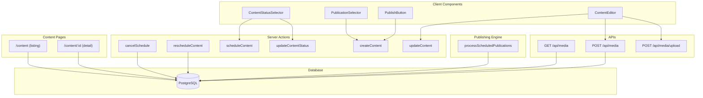
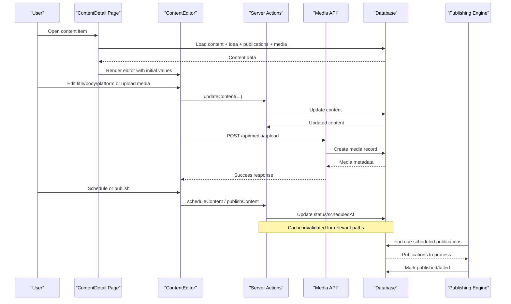
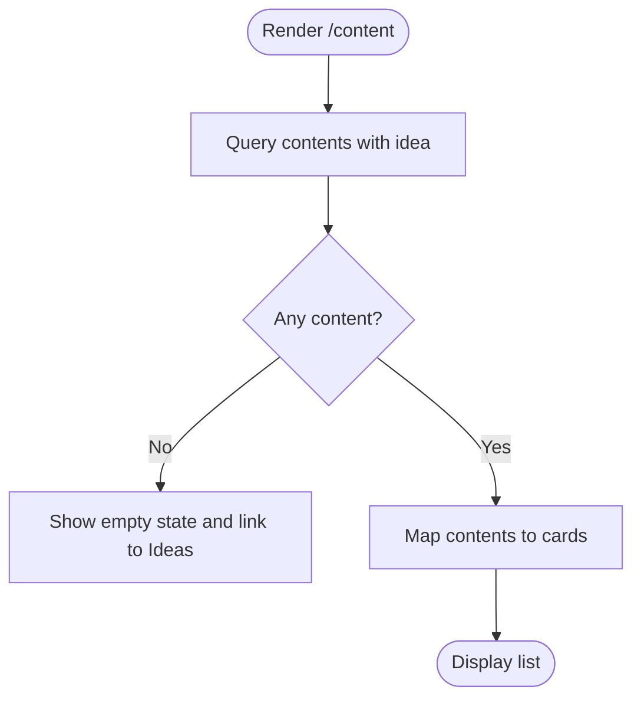
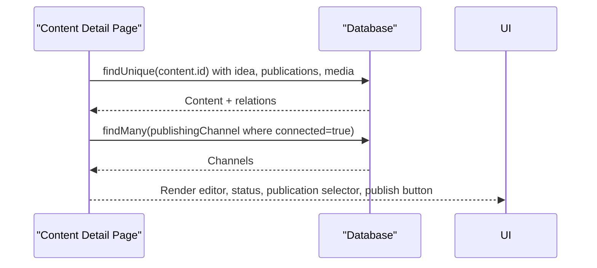
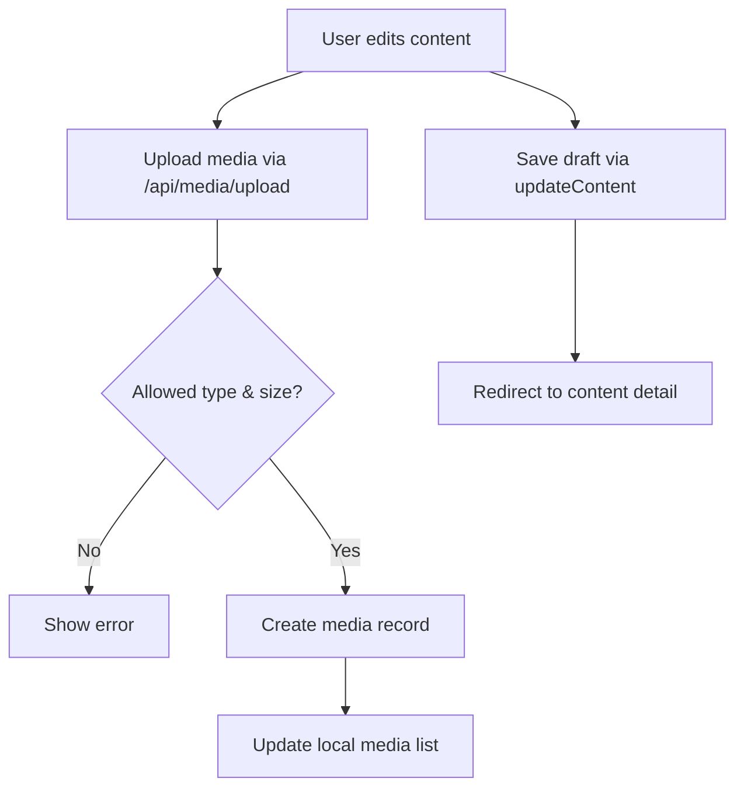
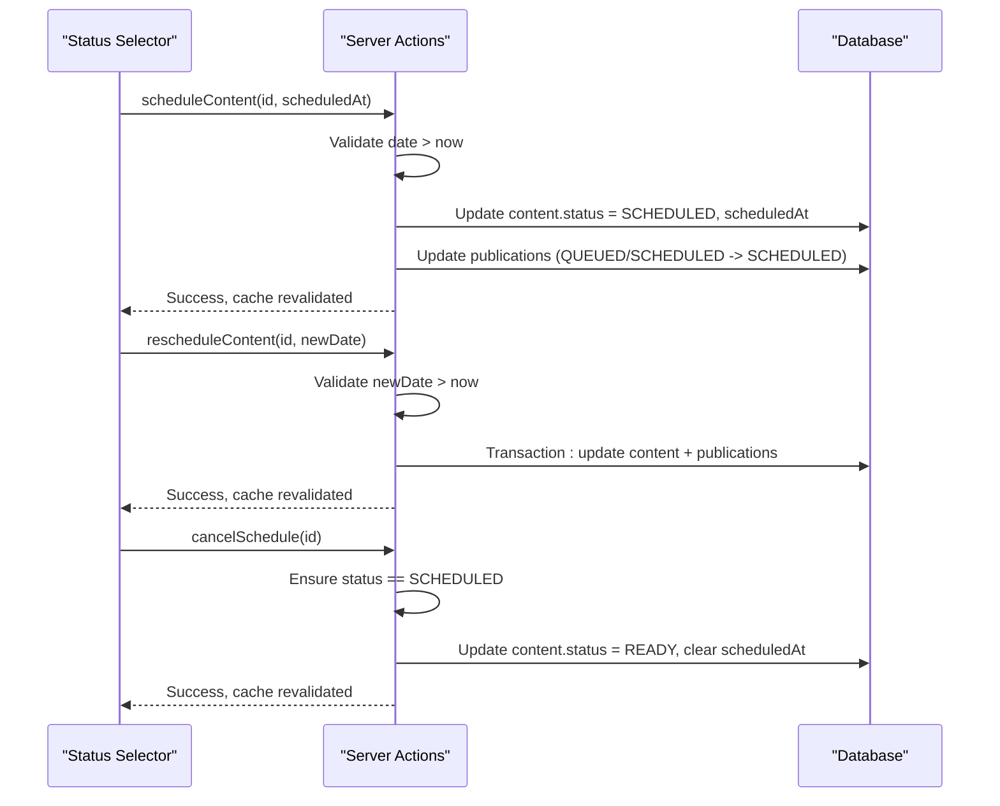
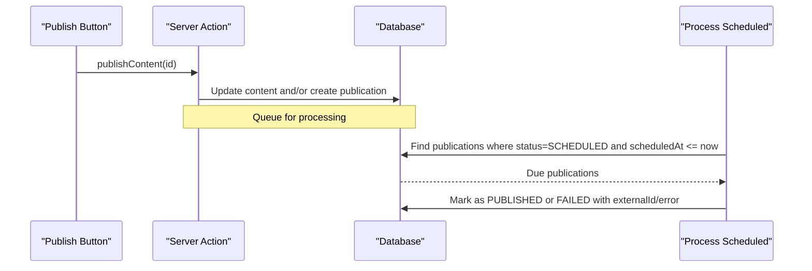
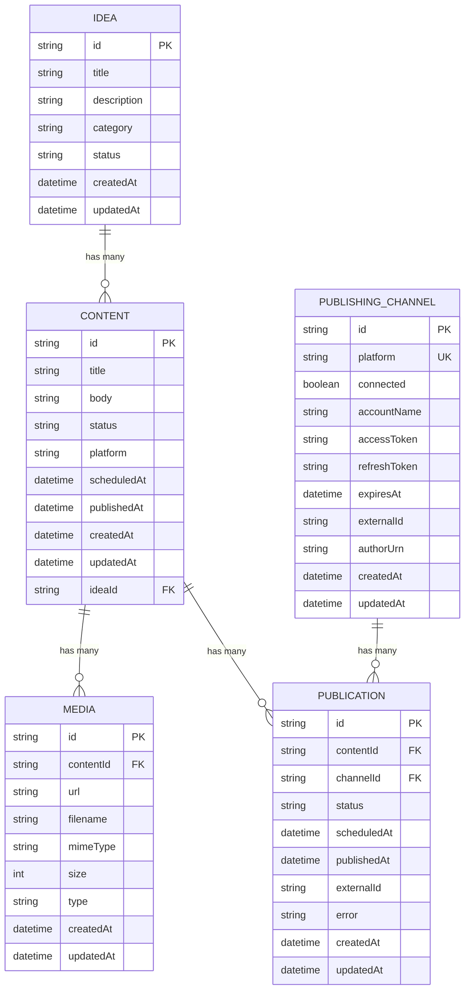
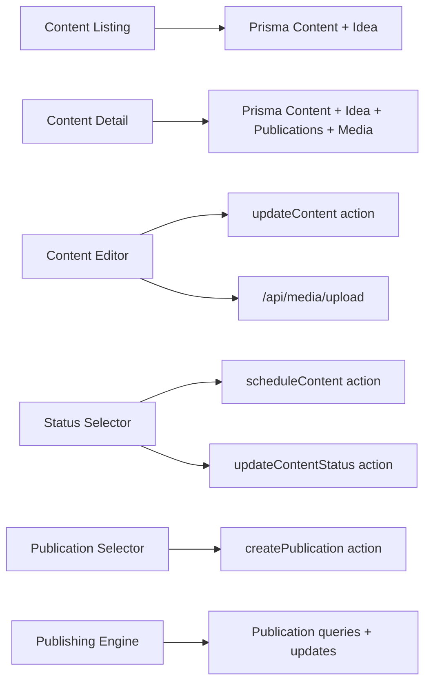

# Content Library Management

<cite>
**Referenced Files in This Document**
- [page.tsx](file://app/content/page.tsx)
- [page.tsx](file://app/content/[id]/page.tsx)
- [content-editor.tsx](file://components/content/content-editor.tsx)
- [content-status-selector.tsx](file://components/content/content-status-selector.tsx)
- [publication-selector.tsx](file://components/content/publication-selector.tsx)
- [publish-button.tsx](file://components/content/publish-button.tsx)
- [cancel-schedule.ts](file://app/content/actions/cancel-schedule.ts)
- [reschedule-content.ts](file://app/content/actions/reschedule-content.ts)
- [schedule-content.ts](file://app/content/actions/schedule-content.ts)
- [update-content-status.ts](file://app/content/actions/update-content-status.ts)
- [create-content.ts](file://app/content/actions/create-content.ts)
- [update-content.ts](file://app/content/actions/update-content.ts)
- [process-scheduled.ts](file://app/publishing/engine/process-scheduled.ts)
- [route.ts](file://app/api/media/route.ts)
- [route.ts](file://app/api/media/upload/route.ts)
- [schema.prisma](file://prisma/schema.prisma)
</cite>

## Table of Contents
1. Introduction
2. Project Structure
3. Core Components
4. Architecture Overview
5. Detailed Component Analysis
6. Dependency Analysis
7. Performance Considerations
8. Troubleshooting Guide
9. Conclusion

## Introduction
This document explains the content library management features, including the main listing page, individual content item pages, scheduling workflows, bulk operations, organization, and performance considerations for large libraries. It also covers content relationships with ideas, media assets, and publications, as well as export and migration strategies.

## Project Structure
The content library is implemented using Next.js App Router server components for data fetching and client components for interactive UI. Server actions handle state mutations (create, update, schedule, publish), while APIs manage media uploads and listings. The publishing engine processes scheduled items asynchronously.

**Diagram sources**
- [page.tsx:6-14](file://app/content/page.tsx#L6-L14)
- [page.tsx:22-49](file://app/content/[id]/page.tsx#L22-L49)
- [content-editor.tsx:148-230](file://components/content/content-editor.tsx#L148-L230)
- [content-status-selector.tsx:44-92](file://components/content/content-status-selector.tsx#L44-L92)
- [publication-selector.tsx:47-60](file://components/content/publication-selector.tsx#L47-L60)
- [publish-button.tsx:30-44](file://components/content/publish-button.tsx#L30-L44)
- [cancel-schedule.ts:6-33](file://app/content/actions/cancel-schedule.ts#L6-L33)
- [reschedule-content.ts:6-59](file://app/content/actions/reschedule-content.ts#L6-L59)
- [schedule-content.ts:6-65](file://app/content/actions/schedule-content.ts#L6-L65)
- [update-content-status.ts:14-57](file://app/content/actions/update-content-status.ts#L14-L57)
- [create-content.ts:12-24](file://app/content/actions/create-content.ts#L12-L24)
- [update-content.ts:13-46](file://app/content/actions/update-content.ts#L13-L46)
- [process-scheduled.ts:4-71](file://app/publishing/engine/process-scheduled.ts#L4-L71)
- [route.ts:4-23](file://app/api/media/route.ts#L4-L23)
- [route.ts:25-79](file://app/api/media/route.ts#L25-L79)
- [route.ts:20-58](file://app/api/media/upload/route.ts#L20-L58)

**Section sources**
- [page.tsx:6-14](file://app/content/page.tsx#L6-L14)
- [page.tsx:22-49](file://app/content/[id]/page.tsx#L22-L49)
- [schema.prisma:10-93](file://prisma/schema.prisma#L10-L93)

## Core Components
- Content listing page: fetches all content with related idea and sorts by last updated.
- Content detail page: loads a single content item with its idea, publications, and media; shows connected channels and status controls.
- Content editor: client component for editing title, body, platform, and managing media attachments; integrates AI assistance.
- Status selector: updates status and schedules content to a future time.
- Publication selector: queues content to connected channels.
- Publish button: publishes content when ready.
- Scheduling server actions: schedule, reschedule, cancel schedule with validation and cache revalidation.
- Publishing engine: periodically processes scheduled publications.

**Section sources**
- [page.tsx:6-14](file://app/content/page.tsx#L6-L14)
- [page.tsx:22-49](file://app/content/[id]/page.tsx#L22-L49)
- [content-editor.tsx:75-157](file://components/content/content-editor.tsx#L75-L157)
- [content-status-selector.tsx:17-92](file://components/content/content-status-selector.tsx#L17-L92)
- [publication-selector.tsx:38-60](file://components/content/publication-selector.tsx#L38-L60)
- [publish-button.tsx:11-44](file://components/content/publish-button.tsx#L11-L44)
- [schedule-content.ts:6-65](file://app/content/actions/schedule-content.ts#L6-L65)
- [reschedule-content.ts:6-59](file://app/content/actions/reschedule-content.ts#L6-L59)
- [cancel-schedule.ts:6-33](file://app/content/actions/cancel-schedule.ts#L6-L33)
- [process-scheduled.ts:4-71](file://app/publishing/engine/process-scheduled.ts#L4-L71)

## Architecture Overview
The system uses server components to load data from PostgreSQL via Prisma, and client components to drive user interactions. Mutations are performed through server actions that validate inputs, enforce business rules, update the database, and invalidate caches. Media is uploaded via API routes and persisted with metadata. A background process picks up scheduled publications and executes them.

**Diagram sources**
- [page.tsx:22-49](file://app/content/[id]/page.tsx#L22-L49)
- [content-editor.tsx:148-230](file://components/content/content-editor.tsx#L148-L230)
- [update-content.ts:13-46](file://app/content/actions/update-content.ts#L13-L46)
- [route.ts:20-58](file://app/api/media/upload/route.ts#L20-L58)
- [schedule-content.ts:6-65](file://app/content/actions/schedule-content.ts#L6-L65)
- [process-scheduled.ts:4-71](file://app/publishing/engine/process-scheduled.ts#L4-L71)

## Detailed Component Analysis

### Main Content Listing Page
- Loads all content sorted by updatedAt descending and includes the related idea for display.
- Renders empty state with navigation to ideas if no content exists.
- Each item links to its detail page.

**Diagram sources**
- [page.tsx:6-14](file://app/content/page.tsx#L6-L14)
- [page.tsx:41-94](file://app/content/page.tsx#L41-L94)

**Section sources**
- [page.tsx:6-14](file://app/content/page.tsx#L6-L14)
- [page.tsx:41-94](file://app/content/page.tsx#L41-L94)

### Individual Content Item Page
- Fetches a single content item with related idea, publications, and media ordered by creation date.
- Retrieves connected publishing channels to present in the publication selector.
- Renders editor, status controls, publication queue, and publish action.

**Diagram sources**
- [page.tsx:22-49](file://app/content/[id]/page.tsx#L22-L49)

**Section sources**
- [page.tsx:22-49](file://app/content/[id]/page.tsx#L22-L49)

### Content Editor and Media Management
- Client-side editor manages title, body, platform, and media attachments.
- Supports drag-and-drop and file picker with type and size validation.
- Uploads files via multipart/form-data to /api/media/upload and stores metadata in the database.
- Provides AI-assisted editing by calling an AI generation endpoint.

**Diagram sources**
- [content-editor.tsx:148-230](file://components/content/content-editor.tsx#L148-L230)
- [update-content.ts:13-46](file://app/content/actions/update-content.ts#L13-L46)
- [route.ts:20-58](file://app/api/media/upload/route.ts#L20-L58)

**Section sources**
- [content-editor.tsx:75-157](file://components/content/content-editor.tsx#L75-L157)
- [content-editor.tsx:165-230](file://components/content/content-editor.tsx#L165-L230)
- [update-content.ts:13-46](file://app/content/actions/update-content.ts#L13-L46)
- [route.ts:20-58](file://app/api/media/upload/route.ts#L20-L58)

### Scheduling Management
- Schedule content: validates future date/time, sets status to SCHEDULED, updates associated publications, and invalidates caches.
- Reschedule content: enforces future date, prevents rescheduling published content, updates both content and related publications within a transaction.
- Cancel schedule: ensures content is currently SCHEDULED, resets status to READY and clears scheduledAt, then invalidates caches.

**Diagram sources**
- [content-status-selector.tsx:44-92](file://components/content/content-status-selector.tsx#L44-L92)
- [schedule-content.ts:6-65](file://app/content/actions/schedule-content.ts#L6-L65)
- [reschedule-content.ts:6-59](file://app/content/actions/reschedule-content.ts#L6-L59)
- [cancel-schedule.ts:6-33](file://app/content/actions/cancel-schedule.ts#L6-L33)

**Section sources**
- [schedule-content.ts:6-65](file://app/content/actions/schedule-content.ts#L6-L65)
- [reschedule-content.ts:6-59](file://app/content/actions/reschedule-content.ts#L6-L59)
- [cancel-schedule.ts:6-33](file://app/content/actions/cancel-schedule.ts#L6-L33)
- [content-status-selector.tsx:44-92](file://components/content/content-status-selector.tsx#L44-L92)

### Publishing Workflow
- Publish button triggers publishing when content status is READY.
- Publishing engine scans for due scheduled publications and processes them, updating statuses and recording errors.

**Diagram sources**
- [publish-button.tsx:30-44](file://components/content/publish-button.tsx#L30-L44)
- [process-scheduled.ts:4-71](file://app/publishing/engine/process-scheduled.ts#L4-L71)

**Section sources**
- [publish-button.tsx:30-44](file://components/content/publish-button.tsx#L30-L44)
- [process-scheduled.ts:4-71](file://app/publishing/engine/process-scheduled.ts#L4-L71)

### Data Model and Relationships
- Idea: parent concept that can spawn multiple contents.
- Content: core entity with title, body, status, platform, timestamps, optional idea reference.
- Media: attached to content with URL, filename, MIME type, size, and type.
- PublishingChannel: represents a connected platform account.
- Publication: maps content to channel with lifecycle status and scheduling fields.

**Diagram sources**
- [schema.prisma:10-93](file://prisma/schema.prisma#L10-L93)

**Section sources**
- [schema.prisma:10-93](file://prisma/schema.prisma#L10-L93)

## Dependency Analysis
- Content listing depends on Prisma Content model and Idea relation.
- Content detail depends on Content, Idea, Publication, Media, and PublishingChannel models.
- Editor depends on updateContent server action and media upload API.
- Status selector depends on scheduleContent and updateContentStatus server actions.
- Publication selector depends on createPublication server action.
- Publishing engine depends on Publication model and publish logic.

**Diagram sources**
- [page.tsx:6-14](file://app/content/page.tsx#L6-L14)
- [page.tsx:22-49](file://app/content/[id]/page.tsx#L22-L49)
- [content-editor.tsx:148-230](file://components/content/content-editor.tsx#L148-L230)
- [content-status-selector.tsx:44-92](file://components/content/content-status-selector.tsx#L44-L92)
- [publication-selector.tsx:47-60](file://components/content/publication-selector.tsx#L47-L60)
- [process-scheduled.ts:4-71](file://app/publishing/engine/process-scheduled.ts#L4-L71)

**Section sources**
- [page.tsx:6-14](file://app/content/page.tsx#L6-L14)
- [page.tsx:22-49](file://app/content/[id]/page.tsx#L22-L49)
- [content-editor.tsx:148-230](file://components/content/content-editor.tsx#L148-L230)
- [content-status-selector.tsx:44-92](file://components/content/content-status-selector.tsx#L44-L92)
- [publication-selector.tsx:47-60](file://components/content/publication-selector.tsx#L47-L60)
- [process-scheduled.ts:4-71](file://app/publishing/engine/process-scheduled.ts#L4-L71)

## Performance Considerations
- Pagination strategy for large libraries:
  - Implement cursor-based pagination in the listing query using take and skip or cursor keys to avoid deep offsets.
  - Add indexes on frequently filtered fields such as status, platform, and scheduledAt.
- Query optimization:
  - Select only needed fields in listing to reduce payload size.
  - Use include judiciously; consider lazy-loading details like media on demand.
- Caching:
  - Leverage Next.js revalidatePath after mutations to keep UI consistent without full reloads.
  - Consider route-level caching with revalidateTime for read-heavy endpoints if appropriate.
- Media handling:
  - Enforce file size limits and allowed types at the client and server to prevent heavy uploads.
  - Store media metadata in the database and serve URLs efficiently; consider CDN integration for large assets.
- Background processing:
  - Batch process scheduled publications in small chunks to avoid long-running transactions.
  - Log errors and retry failed publications with backoff.

[No sources needed since this section provides general guidance]

## Troubleshooting Guide
- Validation errors:
  - Invalid or past dates will be rejected by schedule and reschedule actions.
  - Published content cannot be edited or rescheduled.
- State guards:
  - Only SCHEDULED content can be canceled.
  - Status changes require valid transitions and may require a scheduled date/time for SCHEDULED.
- Media issues:
  - Unsupported file types or oversized files are rejected by the upload API.
  - Deletion requires confirmation and proper authorization checks.
- Publishing failures:
  - Check publication status and error fields for failure reasons.
  - Review logs in the publishing engine for detailed errors during processing.

**Section sources**
- [schedule-content.ts:10-33](file://app/content/actions/schedule-content.ts#L10-L33)
- [reschedule-content.ts:10-30](file://app/content/actions/reschedule-content.ts#L10-L30)
- [cancel-schedule.ts:11-17](file://app/content/actions/cancel-schedule.ts#L11-L17)
- [update-content-status.ts:18-38](file://app/content/actions/update-content-status.ts#L18-L38)
- [route.ts:20-58](file://app/api/media/upload/route.ts#L20-L58)
- [process-scheduled.ts:35-65](file://app/publishing/engine/process-scheduled.ts#L35-L65)

## Conclusion
The content library provides a robust workflow for creating, organizing, scheduling, and publishing content across platforms. It leverages server components for efficient data loading, server actions for safe mutations, and a background engine for reliable publishing. For scaling to large libraries, adopt pagination, selective field projection, indexing, and caching strategies. Media handling is secured with validation and size limits, and relationships with ideas, media, and publications are modeled clearly for extensibility.

[No sources needed since this section summarizes without analyzing specific files]