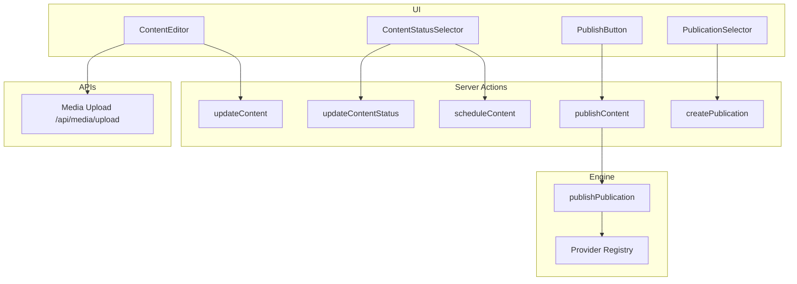
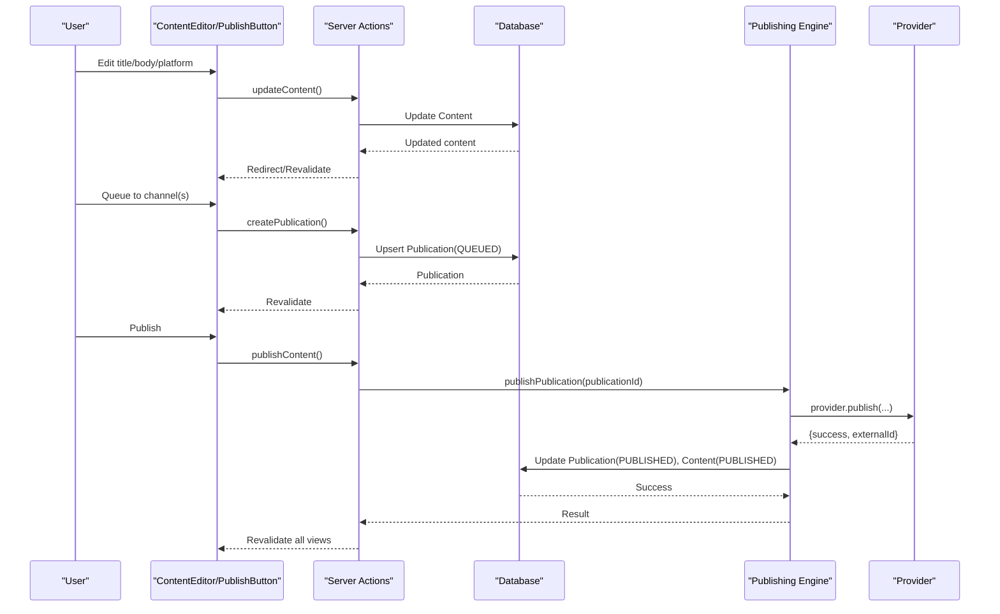
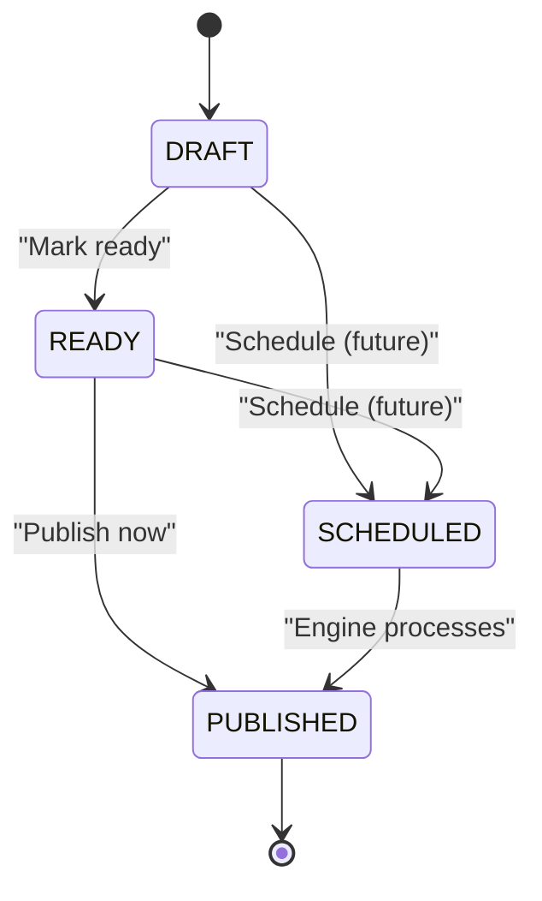
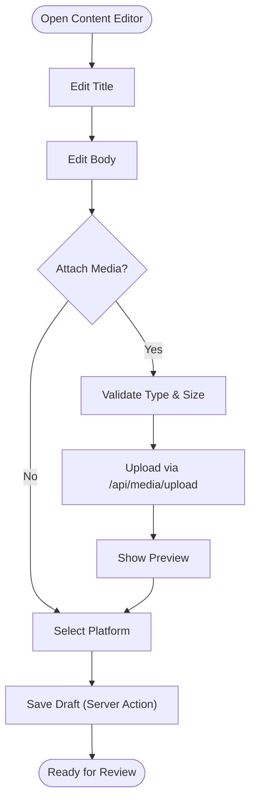
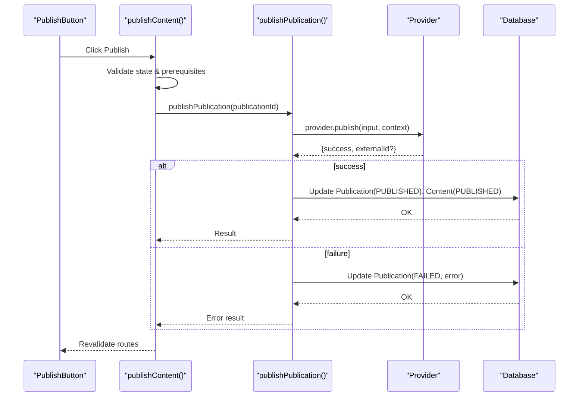
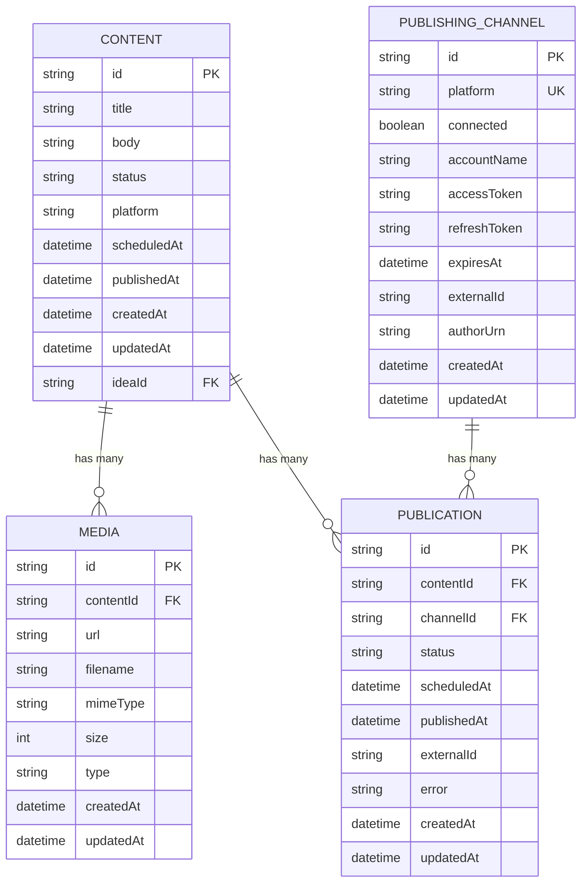
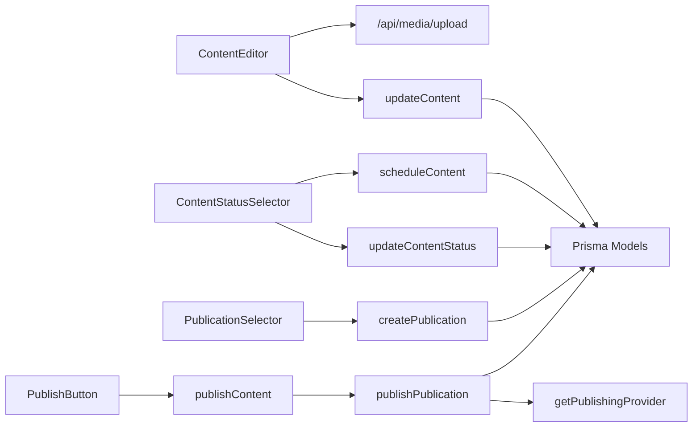

# Content Management System

<cite>
**Referenced Files in This Document**
- [schema.prisma](file://prisma/schema.prisma)
- [content page](file://app/content/page.tsx)
- [content detail page](file://app/content/[id]/page.tsx)
- [content editor component](file://components/content/content-editor.tsx)
- [publish button component](file://components/content/publish-button.tsx)
- [status selector component](file://components/content/content-status-selector.tsx)
- [publication selector component](file://components/content/publication-selector.tsx)
- [create content action](file://app/content/actions/create-content.ts)
- [update content action](file://app/content/actions/update-content.ts)
- [update content status action](file://app/content/actions/update-content-status.ts)
- [schedule content action](file://app/content/actions/schedule-content.ts)
- [publish content action](file://app/content/actions/publish-content.ts)
- [create publication action](file://app/content/actions/create-publication.ts)
- [media upload API](file://app/api/media/upload/route.ts)
- [publish engine](file://app/publishing/engine/publish.ts)
- [provider registry](file://app/publishing/engine/providers/index.ts)
- [simulated provider](file://app/publishing/engine/providers/simulated.ts)
</cite>

## Table of Contents
1. [Introduction](#introduction)
2. [Project Structure](#project-structure)
3. [Core Components](#core-components)
4. [Architecture Overview](#architecture-overview)
5. [Detailed Component Analysis](#detailed-component-analysis)
6. [Dependency Analysis](#dependency-analysis)
7. [Performance Considerations](#performance-considerations)
8. [Troubleshooting Guide](#troubleshooting-guide)
9. [Conclusion](#conclusion)
10. [Appendices](#appendices)

## Introduction
This document explains the Content Management System (CMS) feature end-to-end: how content is created, edited, scheduled, and published; how media attachments are handled; how platform targeting works; and how the publishing engine integrates with channels. It also covers status transitions, bulk operations, filtering, versioning considerations, collaboration notes, and performance optimizations for large libraries.

## Project Structure
The CMS spans server components, client components, server actions, APIs, and a publishing engine:
- Data model defines Content, Media, PublishingChannel, and Publication entities.
- Server pages list and display content and render the editor with related data.
- Client components provide editing, scheduling, publishing, and channel selection UI.
- Server actions implement CRUD and status transitions with validation and caching revalidation.
- The media API handles uploads and persists metadata to the database.
- The publishing engine orchestrates provider-specific publishing and updates statuses atomically.

**Diagram sources**
- [content editor component:148-157](file://components/content/content-editor.tsx#L148-L157)
- [media upload API:20-126](file://app/api/media/upload/route.ts#L20-L126)
- [status selector component:44-92](file://components/content/content-status-selector.tsx#L44-L92)
- [publication selector component:47-61](file://components/content/publication-selector.tsx#L47-L61)
- [publish button component:30-44](file://components/content/publish-button.tsx#L30-L44)
- [update content action:13-46](file://app/content/actions/update-content.ts#L13-L46)
- [update content status action:14-57](file://app/content/actions/update-content-status.ts#L14-L57)
- [schedule content action:6-66](file://app/content/actions/schedule-content.ts#L6-L66)
- [publish content action:7-70](file://app/content/actions/publish-content.ts#L7-L70)
- [create publication action:6-69](file://app/content/actions/create-publication.ts#L6-L69)
- [publish engine:4-116](file://app/publishing/engine/publish.ts#L4-L116)
- [provider registry:5-21](file://app/publishing/engine/providers/index.ts#L5-L21)

**Section sources**
- [schema.prisma:21-93](file://prisma/schema.prisma#L21-L93)
- [content page:6-14](file://app/content/page.tsx#L6-L14)
- [content detail page:22-49](file://app/content/[id]/page.tsx#L22-L49)

## Core Components
- Content Editor: Title, body, platform selection, AI-assisted improvements, and media attachment via drag-and-drop or file picker. Saves drafts through a server action.
- Status Selector: Switches between Draft and Ready, and schedules content by setting a future date/time. Validates inputs and updates status atomically.
- Publication Selector: Queues content to connected channels. Prevents duplicate queued entries and shows current status per channel.
- Publish Button: Triggers immediate publish when content is Ready and has at least one queued publication. Enforces title/body presence.
- Media Upload API: Accepts multipart/form-data, validates type and size, writes files to disk, and stores metadata in the database.
- Publishing Engine: Loads publication details, resolves provider, publishes, and updates both publication and content statuses within a transaction.

**Section sources**
- [content editor component:75-157](file://components/content/content-editor.tsx#L75-L157)
- [status selector component:17-92](file://components/content/content-status-selector.tsx#L17-L92)
- [publication selector component:38-61](file://components/content/publication-selector.tsx#L38-L61)
- [publish button component:11-44](file://components/content/publish-button.tsx#L11-L44)
- [media upload API:20-126](file://app/api/media/upload/route.ts#L20-L126)
- [publish engine:4-116](file://app/publishing/engine/publish.ts#L4-L116)

## Architecture Overview
The CMS follows a layered architecture:
- Presentation layer: Next.js server components render lists and detail pages; client components handle interactivity.
- Action layer: Server actions enforce business rules, validate inputs, and mutate data.
- API layer: File upload endpoint persists media and returns metadata.
- Engine layer: Provider-agnostic publishing orchestration with pluggable providers.

**Diagram sources**
- [content editor component:148-157](file://components/content/content-editor.tsx#L148-L157)
- [update content action:13-46](file://app/content/actions/update-content.ts#L13-L46)
- [create publication action:6-69](file://app/content/actions/create-publication.ts#L6-L69)
- [publish content action:7-70](file://app/content/actions/publish-content.ts#L7-L70)
- [publish engine:4-116](file://app/publishing/engine/publish.ts#L4-L116)
- [provider registry:5-21](file://app/publishing/engine/providers/index.ts#L5-L21)

## Detailed Component Analysis

### Content Lifecycle and Status Transitions
- States: DRAFT, READY, SCHEDULED, PUBLISHED.
- Creation: New content starts as DRAFT.
- Editing: Only non-PUBLISHED content can be edited.
- Readiness: Move from DRAFT to READY to enable publishing.
- Scheduling: Set a future date/time to transition to SCHEDULED; associated publications are also set to SCHEDULED.
- Publishing: From READY with at least one QUEUED/SCHEDULED publication, trigger publish to mark content and publication as PUBLISHED.

**Diagram sources**
- [update content status action:6-57](file://app/content/actions/update-content-status.ts#L6-L57)
- [schedule content action:6-66](file://app/content/actions/schedule-content.ts#L6-L66)
- [publish content action:7-70](file://app/content/actions/publish-content.ts#L7-L70)
- [publish engine:4-116](file://app/publishing/engine/publish.ts#L4-L116)

**Section sources**
- [schema.prisma:21-37](file://prisma/schema.prisma#L21-L37)
- [update content status action:14-57](file://app/content/actions/update-content-status.ts#L14-L57)
- [schedule content action:6-66](file://app/content/actions/schedule-content.ts#L6-L66)
- [publish content action:7-70](file://app/content/actions/publish-content.ts#L7-L70)

### Content Editor Interface
- Rich text editing: A large textarea supports long-form content with character count feedback.
- Platform targeting: Select a target platform to tailor AI suggestions and publishing context.
- Media attachment: Drag-and-drop or file picker; validates allowed types and size; uploads via API; displays previews and allows deletion.
- AI assistance: Calls an AI generation endpoint to improve, rewrite, shorten, expand, fix grammar, or make engaging.

**Diagram sources**
- [content editor component:165-230](file://components/content/content-editor.tsx#L165-L230)
- [media upload API:20-126](file://app/api/media/upload/route.ts#L20-L126)
- [content editor component:99-146](file://components/content/content-editor.tsx#L99-L146)

**Section sources**
- [content editor component:75-596](file://components/content/content-editor.tsx#L75-L596)
- [media upload API:20-126](file://app/api/media/upload/route.ts#L20-L126)

### Publishing Button and Engine Integration
- Validation: Requires content to be READY, have a title and body, and at least one queued publication.
- Orchestration: Delegates to the publishing engine which selects the correct provider based on channel platform.
- Atomic updates: On success, sets publication and content to PUBLISHED and clears scheduledAt; on failure, marks publication as FAILED with error.

**Diagram sources**
- [publish button component:30-44](file://components/content/publish-button.tsx#L30-L44)
- [publish content action:7-70](file://app/content/actions/publish-content.ts#L7-L70)
- [publish engine:4-116](file://app/publishing/engine/publish.ts#L4-L116)
- [provider registry:5-21](file://app/publishing/engine/providers/index.ts#L5-L21)

**Section sources**
- [publish content action:7-70](file://app/content/actions/publish-content.ts#L7-L70)
- [publish engine:4-116](file://app/publishing/engine/publish.ts#L4-L116)

### Content Status Management, Bulk Operations, and Filtering
- Status management: Use the status selector to move between DRAFT and READY; schedule to SCHEDULED with a future date/time.
- Bulk operations: Not implemented in this codebase; could be added by extending server actions to accept arrays of IDs and iterating updates.
- Filtering: The content list currently fetches all content ordered by updatedAt; filtering by status/platform would require adding query parameters and server-side filters.

**Section sources**
- [status selector component:44-92](file://components/content/content-status-selector.tsx#L44-L92)
- [content page:6-14](file://app/content/page.tsx#L6-L14)

### Content Data Structures
- Content: id, title, body, status, platform, scheduledAt, publishedAt, timestamps, optional ideaId, relations to publications and media.
- Media: id, contentId, url, filename, mimeType, size, type, timestamps.
- PublishingChannel: id, platform (unique), connected flag, accountName, tokens, expiration, external identifiers, timestamps.
- Publication: id, contentId, channelId, status, scheduledAt, publishedAt, externalId, error, timestamps; unique constraint on contentId+channelId.

**Diagram sources**
- [schema.prisma:10-93](file://prisma/schema.prisma#L10-L93)

**Section sources**
- [schema.prisma:21-93](file://prisma/schema.prisma#L21-L93)

### API Endpoints and Client Interactions
- POST /api/media/upload: Accepts multipart form with file and contentId; validates type and size; writes file; creates Media record; returns media metadata.
- Client interactions:
  - ContentEditor calls updateContent server action to save edits.
  - PublicationSelector calls createPublication to queue content to channels.
  - PublishButton calls publishContent to start publishing.
  - StatusSelector calls updateContentStatus and scheduleContent.

**Section sources**
- [media upload API:20-126](file://app/api/media/upload/route.ts#L20-L126)
- [content editor component:148-157](file://components/content/content-editor.tsx#L148-L157)
- [publication selector component:47-61](file://components/content/publication-selector.tsx#L47-L61)
- [publish button component:30-44](file://components/content/publish-button.tsx#L30-L44)
- [status selector component:44-92](file://components/content/content-status-selector.tsx#L44-L92)

### Versioning and Collaboration
- Versioning: Not explicitly implemented; each update overwrites previous content. To add versioning, introduce a ContentVersion entity linked to Content and persist snapshots on key changes.
- Collaboration: No built-in locking or concurrency controls. For multi-user editing, consider optimistic concurrency with version fields or row-level locks during edits.

[No sources needed since this section provides conceptual guidance]

## Dependency Analysis
- Client components depend on server actions for mutations and on APIs for media.
- Server actions depend on Prisma models and revalidate paths to keep UI consistent.
- Publishing engine depends on provider registry to resolve platform-specific implementations.
- Database constraints ensure integrity (e.g., unique contentId+channelId).

**Diagram sources**
- [content editor component:148-157](file://components/content/content-editor.tsx#L148-L157)
- [media upload API:20-126](file://app/api/media/upload/route.ts#L20-L126)
- [update content action:13-46](file://app/content/actions/update-content.ts#L13-L46)
- [update content status action:14-57](file://app/content/actions/update-content-status.ts#L14-L57)
- [schedule content action:6-66](file://app/content/actions/schedule-content.ts#L6-L66)
- [create publication action:6-69](file://app/content/actions/create-publication.ts#L6-L69)
- [publish content action:7-70](file://app/content/actions/publish-content.ts#L7-L70)
- [publish engine:4-116](file://app/publishing/engine/publish.ts#L4-L116)
- [provider registry:5-21](file://app/publishing/engine/providers/index.ts#L5-L21)

**Section sources**
- [schema.prisma:21-93](file://prisma/schema.prisma#L21-L93)
- [provider registry:5-21](file://app/publishing/engine/providers/index.ts#L5-L21)

## Performance Considerations
- Pagination and filtering: Add server-side pagination and filters to the content list to handle large libraries efficiently.
- Eager loading: Keep includes minimal; load only necessary relations per view.
- Media handling: Offload storage to object storage (e.g., cloud CDN) and store URLs in the database to reduce server I/O.
- Caching: Leverage Next.js revalidation strategically; consider longer cache times for read-heavy endpoints.
- Transactions: Use transactions for multi-table updates (already used in scheduling and publishing).
- Indexes: Ensure indexes on frequently queried fields like status, scheduledAt, and contentId.

[No sources needed since this section provides general guidance]

## Troubleshooting Guide
- Cannot edit published content: Update action enforces that PUBLISHED content cannot be edited.
- Invalid schedule date: Schedule action rejects past dates and invalid formats.
- Missing required fields: Publish action requires title, body, and at least one queued publication.
- Channel not connected: Publishing engine checks channel.connected before invoking provider.
- Unsupported media type or size: Upload API rejects unsupported types and oversized files.
- Provider not configured: Provider registry throws if no provider exists for the platform.

**Section sources**
- [update content action:30-32](file://app/content/actions/update-content.ts#L30-L32)
- [schedule content action:10-18](file://app/content/actions/schedule-content.ts#L10-L18)
- [publish content action:29-41](file://app/content/actions/publish-content.ts#L29-L41)
- [publish engine:40-44](file://app/publishing/engine/publish.ts#L40-L44)
- [media upload API:53-65](file://app/api/media/upload/route.ts#L53-L65)
- [provider registry:13-17](file://app/publishing/engine/providers/index.ts#L13-L17)

## Conclusion
The CMS provides a robust workflow for creating, editing, scheduling, and publishing content across platforms. It enforces clear status transitions, validates inputs, and integrates with a pluggable publishing engine. Future enhancements include versioning, collaboration features, advanced filtering/bulk operations, and scalable media storage.

[No sources needed since this section summarizes without analyzing specific files]

## Appendices

### Example Data Structures
- Content: id, title, body, status, platform, scheduledAt, publishedAt, createdAt, updatedAt, ideaId, relations to publications and media.
- Media: id, contentId, url, filename, mimeType, size, type, createdAt, updatedAt.
- PublishingChannel: id, platform, connected, accountName, tokens, expiresAt, externalId, authorUrn, createdAt, updatedAt.
- Publication: id, contentId, channelId, status, scheduledAt, publishedAt, externalId, error, createdAt, updatedAt.

**Section sources**
- [schema.prisma:21-93](file://prisma/schema.prisma#L21-L93)

### Example API Endpoints
- POST /api/media/upload: Multipart form with file and contentId; validates type and size; persists file and metadata; returns media object.

**Section sources**
- [media upload API:20-126](file://app/api/media/upload/route.ts#L20-L126)

### Client-Side Interactions Summary
- Save draft: ContentEditor triggers updateContent server action.
- Queue to channels: PublicationSelector triggers createPublication server action.
- Schedule: ContentStatusSelector triggers scheduleContent server action with validated future date/time.
- Publish: PublishButton triggers publishContent server action, which delegates to the publishing engine.

**Section sources**
- [content editor component:148-157](file://components/content/content-editor.tsx#L148-L157)
- [publication selector component:47-61](file://components/content/publication-selector.tsx#L47-L61)
- [status selector component:60-92](file://components/content/content-status-selector.tsx#L60-L92)
- [publish button component:30-44](file://components/content/publish-button.tsx#L30-L44)
- [publish content action:7-70](file://app/content/actions/publish-content.ts#L7-L70)