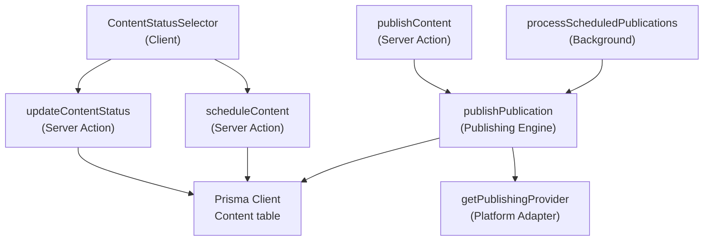
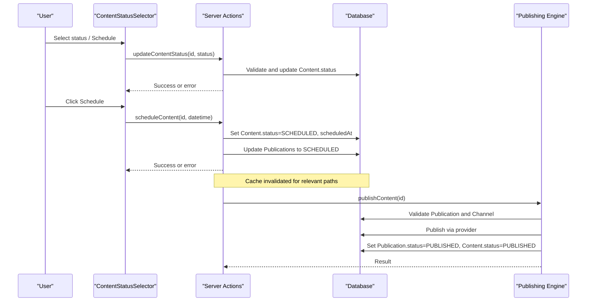
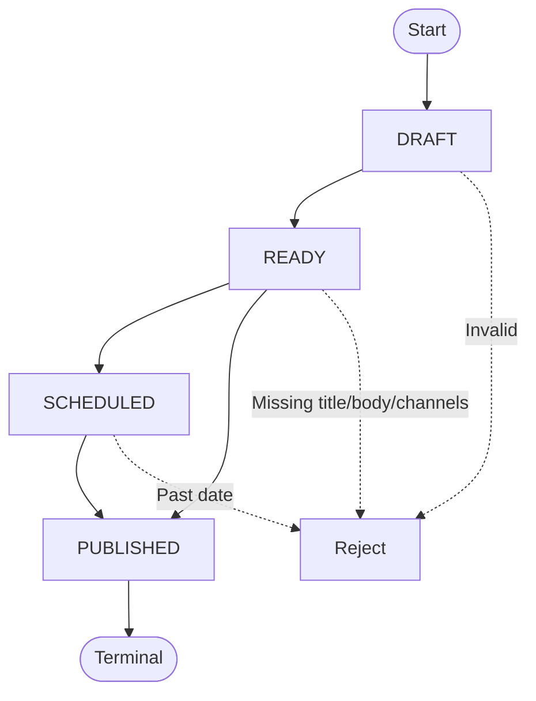
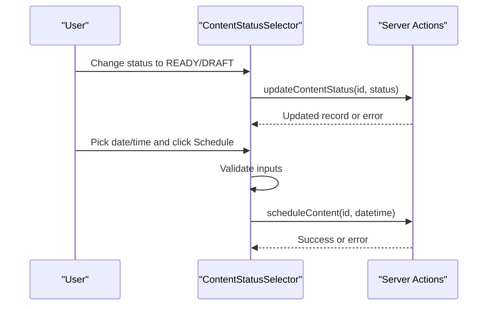
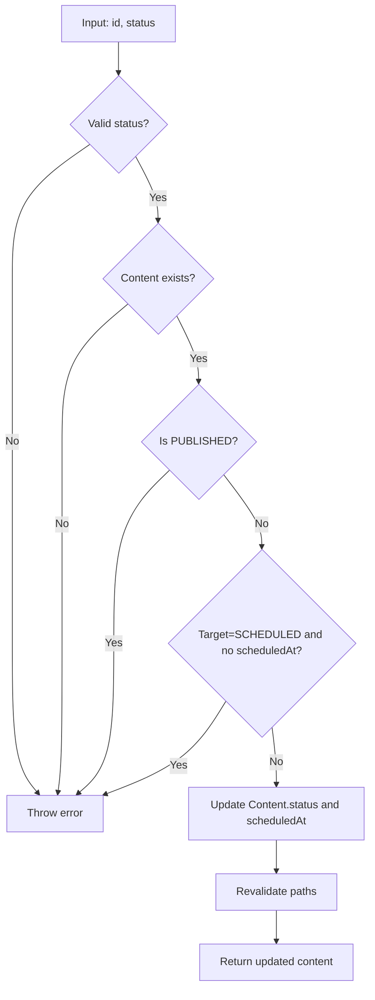
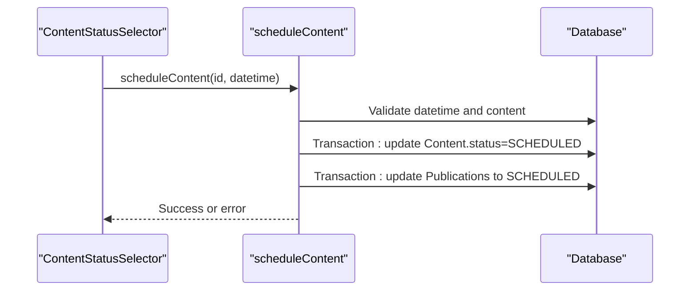
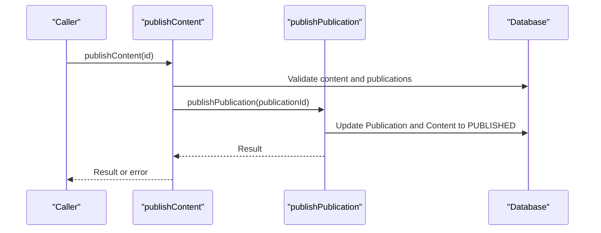
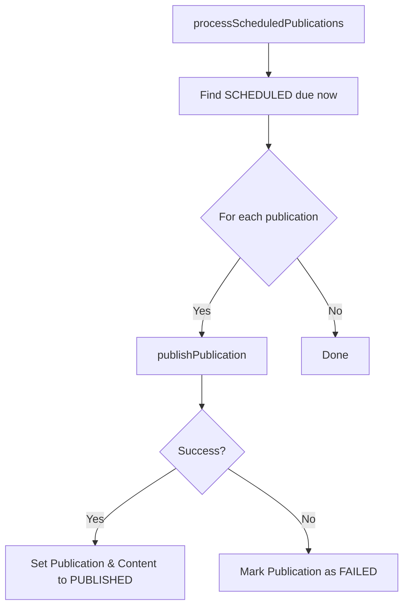
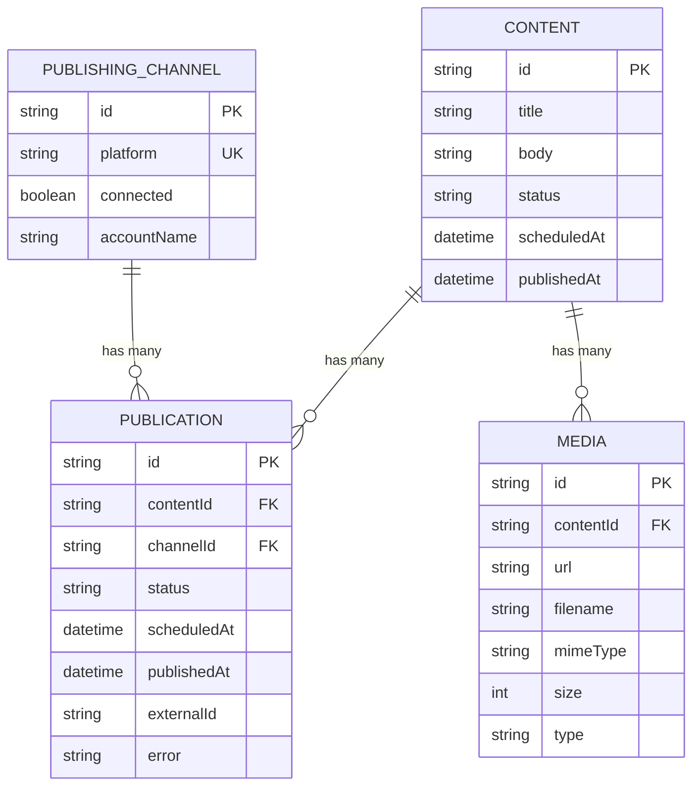
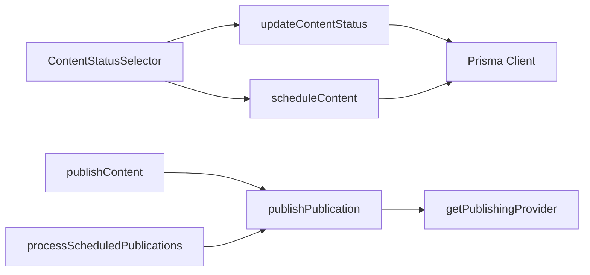

# Content Status Management

<cite>
**Referenced Files in This Document**
- [update-content-status.ts](file://app/content/actions/update-content-status.ts)
- [content-status-selector.tsx](file://components/content/content-status-selector.tsx)
- [schedule-content.ts](file://app/content/actions/schedule-content.ts)
- [publish-content.ts](file://app/content/actions/publish-content.ts)
- [schema.prisma](file://prisma/schema.prisma)
- [publish.ts](file://app/publishing/engine/publish.ts)
- [process-scheduled.ts](file://app/publishing/engine/process-scheduled.ts)
- [index.ts](file://app/publishing/engine/providers/index.ts)
- [page.tsx (Content)](file://app/content/page.tsx)
- [page.tsx (Analytics)](file://app/analytics/page.tsx)
</cite>

## Table of Contents
1. [Introduction](#introduction)
2. [Project Structure](#project-structure)
3. [Core Components](#core-components)
4. [Architecture Overview](#architecture-overview)
5. [Detailed Component Analysis](#detailed-component-analysis)
6. [Dependency Analysis](#dependency-analysis)
7. [Performance Considerations](#performance-considerations)
8. [Troubleshooting Guide](#troubleshooting-guide)
9. [Conclusion](#conclusion)
10. [Appendices](#appendices)

## Introduction
This document explains the content status management system, focusing on how content moves through states such as Draft, Ready, Scheduled, and Published. It covers the user interface component for selecting status, server actions that enforce validation and business rules, and the publishing engine that executes scheduled or immediate publishing. It also describes how status changes affect caching, reporting, and analytics views.

## Project Structure
The status management spans UI components, server actions, and a publishing engine:
- UI: A client-side selector to change status and schedule content.
- Server Actions: Enforce validation, update database records, and invalidate caches.
- Publishing Engine: Processes queued or scheduled publications and updates both publication and content records.
- Data Model: Prisma schema defines content statuses and related entities.

**Diagram sources**
- [content-status-selector.tsx:1-184](file://components/content/content-status-selector.tsx#L1-L184)
- [update-content-status.ts:1-58](file://app/content/actions/update-content-status.ts#L1-L58)
- [schedule-content.ts:1-66](file://app/content/actions/schedule-content.ts#L1-L66)
- [publish-content.ts:1-70](file://app/content/actions/publish-content.ts#L1-L70)
- [publish.ts:1-116](file://app/publishing/engine/publish.ts#L1-L116)
- [process-scheduled.ts:1-72](file://app/publishing/engine/process-scheduled.ts#L1-L72)
- [index.ts:1-20](file://app/publishing/engine/providers/index.ts#L1-L20)
- [schema.prisma:21-37](file://prisma/schema.prisma#L21-L37)

**Section sources**
- [schema.prisma:21-37](file://prisma/schema.prisma#L21-L37)
- [content-status-selector.tsx:1-184](file://components/content/content-status-selector.tsx#L1-L184)
- [update-content-status.ts:1-58](file://app/content/actions/update-content-status.ts#L1-L58)
- [schedule-content.ts:1-66](file://app/content/actions/schedule-content.ts#L1-L66)
- [publish-content.ts:1-70](file://app/content/actions/publish-content.ts#L1-L70)
- [publish.ts:1-116](file://app/publishing/engine/publish.ts#L1-L116)
- [process-scheduled.ts:1-72](file://app/publishing/engine/process-scheduled.ts#L1-L72)
- [index.ts:1-20](file://app/publishing/engine/providers/index.ts#L1-L20)

## Core Components
- ContentStatusSelector: A client component that lets users switch between Draft and Ready, and schedule content for future publication. It handles local validation and calls server actions.
- updateContentStatus: A server action that validates allowed statuses, enforces business rules (e.g., published content cannot be changed), and updates the content record with cache invalidation.
- scheduleContent: A server action that sets content and related publications to Scheduled with a future time, using a transaction to keep data consistent.
- publishContent: A server action that validates readiness and publishes immediately via the publishing engine.
- Publishing Engine: Orchestrates provider-specific publishing, updates publication and content records atomically, and handles failures.

**Section sources**
- [content-status-selector.tsx:1-184](file://components/content/content-status-selector.tsx#L1-L184)
- [update-content-status.ts:1-58](file://app/content/actions/update-content-status.ts#L1-L58)
- [schedule-content.ts:1-66](file://app/content/actions/schedule-content.ts#L1-L66)
- [publish-content.ts:1-70](file://app/content/actions/publish-content.ts#L1-L70)
- [publish.ts:1-116](file://app/publishing/engine/publish.ts#L1-L116)

## Architecture Overview
The system separates concerns across layers:
- UI layer: Captures user intent (status change, scheduling).
- Server actions: Validate inputs, enforce business rules, persist state, and refresh caches.
- Publishing engine: Executes platform-specific publishing and updates both publication and content records.
- Background scheduler: Picks due scheduled publications and triggers publishing.

**Diagram sources**
- [content-status-selector.tsx:1-184](file://components/content/content-status-selector.tsx#L1-L184)
- [update-content-status.ts:1-58](file://app/content/actions/update-content-status.ts#L1-L58)
- [schedule-content.ts:1-66](file://app/content/actions/schedule-content.ts#L1-L66)
- [publish-content.ts:1-70](file://app/content/actions/publish-content.ts#L1-L70)
- [publish.ts:1-116](file://app/publishing/engine/publish.ts#L1-L116)

## Detailed Component Analysis

### Status Lifecycle and Transitions
- States: DRAFT, READY, SCHEDULED, PUBLISHED.
- Allowed transitions enforced by server actions:
  - DRAFT ↔ READY: Directly via updateContentStatus.
  - READY → SCHEDULED: Via scheduleContent with a future date; also clears previous schedule when switching away from SCHEDULED.
  - READY → PUBLISHED: Via publishContent if validations pass.
  - SCHEDULED → PUBLISHED: Automatically when processScheduledPublications runs and publishPublication succeeds.
  - PUBLISHED is terminal for manual edits; server actions reject further status changes.

**Diagram sources**
- [update-content-status.ts:1-58](file://app/content/actions/update-content-status.ts#L1-L58)
- [schedule-content.ts:1-66](file://app/content/actions/schedule-content.ts#L1-L66)
- [publish-content.ts:1-70](file://app/content/actions/publish-content.ts#L1-L70)
- [publish.ts:1-116](file://app/publishing/engine/publish.ts#L1-L116)

**Section sources**
- [update-content-status.ts:1-58](file://app/content/actions/update-content-status.ts#L1-L58)
- [schedule-content.ts:1-66](file://app/content/actions/schedule-content.ts#L1-L66)
- [publish-content.ts:1-70](file://app/content/actions/publish-content.ts#L1-L70)
- [publish.ts:1-116](file://app/publishing/engine/publish.ts#L1-L116)

### ContentStatusSelector Component
- Presents a dropdown for DRAFT and READY.
- Renders a read-only “Published” view when content is already published.
- Provides date/time inputs to schedule content; performs client-side validation (future time, valid date).
- Calls updateContentStatus for direct status changes and scheduleContent for scheduling.
- Displays errors returned from server actions.

**Diagram sources**
- [content-status-selector.tsx:1-184](file://components/content/content-status-selector.tsx#L1-L184)
- [update-content-status.ts:1-58](file://app/content/actions/update-content-status.ts#L1-L58)
- [schedule-content.ts:1-66](file://app/content/actions/schedule-content.ts#L1-L66)

**Section sources**
- [content-status-selector.tsx:1-184](file://components/content/content-status-selector.tsx#L1-L184)

### Server Action: updateContentStatus
- Validates target status against an allowlist.
- Ensures content exists and is not already published.
- Prevents setting SCHEDULED without a scheduledAt value.
- Updates content status and clears scheduledAt unless moving to SCHEDULED.
- Invalidates caches for multiple routes to reflect new state.

**Diagram sources**
- [update-content-status.ts:1-58](file://app/content/actions/update-content-status.ts#L1-L58)

**Section sources**
- [update-content-status.ts:1-58](file://app/content/actions/update-content-status.ts#L1-L58)

### Server Action: scheduleContent
- Validates the scheduled date is in the future.
- Ensures content exists and is not already published.
- Uses a transaction to:
  - Set content status to SCHEDULED and set scheduledAt.
  - Update all related publications (QUEUED or SCHEDULED) to SCHEDULED with the same time.
- Invalidates caches for content, calendar, analytics, and publishing pages.

**Diagram sources**
- [schedule-content.ts:1-66](file://app/content/actions/schedule-content.ts#L1-L66)

**Section sources**
- [schedule-content.ts:1-66](file://app/content/actions/schedule-content.ts#L1-L66)

### Server Action: publishContent
- Validates content exists, is READY, has title and body, and has at least one active publication (QUEUED or SCHEDULED).
- Delegates to the publishing engine to perform the actual publish.
- On success, returns result; on failure, throws an error with details.

**Diagram sources**
- [publish-content.ts:1-70](file://app/content/actions/publish-content.ts#L1-L70)
- [publish.ts:1-116](file://app/publishing/engine/publish.ts#L1-L116)

**Section sources**
- [publish-content.ts:1-70](file://app/content/actions/publish-content.ts#L1-L70)
- [publish.ts:1-116](file://app/publishing/engine/publish.ts#L1-L116)

### Publishing Engine and Background Processing
- publishPublication:
  - Loads publication with content and channel.
  - Validates publication status and channel connectivity.
  - Invokes the appropriate provider via getPublishingProvider.
  - On success, atomically sets publication and content to PUBLISHED and clears scheduledAt.
  - On failure, marks publication as FAILED with error details.
- processScheduledPublications:
  - Finds SCHEDULED publications due now or earlier.
  - Iterates and attempts to publish each, collecting results.
  - Logs progress and errors for observability.

**Diagram sources**
- [process-scheduled.ts:1-72](file://app/publishing/engine/process-scheduled.ts#L1-L72)
- [publish.ts:1-116](file://app/publishing/engine/publish.ts#L1-L116)
- [index.ts:1-20](file://app/publishing/engine/providers/index.ts#L1-L20)

**Section sources**
- [publish.ts:1-116](file://app/publishing/engine/publish.ts#L1-L116)
- [process-scheduled.ts:1-72](file://app/publishing/engine/process-scheduled.ts#L1-L72)
- [index.ts:1-20](file://app/publishing/engine/providers/index.ts#L1-L20)

### Data Model and Relationships
- Content model includes status, scheduledAt, and publishedAt fields.
- Publication model tracks per-channel publishing state and links back to content.
- Media and PublishingChannel are associated with content and publications respectively.

**Diagram sources**
- [schema.prisma:21-93](file://prisma/schema.prisma#L21-L93)

**Section sources**
- [schema.prisma:21-93](file://prisma/schema.prisma#L21-L93)

## Dependency Analysis
- UI depends on server actions for state mutations.
- Server actions depend on Prisma client and revalidation hooks.
- Publishing engine depends on provider registry to dispatch to platform-specific implementations.
- Background scheduler depends on the publishing engine to execute due items.

**Diagram sources**
- [content-status-selector.tsx:1-184](file://components/content/content-status-selector.tsx#L1-L184)
- [update-content-status.ts:1-58](file://app/content/actions/update-content-status.ts#L1-L58)
- [schedule-content.ts:1-66](file://app/content/actions/schedule-content.ts#L1-L66)
- [publish-content.ts:1-70](file://app/content/actions/publish-content.ts#L1-L70)
- [publish.ts:1-116](file://app/publishing/engine/publish.ts#L1-L116)
- [process-scheduled.ts:1-72](file://app/publishing/engine/process-scheduled.ts#L1-L72)
- [index.ts:1-20](file://app/publishing/engine/providers/index.ts#L1-L20)

**Section sources**
- [content-status-selector.tsx:1-184](file://components/content/content-status-selector.tsx#L1-L184)
- [update-content-status.ts:1-58](file://app/content/actions/update-content-status.ts#L1-L58)
- [schedule-content.ts:1-66](file://app/content/actions/schedule-content.ts#L1-L66)
- [publish-content.ts:1-70](file://app/content/actions/publish-content.ts#L1-L70)
- [publish.ts:1-116](file://app/publishing/engine/publish.ts#L1-L116)
- [process-scheduled.ts:1-72](file://app/publishing/engine/process-scheduled.ts#L1-L72)
- [index.ts:1-20](file://app/publishing/engine/providers/index.ts#L1-L20)

## Performance Considerations
- Use transactions for multi-record updates to ensure consistency and reduce contention.
- Revalidate only necessary paths to minimize unnecessary refetches.
- Batch processing in background scheduler limits concurrent operations to a fixed size.
- Avoid heavy computations in server actions; delegate to providers and engines.

[No sources needed since this section provides general guidance]

## Troubleshooting Guide
Common errors and their causes:
- Invalid content status: Target status not in allowed list.
- Content not found: ID does not exist.
- Published content cannot change status: Attempted to modify a published item.
- Missing scheduled date/time: Trying to set SCHEDULED without scheduledAt.
- Invalid schedule date: Non-future or malformed datetime.
- Only content marked READY can be published: Attempted to publish non-READY content.
- Missing title/body or channels: Incomplete content metadata.
- No queued publication available: No active publication to publish.
- Publication cannot be published from current status: Invalid publication state.
- Publishing channel not connected: Platform integration not configured.

Where these are handled:
- Validation and business rules in server actions and publishing engine.
- Errors thrown propagate back to the UI where they are displayed.

**Section sources**
- [update-content-status.ts:1-58](file://app/content/actions/update-content-status.ts#L1-L58)
- [schedule-content.ts:1-66](file://app/content/actions/schedule-content.ts#L1-L66)
- [publish-content.ts:1-70](file://app/content/actions/publish-content.ts#L1-L70)
- [publish.ts:1-116](file://app/publishing/engine/publish.ts#L1-L116)

## Conclusion
The content status management system provides a clear lifecycle with robust validation and safe transitions. The UI offers intuitive controls, server actions enforce business rules, and the publishing engine coordinates platform-specific publishing. Status changes trigger cache invalidations and feed into analytics and reporting views. While bulk status operations are not implemented in the analyzed code, the existing patterns support extending to batch operations safely using transactions and provider abstractions.

[No sources needed since this section summarizes without analyzing specific files]

## Appendices

### Status-Based Filtering, Sorting, and Reporting
- Content listing sorts by updatedAt and displays status tags.
- Analytics page counts content by status and shows upcoming scheduled items sorted by scheduledAt.
- These queries demonstrate how to filter and sort by status and timestamps for reporting.

**Section sources**
- [page.tsx (Content):1-100](file://app/content/page.tsx#L1-L100)
- [page.tsx (Analytics):58-194](file://app/analytics/page.tsx#L58-L194)