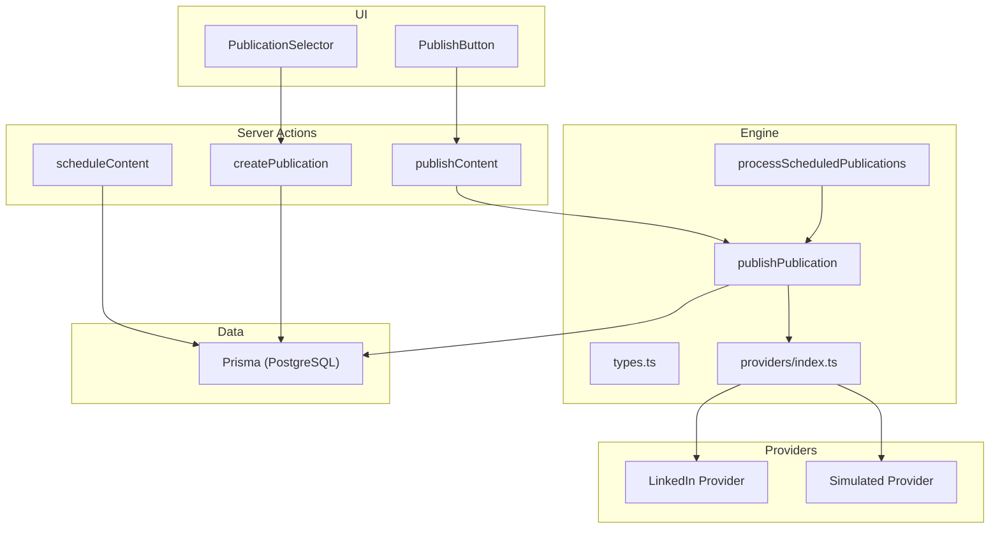
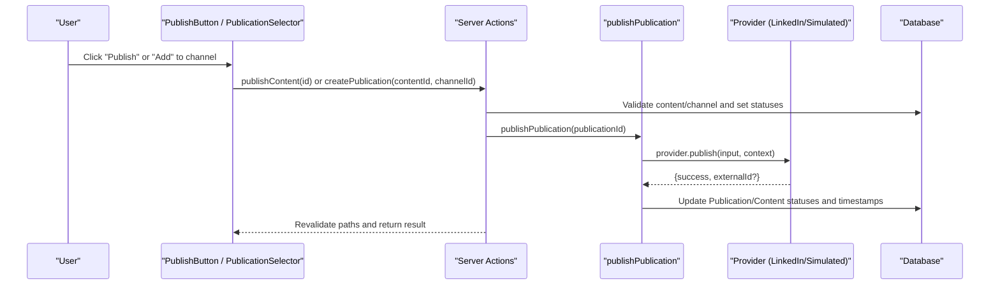
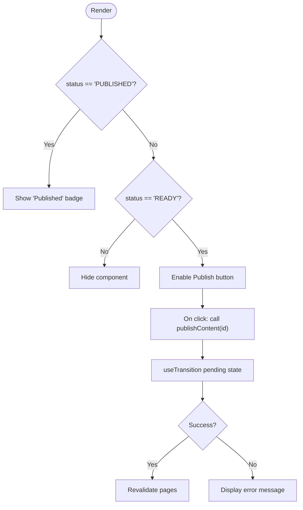
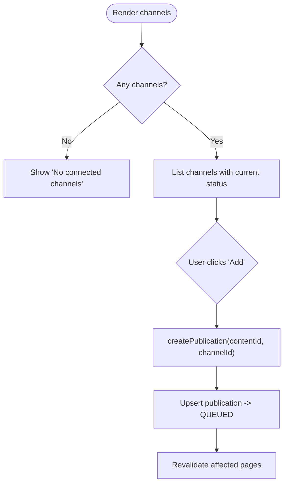
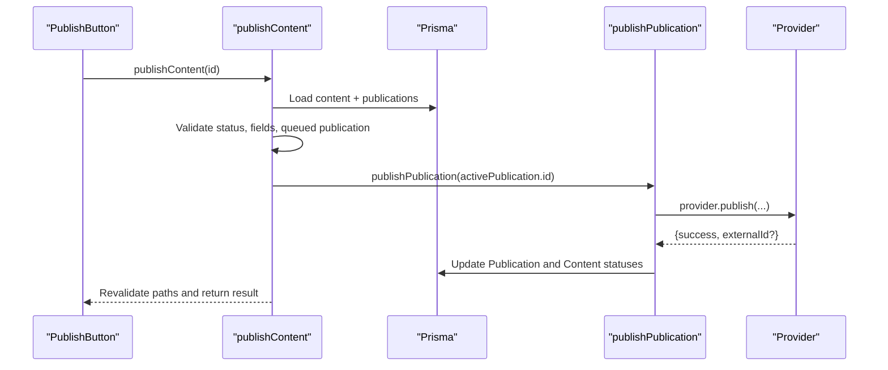
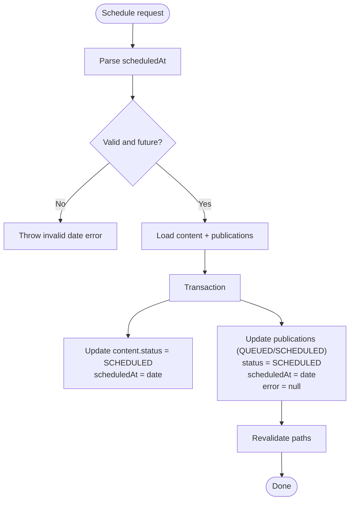
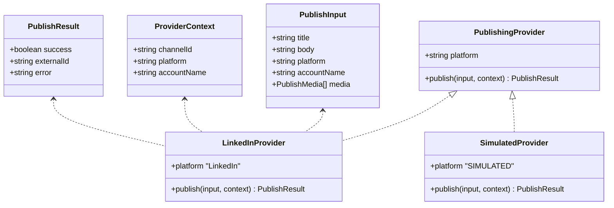
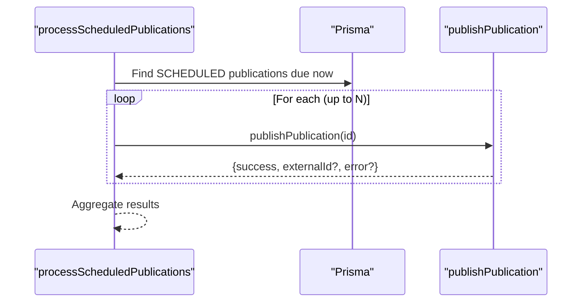
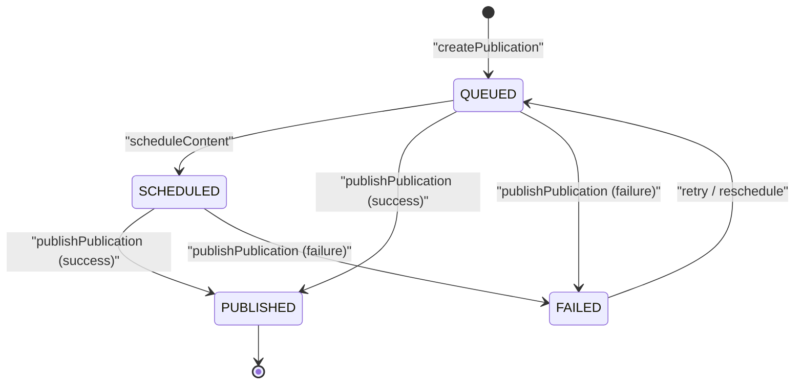
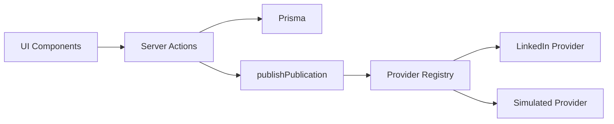

# Publishing Integration

<cite>
**Referenced Files in This Document**
- [publish-button.tsx](file://components/content/publish-button.tsx)
- [publication-selector.tsx](file://components/content/publication-selector.tsx)
- [publish-content.ts](file://app/content/actions/publish-content.ts)
- [schedule-content.ts](file://app/content/actions/schedule-content.ts)
- [create-publication.ts](file://app/content/actions/create-publication.ts)
- [publish.ts](file://app/publishing/engine/publish.ts)
- [process-scheduled.ts](file://app/publishing/engine/process-scheduled.ts)
- [types.ts](file://app/publishing/engine/types.ts)
- [providers/index.ts](file://app/publishing/engine/providers/index.ts)
- [linkedin.ts](file://app/publishing/engine/providers/linkedin.ts)
- [simulated.ts](file://app/publishing/engine/providers/simulated.ts)
- [schema.prisma](file://prisma/schema.prisma)
</cite>

## Table of Contents
1. [Introduction](#introduction)
2. [Project Structure](#project-structure)
3. [Core Components](#core-components)
4. [Architecture Overview](#architecture-overview)
5. [Detailed Component Analysis](#detailed-component-analysis)
6. [Dependency Analysis](#dependency-analysis)
7. [Performance Considerations](#performance-considerations)
8. [Troubleshooting Guide](#troubleshooting-guide)
9. [Conclusion](#conclusion)

## Introduction
This document explains the content publishing integration, focusing on:
- The publish button and publication selector components for choosing target platforms
- Server actions for immediate publishing and scheduling
- Platform-specific configurations and validation
- Integration with the publishing engine, queue management, and status tracking
- Multi-platform workflows, error handling, retry strategies, scheduling options, timezone handling, batch operations, and the connection between content status changes and the publishing pipeline

## Project Structure
The publishing feature spans UI components, server actions, a publishing engine, and platform providers. Data is persisted via Prisma models for Content, Publication, and PublishingChannel.

**Diagram sources**
- [publish-button.tsx:1-65](file://components/content/publish-button.tsx#L1-L65)
- [publication-selector.tsx:1-138](file://components/content/publication-selector.tsx#L1-L138)
- [publish-content.ts:1-70](file://app/content/actions/publish-content.ts#L1-L70)
- [schedule-content.ts:1-66](file://app/content/actions/schedule-content.ts#L1-L66)
- [create-publication.ts:1-69](file://app/content/actions/create-publication.ts#L1-L69)
- [publish.ts:1-116](file://app/publishing/engine/publish.ts#L1-L116)
- [process-scheduled.ts:1-72](file://app/publishing/engine/process-scheduled.ts#L1-L72)
- [types.ts:1-37](file://app/publishing/engine/types.ts#L1-L37)
- [providers/index.ts:1-21](file://app/publishing/engine/providers/index.ts#L1-L21)
- [linkedin.ts:1-284](file://app/publishing/engine/providers/linkedin.ts#L1-L284)
- [simulated.ts:1-33](file://app/publishing/engine/providers/simulated.ts#L1-L33)
- [schema.prisma:21-93](file://prisma/schema.prisma#L21-L93)

**Section sources**
- [publish-button.tsx:1-65](file://components/content/publish-button.tsx#L1-L65)
- [publication-selector.tsx:1-138](file://components/content/publication-selector.tsx#L1-L138)
- [publish-content.ts:1-70](file://app/content/actions/publish-content.ts#L1-L70)
- [schedule-content.ts:1-66](file://app/content/actions/schedule-content.ts#L1-L66)
- [create-publication.ts:1-69](file://app/content/actions/create-publication.ts#L1-L69)
- [publish.ts:1-116](file://app/publishing/engine/publish.ts#L1-L116)
- [process-scheduled.ts:1-72](file://app/publishing/engine/process-scheduled.ts#L1-L72)
- [types.ts:1-37](file://app/publishing/engine/types.ts#L1-L37)
- [providers/index.ts:1-21](file://app/publishing/engine/providers/index.ts#L1-L21)
- [linkedin.ts:1-284](file://app/publishing/engine/providers/linkedin.ts#L1-L284)
- [simulated.ts:1-33](file://app/publishing/engine/providers/simulated.ts#L1-L33)
- [schema.prisma:21-93](file://prisma/schema.prisma#L21-L93)

## Core Components
- PublishButton: A client component that triggers immediate publishing when content is READY and has queued publications. It shows a “Published” state or hides itself based on content status.
- PublicationSelector: Displays available channels and allows queuing one or more publications per channel. Shows per-channel status labels and prevents duplicate queued entries.

Key behaviors:
- Immediate publish flow: PublishButton calls publishContent, which validates content and delegates to the engine to publish an active queued publication.
- Scheduling flow: scheduleContent sets content and related publications to SCHEDULED with a future time.
- Queue creation: createPublication upserts a publication entry per channel, marking it QUEUED.

**Section sources**
- [publish-button.tsx:1-65](file://components/content/publish-button.tsx#L1-L65)
- [publication-selector.tsx:1-138](file://components/content/publication-selector.tsx#L1-L138)
- [publish-content.ts:1-70](file://app/content/actions/publish-content.ts#L1-L70)
- [schedule-content.ts:1-66](file://app/content/actions/schedule-content.ts#L1-L66)
- [create-publication.ts:1-69](file://app/content/actions/create-publication.ts#L1-L69)

## Architecture Overview
The system uses a provider-based publishing engine. Server actions validate inputs and persist state transitions. The engine resolves a platform provider by channel platform and executes platform-specific publishing logic. Results update database records and propagate UI updates via path revalidation.

**Diagram sources**
- [publish-button.tsx:1-65](file://components/content/publish-button.tsx#L1-L65)
- [publication-selector.tsx:1-138](file://components/content/publication-selector.tsx#L1-L138)
- [publish-content.ts:1-70](file://app/content/actions/publish-content.ts#L1-L70)
- [create-publication.ts:1-69](file://app/content/actions/create-publication.ts#L1-L69)
- [publish.ts:1-116](file://app/publishing/engine/publish.ts#L1-L116)
- [providers/index.ts:1-21](file://app/publishing/engine/providers/index.ts#L1-L21)
- [linkedin.ts:1-284](file://app/publishing/engine/providers/linkedin.ts#L1-L284)
- [simulated.ts:1-33](file://app/publishing/engine/providers/simulated.ts#L1-L33)

## Detailed Component Analysis

### Publish Button
- Purpose: Trigger immediate publishing for content marked READY with at least one queued publication.
- Behavior:
  - Hides if not READY; shows “Published” if already published.
  - Calls publishContent server action within a transition and displays errors.
- Validation enforced by server action includes content status, presence of title/body, and existence of queued publications.

**Diagram sources**
- [publish-button.tsx:1-65](file://components/content/publish-button.tsx#L1-L65)
- [publish-content.ts:1-70](file://app/content/actions/publish-content.ts#L1-L70)

**Section sources**
- [publish-button.tsx:1-65](file://components/content/publish-button.tsx#L1-L65)
- [publish-content.ts:1-70](file://app/content/actions/publish-content.ts#L1-L70)

### Publication Selector
- Purpose: Let users choose one or more channels for a piece of content and queue them for publishing.
- Behavior:
  - Lists connected channels and shows per-channel status (Queued, Publishing, Published, Failed).
  - Prevents duplicate queued entries and disables actions while pending.
  - Calls createPublication to upsert a publication record per channel.

**Diagram sources**
- [publication-selector.tsx:1-138](file://components/content/publication-selector.tsx#L1-L138)
- [create-publication.ts:1-69](file://app/content/actions/create-publication.ts#L1-L69)

**Section sources**
- [publication-selector.tsx:1-138](file://components/content/publication-selector.tsx#L1-L138)
- [create-publication.ts:1-69](file://app/content/actions/create-publication.ts#L1-L69)

### Server Action: Immediate Publish (publish-content.ts)
- Validates content exists, is READY, has title/body, and has at least one queued or scheduled publication.
- Selects an active publication (QUEUED or SCHEDULED) and publishes it via the engine.
- On success, revalidates multiple paths to refresh UI across the app.

**Diagram sources**
- [publish-content.ts:1-70](file://app/content/actions/publish-content.ts#L1-L70)
- [publish.ts:1-116](file://app/publishing/engine/publish.ts#L1-L116)

**Section sources**
- [publish-content.ts:1-70](file://app/content/actions/publish-content.ts#L1-L70)

### Server Action: Schedule Content (schedule-content.ts)
- Accepts a future datetime string and validates it.
- Sets content status to SCHEDULED and updates all related publications (QUEUED or SCHEDULED) to SCHEDULED with the same time.
- Clears any previous error state during scheduling.

**Diagram sources**
- [schedule-content.ts:1-66](file://app/content/actions/schedule-content.ts#L1-L66)

**Section sources**
- [schedule-content.ts:1-66](file://app/content/actions/schedule-content.ts#L1-L66)

### Publishing Engine and Providers
- Engine (publish.ts):
  - Loads publication with associated content, media, and channel.
  - Validates publication status and channel connectivity.
  - Resolves provider via platform name and invokes provider.publish.
  - On failure: marks publication FAILED with error.
  - On success: marks publication PUBLISHED, clears scheduledAt, stores externalId, and marks content PUBLISHED.
- Providers:
  - LinkedIn provider handles token validation, image upload flow, and post creation.
  - Simulated provider logs details and returns a synthetic externalId for testing.

**Diagram sources**
- [types.ts:1-37](file://app/publishing/engine/types.ts#L1-L37)
- [providers/index.ts:1-21](file://app/publishing/engine/providers/index.ts#L1-L21)
- [linkedin.ts:1-284](file://app/publishing/engine/providers/linkedin.ts#L1-L284)
- [simulated.ts:1-33](file://app/publishing/engine/providers/simulated.ts#L1-L33)

**Section sources**
- [publish.ts:1-116](file://app/publishing/engine/publish.ts#L1-L116)
- [providers/index.ts:1-21](file://app/publishing/engine/providers/index.ts#L1-L21)
- [linkedin.ts:1-284](file://app/publishing/engine/providers/linkedin.ts#L1-L284)
- [simulated.ts:1-33](file://app/publishing/engine/providers/simulated.ts#L1-L33)
- [types.ts:1-37](file://app/publishing/engine/types.ts#L1-L37)

### Scheduled Processing and Batch Operations
- processScheduledPublications:
  - Queries publications with status SCHEDULED and scheduledAt in the past or present.
  - Processes up to a fixed batch size per run.
  - Invokes publishPublication for each and aggregates results.

**Diagram sources**
- [process-scheduled.ts:1-72](file://app/publishing/engine/process-scheduled.ts#L1-L72)
- [publish.ts:1-116](file://app/publishing/engine/publish.ts#L1-L116)

**Section sources**
- [process-scheduled.ts:1-72](file://app/publishing/engine/process-scheduled.ts#L1-L72)

### Data Model and Status Flow
- Models:
  - Content: tracks status, scheduledAt, publishedAt.
  - Publication: links content to a channel, tracks status, scheduledAt, publishedAt, externalId, error.
  - PublishingChannel: stores platform, connection state, tokens, and identifiers.
- Status transitions:
  - Queued: created via createPublication.
  - Scheduled: set via scheduleContent.
  - Published: set by publishPublication on success.
  - Failed: set by publishPublication on provider failure.

**Diagram sources**
- [schema.prisma:21-93](file://prisma/schema.prisma#L21-L93)
- [create-publication.ts:1-69](file://app/content/actions/create-publication.ts#L1-L69)
- [schedule-content.ts:1-66](file://app/content/actions/schedule-content.ts#L1-L66)
- [publish.ts:1-116](file://app/publishing/engine/publish.ts#L1-L116)

**Section sources**
- [schema.prisma:21-93](file://prisma/schema.prisma#L21-L93)
- [create-publication.ts:1-69](file://app/content/actions/create-publication.ts#L1-L69)
- [schedule-content.ts:1-66](file://app/content/actions/schedule-content.ts#L1-L66)
- [publish.ts:1-116](file://app/publishing/engine/publish.ts#L1-L116)

## Dependency Analysis
- UI components depend on server actions for side effects and data mutations.
- Server actions depend on Prisma for persistence and on the publishing engine for execution.
- The engine depends on a provider registry to dispatch to platform-specific implementations.
- Providers depend on environment configuration (e.g., APP_URL) and external APIs (e.g., LinkedIn).

**Diagram sources**
- [publish-button.tsx:1-65](file://components/content/publish-button.tsx#L1-L65)
- [publication-selector.tsx:1-138](file://components/content/publication-selector.tsx#L1-L138)
- [publish-content.ts:1-70](file://app/content/actions/publish-content.ts#L1-L70)
- [publish.ts:1-116](file://app/publishing/engine/publish.ts#L1-L116)
- [providers/index.ts:1-21](file://app/publishing/engine/providers/index.ts#L1-L21)
- [linkedin.ts:1-284](file://app/publishing/engine/providers/linkedin.ts#L1-L284)
- [simulated.ts:1-33](file://app/publishing/engine/providers/simulated.ts#L1-L33)

**Section sources**
- [publish-button.tsx:1-65](file://components/content/publish-button.tsx#L1-L65)
- [publication-selector.tsx:1-138](file://components/content/publication-selector.tsx#L1-L138)
- [publish-content.ts:1-70](file://app/content/actions/publish-content.ts#L1-L70)
- [publish.ts:1-116](file://app/publishing/engine/publish.ts#L1-L116)
- [providers/index.ts:1-21](file://app/publishing/engine/providers/index.ts#L1-L21)
- [linkedin.ts:1-284](file://app/publishing/engine/providers/linkedin.ts#L1-L284)
- [simulated.ts:1-33](file://app/publishing/engine/providers/simulated.ts#L1-L33)

## Performance Considerations
- Batch processing: Scheduled jobs process a limited number of items per run to avoid long-running tasks.
- Transactions: Database updates are wrapped in transactions to ensure consistency.
- Path revalidation: Multiple paths are revalidated after successful operations to keep UI consistent without full reloads.
- External API calls: Provider implementations may involve network I/O; consider timeouts and retries at the provider level.

[No sources needed since this section provides general guidance]

## Troubleshooting Guide
Common issues and where they originate:
- Missing or invalid content:
  - Errors thrown when content is not found, not READY, missing title/body, or no queued publication.
  - Sources: [publish-content.ts:1-70](file://app/content/actions/publish-content.ts#L1-L70)
- Channel not connected:
  - Engine rejects publication if channel.connected is false.
  - Source: [publish.ts:1-116](file://app/publishing/engine/publish.ts#L1-L116)
- Provider-specific failures:
  - LinkedIn token missing/expired, author URN missing, image upload or post creation errors.
  - Sources: [linkedin.ts:1-284](file://app/publishing/engine/providers/linkedin.ts#L1-L284)
- Invalid scheduled date:
  - scheduleContent throws if date is invalid or not in the future.
  - Source: [schedule-content.ts:1-66](file://app/content/actions/schedule-content.ts#L1-L66)
- Duplicate or already-published publications:
  - createPublication prevents re-queuing published content or duplicates.
  - Source: [create-publication.ts:1-69](file://app/content/actions/create-publication.ts#L1-L69)

Retry mechanisms:
- Current implementation does not include automatic retries. Failed publications remain in FAILED state until manually retried or rescheduled.
- To implement retries:
  - Introduce a retry counter and backoff strategy in the scheduler or provider layer.
  - After transient errors, move failed publications back to QUEUED or SCHEDULED with updated metadata.
  - Log detailed error messages for observability.

Scheduling and timezones:
- scheduleContent accepts a datetime string and stores it directly. Ensure clients send times in a consistent format (e.g., ISO 8601) and consider storing in UTC with conversion at display time.
- processScheduledPublications compares scheduledAt against the current server time; ensure server clock is synchronized.

Multi-platform workflows:
- Use PublicationSelector to add multiple channels to the same content. Each channel creates its own publication record.
- Immediate publish selects an active queued publication; to publish to multiple platforms immediately, trigger publishContent for each queued publication or extend the action to iterate over all queued publications.

Batch publishing:
- processScheduledPublications processes a fixed batch size per invocation. Adjust the batch size to balance throughput and resource usage.

Connection between content status changes and the pipeline:
- QUEUED: Created by createPublication.
- SCHEDULED: Set by scheduleContent for both content and related publications.
- PUBLISHED: Set by publishPublication on success for both publication and content.
- FAILED: Set by publishPublication on provider failure for the publication; content remains unchanged unless explicitly updated.

**Section sources**
- [publish-content.ts:1-70](file://app/content/actions/publish-content.ts#L1-L70)
- [schedule-content.ts:1-66](file://app/content/actions/schedule-content.ts#L1-L66)
- [create-publication.ts:1-69](file://app/content/actions/create-publication.ts#L1-L69)
- [publish.ts:1-116](file://app/publishing/engine/publish.ts#L1-L116)
- [linkedin.ts:1-284](file://app/publishing/engine/providers/linkedin.ts#L1-L284)
- [process-scheduled.ts:1-72](file://app/publishing/engine/process-scheduled.ts#L1-L72)

## Conclusion
The publishing integration provides a clear separation between UI interactions, server-side validation, and platform-specific execution. It supports immediate and scheduled publishing, multi-platform queues, and robust status tracking. Extending retry logic, refining batch sizes, and standardizing timezone handling will further improve reliability and scalability.

[No sources needed since this section summarizes without analyzing specific files]