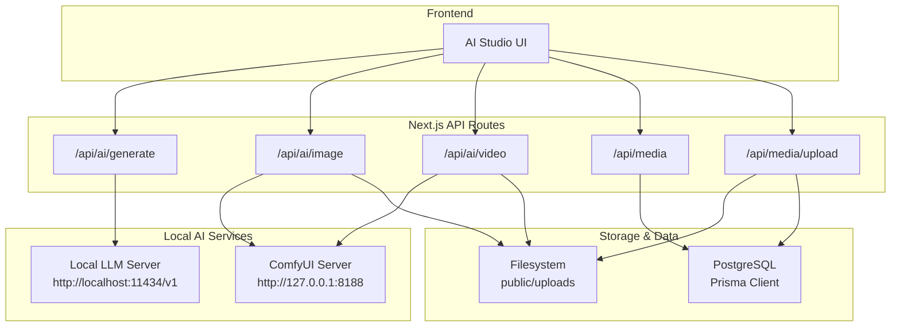
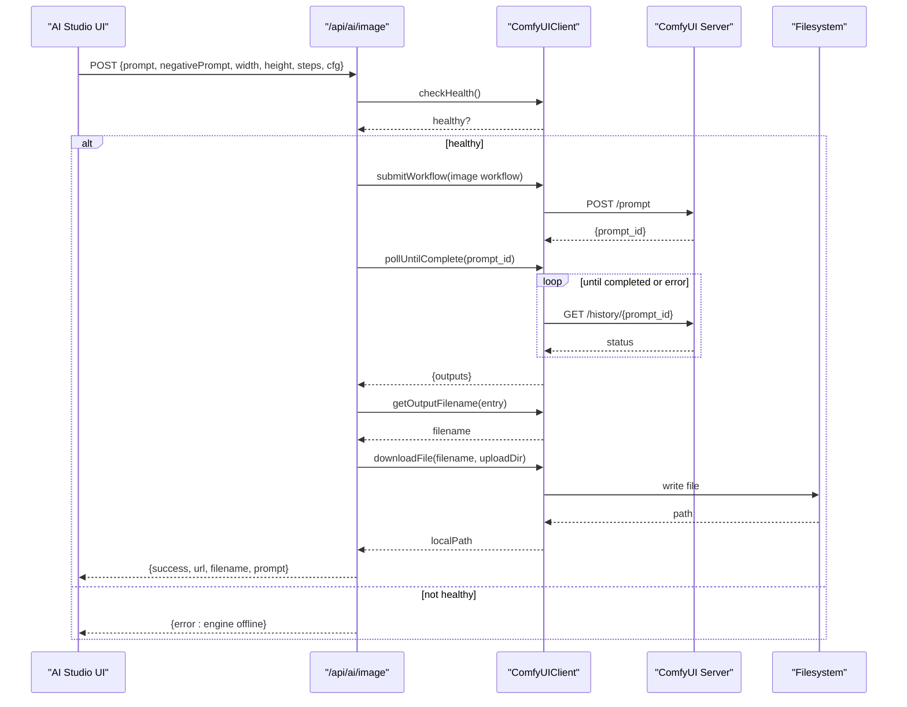
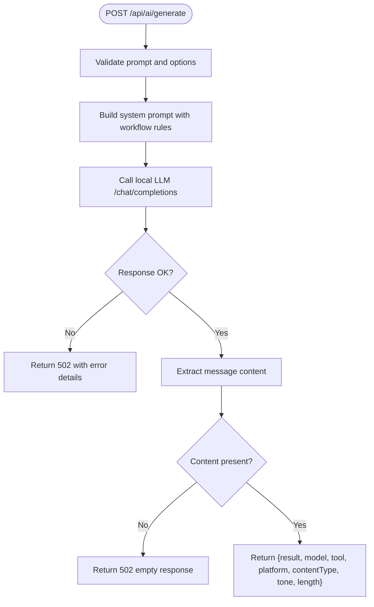
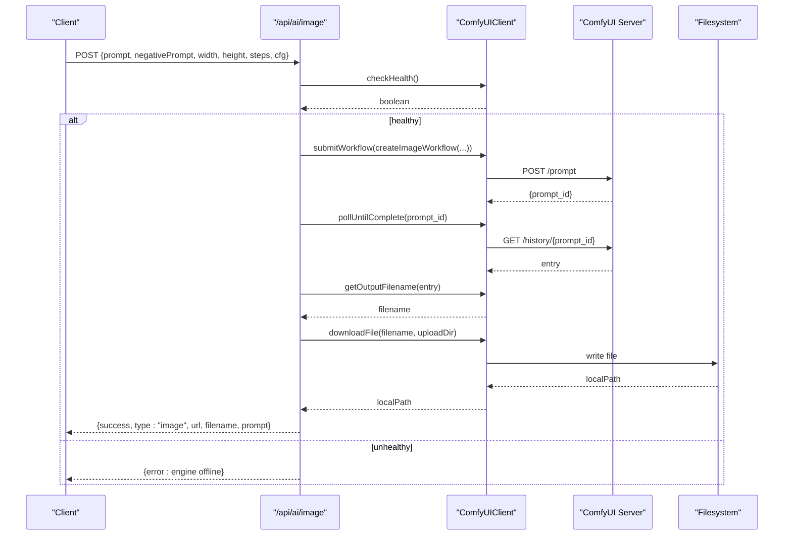
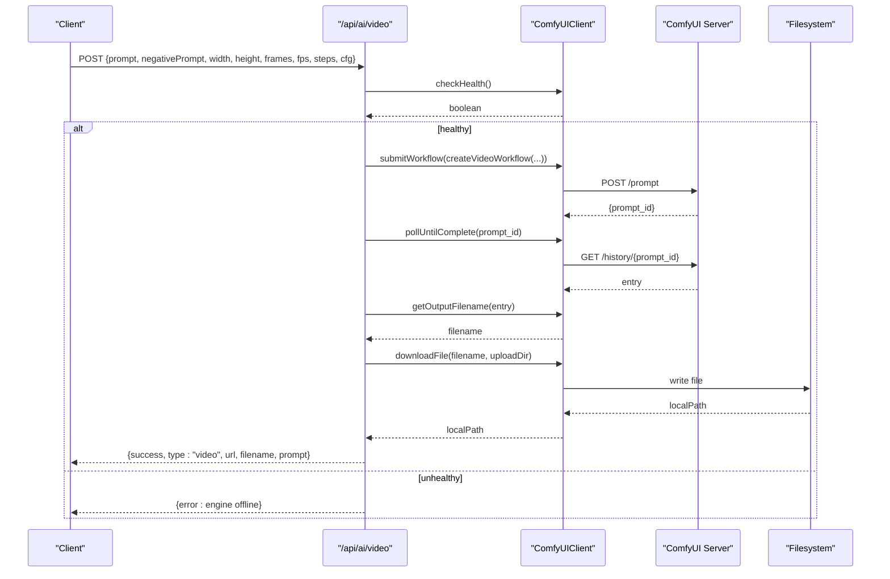
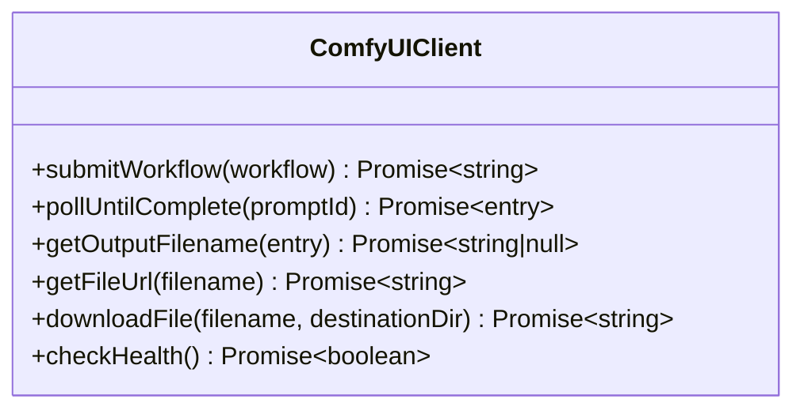
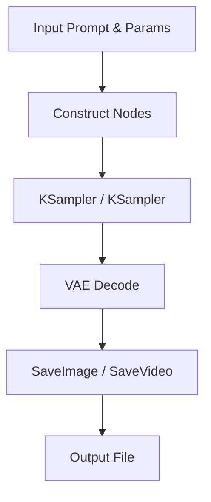
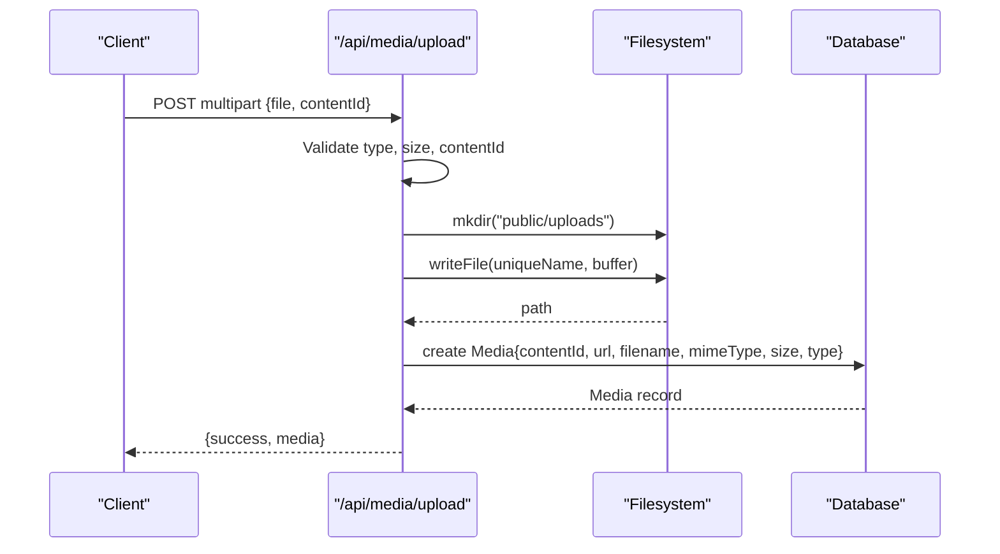
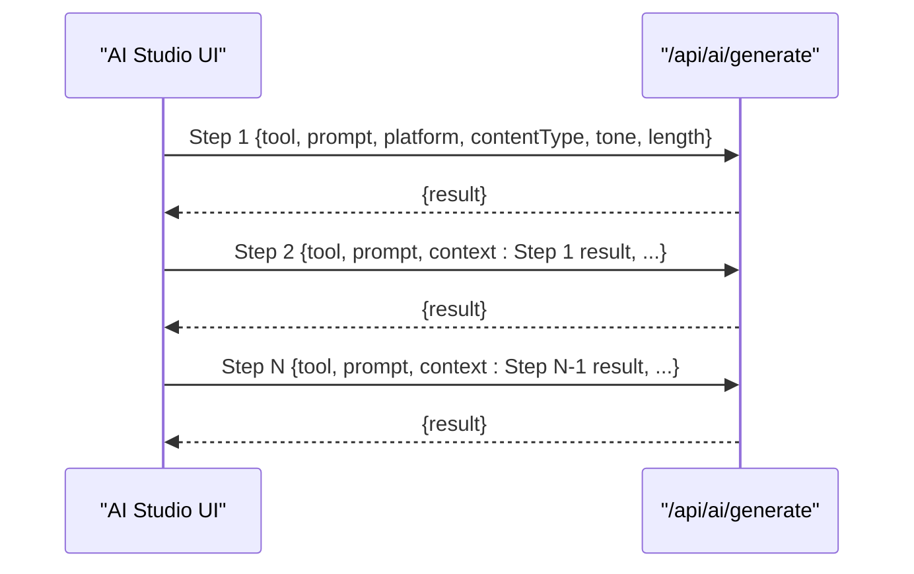
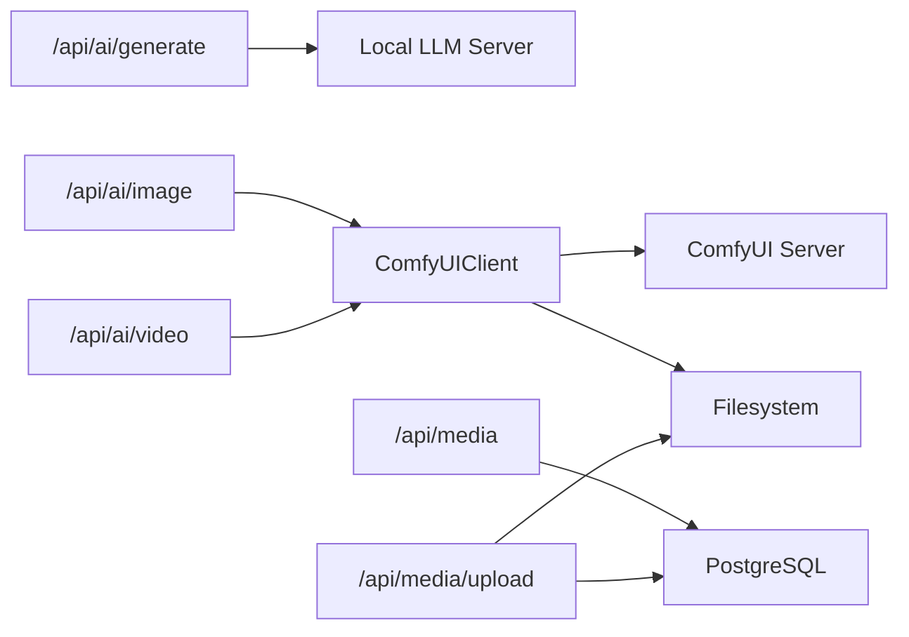

# AI Integration System

<cite>
**Referenced Files in This Document**
- [route.ts](file://app/api/ai/generate/route.ts)
- [route.ts](file://app/api/ai/image/route.ts)
- [route.ts](file://app/api/ai/video/route.ts)
- [comfyui.ts](file://lib/ai/comfyui.ts)
- [image.ts](file://lib/ai/workflows/image.ts)
- [video.ts](file://lib/ai/workflows/video.ts)
- [route.ts](file://app/api/media/route.ts)
- [route.ts](file://app/api/media/upload/route.ts)
- [schema.prisma](file://prisma/schema.prisma)
- [page.tsx](file://app/ai-studio/page.tsx)
</cite>

## Table of Contents
1. [Introduction](#introduction)
2. [Project Structure](#project-structure)
3. [Core Components](#core-components)
4. [Architecture Overview](#architecture-overview)
5. [Detailed Component Analysis](#detailed-component-analysis)
6. [Dependency Analysis](#dependency-analysis)
7. [Performance Considerations](#performance-considerations)
8. [Troubleshooting Guide](#troubleshooting-guide)
9. [Conclusion](#conclusion)
10. [Appendices](#appendices)

## Introduction
This document explains the AI integration system in ContentOS, focusing on:
- ComfyUI client architecture for image and video generation workflows
- API endpoints for AI-powered content creation (text, images, videos)
- Request/response schemas and authentication considerations
- Workflow management for prompt processing, job queuing, and result polling
- Local AI model usage patterns, file download and storage management
- Integration with the media library
- Common AI workflows and best practices for prompt engineering

## Project Structure
The AI subsystem is implemented as a set of Next.js API routes that orchestrate local LLM calls and ComfyUI-based image/video generation. A shared ComfyUI client abstracts workflow submission, polling, and file handling. Generated assets are stored locally and registered in the database via the media API. The AI Studio UI provides interactive interfaces to run text generation, pipelines, and media generation.

**Diagram sources**
- [route.ts:1-218](file://app/api/ai/generate/route.ts#L1-L218)
- [route.ts:1-91](file://app/api/ai/image/route.ts#L1-L91)
- [route.ts:1-102](file://app/api/ai/video/route.ts#L1-L102)
- [comfyui.ts:1-161](file://lib/ai/comfyui.ts#L1-L161)
- [route.ts:1-80](file://app/api/media/route.ts#L1-L80)
- [route.ts:1-126](file://app/api/media/upload/route.ts#L1-L126)

**Section sources**
- [route.ts:1-218](file://app/api/ai/generate/route.ts#L1-L218)
- [route.ts:1-91](file://app/api/ai/image/route.ts#L1-L91)
- [route.ts:1-102](file://app/api/ai/video/route.ts#L1-L102)
- [comfyui.ts:1-161](file://lib/ai/comfyui.ts#L1-L161)
- [route.ts:1-80](file://app/api/media/route.ts#L1-L80)
- [route.ts:1-126](file://app/api/media/upload/route.ts#L1-L126)
- [schema.prisma:1-94](file://prisma/schema.prisma#L1-L94)
- [page.tsx:1-748](file://app/ai-studio/page.tsx#L1-L748)

## Core Components
- Text generation route: builds a structured system prompt based on selected tool, platform, content type, tone, length, and context; forwards to a local LLM server and returns the generated text.
- Image generation route: validates inputs, checks ComfyUI health, constructs an image workflow, submits it, polls until completion, downloads the output, and returns a URL.
- Video generation route: similar to image but constructs a video workflow with frames and fps parameters.
- ComfyUI client: encapsulates workflow submission, history polling, output filename extraction, file download, and health checks.
- Media APIs: list and create media records; upload endpoint persists files to disk and registers them in the database.
- Database schema: defines Content, Media, and related entities used by the media layer.

**Section sources**
- [route.ts:1-218](file://app/api/ai/generate/route.ts#L1-L218)
- [route.ts:1-91](file://app/api/ai/image/route.ts#L1-L91)
- [route.ts:1-102](file://app/api/ai/video/route.ts#L1-L102)
- [comfyui.ts:1-161](file://lib/ai/comfyui.ts#L1-L161)
- [route.ts:1-80](file://app/api/media/route.ts#L1-L80)
- [route.ts:1-126](file://app/api/media/upload/route.ts#L1-L126)
- [schema.prisma:1-94](file://prisma/schema.prisma#L1-L94)

## Architecture Overview
The system uses a layered approach:
- Frontend triggers actions from the AI Studio UI.
- API routes validate requests and coordinate with external services.
- ComfyUI client manages long-running jobs via polling and handles asset persistence.
- Media APIs persist metadata and serve assets through the filesystem.

**Diagram sources**
- [route.ts:1-91](file://app/api/ai/image/route.ts#L1-L91)
- [comfyui.ts:1-161](file://lib/ai/comfyui.ts#L1-L161)

## Detailed Component Analysis

### Text Generation API (/api/ai/generate)
- Purpose: Generate text content using a local LLM server with workflow-specific instructions.
- Key behaviors:
  - Validates required fields and constructs a system prompt based on tool, platform, content type, tone, length, and optional context.
  - Calls the local LLM chat completions endpoint and returns the final content.
  - Handles provider errors and empty responses gracefully.

**Diagram sources**
- [route.ts:1-218](file://app/api/ai/generate/route.ts#L1-L218)

**Section sources**
- [route.ts:1-218](file://app/api/ai/generate/route.ts#L1-L218)

### Image Generation API (/api/ai/image)
- Purpose: Generate images via ComfyUI using a configurable workflow.
- Key behaviors:
  - Validates prompt and dimensions.
  - Checks ComfyUI health before proceeding.
  - Submits an image workflow, polls until completion, extracts output filename, downloads the file, and returns a URL.

**Diagram sources**
- [route.ts:1-91](file://app/api/ai/image/route.ts#L1-L91)
- [comfyui.ts:1-161](file://lib/ai/comfyui.ts#L1-L161)

**Section sources**
- [route.ts:1-91](file://app/api/ai/image/route.ts#L1-L91)
- [image.ts:1-84](file://lib/ai/workflows/image.ts#L1-L84)
- [comfyui.ts:1-161](file://lib/ai/comfyui.ts#L1-L161)

### Video Generation API (/api/ai/video)
- Purpose: Generate short videos via ComfyUI using a configurable workflow.
- Key behaviors:
  - Validates prompt, dimensions, and frame count constraints.
  - Submits a video workflow, polls until completion, extracts output filename, downloads the file, and returns a URL.

**Diagram sources**
- [route.ts:1-102](file://app/api/ai/video/route.ts#L1-L102)
- [comfyui.ts:1-161](file://lib/ai/comfyui.ts#L1-L161)

**Section sources**
- [route.ts:1-102](file://app/api/ai/video/route.ts#L1-L102)
- [video.ts:1-101](file://lib/ai/workflows/video.ts#L1-L101)
- [comfyui.ts:1-161](file://lib/ai/comfyui.ts#L1-L161)

### ComfyUI Client
- Responsibilities:
  - Submit workflows to ComfyUI with timeouts.
  - Poll history until completion or error.
  - Extract output filenames from node outputs.
  - Download generated files to a configured directory.
  - Health-check ComfyUI availability.

**Diagram sources**
- [comfyui.ts:1-161](file://lib/ai/comfyui.ts#L1-L161)

**Section sources**
- [comfyui.ts:1-161](file://lib/ai/comfyui.ts#L1-L161)

### Workflows (Image and Video)
- Image workflow:
  - Uses a checkpoint loader, CLIP text encoders for positive/negative prompts, an empty latent image, KSampler, VAE decode, and SaveImage nodes.
  - Configurable seed, steps, CFG, sampler, scheduler, denoise, and resolution.
- Video workflow:
  - Uses UNet loader, dual CLIP loader, CLIP text encoders, empty latent video, KSampler, VAE decode, and SaveVideo nodes.
  - Configurable frames, fps, steps, CFG, and resolution.

**Diagram sources**
- [image.ts:1-84](file://lib/ai/workflows/image.ts#L1-L84)
- [video.ts:1-101](file://lib/ai/workflows/video.ts#L1-L101)

**Section sources**
- [image.ts:1-84](file://lib/ai/workflows/image.ts#L1-L84)
- [video.ts:1-101](file://lib/ai/workflows/video.ts#L1-L101)

### Media Library Integration
- List media:
  - Returns recent media entries with id, url, filename, mimeType, size, type, createdAt.
- Create media:
  - Persists metadata for a given contentId and URL.
- Upload media:
  - Validates multipart/form-data, allowed types, and size limits.
  - Verifies associated content exists.
  - Saves file to public/uploads with a unique name.
  - Registers media record with URL path and metadata.

**Diagram sources**
- [route.ts:1-126](file://app/api/media/upload/route.ts#L1-L126)
- [route.ts:1-80](file://app/api/media/route.ts#L1-L80)
- [schema.prisma:1-94](file://prisma/schema.prisma#L1-L94)

**Section sources**
- [route.ts:1-80](file://app/api/media/route.ts#L1-L80)
- [route.ts:1-126](file://app/api/media/upload/route.ts#L1-L126)
- [schema.prisma:1-94](file://prisma/schema.prisma#L1-L94)

### Frontend Workflow Management
- The AI Studio page supports:
  - Text generation with selectable tools, platforms, content types, tones, and lengths.
  - Sequential pipeline execution where each step’s output becomes context for the next.
  - Image and video generation tabs with progress indicators and preview panels.
- Pipeline behavior:
  - Iterates through steps sequentially, calling the text generation API and passing prior results as context.
  - Updates step statuses and displays errors when failures occur.

**Diagram sources**
- [page.tsx:1-748](file://app/ai-studio/page.tsx#L1-L748)
- [route.ts:1-218](file://app/api/ai/generate/route.ts#L1-L218)

**Section sources**
- [page.tsx:1-748](file://app/ai-studio/page.tsx#L1-L748)

## Dependency Analysis
- API routes depend on:
  - Environment variables for service URLs and configuration.
  - ComfyUI client for image/video workflows.
  - Prisma client for media operations.
- ComfyUI client depends on:
  - HTTP endpoints for prompt submission and history polling.
  - Filesystem for saving generated assets.
- Frontend depends on:
  - API routes for all AI features.
  - Optional preview components and routing.

**Diagram sources**
- [route.ts:1-218](file://app/api/ai/generate/route.ts#L1-L218)
- [route.ts:1-91](file://app/api/ai/image/route.ts#L1-L91)
- [route.ts:1-102](file://app/api/ai/video/route.ts#L1-L102)
- [comfyui.ts:1-161](file://lib/ai/comfyui.ts#L1-L161)
- [route.ts:1-80](file://app/api/media/route.ts#L1-L80)
- [route.ts:1-126](file://app/api/media/upload/route.ts#L1-L126)

**Section sources**
- [route.ts:1-218](file://app/api/ai/generate/route.ts#L1-L218)
- [route.ts:1-91](file://app/api/ai/image/route.ts#L1-L91)
- [route.ts:1-102](file://app/api/ai/video/route.ts#L1-L102)
- [comfyui.ts:1-161](file://lib/ai/comfyui.ts#L1-L161)
- [route.ts:1-80](file://app/api/media/route.ts#L1-L80)
- [route.ts:1-126](file://app/api/media/upload/route.ts#L1-L126)

## Performance Considerations
- Timeouts and polling:
  - ComfyUI client enforces a global timeout and periodic polling interval to avoid indefinite waits.
  - Adjust timeout and pollInterval based on expected generation durations.
- Input validation:
  - Enforce reasonable bounds for dimensions, frames, and steps to prevent resource exhaustion.
- Storage:
  - Ensure sufficient disk space for generated assets; consider cleanup policies for temporary files.
- Concurrency:
  - For high-throughput scenarios, consider queuing jobs and parallelizing independent tasks at the API layer.
- Model selection:
  - Choose appropriate models/checkpoints to balance quality and speed.

[No sources needed since this section provides general guidance]

## Troubleshooting Guide
- Engine offline:
  - If ComfyUI is unreachable, health checks fail and the API returns a 503 indicating the engine is offline.
- Invalid inputs:
  - Missing or invalid prompts, dimensions, or frame counts return 400 with descriptive errors.
- Provider errors:
  - Text generation failures from the LLM server return 502 with error details.
- Empty responses:
  - If the LLM returns no content, the API responds with a 502 indicating an empty response.
- Generation failures:
  - ComfyUI errors during workflow execution throw exceptions and return 500 with messages.
- Upload issues:
  - Unsupported file types, oversized files, or missing contentId return 400 or 404 with clear messages.

**Section sources**
- [route.ts:1-91](file://app/api/ai/image/route.ts#L1-L91)
- [route.ts:1-102](file://app/api/ai/video/route.ts#L1-L102)
- [route.ts:1-218](file://app/api/ai/generate/route.ts#L1-L218)
- [route.ts:1-126](file://app/api/media/upload/route.ts#L1-L126)

## Conclusion
ContentOS integrates AI capabilities through a modular architecture:
- Text generation leverages a local LLM server with structured prompts and workflow modes.
- Image and video generation use ComfyUI workflows managed by a robust client that handles submission, polling, and asset persistence.
- Media APIs provide consistent storage and metadata management for all generated assets.
- The frontend offers intuitive interfaces for single-step and multi-step workflows, enabling efficient content creation from idea to published post.

[No sources needed since this section summarizes without analyzing specific files]

## Appendices

### API Endpoints Summary

- POST /api/ai/generate
  - Purpose: Generate text content using a local LLM server.
  - Request body:
    - prompt: string (required)
    - tool: string (default "Write Content")
    - platform: string (default "General")
    - contentType: string (default "Post")
    - tone: string (default "Engaging")
    - length: string (default "Medium")
    - context: string (optional)
  - Response:
    - result: string
    - model: string
    - tool: string
    - platform: string
    - contentType: string
    - tone: string
    - length: string
  - Errors:
    - 400: Missing prompt
    - 502: Provider error or empty response
    - 500: Unexpected failure

- POST /api/ai/image
  - Purpose: Generate images via ComfyUI.
  - Request body:
    - prompt: string (required)
    - negativePrompt: string (optional)
    - width: number (default 1024)
    - height: number (default 1024)
    - steps: number (default 30)
    - cfg: number (default 7)
  - Response:
    - success: boolean
    - type: "image"
    - url: string
    - filename: string
    - prompt: string
  - Errors:
    - 400: Missing prompt or invalid dimensions
    - 503: ComfyUI offline
    - 500: Generation failed

- POST /api/ai/video
  - Purpose: Generate videos via ComfyUI.
  - Request body:
    - prompt: string (required)
    - negativePrompt: string (optional)
    - width: number (default 832)
    - height: number (default 480)
    - frames: number (default 49, must be between 1 and 100)
    - fps: number (default 16)
    - steps: number (default 20)
    - cfg: number (default 6)
  - Response:
    - success: boolean
    - type: "video"
    - url: string
    - filename: string
    - prompt: string
  - Errors:
    - 400: Missing prompt, invalid dimensions, or frames out of range
    - 503: ComfyUI offline
    - 500: Generation failed

- GET /api/media
  - Purpose: List recent media entries.
  - Response:
    - media: array of {id, url, filename, mimeType, size, type, createdAt}

- POST /api/media
  - Purpose: Create a media record.
  - Request body:
    - contentId: string (required)
    - url: string (required)
    - filename: string (optional)
    - mimeType: string (default "image/jpeg")
    - size: number (default 0)
    - type: string (default "IMAGE")
  - Response:
    - success: boolean
    - media: object with id, url, filename, mimeType, size, type, createdAt
  - Errors:
    - 400: Missing contentId or url
    - 500: Creation failed

- POST /api/media/upload
  - Purpose: Upload a file and register it as media.
  - Request:
    - Content-Type: multipart/form-data
    - Fields:
      - file: File (required)
      - contentId: string (required)
  - Constraints:
    - Allowed types: image/jpeg, image/png, image/webp, image/gif, video/mp4, video/webm, video/quicktime
    - Max size: 50 MB
  - Response:
    - success: boolean
    - media: object with id, url, filename, mimeType, size, type, createdAt
  - Errors:
    - 400: Invalid content-type, missing file/contentId, unsupported type, or file too large
    - 404: Content not found
    - 500: Upload failed

**Section sources**
- [route.ts:1-218](file://app/api/ai/generate/route.ts#L1-L218)
- [route.ts:1-91](file://app/api/ai/image/route.ts#L1-L91)
- [route.ts:1-102](file://app/api/ai/video/route.ts#L1-L102)
- [route.ts:1-80](file://app/api/media/route.ts#L1-L80)
- [route.ts:1-126](file://app/api/media/upload/route.ts#L1-L126)

### Authentication Methods
- Current implementation does not include explicit authentication or authorization for the AI and media endpoints.
- Recommendations:
  - Add middleware to enforce authentication tokens or session checks.
  - Scope access by user roles if necessary.
  - Rate-limit endpoints to prevent abuse.

[No sources needed since this section provides general guidance]

### Best Practices for Prompt Engineering
- Use workflow-specific instructions to constrain output format and scope.
- Provide clear context and platform guidelines to tailor content style.
- Specify tone and length to control verbosity and cadence.
- For image/video generation:
  - Include detailed positive prompts and meaningful negative prompts.
  - Tune steps, CFG, and resolution for quality vs. performance trade-offs.
  - Use seeds for reproducibility when needed.

[No sources needed since this section provides general guidance]