# Content Lifecycle Workflow

<cite>
**Referenced Files in This Document**
- [schema.prisma](file://prisma/schema.prisma)
- [create-idea.ts](file://app/ideas/actions/create-idea.ts)
- [create-content-from-idea.ts](file://app/content/actions/create-content-from-idea.ts)
- [create-content.ts](file://app/content/actions/create-content.ts)
- [update-content-status.ts](file://app/content/actions/update-content-status.ts)
- [schedule-content.ts](file://app/content/actions/schedule-content.ts)
- [reschedule-content.ts](file://app/content/actions/reschedule-content.ts)
- [publish-content.ts](file://app/content/actions/publish-content.ts)
- [create-publication.ts](file://app/content/actions/create-publication.ts)
- [process-scheduled.ts](file://app/publishing/engine/process-scheduled.ts)
- [publish.ts](file://app/publishing/engine/publish.ts)
- [types.ts](file://app/publishing/engine/types.ts)
- [index.ts](file://app/publishing/engine/providers/index.ts)
- [simulated.ts](file://app/publishing/engine/providers/simulated.ts)
- [content-status-selector.tsx](file://components/content/content-status-selector.tsx)
- [publish-button.tsx](file://components/content/publish-button.tsx)
- [turn-into-content-button.tsx](file://components/ideas/turn-into-content-button.tsx)
- [create-scheduled-post.ts](file://app/calendar/actions/create-scheduled-post.ts)
</cite>

## Table of Contents
1. [Introduction](#introduction)
2. [Project Structure](#project-structure)
3. [Core Components](#core-components)
4. [Architecture Overview](#architecture-overview)
5. [Detailed Component Analysis](#detailed-component-analysis)
6. [Dependency Analysis](#dependency-analysis)
7. [Performance Considerations](#performance-considerations)
8. [Troubleshooting Guide](#troubleshooting-guide)
9. [Conclusion](#conclusion)

## Introduction
This document explains the end-to-end content lifecycle in ContentOS, from capturing an idea to scheduling and publishing content across channels. It details status transitions (INBOX for ideas; DRAFT, READY, SCHEDULED, PUBLISHED for content), business rules governing each transition, data mapping when converting ideas into content, and the automated scheduling and publishing mechanisms. Sequence diagrams illustrate typical user flows and system interactions during creation and publication.

## Project Structure
ContentOS organizes lifecycle logic across:
- Data model definitions (Prisma schema)
- Server actions for creating, updating, scheduling, and publishing
- Publishing engine with provider abstraction and scheduled processing
- UI components that trigger server actions and display status controls

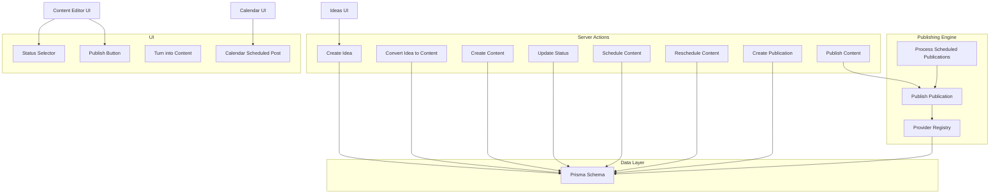

**Diagram sources**
- [schema.prisma:10-93](file://prisma/schema.prisma#L10-L93)
- [create-idea.ts:6-39](file://app/ideas/actions/create-idea.ts#L6-L39)
- [create-content-from-idea.ts:6-27](file://app/content/actions/create-content-from-idea.ts#L6-L27)
- [create-content.ts:12-24](file://app/content/actions/create-content.ts#L12-L24)
- [update-content-status.ts:14-56](file://app/content/actions/update-content-status.ts#L14-L56)
- [schedule-content.ts:6-65](file://app/content/actions/schedule-content.ts#L6-L65)
- [reschedule-content.ts:6-59](file://app/content/actions/reschedule-content.ts#L6-L59)
- [publish-content.ts:7-68](file://app/content/actions/publish-content.ts#L7-L68)
- [create-publication.ts:6-67](file://app/content/actions/create-publication.ts#L6-L67)
- [process-scheduled.ts:4-71](file://app/publishing/engine/process-scheduled.ts#L4-L71)
- [publish.ts:4-115](file://app/publishing/engine/publish.ts#L4-L115)
- [index.ts:5-20](file://app/publishing/engine/providers/index.ts#L5-L20)
- [content-status-selector.tsx:17-183](file://components/content/content-status-selector.tsx#L17-L183)
- [publish-button.tsx:11-64](file://components/content/publish-button.tsx#L11-L64)
- [turn-into-content-button.tsx:10-30](file://components/ideas/turn-into-content-button.tsx#L10-L30)
- [create-scheduled-post.ts:15-66](file://app/calendar/actions/create-scheduled-post.ts#L15-L66)

**Section sources**
- [schema.prisma:10-93](file://prisma/schema.prisma#L10-L93)

## Core Components
- Data model: Idea, Content, Media, PublishingChannel, Publication define entities and relationships used throughout the lifecycle.
- Server actions: Encapsulate business rules for creating ideas, converting them to content, managing content status, scheduling, rescheduling, and publishing.
- Publishing engine: Orchestrates provider-based publishing and processes scheduled items.
- UI components: Provide interactive controls to drive the workflow.

Key responsibilities:
- Idea capture and conversion to content with data mapping.
- Content status management with strict validation and transitions.
- Scheduling and rescheduling with time constraints and cascading updates to publications.
- Automated processing of due publications and finalization upon successful publish.

**Section sources**
- [schema.prisma:10-93](file://prisma/schema.prisma#L10-L93)
- [create-idea.ts:6-39](file://app/ideas/actions/create-idea.ts#L6-L39)
- [create-content-from-idea.ts:6-27](file://app/content/actions/create-content-from-idea.ts#L6-L27)
- [create-content.ts:12-24](file://app/content/actions/create-content.ts#L12-L24)
- [update-content-status.ts:14-56](file://app/content/actions/update-content-status.ts#L14-L56)
- [schedule-content.ts:6-65](file://app/content/actions/schedule-content.ts#L6-L65)
- [reschedule-content.ts:6-59](file://app/content/actions/reschedule-content.ts#L6-L59)
- [publish-content.ts:7-68](file://app/content/actions/publish-content.ts#L7-L68)
- [create-publication.ts:6-67](file://app/content/actions/create-publication.ts#L6-L67)
- [process-scheduled.ts:4-71](file://app/publishing/engine/process-scheduled.ts#L4-L71)
- [publish.ts:4-115](file://app/publishing/engine/publish.ts#L4-L115)

## Architecture Overview
The lifecycle spans user-initiated actions and background processing:
- Users create ideas and convert them into draft content.
- Editors refine content, set status to READY, optionally schedule for future publication, or publish immediately to queued publications.
- A scheduler periodically processes due SCHEDULED publications and triggers publishing.
- Successful publishing updates both publication and content states to PUBLISHED.

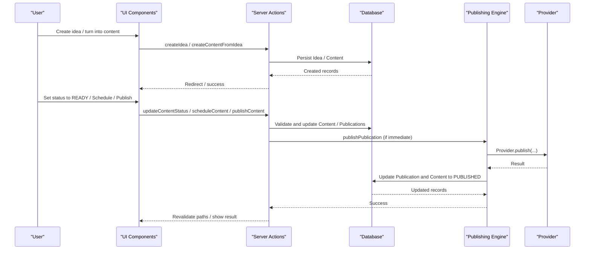

**Diagram sources**
- [create-idea.ts:6-39](file://app/ideas/actions/create-idea.ts#L6-L39)
- [create-content-from-idea.ts:6-27](file://app/content/actions/create-content-from-idea.ts#L6-L27)
- [update-content-status.ts:14-56](file://app/content/actions/update-content-status.ts#L14-L56)
- [schedule-content.ts:6-65](file://app/content/actions/schedule-content.ts#L6-L65)
- [publish-content.ts:7-68](file://app/content/actions/publish-content.ts#L7-L68)
- [publish.ts:4-115](file://app/publishing/engine/publish.ts#L4-L115)
- [index.ts:5-20](file://app/publishing/engine/providers/index.ts#L5-L20)

## Detailed Component Analysis

### Data Model and Relationships
- Idea: Captures raw ideas with INBOX status and links to created Content via one-to-many.
- Content: Central entity with status transitions (DRAFT, READY, SCHEDULED, PUBLISHED), optional platform, scheduling timestamps, and relations to Idea, Publications, and Media.
- Publication: Per-channel publishing record with status (QUEUED, SCHEDULED, PUBLISHED, FAILED), scheduling timestamps, external IDs, and error tracking.
- PublishingChannel: Stores channel connectivity and credentials per platform.
- Media: Attached assets linked to Content.

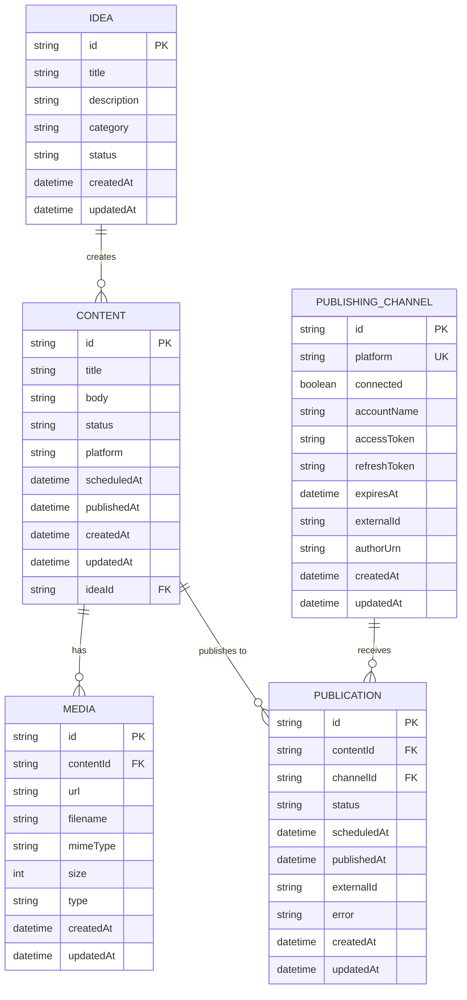

**Diagram sources**
- [schema.prisma:10-93](file://prisma/schema.prisma#L10-L93)

**Section sources**
- [schema.prisma:10-93](file://prisma/schema.prisma#L10-L93)

### Idea Capture and Conversion to Content
- Creation: Ideas are captured with title, optional description/category, defaulting to INBOX status.
- Conversion: Converting an idea creates a new Content record with title/body mapped from the idea, sets status to DRAFT, and establishes the relationship via ideaId.

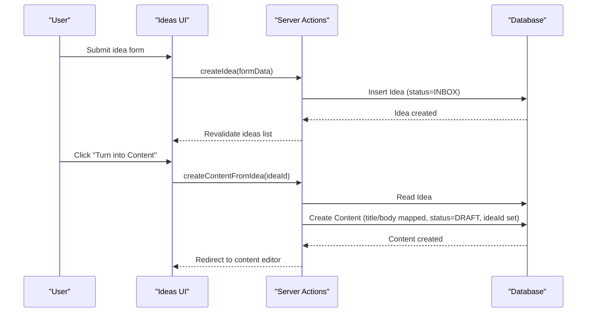

**Diagram sources**
- [create-idea.ts:6-39](file://app/ideas/actions/create-idea.ts#L6-L39)
- [create-content-from-idea.ts:6-27](file://app/content/actions/create-content-from-idea.ts#L6-L27)
- [turn-into-content-button.tsx:10-30](file://components/ideas/turn-into-content-button.tsx#L10-L30)

**Section sources**
- [create-idea.ts:6-39](file://app/ideas/actions/create-idea.ts#L6-L39)
- [create-content-from-idea.ts:6-27](file://app/content/actions/create-content-from-idea.ts#L6-L27)
- [turn-into-content-button.tsx:10-30](file://components/ideas/turn-into-content-button.tsx#L10-L30)

### Content Status Transitions and Business Rules
- Allowed statuses for direct updates: DRAFT, READY, SCHEDULED. Published content cannot change status.
- Transition to SCHEDULED requires a valid future scheduledAt timestamp.
- Immediate publish flow enforces:
  - Content must be READY.
  - Must have title and body.
  - Must have at least one active publication (QUEUED or SCHEDULED).
  - Validates no duplicate publish attempts on already published content.

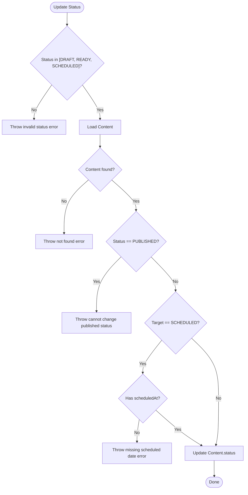

**Diagram sources**
- [update-content-status.ts:14-56](file://app/content/actions/update-content-status.ts#L14-L56)

**Section sources**
- [update-content-status.ts:14-56](file://app/content/actions/update-content-status.ts#L14-L56)

### Scheduling Mechanism and Conflict Resolution
- Scheduling:
  - Validates scheduledAt is a valid future date/time.
  - Prevents scheduling already published content.
  - Updates content status to SCHEDULED and synchronizes related publications’ status and scheduledAt within a transaction.
- Rescheduling:
  - Similar validations and updates as scheduling, ensuring future dates and clearing errors.
- Conflict resolution:
  - Transactions ensure consistent state between content and publications.
  - Duplicate publication entries are upserted to QUEUED when creating publications for a content-channel pair.

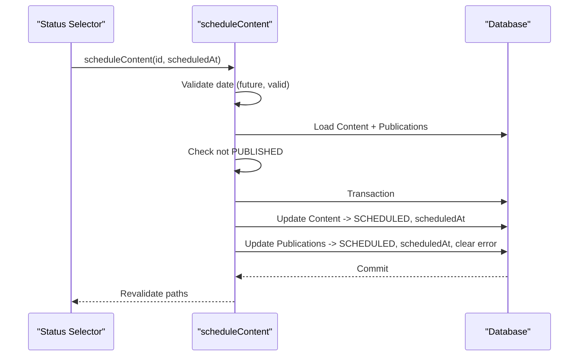

**Diagram sources**
- [schedule-content.ts:6-65](file://app/content/actions/schedule-content.ts#L6-L65)
- [reschedule-content.ts:6-59](file://app/content/actions/reschedule-content.ts#L6-L59)

**Section sources**
- [schedule-content.ts:6-65](file://app/content/actions/schedule-content.ts#L6-L65)
- [reschedule-content.ts:6-59](file://app/content/actions/reschedule-content.ts#L6-L59)

### Automated Publishing Triggers
- Scheduler:
  - Periodically queries for publications with status SCHEDULED and scheduledAt <= now.
  - Processes up to a batch size, invoking publishPublication for each.
- Publish flow:
  - Loads publication with associated content and media.
  - Validates publication status and content body.
  - Ensures channel is connected.
  - Delegates to provider based on platform.
  - On success, updates publication and content to PUBLISHED with timestamps and clears scheduledAt.
  - On failure, marks publication as FAILED with error message.

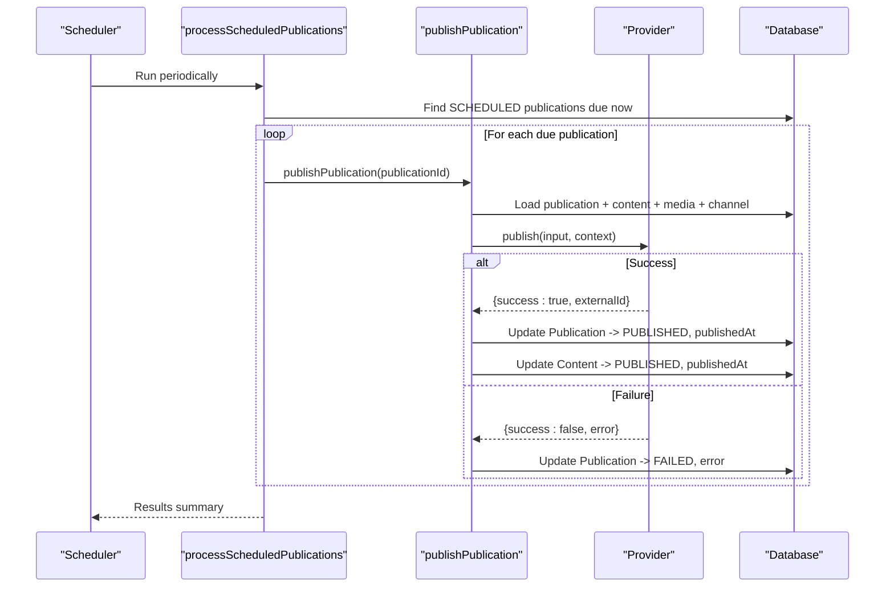

**Diagram sources**
- [process-scheduled.ts:4-71](file://app/publishing/engine/process-scheduled.ts#L4-L71)
- [publish.ts:4-115](file://app/publishing/engine/publish.ts#L4-L115)
- [index.ts:5-20](file://app/publishing/engine/providers/index.ts#L5-L20)
- [simulated.ts:8-32](file://app/publishing/engine/providers/simulated.ts#L8-L32)

**Section sources**
- [process-scheduled.ts:4-71](file://app/publishing/engine/process-scheduled.ts#L4-L71)
- [publish.ts:4-115](file://app/publishing/engine/publish.ts#L4-L115)

### Immediate Publishing Flow
- Triggered by user action when content is READY and has at least one queued publication.
- Enforces presence of title and body.
- Invokes publishPublication for the active publication and revalidates relevant pages.

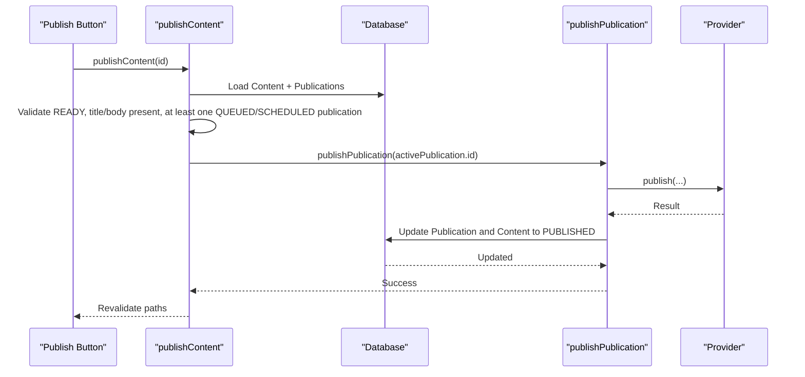

**Diagram sources**
- [publish-button.tsx:11-64](file://components/content/publish-button.tsx#L11-L64)
- [publish-content.ts:7-68](file://app/content/actions/publish-content.ts#L7-L68)
- [publish.ts:4-115](file://app/publishing/engine/publish.ts#L4-L115)

**Section sources**
- [publish-button.tsx:11-64](file://components/content/publish-button.tsx#L11-L64)
- [publish-content.ts:7-68](file://app/content/actions/publish-content.ts#L7-L68)
- [publish.ts:4-115](file://app/publishing/engine/publish.ts#L4-L115)

### Creating Publications and Multi-Platform Scheduling
- Single publication creation:
  - Upserts a publication for a content-channel pair, setting status to QUEUED and clearing scheduledAt/error.
  - Validates channel connectivity and prevents duplicates for already published combinations.
- Multi-platform scheduling from calendar:
  - Creates content with initial status SCHEDULED and primary platform.
  - Finds connected channels for selected platforms.
  - Creates a publication per channel with QUEUED status and scheduledAt, then schedules each publication.

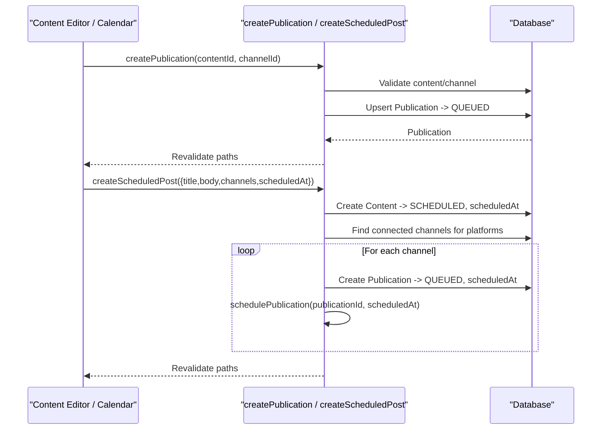

**Diagram sources**
- [create-publication.ts:6-67](file://app/content/actions/create-publication.ts#L6-L67)
- [create-scheduled-post.ts:15-66](file://app/calendar/actions/create-scheduled-post.ts#L15-L66)

**Section sources**
- [create-publication.ts:6-67](file://app/content/actions/create-publication.ts#L6-L67)
- [create-scheduled-post.ts:15-66](file://app/calendar/actions/create-scheduled-post.ts#L15-L66)

### Provider Abstraction and Extensibility
- Provider registry maps platform identifiers to concrete providers.
- Simulated provider demonstrates successful publish behavior and returns an external ID.
- Publishing engine resolves provider by platform and passes structured input and context.

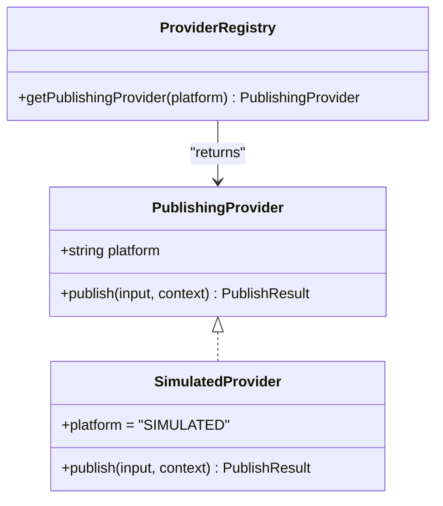

**Diagram sources**
- [types.ts:30-36](file://app/publishing/engine/types.ts#L30-L36)
- [index.ts:5-20](file://app/publishing/engine/providers/index.ts#L5-L20)
- [simulated.ts:8-32](file://app/publishing/engine/providers/simulated.ts#L8-L32)

**Section sources**
- [types.ts:30-36](file://app/publishing/engine/types.ts#L30-L36)
- [index.ts:5-20](file://app/publishing/engine/providers/index.ts#L5-L20)
- [simulated.ts:8-32](file://app/publishing/engine/providers/simulated.ts#L8-L32)

## Dependency Analysis
- Server actions depend on Prisma client for data operations and Next.js cache revalidation for UI consistency.
- Publishing engine depends on provider registry and database to persist outcomes.
- UI components depend on server actions to enforce business rules and reflect state changes.

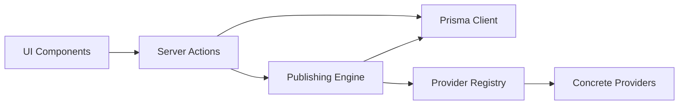

**Diagram sources**
- [content-status-selector.tsx:17-183](file://components/content/content-status-selector.tsx#L17-L183)
- [publish-button.tsx:11-64](file://components/content/publish-button.tsx#L11-L64)
- [update-content-status.ts:14-56](file://app/content/actions/update-content-status.ts#L14-L56)
- [schedule-content.ts:6-65](file://app/content/actions/schedule-content.ts#L6-L65)
- [publish-content.ts:7-68](file://app/content/actions/publish-content.ts#L7-L68)
- [publish.ts:4-115](file://app/publishing/engine/publish.ts#L4-L115)
- [index.ts:5-20](file://app/publishing/engine/providers/index.ts#L5-L20)

**Section sources**
- [content-status-selector.tsx:17-183](file://components/content/content-status-selector.tsx#L17-L183)
- [publish-button.tsx:11-64](file://components/content/publish-button.tsx#L11-L64)
- [update-content-status.ts:14-56](file://app/content/actions/update-content-status.ts#L14-L56)
- [schedule-content.ts:6-65](file://app/content/actions/schedule-content.ts#L6-L65)
- [publish-content.ts:7-68](file://app/content/actions/publish-content.ts#L7-L68)
- [publish.ts:4-115](file://app/publishing/engine/publish.ts#L4-L115)
- [index.ts:5-20](file://app/publishing/engine/providers/index.ts#L5-L20)

## Performance Considerations
- Use transactions for atomic updates to content and publications to prevent partial state changes.
- Batch process scheduled publications to limit load on providers and database.
- Avoid unnecessary revalidations; target only affected routes to reduce overhead.
- Ensure indexes on frequently queried fields (e.g., contentId, scheduledAt) to optimize lookups.

[No sources needed since this section provides general guidance]

## Troubleshooting Guide
Common issues and resolutions:
- Invalid scheduled date: Ensure date strings are valid and represent future times before scheduling or rescheduling.
- Published content cannot be modified: Status changes and scheduling are blocked for PUBLISHED content.
- Missing required fields: Publishing requires a non-empty title and body; add content before publishing.
- No active publication: At least one QUEUED or SCHEDULED publication must exist to publish immediately.
- Channel not connected: Ensure the publishing channel is connected before creating or scheduling publications.
- Provider errors: Failed provider calls mark publications as FAILED with error messages; review logs and retry after resolving issues.

**Section sources**
- [schedule-content.ts:6-65](file://app/content/actions/schedule-content.ts#L6-L65)
- [reschedule-content.ts:6-59](file://app/content/actions/reschedule-content.ts#L6-L59)
- [publish-content.ts:7-68](file://app/content/actions/publish-content.ts#L7-L68)
- [publish.ts:4-115](file://app/publishing/engine/publish.ts#L4-L115)

## Conclusion
ContentOS implements a robust content lifecycle with clear status transitions, strong validation, and extensible publishing. Ideas flow into drafts, which can be prepared, scheduled, and published either immediately or automatically when due. The provider abstraction enables easy integration with multiple platforms while maintaining consistent state management and error handling.

[No sources needed since this section summarizes without analyzing specific files]