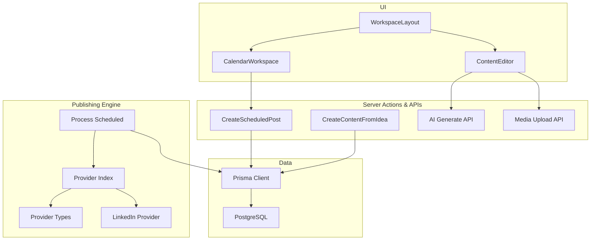
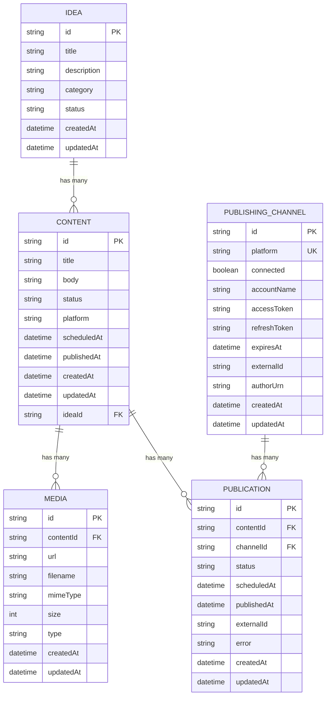
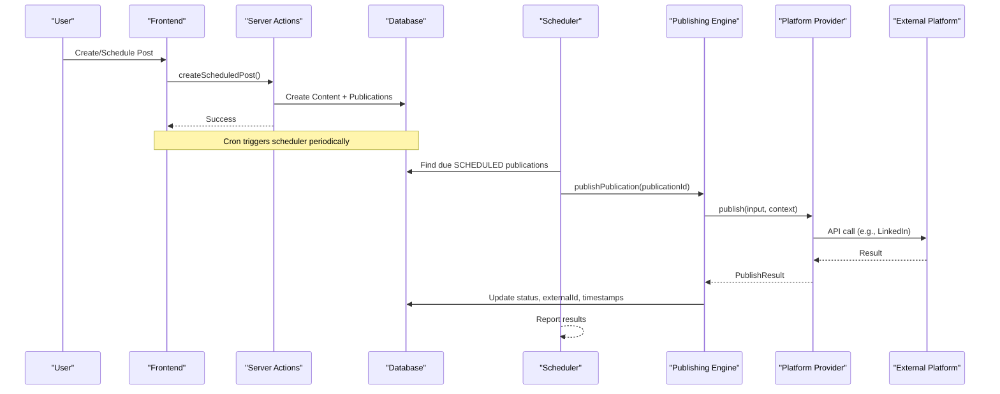
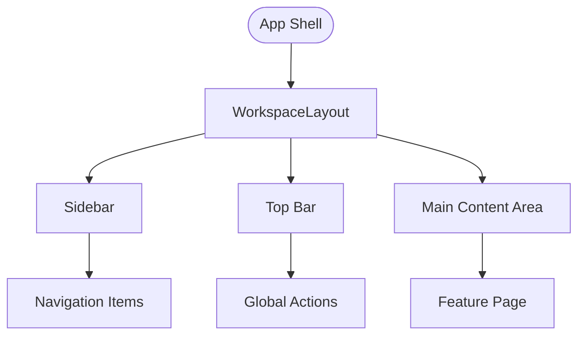
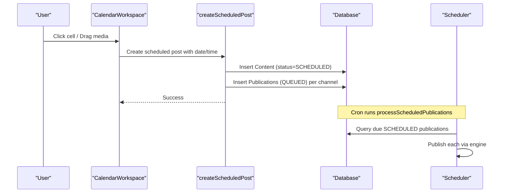
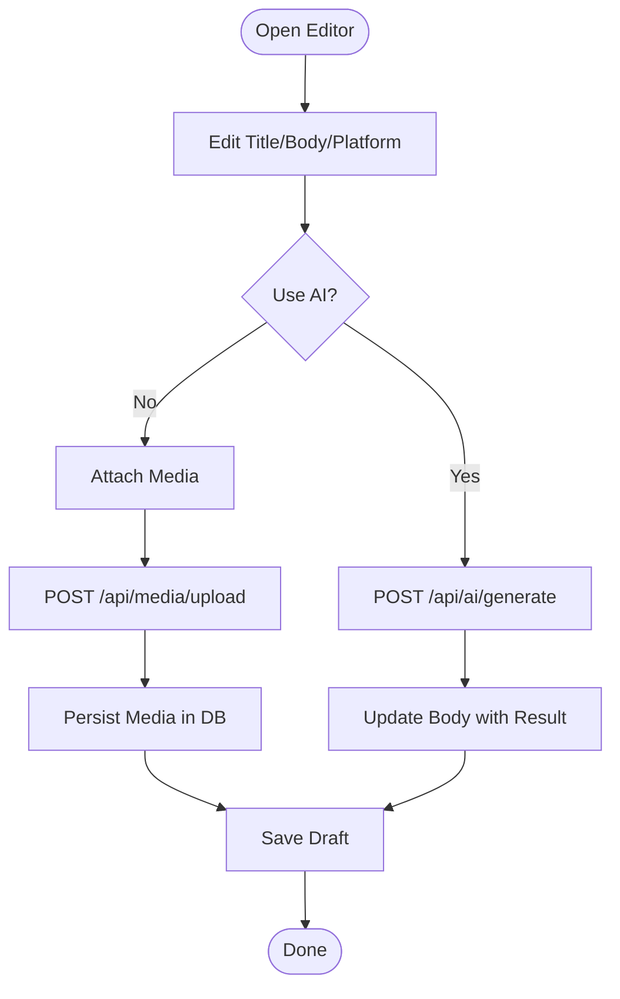
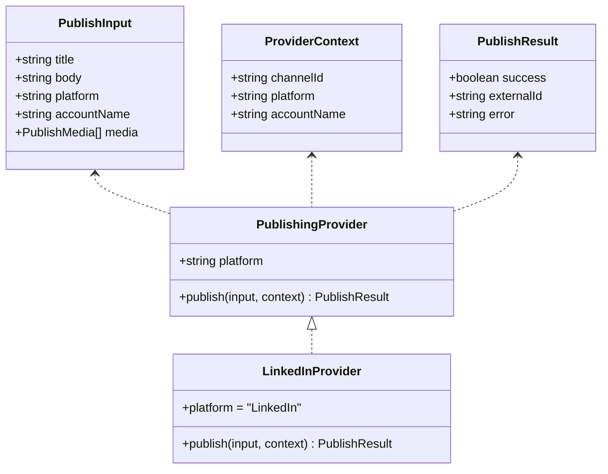
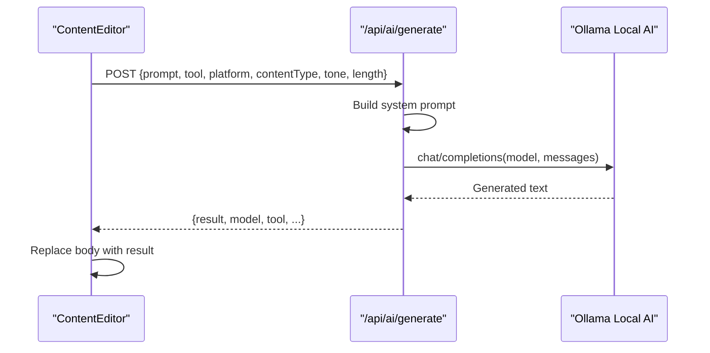
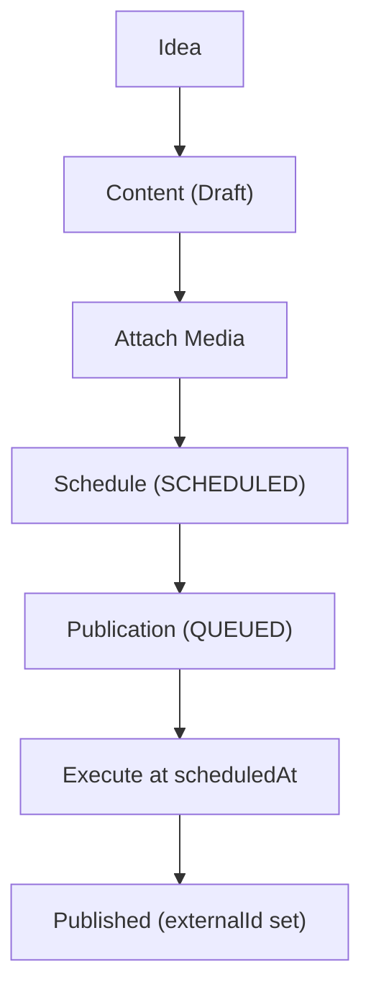
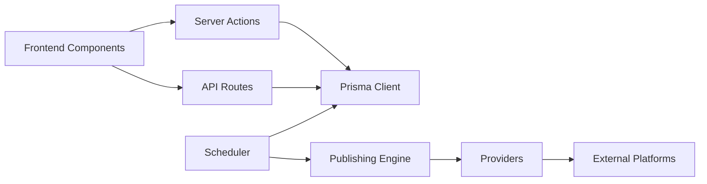

# Core Concepts

<cite>
**Referenced Files in This Document**
- [schema.prisma](file://prisma/schema.prisma)
- [workspace-layout.tsx](file://components/layout/workspace-layout.tsx)
- [calendar-workspace.tsx](file://components/calendar/calendar-workspace.tsx)
- [types.ts](file://app/publishing/engine/types.ts)
- [index.ts](file://app/publishing/engine/providers/index.ts)
- [linkedin.ts](file://app/publishing/engine/providers/linkedin.ts)
- [process-scheduled.ts](file://app/publishing/engine/process-scheduled.ts)
- [create-scheduled-post.ts](file://app/calendar/actions/create-scheduled-post.ts)
- [create-content-from-idea.ts](file://app/content/actions/create-content-from-idea.ts)
- [generate/route.ts](file://app/api/ai/generate/route.ts)
- [upload/route.ts](file://app/api/media/upload/route.ts)
- [content-editor.tsx](file://components/content/content-editor.tsx)
- [README.md](file://README.md)
</cite>

## Table of Contents
1. Introduction
2. Project Structure
3. Core Components
4. Architecture Overview
5. Detailed Component Analysis
6. Dependency Analysis
7. Performance Considerations
8. Troubleshooting Guide
9. Conclusion

## Introduction
ContentOS is a content operating system that guides creators from idea capture to multi-platform publication. It models the lifecycle around five core entities: Idea, Content, Media, PublishingChannel, and Publication. The system provides a unified workspace with a sidebar navigation, a calendar-based scheduling interface, an editor with AI assistance, and a publishing engine that supports multiple platforms through a provider pattern.

Key capabilities include:
- Transform ideas into publishable content
- Schedule posts on a calendar and automate execution
- Manage media assets (images/videos) attached to content
- Publish to channels such as LinkedIn via OAuth-connected accounts
- Use local AI for content generation and editing

**Section sources**
- [README.md:37-63](file://README.md#L37-L63)

## Project Structure
The application follows a Next.js App Router layout with feature-oriented directories:
- app/: routes, API endpoints, and server actions
- components/: reusable UI including workspace layout, calendar, content editor, and publishing controls
- lib/: shared utilities (e.g., Prisma client)
- prisma/: data schema and migrations

**Diagram sources**
- [workspace-layout.tsx:1-41](file://components/layout/workspace-layout.tsx#L1-L41)
- [calendar-workspace.tsx:1-329](file://components/calendar/calendar-workspace.tsx#L1-L329)
- [content-editor.tsx:1-596](file://components/content/content-editor.tsx#L1-L596)
- [create-scheduled-post.ts:1-67](file://app/calendar/actions/create-scheduled-post.ts#L1-L67)
- [create-content-from-idea.ts:1-28](file://app/content/actions/create-content-from-idea.ts#L1-L28)
- [generate/route.ts:1-218](file://app/api/ai/generate/route.ts#L1-L218)
- [upload/route.ts:1-126](file://app/api/media/upload/route.ts#L1-L126)
- [process-scheduled.ts:1-72](file://app/publishing/engine/process-scheduled.ts#L1-L72)
- [types.ts:1-37](file://app/publishing/engine/types.ts#L1-L37)
- [index.ts:1-21](file://app/publishing/engine/providers/index.ts#L1-L21)
- [linkedin.ts:1-284](file://app/publishing/engine/providers/linkedin.ts#L1-L284)

**Section sources**
- [workspace-layout.tsx:1-41](file://components/layout/workspace-layout.tsx#L1-L41)
- [README.md:185-210](file://README.md#L185-L210)

## Core Components
This section explains the fundamental data model and how it drives the workflow.

- Idea: A raw concept captured before content creation. It can be converted into one or more Content items.
- Content: The actual post draft or published piece, optionally linked to an Idea, with status, platform, and scheduling metadata.
- Media: Assets (images/videos) attached to a specific Content item.
- PublishingChannel: A connected external account (e.g., LinkedIn), storing credentials and connection state.
- Publication: A per-channel dispatch record for a Content item, tracking scheduling and publishing outcomes.

**Diagram sources**
- [schema.prisma:10-94](file://prisma/schema.prisma#L10-L94)

**Section sources**
- [schema.prisma:10-94](file://prisma/schema.prisma#L10-L94)

## Architecture Overview
ContentOS orchestrates a pipeline from user input to external publishing:

- Workspace layout provides consistent navigation and context across features.
- Calendar workspace enables scheduling and media management.
- Content editor supports drafting, media attachment, and AI-assisted improvements.
- Server actions create content and schedule publications.
- A background scheduler processes due publications and delegates to platform providers.
- Providers implement platform-specific publishing logic (e.g., LinkedIn).

**Diagram sources**
- [create-scheduled-post.ts:1-67](file://app/calendar/actions/create-scheduled-post.ts#L1-L67)
- [process-scheduled.ts:1-72](file://app/publishing/engine/process-scheduled.ts#L1-L72)
- [types.ts:1-37](file://app/publishing/engine/types.ts#L1-L37)
- [index.ts:1-21](file://app/publishing/engine/providers/index.ts#L1-L21)
- [linkedin.ts:1-284](file://app/publishing/engine/providers/linkedin.ts#L1-L284)

**Section sources**
- [README.md:336-347](file://README.md#L336-L347)

## Detailed Component Analysis

### Data Model and Lifecycle States
- Idea: Captured first; convertible to Content.
- Content: Starts as DRAFT; can be SCHEDULED or PUBLISHED; may have scheduledAt and publishedAt timestamps.
- Media: Attached to Content; stored locally and referenced by URL.
- PublishingChannel: Represents a connected platform account; stores tokens and identifiers.
- Publication: One per Content+Channel pair; tracks QUEUED, SCHEDULED, and final states with externalId and error fields.

Lifecycle highlights:
- Ideas convert to Content via server action.
- Content can be scheduled; upon due time, scheduler picks up and publishes.
- Media is uploaded and associated with Content during editing or scheduling.

**Section sources**
- [schema.prisma:10-94](file://prisma/schema.prisma#L10-L94)
- [create-content-from-idea.ts:1-28](file://app/content/actions/create-content-from-idea.ts#L1-L28)
- [create-scheduled-post.ts:1-67](file://app/calendar/actions/create-scheduled-post.ts#L1-L67)

### Workspace Layout and Navigation
- WorkspaceLayout composes a collapsible sidebar and top bar, providing a consistent shell for all features.
- Active navigation items include overview, ideas, content, ai-studio, calendar, publishing, analytics, and custom-analytics.
- Sidebar width adapts to collapsed state, adjusting main content margin.

**Diagram sources**
- [workspace-layout.tsx:1-41](file://components/layout/workspace-layout.tsx#L1-L41)

**Section sources**
- [workspace-layout.tsx:1-41](file://components/layout/workspace-layout.tsx#L1-L41)

### Calendar-Based Scheduling System
- CalendarWorkspace manages week/month/list views, cell clicks to create posts, drag-and-drop media, and rescheduling.
- Creating a scheduled post persists Content and creates a Publication per connected channel, then schedules it.
- Rescheduling updates the scheduled time and refreshes UI.

**Diagram sources**
- [calendar-workspace.tsx:1-329](file://components/calendar/calendar-workspace.tsx#L1-L329)
- [create-scheduled-post.ts:1-67](file://app/calendar/actions/create-scheduled-post.ts#L1-L67)
- [process-scheduled.ts:1-72](file://app/publishing/engine/process-scheduled.ts#L1-L72)

**Section sources**
- [calendar-workspace.tsx:1-329](file://components/calendar/calendar-workspace.tsx#L1-L329)
- [create-scheduled-post.ts:1-67](file://app/calendar/actions/create-scheduled-post.ts#L1-L67)

### Content Editor and Media Management
- ContentEditor supports title/body editing, platform selection, and AI-assisted improvements.
- Media upload validates file types and sizes, writes files to public/uploads, and records metadata in Media.
- Users can drag-and-drop files, preview images/videos, and delete media.

**Diagram sources**
- [content-editor.tsx:1-596](file://components/content/content-editor.tsx#L1-L596)
- [generate/route.ts:1-218](file://app/api/ai/generate/route.ts#L1-L218)
- [upload/route.ts:1-126](file://app/api/media/upload/route.ts#L1-L126)

**Section sources**
- [content-editor.tsx:1-596](file://components/content/content-editor.tsx#L1-L596)
- [upload/route.ts:1-126](file://app/api/media/upload/route.ts#L1-L126)

### Publishing Engine and Provider Pattern
- Provider interface defines a uniform publish contract with input, context, and result types.
- Provider index maps platform names to implementations and throws when unsupported.
- LinkedIn provider handles token validation, image upload flow, and post creation via REST API.

**Diagram sources**
- [types.ts:1-37](file://app/publishing/engine/types.ts#L1-L37)
- [index.ts:1-21](file://app/publishing/engine/providers/index.ts#L1-L21)
- [linkedin.ts:1-284](file://app/publishing/engine/providers/linkedin.ts#L1-L284)

**Section sources**
- [types.ts:1-37](file://app/publishing/engine/types.ts#L1-L37)
- [index.ts:1-21](file://app/publishing/engine/providers/index.ts#L1-L21)
- [linkedin.ts:1-284](file://app/publishing/engine/providers/linkedin.ts#L1-L284)

### AI Integration Concepts
- The AI endpoint constructs a system prompt based on selected tool, platform, content type, tone, and length.
- It calls a local AI service (Ollama) configured via environment variables and returns generated text.
- The editor integrates AI actions to improve, rewrite, shorten, expand, fix grammar, or make content engaging.

**Diagram sources**
- [generate/route.ts:1-218](file://app/api/ai/generate/route.ts#L1-L218)
- [content-editor.tsx:1-596](file://components/content/content-editor.tsx#L1-L596)

**Section sources**
- [generate/route.ts:1-218](file://app/api/ai/generate/route.ts#L1-L218)
- [content-editor.tsx:1-596](file://components/content/content-editor.tsx#L1-L596)
- [README.md:117-127](file://README.md#L117-L127)

### Workflow: From Idea to Multi-Platform Publication
- Capture an Idea and convert it to Content.
- Attach media and refine content using AI tools.
- Schedule the Content for one or more connected channels.
- Scheduler executes due publications and updates statuses.

**Diagram sources**
- [create-content-from-idea.ts:1-28](file://app/content/actions/create-content-from-idea.ts#L1-L28)
- [create-scheduled-post.ts:1-67](file://app/calendar/actions/create-scheduled-post.ts#L1-L67)
- [process-scheduled.ts:1-72](file://app/publishing/engine/process-scheduled.ts#L1-L72)

**Section sources**
- [create-content-from-idea.ts:1-28](file://app/content/actions/create-content-from-idea.ts#L1-L28)
- [create-scheduled-post.ts:1-67](file://app/calendar/actions/create-scheduled-post.ts#L1-L67)
- [process-scheduled.ts:1-72](file://app/publishing/engine/process-scheduled.ts#L1-L72)

## Dependency Analysis
- Frontend components depend on server actions and API routes for persistence and AI/media operations.
- Publishing engine depends on provider implementations and database state.
- Scheduler depends on cron configuration and database queries to find due publications.

**Diagram sources**
- [calendar-workspace.tsx:1-329](file://components/calendar/calendar-workspace.tsx#L1-L329)
- [content-editor.tsx:1-596](file://components/content/content-editor.tsx#L1-L596)
- [create-scheduled-post.ts:1-67](file://app/calendar/actions/create-scheduled-post.ts#L1-L67)
- [generate/route.ts:1-218](file://app/api/ai/generate/route.ts#L1-L218)
- [upload/route.ts:1-126](file://app/api/media/upload/route.ts#L1-L126)
- [process-scheduled.ts:1-72](file://app/publishing/engine/process-scheduled.ts#L1-L72)
- [index.ts:1-21](file://app/publishing/engine/providers/index.ts#L1-L21)

**Section sources**
- [README.md:336-347](file://README.md#L336-L347)

## Performance Considerations
- Batch processing: The scheduler limits batch size to avoid overwhelming external APIs.
- File uploads: Enforce allowed MIME types and size limits to reduce storage and processing overhead.
- Database connections: Prisma adapter configures pool size and timeouts for efficient concurrency.
- External API calls: Providers handle retries implicitly by returning errors; consider adding retry/backoff strategies for robustness.

[No sources needed since this section provides general guidance]

## Troubleshooting Guide
Common issues and where they are handled:
- Missing or expired access tokens: Provider checks token presence and expiration before publishing.
- Unsupported file types or oversized files: Upload API validates and returns descriptive errors.
- Empty AI responses: AI route validates response and returns structured errors.
- No connected channels: Scheduling fails early if no channels match selected platforms.

**Section sources**
- [linkedin.ts:148-180](file://app/publishing/engine/providers/linkedin.ts#L148-L180)
- [upload/route.ts:20-65](file://app/api/media/upload/route.ts#L20-L65)
- [generate/route.ts:172-193](file://app/api/ai/generate/route.ts#L172-L193)
- [create-scheduled-post.ts:35-44](file://app/calendar/actions/create-scheduled-post.ts#L35-L44)

## Conclusion
ContentOS provides a cohesive architecture that unifies idea capture, content creation, scheduling, and multi-platform publishing. Its data model centers on Idea, Content, Media, PublishingChannel, and Publication, enabling clear lifecycle management. The workspace layout and calendar offer intuitive navigation and planning. The publishing engine’s provider pattern makes it straightforward to add new platforms, while AI integration streamlines content refinement. Together, these components deliver a scalable, extensible content operating system.

[No sources needed since this section summarizes without analyzing specific files]