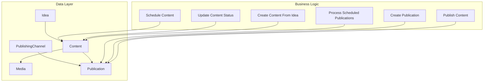
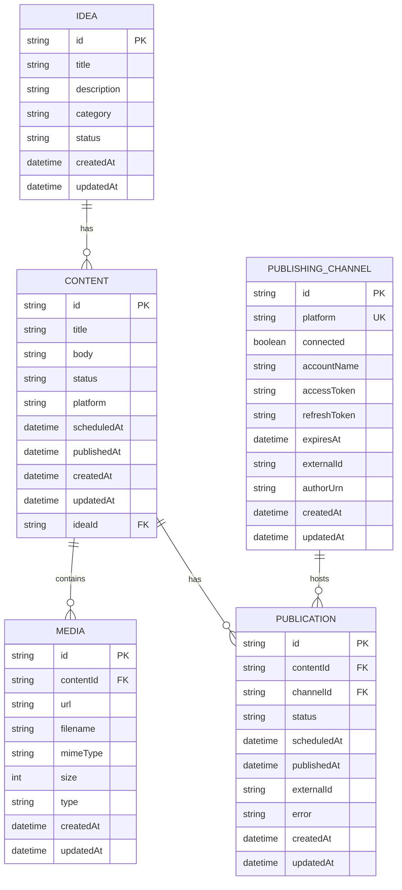
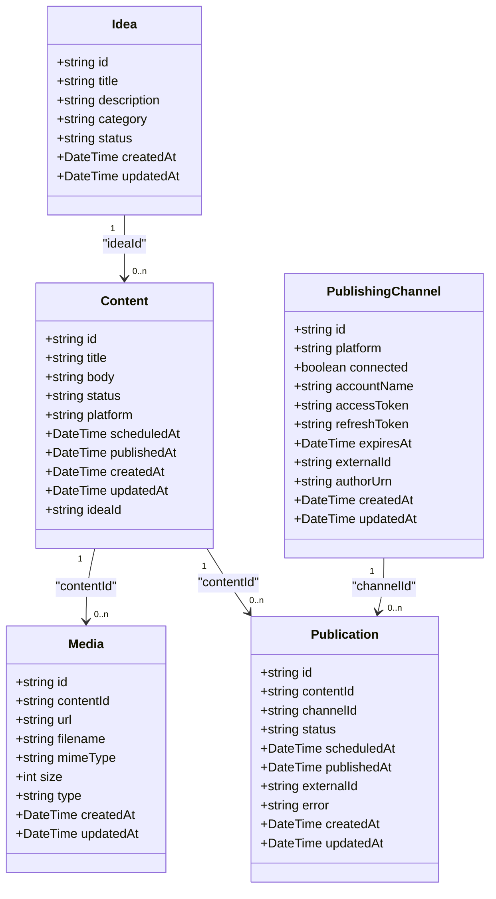
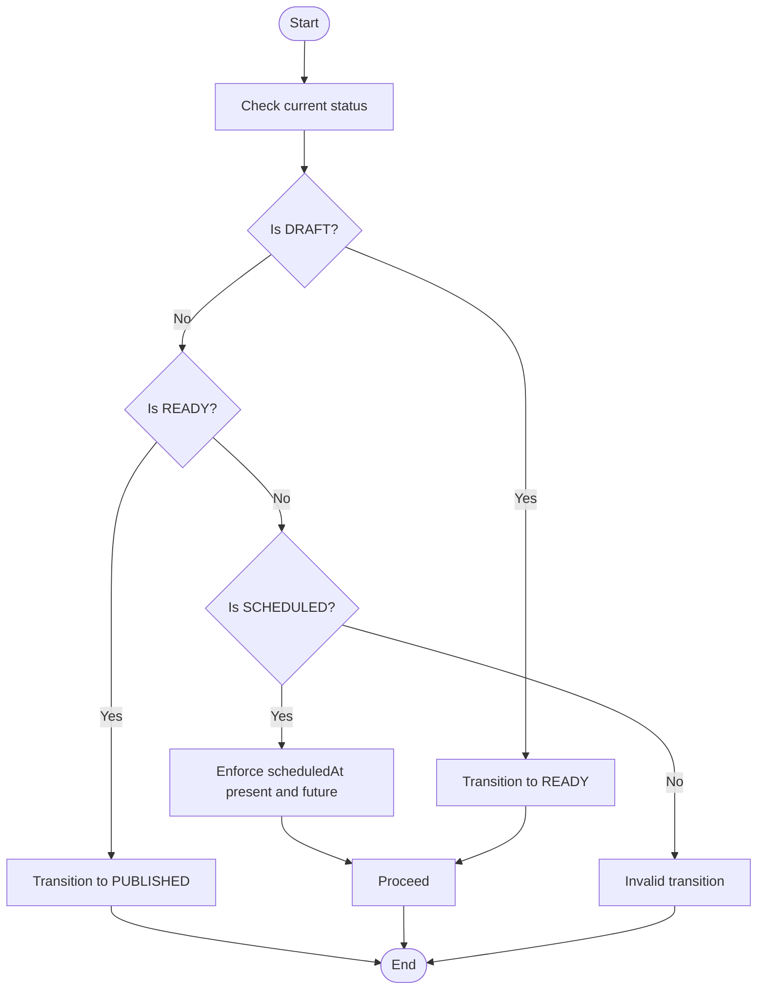
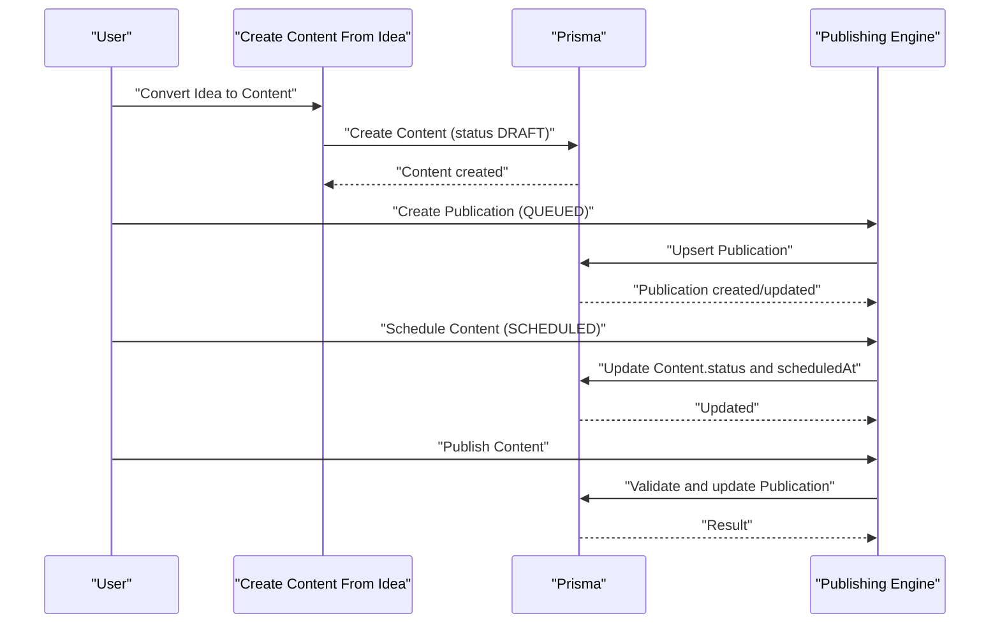
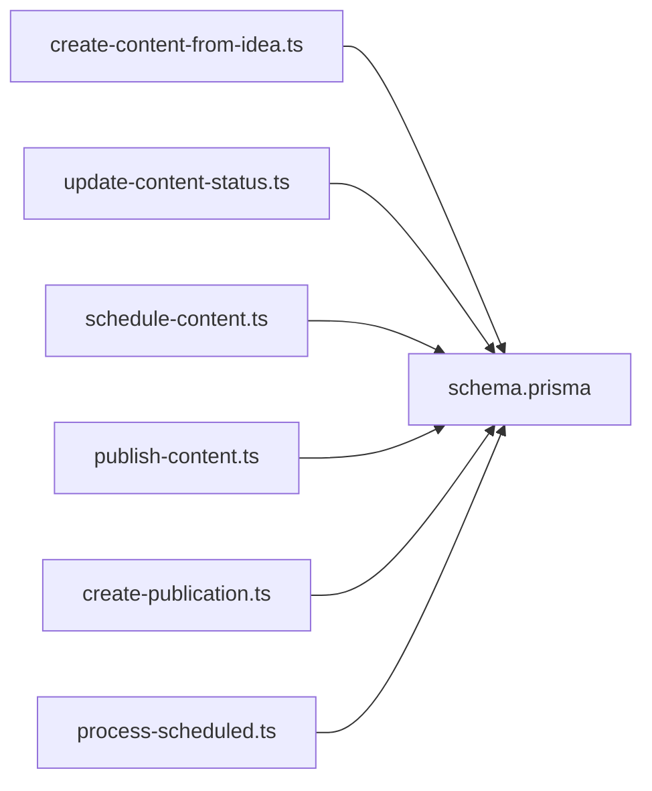

# Data Models and Schema

<cite>
**Referenced Files in This Document**
- [schema.prisma](file://prisma/schema.prisma)
- [20260811122549_add_idea/migration.sql](file://prisma/migrations/20260811122549_add_idea/migration.sql)
- [20260811141418_add_content/migration.sql](file://prisma/migrations/20260811141418_add_content/migration.sql)
- [20260811144400_add_scheduled_at/migration.sql](file://prisma/migrations/20260811144400_add_scheduled_at/migration.sql)
- [20260812050000_add_media/migration.sql](file://prisma/migrations/20260812050000_add_media/migration.sql)
- [20260812122000_add_publishing_channels/migration.sql](file://prisma/migrations/20260812122000_add_publishing_channels/migration.sql)
- [create-content-from-idea.ts](file://app/content/actions/create-content-from-idea.ts)
- [update-content-status.ts](file://app/content/actions/update-content-status.ts)
- [schedule-content.ts](file://app/content/actions/schedule-content.ts)
- [publish-content.ts](file://app/content/actions/publish-content.ts)
- [create-publication.ts](file://app/content/actions/create-publication.ts)
- [process-scheduled.ts](file://app/publishing/engine/process-scheduled.ts)
</cite>

## Table of Contents
1. Introduction
2. Project Structure
3. Core Components
4. Architecture Overview
5. Detailed Component Analysis
6. Dependency Analysis
7. Performance Considerations
8. Troubleshooting Guide
9. Conclusion

## Introduction
This document describes the data models and schema for ContentOS core entities: Idea, Content, Media, PublishingChannel, and Publication. It explains field definitions, types, constraints, validation rules, primary and foreign key relationships, indexes, referential integrity, entity relationship diagrams, status transitions, and the full data lifecycle from creation to archival. It also documents cascade delete behaviors and null handling strategies used across the system.

## Project Structure
The data model is defined in Prisma and evolved through migrations. Business logic that enforces status transitions and publication workflows resides in server actions under app/content/actions and the publishing engine under app/publishing/engine.

**Diagram sources**
- [schema.prisma:10-93](file://prisma/schema.prisma#L10-L93)
- [create-content-from-idea.ts:6-26](file://app/content/actions/create-content-from-idea.ts#L6-L26)
- [update-content-status.ts:6-56](file://app/content/actions/update-content-status.ts#L6-L56)
- [schedule-content.ts:6-65](file://app/content/actions/schedule-content.ts#L6-L65)
- [publish-content.ts:7-68](file://app/content/actions/publish-content.ts#L7-L68)
- [create-publication.ts:6-67](file://app/content/actions/create-publication.ts#L6-L67)
- [process-scheduled.ts:4-70](file://app/publishing/engine/process-scheduled.ts#L4-L70)

**Section sources**
- [schema.prisma:10-93](file://prisma/schema.prisma#L10-L93)
- [20260811122549_add_idea/migration.sql:1-13](file://prisma/migrations/20260811122549_add_idea/migration.sql#L1-L13)
- [20260811141418_add_content/migration.sql:1-17](file://prisma/migrations/20260811141418_add_content/migration.sql#L1-L17)
- [20260811144400_add_scheduled_at/migration.sql:1-3](file://prisma/migrations/20260811144400_add_scheduled_at/migration.sql#L1-L3)
- [20260812050000_add_media/migration.sql:1-21](file://prisma/migrations/20260812050000_add_media/migration.sql#L1-L21)
- [20260812122000_add_publishing_channels/migration.sql:1-10](file://prisma/migrations/20260812122000_add_publishing_channels/migration.sql#L1-L10)

## Core Components
This section summarizes each entity’s fields, types, constraints, and relationships.

- Idea
  - Fields: id (string, primary key), title (string, required), description (string, optional), category (string, optional), status (string, default INBOX), createdAt (datetime, auto), updatedAt (datetime, auto).
  - Relationships: One-to-many with Content via ideaId.
  - Constraints: Primary key on id; status defaults to INBOX.

- Content
  - Fields: id (string, primary key), title (string, required), body (string, optional), status (string, default DRAFT), platform (string, optional), scheduledAt (datetime, optional), publishedAt (datetime, optional), createdAt (datetime, auto), updatedAt (datetime, auto), ideaId (string, optional).
  - Relationships: Many-to-one with Idea via ideaId (onDelete SetNull); one-to-many with Media via contentId; one-to-many with Publication via contentId.
  - Constraints: Primary key on id; status defaults to DRAFT; ideaId is nullable.

- Media
  - Fields: id (string, primary key), contentId (string, required), url (string, required), filename (string, required), mimeType (string, required), size (integer, required), type (string, required), createdAt (datetime, auto), updatedAt (datetime, auto).
  - Relationships: Many-to-one with Content via contentId (onDelete Cascade).
  - Indexes: Index on contentId for efficient lookups by content.

- PublishingChannel
  - Fields: id (string, primary key), platform (string, unique), connected (boolean, default false), accountName (string, optional), accessToken (string, optional), refreshToken (string, optional), expiresAt (datetime, optional), externalId (string, optional), authorUrn (string, optional), createdAt (datetime, auto), updatedAt (datetime, auto).
  - Relationships: One-to-many with Publication via channelId.

- Publication
  - Fields: id (string, primary key), contentId (string, required), channelId (string, required), status (string, default QUEUED), scheduledAt (datetime, optional), publishedAt (datetime, optional), externalId (string, optional), error (string, optional), createdAt (datetime, auto), updatedAt (datetime, auto).
  - Relationships: Many-to-one with Content via contentId (onDelete Cascade); many-to-one with PublishingChannel via channelId (onDelete Cascade).
  - Constraints: Unique constraint on (contentId, channelId) to prevent duplicate channel assignments per content.

**Section sources**
- [schema.prisma:10-93](file://prisma/schema.prisma#L10-L93)
- [20260811122549_add_idea/migration.sql:1-13](file://prisma/migrations/20260811122549_add_idea/migration.sql#L1-L13)
- [20260811141418_add_content/migration.sql:1-17](file://prisma/migrations/20260811141418_add_content/migration.sql#L1-L17)
- [20260811144400_add_scheduled_at/migration.sql:1-3](file://prisma/migrations/20260811144400_add_scheduled_at/migration.sql#L1-L3)
- [20260812050000_add_media/migration.sql:1-21](file://prisma/migrations/20260812050000_add_media/migration.sql#L1-L21)
- [20260812122000_add_publishing_channels/migration.sql:1-10](file://prisma/migrations/20260812122000_add_publishing_channels/migration.sql#L1-L10)

## Architecture Overview
The data architecture centers around a pipeline where ideas are converted into content, enriched with media, associated with publishing channels via publications, and then scheduled or immediately published. The publishing engine processes queued and scheduled publications asynchronously.

**Diagram sources**
- [schema.prisma:10-93](file://prisma/schema.prisma#L10-L93)

## Detailed Component Analysis

### Entity Relationship Diagrams
- Idea → Content: Optional link via ideaId; when an Idea is deleted, Content retains its reference but the link becomes null (SetNull).
- Content → Media: Required link via contentId; deleting Content cascades to Media.
- Content → Publication: Required link via contentId; deleting Content cascades to Publication.
- PublishingChannel → Publication: Required link via channelId; deleting Channel cascades to Publication.
- Unique constraint on Publication(contentId, channelId) ensures one publication entry per content-channel pair.

**Diagram sources**
- [schema.prisma:10-93](file://prisma/schema.prisma#L10-L93)

### Status Transitions and Business Logic
- Allowed content statuses enforced by validation: DRAFT, READY, SCHEDULED. Published content cannot be changed.
- Transition rules:
  - DRAFT → READY: User marks content as ready for publishing.
  - DRAFT/READY → SCHEDULED: Requires a future scheduledAt; clears scheduledAt when moving away from SCHEDULED.
  - READY → PUBLISHED: Only allowed if there is at least one active publication (QUEUED or SCHEDULED) and content has title and body.
- Additional validations:
  - Cannot schedule already published content.
  - Cannot queue or reschedule published content.
  - Must have a connected publishing channel before creating a publication.
  - Cannot create duplicate publication for same content-channel pair if already published.

**Diagram sources**
- [update-content-status.ts:6-56](file://app/content/actions/update-content-status.ts#L6-L56)
- [schedule-content.ts:6-65](file://app/content/actions/schedule-content.ts#L6-L65)
- [publish-content.ts:7-68](file://app/content/actions/publish-content.ts#L7-L68)

**Section sources**
- [update-content-status.ts:6-56](file://app/content/actions/update-content-status.ts#L6-L56)
- [schedule-content.ts:6-65](file://app/content/actions/schedule-content.ts#L6-L65)
- [publish-content.ts:7-68](file://app/content/actions/publish-content.ts#L7-L68)

### Data Lifecycle: Creation Through Archival
- Creation:
  - Ideas created with status INBOX.
  - Convert Idea to Content: creates Content with status DRAFT and links via ideaId.
  - Attach Media to Content: Media records created with required metadata; deletion of Content cascades to Media.
  - Associate PublishingChannel via Publication: upserts Publication with status QUEUED; prevents duplicates per content-channel pair.
- Scheduling:
  - Schedule Content sets status to SCHEDULED and updates scheduledAt; also updates related Publications to SCHEDULED within a transaction.
- Publishing:
  - Publish Content requires status READY and at least one active publication (QUEUED or SCHEDULED); triggers publishPublication which updates Publication status and timestamps.
- Archival/Cleanup:
  - No explicit archival workflow exists; however, deletions follow referential integrity:
    - Deleting Content cascades to Media and Publication.
    - Deleting PublishingChannel cascades to Publication.
    - Deleting Idea sets Content.ideaId to null (no cascade delete on Content).

**Diagram sources**
- [create-content-from-idea.ts:6-26](file://app/content/actions/create-content-from-idea.ts#L6-L26)
- [create-publication.ts:6-67](file://app/content/actions/create-publication.ts#L6-L67)
- [schedule-content.ts:6-65](file://app/content/actions/schedule-content.ts#L6-L65)
- [publish-content.ts:7-68](file://app/content/actions/publish-content.ts#L7-L68)

**Section sources**
- [create-content-from-idea.ts:6-26](file://app/content/actions/create-content-from-idea.ts#L6-L26)
- [create-publication.ts:6-67](file://app/content/actions/create-publication.ts#L6-L67)
- [schedule-content.ts:6-65](file://app/content/actions/schedule-content.ts#L6-L65)
- [publish-content.ts:7-68](file://app/content/actions/publish-content.ts#L7-L68)

### Referential Integrity and Null Handling
- Idea → Content: onDelete SetNull; removing an Idea does not delete Content but clears the link.
- Content → Media: onDelete Cascade; removing Content deletes all attached Media.
- Content → Publication: onDelete Cascade; removing Content deletes all related Publications.
- PublishingChannel → Publication: onDelete Cascade; removing Channel deletes all related Publications.
- Unique constraint on Publication(contentId, channelId) prevents duplicate channel assignments per content.

**Section sources**
- [schema.prisma:21-93](file://prisma/schema.prisma#L21-L93)
- [20260811141418_add_content/migration.sql:15-17](file://prisma/migrations/20260811141418_add_content/migration.sql#L15-L17)
- [20260812050000_add_media/migration.sql:17-21](file://prisma/migrations/20260812050000_add_media/migration.sql#L17-L21)

### Indexes and Query Optimization
- Media.contentId index improves performance for queries retrieving media by content.
- Publication.unique([contentId, channelId]) supports fast upserts and prevents duplicates.

**Section sources**
- [schema.prisma:39-55](file://prisma/schema.prisma#L39-L55)
- [schema.prisma:75-93](file://prisma/schema.prisma#L75-L93)
- [20260812050000_add_media/migration.sql:15-15](file://prisma/migrations/20260812050000_add_media/migration.sql#L15-L15)

## Dependency Analysis
The business logic depends on the Prisma client to enforce schema-level constraints and perform transactions. The publishing engine coordinates scheduling and publication lifecycles.

**Diagram sources**
- [create-content-from-idea.ts:6-26](file://app/content/actions/create-content-from-idea.ts#L6-L26)
- [update-content-status.ts:6-56](file://app/content/actions/update-content-status.ts#L6-L56)
- [schedule-content.ts:6-65](file://app/content/actions/schedule-content.ts#L6-L65)
- [publish-content.ts:7-68](file://app/content/actions/publish-content.ts#L7-L68)
- [create-publication.ts:6-67](file://app/content/actions/create-publication.ts#L6-L67)
- [process-scheduled.ts:4-70](file://app/publishing/engine/process-scheduled.ts#L4-L70)
- [schema.prisma:10-93](file://prisma/schema.prisma#L10-L93)

**Section sources**
- [schema.prisma:10-93](file://prisma/schema.prisma#L10-L93)
- [create-content-from-idea.ts:6-26](file://app/content/actions/create-content-from-idea.ts#L6-L26)
- [update-content-status.ts:6-56](file://app/content/actions/update-content-status.ts#L6-L56)
- [schedule-content.ts:6-65](file://app/content/actions/schedule-content.ts#L6-L65)
- [publish-content.ts:7-68](file://app/content/actions/publish-content.ts#L7-L68)
- [create-publication.ts:6-67](file://app/content/actions/create-publication.ts#L6-L67)
- [process-scheduled.ts:4-70](file://app/publishing/engine/process-scheduled.ts#L4-L70)

## Performance Considerations
- Use the Media.contentId index to optimize media retrieval by content.
- Leverage the unique constraint on Publication(contentId, channelId) to avoid redundant inserts and ensure idempotent upserts.
- Batch operations via transactions (e.g., scheduling content and updating related publications) reduce round-trips and maintain consistency.
- Avoid unnecessary includes in read paths; select only needed fields to minimize payload size.

[No sources needed since this section provides general guidance]

## Troubleshooting Guide
Common errors and their causes:
- Invalid content status: Occurs when attempting to set a status outside the allowed set (DRAFT, READY, SCHEDULED).
- Published content cannot change status: Attempting to modify a published content’s status is blocked.
- Missing scheduled date/time: Setting status to SCHEDULED without a valid future scheduledAt fails.
- Content must have title/body before publishing: Publishing requires non-empty title and body.
- No queued publication available: Publishing requires at least one active publication (QUEUED or SCHEDULED).
- Publishing channel not connected: Creating a publication requires a connected channel.
- Duplicate publication: Upsert prevents multiple publications for the same content-channel pair if already published.

Operational checks:
- Ensure scheduledAt is in the future when scheduling.
- Verify that process-scheduled picks up due publications and calls publishPublication correctly.

**Section sources**
- [update-content-status.ts:6-56](file://app/content/actions/update-content-status.ts#L6-L56)
- [schedule-content.ts:6-65](file://app/content/actions/schedule-content.ts#L6-L65)
- [publish-content.ts:7-68](file://app/content/actions/publish-content.ts#L7-L68)
- [create-publication.ts:6-67](file://app/content/actions/create-publication.ts#L6-L67)
- [process-scheduled.ts:4-70](file://app/publishing/engine/process-scheduled.ts#L4-L70)

## Conclusion
ContentOS models provide a robust foundation for managing ideas, content, media, publishing channels, and publications. The schema enforces referential integrity and uniqueness constraints, while server actions implement clear status transitions and validation rules. The lifecycle flows from idea creation to content scheduling and publication, with well-defined cascade behaviors and null handling strategies ensuring data consistency throughout.