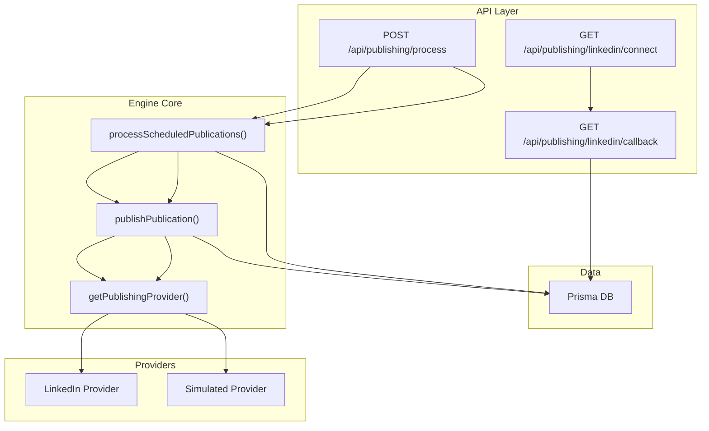
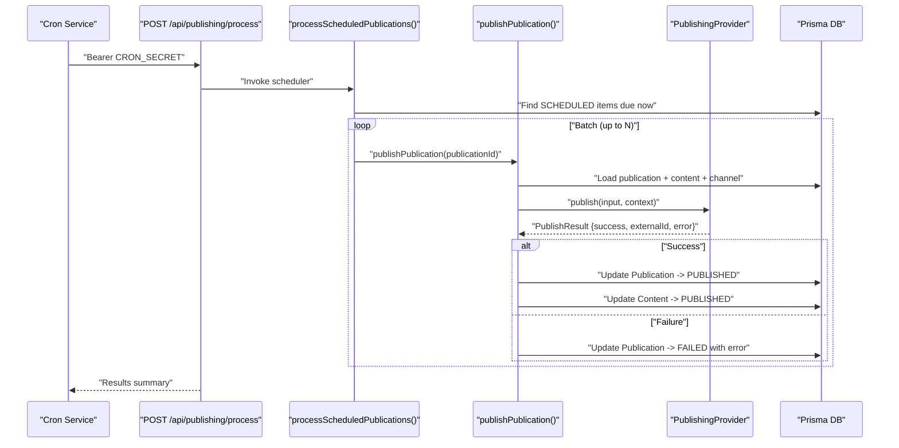
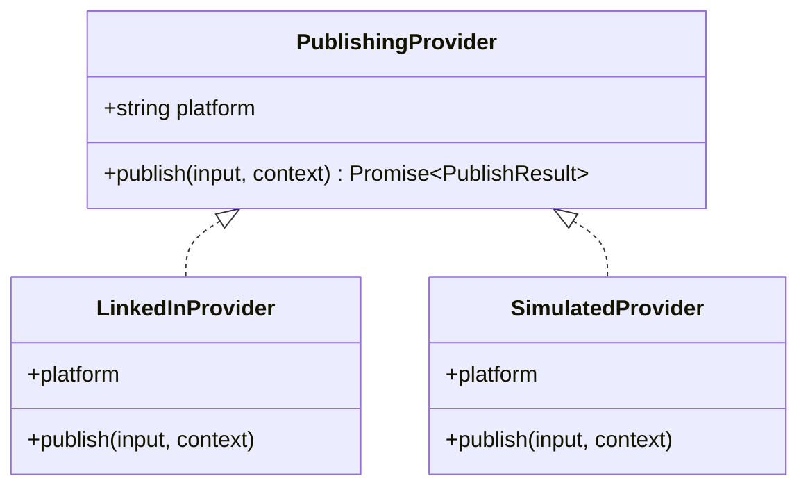
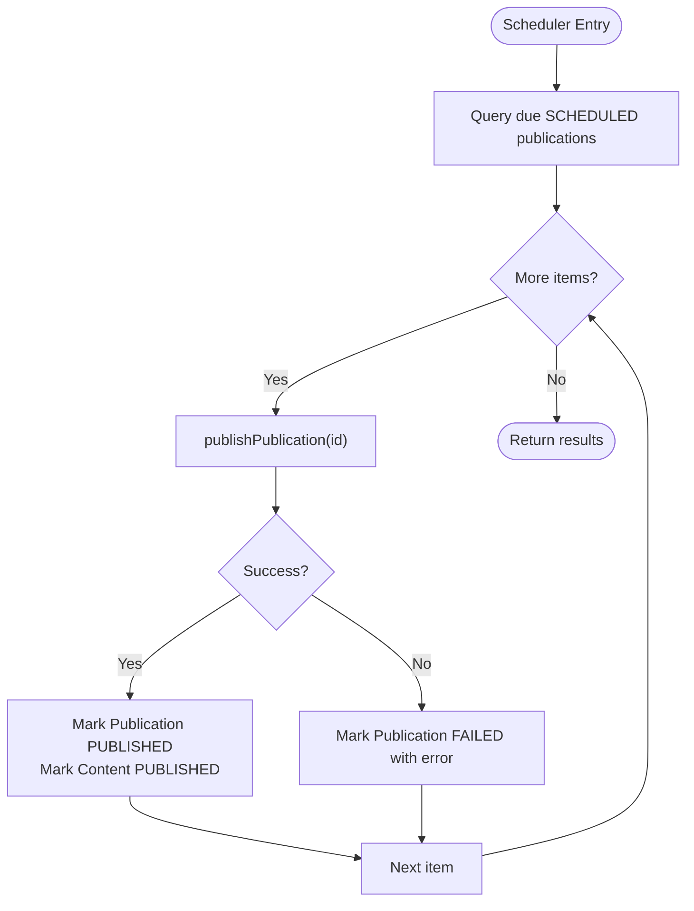
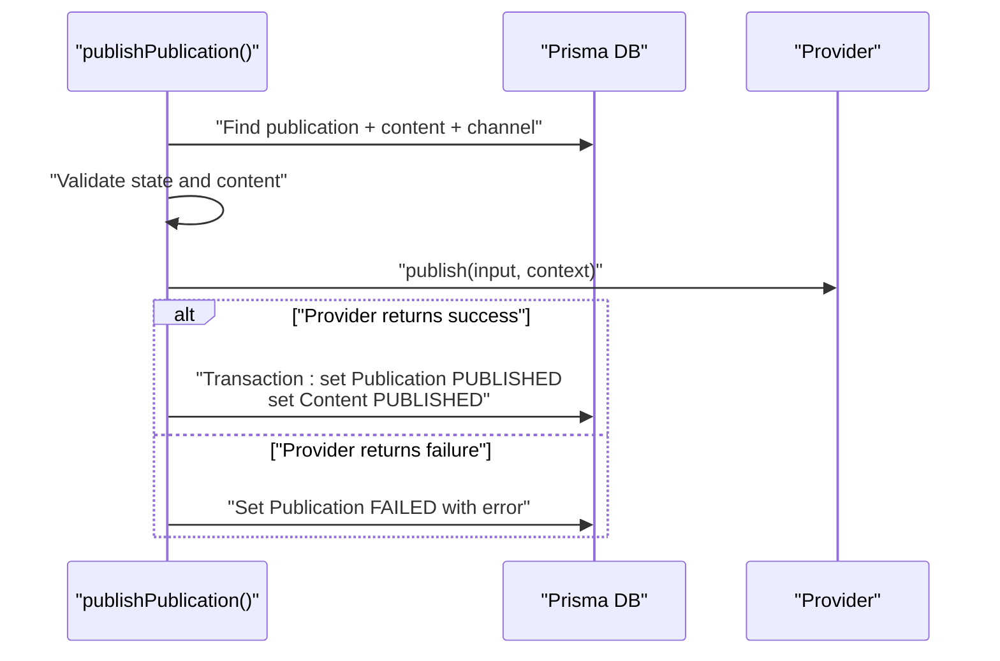
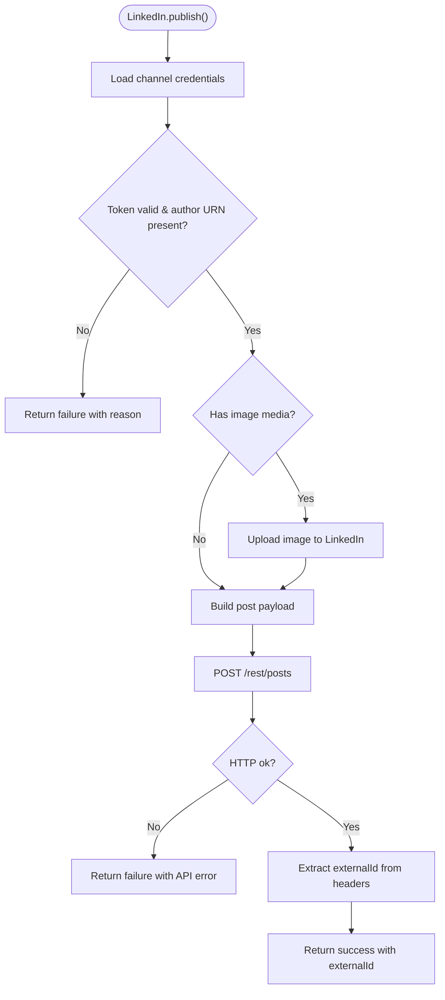
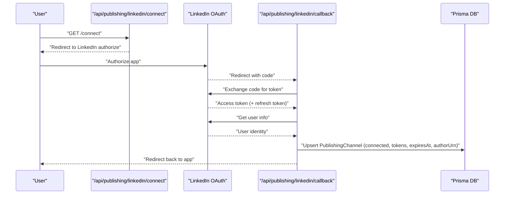
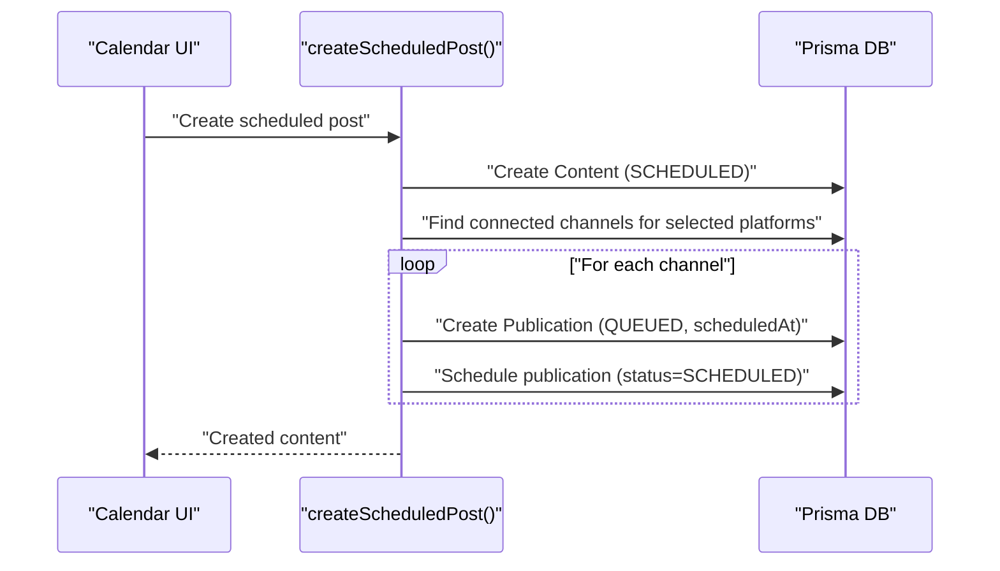
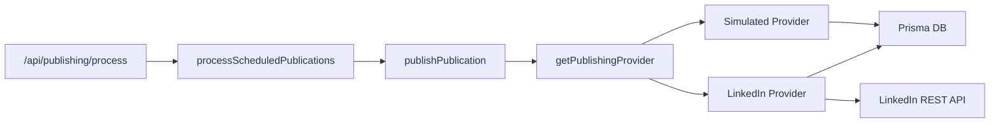

# Publishing Engine Architecture

<cite>
**Referenced Files in This Document**
- [types.ts](file://app/publishing/engine/types.ts)
- [index.ts](file://app/publishing/engine/providers/index.ts)
- [linkedin.ts](file://app/publishing/engine/providers/linkedin.ts)
- [simulated.ts](file://app/publishing/engine/providers/simulated.ts)
- [process-scheduled.ts](file://app/publishing/engine/process-scheduled.ts)
- [publish.ts](file://app/publishing/engine/publish.ts)
- [route.ts](file://app/api/publishing/process/route.ts)
- [connect/route.ts](file://app/api/publishing/linkedin/connect/route.ts)
- [callback/route.ts](file://app/api/publishing/linkedin/callback/route.ts)
- [schedule-content.ts](file://app/content/actions/schedule-content.ts)
- [publish-content.ts](file://app/content/actions/publish-content.ts)
- [schedule-publication.ts](file://app/publishing/actions/schedule-publication.ts)
- [create-scheduled-post.ts](file://app/calendar/actions/create-scheduled-post.ts)
- [schema.prisma](file://prisma/schema.prisma)
</cite>

## Table of Contents
1. [Introduction](#introduction)
2. [Project Structure](#project-structure)
3. [Core Components](#core-components)
4. [Architecture Overview](#architecture-overview)
5. [Detailed Component Analysis](#detailed-component-analysis)
6. [Dependency Analysis](#dependency-analysis)
7. [Performance Considerations](#performance-considerations)
8. [Troubleshooting Guide](#troubleshooting-guide)
9. [Conclusion](#conclusion)

## Introduction
This document describes the multi-platform publishing engine that enables scheduled and on-demand content delivery to external platforms via a pluggable provider pattern. It explains how content is selected, queued, processed by a scheduler, and delivered through platform-specific providers such as LinkedIn or a simulated provider for testing. The system includes robust error handling, status tracking across entities, and batch processing capabilities with bounded concurrency per scheduler run.

## Project Structure
The publishing engine is organized into:
- Engine core: types, provider registry, scheduling entry point, and publish orchestration
- Providers: platform-specific implementations (LinkedIn, simulated)
- API routes: cron-triggered scheduler endpoint and LinkedIn OAuth connect/callback flows
- Server actions: UI-driven scheduling and immediate publishing
- Data model: Prisma schema defining Content, Media, PublishingChannel, and Publication

**Diagram sources**
- [route.ts:7-55](file://app/api/publishing/process/route.ts#L7-L55)
- [process-scheduled.ts:4-71](file://app/publishing/engine/process-scheduled.ts#L4-L71)
- [publish.ts:4-115](file://app/publishing/engine/publish.ts#L4-L115)
- [index.ts:10-20](file://app/publishing/engine/providers/index.ts#L10-L20)
- [linkedin.ts:141-283](file://app/publishing/engine/providers/linkedin.ts#L141-L283)
- [simulated.ts:8-32](file://app/publishing/engine/providers/simulated.ts#L8-L32)
- [connect/route.ts:3-33](file://app/api/publishing/linkedin/connect/route.ts#L3-L33)
- [callback/route.ts:4-168](file://app/api/publishing/linkedin/callback/route.ts#L4-L168)

**Section sources**
- [schema.prisma:21-93](file://prisma/schema.prisma#L21-L93)
- [route.ts:1-56](file://app/api/publishing/process/route.ts#L1-L56)
- [process-scheduled.ts:1-72](file://app/publishing/engine/process-scheduled.ts#L1-L72)
- [publish.ts:1-116](file://app/publishing/engine/publish.ts#L1-L116)
- [index.ts:1-21](file://app/publishing/engine/providers/index.ts#L1-L21)
- [linkedin.ts:1-284](file://app/publishing/engine/providers/linkedin.ts#L1-L284)
- [simulated.ts:1-33](file://app/publishing/engine/providers/simulated.ts#L1-L33)
- [connect/route.ts:1-34](file://app/api/publishing/linkedin/connect/route.ts#L1-L34)
- [callback/route.ts:1-169](file://app/api/publishing/linkedin/callback/route.ts#L1-L169)

## Core Components
- Abstract interface and data contracts define what every provider must implement and how inputs/outputs are structured.
- Provider registry maps platform identifiers to concrete provider instances.
- Scheduler queries due publications and dispatches them to the publish pipeline.
- Publish orchestrator validates state, selects a provider, executes the publish call, and updates statuses atomically.
- LinkedIn provider handles OAuth token validation, media upload, and post creation.
- Simulated provider logs and returns synthetic results for development/testing.

Key responsibilities:
- Connection management: stored in PublishingChannel; validated before use.
- Content formatting: mapped from Content/Media to provider input.
- Response handling: normalized to success/failure with externalId and error messages.

**Section sources**
- [types.ts:1-37](file://app/publishing/engine/types.ts#L1-L37)
- [index.ts:1-21](file://app/publishing/engine/providers/index.ts#L1-L21)
- [process-scheduled.ts:4-71](file://app/publishing/engine/process-scheduled.ts#L4-L71)
- [publish.ts:4-115](file://app/publishing/engine/publish.ts#L4-L115)
- [linkedin.ts:141-283](file://app/publishing/engine/providers/linkedin.ts#L141-L283)
- [simulated.ts:8-32](file://app/publishing/engine/providers/simulated.ts#L8-L32)

## Architecture Overview
The publishing pipeline consists of:
- Scheduled ingestion: a cron job calls the process endpoint to fetch due publications.
- Batch selection: the scheduler retrieves up to a fixed number of due items ordered by scheduled time.
- Provider resolution: based on channel platform, the appropriate provider is selected.
- Platform delivery: provider performs authentication checks, optional media upload, and API posting.
- Status synchronization: successful publishes update both Publication and Content records atomically; failures mark status FAILED with error details.

**Diagram sources**
- [route.ts:7-55](file://app/api/publishing/process/route.ts#L7-L55)
- [process-scheduled.ts:4-71](file://app/publishing/engine/process-scheduled.ts#L4-L71)
- [publish.ts:4-115](file://app/publishing/engine/publish.ts#L4-L115)

## Detailed Component Analysis

### Abstract Interface and Provider Pattern
- PublishingProvider defines a uniform contract with platform identifier and publish method accepting normalized input and context.
- Provider registry provides getPublishingProvider(platform) to resolve implementations and throws when unknown.
- This pattern allows adding new platforms without changing the publish pipeline.

**Diagram sources**
- [types.ts:30-36](file://app/publishing/engine/types.ts#L30-L36)
- [linkedin.ts:141-283](file://app/publishing/engine/providers/linkedin.ts#L141-L283)
- [simulated.ts:8-32](file://app/publishing/engine/providers/simulated.ts#L8-L32)

**Section sources**
- [types.ts:1-37](file://app/publishing/engine/types.ts#L1-L37)
- [index.ts:1-21](file://app/publishing/engine/providers/index.ts#L1-L21)

### Scheduled Processing Workflow
- The scheduler endpoint enforces authorization via a bearer token and invokes the scheduler function.
- The scheduler queries due publications with status SCHEDULED and scheduledAt <= now, limited to a batch size.
- Each item is published via the publish pipeline; results are aggregated and returned.

**Diagram sources**
- [route.ts:7-55](file://app/api/publishing/process/route.ts#L7-L55)
- [process-scheduled.ts:4-71](file://app/publishing/engine/process-scheduled.ts#L4-L71)
- [publish.ts:72-115](file://app/publishing/engine/publish.ts#L72-L115)

**Section sources**
- [route.ts:1-56](file://app/api/publishing/process/route.ts#L1-L56)
- [process-scheduled.ts:1-72](file://app/publishing/engine/process-scheduled.ts#L1-L72)

### Publish Orchestration and State Management
- Validates publication existence and allowed states (QUEUED or SCHEDULED).
- Ensures content has body and channel is connected.
- Resolves provider and executes publish with mapped input and context.
- On failure, sets status to FAILED with error message.
- On success, atomically updates Publication and Content to PUBLISHED, clears scheduledAt, and stores externalId.

**Diagram sources**
- [publish.ts:4-115](file://app/publishing/engine/publish.ts#L4-L115)

**Section sources**
- [publish.ts:1-116](file://app/publishing/engine/publish.ts#L1-L116)

### LinkedIn Provider Implementation
- Connection management:
  - Retrieves access token, author URN, and expiration from PublishingChannel.
  - Rejects if token missing or expired.
- Content formatting:
  - Selects first image media if present; otherwise posts text-only.
  - Builds post payload with commentary, visibility, distribution, and lifecycle state.
- Response handling:
  - Extracts external ID from response headers.
  - Normalizes errors into PublishResult.

**Diagram sources**
- [linkedin.ts:141-283](file://app/publishing/engine/providers/linkedin.ts#L141-L283)

**Section sources**
- [linkedin.ts:1-284](file://app/publishing/engine/providers/linkedin.ts#L1-L284)

### Simulated Provider
- Logs incoming publish requests including platform, title, channel, account name, and media metadata.
- Returns a synthetic success result with a generated externalId for testing workflows without external dependencies.

**Section sources**
- [simulated.ts:1-33](file://app/publishing/engine/providers/simulated.ts#L1-L33)

### LinkedIn OAuth Integration
- Connect flow redirects users to LinkedIn’s authorization page with required scopes.
- Callback exchanges the authorization code for an access token, retrieves user info, computes author URN, and persists connection details in PublishingChannel.

**Diagram sources**
- [connect/route.ts:3-33](file://app/api/publishing/linkedin/connect/route.ts#L3-L33)
- [callback/route.ts:4-168](file://app/api/publishing/linkedin/callback/route.ts#L4-L168)

**Section sources**
- [connect/route.ts:1-34](file://app/api/publishing/linkedin/connect/route.ts#L1-L34)
- [callback/route.ts:1-169](file://app/api/publishing/linkedin/callback/route.ts#L1-L169)

### Content Creation and Scheduling
- Creating a scheduled post generates a Content record and one or more Publication records (one per connected channel), initially QUEUED and then set to SCHEDULED with a future scheduledAt.
- Scheduling existing content updates its status and associated publications to SCHEDULED with the specified time.
- Immediate publishing validates readiness and delegates to the publish pipeline.

**Diagram sources**
- [create-scheduled-post.ts:15-66](file://app/calendar/actions/create-scheduled-post.ts#L15-L66)
- [schedule-publication.ts:6-51](file://app/publishing/actions/schedule-publication.ts#L6-L51)

**Section sources**
- [create-scheduled-post.ts:1-67](file://app/calendar/actions/create-scheduled-post.ts#L1-L67)
- [schedule-content.ts:6-65](file://app/content/actions/schedule-content.ts#L6-L65)
- [publish-content.ts:7-69](file://app/content/actions/publish-content.ts#L7-L69)
- [schedule-publication.ts:1-52](file://app/publishing/actions/schedule-publication.ts#L1-L52)

## Dependency Analysis
- The scheduler depends on Prisma to query due publications and on the publish pipeline to execute deliveries.
- The publish pipeline depends on the provider registry to resolve platform-specific logic.
- Providers depend on Prisma for credential retrieval and on external APIs (e.g., LinkedIn REST endpoints).
- The LinkedIn OAuth flow depends on environment configuration and persists connection state in Prisma.

**Diagram sources**
- [route.ts:7-55](file://app/api/publishing/process/route.ts#L7-L55)
- [process-scheduled.ts:4-71](file://app/publishing/engine/process-scheduled.ts#L4-L71)
- [publish.ts:4-115](file://app/publishing/engine/publish.ts#L4-L115)
- [index.ts:10-20](file://app/publishing/engine/providers/index.ts#L10-L20)
- [linkedin.ts:141-283](file://app/publishing/engine/providers/linkedin.ts#L141-L283)
- [simulated.ts:8-32](file://app/publishing/engine/providers/simulated.ts#L8-L32)

**Section sources**
- [route.ts:1-56](file://app/api/publishing/process/route.ts#L1-L56)
- [process-scheduled.ts:1-72](file://app/publishing/engine/process-scheduled.ts#L1-L72)
- [publish.ts:1-116](file://app/publishing/engine/publish.ts#L1-L116)
- [index.ts:1-21](file://app/publishing/engine/providers/index.ts#L1-L21)
- [linkedin.ts:1-284](file://app/publishing/engine/providers/linkedin.ts#L1-L284)
- [simulated.ts:1-33](file://app/publishing/engine/providers/simulated.ts#L1-L33)

## Performance Considerations
- Batch size: The scheduler limits the number of items processed per run to avoid long-running jobs and reduce contention. Adjust the batch size according to expected load and platform rate limits.
- Concurrency: Current implementation processes items sequentially within a single run. For higher throughput, consider parallelizing with controlled concurrency while respecting platform quotas.
- Database transactions: Successful publishes use a transaction to ensure consistent state updates across Publication and Content.
- External API latency: LinkedIn uploads and post creation involve network calls; consider timeouts and retries at the provider level for resilience.
- Media handling: Uploading images requires downloading from storage and re-uploading to the platform; ensure efficient streaming and caching where possible.

[No sources needed since this section provides general guidance]

## Troubleshooting Guide
Common issues and diagnostics:
- Unauthorized cron calls: Ensure the CRON_SECRET environment variable is configured and the request includes the correct Authorization header.
- Missing or expired credentials: LinkedIn provider rejects publishing if access token is missing or expired; reconnect via the OAuth flow.
- Missing author URN: Required for posting; ensure proper permissions during LinkedIn OAuth setup.
- Empty or invalid content: Validation prevents publishing content without a body; ensure content is complete before scheduling or publishing.
- No connected channels: Publishing requires at least one connected channel; verify channel connections and platform selection.
- Platform not supported: Unknown platform identifiers cause provider resolution to fail; register a provider for the platform.

Operational tips:
- Inspect logs for detailed error messages from providers and scheduler.
- Check database states: Publication.status indicates current lifecycle; Content.status reflects overall content lifecycle.
- Validate environment variables: APP_URL, LINKEDIN_CLIENT_ID, LINKEDIN_CLIENT_SECRET, CRON_SECRET.

**Section sources**
- [route.ts:7-25](file://app/api/publishing/process/route.ts#L7-L25)
- [linkedin.ts:148-180](file://app/publishing/engine/providers/linkedin.ts#L148-L180)
- [publish.ts:23-44](file://app/publishing/engine/publish.ts#L23-L44)
- [callback/route.ts:27-38](file://app/api/publishing/linkedin/callback/route.ts#L27-L38)

## Conclusion
The publishing engine implements a clean provider pattern that abstracts platform differences behind a unified interface, enabling easy extension to new platforms. The scheduler provides reliable batch processing of due publications, while the publish pipeline ensures consistent state transitions and robust error reporting. LinkedIn integration demonstrates connection management, media handling, and API interaction patterns that can be replicated for other platforms. With clear status tracking and atomic updates, the system supports scalable, multi-platform content delivery.