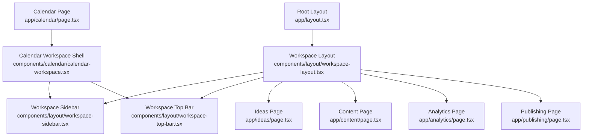
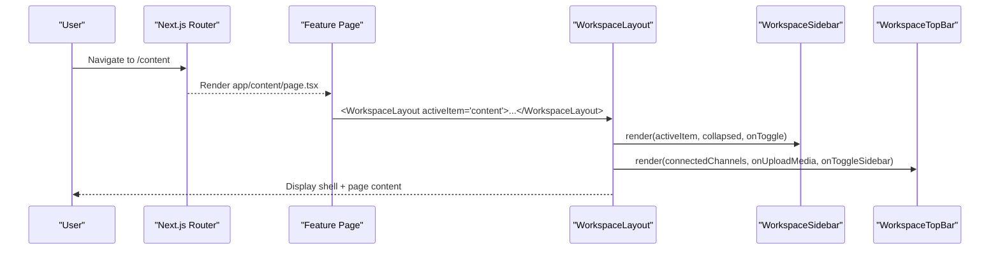
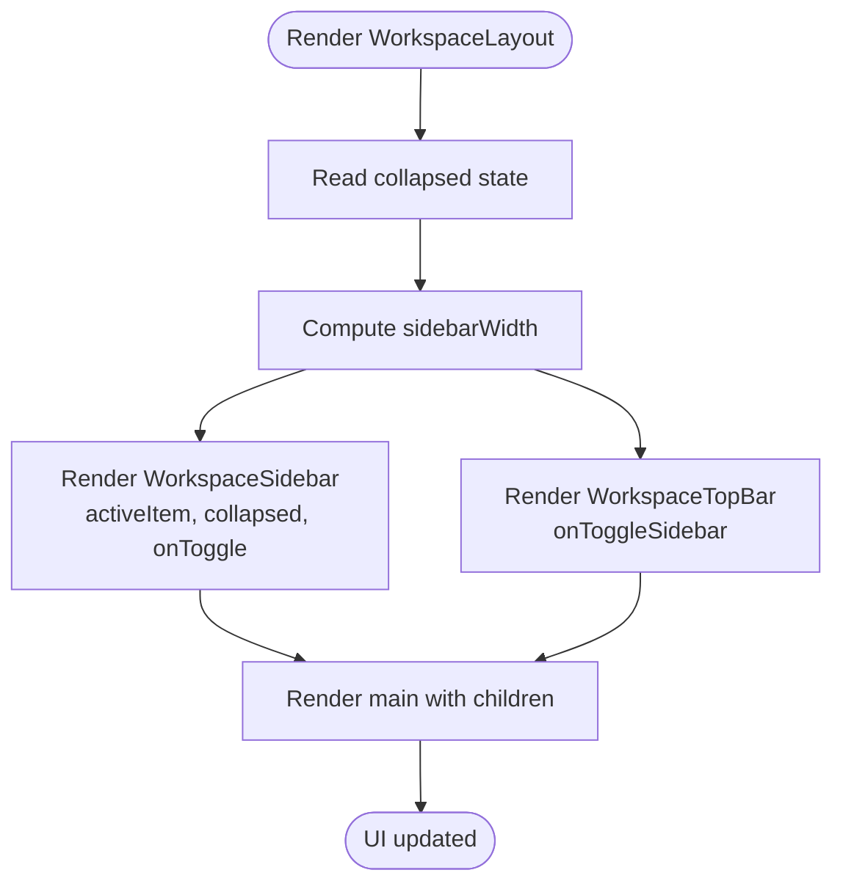
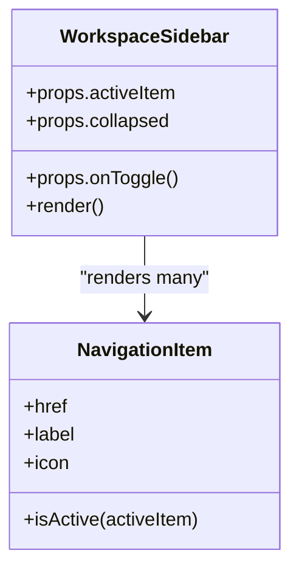
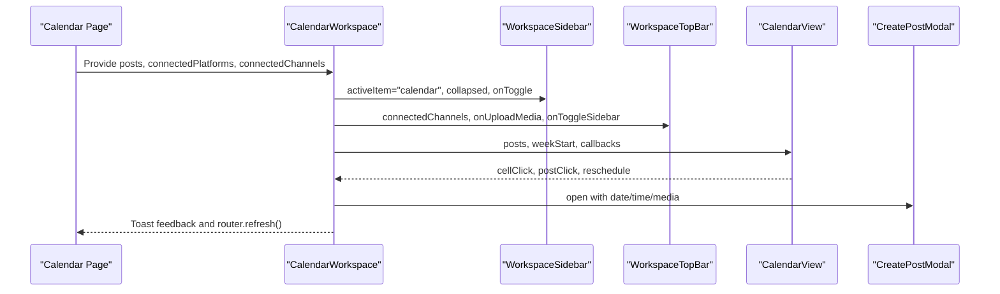
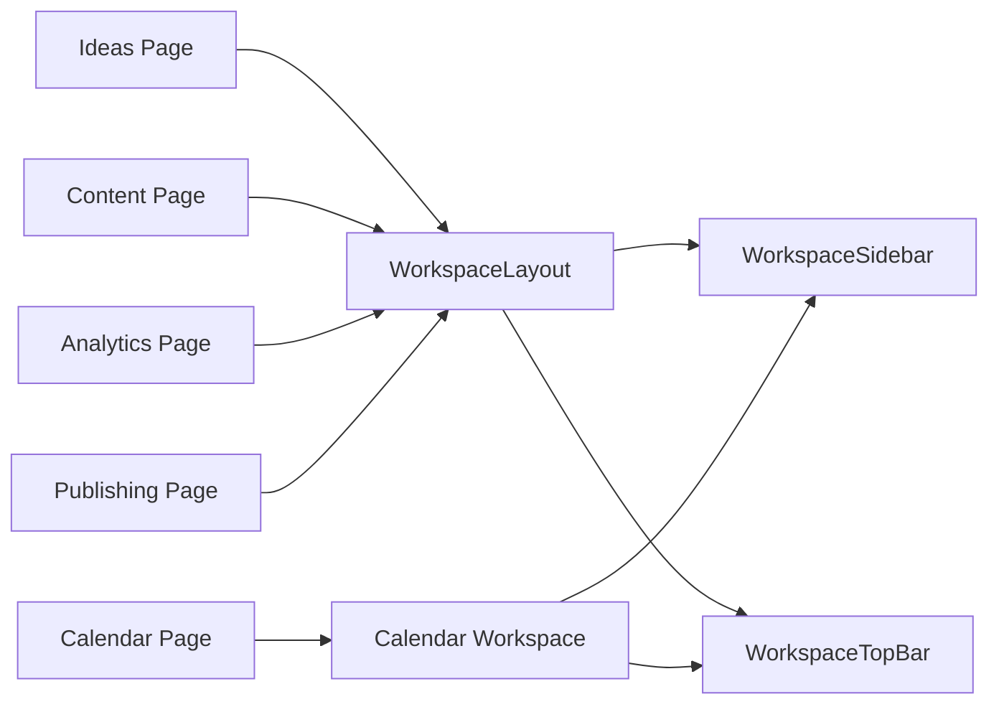

# Workspace Architecture

<cite>
**Referenced Files in This Document**
- [app/layout.tsx](file://app/layout.tsx)
- [components/layout/workspace-layout.tsx](file://components/layout/workspace-layout.tsx)
- [components/layout/workspace-sidebar.tsx](file://components/layout/workspace-sidebar.tsx)
- [components/layout/workspace-top-bar.tsx](file://components/layout/workspace-top-bar.tsx)
- [app/ideas/page.tsx](file://app/ideas/page.tsx)
- [app/content/page.tsx](file://app/content/page.tsx)
- [app/analytics/page.tsx](file://app/analytics/page.tsx)
- [app/publishing/page.tsx](file://app/publishing/page.tsx)
- [app/calendar/page.tsx](file://app/calendar/page.tsx)
- [components/calendar/calendar-workspace.tsx](file://components/calendar/calendar-workspace.tsx)
</cite>

## Table of Contents
1. [Introduction](#introduction)
2. [Project Structure](#project-structure)
3. [Core Components](#core-components)
4. [Architecture Overview](#architecture-overview)
5. [Detailed Component Analysis](#detailed-component-analysis)
6. [Dependency Analysis](#dependency-analysis)
7. [Performance Considerations](#performance-considerations)
8. [Troubleshooting Guide](#troubleshooting-guide)
9. [Conclusion](#conclusion)

## Introduction
This document describes the ContentOS workspace shell and layout architecture. It explains how the root layout composes the workspace container, sidebar navigation, top bar, and page content. It also covers responsive behavior, collapsed/expanded state management, navigation routing patterns, active item highlighting, and component composition strategies used across pages.

## Project Structure
The workspace is built on Next.js App Router with a shared layout system:
- Root HTML wrapper sets global fonts and body structure.
- A reusable WorkspaceLayout provides the shell (sidebar + top bar + main area).
- Feature pages wrap their content in WorkspaceLayout to inherit consistent chrome.
- The Calendar feature builds its own shell that mirrors the shared layout for consistency while hosting specialized UI.

**Diagram sources**
- [app/layout.tsx:27-38](file://app/layout.tsx#L27-L38)
- [components/layout/workspace-layout.tsx:13-40](file://components/layout/workspace-layout.tsx#L13-L40)
- [components/layout/workspace-sidebar.tsx:12-165](file://components/layout/workspace-sidebar.tsx#L12-L165)
- [components/layout/workspace-top-bar.tsx:15-91](file://components/layout/workspace-top-bar.tsx#L15-L91)
- [app/ideas/page.tsx:12-88](file://app/ideas/page.tsx#L12-L88)
- [app/content/page.tsx:16-98](file://app/content/page.tsx#L16-L98)
- [app/analytics/page.tsx:243-637](file://app/analytics/page.tsx#L243-L637)
- [app/publishing/page.tsx:52-184](file://app/publishing/page.tsx#L52-L184)
- [app/calendar/page.tsx:72-78](file://app/calendar/page.tsx#L72-L78)
- [components/calendar/calendar-workspace.tsx:55-329](file://components/calendar/calendar-workspace.tsx#L55-L329)

**Section sources**
- [app/layout.tsx:27-38](file://app/layout.tsx#L27-L38)
- [components/layout/workspace-layout.tsx:13-40](file://components/layout/workspace-layout.tsx#L13-L40)

## Core Components
- Root Layout: Provides global font variables and a full-height flex body that hosts application routes.
- WorkspaceLayout: Client component that renders the fixed sidebar, collapsible width, top bar, and scrollable main area. It manages collapsed state locally and passes it down.
- WorkspaceSidebar: Renders navigation links with active state based on an activeItem prop. Supports collapsed mode showing only icons.
- WorkspaceTopBar: Displays actions like upload media, connected profiles, and a toggle button to collapse/expand the sidebar.

Key responsibilities:
- Layout orchestration and responsive spacing via dynamic marginLeft based on collapsed state.
- Active navigation highlighting through explicit activeItem prop.
- Shared chrome reuse across multiple pages.

**Section sources**
- [components/layout/workspace-layout.tsx:13-40](file://components/layout/workspace-layout.tsx#L13-L40)
- [components/layout/workspace-sidebar.tsx:12-165](file://components/layout/workspace-sidebar.tsx#L12-L165)
- [components/layout/workspace-top-bar.tsx:15-91](file://components/layout/workspace-top-bar.tsx#L15-L91)

## Architecture Overview
The workspace follows a shell-and-pages pattern:
- Pages import WorkspaceLayout and pass activeItem to highlight the correct nav item.
- The layout controls sidebar collapse state and applies a dynamic margin to the content area.
- The calendar route uses a dedicated shell that reuses the same sidebar and top bar components to maintain visual consistency while hosting complex calendar logic.

**Diagram sources**
- [app/content/page.tsx:16-98](file://app/content/page.tsx#L16-L98)
- [components/layout/workspace-layout.tsx:13-40](file://components/layout/workspace-layout.tsx#L13-L40)
- [components/layout/workspace-sidebar.tsx:12-165](file://components/layout/workspace-sidebar.tsx#L12-L165)
- [components/layout/workspace-top-bar.tsx:15-91](file://components/layout/workspace-top-bar.tsx#L15-L91)

## Detailed Component Analysis

### WorkspaceLayout
- Manages collapsed state locally using client-side state.
- Computes sidebarWidth from collapsed boolean and applies it as inline style marginLeft to the content column.
- Passes activeItem to the sidebar and onToggle handlers to both sidebar and top bar.
- Wraps children in a scrollable main area.

Responsive considerations:
- Uses Tailwind classes for full viewport height and overflow handling.
- Collapsed sidebar reduces width; content area adapts via marginLeft.

State flow:
- Toggling updates local state and re-renders sidebar and content offset.

**Diagram sources**
- [components/layout/workspace-layout.tsx:13-40](file://components/layout/workspace-layout.tsx#L13-L40)

**Section sources**
- [components/layout/workspace-layout.tsx:13-40](file://components/layout/workspace-layout.tsx#L13-L40)

### WorkspaceSidebar
- Accepts activeItem to determine which link is highlighted.
- Renders two modes: expanded (icon + label) and collapsed (icon only).
- Each navigation item maps to a route path and compares against activeItem to apply active styling.

Active state management:
- Highlighted by comparing activeItem to each route’s key.
- No internal state; purely driven by props.

Navigation routing:
- Uses Next.js Link components to navigate between workspace sections.

**Diagram sources**
- [components/layout/workspace-sidebar.tsx:12-165](file://components/layout/workspace-sidebar.tsx#L12-L165)

**Section sources**
- [components/layout/workspace-sidebar.tsx:12-165](file://components/layout/workspace-sidebar.tsx#L12-L165)

### WorkspaceTopBar
- Displays actions such as Upload Media and profile selection.
- Shows connected channels with platform-specific colors and counts.
- Provides onToggleSidebar callback to control sidebar collapse from the top bar.

Integration points:
- Receives connectedChannels from parent or page data.
- Exposes onUploadMedia callback for page-specific media upload flows.

**Section sources**
- [components/layout/workspace-top-bar.tsx:15-91](file://components/layout/workspace-top-bar.tsx#L15-L91)

### Page Integration Patterns
Pages integrate with the workspace shell by:
- Importing WorkspaceLayout.
- Passing activeItem to match the current section.
- Rendering page-specific headers and content inside the layout’s main area.

Examples:
- Ideas page wraps content in WorkspaceLayout with activeItem="ideas".
- Content page uses activeItem="content".
- Analytics page uses activeItem="analytics".
- Publishing page uses activeItem="publishing".

Note: The AI Studio page currently does not use WorkspaceLayout; it implements its own header and layout.

**Section sources**
- [app/ideas/page.tsx:12-88](file://app/ideas/page.tsx#L12-L88)
- [app/content/page.tsx:16-98](file://app/content/page.tsx#L16-L98)
- [app/analytics/page.tsx:243-637](file://app/analytics/page.tsx#L243-L637)
- [app/publishing/page.tsx:52-184](file://app/publishing/page.tsx#L52-L184)

### Calendar Workspace Shell
The calendar route builds a custom shell that mirrors the shared layout:
- Renders WorkspaceSidebar and WorkspaceTopBar directly.
- Manages its own collapsed state and passes it to the sidebar and top bar.
- Hosts calendar-specific toolbar, grid, media drawer, create post modal, and toast notifications.

Data flow:
- Server page fetches scheduled publications and connected channels.
- Passes them into the client-side CalendarWorkspace component.
- Handles rescheduling via server action and refreshes the router.

**Diagram sources**
- [app/calendar/page.tsx:72-78](file://app/calendar/page.tsx#L72-L78)
- [components/calendar/calendar-workspace.tsx:55-329](file://components/calendar/calendar-workspace.tsx#L55-L329)

**Section sources**
- [app/calendar/page.tsx:72-78](file://app/calendar/page.tsx#L72-L78)
- [components/calendar/calendar-workspace.tsx:55-329](file://components/calendar/calendar-workspace.tsx#L55-L329)

## Dependency Analysis
- WorkspaceLayout depends on WorkspaceSidebar and WorkspaceTopBar.
- Feature pages depend on WorkspaceLayout to share chrome.
- Calendar route depends on a dedicated shell that reuses the same sidebar and top bar components.
- Active item propagation is prop-driven; no global context is used for navigation state.

**Diagram sources**
- [app/ideas/page.tsx:12-88](file://app/ideas/page.tsx#L12-L88)
- [app/content/page.tsx:16-98](file://app/content/page.tsx#L16-L98)
- [app/analytics/page.tsx:243-637](file://app/analytics/page.tsx#L243-L637)
- [app/publishing/page.tsx:52-184](file://app/publishing/page.tsx#L52-L184)
- [components/layout/workspace-layout.tsx:13-40](file://components/layout/workspace-layout.tsx#L13-L40)
- [components/calendar/calendar-workspace.tsx:55-329](file://components/calendar/calendar-workspace.tsx#L55-L329)

**Section sources**
- [components/layout/workspace-layout.tsx:13-40](file://components/layout/workspace-layout.tsx#L13-L40)
- [components/calendar/calendar-workspace.tsx:55-329](file://components/calendar/calendar-workspace.tsx#L55-L329)

## Performance Considerations
- Collapsed state is managed locally within WorkspaceLayout and CalendarWorkspace, minimizing re-renders to the shell.
- Sidebar width is computed inline to avoid layout thrashing during transitions.
- Calendar route performs server-side data fetching and passes minimal data to the client shell, reducing initial payload.
- Using Next.js Link for navigation avoids full-page reloads where possible.

[No sources needed since this section provides general guidance]

## Troubleshooting Guide
Common issues and resolutions:
- Active item not highlighting: Ensure the page passes the correct activeItem value matching one of the sidebar keys.
- Sidebar not collapsing from top bar: Verify onToggleSidebar is wired to update the collapsed state in the owning layout/shell.
- Calendar sidebar state mismatch: Confirm the calendar shell maintains its own collapsed state and passes it to both sidebar and top bar.
- Media upload not triggering: Check that onUploadMedia is provided and implemented in the page or shell.

**Section sources**
- [components/layout/workspace-layout.tsx:13-40](file://components/layout/workspace-layout.tsx#L13-L40)
- [components/layout/workspace-top-bar.tsx:15-91](file://components/layout/workspace-top-bar.tsx#L15-L91)
- [components/calendar/calendar-workspace.tsx:55-329](file://components/calendar/calendar-workspace.tsx#L55-L329)

## Conclusion
The ContentOS workspace uses a consistent shell pattern with a shared layout and reusable sidebar/top bar components. Active navigation state is passed explicitly via props, keeping components simple and predictable. The calendar route demonstrates how a feature can build its own shell while reusing the same UI primitives. Responsive behavior is achieved through flexible layouts and dynamic margins tied to collapsed state. This design supports easy extension for new pages and features while maintaining a cohesive user experience.